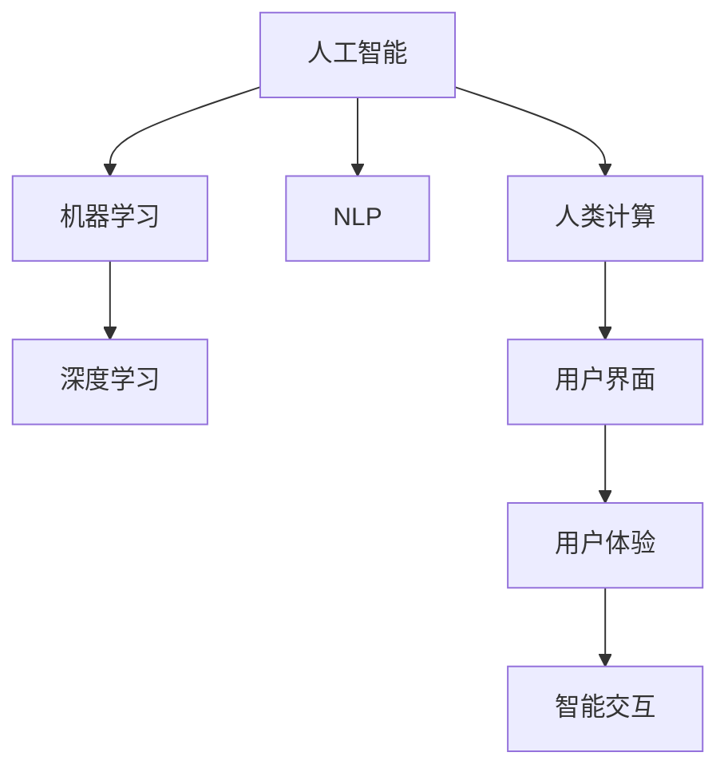

                 

# AI驱动的创新：人类计算在商业中的应用趋势

## 1. 背景介绍

在过去的十年里，人工智能（AI）和机器学习（ML）技术的迅猛发展极大地改变了商业世界的运行模式。这些技术不仅在数据分析、产品推荐、客户服务等方面展示了强大的能力，还在推动企业转型、创新和增长中起到了关键作用。人类计算（Human-Computer Interaction, HCI），作为AI与商业结合的重要环节，正逐渐成为企业竞争的新焦点。

### 1.1 问题由来

随着技术的进步，越来越多的企业开始探索和采用AI技术来驱动业务创新。然而，AI在商业应用中面临诸多挑战，包括数据隐私、算法透明性、决策可解释性等问题。这些问题不仅阻碍了AI技术的普及，也影响了其对企业长期价值的贡献。因此，结合人类计算和AI技术，实现智能化的交互体验和决策支持，成为未来企业应用AI的重要方向。

### 1.2 问题核心关键点

为了更好地理解AI与人类计算在商业中的应用趋势，本节将介绍几个关键点：

- 人工智能与人类计算的融合：AI技术在处理大数据和复杂问题上的优势，与人类计算在交互体验、情感理解和道德判断方面的特点相结合，形成了新的应用模式。
- AI技术在商业中的具体应用：从数据分析、决策支持、客户服务到产品推荐等，AI正在不断重塑各个商业领域的运营方式。
- 人类计算在AI应用中的作用：交互界面、用户反馈、情境感知等方面，人类计算与AI技术相辅相成，共同推动业务创新。

## 2. 核心概念与联系

### 2.1 核心概念概述

为更好地理解AI与人类计算在商业中的融合应用，本节将介绍几个核心概念：

- **人工智能（AI）**：指通过计算机算法和数据处理实现模拟人类智能的技术，包括机器学习、深度学习、自然语言处理（NLP）等。
- **机器学习（ML）**：一种使计算机通过数据分析和模型训练自动改进算法的能力。
- **深度学习（DL）**：一种基于多层神经网络的机器学习方法，可以处理复杂的数据模式。
- **自然语言处理（NLP）**：使计算机能够理解、处理和生成人类语言的技术。
- **人类计算（HCI）**：涉及人机交互的设计和实现，旨在提供更加自然、高效、人性化的计算体验。
- **用户界面（UI）**：系统与用户交互的界面，是AI和HCI结合的重要界面。
- **用户体验（UX）**：系统提供给用户的整体体验，包括易用性、功能性、情感共鸣等方面。

这些概念之间的联系可以通过以下Mermaid流程图来展示：



这个流程图展示了几大核心概念之间的相互联系：

1. 人工智能通过机器学习和深度学习算法处理数据。
2. 自然语言处理作为AI的一个重要分支，处理文本和语音数据。
3. 人类计算与AI技术结合，通过用户界面和用户体验提供智能化的交互体验。
4. 智能交互则体现了AI与HCI的紧密结合，提升了系统的互动性和用户满意度。

## 3. 核心算法原理 & 具体操作步骤

### 3.1 算法原理概述

AI与人类计算在商业应用中的核心算法原理主要体现在以下几个方面：

- **数据驱动**：通过收集和分析大量数据，AI算法能够从中发现数据中的模式和规律，提供决策支持。
- **模型训练**：AI通过大量的样本数据进行模型训练，优化参数，提升预测准确性。
- **用户反馈**：通过用户界面和用户体验获取反馈，进一步调整和优化算法，提升系统性能。
- **交互优化**：基于用户的行为和情感数据，优化人机交互界面，提升用户体验。

### 3.2 算法步骤详解

AI与人类计算在商业应用的算法步骤主要包括以下几个方面：

1. **数据采集与清洗**：收集和处理商业运营中的数据，包括客户行为数据、交易数据、产品数据等，确保数据的质量和完整性。
2. **模型训练与优化**：使用AI算法对数据进行训练，调整模型参数，提升预测准确性。
3. **用户交互设计**：设计直观、易用的用户界面，确保用户能够方便地与系统进行交互。
4. **用户反馈收集与分析**：通过用户界面收集用户反馈，分析用户行为和情感，优化系统功能和交互体验。
5. **迭代改进**：根据用户反馈和业务需求，不断迭代和优化算法和用户界面，提升系统性能和用户体验。

### 3.3 算法优缺点

AI与人类计算在商业应用的算法优缺点如下：

**优点**：

1. **高效性**：AI算法可以快速处理大量数据，提供实时的决策支持。
2. **准确性**：基于数据驱动的AI模型能够提供高精度的预测结果。
3. **可扩展性**：AI算法可以轻松扩展到不同的业务场景，提升企业竞争力。

**缺点**：

1. **数据隐私**：AI算法需要大量数据进行训练，可能导致数据隐私泄露。
2. **模型透明度**：AI模型的决策过程不透明，难以解释。
3. **用户接受度**：用户可能对AI驱动的系统感到不安或不信任。
4. **技术门槛**：开发和维护AI系统需要较高的技术门槛，成本较高。

### 3.4 算法应用领域

AI与人类计算在商业应用中的应用领域非常广泛，包括但不限于以下几个方面：

- **客户关系管理（CRM）**：通过分析客户数据，提供个性化的营销和服务。
- **供应链管理**：利用AI优化库存管理、物流调度和供应商选择。
- **市场分析**：通过分析市场数据，预测市场趋势和消费者行为。
- **产品推荐**：根据用户行为和偏好，提供个性化的产品推荐。
- **智能客服**：通过自然语言处理技术，提供24小时不间断的客户服务。
- **财务分析**：利用AI技术进行财务预测、风险管理和审计工作。
- **人力资源管理**：通过AI分析员工绩效和招聘数据，优化人力资源管理。

## 4. 数学模型和公式 & 详细讲解 & 举例说明

### 4.1 数学模型构建

在商业应用中，AI与人类计算的数学模型构建主要包括以下几个方面：

- **预测模型**：如线性回归、逻辑回归、决策树、随机森林等。
- **分类模型**：如支持向量机、K近邻算法、神经网络等。
- **聚类模型**：如K-means、DBSCAN等。
- **推荐模型**：如协同过滤、矩阵分解等。

### 4.2 公式推导过程

以线性回归模型为例，推导其在商业应用中的基本公式。

设自变量为$X$，因变量为$Y$，线性回归模型的目标是最小化预测值与实际值之间的误差平方和。其最小二乘法公式为：

$$
\min \sum_{i=1}^{n}(Y_i - \hat{Y}_i)^2
$$

其中，$\hat{Y}_i$ 为线性回归模型的预测值，可以表示为：

$$
\hat{Y}_i = \beta_0 + \beta_1X_{i1} + \beta_2X_{i2} + \cdots + \beta_pX_{ip}
$$

其中，$\beta_0,\beta_1,\cdots,\beta_p$ 为模型的参数，$n$ 为样本数量，$X_{ij}$ 为第$i$个样本的第$j$个特征值。

### 4.3 案例分析与讲解

假设某电商公司希望利用AI预测用户的购买行为，可以使用线性回归模型构建预测公式。通过收集用户历史购买数据、浏览数据、个人信息等，作为模型的输入特征$X$。设定预测模型参数$\beta_0,\beta_1,\cdots,\beta_p$，使用训练集进行模型训练，得到预测模型$\hat{Y}$。在测试集上评估模型性能，调整参数，最终得到精确的预测模型。

## 5. 项目实践：代码实例和详细解释说明

### 5.1 开发环境搭建

在进行项目实践前，我们需要准备好开发环境。以下是使用Python进行PyTorch开发的环境配置流程：

1. 安装Anaconda：从官网下载并安装Anaconda，用于创建独立的Python环境。

2. 创建并激活虚拟环境：
```bash
conda create -n pytorch-env python=3.8 
conda activate pytorch-env
```

3. 安装PyTorch：根据CUDA版本，从官网获取对应的安装命令。例如：
```bash
conda install pytorch torchvision torchaudio cudatoolkit=11.1 -c pytorch -c conda-forge
```

4. 安装TensorFlow：
```bash
pip install tensorflow
```

5. 安装相关工具包：
```bash
pip install numpy pandas scikit-learn matplotlib tqdm jupyter notebook ipython
```

完成上述步骤后，即可在`pytorch-env`环境中开始项目实践。

### 5.2 源代码详细实现

这里我们以推荐系统为例，给出使用PyTorch和TensorFlow进行商业推荐系统的代码实现。

首先，定义推荐系统的模型结构：

```python
import torch.nn as nn
import tensorflow as tf

class RecommenderModel(nn.Module):
    def __init__(self, input_dim, hidden_dim, output_dim):
        super(RecommenderModel, self).__init__()
        self.hidden = nn.Linear(input_dim, hidden_dim)
        self.output = nn.Linear(hidden_dim, output_dim)
        
    def forward(self, x):
        x = torch.relu(self.hidden(x))
        x = self.output(x)
        return x
```

然后，定义训练和评估函数：

```python
def train_model(model, optimizer, criterion, train_loader, device, epochs):
    model.to(device)
    for epoch in range(epochs):
        for batch in train_loader:
            inputs, labels = batch.to(device)
            optimizer.zero_grad()
            outputs = model(inputs)
            loss = criterion(outputs, labels)
            loss.backward()
            optimizer.step()
    return model

def evaluate_model(model, test_loader, device):
    model.eval()
    total_loss = 0
    with torch.no_grad():
        for batch in test_loader:
            inputs, labels = batch.to(device)
            outputs = model(inputs)
            loss = criterion(outputs, labels)
            total_loss += loss.item()
    return total_loss / len(test_loader)
```

最后，启动训练流程并在测试集上评估：

```python
from torch.utils.data import DataLoader
from torch.optim import Adam

input_dim = 10
hidden_dim = 20
output_dim = 1
model = RecommenderModel(input_dim, hidden_dim, output_dim)
optimizer = Adam(model.parameters(), lr=0.001)
criterion = nn.MSELoss()

device = torch.device('cuda' if torch.cuda.is_available() else 'cpu')
train_loader = DataLoader(train_dataset, batch_size=32, shuffle=True)
test_loader = DataLoader(test_dataset, batch_size=32, shuffle=True)

epochs = 10
train_model(model, optimizer, criterion, train_loader, device, epochs)
test_loss = evaluate_model(model, test_loader, device)
print("Test loss:", test_loss)
```

以上就是使用PyTorch和TensorFlow进行商业推荐系统的完整代码实现。可以看到，借助TensorFlow和PyTorch的强大功能，开发AI与人类计算在商业中的应用项目变得简单高效。

### 5.3 代码解读与分析

让我们再详细解读一下关键代码的实现细节：

**RecommenderModel类**：
- `__init__`方法：初始化模型参数，定义输入层、隐藏层和输出层。
- `forward`方法：前向传播计算模型的输出。

**train_model函数**：
- 将模型移动到指定设备（CPU或GPU），进行多轮训练。
- 对每个批次的数据进行前向传播和反向传播，更新模型参数。

**evaluate_model函数**：
- 对测试集进行前向传播，计算模型的预测误差。

**训练流程**：
- 定义模型的输入维度、隐藏层维度和输出维度。
- 创建模型、优化器和损失函数。
- 定义训练数据集和测试数据集。
- 在指定设备上训练模型，并评估模型在测试集上的性能。

可以看到，TensorFlow和PyTorch的强大功能和灵活性，使得商业AI系统的开发变得更加简单高效。

当然，实际商业系统开发还需要考虑更多因素，如模型的保存和部署、超参数的自动搜索、更灵活的任务适配层等。但核心的算法思想基本与此类似。

## 6. 实际应用场景

### 6.1 智能客服系统

基于AI与人类计算的智能客服系统，可以大大提升客户服务的效率和质量。通过收集历史客服对话记录，训练AI模型预测客户需求和回答，结合人类客服的专业知识和经验，提供更准确、人性化的服务。智能客服系统可以7x24小时不间断服务，快速响应客户咨询，用自然流畅的语言解答各类常见问题，提高客户满意度。

### 6.2 金融市场分析

金融市场数据量大且复杂，传统的人工分析方式难以应对。利用AI与人类计算的结合，可以实时监测市场舆情，预测股票价格和风险，辅助投资决策。系统可以通过自然语言处理技术，分析新闻、报告、评论等文本数据，识别市场情绪和趋势，提供实时的投资建议。此外，通过智能交互界面，投资者可以轻松输入交易策略和偏好，系统自动生成最优投资组合，提升投资收益。

### 6.3 电子商务推荐系统

电子商务平台需要向用户推荐个性化商品，提高转化率和销售额。AI与人类计算的结合，可以实现基于用户行为和偏好的精准推荐。系统可以通过收集用户浏览、购买数据，训练AI模型预测用户偏好，结合人类用户的反馈和经验，动态生成个性化推荐列表。智能交互界面可以实时反馈用户的选择和满意度，进一步优化推荐算法和用户体验。

### 6.4 未来应用展望

随着AI与人类计算技术的不断进步，未来在商业应用中将有更多突破。

- **个性化推荐**：利用AI技术，可以更精准地预测用户需求，提供个性化推荐。结合人类计算的用户体验设计，提升推荐系统的吸引力和用户满意度。
- **智能决策支持**：通过AI与人类计算的结合，可以提供实时的决策支持和建议，帮助企业快速响应市场变化，优化运营决策。
- **虚拟助手**：基于自然语言处理和智能交互技术，开发虚拟助手，可以提供全天候的业务支持，提升企业运营效率。
- **智能合约**：利用AI与区块链技术的结合，开发智能合约，实现自动化和智能化的业务流程管理。
- **自动化财务分析**：通过AI与人类计算的结合，可以自动化完成财务报表分析、审计等工作，提升财务工作效率。

## 7. 工具和资源推荐

### 7.1 学习资源推荐

为了帮助开发者系统掌握AI与人类计算的理论基础和实践技巧，这里推荐一些优质的学习资源：

1. **《深度学习》课程**：斯坦福大学开设的深度学习课程，提供了大量视频、讲义和作业，帮助你系统学习AI技术。
2. **《人工智能导论》书籍**：介绍了AI的基本概念、历史和应用，适合初学者和进阶读者。
3. **TensorFlow官方文档**：提供了丰富的TensorFlow教程和API文档，帮助开发者快速上手。
4. **PyTorch官方文档**：提供了丰富的PyTorch教程和API文档，帮助开发者快速上手。
5. **HuggingFace官方文档**：提供了丰富的预训练语言模型和微调样例，适合开发者实践。

通过对这些资源的学习实践，相信你一定能够快速掌握AI与人类计算的精髓，并用于解决实际的商业问题。

### 7.2 开发工具推荐

高效的开发离不开优秀的工具支持。以下是几款用于AI与人类计算开发常用的工具：

1. **Jupyter Notebook**：免费的交互式编程环境，支持Python和多种库，适合数据探索和模型训练。
2. **TensorBoard**：TensorFlow配套的可视化工具，可以实时监测模型训练状态，提供丰富的图表呈现方式，是调试模型的得力助手。
3. **Weights & Biases**：模型训练的实验跟踪工具，可以记录和可视化模型训练过程中的各项指标，方便对比和调优。
4. **HuggingFace Transformers库**：提供了丰富的预训练语言模型和微调样例，适合开发者实践。
5. **Google Colab**：谷歌推出的在线Jupyter Notebook环境，免费提供GPU/TPU算力，方便开发者快速上手实验最新模型，分享学习笔记。

合理利用这些工具，可以显著提升AI与人类计算项目的开发效率，加快创新迭代的步伐。

### 7.3 相关论文推荐

AI与人类计算的结合领域涌现了大量前沿研究成果，以下是几篇具有代表性的论文，推荐阅读：

1. **《深度学习》**：由深度学习领域的顶尖专家撰写，全面介绍了深度学习的基本概念和应用。
2. **《自然语言处理基础》**：介绍了自然语言处理的基本概念和技术，适合初学者和进阶读者。
3. **《人类计算与AI结合的应用研究》**：探讨了人类计算与AI技术结合的多种应用场景，具有较强的实践指导意义。
4. **《AI与人类计算的融合创新》**：介绍了AI与人类计算在商业应用中的多种创新模式和案例，具有较强的启示性。

这些论文代表了大语言模型微调技术的发展脉络。通过学习这些前沿成果，可以帮助研究者把握学科前进方向，激发更多的创新灵感。

## 8. 总结：未来发展趋势与挑战

### 8.1 总结

本文对AI与人类计算在商业中的应用趋势进行了全面系统的介绍。首先阐述了AI与人类计算在商业中的融合应用的背景和意义，明确了AI与人类计算在提升业务效率和用户体验方面的独特价值。其次，从原理到实践，详细讲解了AI与人类计算在商业应用中的数学模型和算法步骤，给出了AI与人类计算在商业中的完整代码实例。同时，本文还广泛探讨了AI与人类计算在智能客服、金融市场分析、电子商务推荐等多个商业领域的应用前景，展示了AI与人类计算范式的巨大潜力。

通过本文的系统梳理，可以看到，AI与人类计算在商业中的应用正在成为新的发展趋势，极大地拓展了AI技术的应用边界，催生了更多的落地场景。AI与人类计算技术的结合，使得企业在数据驱动、智能决策、个性化推荐等方面具备了更强的能力，有望进一步推动商业的数字化转型。

### 8.2 未来发展趋势

展望未来，AI与人类计算在商业应用中将呈现以下几个发展趋势：

1. **智能化程度提升**：随着AI技术的不断进步，AI与人类计算的结合将进一步提升系统的智能化水平，实现更精准的决策和推荐。
2. **个性化服务优化**：结合人类计算的用户体验设计，AI系统将能够提供更个性化、多样化的服务，提升用户满意度和粘性。
3. **跨领域应用拓展**：AI与人类计算的结合将不断拓展到更多的商业领域，如医疗、教育、娱乐等，带来更多创新应用。
4. **自动化与协同工作**：AI与人类计算的结合将实现更多自动化任务和协同工作，提升企业运营效率。
5. **伦理与安全性保障**：随着AI与人类计算的普及，数据隐私、模型透明性和安全性等问题将受到更多关注，企业需要采取相应的技术和措施保障用户数据和系统的安全。

以上趋势凸显了AI与人类计算在商业中的广阔前景。这些方向的探索发展，必将进一步提升AI与人类计算在商业中的应用价值，为企业的创新和成长注入新的动力。

### 8.3 面临的挑战

尽管AI与人类计算在商业应用中展现出强大的潜力，但在迈向更加智能化、普适化应用的过程中，它仍面临着诸多挑战：

1. **数据隐私与伦理**：AI与人类计算的结合需要大量数据进行训练和优化，但数据隐私和伦理问题仍需引起高度关注。
2. **模型透明性与可解释性**：AI模型的决策过程不透明，难以解释，这可能影响用户信任和接受度。
3. **技术门槛与成本**：开发和维护AI与人类计算系统需要较高的技术门槛和成本，企业需要投入大量资源。
4. **用户接受度与交互体验**：用户可能对AI系统感到不安或不信任，需要通过设计更自然的交互体验来提升用户接受度。
5. **系统复杂性与维护成本**：AI与人类计算的系统复杂性较高，需要不断进行迭代和维护，成本较高。

### 8.4 研究展望

面对AI与人类计算在商业应用中面临的挑战，未来的研究需要在以下几个方面寻求新的突破：

1. **隐私保护技术**：开发更加安全的数据加密和隐私保护技术，保护用户隐私和数据安全。
2. **可解释性AI**：研究和开发更可解释的AI模型，提升模型的透明度和可信度。
3. **轻量级系统架构**：优化系统架构，提高系统的灵活性和可扩展性，降低开发和维护成本。
4. **智能交互设计**：结合人类计算的用户体验设计，开发更加自然、易用的交互界面，提升用户接受度。
5. **多模态融合**：结合语音、图像、文本等多种模态数据，实现更全面的信息整合和应用。
6. **伦理与安全规范**：制定AI与人类计算应用的伦理和安全规范，确保系统的合法性和道德性。

这些研究方向的探索，必将引领AI与人类计算技术在商业中的应用走向更高的台阶，为构建智能、安全、可解释的商业系统铺平道路。

## 9. 附录：常见问题与解答

**Q1：AI与人类计算的结合能否应用于所有商业领域？**

A: AI与人类计算的结合在许多商业领域中都能取得良好的应用效果，但并不是所有领域都适合采用AI技术。对于一些需要高度人类情感和专业知识的领域，如医疗、教育、司法等，AI与人类计算的结合需要更加谨慎和细致的设计。

**Q2：AI与人类计算结合的商业应用有哪些？**

A: AI与人类计算结合的商业应用非常广泛，包括但不限于：

1. 智能客服：通过AI技术处理客户咨询，结合人类客服的专业知识提供个性化的服务。
2. 金融分析：利用AI技术分析金融市场数据，提供实时的市场预测和投资建议。
3. 电子商务：基于用户行为和偏好进行个性化推荐，提高销售转化率。
4. 医疗诊断：结合自然语言处理技术和专家知识，辅助医生进行诊断和治疗。
5. 供应链管理：通过AI技术优化库存管理和物流调度，提高供应链效率。
6. 智能合约：结合AI技术与区块链技术，实现自动化的业务流程管理。

**Q3：如何设计AI与人类计算的交互界面？**

A: 设计AI与人类计算的交互界面需要考虑以下几个关键点：

1. 简洁明了：界面设计应简洁明了，避免复杂的操作和冗余的信息。
2. 自然流畅：界面应尽可能自然流畅，让用户感觉与系统互动就像与人对话一样。
3. 实时反馈：界面应提供实时反馈，让用户能够快速了解系统的操作状态和结果。
4. 个性化设计：界面设计应根据用户的偏好和需求进行个性化调整，提升用户体验。
5. 安全性保障：界面设计应确保数据安全和隐私保护，避免数据泄露和滥用。

通过设计更加自然、易用的交互界面，AI与人类计算的结合将能够提供更好的用户体验，提升系统的实用性和可接受度。

**Q4：AI与人类计算结合的商业应用有哪些优势？**

A: AI与人类计算结合的商业应用有以下优势：

1. 高效性：AI与人类计算的结合可以处理大量数据，提供实时的决策支持。
2. 个性化服务：通过AI技术，系统能够提供个性化的推荐和服务，提升用户体验。
3. 智能化决策：结合人类计算的知识和经验，AI系统可以提供更智能、准确的决策支持。
4. 实时反馈：通过智能交互界面，用户可以实时反馈和调整，提升系统的灵活性和适应性。
5. 跨领域应用：AI与人类计算的结合可以拓展到更多的商业领域，带来更多创新应用。

这些优势使得AI与人类计算的结合在商业中具备了巨大的应用潜力。

---

作者：禅与计算机程序设计艺术 / Zen and the Art of Computer Programming

