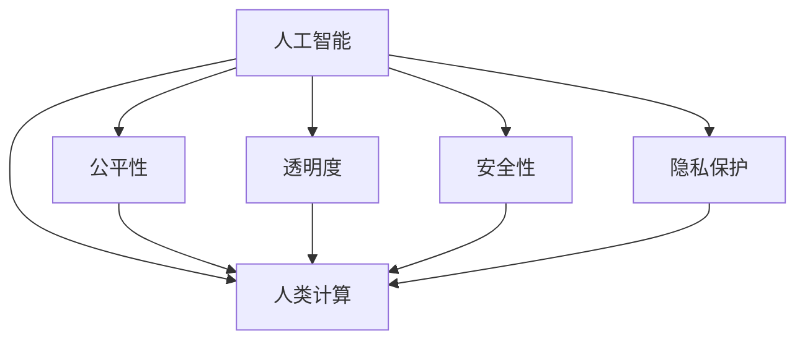

                 

# AI驱动的创新：人类计算在商业中的道德考虑因素与应用

## 1. 背景介绍

### 1.1 问题由来
随着人工智能（AI）技术的不断进步，人类计算的范畴和影响力正在快速扩展。从简单的自动化任务到复杂的决策支持，AI系统在商业中的应用变得无处不在。然而，这些AI系统的发展不仅依赖于技术创新，更带来了诸多道德挑战。如何确保这些技术的道德应用，成为商业界和社会大众普遍关注的问题。

### 1.2 问题核心关键点
本文聚焦于AI在商业中的道德考虑因素与应用。AI系统在提升企业效率、优化用户体验的同时，也涉及隐私保护、公平性、透明度、安全性等多个伦理维度。如何在创新与道德之间找到平衡，是当前及未来技术应用的重要课题。

### 1.3 问题研究意义
研究和解决AI在商业中的道德问题，不仅有助于构建公正、透明、可靠的技术环境，还能促进技术与社会、经济、法律等多领域的协同发展。通过深入探索这些问题，可以为AI技术的长远健康发展奠定基础，为企业的合规运营和社会的和谐共处提供指南。

## 2. 核心概念与联系

### 2.1 核心概念概述

为更好地理解AI在商业中的道德应用，本文将介绍几个关键概念：

- 人工智能（AI）：通过算法和数据训练，使计算机系统能够执行人类智能任务的技术，包括但不限于机器学习、深度学习、自然语言处理等。
- 人类计算（Human Computation）：指通过人工智能技术，辅助人类完成决策、分析、优化等复杂任务，提升人类工作效率和质量的过程。
- 公平性（Fairness）：AI系统在决策中应遵循的公正原则，要求系统不对任何特定群体或个体产生不公平的歧视。
- 透明度（Transparency）：指AI系统在执行决策时应具备的可解释性，即能够清晰解释其决策依据和过程。
- 安全性（Safety）：AI系统在运行时应确保不产生对人类或环境有害的影响。
- 隐私保护（Privacy Protection）：指在AI系统开发和应用过程中，保护用户个人数据的机密性和完整性，防止信息泄露和滥用。

这些概念之间的逻辑关系可以通过以下Mermaid流程图来展示：



这个流程图展示了几大核心概念之间的联系：人工智能技术通过人类计算辅助人类完成任务，同时也需要考虑系统的公平性、透明度、安全性和隐私保护。这些伦理因素共同构成了AI技术在商业应用中的道德考量。

## 3. 核心算法原理 & 具体操作步骤

### 3.1 算法原理概述

AI在商业中的应用通常依赖于机器学习（Machine Learning, ML）和深度学习（Deep Learning, DL）算法，这些算法通过训练数据集学习特征和模式，实现对复杂问题的自动化处理。在商业场景中，这些算法被广泛应用于预测分析、个性化推荐、客户服务、供应链管理等多个领域。

AI系统的道德应用涉及到以下几个关键点：

- 数据质量与公平性：AI系统依赖于高质量的训练数据，数据中存在的偏见可能导致模型在决策中产生歧视。
- 算法透明度与可解释性：深度学习模型通常被视为"黑盒"系统，难以解释其内部决策过程。
- 用户隐私与数据保护：AI系统在处理用户数据时，需要遵守数据保护法规，确保用户信息的安全。
- 安全性与风险管理：AI系统在处理敏感数据或关键任务时，需确保系统的可靠性和鲁棒性，防止恶意攻击和错误决策。

### 3.2 算法步骤详解

AI在商业中的道德应用主要包括以下几个步骤：

**Step 1: 数据收集与处理**
- 收集用于训练AI系统的数据集，确保数据的多样性和代表性。
- 对数据进行清洗、标注和预处理，去除噪音和偏见，提高数据质量。
- 设计公平性评估指标，如性别、种族、年龄等的平衡性，确保数据集公平无偏。

**Step 2: 模型训练与评估**
- 选择合适的机器学习或深度学习模型，并设定合适的超参数。
- 训练模型，确保模型在公平性、透明度、安全性等方面符合伦理要求。
- 评估模型的性能，并使用公平性、隐私保护、安全性等指标对模型进行全面审查。

**Step 3: 系统部署与监控**
- 将训练好的模型部署到实际业务系统中，实现自动化决策和任务执行。
- 设计监控机制，实时监测AI系统在运行中的表现，及时发现和处理问题。
- 建立用户反馈和投诉机制，收集用户对AI系统的使用体验和意见。

**Step 4: 伦理审查与合规**
- 定期进行伦理审查，评估AI系统在公平性、透明度、安全性、隐私保护等方面的表现。
- 与法律、政策等机构合作，确保AI系统的合规性。
- 制定和执行AI系统的伦理准则和操作规程，确保其道德应用。

### 3.3 算法优缺点

AI在商业中的道德应用具有以下优点：

1. 提升效率与准确性：AI系统通过自动化处理，提升了商业活动的效率和准确性，减少了人为错误和偏见。
2. 数据驱动决策：AI系统依赖于数据驱动的决策模式，可以提供更为客观和科学的决策支持。
3. 降低成本：AI系统减少了对人力的依赖，降低了企业的运营成本。

同时，也存在以下局限：

1. 数据偏见与歧视：如果训练数据存在偏见，AI系统在决策过程中可能产生歧视，导致不公平现象。
2. 算法透明性不足：深度学习模型通常难以解释其决策过程，增加了模型的不可信性。
3. 隐私风险：AI系统处理大量个人数据时，可能泄露用户隐私，引发隐私保护问题。
4. 安全性风险：AI系统在处理敏感数据时，可能遭受网络攻击，导致数据泄露或系统崩溃。

尽管存在这些局限，但AI在商业中的道德应用仍是大势所趋。未来，如何通过技术创新和伦理治理，最大化AI技术的优势，最小化其风险，将是企业和学术界共同努力的方向。

### 3.4 算法应用领域

AI在商业中的应用领域广泛，涵盖以下几类：

1. **客户关系管理（CRM）**：通过分析客户数据，提供个性化的营销和客户服务。
2. **供应链管理**：利用预测分析优化库存管理、物流调度等，提升供应链效率。
3. **金融服务**：在风险评估、信用评分、反欺诈等领域，提高金融决策的精准性和安全性。
4. **医疗健康**：辅助医生诊断、疾病预测、个性化治疗方案推荐，提升医疗服务质量。
5. **人力资源管理**：通过数据分析优化招聘流程、员工培训、绩效评估，提升人力资源管理水平。
6. **市场营销**：基于用户行为和偏好分析，实现精准营销和广告投放。

以上领域展示了AI技术在商业中的广泛应用，未来随着技术的进步，AI将进一步深入到更多商业场景中，推动商业模式的创新和发展。

## 4. 数学模型和公式 & 详细讲解

### 4.1 数学模型构建

本文将通过一个简单的机器学习案例，展示AI在商业中的应用及其道德考量。

假设我们有一个电子商务平台，希望通过AI系统优化产品推荐，提升用户体验。我们的目标是最大化用户的购买概率，同时确保推荐过程的公平性和透明度。

### 4.2 公式推导过程

设训练数据集为 $D = \{(x_i, y_i)\}_{i=1}^N$，其中 $x_i$ 表示用户的历史行为数据，$y_i$ 表示用户的购买概率。我们的目标是通过训练一个机器学习模型 $f(x)$，预测用户的购买行为。

假设我们使用了逻辑回归模型，模型的预测概率为：

$$
p(y_i|x_i) = \frac{1}{1+e^{-f(x_i)}}
$$

其中 $f(x)$ 是模型的线性预测函数，可以表示为：

$$
f(x) = w \cdot x + b
$$

其中 $w$ 是模型权重，$b$ 是偏置项。我们的目标是最大化似然函数：

$$
L(w, b) = \prod_{i=1}^N p(y_i|x_i)
$$

通过最大化对数似然函数，我们可以得到模型的参数 $w$ 和 $b$。

### 4.3 案例分析与讲解

假设我们收集了5000名用户的购买数据，其中50%的用户为男性，50%的用户为女性。我们的数据集中存在性别偏见，导致模型在推荐时可能对某一性别产生歧视。

为了解决这个问题，我们需要进行公平性评估。我们可以使用"差异对数似然"（Differential Log-Likelihood, DLL）来衡量模型在性别上的公平性：

$$
DLL(w, b) = \log\left(\frac{p(y_i|x_i)}{1-p(y_i|x_i)}\right) - \log\left(\frac{p(y_i|x_i')}{1-p(y_i|x_i')}\right)
$$

其中 $x_i'$ 表示与 $x_i$ 相同特征，但性别相反的样本。如果模型在性别上的公平性较差，DLL的值将显著大于0。

通过调整模型的超参数和优化算法，我们可以训练出一个公平性更好的模型，从而在商业应用中实现道德与效率的平衡。

## 5. 项目实践：代码实例和详细解释说明

### 5.1 开发环境搭建

在进行AI项目实践前，我们需要准备好开发环境。以下是使用Python进行TensorFlow开发的环境配置流程：

1. 安装Anaconda：从官网下载并安装Anaconda，用于创建独立的Python环境。

2. 创建并激活虚拟环境：
```bash
conda create -n ai-env python=3.7 
conda activate ai-env
```

3. 安装TensorFlow：根据CUDA版本，从官网获取对应的安装命令。例如：
```bash
pip install tensorflow==2.6
```

4. 安装相关工具包：
```bash
pip install pandas numpy scikit-learn
```

5. 设置环境变量，配置GPU使用：
```bash
export CUDA_VISIBLE_DEVICES=0,1
```

完成上述步骤后，即可在`ai-env`环境中开始AI项目的开发。

### 5.2 源代码详细实现

下面我们以推荐系统为例，给出使用TensorFlow进行推荐系统开发的PyTorch代码实现。

```python
import tensorflow as tf
import numpy as np

# 定义模型
class Recommender(tf.keras.Model):
    def __init__(self, input_dim, output_dim):
        super(Recommender, self).__init__()
        self.dense1 = tf.keras.layers.Dense(64, activation='relu')
        self.dense2 = tf.keras.layers.Dense(output_dim, activation='sigmoid')
    
    def call(self, x):
        x = self.dense1(x)
        x = self.dense2(x)
        return x

# 加载数据
def load_data():
    # 读取数据集
    X_train, y_train, X_test, y_test = ...
    # 数据预处理
    X_train = np.array(X_train)
    X_test = np.array(X_test)
    y_train = np.array(y_train)
    y_test = np.array(y_test)
    # 标准化
    X_train = (X_train - X_train.mean()) / X_train.std()
    X_test = (X_test - X_train.mean()) / X_train.std()
    # 返回数据
    return X_train, y_train, X_test, y_test

# 训练模型
def train_model(X_train, y_train, X_test, y_test):
    # 定义模型
    model = Recommender(input_dim, output_dim)
    # 定义优化器和损失函数
    optimizer = tf.keras.optimizers.Adam()
    loss_fn = tf.keras.losses.BinaryCrossentropy()
    # 定义公平性评估指标
    evaluator = tf.keras.metrics.Precision()
    recall = tf.keras.metrics.Recall()
    # 训练模型
    for epoch in range(epochs):
        for i in range(len(X_train)):
            # 前向传播
            y_pred = model(X_train[i:i+1])
            # 计算损失和梯度
            loss = loss_fn(y_pred, y_train[i:i+1])
            gradients = tf.GradientTape().gradient(loss, model.trainable_variables)
            # 更新模型参数
            optimizer.apply_gradients(zip(gradients, model.trainable_variables))
            # 计算公平性指标
            precision = evaluator(y_pred, y_train[i:i+1])
            recall = recall(y_pred, y_train[i:i+1])
            print(f"Epoch {epoch+1}, loss: {loss:.4f}, precision: {precision:.4f}, recall: {recall:.4f}")
    # 评估模型
    y_pred = model(X_test)
    loss = loss_fn(y_pred, y_test)
    precision = evaluator(y_pred, y_test)
    recall = recall(y_pred, y_test)
    print(f"Test loss: {loss:.4f}, precision: {precision:.4f}, recall: {recall:.4f}")

# 启动训练流程
X_train, y_train, X_test, y_test = load_data()
train_model(X_train, y_train, X_test, y_test)
```

以上就是使用TensorFlow进行推荐系统开发的完整代码实现。可以看到，TensorFlow提供了丰富的工具和库，使得模型训练和评估变得简洁高效。开发者可以根据具体需求，灵活配置模型结构、优化器和评估指标，实现复杂的多目标优化。

### 5.3 代码解读与分析

让我们再详细解读一下关键代码的实现细节：

**Recommender类**：
- `__init__`方法：初始化模型，定义模型层。
- `call`方法：定义模型前向传播过程，通过多层全连接网络进行特征提取和预测。

**load_data函数**：
- 读取训练数据集和测试数据集。
- 对数据进行预处理和标准化，确保模型训练的公平性和稳定性。
- 返回标准化后的数据。

**train_model函数**：
- 定义模型，并设置优化器和损失函数。
- 定义公平性评估指标，包括精度和召回率。
- 通过循环进行模型训练，在每个epoch内更新模型参数。
- 在训练过程中，计算并输出精度、召回率和损失。
- 训练结束后，评估模型的性能，并输出测试结果。

**启动训练流程**：
- 调用`load_data`函数加载数据集。
- 调用`train_model`函数训练模型，并在测试集上评估。

通过上述代码，我们可以看到AI项目从数据预处理到模型训练的全流程。在实际开发中，开发者还需要考虑更多因素，如模型评估、超参数调优、模型部署等环节，才能实现高效、公平、透明的AI系统。

## 6. 实际应用场景

### 6.1 智能客服系统

智能客服系统通过AI技术实现自动化客户服务，提升客户体验和运营效率。AI系统可以理解客户问题，提供个性化回答，甚至进行情感分析，提升服务质量。

在实际应用中，智能客服系统需要考虑数据隐私、对话透明度和系统安全性等问题。客户对话数据需进行匿名化处理，确保客户隐私。AI系统需提供对话日志，方便客户追踪和投诉。系统需具备鲁棒性，防止恶意攻击和信息泄露。

### 6.2 金融风险管理

金融风险管理通过AI系统进行信用评分、欺诈检测、市场预测等任务，帮助金融机构控制风险。AI系统需具备公平性、透明度和安全性，确保模型的决策过程公正、可解释，防止歧视和错误决策。

在金融风险管理中，数据隐私和数据安全尤为重要。金融机构需确保客户数据的安全，防止数据泄露。AI系统的决策过程需具备可解释性，便于监管和审计。

### 6.3 医疗健康诊断

AI在医疗健康领域的应用包括疾病预测、个性化治疗、病历分析等，通过大数据和深度学习技术，提升医疗服务的精准性和效率。AI系统需具备公平性、透明度和安全性，确保诊断和治疗的公正性和可靠性。

在医疗健康诊断中，数据隐私和数据安全至关重要。医院需确保患者数据的保密性，防止数据泄露。AI系统的决策需具备可解释性，便于医生理解和接受。

### 6.4 未来应用展望

随着AI技术的不断进步，其在商业中的应用将更加广泛和深入。未来，AI将在以下几个方面实现突破：

1. **个性化推荐**：基于用户行为和偏好，提供个性化的产品和服务，提升用户体验。
2. **自动化决策**：在供应链管理、金融风险控制等领域，实现更高效的自动化决策。
3. **智能运营**：通过AI系统优化运营流程，提升企业效率和效益。
4. **智能交互**：通过AI系统实现智能客服、智能助理等功能，提升客户体验。
5. **数据驱动决策**：在市场预测、客户分析等领域，通过AI系统提供更为客观和科学的决策支持。

未来，AI技术将与更多的行业深度融合，推动商业模式的创新和发展。

## 7. 工具和资源推荐

### 7.1 学习资源推荐

为了帮助开发者系统掌握AI在商业中的道德应用，这里推荐一些优质的学习资源：

1. **《人工智能伦理与法律》**：介绍人工智能在伦理和法律方面的挑战和解决策略，帮助开发者了解AI应用的道德底线。
2. **《AI系统设计原则》**：详细介绍AI系统设计中的公平性、透明度、安全性等原则，指导开发者构建公正的AI系统。
3. **《机器学习伦理》**：探讨机器学习算法中的偏见和歧视问题，提供解决策略和工具。
4. **《AI系统安全性》**：讲解AI系统中的安全威胁和防护措施，确保系统可靠性和鲁棒性。
5. **《数据隐私保护》**：介绍数据隐私保护的基本概念和技术手段，帮助开发者保护用户隐私。

通过学习这些资源，相信你能够更好地理解AI在商业中的道德应用，构建公正、透明、安全的AI系统。

### 7.2 开发工具推荐

高效的开发离不开优秀的工具支持。以下是几款用于AI在商业中道德应用开发的常用工具：

1. **TensorFlow**：基于Python的开源深度学习框架，提供了丰富的API和库，支持模型训练、优化、评估等。
2. **PyTorch**：基于Python的开源深度学习框架，灵活性强，支持动态计算图，适合快速迭代研究。
3. **Hugging Face Transformers**：提供了多种预训练模型和API，方便开发者进行模型微调和应用。
4. **TensorBoard**：TensorFlow配套的可视化工具，可以实时监测模型训练状态，提供丰富的图表呈现方式。
5. **Weights & Biases**：模型训练的实验跟踪工具，可以记录和可视化模型训练过程中的各项指标，方便对比和调优。

这些工具可以帮助开发者更高效地进行AI系统的开发和测试，提升项目质量和效率。

### 7.3 相关论文推荐

AI在商业中的道德应用是一个前沿的研究领域，以下是几篇具有代表性的相关论文，推荐阅读：

1. **《公平机器学习：原则、方法和应用》**：介绍了公平机器学习的基本概念、方法和应用，探讨如何在AI系统中实现公平性。
2. **《AI系统的透明性与可解释性》**：讲解了AI系统的透明性与可解释性问题，提供了相关技术和工具。
3. **《数据隐私保护与AI系统的挑战》**：探讨了数据隐私保护在AI系统中的应用，提出了隐私保护的基本策略。
4. **《AI系统中的安全威胁与防护措施》**：介绍了AI系统中的安全威胁和防护措施，提供了实际应用中的安全解决方案。

这些论文代表了大数据和AI在商业中的应用现状和未来发展方向，通过学习这些前沿成果，可以帮助研究者更好地理解AI系统的道德应用，推动技术进步。

## 8. 总结：未来发展趋势与挑战

### 8.1 总结

本文对AI在商业中的道德应用进行了全面系统的介绍。首先阐述了AI技术在商业中的广泛应用及其带来的道德挑战，明确了公平性、透明度、安全性、隐私保护等核心概念。其次，从算法原理到实际应用，详细讲解了AI在商业中的道德应用方法。最后，探讨了AI在商业中的未来发展趋势和面临的挑战，指出了未来研究的方向。

通过本文的系统梳理，可以看到，AI在商业中的应用不仅能够提升效率和质量，更需要在伦理、法律等多维度进行平衡和优化。未来，AI技术在商业中的道德应用将不断进步，为人类社会带来更多的创新和福祉。

### 8.2 未来发展趋势

展望未来，AI在商业中的道德应用将呈现以下几个发展趋势：

1. **数据隐私保护**：随着数据量的增长和数据应用的深入，数据隐私保护将成为AI应用的重要课题。未来，数据保护法规将更加严格，AI系统需具备更高的隐私保护能力。
2. **公平性优化**：AI系统在决策过程中需更加注重公平性，避免对特定群体产生歧视。未来的AI系统将采用更多公平性优化算法，确保决策公正。
3. **透明度提升**：AI系统的透明度和可解释性将成为用户和监管机构关注的焦点。未来，AI系统将具备更强的可解释性，便于用户和监管机构理解和审计。
4. **安全性和鲁棒性**：AI系统的安全性将得到更多关注。未来的AI系统需具备更强的鲁棒性，能够抵御网络攻击和错误决策。
5. **跨学科融合**：AI技术将与更多学科进行融合，如法律、伦理、社会等，推动AI技术的全面发展。

以上趋势凸显了AI技术在商业中的应用前景。这些方向的探索发展，必将进一步提升AI系统的性能和应用范围，为人类社会带来更多的福祉。

### 8.3 面临的挑战

尽管AI在商业中的应用已经取得了显著进展，但在迈向更加智能化、普适化应用的过程中，仍面临诸多挑战：

1. **数据隐私保护**：大规模数据的应用带来了隐私保护问题。如何在保障隐私的同时，充分利用数据价值，将是未来的主要挑战。
2. **模型公平性**：AI系统在决策过程中可能存在偏见和歧视。如何构建公平性更好的模型，防止歧视现象，将是一大难题。
3. **系统透明度**：深度学习模型通常难以解释其内部决策过程，增加了系统的不可信性。如何提升AI系统的透明度，提高用户信任，将是未来的重要课题。
4. **安全性风险**：AI系统在处理敏感数据时，可能遭受网络攻击，导致数据泄露或系统崩溃。如何提升AI系统的安全性，确保系统稳定运行，将是重要的研究方向。
5. **法规和伦理**：AI系统在应用过程中需遵守相关的法律法规和伦理准则。如何在技术创新和合规性之间找到平衡，将是未来的重要课题。

这些挑战需要学界和产业界的共同努力，通过技术创新和伦理治理，推动AI技术的长远发展。

### 8.4 研究展望

面对AI在商业中的道德应用所面临的诸多挑战，未来的研究需要在以下几个方面寻求新的突破：

1. **隐私保护技术**：开发更加高效、透明的隐私保护技术，确保用户数据的安全和隐私。
2. **公平性优化算法**：研究公平性优化算法，构建更加公正、无偏的AI系统。
3. **透明性和可解释性**：开发更强的透明性和可解释性技术，提升AI系统的可信性和用户信任。
4. **安全性和鲁棒性**：研究安全性和鲁棒性技术，增强AI系统的稳定性和鲁棒性。
5. **跨学科融合**：推动AI技术与更多学科的融合，推动AI技术的全面发展。

这些研究方向将引领AI技术在商业中的应用走向新的高度，为人类社会带来更多的创新和福祉。面向未来，AI技术在商业中的道德应用还需进一步完善，通过技术创新和伦理治理，确保AI技术的安全、公正、透明和可靠。

## 9. 附录：常见问题与解答

**Q1：AI在商业中的应用会面临哪些道德挑战？**

A: AI在商业中的应用面临以下主要道德挑战：

1. **数据隐私保护**：大规模数据的应用带来了隐私保护问题，如何在保障隐私的同时，充分利用数据价值，将是未来的主要挑战。
2. **模型公平性**：AI系统在决策过程中可能存在偏见和歧视，如何构建公平性更好的模型，防止歧视现象，将是一大难题。
3. **系统透明度**：深度学习模型通常难以解释其内部决策过程，增加了系统的不可信性。如何提升AI系统的透明度，提高用户信任，将是未来的重要课题。
4. **安全性风险**：AI系统在处理敏感数据时，可能遭受网络攻击，导致数据泄露或系统崩溃。如何提升AI系统的安全性，确保系统稳定运行，将是重要的研究方向。
5. **法规和伦理**：AI系统在应用过程中需遵守相关的法律法规和伦理准则。如何在技术创新和合规性之间找到平衡，将是未来的重要课题。

**Q2：如何在AI系统中实现公平性？**

A: 实现AI系统中的公平性，可以从以下几个方面入手：

1. **数据公平性**：确保训练数据的公平性，去除数据中的偏见和歧视。
2. **模型公平性**：选择公平性优化算法，如反偏见算法、公平性约束等，防止模型在决策过程中产生歧视。
3. **公平性评估**：设计公平性评估指标，如差异对数似然、公平性差分等，定期评估模型公平性。

**Q3：AI系统在应用过程中如何确保安全性？**

A: 确保AI系统的安全性，可以从以下几个方面入手：

1. **数据加密**：对敏感数据进行加密处理，防止数据泄露。
2. **访问控制**：实现严格的访问控制，防止未经授权的访问和操作。
3. **模型鲁棒性**：采用鲁棒性强的模型和算法，防止恶意攻击和错误决策。
4. **异常检测**：实时监测模型运行状态，及时发现和处理异常情况。

**Q4：AI系统在应用过程中如何确保透明度和可解释性？**

A: 确保AI系统的透明度和可解释性，可以从以下几个方面入手：

1. **模型可解释性**：选择可解释性强的模型，如决策树、线性模型等，提供清晰的决策依据。
2. **模型监控**：实时监测模型运行状态，记录和分析模型决策过程。
3. **用户反馈**：提供用户反馈渠道，收集用户对AI系统的意见和建议。

**Q5：AI系统在商业应用中如何实现公平性、透明度和安全性？**

A: 实现AI系统在商业应用中的公平性、透明度和安全性，需要综合考虑以下几个方面：

1. **数据质量控制**：确保数据的多样性和代表性，去除数据中的偏见和歧视。
2. **公平性优化**：选择公平性优化算法，设计公平性评估指标，确保模型决策公正。
3. **透明度提升**：选择可解释性强的模型，提供决策依据和过程的详细解释，便于用户和监管机构理解和审计。
4. **安全性增强**：采用数据加密、访问控制、异常检测等措施，确保系统安全稳定运行。

**Q6：AI系统在商业应用中如何实现隐私保护？**

A: 实现AI系统在商业应用中的隐私保护，需要综合考虑以下几个方面：

1. **数据匿名化**：对敏感数据进行匿名化处理，防止用户隐私泄露。
2. **访问控制**：实现严格的访问控制，防止未经授权的访问和操作。
3. **数据加密**：对敏感数据进行加密处理，防止数据泄露。
4. **隐私保护技术**：采用隐私保护技术，如差分隐私、联邦学习等，确保数据隐私保护。

通过这些措施，可以确保AI系统在商业应用中的公平性、透明度、安全性和隐私保护，构建公正、透明、可靠的系统，为商业和社会带来更多的创新和福祉。

---

作者：禅与计算机程序设计艺术 / Zen and the Art of Computer Programming

