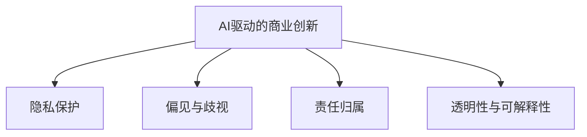

                 

## 1. 背景介绍

### 1.1 问题由来

随着人工智能（AI）技术的快速发展，AI驱动的创新已深入商业领域的各个角落。从客户服务、供应链管理到市场营销，AI技术正改变着企业的运营方式和竞争策略。然而，AI的应用也引发了一系列伦理和道德问题，例如隐私保护、偏见歧视、责任归属等。如何在商业创新与道德伦理之间寻找平衡，已成为AI领域的重要议题。

### 1.2 问题核心关键点

AI驱动的商业创新所面临的道德问题主要集中在以下几个方面：

- **隐私保护**：AI技术对数据的依赖使得隐私保护成为关键问题。如何在获取和利用数据的同时，确保用户隐私不被侵犯，是AI应用的首要任务。
- **偏见与歧视**：由于AI模型通常基于历史数据进行训练，其决策过程中可能存在偏见和歧视，导致不公平的商业行为。
- **责任归属**：AI模型在商业决策中的角色复杂，如何明确其与人类之间的责任归属，是确保公平公正的前提。
- **透明性与可解释性**：AI模型的决策过程通常是"黑箱"，缺乏透明性和可解释性，这使得其决策难以被审查和信任。

这些道德问题不仅关系到企业的信誉和合规性，还直接影响用户的信任度和使用意愿。因此，如何在商业创新中综合考虑这些道德因素，制定合理的策略，是AI领域的研究重点。

## 2. 核心概念与联系

### 2.1 核心概念概述

为更好地理解AI驱动的商业创新及其道德考虑，本节将介绍几个密切相关的核心概念：

- **AI驱动的商业创新**：指通过AI技术优化业务流程、提升运营效率、创造新价值的商业活动。涉及大数据分析、机器学习、自然语言处理等多个技术领域。

- **隐私保护**：指在AI应用中，保护用户个人信息不被滥用和泄露的措施。包括数据匿名化、差分隐私等技术手段。

- **偏见与歧视**：指AI模型在训练和应用过程中，由于数据偏差或算法设计问题，导致对某些群体产生不公平对待的现象。

- **责任归属**：指在AI辅助的决策中，确定AI系统与人类之间的责任分配问题。涉及法律、伦理、技术等多个层面。

- **透明性与可解释性**：指AI模型决策过程的可理解性和可解释性，使得其决策可以被审查和解释。

这些核心概念之间的逻辑关系可以通过以下Mermaid流程图来展示：



这个流程图展示了大语言模型的核心概念及其之间的关系：

1. AI驱动的商业创新依赖于数据和算法，其中隐私保护和偏见歧视问题是基础，透明性和可解释性是保障，责任归属则是关键法律和伦理约束。

这些核心概念共同构成了AI技术在商业应用中的道德伦理框架，指引着AI技术的发展方向。

## 3. 核心算法原理 & 具体操作步骤
### 3.1 算法原理概述

AI驱动的商业创新涉及多种算法和技术，核心算法原理包括：

- **机器学习与深度学习**：用于数据建模和预测，优化商业决策。
- **自然语言处理**：处理和分析文本数据，提升客户服务、市场营销等业务效率。
- **计算机视觉**：识别和分析图像数据，优化供应链管理、产品推荐等业务。

这些算法的核心思想是通过大量数据训练模型，从中找到数据中的规律和模式，从而进行预测和优化。

### 3.2 算法步骤详解

AI驱动的商业创新一般包括以下几个关键步骤：

**Step 1: 数据收集与预处理**

- 收集与业务相关的数据，包括客户行为数据、交易数据、文本数据等。
- 对数据进行清洗、去重、缺失值处理等预处理操作。
- 使用差分隐私等技术手段保护用户隐私。

**Step 2: 数据建模与训练**

- 选择合适的机器学习模型（如线性回归、决策树、神经网络等）进行建模。
- 使用历史数据对模型进行训练，优化模型参数。
- 使用交叉验证等技术手段评估模型性能。

**Step 3: 模型部署与优化**

- 将训练好的模型部署到生产环境中，进行业务优化。
- 持续监控模型性能，使用A/B测试等手段不断优化模型。
- 使用反馈循环机制，及时调整模型参数，提升模型效果。

### 3.3 算法优缺点

AI驱动的商业创新具有以下优点：

- 提高效率：通过自动化和智能化，优化业务流程，提升效率。
- 创造价值：发现隐藏在数据中的规律，创造新的商业机会。
- 灵活性高：模型可以根据需求灵活调整，适应不同场景。

同时，也存在一些局限性：

- 依赖数据：模型效果依赖于数据质量和数据量，数据偏差可能导致模型偏见。
- 黑箱问题：复杂模型难以解释，透明度不足。
- 法律风险：涉及隐私保护、责任归属等问题，法律风险高。

### 3.4 算法应用领域

AI驱动的商业创新在多个领域得到了广泛应用，包括但不限于：

- **客户服务**：通过自然语言处理技术，提升客户服务质量，实现自动回复、智能客服等。
- **市场营销**：使用机器学习分析消费者行为，精准营销，提高转化率。
- **供应链管理**：应用计算机视觉和物联网技术，优化库存管理，提高物流效率。
- **金融服务**：使用深度学习模型进行风险评估，信用评分，提升金融决策的准确性。
- **医疗健康**：利用大数据分析和机器学习，优化诊疗方案，提升医疗服务质量。

## 4. 数学模型和公式 & 详细讲解 & 举例说明
### 4.1 数学模型构建

AI驱动的商业创新通常涉及大量的数学建模，以下以线性回归模型为例，介绍其数学建模过程。

假设我们有n个样本 $(x_1, y_1), (x_2, y_2), \dots, (x_n, y_n)$，其中 $x$ 为输入特征， $y$ 为输出标签。

线性回归模型的目标是找到一条直线 $y = \theta_0 + \theta_1 x$，使得所有样本点到这条直线的残差平方和最小。

设 $\theta = (\theta_0, \theta_1)$ 为模型参数，则最小化目标函数：

$$
\mathcal{L}(\theta) = \frac{1}{2N} \sum_{i=1}^N (y_i - \theta_0 - \theta_1 x_i)^2
$$

通过梯度下降算法，不断迭代更新参数 $\theta$，使得 $\mathcal{L}(\theta)$ 最小化，即得到最优参数 $\hat{\theta}$。

### 4.2 公式推导过程

对目标函数 $\mathcal{L}(\theta)$ 对 $\theta_0$ 和 $\theta_1$ 求偏导数，得到：

$$
\frac{\partial \mathcal{L}(\theta)}{\partial \theta_0} = -\frac{1}{N} \sum_{i=1}^N (y_i - \theta_0 - \theta_1 x_i)
$$

$$
\frac{\partial \mathcal{L}(\theta)}{\partial \theta_1} = -\frac{1}{N} \sum_{i=1}^N (y_i - \theta_0 - \theta_1 x_i)x_i
$$

带入梯度下降公式，得到更新公式：

$$
\theta_0 \leftarrow \theta_0 - \eta \frac{1}{N} \sum_{i=1}^N (y_i - \theta_0 - \theta_1 x_i)
$$

$$
\theta_1 \leftarrow \theta_1 - \eta \frac{1}{N} \sum_{i=1}^N (y_i - \theta_0 - \theta_1 x_i)x_i
$$

其中 $\eta$ 为学习率。

### 4.3 案例分析与讲解

以智能推荐系统为例，分析AI驱动的商业创新及其道德考虑。

智能推荐系统通过分析用户的历史行为数据（如浏览、购买、评分等），预测用户对新商品或内容的兴趣，从而进行个性化推荐。其核心算法包括协同过滤、矩阵分解、神经网络等。

**隐私保护**：推荐系统依赖大量用户数据，如何在获取数据时保护用户隐私，是一个关键问题。常用的方法包括数据匿名化、差分隐私、联邦学习等。

**偏见与歧视**：推荐系统中的协同过滤算法可能存在数据偏差，导致对某些群体的推荐不公平。需要通过数据清洗、算法优化等手段，减少偏见和歧视。

**责任归属**：在推荐系统中，推荐结果可能产生负面影响（如误导购买），如何明确系统与人类之间的责任归属，是确保公平公正的前提。

**透明性与可解释性**：推荐系统的推荐结果通常是"黑箱"的，缺乏透明性和可解释性。需要引入可解释性模型，如线性模型、决策树等，提升模型的透明度。

通过案例分析，可以看到AI驱动的商业创新在实际应用中需要综合考虑隐私保护、偏见与歧视、责任归属和透明性与可解释性等道德因素。

## 5. 项目实践：代码实例和详细解释说明
### 5.1 开发环境搭建

在进行AI驱动的商业创新项目实践前，我们需要准备好开发环境。以下是使用Python进行Scikit-Learn开发的环境配置流程：

1. 安装Anaconda：从官网下载并安装Anaconda，用于创建独立的Python环境。

2. 创建并激活虚拟环境：
```bash
conda create -n myenv python=3.8 
conda activate myenv
```

3. 安装Scikit-Learn：
```bash
pip install scikit-learn
```

4. 安装各类工具包：
```bash
pip install numpy pandas scikit-learn matplotlib tqdm jupyter notebook ipython
```

完成上述步骤后，即可在`myenv`环境中开始项目实践。

### 5.2 源代码详细实现

以下是一个简单的线性回归模型的代码实现：

```python
from sklearn.linear_model import LinearRegression
from sklearn.model_selection import train_test_split
from sklearn.metrics import mean_squared_error
from sklearn.datasets import make_regression

# 生成模拟数据
X, y = make_regression(n_samples=100, n_features=2, noise=0.1, random_state=42)

# 划分训练集和测试集
X_train, X_test, y_train, y_test = train_test_split(X, y, test_size=0.2, random_state=42)

# 初始化线性回归模型
model = LinearRegression()

# 训练模型
model.fit(X_train, y_train)

# 预测并评估
y_pred = model.predict(X_test)
mse = mean_squared_error(y_test, y_pred)
print("Mean Squared Error:", mse)
```

### 5.3 代码解读与分析

让我们再详细解读一下关键代码的实现细节：

- **make_regression**：生成模拟的回归数据集，用于训练和测试。
- **train_test_split**：将数据集划分为训练集和测试集。
- **LinearRegression**：Scikit-Learn库中的线性回归模型。
- **fit**：训练模型。
- **predict**：预测新数据的标签。
- **mean_squared_error**：计算预测值与真实值之间的均方误差。

## 6. 实际应用场景
### 6.1 智能推荐系统

智能推荐系统是AI驱动的商业创新中最为典型的应用之一。通过分析用户的历史行为数据，推荐系统可以为用户提供个性化的商品或内容，提升用户体验和满意度。

智能推荐系统的实现过程中，隐私保护、偏见与歧视、责任归属等问题需要被重点考虑。例如，推荐系统在处理用户数据时，需要确保数据匿名化，防止数据泄露。同时，需要对推荐算法进行优化，减少数据偏差，提高公平性。在推荐结果出现错误或负面影响时，需要明确系统与人类之间的责任归属。最后，推荐系统需要提供可解释性，使用户能够理解推荐逻辑。

### 6.2 智能客服系统

智能客服系统通过自然语言处理技术，自动处理用户的咨询请求，提供快速准确的答复。AI驱动的智能客服系统可以24小时不间断服务，提升客服效率和用户体验。

智能客服系统的实现过程中，隐私保护和偏见与歧视问题是核心。客服系统需要确保在获取用户数据时，遵守隐私保护法规，如GDPR。同时，需要优化模型，减少偏见和歧视，确保对所有用户的公平对待。在出现错误或负面影响时，需要明确系统与人类之间的责任归属。最后，智能客服系统需要提供可解释性，使用户能够理解系统决策的依据。

### 6.3 金融风险评估

金融风险评估系统通过分析历史交易数据，预测金融市场的风险和波动，帮助金融机构做出更好的投资决策。AI驱动的金融风险评估系统可以实时监控市场动态，及时发现潜在风险。

金融风险评估系统的实现过程中，隐私保护和偏见与歧视问题是核心。金融系统需要确保在处理用户数据时，遵守隐私保护法规，如KYC法规。同时，需要优化模型，减少偏见和歧视，确保对所有用户的公平对待。在出现错误或负面影响时，需要明确系统与人类之间的责任归属。最后，金融风险评估系统需要提供可解释性，帮助金融机构理解模型决策的依据。

### 6.4 未来应用展望

随着AI技术的不断发展，AI驱动的商业创新将在更多领域得到应用，为传统行业带来变革性影响。

在智慧医疗领域，AI驱动的智能诊断系统可以辅助医生进行诊断，提高诊疗准确性。在智能制造领域，AI驱动的预测性维护系统可以预测设备故障，减少停机时间，提升生产效率。在智能交通领域，AI驱动的交通管理系统可以优化交通流量，减少拥堵。

未来，AI驱动的商业创新将继续拓展其应用边界，为各行各业带来新的增长点和机遇。同时，需要不断解决隐私保护、偏见与歧视、责任归属等问题，确保AI技术的健康发展和广泛应用。

## 7. 工具和资源推荐
### 7.1 学习资源推荐

为了帮助开发者系统掌握AI驱动的商业创新及其道德考虑的理论基础和实践技巧，这里推荐一些优质的学习资源：

1. 《AI伦理与法律》系列博文：由AI伦理专家撰写，深入浅出地介绍了AI伦理和法律的基本概念和前沿话题。

2. 《数据科学与机器学习》课程：由Coursera和edX等平台提供的免费课程，涵盖数据科学和机器学习的核心知识。

3. 《可解释AI》书籍：介绍可解释AI的基本原理和应用案例，帮助开发者理解和实现可解释模型。

4. 《AI在商业中的应用》书籍：由AI技术专家撰写，全面介绍了AI在商业领域的应用场景和实际案例。

5. IEEE的AI伦理标准：IEEE发布的AI伦理标准，为开发者提供指导和参考。

通过对这些资源的学习实践，相信你一定能够全面掌握AI驱动的商业创新及其道德考虑的理论基础和实践技巧，用于解决实际的商业问题。

### 7.2 开发工具推荐

高效的开发离不开优秀的工具支持。以下是几款用于AI驱动的商业创新开发的常用工具：

1. Scikit-Learn：Python开源机器学习库，提供了丰富的机器学习算法和工具。

2. TensorFlow：由Google主导开发的开源深度学习框架，支持大规模模型训练和推理。

3. PyTorch：Facebook开源的深度学习框架，支持动态计算图和高效的模型训练。

4. Jupyter Notebook：交互式的开发环境，支持Python、R等语言，适合数据科学和机器学习开发。

5. Weights & Biases：模型训练的实验跟踪工具，可以记录和可视化模型训练过程中的各项指标，方便对比和调优。

6. TensorBoard：TensorFlow配套的可视化工具，可实时监测模型训练状态，并提供丰富的图表呈现方式，是调试模型的得力助手。

合理利用这些工具，可以显著提升AI驱动的商业创新开发的效率，加快创新迭代的步伐。

### 7.3 相关论文推荐

AI驱动的商业创新涉及众多技术领域，以下是几篇奠基性的相关论文，推荐阅读：

1. "Machine Learning Yearning"：Andrew Ng撰写的书籍，介绍机器学习的基本原则和最佳实践。

2. "Fairness, Accountability, and Transparency"：论文集，涵盖AI伦理和公平性的多个研究方向。

3. "Towards a Theory of Interpretable Machine Learning"：论文，探讨可解释AI的理论基础和实际应用。

4. "Bias and Fairness in Machine Learning and Artificial Intelligence"：论文，讨论AI系统中的偏见和公平性问题。

5. "Human-Centered AI"：报告，由ACM和IEEE联合发布，探讨AI技术与人类价值观的结合。

这些论文代表了大语言模型微调技术的发展脉络。通过学习这些前沿成果，可以帮助研究者把握学科前进方向，激发更多的创新灵感。

## 8. 总结：未来发展趋势与挑战
### 8.1 总结

本文对AI驱动的商业创新及其道德考虑进行了全面系统的介绍。首先阐述了AI技术在商业创新中的应用背景和核心问题，明确了隐私保护、偏见与歧视、责任归属等道德因素的重要性。其次，从算法原理到项目实践，详细讲解了AI驱动的商业创新技术实现过程，给出了完整的代码实例。同时，本文还探讨了AI驱动的商业创新在多个实际场景中的应用，展示了其广阔的前景。

通过本文的系统梳理，可以看到，AI驱动的商业创新在商业应用中需要综合考虑隐私保护、偏见与歧视、责任归属和透明性与可解释性等道德因素。这些因素不仅关系到企业的信誉和合规性，还直接影响用户的信任度和使用意愿。因此，如何在商业创新中综合考虑这些道德因素，制定合理的策略，是AI领域的研究重点。

### 8.2 未来发展趋势

展望未来，AI驱动的商业创新将呈现以下几个发展趋势：

1. 技术融合：AI技术将与物联网、区块链、量子计算等新兴技术深度融合，形成更加全面、智能的商业应用。

2. 个性化服务：AI技术将实现更精准的个性化服务，提升用户体验和满意度。

3. 数据自治：在AI应用中，数据自治和隐私保护将成为关键，数据所有权和使用权将更加明确。

4. 公平与透明：AI系统将更加注重公平性和透明性，确保算法决策的公正性和可解释性。

5. 全球化：AI技术将在全球范围内广泛应用，不同地区和国家的伦理标准也将得到更多考虑。

这些趋势凸显了AI技术在商业应用中的前景，但也提出了新的挑战和需求。

### 8.3 面临的挑战

尽管AI驱动的商业创新已经取得了显著成果，但在迈向更加智能化、普适化应用的过程中，仍面临诸多挑战：

1. 数据隐私与安全：在AI应用中，数据隐私和安全问题日益凸显，如何保护用户隐私，防止数据泄露，是一个重大挑战。

2. 算法偏见与歧视：AI系统在训练和应用过程中可能存在偏见和歧视，如何减少偏见和歧视，提高公平性，仍需进一步研究。

3. 模型透明性与可解释性：AI系统的决策过程通常是"黑箱"的，缺乏透明性和可解释性，如何提升模型的可解释性，增强用户信任，仍需探索。

4. 技术标准与法规：AI技术的快速发展，使得现有技术标准和法规难以适应，需要制定新的标准和法规，确保技术健康发展。

5. 伦理与社会责任：AI技术的广泛应用，带来了新的伦理和社会责任问题，需要从社会层面进行深入探讨和规范。

这些挑战需要从技术、伦理、法律等多个层面进行综合应对，确保AI技术的健康发展和广泛应用。

### 8.4 研究展望

面对AI驱动的商业创新所面临的诸多挑战，未来的研究需要在以下几个方面寻求新的突破：

1. 隐私保护技术：研究更加先进的数据保护技术，如差分隐私、联邦学习等，保护用户隐私和数据安全。

2. 公平性与透明性：开发更公平、透明的AI算法，减少偏见和歧视，提高算法的可解释性。

3. 法律与伦理规范：制定新的技术标准和法规，明确AI技术的法律和伦理边界，确保技术健康发展。

4. 社会责任与公平性：探索AI技术在社会治理中的应用，确保技术应用符合社会公平和公正的要求。

5. 数据自治与隐私保护：研究数据自治和隐私保护的新方法，确保数据所有权和使用权的明确。

这些研究方向将引领AI驱动的商业创新走向更高的台阶，为构建安全、可靠、可解释、可控的智能系统铺平道路。面向未来，AI驱动的商业创新还需要与其他人工智能技术进行更深入的融合，共同推动自然语言理解和智能交互系统的进步。只有勇于创新、敢于突破，才能不断拓展AI技术的边界，让智能技术更好地造福人类社会。

## 9. 附录：常见问题与解答

**Q1：AI驱动的商业创新在商业应用中需要综合考虑哪些道德因素？**

A: AI驱动的商业创新在商业应用中需要综合考虑以下道德因素：

1. 隐私保护：确保在获取和利用用户数据时，遵守相关法律法规，保护用户隐私。
2. 偏见与歧视：确保AI系统在训练和应用过程中，不产生对某些群体的偏见和歧视，保障公平性。
3. 责任归属：明确AI系统与人类之间的责任归属，确保在出现错误或负面影响时，有明确的责任承担方。
4. 透明性与可解释性：确保AI系统的决策过程透明可解释，使用户能够理解系统决策的依据。

**Q2：AI驱动的商业创新在实际应用中，如何平衡隐私保护和数据利用之间的关系？**

A: AI驱动的商业创新在实际应用中，需要平衡隐私保护和数据利用的关系，具体措施包括：

1. 数据匿名化：对用户数据进行匿名化处理，防止数据泄露。
2. 差分隐私：通过添加噪声等手段，保护用户隐私，同时保留数据利用价值。
3. 数据自治：在用户同意的前提下，合理利用数据，确保用户数据所有权和使用权的明确。
4. 数据安全：采用加密、访问控制等技术手段，保护数据安全，防止数据泄露和滥用。

**Q3：AI驱动的商业创新中，如何避免算法偏见和歧视？**

A: AI驱动的商业创新中，避免算法偏见和歧视的措施包括：

1. 数据清洗：对数据进行清洗，去除数据中的偏见和噪声。
2. 算法优化：优化算法设计，减少算法偏见和歧视。
3. 公平性评估：使用公平性评估指标，如F1 Score、ROC曲线等，评估和调整模型。
4. 数据多样性：增加数据多样性，确保模型在各个群体上的公平性。

**Q4：AI驱动的商业创新中，如何提升模型的可解释性？**

A: AI驱动的商业创新中，提升模型可解释性的措施包括：

1. 使用可解释性算法：如线性模型、决策树等，确保模型决策过程透明可解释。
2. 可视化工具：使用可视化工具，如LIME、SHAP等，展示模型决策依据。
3. 提供反馈机制：在模型应用过程中，提供反馈机制，让用户能够理解模型决策的依据。

**Q5：AI驱动的商业创新中，如何处理模型的偏见与歧视问题？**

A: AI驱动的商业创新中，处理模型偏见与歧视问题的措施包括：

1. 数据收集：确保数据来源多样化，减少数据偏见。
2. 算法设计：在设计算法时，考虑消除偏见和歧视的措施。
3. 模型评估：使用公平性评估指标，评估和调整模型，减少偏见和歧视。
4. 用户反馈：收集用户反馈，不断优化模型，减少偏见和歧视。

通过对这些问题的解答，可以看出AI驱动的商业创新在实际应用中需要综合考虑隐私保护、偏见与歧视、责任归属和透明性与可解释性等道德因素。这些因素不仅关系到企业的信誉和合规性，还直接影响用户的信任度和使用意愿。因此，如何在商业创新中综合考虑这些道德因素，制定合理的策略，是AI领域的研究重点。

---

作者：禅与计算机程序设计艺术 / Zen and the Art of Computer Programming

