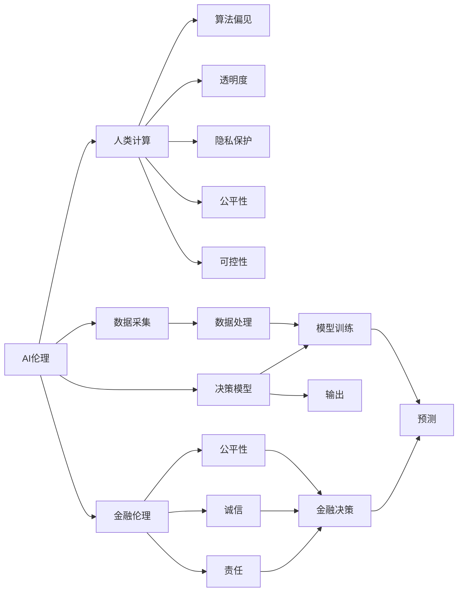

                 

## 1. 背景介绍

在现代社会中，人工智能（AI）技术的应用正在以前所未有的速度深入各行各业，金融行业自然也不例外。AI的强大能力使得金融服务更加高效、精准，但也随之带来了新的道德和伦理挑战。

### 1.1 金融科技的迅速发展

金融科技（FinTech）是金融行业和科技行业融合的产物。人工智能在金融领域的应用，如智能投顾、信用评分、欺诈检测等，使得金融服务更加个性化、智能化。

- **智能投顾**：基于机器学习模型的智能投顾，能够提供个性化的投资建议和资产配置方案，极大提高了金融服务的便捷性。
- **信用评分**：利用AI算法分析用户的多维度数据，生成动态的信用评分，为贷款审批、风险控制提供了新的解决方案。
- **欺诈检测**：利用深度学习模型对交易数据进行实时监测，检测出可疑行为，有效降低了金融欺诈的风险。

### 1.2 道德与伦理问题

随着AI技术的深入应用，一些新的道德和伦理问题逐渐凸显，例如：

- **算法偏见**：AI模型可能学习到训练数据中的偏见，进而对某些群体产生歧视，如基于种族、性别等因素的贷款拒绝。
- **透明性与可解释性**：AI模型决策过程的复杂性和非透明性，导致用户难以理解其决策逻辑，增加了道德风险。
- **隐私保护**：AI在金融数据处理中的应用，涉及大量敏感个人数据，如何保障这些数据的隐私和安全，成为一个重要问题。
- **公平性与可控性**：金融科技企业如何在提升效率的同时，保障服务的公平性和可控性，避免对用户造成伤害。

这些问题亟待行业、学界、政策制定者共同探讨并解决，以确保AI技术的健康发展。

## 2. 核心概念与联系

### 2.1 核心概念概述

为了更深入地探讨AI在金融行业的道德问题，我们先定义几个核心概念：

- **AI伦理**：AI伦理是指在人工智能的设计、开发、应用过程中所涉及的伦理问题，如算法偏见、透明度、隐私保护等。
- **金融伦理**：金融伦理是指在金融活动中所涉及的伦理问题，如公平性、诚信、责任等。
- **人类计算（Human-in-the-loop）**：人类计算指的是在AI系统的决策过程中，人类扮演的角色，包括监督、修正、指导等。

这三个概念相辅相成，共同构成了AI在金融行业的道德框架。

### 2.2 核心概念联系的 Mermaid 流程图



这个流程图展示了AI伦理、金融伦理和人类计算之间的联系。AI伦理是系统设计和决策的基础，金融伦理是系统应用的具体体现，人类计算则是系统在实际应用中保持道德约束的机制。

## 3. 核心算法原理 & 具体操作步骤

### 3.1 算法原理概述

AI在金融行业的应用涉及多方面的算法原理，包括模型训练、数据处理、决策生成等。这些算法的道德考量主要体现在以下几个方面：

- **数据质量与偏见**：AI模型依赖于高质量的数据进行训练，数据中存在的偏见可能导致模型输出偏见。
- **决策透明度**：AI模型通常被视为"黑箱"，决策过程复杂且难以解释，这可能带来道德风险。
- **隐私保护**：金融数据往往包含敏感信息，如何保护这些数据不被滥用是一个关键问题。
- **公平性**：AI模型应避免对不同群体的不公平对待，确保决策的公平性。

### 3.2 算法步骤详解

基于AI的金融服务通常包含以下关键步骤：

1. **数据采集与处理**：
    - 采集金融数据，如用户行为数据、交易记录等。
    - 对数据进行预处理，如清洗、特征提取等。
    - 处理数据中的偏见和敏感信息，确保数据集的多样性和公平性。

2. **模型训练**：
    - 使用历史数据训练AI模型，如神经网络、决策树、随机森林等。
    - 选择合适的损失函数和优化算法，如交叉熵损失、AdamW等。
    - 在训练过程中进行正则化，避免过拟合。

3. **决策生成**：
    - 使用训练好的模型对新数据进行预测或分类，如贷款审批、欺诈检测等。
    - 结合人类计算，对模型的输出进行审查和修正。

4. **监控与评估**：
    - 定期监控模型的运行状态，如准确率、召回率、F1分数等。
    - 评估模型的公平性、透明度和隐私保护情况。
    - 进行模型更新和优化，确保其长期有效性。

### 3.3 算法优缺点

基于AI的金融服务在带来便捷和高效的同时，也存在一些优缺点：

**优点**：
- **提高效率**：AI能够自动化处理大量数据，显著提高金融服务的效率。
- **精准预测**：基于复杂算法的AI模型能够提供更精准的金融决策，降低人为错误。
- **个性化服务**：AI可以提供个性化的金融产品和服务，满足不同客户的需求。

**缺点**：
- **数据依赖性**：AI模型依赖于高质量的数据，数据不足或存在偏见可能导致模型失效。
- **透明度不足**：AI模型的决策过程复杂且难以解释，增加了道德风险。
- **隐私风险**：金融数据包含敏感信息，如何在保护隐私的同时利用数据，是一个关键问题。
- **公平性问题**：AI模型可能对某些群体产生歧视，导致不公平待遇。

### 3.4 算法应用领域

基于AI的金融服务在多个领域得到应用，例如：

- **信用评分**：使用AI模型分析用户的多维度数据，生成动态的信用评分，优化贷款审批流程。
- **智能投顾**：基于机器学习模型的智能投顾，提供个性化的投资建议和资产配置方案。
- **欺诈检测**：利用深度学习模型对交易数据进行实时监测，检测出可疑行为，有效降低金融欺诈风险。
- **风险控制**：通过AI模型分析市场数据，预测金融风险，帮助金融机构进行风险控制和资产配置。
- **客户服务**：使用AI聊天机器人，提供24/7的客户咨询服务，提升客户体验。

这些应用极大地提升了金融服务的效率和质量，但也带来了新的道德和伦理问题。

## 4. 数学模型和公式 & 详细讲解 & 举例说明

### 4.1 数学模型构建

以信用评分为例，构建一个基于AI的信用评分模型。假设模型输入为用户的多个特征，输出为信用评分，则模型的形式化表示如下：

设输入为 $x=(x_1, x_2, ..., x_n)$，输出为 $y$，则信用评分模型的目标是最小化预测误差，即：

$$
\min_{\theta} \frac{1}{N} \sum_{i=1}^N \ell(f(x_i; \theta), y_i)
$$

其中，$f(x; \theta)$ 表示模型对输入 $x$ 的预测函数，$\theta$ 为模型参数。常见的损失函数包括均方误差、交叉熵等。

### 4.2 公式推导过程

以均方误差损失函数为例，其推导过程如下：

设模型预测值为 $\hat{y} = f(x; \theta)$，真实值为 $y$，则均方误差损失函数为：

$$
L(y, \hat{y}) = \frac{1}{N} \sum_{i=1}^N (y_i - \hat{y}_i)^2
$$

对损失函数求导，得到梯度：

$$
\frac{\partial L(y, \hat{y})}{\partial \theta} = \frac{2}{N} \sum_{i=1}^N (y_i - \hat{y}_i) \frac{\partial \hat{y}_i}{\partial \theta}
$$

使用梯度下降算法，更新模型参数：

$$
\theta \leftarrow \theta - \eta \frac{\partial L(y, \hat{y})}{\partial \theta}
$$

其中 $\eta$ 为学习率。

### 4.3 案例分析与讲解

以智能投顾为例，分析AI模型在金融决策中的道德问题。智能投顾模型通常包含多个组件，如特征提取器、决策树、风险评估器等。

1. **数据采集与处理**：智能投顾依赖于用户的历史交易数据、财务数据等，数据处理过程中要注意数据的隐私保护。
2. **模型训练**：模型训练时要确保数据集的多样性和公平性，避免偏见和歧视。
3. **决策生成**：智能投顾的决策过程复杂，需要结合人类计算，确保决策的透明性和可控性。
4. **监控与评估**：定期监控模型的运行状态，评估其公平性和隐私保护情况，进行模型更新和优化。

## 5. 项目实践：代码实例和详细解释说明

### 5.1 开发环境搭建

为了进行AI驱动的金融服务开发，我们需要搭建一个完整的开发环境。以下是具体的搭建流程：

1. **选择合适的编程语言和框架**：
    - 编程语言：Python。
    - 深度学习框架：TensorFlow、PyTorch等。

2. **安装必要的工具和库**：
    - TensorFlow或PyTorch的安装。
    - 数据处理库：NumPy、Pandas等。
    - 可视化工具：Matplotlib、Seaborn等。
    - 数据处理和机器学习库：Scikit-learn、Keras等。

3. **数据集准备**：
    - 金融数据集的准备，如贷款申请数据、交易记录等。
    - 数据预处理，如清洗、特征提取等。

### 5.2 源代码详细实现

以下是一个简单的信用评分模型实现：

```python
import tensorflow as tf
from sklearn.model_selection import train_test_split
from sklearn.preprocessing import StandardScaler
from sklearn.linear_model import LogisticRegression

# 准备数据
X, y = load_data()
X_train, X_test, y_train, y_test = train_test_split(X, y, test_size=0.2, random_state=42)

# 数据标准化
scaler = StandardScaler()
X_train = scaler.fit_transform(X_train)
X_test = scaler.transform(X_test)

# 构建模型
model = LogisticRegression()
model.fit(X_train, y_train)

# 评估模型
score = model.score(X_test, y_test)
print("模型准确率：", score)
```

### 5.3 代码解读与分析

- **数据准备**：使用`load_data()`函数加载金融数据，进行特征提取和预处理。
- **模型构建**：使用逻辑回归模型，对用户的历史交易数据进行信用评分预测。
- **模型训练**：使用训练集训练模型，使用`fit()`函数进行模型拟合。
- **模型评估**：使用测试集评估模型性能，使用`score()`函数计算准确率。

## 6. 实际应用场景

### 6.1 智能投顾

智能投顾是AI在金融行业的重要应用之一。智能投顾系统可以根据用户的风险偏好、投资目标等信息，生成个性化的投资建议和资产配置方案，帮助用户优化投资组合，提高投资收益。

### 6.2 欺诈检测

AI在欺诈检测中的应用，可以实时监测交易数据，检测出可疑行为，及时发现和阻止欺诈行为，保护用户的金融资产。

### 6.3 风险控制

AI模型可以分析市场数据，预测金融风险，帮助金融机构进行风险控制和资产配置，降低金融风险。

### 6.4 未来应用展望

未来，AI在金融行业的应用将更加广泛和深入，带来更多的创新和变革。

1. **自动化金融服务**：AI可以自动化处理各种金融服务，如自动贷款审批、自动交易执行等。
2. **个性化金融产品**：AI可以根据用户行为和偏好，推荐个性化的金融产品和服务，提升用户体验。
3. **智能投顾与财富管理**：智能投顾系统将成为金融投资和财富管理的重要工具，提升投资效率和收益。
4. **金融风险管理**：AI模型可以实时监测和预测金融风险，提供预警和应对措施，保障金融系统的稳定。
5. **区块链与智能合约**：结合AI和区块链技术，可以实现智能合约自动化执行，提高金融交易的效率和安全性。

## 7. 工具和资源推荐

### 7.1 学习资源推荐

为了深入学习AI在金融行业的道德问题，以下是一些推荐的学习资源：

1. **《AI与金融科技》课程**：由知名大学开设，涵盖AI在金融科技中的应用、道德与伦理等内容。
2. **《机器学习基础》书籍**：介绍机器学习的基本原理和算法，包括金融领域的应用。
3. **《金融科技伦理》论文集**：汇集多篇关于金融科技伦理的论文，探讨AI在金融行业中的道德问题。
4. **《AI伦理与法律》在线课程**：介绍AI伦理和法律的基础知识，包括金融领域的应用。
5. **《数据隐私保护》书籍**：讲解数据隐私保护的技术和策略，在金融行业的应用。

### 7.2 开发工具推荐

以下是一些常用的开发工具：

1. **TensorFlow**：基于数据流图的深度学习框架，支持多种模型和算法。
2. **PyTorch**：基于动态计算图的深度学习框架，易于开发和调试。
3. **Jupyter Notebook**：交互式开发环境，支持代码编写、数据可视化和结果展示。
4. **Matplotlib**：绘图库，支持绘制各种类型的图表。
5. **Pandas**：数据处理库，支持数据清洗、分析和可视化。

### 7.3 相关论文推荐

以下是一些关于AI在金融行业道德问题的论文：

1. **"AI的伦理与法律"**：探讨AI在金融科技中的伦理与法律问题。
2. **"算法偏见与公平性"**：分析AI模型中的算法偏见问题，提出解决方案。
3. **"数据隐私保护"**：研究数据隐私保护技术，在金融行业中的应用。
4. **"智能投顾的道德风险"**：分析智能投顾中的道德风险问题，提出防范措施。
5. **"AI与金融风险管理"**：探讨AI在金融风险管理中的应用，提升风险控制能力。

## 8. 总结：未来发展趋势与挑战

### 8.1 研究成果总结

AI在金融行业的道德问题是一个多方面的问题，涉及数据质量、算法偏见、透明度、隐私保护等方面。解决这些问题需要多方协作，包括政府、企业、学界等。

### 8.2 未来发展趋势

未来，AI在金融行业的应用将更加广泛和深入，但也面临更多的道德和伦理挑战。以下是几个趋势：

1. **数据治理**：建立完善的数据治理机制，确保数据的准确性和完整性。
2. **算法透明性**：提升AI算法的透明性，让用户理解其决策逻辑。
3. **隐私保护**：加强隐私保护技术，确保用户数据的安全。
4. **公平性**：制定公平性评估指标，确保AI模型的公平性。
5. **法律与伦理框架**：建立健全的法律与伦理框架，规范AI在金融行业的应用。

### 8.3 面临的挑战

AI在金融行业的应用面临诸多挑战，包括：

1. **数据质量**：数据中可能存在的偏见和噪声，导致模型失效。
2. **透明度**：AI模型的决策过程复杂，难以解释。
3. **隐私保护**：金融数据敏感，需要确保数据隐私保护。
4. **公平性**：AI模型可能对某些群体产生歧视。
5. **法律与伦理**：AI在金融行业的应用需要符合法律和伦理规范。

### 8.4 研究展望

未来的研究应聚焦于以下几个方面：

1. **公平性**：研究如何保证AI模型的公平性，避免对某些群体的歧视。
2. **透明度**：提升AI算法的透明性，确保用户理解其决策逻辑。
3. **隐私保护**：研究如何加强隐私保护技术，确保数据安全。
4. **法律与伦理**：建立健全的法律与伦理框架，规范AI在金融行业的应用。
5. **跨领域应用**：探索AI在金融行业与其他领域（如医疗、教育等）的跨领域应用。

## 9. 附录：常见问题与解答

### Q1：如何确保AI模型的公平性？

**A**：确保AI模型的公平性需要从多个方面入手：

1. **数据采集**：确保数据集的多样性和公平性，避免数据偏见。
2. **算法设计**：在模型设计时引入公平性约束，如公平性损失函数。
3. **后处理**：对模型的输出进行后处理，消除潜在的歧视性。
4. **监督与反馈**：对模型的输出进行监控，及时发现和纠正偏见。

### Q2：如何提高AI模型的透明度？

**A**：提高AI模型的透明度需要从多个方面入手：

1. **模型解释**：使用模型解释技术，如LIME、SHAP等，解释模型的决策过程。
2. **可解释模型**：使用可解释性更高的模型，如决策树、线性模型等。
3. **可视化工具**：使用可视化工具，如TensorBoard、ModelScope等，展示模型训练和推理过程。
4. **文档与培训**：编写详细的文档，进行模型使用培训，提升用户理解能力。

### Q3：如何在保护隐私的同时利用金融数据？

**A**：在保护隐私的同时利用金融数据需要采取以下措施：

1. **数据匿名化**：对敏感数据进行匿名化处理，防止数据泄露。
2. **差分隐私**：使用差分隐私技术，保护个体数据隐私。
3. **安全计算**：使用安全计算技术，如多方计算、联邦学习等，保护数据隐私。
4. **访问控制**：设置严格的访问控制策略，确保数据仅在授权范围内使用。

### Q4：如何确保AI模型的安全性？

**A**：确保AI模型的安全性需要从多个方面入手：

1. **数据安全**：确保数据采集、存储和传输的安全性，防止数据泄露。
2. **模型鲁棒性**：通过对抗训练、模型微调等手段，提高模型的鲁棒性，防止模型攻击。
3. **审计与监控**：对AI模型进行定期审计和监控，发现潜在的安全风险。
4. **应急预案**：制定应急预案，应对模型安全问题。

---

作者：禅与计算机程序设计艺术 / Zen and the Art of Computer Programming

