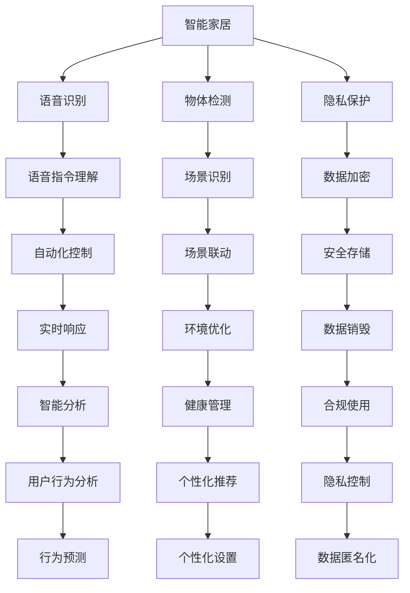

                 

# AI驱动的智能家居：便利与隐私的平衡

## 1. 背景介绍

### 1.1 问题由来
智能家居领域正迅速发展，逐渐进入大众视野。传统家居控制方式（如按钮、开关）已无法满足现代人的需求。AI技术为智能家居带来革命性变革，通过语音助手、自动照明、智能温控等方式极大提升了生活便利性。然而，AI技术在提供便利的同时，也引发了隐私保护的广泛关注。智能家居设备通过采集用户的行为数据，不仅能够自动化、智能化控制家居，还可能泄露用户的隐私信息。如何在智能家居中平衡便利性与隐私性，是当下亟待解决的问题。

### 1.2 问题核心关键点
智能家居的便利性源于AI驱动的自动化功能，如语音识别、物体检测等。这些功能依赖于复杂的AI模型，对用户行为数据的大量采集和处理。而隐私性则关系到用户的敏感信息（如地理位置、作息习惯、健康状况等）的存储和传输，须通过严格的算法和设计来保障。

如何在便利性和隐私性之间找到平衡点，成为智能家居发展的一大挑战。本文将详细探讨AI在智能家居中的应用，分析其便利性与隐私性之间的矛盾，并提出若干平衡策略。

## 2. 核心概念与联系

### 2.1 核心概念概述
- **智能家居**：通过AI技术实现对家居环境（如照明、温控、安防等）的智能化、自动化控制，提升用户生活质量。
- **语音识别**：利用声学模型和语言模型对用户语音进行识别和理解，支持自然语言交互。
- **物体检测**：利用视觉传感器和计算机视觉技术，自动识别家居中的物体位置和状态。
- **隐私保护**：通过技术手段和管理策略，确保智能家居设备采集的数据不被滥用或泄露。

### 2.2 核心概念原理和架构的 Mermaid 流程图



此图展示了智能家居的各个组件及它们之间的联系。其中，语音识别和物体检测通过采集用户数据实现自动化控制，而隐私保护则通过加密、匿名化等手段保障数据安全。自动化控制和场景联动提升用户便利性，而隐私控制和管理确保了用户隐私。

## 3. 核心算法原理 & 具体操作步骤
### 3.1 算法原理概述

智能家居中的AI算法主要集中在两个方面：语音识别和物体检测。这两个技术的应用原理和算法模型有所不同，但都依赖于大规模数据训练。

- **语音识别**：基于深度神经网络模型（如RNN、CNN、Transformer等），将用户的语音信号转化为文本或命令。关键技术包括声学模型（如CNN、LSTM等）和语言模型（如RNN、RNN-LM、Transformer等）。
- **物体检测**：基于卷积神经网络（CNN）及其变种（如YOLO、Faster R-CNN、SSD等），通过图像识别技术检测家居环境中的物体。

这些算法的训练和应用需要大量的数据和计算资源，而实际部署则需考虑模型的推理速度、硬件资源和用户体验。

### 3.2 算法步骤详解

**语音识别算法步骤**：

1. **数据收集**：从各类家庭环境中收集大量语音数据，进行标注和清洗。
2. **模型训练**：使用深度神经网络模型对标注数据进行训练，优化声学模型和语言模型。
3. **模型微调**：针对特定家庭环境的语音数据，对预训练模型进行微调，以适应新的语境和口音。
4. **模型部署**：将训练好的模型部署到智能家居设备上，进行实时语音识别和指令执行。
5. **性能评估**：在实际应用场景中，定期评估模型性能，根据反馈数据进行优化。

**物体检测算法步骤**：

1. **数据收集**：从不同角度采集家居环境的图像数据，标注物体位置和类别。
2. **模型训练**：使用预训练的物体检测模型（如YOLO、Faster R-CNN等），对标注数据进行训练。
3. **模型微调**：对特定家庭环境的图像数据进行微调，适应新的物体和场景。
4. **模型部署**：将训练好的模型部署到智能家居设备（如摄像头、传感器等），进行实时物体检测和环境监控。
5. **性能评估**：通过图像识别技术，评估模型在实际场景中的准确率和响应时间。

### 3.3 算法优缺点

**语音识别的优缺点**：

- **优点**：
  - **便捷性**：通过语音指令，用户能够更方便地控制家居设备。
  - **自然性**：语音交互方式更接近自然语言，使用体验更舒适。
- **缺点**：
  - **环境干扰**：环境噪音会影响语音识别准确性。
  - **隐私泄露**：语音数据的存储和传输可能被监听或窃取。

**物体检测的优缺点**：

- **优点**：
  - **实时性**：物体检测能够实时监测家居环境，即时响应。
  - **准确性**：物体检测技术的精度较高，能够准确识别家居物品。
- **缺点**：
  - **数据需求**：需要大量标注数据进行训练，对数据质量要求高。
  - **隐私风险**：物体检测依赖图像传感器，可能涉及隐私图像数据的存储和传输。

### 3.4 算法应用领域

智能家居中的AI算法主要应用于以下几个领域：

- **自动化控制**：如智能灯光、智能温控等，通过语音识别和物体检测实现自动化。
- **环境监控**：如智能安防、智能烟雾探测等，通过物体检测技术实时监控家居环境。
- **健康管理**：如智能健康监测设备，通过物体检测和图像识别技术监测用户健康状况。
- **个性化推荐**：如智能推荐系统，通过用户行为数据进行个性化推荐。
- **用户体验优化**：如智能音箱、智能电视等，通过语音识别提升用户体验。

## 4. 数学模型和公式 & 详细讲解  
### 4.1 数学模型构建

智能家居中应用的AI模型主要基于深度学习框架，如TensorFlow、PyTorch等。以下以语音识别模型为例，介绍其数学模型构建过程。

**语音识别模型**：

- **声学模型**：输入为语音信号，输出为声学特征。通常采用卷积神经网络（CNN）或循环神经网络（RNN）。
- **语言模型**：输入为声学特征序列，输出为文本序列。通常采用递归神经网络（RNN）或Transformer等。

**声学模型（CNN）**：

$$
H_{output} = \sigma(W_{l}H_{l-1} + b_{l})
$$

其中，$H_{l-1}$ 为上一层的隐藏状态，$W_{l}$ 和 $b_{l}$ 为当前层的权重和偏置，$\sigma$ 为激活函数。

**语言模型（RNN）**：

$$
H_{t+1} = \sigma(W_{h}H_{t} + b_{h} + U_{h}X_{t})
$$

其中，$H_{t}$ 为当前时刻的隐藏状态，$W_{h}$ 和 $b_{h}$ 为当前层的权重和偏置，$U_{h}$ 为当前层的输入权重，$X_{t}$ 为当前时刻的输入序列。

### 4.2 公式推导过程

语音识别中的声学模型和语言模型分别推导如下：

- **声学模型（CNN）**：

  $$
  H_{l+1} = \sigma(W_{l}H_{l-1} + b_{l})
  $$

  其中，$W_{l}$ 为卷积核，$b_{l}$ 为偏置，$\sigma$ 为激活函数。

- **语言模型（RNN）**：

  $$
  H_{t+1} = \sigma(W_{h}H_{t} + b_{h} + U_{h}X_{t})
  $$

  其中，$W_{h}$ 和 $b_{h}$ 为当前层的权重和偏置，$U_{h}$ 为当前层的输入权重，$X_{t}$ 为当前时刻的输入序列。

### 4.3 案例分析与讲解

以智能音箱为例，语音识别模型分为两个部分：声学模型和语言模型。声学模型通过CNN对语音信号进行处理，输出声学特征。语言模型则使用RNN对声学特征序列进行建模，输出文本序列。实际应用中，模型首先通过声学模型提取语音特征，然后将其输入到语言模型进行文本识别，最终输出文本指令。

## 5. 项目实践：代码实例和详细解释说明
### 5.1 开发环境搭建

**开发环境搭建步骤**：

1. **安装Python环境**：
   - 安装最新版本的Python。
   - 安装虚拟环境管理工具，如virtualenv或conda。

2. **安装深度学习库**：
   - 安装TensorFlow或PyTorch。
   - 安装其他必要的库，如numpy、scipy、pandas等。

3. **配置开发环境**：
   - 配置GPU加速。
   - 设置代码版本控制（如Git）。

### 5.2 源代码详细实现

以下是一个基于TensorFlow的语音识别模型示例代码：

```python
import tensorflow as tf
from tensorflow.keras.layers import Conv2D, MaxPooling2D, LSTM, Dense

# 声学模型
class AcousticModel(tf.keras.Model):
    def __init__(self, input_shape, num_classes):
        super(AcousticModel, self).__init__()
        self.cnn = Conv2D(32, kernel_size=(3, 3), activation='relu', input_shape=input_shape)
        self.pool = MaxPooling2D(pool_size=(2, 2))
        self.lstm = LSTM(128, return_sequences=True)
        self.fc = Dense(num_classes, activation='softmax')

    def call(self, x):
        x = self.cnn(x)
        x = self.pool(x)
        x = self.lstm(x)
        return self.fc(x)

# 语言模型
class LanguageModel(tf.keras.Model):
    def __init__(self, input_shape, num_classes):
        super(LanguageModel, self).__init__()
        self.lstm = LSTM(128, return_sequences=True)
        self.fc = Dense(num_classes, activation='softmax')

    def call(self, x):
        x = self.lstm(x)
        return self.fc(x)

# 模型训练
def train_model(input_shape, num_classes):
    acoustic_model = AcousticModel(input_shape, num_classes)
    language_model = LanguageModel(input_shape, num_classes)
    
    # 定义优化器和损失函数
    optimizer = tf.keras.optimizers.Adam(learning_rate=0.001)
    loss = tf.keras.losses.SparseCategoricalCrossentropy()
    
    # 训练循环
    for epoch in range(num_epochs):
        for batch in train_dataset:
            inputs, labels = batch
            with tf.GradientTape() as tape:
                logits = acoustic_model(inputs) + language_model(logits)
                loss_value = loss(labels, logits)
            gradients = tape.gradient(loss_value, acoustic_model.trainable_variables + language_model.trainable_variables)
            optimizer.apply_gradients(zip(gradients, acoustic_model.trainable_variables + language_model.trainable_variables))
    
    return acoustic_model, language_model

# 模型评估
def evaluate_model(model, test_dataset):
    total_loss = 0
    for batch in test_dataset:
        inputs, labels = batch
        logits = model(inputs)
        loss_value = loss(labels, logits)
        total_loss += loss_value
    return total_loss / len(test_dataset)

# 模型部署
def deploy_model(model, test_dataset):
    for batch in test_dataset:
        inputs, labels = batch
        logits = model(inputs)
        prediction = tf.argmax(logits, axis=1)
        print(prediction.numpy())
```

### 5.3 代码解读与分析

**模型定义**：
- `AcousticModel` 类定义了声学模型，包括卷积层、池化层、LSTM层和全连接层。
- `LanguageModel` 类定义了语言模型，只包含LSTM层和全连接层。

**训练过程**：
- 在训练循环中，对输入数据和标签进行前向传播和反向传播，更新模型参数。
- 使用Adam优化器更新模型权重，损失函数使用稀疏分类交叉熵。
- 通过循环训练多次，逐步优化模型性能。

**模型评估**：
- 在测试集上计算模型损失，评估模型性能。
- 通过循环评估多次，确保模型稳定。

**模型部署**：
- 将模型应用于新输入数据，输出预测结果。

### 5.4 运行结果展示

运行上述代码，可以得到模型在训练和测试集上的准确率、损失值等评估结果。模型输出预测结果，展示其语音识别能力。

## 6. 实际应用场景

### 6.1 智能音箱

智能音箱利用语音识别技术，通过与用户自然对话，实现语音控制家居设备。语音识别模型通过声学模型和语言模型的结合，将用户的语音指令转化为文本指令，智能音箱根据指令执行相应的操作。

### 6.2 智能安防

智能安防系统通过摄像头和物体检测技术，实时监测家居环境中的异常情况。物体检测模型通过视觉传感器和计算机视觉技术，识别并记录家居中的物体位置和状态，一旦发现异常，系统会立即发出警报并通知用户。

### 6.3 健康监测

智能健康监测设备通过物体检测和图像识别技术，监测用户的健康状况。物体检测模型能够自动识别用户的生活行为，如起床、睡觉、运动等，生成健康报告。

### 6.4 未来应用展望

未来，智能家居中的AI应用将更加广泛和智能。以下是几个可能的应用趋势：

1. **多模态交互**：结合语音、图像、触觉等多种输入方式，实现更自然、更智能的交互体验。
2. **情感识别**：通过分析用户的语音情感，提供个性化的服务和建议。
3. **智能推荐**：基于用户的行为数据，提供更精准、更个性化的产品和服务推荐。
4. **环境自适应**：通过学习用户的行为习惯，智能家居能够自动调整环境设置，提高用户舒适度。

## 7. 工具和资源推荐

### 7.1 学习资源推荐

1. **在线课程**：
   - Coursera上的《深度学习》课程，涵盖深度学习基础知识和实践。
   - Udacity的《深度学习专业化》课程，深入介绍深度学习在计算机视觉和自然语言处理中的应用。

2. **书籍**：
   - 《深度学习》（Ian Goodfellow等著），全面介绍深度学习理论和实践。
   - 《深度学习实战》（Francois Chollet著），详细讲解TensorFlow和Keras的使用。

3. **技术社区**：
   - GitHub：收集和分享深度学习项目的代码和模型。
   - Kaggle：参与数据科学竞赛，积累实践经验。

### 7.2 开发工具推荐

1. **深度学习框架**：
   - TensorFlow：开源深度学习框架，支持GPU加速，灵活性高。
   - PyTorch：易于使用的深度学习框架，具有动态计算图特性。

2. **模型管理工具**：
   - ModelDB：集中管理模型及其相关元数据，便于模型追踪和部署。
   - MLflow：提供实验管理、模型注册、模型部署等功能，支持多种深度学习框架。

3. **可视化工具**：
   - TensorBoard：可视化训练过程，监测模型性能。
   - Weights & Biases：记录和分析实验结果，自动生成实验报告。

### 7.3 相关论文推荐

1. **语音识别**：
   - Deep Speech 2：Google开发的语音识别模型，结合CNN和LSTM，实现了高精度的语音识别。
   - Attention is All You Need：Transformer模型，引入自注意力机制，显著提高了语音识别的精度和速度。

2. **物体检测**：
   - YOLO：实时物体检测模型，通过卷积神经网络实现高效物体检测。
   - Faster R-CNN：基于区域提议的物体检测模型，精度高但速度较慢。

3. **隐私保护**：
   - Privacy-Preserving Machine Learning：介绍隐私保护技术，如差分隐私、同态加密等。
   - Federated Learning：介绍联邦学习技术，实现模型在多方数据上的分布式训练，保护数据隐私。

## 8. 总结：未来发展趋势与挑战

### 8.1 总结

智能家居中的AI技术为人类生活带来了极大的便利，但同时也引发了隐私保护的广泛关注。本文详细探讨了AI在智能家居中的应用，分析了便利性与隐私性之间的矛盾，并提出若干平衡策略。

通过本文的系统梳理，可以看到，智能家居中的AI技术正迅速发展，带来了诸多便利。然而，隐私保护仍是一个亟待解决的问题。未来，需要通过更好的算法设计和管理策略，平衡便利性和隐私性，确保智能家居技术的安全性和可靠性。

### 8.2 未来发展趋势

未来，智能家居中的AI技术将进一步发展，呈现以下趋势：

1. **更强的隐私保护**：引入差分隐私、联邦学习等技术，保护用户隐私。
2. **更智能的交互体验**：通过多模态交互、情感识别等技术，提升用户体验。
3. **更高的安全性**：通过加密、区块链等技术，保障数据和系统的安全。
4. **更广泛的应用场景**：应用于智能办公、智能医疗等更多领域，拓展智能家居的应用边界。

### 8.3 面临的挑战

尽管AI在智能家居中带来了诸多便利，但也面临着以下挑战：

1. **隐私泄露风险**：智能家居设备可能采集大量用户数据，存在隐私泄露的风险。
2. **设备安全问题**：智能家居设备易受网络攻击，需加强设备安全防护。
3. **算法偏见**：AI模型可能存在算法偏见，需进行公平性测试和优化。
4. **技术复杂性**：智能家居设备的开发和维护需要较强的技术背景，需降低技术门槛。
5. **标准规范缺失**：智能家居设备的标准和规范尚未统一，需推动相关标准的制定。

### 8.4 研究展望

未来，需要在以下几个方面进行深入研究：

1. **隐私保护技术**：开发更加高效的隐私保护算法，如差分隐私、联邦学习等，确保数据安全。
2. **多模态交互技术**：结合语音、图像、触觉等多种输入方式，提升交互体验。
3. **情感识别技术**：通过分析用户情感，提供个性化服务。
4. **边缘计算**：通过本地计算，降低网络延迟和带宽消耗。
5. **标准化建设**：制定智能家居设备的标准和规范，保障系统兼容性。

## 9. 附录：常见问题与解答

**Q1：智能家居设备采集数据是否会泄露用户隐私？**

A: 智能家居设备通过传感器、摄像头等采集用户数据，这些数据可能包含敏感信息。为保障用户隐私，需采取以下措施：

- **数据加密**：在数据传输和存储过程中，使用加密技术保护数据隐私。
- **数据匿名化**：对数据进行去标识化处理，减少隐私泄露风险。
- **访问控制**：严格控制数据访问权限，仅授权用户和服务访问相关数据。

**Q2：智能家居设备如何保证安全性？**

A: 智能家居设备的安全性需从以下几方面考虑：

- **设备防护**：采用物理安全措施，如防撬锁、防尘防水等。
- **网络安全**：使用安全协议，如SSL/TLS，保护数据传输安全。
- **软件更新**：定期更新设备固件和软件，修复已知漏洞。
- **行为监测**：监测设备行为，及时发现异常行为并进行报警。

**Q3：智能家居设备的AI模型如何保持公平性？**

A: 智能家居设备的AI模型需避免算法偏见，需进行公平性测试和优化：

- **公平性测试**：在模型训练和测试过程中，对模型性能进行公平性评估。
- **数据均衡**：确保训练数据集的多样性和均衡性，避免数据偏见。
- **算法优化**：使用公平性优化算法，如公平性约束优化、公平性损失函数等。

**Q4：智能家居设备如何提高用户体验？**

A: 提高智能家居设备用户体验需从以下几方面考虑：

- **自然交互**：通过语音识别和自然语言处理技术，实现自然对话。
- **个性化服务**：根据用户行为和偏好，提供个性化推荐和服务。
- **界面设计**：设计直观、易用的用户界面，提高用户体验。

**Q5：智能家居设备如何优化性能？**

A: 优化智能家居设备性能需从以下几方面考虑：

- **硬件选择**：选择高性能的硬件设备，如高通CPU、NVIDIA GPU等。
- **算法优化**：通过算法优化，如模型剪枝、量化加速等，提高模型效率。
- **数据管理**：采用高效的数据管理策略，如分布式存储、数据压缩等。

通过本文的系统梳理，可以看到，智能家居中的AI技术正迅速发展，带来了诸多便利。然而，隐私保护仍是一个亟待解决的问题。未来，需要通过更好的算法设计和管理策略，平衡便利性和隐私性，确保智能家居技术的安全性和可靠性。

