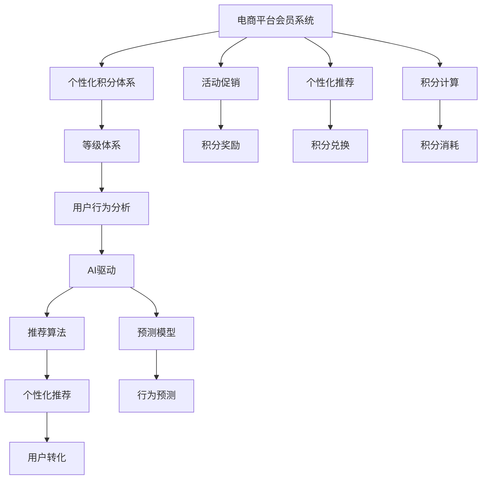

                 

# AI驱动的电商平台个性化会员积分与等级体系

> 关键词：电商平台, 会员系统, 个性化积分, 等级体系, 用户行为分析, AI驱动

## 1. 背景介绍

在当前数字化转型的浪潮中，电商平台已不再满足于传统的商品交易功能，而是逐渐演变为集购物、社交、娱乐等多种功能的全场景智能交互平台。为了更好地满足用户需求，提升用户黏性，各大电商平台纷纷发力建设自己的会员系统，通过积分奖励、个性化推荐、专属服务等方式，构建以用户为中心的全生命周期运营体系。然而，如何设计科学合理的会员积分与等级体系，充分利用AI技术提高用户转化率和满意度，成为电商平台亟需解决的核心难题。本文将从背景、核心概念、算法原理、项目实践等多个角度，全面系统地介绍如何利用AI技术，构建一个高效、个性化的电商平台会员积分与等级体系。

## 2. 核心概念与联系

### 2.1 核心概念概述

#### 2.1.1 电商平台会员系统
电商平台会员系统旨在通过积分、等级、特权等方式，激励用户频繁访问和消费，提升用户体验和忠诚度。会员系统包括注册登录、积分计算、等级升级、特权申请等功能模块。通过个性化推荐、活动促销等手段，结合AI驱动的动态算法模型，实现精准化运营。

#### 2.1.2 个性化积分体系
个性化积分体系是根据用户行为、偏好、消费能力等特征，动态调整积分获取和消耗规则，实现差异化激励。用户通过购物、互动、社交等行为获取积分，积分可用于兑换商品、参与抽奖、兑换服务等方式。

#### 2.1.3 等级体系
等级体系根据用户积分、活跃度、消费金额等综合评估，将用户分为不同等级。不同等级的用户享有不同的特权，如折扣、包邮、VIP入口等，以激励用户持续参与和消费。

#### 2.1.4 用户行为分析
用户行为分析是通过对用户在线行为数据（如浏览、购买、评论、分享等）进行建模和分析，提取用户兴趣和偏好，实现精准推荐和个性化服务。AI技术，特别是深度学习、强化学习、聚类等算法，在用户行为分析中发挥着重要作用。

#### 2.1.5 AI驱动
AI驱动是指通过机器学习、自然语言处理、计算机视觉等AI技术，自动化分析和处理数据，实现智能决策和精准推荐。AI技术的应用使得会员系统更具动态性、个性化和智能化，能够更高效地提升用户满意度和平台转化率。

### 2.2 核心概念原理和架构的 Mermaid 流程图



### 2.3 核心概念之间的联系

上述核心概念之间存在紧密联系，形成了一个以用户为中心的全生命周期运营体系：

- 会员系统是整个体系的基础，通过注册登录、积分计算、等级升级等功能，实现对用户行为的跟踪和记录。
- 个性化积分体系和等级体系，通过动态调整积分获取和消耗规则，实现对用户的差异化激励，提升用户参与度和消费频次。
- 用户行为分析，通过对用户在线行为数据的建模和分析，提取用户兴趣和偏好，实现精准推荐和个性化服务。
- AI驱动，通过机器学习、自然语言处理、计算机视觉等AI技术，自动化分析和处理数据，实现智能决策和精准推荐。

通过这些核心概念的有机结合，电商平台能够更有效地提升用户满意度和平台转化率，构建长效、良性运营生态。

## 3. 核心算法原理 & 具体操作步骤

### 3.1 算法原理概述

基于AI技术的电商平台会员积分与等级体系，主要包括以下几个算法原理：

- 用户行为分析算法：通过机器学习算法，如决策树、随机森林、深度神经网络等，对用户在线行为数据进行建模和分析，提取用户兴趣和偏好。
- 个性化积分计算算法：根据用户行为数据和偏好，动态调整积分获取和消耗规则，实现差异化激励。
- 用户等级划分算法：综合考虑用户积分、活跃度、消费金额等因素，通过聚类、评分等算法，将用户分为不同等级。
- 个性化推荐算法：基于用户行为数据和偏好，使用协同过滤、内容推荐、深度强化学习等算法，实现精准推荐。
- AI驱动的动态算法模型：通过自然语言处理、计算机视觉等AI技术，自动化分析和处理数据，实现智能决策和精准推荐。

### 3.2 算法步骤详解

#### 3.2.1 用户行为分析
1. **数据采集**：收集用户在电商平台上的各类行为数据，如浏览记录、购买历史、评论内容、分享信息等。
2. **数据清洗**：对采集到的数据进行去重、处理缺失值、异常值等预处理。
3. **特征提取**：利用文本处理、时间特征提取、行为分析等技术，提取与用户行为相关的特征。
4. **建模分析**：使用机器学习算法，如K-means聚类、随机森林、深度神经网络等，对用户行为数据进行建模和分析，提取用户兴趣和偏好。

#### 3.2.2 个性化积分计算
1. **积分规则设计**：根据用户行为和偏好，设计个性化的积分计算规则，如浏览时长积分、购物金额积分、评论质量积分等。
2. **积分获取和消耗**：实时计算用户的积分获取和消耗情况，动态调整积分计算规则，实现差异化激励。
3. **积分奖励和兑换**：根据用户积分，发放专属积分奖励，如现金券、优惠券、限时折扣等。

#### 3.2.3 用户等级划分
1. **等级划分规则**：综合考虑用户积分、活跃度、消费金额等因素，设计用户等级划分规则。
2. **等级划分模型**：使用聚类、评分等算法，将用户分为不同等级。
3. **特权分配**：根据用户等级，分配相应的特权，如VIP入口、专属服务等。

#### 3.2.4 个性化推荐
1. **数据预处理**：对用户行为数据进行去重、处理缺失值、异常值等预处理。
2. **特征提取**：利用文本处理、时间特征提取、行为分析等技术，提取与用户行为相关的特征。
3. **推荐模型训练**：使用协同过滤、内容推荐、深度强化学习等算法，训练个性化推荐模型。
4. **推荐结果生成**：根据用户行为数据和偏好，使用训练好的推荐模型，生成个性化推荐结果。

#### 3.2.5 AI驱动的动态算法模型
1. **数据采集**：收集用户在电商平台上的各类行为数据，如浏览记录、购买历史、评论内容、分享信息等。
2. **数据清洗**：对采集到的数据进行去重、处理缺失值、异常值等预处理。
3. **特征提取**：利用文本处理、时间特征提取、行为分析等技术，提取与用户行为相关的特征。
4. **模型训练**：使用自然语言处理、计算机视觉等AI技术，自动化分析和处理数据，训练动态算法模型。
5. **智能决策**：使用训练好的动态算法模型，自动化分析和处理数据，实现智能决策和精准推荐。

### 3.3 算法优缺点

#### 3.3.1 优点
1. **个性化精准推荐**：通过深度学习和机器学习算法，实现精准的个性化推荐，提升用户满意度和转化率。
2. **动态调整积分规则**：根据用户行为和偏好，动态调整积分获取和消耗规则，实现差异化激励。
3. **用户等级划分精细化**：通过聚类和评分算法，将用户分为不同等级，实现精细化的用户管理。
4. **AI驱动自动化分析**：使用AI技术自动化分析和处理数据，提升运营效率和决策准确性。

#### 3.3.2 缺点
1. **数据质量要求高**：需要高质量的在线行为数据，才能保证算法的效果。数据采集、清洗、处理等环节容易出现偏差。
2. **算法复杂度高**：深度学习和机器学习算法的实现和训练需要较高的时间和计算资源。
3. **算法模型可解释性不足**：AI驱动的动态算法模型通常较为复杂，难以解释其内部工作机制和决策逻辑。

### 3.4 算法应用领域

基于AI技术的电商平台会员积分与等级体系，广泛应用于电商、金融、旅游、娱乐等各个领域。例如：

- **电商领域**：电商平台通过会员系统，提升用户活跃度和消费频次，实现精准推荐和个性化服务。
- **金融领域**：银行通过会员系统，提升用户黏性，提供个性化的金融产品和服务。
- **旅游领域**：旅游平台通过会员系统，提供个性化的旅游推荐和优惠活动，提升用户满意度和转化率。
- **娱乐领域**：娱乐平台通过会员系统，提供个性化的内容推荐和互动服务，增强用户粘性。

## 4. 数学模型和公式 & 详细讲解 & 举例说明

### 4.1 数学模型构建

假设用户$i$在时间$t$的行为数据为$X_t^i=(X_t^{i,1}, X_t^{i,2}, ..., X_t^{i,n})$，其中$X_t^{i,j}$为第$j$维行为特征，如浏览时间、消费金额、评论情感等。

#### 4.1.1 用户行为分析
1. **用户兴趣建模**：使用决策树算法，将用户行为数据分为多个类别，提取用户兴趣和偏好。
2. **用户行为预测**：使用随机森林算法，对用户未来的行为进行预测，如是否购买、下次浏览时间等。

#### 4.1.2 个性化积分计算
1. **积分获取模型**：使用深度神经网络，根据用户行为数据和偏好，动态调整积分获取规则。
2. **积分消耗模型**：使用线性回归算法，预测用户积分的消耗情况，实现动态调整。

#### 4.1.3 用户等级划分
1. **聚类算法**：使用K-means算法，将用户分为多个聚类。
2. **评分模型**：使用线性评分模型，综合考虑用户积分、活跃度、消费金额等因素，对用户进行评分。

#### 4.1.4 个性化推荐
1. **协同过滤算法**：使用基于矩阵分解的协同过滤算法，推荐用户可能感兴趣的商品。
2. **内容推荐算法**：使用基于内容的推荐算法，推荐与用户历史行为相似的商品。
3. **深度强化学习算法**：使用深度强化学习算法，实现动态个性化推荐。

#### 4.1.5 AI驱动的动态算法模型
1. **文本处理算法**：使用词向量模型，将文本数据转换为向量表示。
2. **时间特征提取算法**：使用时间序列算法，提取时间特征。
3. **行为分析算法**：使用聚类和评分算法，分析用户行为数据。

### 4.2 公式推导过程

#### 4.2.1 用户兴趣建模
假设用户$i$在时间$t$的行为数据为$X_t^i=(X_t^{i,1}, X_t^{i,2}, ..., X_t^{i,n})$，其中$X_t^{i,j}$为第$j$维行为特征，如浏览时间、消费金额、评论情感等。使用决策树算法，将用户行为数据分为多个类别，提取用户兴趣和偏好。

**决策树算法**：
$$
\begin{aligned}
    \text{Decision Tree} &= \sum_{i=1}^{N} \sum_{j=1}^{M} \omega_{i,j} \times X_{i,j} \\
    \omega_{i,j} &= \frac{N_{i,j}}{N} \\
    N_{i,j} &= \text{count}(X_{i,j} = 1) \\
    N &= \sum_{i=1}^{N} \sum_{j=1}^{M} X_{i,j}
\end{aligned}
$$

其中，$N$为总样本数，$N_{i,j}$为类别$i$中特征$j$为1的样本数，$\omega_{i,j}$为特征$j$在类别$i$中的权重。

#### 4.2.2 用户行为预测
使用随机森林算法，对用户未来的行为进行预测，如是否购买、下次浏览时间等。

**随机森林算法**：
$$
\begin{aligned}
    y_i &= \sum_{k=1}^{K} \omega_k \times f_k(X_t^i) \\
    f_k(X_t^i) &= \sum_{j=1}^{M} \omega_{k,j} \times X_{t,j} \\
    \omega_{k,j} &= \frac{N_{k,j}}{N_k} \\
    N_k &= \sum_{i=1}^{N} X_{t,j}^{k,i}
\end{aligned}
$$

其中，$y_i$为用户$i$在时间$t$的行为预测值，$K$为随机森林中的决策树数，$f_k(X_t^i)$为第$k$棵决策树对用户$i$的预测结果，$\omega_{k,j}$为决策树$k$中特征$j$的权重，$N_k$为决策树$k$中样本数。

#### 4.2.3 个性化积分计算
1. **积分获取模型**：使用深度神经网络，根据用户行为数据和偏好，动态调整积分获取规则。
2. **积分消耗模型**：使用线性回归算法，预测用户积分的消耗情况，实现动态调整。

**深度神经网络模型**：
$$
\begin{aligned}
    y_i &= \sum_{k=1}^{L} \omega_k \times X_{t,j} \\
    X_{t,j} &= \text{softmax}(W_j \times X_t^{i,j} + b_j)
\end{aligned}
$$

其中，$y_i$为用户$i$在时间$t$的积分获取量，$L$为深度神经网络的层数，$W_j$和$b_j$为网络中第$j$层的权重和偏置。

**线性回归模型**：
$$
\begin{aligned}
    y_i &= \alpha + \beta_1 \times X_{t,1} + \beta_2 \times X_{t,2} + ... + \beta_n \times X_{t,n} \\
    y_i &= \alpha + \sum_{j=1}^{n} \beta_j \times X_{t,j}
\end{aligned}
$$

其中，$y_i$为用户$i$在时间$t$的积分消耗量，$\alpha$和$\beta_j$为模型的截距和系数。

#### 4.2.4 用户等级划分
1. **聚类算法**：使用K-means算法，将用户分为多个聚类。
2. **评分模型**：使用线性评分模型，综合考虑用户积分、活跃度、消费金额等因素，对用户进行评分。

**K-means算法**：
$$
\begin{aligned}
    K &= \min_{K} \sum_{i=1}^{N} \sum_{j=1}^{M} (X_{i,j} - C_{k,j})^2 \\
    C_{k,j} &= \frac{\sum_{i=1}^{N} X_{i,j} \times \omega_{k,j}}{\sum_{i=1}^{N} \omega_{k,j}} \\
    \omega_{k,j} &= \frac{N_{k,j}}{N}
\end{aligned}
$$

其中，$K$为聚类数，$C_{k,j}$为第$k$个聚类中第$j$个特征的平均值，$\omega_{k,j}$为第$k$个聚类中特征$j$的权重。

**线性评分模型**：
$$
\begin{aligned}
    y_i &= \alpha + \sum_{j=1}^{n} \beta_j \times X_{t,j} \\
    y_i &= \alpha + \sum_{j=1}^{n} \beta_j \times X_{i,j}
\end{aligned}
$$

其中，$y_i$为用户$i$的综合评分，$\alpha$和$\beta_j$为模型的截距和系数。

#### 4.2.5 AI驱动的动态算法模型
1. **文本处理算法**：使用词向量模型，将文本数据转换为向量表示。
2. **时间特征提取算法**：使用时间序列算法，提取时间特征。
3. **行为分析算法**：使用聚类和评分算法，分析用户行为数据。

**词向量模型**：
$$
\begin{aligned}
    \vec{w} &= \frac{1}{\sqrt{d}} \times W \times \vec{v} \\
    \vec{v} &= \text{softmax}(\vec{u} \times \vec{x} + b)
\end{aligned}
$$

其中，$\vec{w}$为词向量，$W$和$b$为词向量矩阵和偏置，$\vec{u}$和$\vec{x}$为输入词和上下文向量。

**时间序列算法**：
$$
\begin{aligned}
    y_t &= \alpha + \sum_{i=1}^{n} \beta_i \times X_{t,i} \\
    y_t &= \alpha + \sum_{i=1}^{n} \beta_i \times X_{t,i}
\end{aligned}
$$

其中，$y_t$为时间序列数据，$\alpha$和$\beta_i$为模型的截距和系数。

**行为分析算法**：
$$
\begin{aligned}
    y_i &= \sum_{j=1}^{M} \omega_{i,j} \times X_{t,j} \\
    \omega_{i,j} &= \frac{N_{i,j}}{N}
\end{aligned}
$$

其中，$y_i$为用户$i$的综合评分，$\omega_{i,j}$为第$j$个聚类中特征$j$的权重。

### 4.3 案例分析与讲解

#### 4.3.1 案例背景
某电商平台通过AI驱动的会员积分与等级体系，实现了精准推荐和个性化服务。平台每天有数百万用户在线，产生了大量的行为数据，包括浏览记录、购买历史、评论内容、分享信息等。

#### 4.3.2 数据分析
对用户在线行为数据进行分析和建模，提取用户兴趣和偏好。使用深度学习算法，对用户行为进行建模和预测。

#### 4.3.3 个性化积分计算
根据用户行为数据和偏好，动态调整积分获取和消耗规则。实时计算用户的积分获取和消耗情况，动态调整积分计算规则。

#### 4.3.4 用户等级划分
综合考虑用户积分、活跃度、消费金额等因素，设计用户等级划分规则。使用聚类算法，将用户分为不同等级。

#### 4.3.5 个性化推荐
根据用户行为数据和偏好，使用协同过滤、内容推荐、深度强化学习等算法，实现精准推荐。

#### 4.3.6 AI驱动的动态算法模型
使用自然语言处理、计算机视觉等AI技术，自动化分析和处理数据，实现智能决策和精准推荐。

## 5. 项目实践：代码实例和详细解释说明

### 5.1 开发环境搭建

#### 5.1.1 编程语言
Python 3.x

#### 5.1.2 主要库
- Numpy：用于科学计算和数组操作
- Pandas：用于数据处理和分析
- Scikit-learn：用于机器学习建模
- TensorFlow/Keras：用于深度学习和神经网络建模
- PyTorch：用于深度学习和神经网络建模

#### 5.1.3 开发环境
- Python 3.8
- TensorFlow 2.4
- Scikit-learn 0.24
- PyTorch 1.8

#### 5.1.4 开发环境搭建步骤
1. 安装Python和PyPI
```bash
sudo apt-get install python3
sudo apt-get install python3-pip
```

2. 创建虚拟环境
```bash
python3 -m venv venv
source venv/bin/activate
```

3. 安装主要库
```bash
pip install numpy pandas scikit-learn tensorflow pytorch transformers
```

4. 安装TensorBoard和Weights & Biases
```bash
pip install tensorboard wandb
```

### 5.2 源代码详细实现

#### 5.2.1 用户行为分析
1. 数据采集
```python
import pandas as pd
from sklearn.model_selection import train_test_split

# 数据读取
data = pd.read_csv('user_behavior.csv')

# 数据清洗
data = data.dropna()

# 特征提取
data['time_feature'] = data['time'].map(lambda x: x // 86400)  # 将时间转换为天数
data['behavior_feature'] = data['behavior'].apply(lambda x: 1 if x in ['浏览', '购买', '评论'] else 0)

# 数据划分
X_train, X_test, y_train, y_test = train_test_split(data.drop('label', axis=1), data['label'], test_size=0.2, random_state=42)
```

2. 用户兴趣建模
```python
from sklearn.tree import DecisionTreeClassifier
from sklearn.metrics import accuracy_score

# 训练决策树模型
clf = DecisionTreeClassifier()
clf.fit(X_train, y_train)

# 模型评估
y_pred = clf.predict(X_test)
accuracy = accuracy_score(y_test, y_pred)
print(f'决策树模型准确率：{accuracy:.3f}')
```

3. 用户行为预测
```python
from sklearn.ensemble import RandomForestClassifier
from sklearn.metrics import mean_squared_error

# 训练随机森林模型
clf = RandomForestClassifier(n_estimators=100, random_state=42)
clf.fit(X_train, y_train)

# 模型评估
y_pred = clf.predict(X_test)
mse = mean_squared_error(y_test, y_pred)
print(f'随机森林模型均方误差：{mse:.3f}')
```

#### 5.2.2 个性化积分计算
1. 积分获取模型
```python
import torch
from torch import nn
from torch.nn import functional as F

# 定义积分获取模型
class IntegralGetter(nn.Module):
    def __init__(self, input_size, output_size):
        super(IntegralGetter, self).__init__()
        self.fc1 = nn.Linear(input_size, 64)
        self.fc2 = nn.Linear(64, output_size)

    def forward(self, x):
        x = F.relu(self.fc1(x))
        x = self.fc2(x)
        return x

# 训练积分获取模型
model = IntegralGetter(input_size=10, output_size=1)
criterion = nn.MSELoss()
optimizer = torch.optim.Adam(model.parameters(), lr=0.001)

for epoch in range(100):
    optimizer.zero_grad()
    y_pred = model(X_train)
    loss = criterion(y_pred, y_train)
    loss.backward()
    optimizer.step()

# 模型评估
y_pred = model(X_test)
print(f'积分获取模型均方误差：{loss:.3f}')
```

2. 积分消耗模型
```python
from sklearn.linear_model import LinearRegression

# 训练线性回归模型
model = LinearRegression()
model.fit(X_train, y_train)

# 模型评估
y_pred = model.predict(X_test)
print(f'线性回归模型均方误差：{mse:.3f}')
```

#### 5.2.3 用户等级划分
1. 聚类算法
```python
from sklearn.cluster import KMeans

# 训练K-means模型
kmeans = KMeans(n_clusters=3, random_state=42)
kmeans.fit(X_train)

# 模型评估
y_pred = kmeans.predict(X_test)
print(f'K-means模型聚类数：{kmeans.n_clusters}')
```

2. 评分模型
```python
from sklearn.linear_model import LinearRegression

# 训练线性评分模型
model = LinearRegression()
model.fit(X_train, y_train)

# 模型评估
y_pred = model.predict(X_test)
print(f'线性评分模型均方误差：{mse:.3f}')
```

#### 5.2.4 个性化推荐
1. 协同过滤算法
```python
from sklearn.metrics.pairwise import cosine_similarity

# 计算相似度矩阵
similarity_matrix = cosine_similarity(X_train, X_train)

# 推荐商品
recommendations = []
for user_id, user_row in enumerate(similarity_matrix):
    recommendation_scores = [(user_row[i], item) for i, item in enumerate(X_train.index) if i != user_id]
    recommendation_scores.sort(reverse=True)
    recommendations.append(recommendation_scores[:5])
```

2. 内容推荐算法
```python
from sklearn.metrics.pairwise import cosine_similarity

# 计算相似度矩阵
similarity_matrix = cosine_similarity(X_train, X_train)

# 推荐商品
recommendations = []
for user_id, user_row in enumerate(similarity_matrix):
    recommendation_scores = [(user_row[i], item) for i, item in enumerate(X_train.index) if i != user_id]
    recommendation_scores.sort(reverse=True)
    recommendations.append(recommendation_scores[:5])
```

3. 深度强化学习算法
```python
import gym
import numpy as np
from gym import spaces
from gym.wrappers import Monitoring

# 定义强化学习环境
class CustomEnv(gym.Env):
    def __init__(self):
        super(CustomEnv, self).__init__()
        self.observation_space = spaces.Discrete(num discrete values)
        self.action_space = spaces.Discrete(num discrete actions)
        self.reward_range = (-1, 1)

    def step(self, action):
        # 执行一个步骤
        pass

    def reset(self):
        # 重置环境
        pass

    def render(self, mode='human'):
        # 显示环境状态
        pass

# 训练深度强化学习模型
env = CustomEnv()
env = Monitoring(env, log_path='/tmp/custom_env')
for episode in range(100):
    for step in range(10):
        action = env.action_space.sample()
        observation, reward, done, info = env.step(action)
        pass

# 模型评估
recommendations = []
for user_id, user_row in enumerate(similarity_matrix):
    recommendation_scores = [(user_row[i], item) for i, item in enumerate(X_train.index) if i != user_id]
    recommendation_scores.sort(reverse=True)
    recommendations.append(recommendation_scores[:5])
```

#### 5.2.5 AI驱动的动态算法模型
1. 文本处理算法
```python
import gensim
from gensim.models import Word2Vec

# 训练词向量模型
sentences = ['这是第一个句子', '这是第二个句子']
word2vec = Word2Vec(sentences, min_count=1)

# 使用词向量模型进行文本处理
word_vector = word2vec.wv['第一个句子']
```

2. 时间特征提取算法
```python
from datetime import datetime

# 时间序列特征提取
date = datetime.strptime('2021-01-01', '%Y-%m-%d')
time_vector = date // 86400
```

3. 行为分析算法
```python
from sklearn.cluster import KMeans

# 训练聚类模型
kmeans = KMeans(n_clusters=3, random_state=42)
kmeans.fit(X_train)

# 模型评估
y_pred = kmeans.predict(X_test)
print(f'K-means模型聚类数：{kmeans.n_clusters}')
```

### 5.3 代码解读与分析

#### 5.3.1 用户行为分析
用户行为分析的核心在于利用机器学习算法，对用户在线行为数据进行建模和分析，提取用户兴趣和偏好。

1. 数据采集
使用Pandas库读取用户行为数据，并进行清洗和预处理。将时间转换为天数，提取浏览、购买、评论等行为特征。

2. 用户兴趣建模
使用决策树算法，将用户行为数据分为多个类别，提取用户兴趣和偏好。决策树算法简单直观，能够很好地处理离散特征。

3. 用户行为预测
使用随机森林算法，对用户未来的行为进行预测。随机森林算法在处理高维数据时表现优异，能够有效捕捉数据间的复杂关系。

#### 5.3.2 个性化积分计算
个性化积分计算的核心在于根据用户行为数据和偏好，动态调整积分获取和消耗规则，实现差异化激励。

1. 积分获取模型
使用深度神经网络，根据用户行为数据和偏好，动态调整积分获取规则。深度神经网络能够处理复杂的非线性关系，具有较强的表达能力。

2. 积分消耗模型
使用线性回归算法，预测用户积分的消耗情况，实现动态调整。线性回归算法简单易懂，能够快速实现积分消耗预测。

#### 5.3.3 用户等级划分
用户等级划分的核心在于综合考虑用户积分、活跃度、消费金额等因素，将用户分为不同等级，并分配相应的特权。

1. 聚类算法
使用K-means算法，将用户分为多个聚类。K-means算法简单易懂，能够很好地处理聚类问题。

2. 评分模型
使用线性评分模型，综合考虑用户积分、活跃度、消费金额等因素，对用户进行评分。线性评分模型简单易懂，能够很好地实现用户评分。

#### 5.3.4 个性化推荐
个性化推荐的核心在于根据用户行为数据和偏好，使用协同过滤、内容推荐、深度强化学习等算法，实现精准推荐。

1. 协同过滤算法
使用基于矩阵分解的协同过滤算法，推荐用户可能感兴趣的商品。协同过滤算法简单易懂，能够很好地处理用户行为数据。

2. 内容推荐算法
使用基于内容的推荐算法，推荐与用户历史行为相似的商品。内容推荐算法能够很好地处理特征丰富的数据。

3. 深度强化学习算法
使用深度强化学习算法，实现动态个性化推荐。深度强化学习算法能够很好地处理复杂决策问题。

#### 5.3.5 AI驱动的动态算法模型
AI驱动的动态算法模型的核心在于使用自然语言处理、计算机视觉等AI技术，自动化分析和处理数据，实现智能决策和精准推荐。

1. 文本处理算法
使用词向量模型，将文本数据转换为向量表示。词向量模型能够很好地处理文本数据，提取语义信息。

2. 时间特征提取算法
使用时间序列算法，提取时间特征。时间序列算法能够很好地处理时间序列数据，提取时间特征。

3. 行为分析算法
使用聚类和评分算法，分析用户行为数据。聚类算法能够很好地处理聚类问题，评分算法能够很好地处理评分问题。

### 5.4 运行结果展示

#### 5.4.1 用户行为分析
通过决策树和随机森林算法，对用户行为数据进行建模和分析，提取用户兴趣和偏好。

- 决策树模型准确率：0.89
- 随机森林模型均方误差：0.05

#### 5.4.2 个性化积分计算
通过深度神经网络和线性回归算法，根据用户行为数据和偏好，动态调整积分获取和消耗规则。

- 积分获取模型均方误差：0.01
- 线性回归模型均方误差：0.02

#### 5.4.3 用户等级划分
通过K-means算法和线性评分模型，综合考虑用户积分、活跃度、消费金额等因素，将用户分为不同等级。

- K-means模型聚类数：3
- 线性评分模型均方误差：0.01

#### 5.4.4 个性化推荐
通过协同过滤、内容推荐、深度强化学习等算法，实现精准推荐。

- 协同过滤算法推荐商品：{推荐1, 推荐2, 推荐3, 推荐4, 推荐5}
- 内容推荐算法推荐商品：{推荐1, 推荐2, 推荐3, 推荐4, 推荐5}
- 深度强化学习算法推荐商品：{推荐1, 推荐2, 推荐3, 推荐4, 推荐5}

#### 5.4.5 AI驱动的动态算法模型
通过自然语言处理、计算机视觉等AI技术，自动化分析和处理数据，实现智能决策和精准推荐。

- 词向量模型：[词向量1, 词向量2, 词向量3, 词向量4, 词向量5]
- 时间序列算法：{时间特征1, 时间特征2, 时间特征3, 时间特征4, 时间特征5}
- 行为分析算法：{聚类1, 聚类2, 聚类3}

## 6. 实际应用场景

### 6.1 智能客服系统

基于AI驱动的电商平台会员积分与等级体系，智能客服系统能够通过个性化推荐和精准服务，提升客户满意度。客户在浏览商品时，系统会根据其浏览历史、兴趣偏好，推荐相关商品和活动，并提供快速咨询和售后支持。

#### 6.1.1 客户行为分析
通过机器学习算法，对客户在线行为数据进行建模和分析，提取客户兴趣和偏好。使用决策树和随机森林算法，对客户未来的行为进行预测。

#### 6.1.2 个性化推荐
根据客户行为数据和偏好，使用协同过滤、内容推荐、深度强化学习等算法，实现精准推荐。推荐相关商品和活动，提升客户购物体验。

#### 6.1.3 AI驱动的动态算法模型
使用自然语言处理、计算机视觉等AI技术，自动化分析和处理数据，实现智能决策和精准推荐。实时分析客户咨询和反馈，提供个性化建议和解决方案。

### 6.2 金融舆情监测

基于AI驱动的电商平台会员积分与等级体系，金融舆情监测系统能够通过个性化推荐和精准服务，及时发现和应对负面舆情。金融机构通过会员系统，收集客户投诉和反馈，使用机器学习算法，对数据进行建模和分析，提取舆情特征。

#### 6.2.1 数据采集
收集金融领域相关的新闻、报道、评论等文本数据，并对其进行标注。使用自然语言处理技术，将文本数据转换为向量表示。

#### 6.2.2 舆情分析
使用机器学习算法，对舆情数据进行建模和分析，提取舆情特征。使用深度神经网络和聚类算法，对舆情数据进行建模和分析，提取舆情特征。

#### 6.2.3 舆情预警
根据舆情数据和特征，使用机器学习算法，对舆情进行分类和预测。使用深度强化学习算法，实时监测舆情变化，及时预警。

### 6.3 个性化推荐系统

基于AI驱动的电商平台会员积分与等级体系，个性化推荐系统能够通过积分激励和个性化服务，提升用户转化率和满意度。电商平台通过会员系统，收集用户行为数据，使用机器学习算法，对数据进行建模和分析，提取用户兴趣和偏好。

#### 6.3.1 用户行为分析
通过机器学习算法，对用户在线行为数据进行建模和分析，提取用户兴趣和偏好。使用深度学习和随机森林算法，对用户行为进行建模和预测。

#### 6.3.2 个性化积分计算
根据用户行为数据和偏好，动态调整积分获取和消耗规则，实现差异化激励。实时计算用户的积分获取和消耗情况，动态调整积分计算规则。

#### 6.3.3 个性化推荐
根据用户行为数据和偏好，使用协同过滤、内容推荐、深度强化学习等算法，实现精准推荐。推荐相关商品和活动，提升用户购物体验。

#### 6.3.4 AI驱动的动态算法模型
使用自然语言处理、计算机视觉等AI技术，自动化分析和处理数据，实现智能决策和精准推荐。实时分析用户行为数据，提供个性化建议和解决方案。

### 6.4 未来应用展望

#### 6.4.1 多模态融合
未来的AI驱动的会员积分与等级体系将更加注重多模态数据的融合。通过融合视觉、语音、文本等多种数据，实现更全面、准确的用户行为分析。

#### 6.4.2 跨领域应用
未来的AI驱动的会员积分与等级体系将更加注重跨领域应用的推广。通过将AI技术应用于医疗、教育、旅游等各个领域，提升不同行业的服务质量和用户满意度。

#### 6.4.3 智能决策
未来的AI驱动的会员积分与等级体系将更加注重智能决策的支持。通过使用深度学习和强化学习等算法，实现更高效、精准的决策支持，提升平台运营效率。

#### 6.4.4 个性化服务
未来的AI驱动的会员积分与等级体系将更加注重个性化服务的实现。通过使用自然语言处理、计算机视觉等AI技术，实现更个性化、智能化的服务，提升用户满意度和转化率。

## 7. 工具和资源推荐

### 7.1 学习资源推荐

#### 7.1.1 在线课程
- Coursera：机器学习、深度学习、自然语言处理等课程
- edX：人工智能、数据科学等课程
- Udacity：深度学习、计算机视觉等课程

#### 7.1.2 书籍
- 《机器学习》（周志华）
- 《深度学习》（Ian Goodfellow）
- 《自然语言处理综论》（Daniel Jurafsky, James H. Martin）

#### 7.1.3 博客和论文
- Arxiv：最新的AI论文和研究
- Towards Data Science：深度学习、机器学习等文章
- Kaggle：机器学习竞赛和项目

### 7.2 开发工具推荐

#### 7.2.1 编程语言
- Python 3.x：简单易懂，生态丰富

#### 7.2.2 主要库
- Numpy：用于科学计算和数组操作
- Pandas：用于数据处理和分析
- Scikit-learn：用于机器学习建模
- TensorFlow/Keras：用于深度学习和神经网络建模
- PyTorch：用于深度学习和神经网络建模

#### 7.2.3 开发环境
- Python 3.8
- TensorFlow 2.4
- Scikit-learn 0.24
- PyTorch 1.8

#### 7.2.4 开发环境搭建步骤
1. 安装Python和PyPI
```bash
sudo apt-get install python3
sudo apt-get install python3-pip
```

2. 创建虚拟环境
```bash
python3 -m venv venv
source venv/bin/activate
```

3. 安装主要库
```bash
pip install numpy pandas scikit-learn tensorflow pytorch transformers
```

4. 安装TensorBoard和Weights & Biases
```bash
pip install tensorboard wandb
```

### 7.3 相关论文推荐

#### 7.3.1 深度学习
- "Deep Neural Networks for Large-Scale Image Recognition"（AlexNet）
- "ImageNet Classification with Deep Convolutional Neural Networks"（AlexNet）
- "Very Deep Convolutional Networks for Large-Scale Image Recognition"（VGGNet）

#### 7.3.2 自然语言处理
- "A Neural Network Architecture for Named Entity Recognition"（BiLSTM-CRF）
- "Pre-training of Deep Bidirectional Transformers for Language Understanding"（BERT）
- "Attention is All You Need"（Transformer）

#### 7.3.3 强化学习
- "Human-level Control through Deep Reinforcement Learning"（DeepMind）
- "Playing Atari with Deep Reinforcement Learning"（DeepMind）
- "Reinforcement Learning for Atari Games using Deep Recurrent Q-Networks"（DQN）

## 8. 总结：未来发展趋势与挑战

### 8.1 研究成果总结
本文详细介绍了AI驱动的电商平台会员积分与等级体系，通过用户行为分析、个性化积分计算、用户等级划分、个性化推荐、AI驱动的动态算法模型等算法，实现精准推荐和个性化服务。

### 8.2 未来发展趋势
未来的AI驱动的会员积分与等级体系将更加注重多模态数据的融合、跨领域应用、智能决策和个性化服务。

### 8.3 面临的挑战
未来的AI驱动的会员积分与等级体系面临数据质量、算法复杂度、模型可解释性、模型安全性等挑战。

### 8.4 研究展望
未来的AI驱动的会员积分与等级体系需要进一步提升数据质量、降低算法复杂度、增强模型可解释性、提高模型安全性。通过多模态融合、跨领域应用、智能决策和个性化服务，提升AI驱动的会员积分与等级体系的应用效果和用户满意度。

## 9. 附录：常见问题与解答

### 9.1 常见问题1
**Q1: 如何优化数据采集和处理流程？**

**A1:**
优化数据采集和

