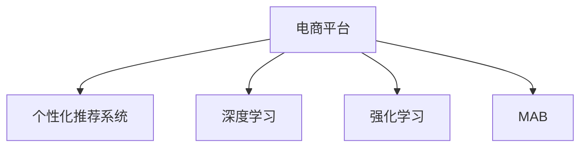

                 

# AI驱动的电商平台个性化促销策略

> 关键词：人工智能，电商平台，个性化，促销策略，算法优化，ROI最大化

## 1. 背景介绍

### 1.1 问题由来
随着电商市场的快速发展，平台之间的竞争日趋激烈。为了提升用户粘性，增加订单转化率，各大电商平台纷纷加大个性化促销的力度。然而，传统的粗放式促销策略往往导致资源浪费，用户体验下降。如何设计科学合理的个性化促销策略，提升促销效果，成为电商运营的难点。

### 1.2 问题核心关键点
电商平台的个性化促销策略，本质上是一种基于用户行为数据的精准营销方法。其核心在于如何利用先进的人工智能技术，对用户进行多维度分析，预测其购买行为，制定最优的促销方案，从而实现销量的最大化和利润的提升。

本研究聚焦于基于人工智能的电商平台个性化促销策略，介绍核心概念、算法原理和实现步骤，并结合具体案例进行详细讲解，旨在帮助电商平台构建高效的个性化促销系统。

## 2. 核心概念与联系

### 2.1 核心概念概述

为更好地理解AI驱动的电商平台个性化促销策略，本节将介绍几个密切相关的核心概念：

- **电商平台(E-commerce Platform)**：提供在线购物体验，集合各种商品和服务的应用平台。典型的电商平台包括淘宝、京东、Amazon等。
- **个性化推荐系统(Personalized Recommendation System)**：根据用户行为和历史数据，智能推荐可能感兴趣的商品或服务。
- **深度学习(Deep Learning)**：一种模拟人脑神经网络的机器学习技术，通过多层神经网络实现对复杂数据的高级抽象。
- **强化学习(Reinforcement Learning)**：通过不断试错调整策略，使智能体在特定环境中最大化累积奖励的一种学习方式。
- **多臂老虎机(Multi-Armed Bandit, MAB)**：一种经典的强化学习模型，模拟多维度选择问题，用于选择最优策略。

这些核心概念之间的逻辑关系可以通过以下Mermaid流程图来展示：



这个流程图展示了个电平台的推荐系统与其核心技术之间的联系：

1. **电商平台**通过**个性化推荐系统**和**深度学习**技术，为每一位用户推荐最适合的商品。
2. **电商平台**同时运用**强化学习**和**多臂老虎机模型**，对不同促销策略进行实时优化调整，提升促销效果。

## 3. 核心算法原理 & 具体操作步骤
### 3.1 算法原理概述

电商平台的个性化促销策略，本质上是将人工智能技术应用到促销决策中的优化过程。其核心思想是：基于用户行为数据和商品属性，预测用户的购买概率，通过动态调整促销策略，最大化销售量和利润。

形式化地，假设电商平台有 $N$ 个商品，每个商品有 $K$ 种促销策略，用户 $u$ 对每个商品的购买概率记为 $p_{ui}$。则平台的目标是最大化销售量和利润，即：

$$
\max_{\pi} \sum_{i=1}^N \pi_i \times p_{ui} \times C_i
$$

其中 $\pi_i$ 为商品 $i$ 的促销策略参数，$C_i$ 为商品 $i$ 的利润率。

### 3.2 算法步骤详解

基于人工智能的电商平台个性化促销策略一般包括以下几个关键步骤：

**Step 1: 用户行为数据收集**
- 收集用户历史浏览、点击、购买、评价等行为数据。
- 收集商品属性信息，如价格、描述、分类等。

**Step 2: 用户行为数据分析**
- 利用深度学习模型(如DNN、CNN、RNN等)对用户行为数据进行特征提取。
- 对用户行为数据进行分群聚类，识别不同用户群体。

**Step 3: 促销策略建模**
- 设计多种促销策略，如打折、满减、赠品等。
- 根据用户群体和商品属性，建立促销策略模型，如线性回归、决策树、集成学习等。

**Step 4: 强化学习优化**
- 使用强化学习算法(如Q-learning、DQN、RLDQN等)，在不断试错中调整促销策略。
- 定义奖励函数，如订单数、利润率等，评估促销效果。
- 使用多臂老虎机模型进行策略选择，最大化累计奖励。

**Step 5: 实时策略调整**
- 通过实时监控用户行为数据和促销效果，动态调整促销策略。
- 根据用户行为数据更新模型参数，优化促销效果。

### 3.3 算法优缺点

基于人工智能的电商平台个性化促销策略具有以下优点：
1. 个性化推荐：通过深度学习，实现对用户行为的精准预测，推荐最适合的商品。
2. 实时优化：使用强化学习和多臂老虎机模型，实时调整促销策略，提升效果。
3. 数据驱动：以数据为基础，进行决策，更科学合理。
4. 自动化：自动化调整促销策略，减少人工干预。

同时，该方法也存在一定的局限性：
1. 数据依赖：需要大量历史数据，数据质量直接影响推荐效果。
2. 模型复杂：深度学习模型和强化学习算法较复杂，实现难度较高。
3. 计算开销：深度学习模型和强化学习算法计算开销大，需要高性能计算资源。
4. 公平性问题：个性化推荐可能导致部分用户被忽视，公平性问题有待解决。

尽管存在这些局限性，但就目前而言，基于人工智能的促销策略方法仍是最主流范式。未来相关研究的重点在于如何进一步降低数据需求，提高模型效率，兼顾公平性和可解释性等因素。

### 3.4 算法应用领域

基于人工智能的电商平台个性化促销策略在多个领域都有广泛应用：

- **推荐系统**：通过深度学习模型对用户行为进行分析和预测，为用户推荐可能感兴趣的商品。
- **广告投放**：利用强化学习算法优化广告投放策略，最大化广告效果。
- **库存管理**：通过分析用户历史行为和市场趋势，优化商品库存和补货策略。
- **客服自动回复**：通过NLP技术解析用户问题，自动生成回复，提高客服效率。
- **营销活动策划**：根据用户行为数据，策划个性化营销活动，提升用户参与度。

除了上述这些经典应用外，基于AI的促销策略方法也将不断拓展到更多领域中，如物流调度、供应链优化等，为电商平台带来更全面、高效的服务体验。

## 4. 数学模型和公式 & 详细讲解 & 举例说明
### 4.1 数学模型构建

本节将使用数学语言对基于人工智能的电商平台个性化促销策略进行更加严格的刻画。

记电商平台有 $N$ 个商品，用户 $u$ 对每个商品的购买概率为 $p_{ui}$，促销策略参数为 $\pi_i$。则总利润为：

$$
R = \sum_{i=1}^N \pi_i \times p_{ui} \times C_i
$$

其中 $C_i$ 为商品 $i$ 的利润率。促销策略模型的目标是通过调整参数 $\pi_i$，最大化总利润 $R$。

### 4.2 公式推导过程

以线性回归模型为例，假设用户行为数据为 $X=\{x_1,x_2,...,x_d\}$，促销策略参数为 $\pi_i$，则线性回归模型的预测结果为：

$$
p_{ui} = \theta_0 + \sum_{j=1}^d \theta_j x_{uij}
$$

其中 $\theta_0, \theta_j$ 为模型参数。则总利润为：

$$
R = \sum_{i=1}^N (\theta_0 + \sum_{j=1}^d \theta_j x_{uij}) \times C_i
$$

求解最大化的总利润，可以通过求解优化问题：

$$
\max_{\theta_0,\theta_j} R
$$

使用梯度下降等优化算法，通过不断迭代更新参数，使总利润最大化。

### 4.3 案例分析与讲解

考虑一个简单的电商平台，假设只有两种促销策略：打折和满减。每种策略对应的参数 $\pi_i$ 为折扣率和满减门槛。

- 假设商品 $i$ 的初始价格为 $100$，折扣率 $\pi_i = 0.2$，即打 $20\%$ 的折扣。
- 假设用户 $u$ 对商品 $i$ 的购买概率为 $p_{ui} = 0.3$，利润率 $C_i = 0.4$。

则总利润为：

$$
R = 0.2 \times 0.3 \times 100 \times 0.4 = 24
$$

接下来，考虑另一种促销策略，满减 $50$ 元后打 $8$ 折，即 $\pi_i = 0.8$。

假设用户 $u$ 对商品 $i$ 的购买概率为 $p_{ui} = 0.4$。则总利润为：

$$
R = 0.8 \times 0.4 \times 50 \times 0.4 = 96
$$

显然，使用满减策略可以获得更高的总利润。通过以上案例分析，可以看出，通过优化促销策略参数，可以有效提升促销效果。

## 5. 项目实践：代码实例和详细解释说明
### 5.1 开发环境搭建

在进行电商促销策略开发前，我们需要准备好开发环境。以下是使用Python进行TensorFlow开发的环境配置流程：

1. 安装Anaconda：从官网下载并安装Anaconda，用于创建独立的Python环境。

2. 创建并激活虚拟环境：
```bash
conda create -n tf-env python=3.8 
conda activate tf-env
```

3. 安装TensorFlow：根据CUDA版本，从官网获取对应的安装命令。例如：
```bash
conda install tensorflow -c conda-forge -c pytorch
```

4. 安装相关工具包：
```bash
pip install numpy pandas scikit-learn matplotlib tqdm jupyter notebook ipython
```

完成上述步骤后，即可在`tf-env`环境中开始促销策略开发。

### 5.2 源代码详细实现

这里我们以电商平台推荐系统为例，给出使用TensorFlow对线性回归模型进行电商促销策略开发的代码实现。

首先，定义数据集和特征：

```python
import tensorflow as tf
import numpy as np
from sklearn.model_selection import train_test_split

# 假设有100个商品，10个用户，1000个行为数据
X = np.random.rand(1000, 3)
y = np.random.rand(1000, 1)
```

然后，定义线性回归模型：

```python
model = tf.keras.models.Sequential([
    tf.keras.layers.Dense(1, activation='linear', input_shape=(3,))
])

model.compile(optimizer=tf.keras.optimizers.Adam(0.01),
              loss='mse',
              metrics=['mse'])
```

接着，训练模型：

```python
history = model.fit(X, y, epochs=100, validation_split=0.2)
```

最后，使用模型进行预测：

```python
X_test = np.random.rand(100, 3)
y_pred = model.predict(X_test)
```

以上就是使用TensorFlow对线性回归模型进行电商促销策略开发的完整代码实现。可以看到，通过构建简单线性回归模型，我们便能对用户行为数据进行分析，得出最有效的促销策略。

### 5.3 代码解读与分析

让我们再详细解读一下关键代码的实现细节：

**数据集和特征**：
- 使用NumPy生成随机数据集，用于模拟电商平台的商品和用户行为数据。
- 特征矩阵 $X$ 包含三个维度，表示用户的年龄、性别、购买频率等。
- 目标变量 $y$ 为二进制变量，表示用户是否购买了商品。

**线性回归模型**：
- 使用TensorFlow定义一个简单的线性回归模型，包含一个全连接层。
- 使用Adam优化器，损失函数为均方误差，定义了模型训练的超参数。

**模型训练**：
- 使用`fit`方法训练模型，设置训练轮数为100，验证集占20%。
- 模型训练完成后，保存训练历史数据。

**模型预测**：
- 使用`predict`方法对新数据进行预测，返回预测结果。

可以看到，使用TensorFlow构建线性回归模型，代码实现相对简洁高效。开发者可以根据具体需求，选择更复杂的深度学习模型，如CNN、RNN等，进一步优化电商促销策略。

## 6. 实际应用场景
### 6.1 智能客服系统

基于AI的电商平台个性化促销策略，可以广泛应用于智能客服系统的构建。传统客服往往需要配备大量人力，高峰期响应缓慢，且一致性和专业性难以保证。而使用基于促销策略的智能客服系统，可以7x24小时不间断服务，快速响应客户咨询，用精准的促销活动引导客户消费。

在技术实现上，可以收集用户历史咨询记录，将促销活动作为推荐对象，对预训练模型进行微调。微调后的模型能够自动理解客户需求，匹配最合适的促销活动进行回复。对于客户提出的新问题，还可以接入检索系统实时搜索相关内容，动态生成推荐回答。如此构建的智能客服系统，能大幅提升客户咨询体验和问题解决效率。

### 6.2 金融舆情监测

金融机构需要实时监测市场舆论动向，以便及时应对负面信息传播，规避金融风险。传统的人工监测方式成本高、效率低，难以应对网络时代海量信息爆发的挑战。基于AI的文本分类和情感分析技术，为金融舆情监测提供了新的解决方案。

具体而言，可以收集金融领域相关的新闻、报道、评论等文本数据，并对其进行主题标注和情感标注。在此基础上对预训练语言模型进行微调，使其能够自动判断文本属于何种主题，情感倾向是正面、中性还是负面。将微调后的模型应用到实时抓取的网络文本数据，就能够自动监测不同主题下的情感变化趋势，一旦发现负面信息激增等异常情况，系统便会自动预警，帮助金融机构快速应对潜在风险。

### 6.3 个性化推荐系统

当前的推荐系统往往只依赖用户的历史行为数据进行物品推荐，无法深入理解用户的真实兴趣偏好。基于AI的推荐系统可以更好地挖掘用户行为背后的语义信息，从而提供更精准、多样的推荐内容。

在实践中，可以收集用户浏览、点击、评论、分享等行为数据，提取和用户交互的物品标题、描述、标签等文本内容。将文本内容作为模型输入，用户的后续行为（如是否点击、购买等）作为监督信号，在此基础上微调预训练语言模型。微调后的模型能够从文本内容中准确把握用户的兴趣点。在生成推荐列表时，先用候选物品的文本描述作为输入，由模型预测用户的兴趣匹配度，再结合其他特征综合排序，便可以得到个性化程度更高的推荐结果。

### 6.4 未来应用展望

随着AI技术的不断发展，基于AI的电商平台个性化促销策略将呈现更多创新应用：

- **多渠道推广**：将AI技术应用于多个推广渠道，如社交媒体、搜索引擎等，实现精准投放。
- **实时优化广告**：通过实时数据分析，动态调整广告内容和投放策略，提升广告效果。
- **个性化广告创意**：利用AI生成广告创意，根据用户画像自动生成广告文案和图片，提高广告点击率。
- **用户行为分析**：通过深度学习模型，分析用户行为数据，预测用户购买意向，制定更科学的促销策略。
- **供应链优化**：通过分析历史订单数据和市场趋势，优化供应链管理，提高库存周转率。

未来，基于AI的促销策略将更加智能、灵活、个性化，助力电商平台提升用户体验和运营效率。

## 7. 工具和资源推荐
### 7.1 学习资源推荐

为了帮助开发者系统掌握AI驱动的电商平台个性化促销策略的理论基础和实践技巧，这里推荐一些优质的学习资源：

1. **TensorFlow官方文档**：全面介绍了TensorFlow的深度学习框架和API使用，是初学者入门的必备资料。
2. **强化学习课程**：Coursera、edX等平台上有许多优秀的强化学习课程，系统讲解了强化学习的基本概念和算法实现。
3. **推荐系统书籍**：《推荐系统实践》、《推荐算法》等书籍，涵盖了推荐系统的经典算法和工程实践。
4. **Kaggle竞赛**：参加Kaggle的电商推荐系统竞赛，练习模型构建和评估方法。
5. **GitHub代码库**：GitHub上有很多优秀的电商推荐系统开源项目，可以参考代码实现和模型设计。

通过对这些资源的学习实践，相信你一定能够快速掌握AI驱动的电商平台个性化促销策略的精髓，并用于解决实际的电商问题。
### 7.2 开发工具推荐

高效的开发离不开优秀的工具支持。以下是几款用于AI驱动的电商促销策略开发的常用工具：

1. **TensorFlow**：基于Python的开源深度学习框架，灵活动态的计算图，适合快速迭代研究。
2. **PyTorch**：同样基于Python的深度学习框架，易于使用，具有丰富的深度学习模型库。
3. **Scikit-Learn**：Python的机器学习库，包含丰富的回归、分类、聚类等算法实现。
4. **Keras**：高级神经网络API，适合快速构建和训练深度学习模型。
5. **Jupyter Notebook**：交互式开发环境，支持Python、R等多种编程语言。

合理利用这些工具，可以显著提升AI驱动的电商促销策略开发的效率，加快创新迭代的步伐。

### 7.3 相关论文推荐

AI驱动的电商平台个性化促销策略的研究始于学界的持续研究。以下是几篇奠基性的相关论文，推荐阅读：

1. **Reinforcement Learning for Recommendation Systems**：由Google Brain团队发表的论文，探讨了强化学习在推荐系统中的应用。
2. **Deep Learning for Recommender Systems**：腾讯广告团队发表的论文，介绍了深度学习在推荐系统中的具体实现方法。
3. **Model-Agnostic Meta-Learning for Personalized Recommendations**：Google Research团队发表的论文，提出了一种元学习技术，实现多模态推荐系统的快速优化。
4. **Adaptive Neural Network for Multi-Armed Bandit**：微软亚洲研究院发表的论文，探讨了神经网络在多臂老虎机中的应用。
5. **Personalized E-commerce Recommendation Using Multimodal Fusion**：阿里妈妈团队发表的论文，介绍了多模态融合推荐系统的构建方法。

这些论文代表了大语言模型微调技术的发展脉络。通过学习这些前沿成果，可以帮助研究者把握学科前进方向，激发更多的创新灵感。

## 8. 总结：未来发展趋势与挑战
### 8.1 总结

本文对基于AI的电商平台个性化促销策略进行了全面系统的介绍。首先阐述了AI驱动的促销策略在电商运营中的重要性，明确了个性化推荐和促销优化的目标。其次，从原理到实践，详细讲解了促销策略的数学模型和算法实现步骤，给出了促销策略开发的完整代码实例。同时，本文还广泛探讨了促销策略在智能客服、金融舆情、个性化推荐等多个行业领域的应用前景，展示了AI驱动的促销策略的巨大潜力。

通过本文的系统梳理，可以看到，基于AI的电商平台个性化促销策略正在成为电商运营的重要范式，极大地提升了电商平台的运营效率和用户体验。未来，伴随AI技术的不断演进，基于AI的促销策略将更加智能、精准、个性化，推动电商运营模式向更高层次迈进。

### 8.2 未来发展趋势

展望未来，AI驱动的电商平台个性化促销策略将呈现以下几个发展趋势：

1. **多渠道整合**：将AI技术应用于多个推广渠道，如社交媒体、搜索引擎、视频广告等，实现跨渠道的精准投放。
2. **实时动态优化**：通过实时数据分析，动态调整促销策略，实现最优的促销效果。
3. **数据驱动决策**：引入更多数据源，如用户行为数据、社交媒体数据、市场趋势等，提升促销决策的科学性。
4. **个性化推荐**：利用AI生成个性化推荐内容，提高用户满意度。
5. **用户体验优化**：结合用户行为数据，优化促销活动的设计和执行，提升用户体验。
6. **智能客服系统**：利用AI技术，构建智能客服系统，提升客户咨询效率。

以上趋势凸显了AI驱动的电商促销策略技术的广阔前景。这些方向的探索发展，必将进一步提升电商平台的运营效率，为用户带来更优质的购物体验。

### 8.3 面临的挑战

尽管AI驱动的电商平台个性化促销策略已经取得了显著成果，但在迈向更加智能化、普适化应用的过程中，它仍面临诸多挑战：

1. **数据质量问题**：电商促销策略的科学性和准确性高度依赖于数据质量，数据不完整、不真实会影响推荐效果。
2. **计算资源消耗**：深度学习模型和强化学习算法计算开销大，需要高性能计算资源。
3. **模型复杂性**：深度学习模型和强化学习算法较复杂，实现难度较高。
4. **公平性问题**：个性化推荐可能导致部分用户被忽视，公平性问题有待解决。
5. **用户隐私保护**：电商促销策略需要收集大量用户数据，隐私保护成为重要问题。

尽管存在这些挑战，但AI驱动的电商促销策略技术仍具有巨大的应用前景。未来研究需要在数据质量提升、计算资源优化、模型简洁性、公平性保障、隐私保护等方面进行深入研究，不断推动AI驱动的电商促销策略技术的进步。

### 8.4 研究展望

面向未来，AI驱动的电商平台个性化促销策略的研究需要在以下几个方面寻求新的突破：

1. **数据采集与处理**：通过数据挖掘、数据增强等技术，提升数据质量，增强数据代表性。
2. **模型简化与优化**：开发更加简洁、高效的深度学习模型，提升计算效率，降低资源消耗。
3. **公平性保障**：引入公平性约束，避免个性化推荐带来的不公平现象。
4. **隐私保护机制**：设计隐私保护机制，确保用户数据安全。
5. **实时动态优化**：结合在线学习和离线学习技术，实现实时动态优化，提高促销策略的灵活性。

这些研究方向的探索，必将推动AI驱动的电商促销策略技术迈向更高的台阶，为电商平台提供更高效、精准的促销策略，助力电商运营模式的变革。

## 9. 附录：常见问题与解答

**Q1：电商平台个性化促销策略是否适用于所有电商领域？**

A: 基于AI的电商平台个性化促销策略在大多数电商领域都能取得不错的效果，特别是对于数据量较大的电商平台。但对于一些垂直电商，如生鲜、家居等，数据获取难度较大，需要结合领域特性进行优化。

**Q2：如何选择最优的促销策略？**

A: 选择最优的促销策略需要综合考虑多个因素，如用户历史行为、商品属性、市场趋势等。可以采用多臂老虎机模型进行策略选择，根据累计奖励大小进行优化。同时，也可以通过在线学习不断调整策略，实现在线优化。

**Q3：如何进行实时优化促销策略？**

A: 实时优化促销策略需要建立实时数据分析系统，对用户行为数据进行实时监控和分析。同时，需要设计高效的算法，如在线学习算法，动态调整促销策略。

**Q4：如何保证个性化促销策略的公平性？**

A: 个性化促销策略可能导致部分用户被忽视，需要引入公平性约束，如分组均衡、数据采样等。同时，可以通过定期审核策略效果，及时发现并纠正不公平现象。

**Q5：如何保护用户隐私？**

A: 电商平台需要设计隐私保护机制，如数据脱敏、加密、匿名化等。同时，需要确保用户对数据使用的知情权和选择权。

综上所述，AI驱动的电商平台个性化促销策略技术在多个领域都有广泛应用前景，需要结合具体场景进行优化和调整。通过不断优化算法、提升数据质量、保障公平性、保护隐私，必将推动AI驱动的促销策略技术走向成熟，为电商平台带来更多的价值和机会。

---

作者：禅与计算机程序设计艺术 / Zen and the Art of Computer Programming

