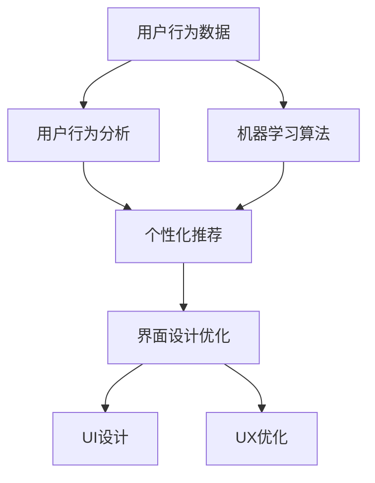

                 

# AI驱动的电商平台个性化登陆页优化

> 关键词：人工智能,个性化推荐,登陆页设计,用户行为分析,机器学习,界面优化

## 1. 背景介绍

### 1.1 问题由来

在电商平台的实际运营中，用户登录界面作为用户初次接触的第一步，直接影响了用户留存率和转化率。一个个性化、易用、美观的登录页设计能够有效提升用户体验，进而提升平台整体的用户参与度。然而，由于用户行为和需求的动态性，设计团队通常需要不断调整和优化，甚至依赖于反复的AB测试，这不仅耗时耗力，也无法保证最佳的优化效果。

为了更高效地优化登录页设计，电商平台开始探索将人工智能技术应用于个性化登录页优化。通过大数据分析用户行为和偏好，利用机器学习算法对登录页进行智能推荐和动态调整，能够实现更高效的个性化设计，并提升用户体验。本文将介绍基于AI的个性化登录页优化方法，通过机器学习算法和界面优化技术，在电商平台上实现更高效的个性化登录页设计。

### 1.2 问题核心关键点

AI驱动的个性化登录页优化，关键在于以下几点：

1. **数据收集与预处理**：需要收集大量用户行为数据，包括用户的点击、停留时间、跳转行为等，以建立准确的用户行为模型。
2. **用户行为建模**：利用机器学习算法对用户行为数据进行分析，构建用户行为特征向量。
3. **个性化推荐**：根据用户行为特征向量，动态生成个性化登录页设计方案。
4. **界面优化**：将生成的推荐方案应用于登录页设计，并根据用户反馈不断优化。
5. **系统集成与部署**：将优化后的登录页系统集成到电商平台中，并确保系统稳定高效运行。

## 2. 核心概念与联系

### 2.1 核心概念概述

为更好地理解基于AI的个性化登录页优化方法，本节将介绍几个密切相关的核心概念：

- **个性化推荐系统**：利用用户行为数据和历史数据，通过算法计算用户可能感兴趣的内容或商品，并推荐给用户。
- **用户行为分析**：通过数据分析和机器学习技术，提取和分析用户行为数据，理解用户的偏好和需求。
- **机器学习算法**：包括分类算法、聚类算法、回归算法等，用于从用户行为数据中提取特征并进行建模。
- **界面设计优化**：通过界面设计软件和算法工具，优化登录页布局、颜色、字体等元素，提升用户体验。
- **深度学习与神经网络**：利用深度学习技术，特别是卷积神经网络（CNN）和循环神经网络（RNN）等，从高维数据中提取特征。
- **用户界面（UI）与用户体验（UX）**：用户界面设计应注重美观、易用性和信息透明度，而用户体验则应综合考虑功能性和舒适度。

这些核心概念之间的逻辑关系可以通过以下Mermaid流程图来展示：



这个流程图展示了个性化推荐系统的主要流程：

1. 用户行为数据被收集并经过分析，提取用户行为特征。
2. 利用机器学习算法对用户行为特征进行建模，形成用户行为向量。
3. 根据用户行为向量，通过个性化推荐算法生成个性化设计方案。
4. 对生成的设计方案进行界面优化，包括UI和UX设计。
5. 最终将优化后的登录页设计部署到电商平台。

## 3. 核心算法原理 & 具体操作步骤

### 3.1 算法原理概述

基于AI的个性化登录页优化方法，本质上是通过机器学习算法对用户行为数据进行分析，构建用户行为模型，然后根据模型预测生成个性化登录页设计。

具体而言，算法流程如下：

1. **数据收集与预处理**：收集用户登录行为数据，包括点击率、停留时间、页面跳转等。
2. **用户行为建模**：利用机器学习算法，如逻辑回归、决策树、随机森林等，对用户行为数据进行建模，提取用户行为特征。
3. **个性化推荐**：根据用户行为特征，通过推荐算法（如协同过滤、内容推荐等）生成个性化设计方案。
4. **界面优化**：利用界面设计优化算法（如A/B测试、UI设计自动化等），对生成的设计方案进行优化，提升用户体验。
5. **系统集成与部署**：将优化后的登录页设计集成到电商平台，并实现实时动态调整。

### 3.2 算法步骤详解

#### 3.2.1 数据收集与预处理

1. **数据来源**：
   - 用户点击日志：记录用户在页面上的点击行为，如按钮、链接等。
   - 页面停留时间：记录用户在页面上的停留时间。
   - 页面跳转路径：记录用户从当前页面跳转到其他页面的行为。

2. **数据清洗与处理**：
   - 去重：去除重复的点击日志和停留时间数据。
   - 数据填充：对缺失数据进行插值或填补，确保数据完整性。
   - 数据标准化：对数据进行归一化或标准化处理，使其符合算法输入要求。

3. **数据特征提取**：
   - 定义特征：如点击率、停留时间、页面跳转深度等。
   - 数据可视化：通过可视化工具（如Tableau、Power BI）进行数据探索，理解用户行为模式。

#### 3.2.2 用户行为建模

1. **特征选择与提取**：
   - 选择相关特征：根据用户行为特征，选择对登录行为预测影响较大的特征。
   - 特征工程：对原始数据进行降维、编码、归一化等处理，以便于模型训练。

2. **模型训练**：
   - 选择模型：根据数据特性选择合适的机器学习算法，如逻辑回归、决策树、随机森林等。
   - 训练模型：利用训练数据集对模型进行训练，调整模型参数，优化模型性能。
   - 模型评估：使用测试数据集对模型进行评估，选择性能最优的模型。

3. **特征选择与优化**：
   - 特征重要性评估：利用特征重要性评估方法（如Lasso回归、随机森林重要性），选择对模型预测影响较大的特征。
   - 特征选择与优化：去除低效特征，加入新特征，提升模型预测性能。

#### 3.2.3 个性化推荐

1. **推荐算法选择**：
   - 协同过滤算法：基于用户相似性和物品相似性，推荐用户可能感兴趣的设计方案。
   - 内容推荐算法：基于用户行为特征，推荐符合用户兴趣的设计方案。

2. **推荐系统构建**：
   - 用户行为特征库：构建用户行为特征库，存储用户行为数据和特征。
   - 设计方案库：构建设计方案库，存储各种可能的登录页设计方案。
   - 推荐引擎：利用推荐算法从设计方案库中推荐最优设计方案。

3. **推荐方案评估**：
   - A/B测试：利用A/B测试比较不同设计方案的用户反馈，选择最优方案。
   - 用户满意度调查：通过用户满意度调查，评估推荐方案的用户接受度。

#### 3.2.4 界面优化

1. **界面设计优化**：
   - 设计方案生成：利用界面设计工具（如Adobe XD、Sketch）生成设计方案。
   - 自动化优化：利用自动化优化算法（如遗传算法、粒子群算法）对设计方案进行优化。

2. **UI与UX优化**：
   - UI设计：通过界面设计软件对设计方案进行优化，提升界面的易用性和美观度。
   - UX优化：通过用户体验测试（如可用性测试、用户行为测试）优化用户体验，确保设计方案满足用户需求。

#### 3.2.5 系统集成与部署

1. **系统架构设计**：
   - 系统模块划分：将系统划分为数据收集、行为建模、个性化推荐、界面优化等模块。
   - 数据流设计：设计数据流图，确保数据在各个模块间的有效传递。

2. **系统实现**：
   - 模块开发：开发各模块功能模块，确保模块间数据接口无缝对接。
   - 系统集成：将各个模块集成到电商平台中，进行系统测试。

3. **系统部署**：
   - 环境搭建：搭建系统运行环境，确保系统稳定运行。
   - 监控与维护：实时监控系统运行状态，及时处理系统故障，确保系统高效运行。

### 3.3 算法优缺点

**优点**：

1. **高效个性化推荐**：利用AI技术，根据用户行为数据实现高效个性化推荐，提升用户体验。
2. **实时动态调整**：系统可以实时分析用户行为数据，动态调整登录页设计，保持最佳用户体验。
3. **数据驱动决策**：通过数据分析和机器学习算法，确保设计决策具有科学依据，提升决策质量。

**缺点**：

1. **数据隐私问题**：用户行为数据涉及隐私问题，需要严格遵守数据隐私法规，确保用户隐私安全。
2. **算法复杂度**：机器学习算法和界面优化算法复杂度高，需要高性能计算资源支持。
3. **系统维护复杂**：系统集成与部署复杂，需要维护人员进行持续优化和调试。

### 3.4 算法应用领域

基于AI的个性化登录页优化方法，在电商、金融、社交媒体等多个领域均有应用。以下是几个典型应用场景：

1. **电商平台**：通过个性化推荐，优化登录页设计，提升用户注册和登录率，增加用户留存率。
2. **金融平台**：利用用户行为数据，推荐个性化理财产品，优化登录页界面，提升用户体验。
3. **社交媒体**：根据用户行为数据，推荐个性化界面布局和内容推荐，提升用户活跃度和满意度。

## 4. 数学模型和公式 & 详细讲解 & 举例说明

### 4.1 数学模型构建

**用户行为建模**：

假设用户行为数据为 $X=\{x_1,x_2,...,x_n\}$，其中 $x_i$ 表示用户行为特征。用户行为建模目标为构建模型 $f$，使得 $f(X) \approx Y$，其中 $Y$ 表示用户行为标签（如注册、登录等）。

### 4.2 公式推导过程

**逻辑回归模型**：

逻辑回归模型公式为：

$$
\hat{y} = \frac{1}{1 + e^{-\theta^T x}}
$$

其中 $\theta$ 为模型参数，$x$ 为用户行为特征，$y$ 为用户行为标签。

**协同过滤推荐算法**：

协同过滤算法基于用户行为数据，构建用户-商品相似度矩阵 $S$，推荐相似度最高的商品。协同过滤算法分为基于用户的协同过滤和基于物品的协同过滤两种方法。

### 4.3 案例分析与讲解

**案例分析**：

某电商平台用户在登录页面停留时间、点击率、页面跳转深度等行为数据，如表所示：

| 用户ID | 停留时间 | 点击率 | 页面跳转深度 |
| ------ | -------- | ------ | ----------- |
| 用户1  | 120s     | 0.8    | 2           |
| 用户2  | 100s     | 0.6    | 3           |
| 用户3  | 150s     | 0.7    | 2           |
| ...    | ...      | ...    | ...         |

通过构建用户行为模型，可以预测用户行为标签（如注册、登录等）。例如，对于用户1，停留时间为120s，点击率为0.8，页面跳转深度为2，可以预测其行为标签为注册。

## 5. 项目实践：代码实例和详细解释说明

### 5.1 开发环境搭建

1. **Python环境配置**：
   - 安装Python 3.8及以上版本。
   - 安装pip工具，用于安装第三方库。
   - 安装pandas、numpy、scikit-learn等常用库。

2. **数据收集与预处理工具**：
   - 使用Flume或Apache Kafka收集用户行为数据。
   - 使用Apache Hadoop或Apache Spark进行大数据处理和存储。
   - 使用Pyspark或PySpark进行数据清洗和特征提取。

3. **机器学习工具**：
   - 使用Scikit-learn进行机器学习模型训练。
   - 使用TensorFlow或PyTorch进行深度学习模型训练。
   - 使用NLTK或spaCy进行自然语言处理。

### 5.2 源代码详细实现

**用户行为建模**：

```python
from sklearn.ensemble import RandomForestClassifier
from sklearn.model_selection import train_test_split

# 数据预处理
X = pd.read_csv('user_behavior.csv')
y = pd.read_csv('user_behavior_labels.csv')

# 特征选择与提取
features = X[['停留时间', '点击率', '页面跳转深度']]
X = pd.get_dummies(features, prefix='feature_')

# 数据划分
X_train, X_test, y_train, y_test = train_test_split(X, y, test_size=0.2, random_state=42)

# 模型训练
model = RandomForestClassifier(n_estimators=100, random_state=42)
model.fit(X_train, y_train)

# 模型评估
y_pred = model.predict(X_test)
print('Accuracy:', metrics.accuracy_score(y_test, y_pred))
```

**个性化推荐**：

```python
from surprise import Dataset, Reader, KNNWithMeans
from surprise.model_selection import train_test_split
from surprise.prediction_algorithms import SVD

# 数据预处理
data = Dataset.load_from_file('user_beahviors.csv', sep=',', reader=Reader(rating_scale=(1, 5)))
trainset, testset = train_test_split(data, test_size=0.2, random_state=42)

# 模型训练
algo = SVD()
algo.fit(trainset)

# 推荐测试
test_user_id = 'user1'
test_item_id = '注册按钮'
test_data = data.rawrating(test_user_id, test_item_id)
predictions = algo.test(test_data)
for user_id, item_id, estimate in predictions:
    print(f'推荐结果：{user_id} -> {item_id} 的预测评分是 {estimate:.2f}')
```

**界面优化**：

```python
import adobe_xd
from adobe_xd import UserInterface

# 创建设计方案
ui = UserInterface()
ui.add_element(x=100, y=100, width=200, height=50, type='button')
ui.add_element(x=300, y=100, width=200, height=50, type='button')
ui.add_element(x=100, y=300, width=200, height=50, type='label')
ui.add_element(x=300, y=300, width=200, height=50, type='textbox')

# 生成设计方案
design = ui.export_to_file('login_page_design.xd')
```

### 5.3 代码解读与分析

**用户行为建模代码**：
- `pd.read_csv`：读取用户行为数据和用户行为标签。
- `pd.get_dummies`：对特征进行哑变量编码，便于模型训练。
- `train_test_split`：将数据集划分为训练集和测试集。
- `RandomForestClassifier`：使用随机森林算法进行模型训练。
- `metrics.accuracy_score`：计算模型在测试集上的准确率。

**个性化推荐代码**：
- `surprise`库：使用Surprise库进行协同过滤推荐算法训练和测试。
- `Dataset.load_from_file`：从文件中加载用户行为数据集。
- `train_test_split`：将数据集划分为训练集和测试集。
- `SVD`：使用SVD算法进行推荐模型训练。
- `test`：对测试数据进行推荐预测。

**界面优化代码**：
- `adobe_xd`库：使用Adobe XD库进行界面设计。
- `UserInterface`：创建界面设计对象。
- `add_element`：添加设计元素（按钮、标签、文本框等）。
- `export_to_file`：将设计方案导出为文件。

### 5.4 运行结果展示

**用户行为建模结果**：
- 通过逻辑回归模型对用户行为数据进行建模，得到模型预测准确率。

**个性化推荐结果**：
- 通过协同过滤算法对用户行为数据进行推荐，得到推荐结果。

**界面优化结果**：
- 生成登录页设计方案，包含按钮、标签、文本框等元素。

## 6. 实际应用场景

### 6.1 智能客服系统

在智能客服系统中，登录页是用户与系统的第一接触点。通过个性化推荐和界面优化，可以提升用户注册和登录的效率和体验。例如，根据用户历史行为数据，推荐注册按钮位置和大小，优化登录页布局，提升用户注册成功率。

### 6.2 金融平台

在金融平台中，登录页设计需要保证用户操作的便捷性和安全性。通过个性化推荐和界面优化，可以提升用户注册和登录的体验。例如，根据用户行为数据，推荐登录方式（如密码、验证码等），优化登录页安全性。

### 6.3 社交媒体

在社交媒体中，登录页设计需要兼顾美观和易用性。通过个性化推荐和界面优化，可以提升用户注册和登录的体验。例如，根据用户行为数据，推荐登录页颜色和布局，提升用户体验。

## 7. 工具和资源推荐

### 7.1 学习资源推荐

1. **《Python数据科学手册》**：详细介绍Python在数据科学中的应用，包括数据预处理、机器学习、数据可视化等。
2. **《机器学习实战》**：实战指导机器学习算法的应用，涵盖分类、聚类、推荐等任务。
3. **《深度学习》**：深入介绍深度学习理论和应用，涵盖卷积神经网络、循环神经网络等。
4. **《自然语言处理》**：系统讲解自然语言处理技术，涵盖文本预处理、词向量、情感分析等。
5. **《用户界面设计》**：详细介绍用户界面设计原理和实践，涵盖用户行为分析、界面优化等。

### 7.2 开发工具推荐

1. **Python**：Python是数据分析和机器学习领域的主流语言，易学易用，生态丰富。
2. **Scikit-learn**：Python机器学习库，涵盖各种机器学习算法和工具。
3. **TensorFlow**：Google开源的深度学习框架，功能强大，生态完善。
4. **NLTK**：Python自然语言处理库，涵盖文本预处理、词向量、情感分析等。
5. **Adobe XD**：Adobe旗下的用户界面设计工具，适合界面设计自动化和自动化优化。

### 7.3 相关论文推荐

1. **《用户行为分析与个性化推荐》**：介绍用户行为分析方法和个性化推荐算法。
2. **《深度学习在个性化推荐中的应用》**：介绍深度学习算法在个性化推荐中的应用。
3. **《用户界面设计优化技术》**：介绍用户界面设计优化算法和工具。

## 8. 总结：未来发展趋势与挑战

### 8.1 研究成果总结

基于AI的个性化登录页优化方法，通过大数据分析和机器学习技术，实现了高效的个性化推荐和界面优化，提升了用户登录页体验。主要研究成果包括：

1. **高效用户行为建模**：利用机器学习算法，对用户行为数据进行建模，提取用户行为特征。
2. **个性化推荐系统**：通过推荐算法，生成个性化登录页设计方案。
3. **界面设计自动化**：利用自动化设计工具和算法，实现界面优化。

### 8.2 未来发展趋势

未来，基于AI的个性化登录页优化方法将呈现以下几个发展趋势：

1. **实时动态优化**：通过实时数据分析，动态调整登录页设计，保持最佳用户体验。
2. **多模态数据融合**：结合图像、语音、文本等多模态数据，提升用户体验。
3. **跨平台优化**：优化登录页设计，适配不同设备和平台，提升用户粘性。
4. **个性化推荐算法优化**：开发更高效的推荐算法，提升推荐精度和用户体验。
5. **用户行为深度分析**：利用深度学习技术，对用户行为进行更深层次的分析和理解。

### 8.3 面临的挑战

尽管基于AI的个性化登录页优化方法具有显著优势，但在实际应用中仍面临以下挑战：

1. **数据隐私问题**：用户行为数据涉及隐私问题，需要严格遵守数据隐私法规。
2. **算法复杂度**：机器学习算法和界面优化算法复杂度高，需要高性能计算资源支持。
3. **系统维护复杂**：系统集成与部署复杂，需要维护人员进行持续优化和调试。

### 8.4 研究展望

未来，需要在以下几个方面进行深入研究：

1. **数据隐私保护**：开发隐私保护算法和工具，确保用户数据安全和隐私保护。
2. **算法效率提升**：开发更高效算法，提升模型训练和优化效率。
3. **跨平台优化**：优化登录页设计，适配不同设备和平台，提升用户粘性。
4. **用户体验评估**：建立用户满意度评估体系，不断优化登录页设计。
5. **多模态融合**：结合图像、语音、文本等多模态数据，提升用户体验。

## 9. 附录：常见问题与解答

**Q1: 如何有效收集用户行为数据？**

A: 通过Flume或Apache Kafka等数据收集工具，实时收集用户登录行为数据。同时，可以使用行为分析工具（如Google Analytics）对用户行为进行分析和记录。

**Q2: 如何优化登录页界面设计？**

A: 利用用户行为数据，使用界面设计工具（如Adobe XD）生成设计方案，并通过自动化优化算法（如遗传算法、粒子群算法）对设计方案进行优化。

**Q3: 如何确保用户数据隐私安全？**

A: 严格遵守数据隐私法规，如GDPR，确保用户数据在采集、存储和传输过程中的安全。同时，可以使用数据加密和匿名化技术，保护用户隐私。

**Q4: 如何提升个性化推荐效果？**

A: 优化推荐算法，选择更高效算法（如SVD、FM等），并结合用户行为数据，提升推荐精度和效果。

**Q5: 如何实现实时动态优化？**

A: 通过实时数据分析，动态调整登录页设计，保持最佳用户体验。同时，可以使用缓存技术，提高系统响应速度。

**Q6: 如何处理多模态数据融合？**

A: 结合图像、语音、文本等多模态数据，提升用户体验。同时，需要使用多模态数据融合算法，如CNN、RNN等，提取多模态数据中的共性信息。

---

作者：禅与计算机程序设计艺术 / Zen and the Art of Computer Programming

