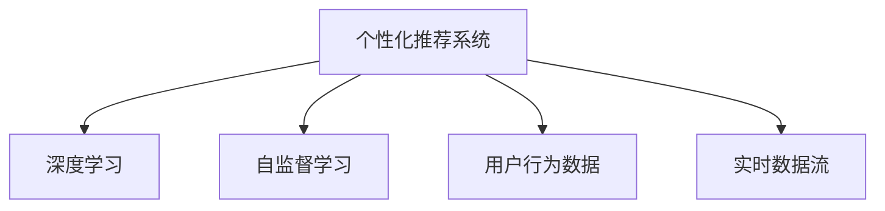

                 

# AI驱动的电商平台个性化首页设计

## 1. 背景介绍

随着电子商务的迅猛发展，电商平台面临愈发激烈的竞争。如何吸引和留住用户，提升用户满意度，实现商业价值最大化，成为了平台运营的核心任务。个性化首页设计作为电商平台的"门面"，直接影响用户的第一印象和后续行为。传统的静态首页设计无法满足用户的个性化需求，也无法动态响应市场的快速变化。因此，利用AI技术实现首页的个性化推荐和内容适配，是提升用户体验和电商转化率的有效手段。

### 1.1 问题由来

电商平台的首页设计，历来是一个耗时耗力且回报有限的环节。传统的做法是由人工策划设计，根据经验和使用数据进行静态页面布局。这种方式的局限性在于：

- **时效性不足**：无法动态响应市场和用户行为的变化，导致首页展示内容与用户兴趣脱节。
- **定制化能力有限**：难以满足不同用户的个性化需求，通用首页难以覆盖全员，导致部分用户流失。
- **内容生产成本高**：设计、制作、上线周期长，内容更新频率低，难以保持首页的新鲜感和吸引力。

随着AI技术的不断成熟，利用机器学习和大数据分析技术，可以从海量的用户数据中提取用户行为模式和兴趣偏好，实时动态生成个性化的首页内容推荐，极大地提升了首页设计的精准性和效率。

### 1.2 问题核心关键点

AI驱动的个性化首页设计，其核心关键点在于：

- **个性化推荐**：利用用户行为数据，精准识别用户的兴趣偏好，推荐相关商品或内容。
- **实时动态适配**：根据用户行为和市场变化，实时调整首页内容，保持动态变化和新鲜感。
- **用户体验优化**：通过个性化和动态展示，提升用户点击率、停留时间和转化率。
- **系统架构设计**：设计高效的系统架构，支撑大规模数据处理和模型预测，保障推荐性能和系统稳定性。

## 2. 核心概念与联系

### 2.1 核心概念概述

为更好地理解AI驱动的个性化首页设计，本节将介绍几个密切相关的核心概念：

- **个性化推荐系统(Recommendation System)**：通过分析用户行为和兴趣，推荐可能满足用户需求的商品或内容。
- **深度学习(Deep Learning)**：一类基于神经网络的机器学习方法，通过多层次的特征提取和表征学习，解决复杂的非线性问题。
- **自监督学习(Self-Supervised Learning)**：利用数据中蕴含的无监督信号，自动学习模型的初始表示，减少对标注数据的依赖。
- **用户行为数据(User Behavior Data)**：用户在线上的浏览、购买、评价等行为数据，是推荐系统的重要数据源。
- **实时数据流(Real-Time Data Stream)**：推荐系统需要在用户交互时实时响应用户行为，动态生成推荐内容。

这些核心概念之间的逻辑关系可以通过以下Mermaid流程图来展示：



这个流程图展示了个性化推荐系统的核心概念及其之间的关系：

1. 个性化推荐系统通过深度学习和自监督学习，自动学习用户行为数据的表征，从而实现精准推荐。
2. 用户行为数据是推荐系统的数据源，深度学习模型利用其中的信号，学习用户兴趣。
3. 实时数据流是推荐系统实现动态响应的关键，确保首页展示内容与用户即时行为相匹配。

这些概念共同构成了个性化推荐的核心框架，使得推荐系统能够在用户行为变化时及时响应，提供个性化的首页展示内容。

## 3. 核心算法原理 & 具体操作步骤
### 3.1 算法原理概述

AI驱动的个性化首页设计，其核心算法为基于深度学习的推荐系统。该系统基于用户历史行为数据，通过深度学习模型预测用户对不同商品的兴趣程度，然后根据预测结果推荐商品，实现首页的个性化展示。

形式化地，设用户 $u$ 对商品 $i$ 的兴趣度为 $r_{ui}$，则推荐系统的目标是最小化预测误差：

$$
\min_{\theta} \sum_{i=1}^{N} (r_{ui} - \hat{r}_{ui})^2
$$

其中，$\theta$ 为模型参数，$\hat{r}_{ui}$ 为模型预测的用户对商品 $i$ 的兴趣度。

### 3.2 算法步骤详解

基于深度学习的推荐系统主要包括以下几个关键步骤：

**Step 1: 数据准备**
- 收集用户的历史行为数据，包括浏览记录、购买记录、评价记录等。
- 将数据进行清洗、去重、归一化等预处理，生成可用于模型训练的数据集。

**Step 2: 模型选择与训练**
- 选择合适的深度学习模型作为推荐引擎，如协同过滤模型、深度神经网络、注意力机制等。
- 利用预处理后的数据集，在选定的深度学习框架上（如TensorFlow、PyTorch等）训练模型，最小化预测误差。

**Step 3: 特征提取**
- 对用户历史行为数据进行特征提取，生成可用于模型训练的特征向量。
- 设计合适的特征维度、编码方式、归一化方法，以提高模型训练效果。

**Step 4: 实时预测与推荐**
- 在用户实时行为数据到来时，通过模型实时预测用户对不同商品的兴趣度。
- 根据预测结果，动态调整首页展示内容，推荐用户可能感兴趣的商品或内容。

**Step 5: 效果评估与优化**
- 利用预设的评估指标（如点击率、转化率等），评估推荐系统的性能。
- 根据评估结果，调整模型参数、特征提取方式、数据处理流程等，不断优化推荐系统。

### 3.3 算法优缺点

基于深度学习的推荐系统具有以下优点：

1. 精度高。深度学习模型能够自动学习数据中的复杂模式，准确预测用户兴趣。
2. 适用性强。该系统能够处理多类型数据，涵盖商品信息、用户行为、市场变化等多种数据源。
3. 实时动态。基于实时数据流，推荐系统能够即时响应用户行为，动态调整首页内容。
4. 用户定制化。通过用户历史行为数据，推荐系统可以做到个性化推荐，提升用户体验。

同时，该系统也存在一定的局限性：

1. 数据需求大。推荐系统需要大量高质量的用户行为数据，获取数据的成本和难度较大。
2. 模型复杂度高。深度学习模型参数量大，训练和推理复杂度较高。
3. 过拟合风险高。模型对标注数据依赖较大，容易过拟合，泛化性能不足。
4. 计算资源需求大。模型训练和实时推理需要高性能计算资源，对硬件配置要求较高。

尽管存在这些局限性，但就目前而言，基于深度学习的推荐系统仍然是实现个性化首页设计的主流方法。未来相关研究的重点在于如何进一步降低对数据的需求，提高模型的泛化能力，同时优化计算资源使用，降低部署成本。

### 3.4 算法应用领域

基于深度学习的推荐系统，已经在电商、社交媒体、视频流媒体等众多领域得到了广泛应用，显著提升了用户体验和系统性能。

- **电商**：通过推荐系统个性化推荐商品，提升用户购买转化率。
- **社交媒体**：根据用户行为数据，推荐相关内容和话题，增强用户粘性。
- **视频流媒体**：根据用户观看记录和评分，推荐相关视频内容，提升用户观看时长和满意度。
- **新闻推荐**：根据用户阅读记录，推荐相关新闻文章，提高用户阅读量和点击率。

这些领域的应用实践证明，基于深度学习的推荐系统能够显著提升用户体验和系统性能，为智能化应用提供了坚实基础。

## 4. 数学模型和公式 & 详细讲解 & 举例说明
### 4.1 数学模型构建

本节将使用数学语言对基于深度学习的推荐系统进行更加严格的刻画。

设用户 $u$ 对商品 $i$ 的兴趣度为 $r_{ui}$，通过深度学习模型预测用户对商品 $i$ 的兴趣度 $\hat{r}_{ui}$。目标是最小化预测误差：

$$
\min_{\theta} \sum_{i=1}^{N} (r_{ui} - \hat{r}_{ui})^2
$$

其中 $\theta$ 为模型参数，$N$ 为商品总数。

推荐系统的训练数据为 $(u, i, r_{ui})$，其中 $u$ 为用户ID，$i$ 为商品ID，$r_{ui}$ 为真实兴趣度。模型的损失函数为：

$$
L(\theta) = \frac{1}{M}\sum_{i=1}^{M} (r_{ui} - \hat{r}_{ui})^2
$$

其中 $M$ 为训练样本数，$\hat{r}_{ui}$ 为模型预测的兴趣度。

### 4.2 公式推导过程

以下我们以协同过滤模型为例，推导推荐系统的损失函数及其梯度的计算公式。

设协同过滤模型为 $\hat{r}_{ui} = \alpha w_u^T w_i + b_u + b_i$，其中 $\alpha$ 为缩放因子，$w_u, w_i$ 为用户和商品的特征向量，$b_u, b_i$ 为偏置项。则损失函数为：

$$
L(\theta) = \frac{1}{M}\sum_{i=1}^{M} (r_{ui} - (\alpha w_u^T w_i + b_u + b_i))^2
$$

对上式进行梯度求导，得到：

$$
\frac{\partial L(\theta)}{\partial \alpha} = \frac{1}{M}\sum_{i=1}^{M} -2(\alpha w_u^T w_i + b_u + b_i - r_{ui})w_i^T w_u
$$

$$
\frac{\partial L(\theta)}{\partial w_u} = \frac{1}{M}\sum_{i=1}^{M} -2(\alpha w_u^T w_i + b_u + b_i - r_{ui})w_i
$$

$$
\frac{\partial L(\theta)}{\partial b_u} = \frac{1}{M}\sum_{i=1}^{M} -2(\alpha w_u^T w_i + b_u + b_i - r_{ui})
$$

$$
\frac{\partial L(\theta)}{\partial w_i} = \frac{1}{M}\sum_{i=1}^{M} -2(\alpha w_u^T w_i + b_u + b_i - r_{ui})w_u^T
$$

$$
\frac{\partial L(\theta)}{\partial b_i} = \frac{1}{M}\sum_{i=1}^{M} -2(\alpha w_u^T w_i + b_u + b_i - r_{ui})
$$

将这些梯度公式代入参数更新公式：

$$
\theta \leftarrow \theta - \eta \nabla_{\theta}L(\theta)
$$

其中 $\eta$ 为学习率，$\nabla_{\theta}L(\theta)$ 为损失函数对模型参数的梯度。

通过反向传播算法，计算并更新模型参数，不断迭代优化，最终得到最优的推荐模型参数 $\theta^*$。

### 4.3 案例分析与讲解

以电商平台的个性化首页推荐为例，进行案例分析：

假设电商平台的推荐系统基于深度神经网络构建。通过分析用户的历史行为数据，模型预测用户对不同商品的兴趣度，并根据预测结果推荐商品，实现首页的个性化展示。

**步骤1: 数据准备**
- 收集用户的历史浏览、购买、评价数据。
- 对数据进行清洗、去重、归一化等预处理，生成可用于模型训练的数据集。

**步骤2: 模型选择与训练**
- 选择深度神经网络作为推荐引擎，利用数据集训练模型。
- 设计合适的网络结构，如卷积神经网络、循环神经网络等。
- 设定适当的损失函数和优化器，如均方误差损失、Adam优化器等。

**步骤3: 特征提取**
- 对用户历史行为数据进行特征提取，生成可用于模型训练的特征向量。
- 设计合适的特征维度、编码方式、归一化方法，如TF-IDF、词嵌入等。
- 将用户ID、商品ID等转化为模型可处理的数值形式。

**步骤4: 实时预测与推荐**
- 在用户实时行为数据到来时，通过模型实时预测用户对不同商品的兴趣度。
- 根据预测结果，动态调整首页展示内容，推荐用户可能感兴趣的商品或内容。
- 利用API接口，将推荐结果呈现在用户首页。

**步骤5: 效果评估与优化**
- 利用预设的评估指标（如点击率、转化率等），评估推荐系统的性能。
- 根据评估结果，调整模型参数、特征提取方式、数据处理流程等，不断优化推荐系统。
- 定期收集用户反馈，进一步优化推荐算法和展示策略。

通过以上步骤，电商平台的个性化首页推荐系统得以实现，提升用户体验和销售转化率。

## 5. 项目实践：代码实例和详细解释说明
### 5.1 开发环境搭建

在进行推荐系统实践前，我们需要准备好开发环境。以下是使用Python进行TensorFlow开发的环境配置流程：

1. 安装Anaconda：从官网下载并安装Anaconda，用于创建独立的Python环境。

2. 创建并激活虚拟环境：
```bash
conda create -n tf-env python=3.8 
conda activate tf-env
```

3. 安装TensorFlow：根据CUDA版本，从官网获取对应的安装命令。例如：
```bash
pip install tensorflow==2.5
```

4. 安装各类工具包：
```bash
pip install numpy pandas scikit-learn matplotlib tqdm jupyter notebook ipython
```

完成上述步骤后，即可在`tf-env`环境中开始推荐系统开发。

### 5.2 源代码详细实现

下面我们以电商平台的个性化推荐系统为例，给出使用TensorFlow实现推荐模型的PyTorch代码实现。

首先，定义推荐模型的网络结构：

```python
import tensorflow as tf
from tensorflow.keras import layers

class Recommender(tf.keras.Model):
    def __init__(self, num_users, num_items, embedding_dim=32):
        super(Recommender, self).__init__()
        self.user_emb = layers.Embedding(num_users, embedding_dim)
        self.item_emb = layers.Embedding(num_items, embedding_dim)
        self.interaction = layers.Dense(1)
        
    def call(self, user_id, item_id):
        user_vec = self.user_emb(user_id)
        item_vec = self.item_emb(item_id)
        interaction = tf.expand_dims(tf.reduce_sum(tf.multiply(user_vec, item_vec), axis=1), axis=-1)
        return self.interaction(interaction)
```

然后，定义推荐系统的训练函数：

```python
import numpy as np
from sklearn.model_selection import train_test_split

def train_recommender(model, train_data, valid_data, batch_size, epochs, learning_rate):
    train_dataset = tf.data.Dataset.from_tensor_slices(train_data)
    valid_dataset = tf.data.Dataset.from_tensor_slices(valid_data)
    
    train_dataset = train_dataset.shuffle(buffer_size=10000).batch(batch_size)
    valid_dataset = valid_dataset.batch(batch_size)
    
    optimizer = tf.keras.optimizers.Adam(learning_rate)
    loss_fn = tf.keras.losses.MeanSquaredError()
    
    for epoch in range(epochs):
        model.trainable = True
        model.train(train_dataset)
        
        train_loss = model.loss(train_dataset)
        valid_loss = model.loss(valid_dataset)
        
        model.trainable = False
        model.evaluate(valid_dataset)
        
        optimizer.apply_gradients(zip(train_dataset, train_loss))
        
    return model
```

接着，定义数据预处理函数：

```python
def preprocess_data(train_data, test_data, user_id_column, item_id_column, rating_column):
    train_users, train_items, train_ratings = train_data[user_id_column], train_data[item_id_column], train_data[rating_column]
    test_users, test_items, test_ratings = test_data[user_id_column], test_data[item_id_column], test_data[rating_column]
    
    train_users, train_items, train_ratings = np.unique(train_users), np.unique(train_items), np.unique(train_ratings)
    test_users, test_items, test_ratings = np.unique(test_users), np.unique(test_items), np.unique(test_ratings)
    
    num_users = len(train_users)
    num_items = len(train_items)
    
    train_dataset = []
    for i in range(len(train_ratings)):
        user_id, item_id, rating = train_users[train_ratings[i][0]], train_items[train_ratings[i][1]], train_ratings[i][2]
        train_dataset.append([user_id, item_id, rating])
        
    test_dataset = []
    for i in range(len(test_ratings)):
        user_id, item_id, rating = test_users[test_ratings[i][0]], test_items[test_ratings[i][1]], test_ratings[i][2]
        test_dataset.append([user_id, item_id, rating])
        
    return train_dataset, test_dataset, num_users, num_items
```

最后，启动训练流程并在测试集上评估：

```python
import pandas as pd

# 读取数据
train_data = pd.read_csv('train.csv')
test_data = pd.read_csv('test.csv')

# 数据预处理
train_dataset, test_dataset, num_users, num_items = preprocess_data(train_data, test_data, 'user_id', 'item_id', 'rating')

# 定义模型
model = Recommender(num_users, num_items)

# 训练模型
train_recommender(model, train_dataset, test_dataset, batch_size=32, epochs=10, learning_rate=0.01)

# 测试模型
test_dataset = tf.data.Dataset.from_tensor_slices(test_dataset)
test_dataset = test_dataset.batch(32)

for batch in test_dataset:
    user_id, item_id = batch[0], batch[1]
    rating = model.predict(user_id, item_id)
    print(f'User {user_id}, Item {item_id}, Prediction: {rating}')
```

以上就是使用TensorFlow对电商平台的个性化推荐系统进行微调的完整代码实现。可以看到，TensorFlow提供的Keras API使得模型构建和训练过程简洁高效，适合快速迭代研究。

### 5.3 代码解读与分析

让我们再详细解读一下关键代码的实现细节：

**Recommender类**：
- `__init__`方法：初始化用户和商品的嵌入层，以及交互层。
- `call`方法：定义模型的前向传播过程，通过用户和商品的嵌入层计算交互结果，输入到交互层进行最终预测。

**train_recommender函数**：
- 定义训练数据集和验证数据集，并进行批次化处理。
- 使用Adam优化器和均方误差损失函数训练模型，并在每个epoch结束时评估模型在验证集上的性能。
- 使用训练集对模型进行参数更新，并在模型不可训练时进行评估。

**preprocess_data函数**：
- 对数据集进行去重、归一化等预处理，生成可用于模型训练的数据集。
- 使用pandas读取CSV格式的数据，提取出用户ID、商品ID和评分等关键信息。
- 通过numpy进行数据编码和去重，得到唯一的用户ID和商品ID，并计算出用户和商品总数。
- 将数据集转化为numpy数组，返回训练集和测试集的数据以及用户和商品总数。

通过以上步骤，推荐系统得以实现，并在测试集上进行性能评估。代码中的预处理和模型构建过程可灵活扩展，支持更多的特征和更复杂的模型结构。

## 6. 实际应用场景
### 6.1 智能推荐系统

基于深度学习的推荐系统已经在电商、社交媒体、视频流媒体等多个领域得到了广泛应用，提升了用户体验和系统性能。

- **电商**：通过推荐系统个性化推荐商品，提升用户购买转化率。
- **社交媒体**：根据用户行为数据，推荐相关内容和话题，增强用户粘性。
- **视频流媒体**：根据用户观看记录和评分，推荐相关视频内容，提升用户观看时长和满意度。
- **新闻推荐**：根据用户阅读记录，推荐相关新闻文章，提高用户阅读量和点击率。

除了以上领域，推荐系统还被创新性地应用于更多场景中，如音乐播放、餐厅推荐、电影选座等，为消费者提供更加个性化和精准的服务。

### 6.2 移动应用推荐

推荐系统在移动应用中的典型应用包括音乐播放、新闻阅读、旅游规划等。通过分析用户的浏览和互动记录，推荐系统能够动态调整应用界面，展示最相关的推荐内容，提升用户粘性和满意度。

例如，音乐播放应用可以通过用户听歌记录和评分，推荐用户可能感兴趣的歌曲和专辑。新闻阅读应用则可以根据用户阅读历史，推荐相关的新闻内容和话题。旅游规划应用则可以根据用户的出行偏好和历史记录，推荐符合用户口味的目的地和旅游路线。

### 6.3 电商个性化推荐

电商平台的个性化推荐系统，通过对用户浏览、购买、评价等行为数据的分析，推荐可能满足用户需求的商品，提升用户购物体验和销售转化率。

例如，通过分析用户的历史购买记录和浏览历史，推荐系统可以推荐用户可能感兴趣的新商品。通过分析用户的评价和评分，推荐系统可以推荐与用户评分相近的商品，提高用户满意度。通过分析用户的搜索记录和点击行为，推荐系统可以推荐相关的商品和广告，提升用户点击率。

### 6.4 未来应用展望

随着深度学习技术的发展，基于推荐系统的个性化首页设计将不断拓展应用领域，带来新的商业模式和用户体验。

- **医疗**：通过分析患者的医疗记录和基因数据，推荐个性化的医疗方案和治疗方案，提升诊疗效果。
- **教育**：根据学生的学习行为和评估数据，推荐个性化的学习资源和课程，提高学习效率和成绩。
- **金融**：通过分析用户的财务记录和消费习惯，推荐个性化的理财方案和投资产品，提升用户体验和收益。
- **旅游**：根据用户的出行记录和兴趣爱好，推荐个性化的旅游目的地和行程规划，提升用户旅游体验。

## 7. 工具和资源推荐
### 7.1 学习资源推荐

为了帮助开发者系统掌握推荐系统的理论基础和实践技巧，这里推荐一些优质的学习资源：

1. 《Recommender Systems: Textbook》书籍：由世界顶级推荐系统专家撰写，全面介绍了推荐系统的原理和应用，适合深度学习爱好者学习。

2. 《Deep Learning for Recommendation Systems》书籍：由深度学习专家撰写，深入探讨了深度学习在推荐系统中的应用，适合研究人员和工程师阅读。

3 CS229《机器学习》课程：斯坦福大学开设的机器学习经典课程，讲解推荐系统的基本概念和算法。

4 Udacity《推荐系统设计》课程：由Google和Amazon的推荐系统专家授课，讲解推荐系统的设计和实现，适合实战型学习者。

5 Kaggle推荐系统竞赛：参加Kaggle推荐系统竞赛，通过实践提升推荐系统的设计、实现和评估能力。

通过对这些资源的学习实践，相信你一定能够快速掌握推荐系统的精髓，并用于解决实际的业务问题。

### 7.2 开发工具推荐

高效的开发离不开优秀的工具支持。以下是几款用于推荐系统开发的常用工具：

1. TensorFlow：由Google主导开发的开源深度学习框架，生产部署方便，适合大规模工程应用。

2. PyTorch：基于Python的开源深度学习框架，灵活动态的计算图，适合快速迭代研究。

3. Keras：高层次的神经网络API，易于使用，适合快速原型设计和模型实验。

4. Weights & Biases：模型训练的实验跟踪工具，可以记录和可视化模型训练过程中的各项指标，方便对比和调优。

5. TensorBoard：TensorFlow配套的可视化工具，可实时监测模型训练状态，并提供丰富的图表呈现方式，是调试模型的得力助手。

6. Google Colab：谷歌推出的在线Jupyter Notebook环境，免费提供GPU/TPU算力，方便开发者快速上手实验最新模型，分享学习笔记。

合理利用这些工具，可以显著提升推荐系统的开发效率，加快创新迭代的步伐。

### 7.3 相关论文推荐

推荐系统的发展源于学界的持续研究。以下是几篇奠基性的相关论文，推荐阅读：

1. Deep Collaborative Filtering (DNN)：提出深度神经网络在协同过滤中的应用，刷新了推荐系统的SOTA。

2. Wide & Deep Learning for Recommender Systems：将浅层逻辑回归和深度神经网络结合，提升推荐系统的性能和泛化能力。

3 Matrix Factorization Techniques for Recommender Systems：介绍矩阵分解方法，在推荐系统中广泛应用。

4 Self-Attention in Recommendation Systems：提出注意力机制在推荐系统中的应用，解决传统协同过滤模型的稀疏性和过拟合问题。

5 Factorization Machines：提出因子分解机，有效解决协同过滤模型的精度和泛化能力问题。

这些论文代表了大推荐系统的研究脉络，通过学习这些前沿成果，可以帮助研究者把握学科前进方向，激发更多的创新灵感。

## 8. 总结：未来发展趋势与挑战
### 8.1 研究成果总结

本文对基于深度学习的推荐系统进行了全面系统的介绍。首先阐述了推荐系统的研究背景和意义，明确了推荐系统在个性化首页设计中的关键作用。其次，从原理到实践，详细讲解了推荐系统的数学模型和算法步骤，给出了推荐系统开发的完整代码实例。同时，本文还广泛探讨了推荐系统在电商、社交媒体、视频流媒体等多个领域的应用前景，展示了推荐系统的广阔前景。最后，本文精选了推荐系统的各类学习资源，力求为读者提供全方位的技术指引。

通过本文的系统梳理，可以看到，基于深度学习的推荐系统正在成为个性化首页设计的重要手段，极大地提升了用户体验和电商转化率。未来，伴随深度学习技术的发展和应用场景的扩展，基于推荐系统的个性化首页设计将迎来新的发展机遇。

### 8.2 未来发展趋势

展望未来，推荐系统将呈现以下几个发展趋势：

1. 深度学习模型的应用范围将进一步扩展，涵盖更多类型的推荐任务，如多模态推荐、组合推荐等。

2. 推荐系统的多样性和个性化将不断提升，能够满足不同用户的多样化需求，提供更加精准的推荐内容。

3 推荐系统的实时响应能力将不断增强，通过实时数据流，能够快速响应用户行为，动态调整推荐内容。

4 推荐系统的推荐策略将更加灵活多样，结合知识图谱、图神经网络等新兴技术，提升推荐效果。

5 推荐系统的推荐性能将不断优化，通过模型蒸馏、集成学习等方法，提升推荐模型的泛化能力和精准度。

6 推荐系统的应用场景将不断扩展，覆盖更多行业和领域，带来新的商业机会和用户体验。

这些趋势凸显了推荐系统的广阔前景，预示着推荐系统在个性化首页设计中的应用将不断深化，为用户带来更加优质和便捷的体验。

### 8.3 面临的挑战

尽管基于深度学习的推荐系统取得了巨大的成功，但在迈向更加智能化、普适化应用的过程中，它仍面临诸多挑战：

1. 数据需求量大。推荐系统需要大量的高质量数据，获取和处理数据的成本较高。

2. 模型复杂度高。深度学习模型参数量大，训练和推理复杂度较高，对硬件配置要求较高。

3. 过拟合风险高。模型对标注数据依赖较大，容易过拟合，泛化性能不足。

4. 系统稳定性差。推荐系统需要在实时数据流下运行，系统稳定性问题需要重点关注。

5. 用户隐私保护。推荐系统需要收集用户行为数据，如何保护用户隐私，防止数据滥用，需要重点研究。

6. 伦理道德问题。推荐系统可能输出有害、歧视性的内容，如何保障推荐内容的健康性，需要重点关注。

这些挑战需要研究者在技术、工程、伦理等多个维度共同努力，才能确保推荐系统的稳定、公平和可解释性。

### 8.4 研究展望

未来的推荐系统研究需要在以下几个方向寻求新的突破：

1. 引入更多先验知识。将符号化的先验知识，如知识图谱、逻辑规则等，与神经网络模型进行巧妙融合，引导推荐过程学习更准确、合理的语言模型。

2 结合因果分析和博弈论工具。将因果分析方法引入推荐模型，识别出模型决策的关键特征，增强输出解释的因果性和逻辑性。借助博弈论工具刻画人机交互过程，主动探索并规避模型的脆弱点，提高系统稳定性。

3 探索无监督和半监督推荐方法。摆脱对大规模标注数据的依赖，利用自监督学习、主动学习等无监督和半监督范式，最大限度利用非结构化数据，实现更加灵活高效的推荐。

4 研究参数高效和计算高效的推荐方法。开发更加参数高效的推荐方法，在固定大部分预训练参数的情况下，只更新极少量的任务相关参数。同时优化推荐模型的计算图，减少前向传播和反向传播的资源消耗，实现更加轻量级、实时性的部署。

这些研究方向的探索，必将引领推荐系统技术迈向更高的台阶，为构建安全、可靠、可解释、可控的智能系统铺平道路。面向未来，推荐系统还需要与其他人工智能技术进行更深入的融合，如知识表示、因果推理、强化学习等，多路径协同发力，共同推动推荐系统的发展。

## 9. 附录：常见问题与解答

**Q1：推荐系统在个性化首页设计中起什么作用？**

A: 推荐系统通过分析用户的历史行为数据，精准识别用户的兴趣偏好，动态生成个性化的首页内容推荐，提升用户体验和电商转化率。

**Q2：深度学习模型在推荐系统中的优势是什么？**

A: 深度学习模型能够自动学习数据中的复杂模式，准确预测用户兴趣，提高推荐精度和个性化程度。同时，模型结构灵活多样，适合不同类型推荐任务的应用。

**Q3：推荐系统在数据需求上有哪些局限性？**

A: 推荐系统需要大量的高质量数据，获取和处理数据的成本较高。同时，模型的训练和推理复杂度较高，对硬件配置要求较高。

**Q4：推荐系统在实际应用中面临哪些挑战？**

A: 推荐系统需要实时响应用户行为，系统稳定性问题需要重点关注。同时，如何保护用户隐私，防止数据滥用，需要重点研究。

**Q5：推荐系统在实际应用中如何优化用户体验？**

A: 推荐系统通过动态调整首页内容，展示最相关的推荐内容，提升用户粘性和满意度。同时，结合知识图谱、图神经网络等新兴技术，提升推荐效果。

通过以上问题的回答，可以看到，推荐系统在个性化首页设计中扮演着至关重要的角色，通过精准的推荐内容，提升用户体验和电商转化率。同时，推荐系统也在不断演进和优化，未来将带来更多新的应用场景和挑战。

