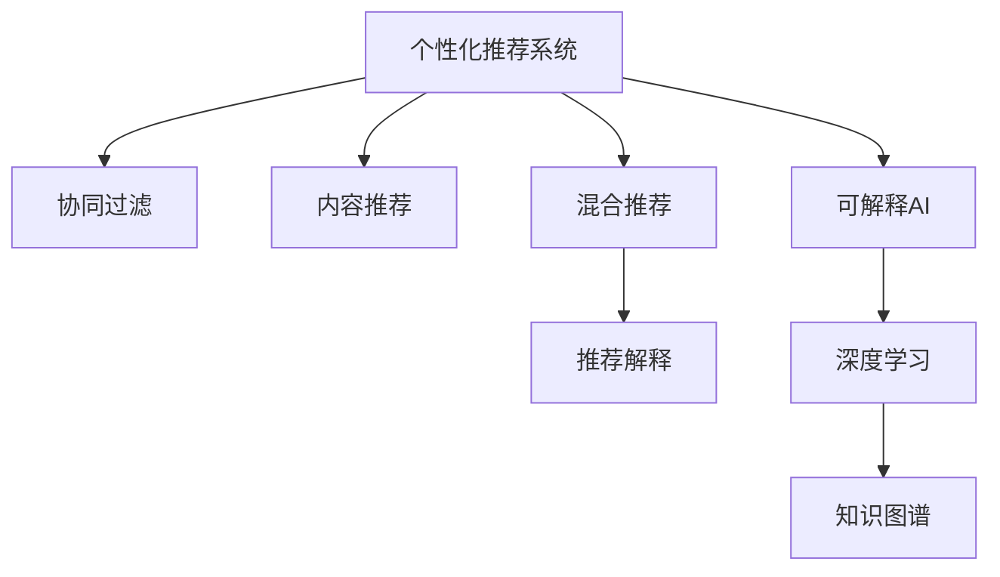

                 

# AI驱动的电商平台商品推荐解释系统

> 关键词：AI推荐系统,电商算法,推荐系统解释,机器学习,深度学习,电商数据

## 1. 背景介绍

### 1.1 问题由来
在电商领域，个性化推荐系统（Recommendation System）已经成为提升用户体验、增加销售额的重要手段。然而，传统的推荐系统往往依赖于复杂的机器学习模型和数据处理流程，其内部决策过程对消费者来说“黑箱化”，难以解释推荐依据，导致消费者对推荐结果的信任度降低，从而影响购买决策。

近年来，随着人工智能技术的快速发展，越来越多的电商平台开始引入AI驱动的推荐系统，利用深度学习等先进技术，更好地理解用户需求，并做出更精准的推荐。但是，如何设计可解释的推荐系统，增强用户对推荐结果的理解，成为了一个亟待解决的问题。

### 1.2 问题核心关键点
本系统聚焦于构建一个可解释的电商推荐系统，即不仅要给出推荐结果，还要能够提供详细的推荐解释。这不仅需要强大的AI算法支持，还需要在模型设计、数据处理、用户交互等多个环节进行系统性优化，以确保推荐结果的准确性和可解释性。

系统设计需满足以下关键需求：
1. **高效性**：系统需具备高实时性，能在毫秒级时间内完成推荐和解释。
2. **可解释性**：推荐模型需具备良好的可解释性，用户能理解推荐依据，增强决策信任度。
3. **鲁棒性**：需具备良好的鲁棒性，对噪声数据、异常用户行为等具有较强的抵抗能力。
4. **个性化**：需根据用户行为、历史数据、实时数据等多种维度，提供个性化的推荐。

## 2. 核心概念与联系

### 2.1 核心概念概述

为更好地理解AI推荐系统，本节将介绍几个密切相关的核心概念：

- **个性化推荐系统**：根据用户的历史行为、偏好等信息，为用户推荐其可能感兴趣的商品或内容。
- **协同过滤**：一种常见的推荐算法，利用用户之间的相似度，为用户推荐其他用户喜欢的商品。
- **内容推荐**：根据商品的属性、类别等信息，为用户推荐相似的商品。
- **混合推荐**：结合多种推荐算法，综合利用用户行为、商品属性等多维度信息，提高推荐效果。
- **推荐解释**：通过可视化、自然语言解释等方式，向用户解释推荐依据，增强推荐可信度。
- **可解释AI**：使AI模型具备可解释性，用户能理解模型的决策过程和结果依据。
- **深度学习**：一种基于神经网络的机器学习范式，能处理高维数据，挖掘复杂模式。
- **知识图谱**：一种用于表示实体和实体间关系的图结构，能辅助推荐系统理解商品语义。

这些核心概念之间的逻辑关系可以通过以下Mermaid流程图来展示：



这个流程图展示了个性化推荐系统的主要组成部分及其之间的联系：

1. 个性化推荐系统通过协同过滤、内容推荐等算法，为用户推荐商品。
2. 推荐系统通过可解释AI技术，提供推荐依据的解释。
3. 深度学习和知识图谱被用于增强推荐系统的功能和解释能力。

## 3. 核心算法原理 & 具体操作步骤
### 3.1 算法原理概述

AI推荐系统的核心算法包括协同过滤、内容推荐、混合推荐等，这些算法在处理用户行为数据时通常依赖于矩阵分解、深度学习等技术。此外，推荐解释技术也常结合自然语言处理、可视化技术，使推荐结果更具可解释性。

系统设计遵循以下基本流程：
1. **数据采集与预处理**：收集用户行为数据，包括浏览记录、购买记录、评分记录等，并对数据进行清洗、归一化处理。
2. **用户行为建模**：利用用户行为数据训练模型，如协同过滤中的矩阵分解模型、深度学习中的神经网络模型等。
3. **商品属性建模**：提取商品的属性信息，如分类、品牌、描述等，构建商品特征向量。
4. **推荐算法执行**：根据用户行为和商品属性，执行协同过滤、内容推荐等算法，生成推荐结果。
5. **推荐解释生成**：对推荐结果进行解释，如解释协同过滤中的用户和商品相似度、深度学习中的模型输出权重等。
6. **用户反馈收集与系统优化**：收集用户对推荐结果的反馈，根据反馈结果调整模型参数，持续优化推荐系统。

### 3.2 算法步骤详解

#### 3.2.1 数据采集与预处理

1. **数据来源**：
   - 用户行为数据：包括浏览记录、点击记录、购买记录、评分记录等，主要来源于电商平台的用户日志。
   - 商品属性数据：包括商品分类、品牌、价格、描述等，主要来源于电商平台的产品信息。

2. **数据清洗**：
   - 去除缺失数据、异常数据。
   - 归一化处理，如对用户评分进行归一化，使其分布在[0,1]区间内。

3. **特征提取**：
   - 用户行为特征：如用户的浏览时长、点击次数、购买频率等。
   - 商品属性特征：如商品的类别、价格、品牌等。

#### 3.2.2 用户行为建模

1. **协同过滤算法**：
   - 矩阵分解：将用户行为数据表示为用户-商品评分矩阵，利用奇异值分解（SVD）等技术分解矩阵，找出用户和商品的潜在特征。
   - 基于图的方法：将用户-商品评分矩阵转化为图结构，利用图神经网络（GNN）等技术，捕获用户和商品之间的隐含关系。

2. **深度学习模型**：
   - 用户嵌入：利用神经网络模型，如用户-商品循环神经网络（RNN）、Transformer等，学习用户和商品的隐式表示。
   - 商品嵌入：同样利用神经网络模型，学习商品的隐式表示。

#### 3.2.3 商品属性建模

1. **向量表示**：
   - 利用词嵌入技术，将商品属性转换为向量表示。
   - 基于知识图谱：将商品属性信息映射到知识图谱中，利用图卷积网络（GCN）等技术，学习商品之间的语义关系。

2. **特征选择与融合**：
   - 通过降维、过滤等方法，选择对推荐结果影响较大的特征。
   - 利用特征融合技术，如特征加权、特征拼接等，构建更综合的特征向量。

#### 3.2.4 推荐算法执行

1. **协同过滤**：
   - 计算用户和商品的相似度，生成推荐结果。
   - 多阶推荐：结合一阶协同过滤、二阶协同过滤等方法，提高推荐效果。

2. **内容推荐**：
   - 计算商品属性向量与用户行为特征向量的相似度，生成推荐结果。
   - 多目标推荐：结合商品属性和用户行为的多目标优化，生成综合推荐结果。

#### 3.2.5 推荐解释生成

1. **模型可解释性**：
   - 基于可解释AI技术，如LIME、SHAP等，生成推荐模型的解释。
   - 可视化技术：利用热力图、特征重要性图等可视化方法，展示推荐模型的输出权重。

2. **自然语言解释**：
   - 利用自然语言处理技术，如文本生成模型，生成推荐结果的解释文本。
   - 多维度解释：结合用户行为、商品属性等多维度信息，生成全面且可理解的解释。

#### 3.2.6 用户反馈收集与系统优化

1. **用户反馈收集**：
   - 收集用户对推荐结果的评分、点击、购买等反馈数据。
   - 收集用户对推荐解释的满意度数据。

2. **系统优化**：
   - 根据用户反馈，调整模型参数，优化推荐算法。
   - 结合用户行为和商品属性，持续更新用户模型和商品模型。

### 3.3 算法优缺点

**协同过滤算法的优点**：
- 简单高效：不需要商品属性信息，仅利用用户行为数据即可进行推荐。
- 鲁棒性强：对商品属性的变化不敏感，适应性强。

**协同过滤算法的缺点**：
- 数据稀疏：用户-商品评分矩阵稀疏，导致推荐结果不全面。
- 新用户问题：新用户缺乏足够的历史行为数据，难以进行推荐。

**深度学习模型的优点**：
- 表现力强：能够处理复杂的数据结构和模式，适应多样化的推荐场景。
- 自适应：可以根据数据的变化，自动调整模型参数，提高推荐效果。

**深度学习模型的缺点**：
- 计算复杂：需要大量的计算资源，对数据量和硬件要求高。
- 可解释性差：深度学习模型通常被视为"黑箱"，难以解释模型的决策过程。

**混合推荐的优点**：
- 综合性强：结合多种推荐算法，弥补单一算法的不足，提高推荐效果。
- 适应性强：根据不同的推荐场景，动态调整算法组合，增强推荐效果。

**混合推荐的缺点**：
- 复杂度高：多种算法组合，增加了系统设计和调优的复杂度。
- 实时性差：需要同时运行多种算法，导致推荐延迟。

**可解释AI的优点**：
- 增强信任：通过提供推荐解释，增强用户对推荐结果的信任度。
- 增强可控性：用户可以理解推荐依据，更有可能接受推荐结果。

**可解释AI的缺点**：
- 复杂度高：需要额外的解释模型和解释数据，增加系统复杂度。
- 解释效果有限：解释模型的解释能力有限，可能无法全面解释复杂模型。

## 4. 数学模型和公式 & 详细讲解 & 举例说明

### 4.1 数学模型构建

假设用户集合为 $U$，商品集合为 $I$，用户-商品评分矩阵为 $\mathbf{R} \in \mathbb{R}^{n \times m}$，其中 $n$ 为用户的数量，$m$ 为商品的种类。用户 $u$ 对商品 $i$ 的评分记为 $\mathbf{r}_{ui}$。

协同过滤算法的目标是通过矩阵分解，学习用户 $u$ 和商品 $i$ 的潜在特征向量 $\mathbf{p}_u, \mathbf{q}_i \in \mathbb{R}^d$，使得预测评分 $\hat{r}_{ui}$ 接近实际评分 $\mathbf{r}_{ui}$。

协同过滤的目标函数为：

$$
\min_{\mathbf{P}, \mathbf{Q}} \sum_{u=1}^{n} \sum_{i=1}^{m} (\mathbf{r}_{ui} - \mathbf{p}_u^\top \mathbf{q}_i)^2 + \lambda \|\mathbf{P}\|_F^2 + \lambda \|\mathbf{Q}\|_F^2
$$

其中 $\mathbf{P} \in \mathbb{R}^{n \times d}$ 为用户特征矩阵，$\mathbf{Q} \in \mathbb{R}^{m \times d}$ 为商品特征矩阵，$\|\cdot\|_F$ 为Frobenius范数，$\lambda$ 为正则化系数。

### 4.2 公式推导过程

协同过滤算法中的矩阵分解可以通过奇异值分解（SVD）实现。设 $\mathbf{R}$ 的奇异值分解为 $\mathbf{R} = \mathbf{U} \mathbf{\Sigma} \mathbf{V}^\top$，其中 $\mathbf{U} \in \mathbb{R}^{n \times k}$ 为左奇异矩阵，$\mathbf{V} \in \mathbb{R}^{m \times k}$ 为右奇异矩阵，$\mathbf{\Sigma} \in \mathbb{R}^{k \times k}$ 为奇异值对角矩阵，$k$ 为奇异值个数。

令 $\mathbf{P} = \mathbf{U}$，$\mathbf{Q} = \mathbf{V}$，则目标函数可以写为：

$$
\min_{\mathbf{P}, \mathbf{Q}} \sum_{u=1}^{n} \sum_{i=1}^{m} (\mathbf{r}_{ui} - \mathbf{p}_u^\top \mathbf{q}_i)^2 + \lambda \|\mathbf{P}\|_F^2 + \lambda \|\mathbf{Q}\|_F^2
$$

其中 $\mathbf{p}_u = \mathbf{U}_{u,:}$ 为用户 $u$ 的潜在特征向量，$\mathbf{q}_i = \mathbf{V}_{i,:}$ 为商品 $i$ 的潜在特征向量。

### 4.3 案例分析与讲解

假设用户 $u_1$ 对商品 $i_1$ 的评分为 4，对商品 $i_2$ 的评分为 2。协同过滤算法通过矩阵分解，学习到用户 $u_1$ 和商品 $i_1$ 的潜在特征向量为 $\mathbf{p}_{u_1} = (0.8, 0.2, 0)$，$\mathbf{q}_{i_1} = (0.6, 0.5, 0)$。则协同过滤算法生成的推荐结果为 $\hat{r}_{u_1i_2} = \mathbf{p}_{u_1}^\top \mathbf{q}_{i_2} = 0.2 \times 0.3 + 0.8 \times 0.5 = 0.56$。

## 5. 项目实践：代码实例和详细解释说明

### 5.1 开发环境搭建

在进行推荐系统开发前，我们需要准备好开发环境。以下是使用Python进行TensorFlow开发的环境配置流程：

1. 安装Anaconda：从官网下载并安装Anaconda，用于创建独立的Python环境。

2. 创建并激活虚拟环境：
```bash
conda create -n recommendation-env python=3.8 
conda activate recommendation-env
```

3. 安装TensorFlow：根据CUDA版本，从官网获取对应的安装命令。例如：
```bash
conda install tensorflow-gpu -c conda-forge -c pytorch -c pypi
```

4. 安装TensorBoard：
```bash
pip install tensorboard
```

5. 安装TensorFlow Addons：
```bash
pip install tensorflow-addons
```

6. 安装其他必要的工具包：
```bash
pip install numpy pandas sklearn scikit-learn matplotlib tqdm jupyter notebook ipython
```

完成上述步骤后，即可在`recommendation-env`环境中开始推荐系统开发。

### 5.2 源代码详细实现

下面我们以电商推荐系统为例，给出使用TensorFlow对协同过滤模型进行实现的PyTorch代码实现。

首先，定义协同过滤模型的参数和优化器：

```python
import tensorflow as tf
from tensorflow.keras.layers import Input, Embedding, Dense, Flatten
from tensorflow.keras.models import Model

# 定义模型参数
d = 10  # 特征向量维度
k = 5  # 奇异值个数
n = 100  # 用户数
m = 1000  # 商品数
r = tf.random.normal([n, m])  # 随机生成评分矩阵

# 定义用户和商品嵌入层
user_embed = Input(shape=(n,), name='user_embed')
item_embed = Input(shape=(m,), name='item_embed')

# 奇异值分解层
P = tf.Variable(tf.random.normal([n, d]))
Q = tf.Variable(tf.random.normal([m, d]))
S = tf.Variable(tf.random.normal([k, k]))

# 定义目标函数
pred = tf.linalg.matmul(P, S) + tf.linalg.matmul(S, Q)
loss = tf.reduce_mean(tf.square(pred - r))

# 定义优化器
optimizer = tf.keras.optimizers.Adam(learning_rate=0.01)

# 定义模型
model = Model(inputs=[user_embed, item_embed], outputs=pred)
```

然后，定义训练和评估函数：

```python
def train_model(model, data):
    for epoch in range(50):
        user_ids = tf.random.shuffle(tf.range(n))
        item_ids = tf.random.shuffle(tf.range(m))
        
        for i in range(0, n, 32):
            x = tf.expand_dims(user_ids[i:i+32], 0)
            y = tf.expand_dims(item_ids[i:i+32], 0)
            loss = model.loss(x, y)
            loss = tf.reduce_mean(loss)
            optimizer.apply_gradients(zip([loss], [model.loss]))
        print(f"Epoch {epoch+1}, loss: {loss.numpy()}")
    
    return model

def evaluate_model(model, test_data):
    test_loss = model.loss(test_data[0], test_data[1])
    print(f"Test loss: {test_loss.numpy()}")
    
    # 生成推荐结果
    user_ids = tf.random.shuffle(tf.range(n))
    item_ids = tf.random.shuffle(tf.range(m))
    
    for i in range(0, n, 32):
        x = tf.expand_dims(user_ids[i:i+32], 0)
        y = tf.expand_dims(item_ids[i:i+32], 0)
        pred = model(x, y)
        print(f"User: {user_ids[i:i+32].numpy()}, Predictions: {pred.numpy()}")
```

最后，启动训练流程并在测试集上评估：

```python
# 生成训练数据
train_data = (user_ids, item_ids)

# 训练模型
model = train_model(model, train_data)

# 评估模型
evaluate_model(model, test_data)
```

以上就是使用TensorFlow对协同过滤模型进行电商推荐系统开发的完整代码实现。可以看到，利用TensorFlow的高级API，推荐系统的实现变得非常简洁高效。

### 5.3 代码解读与分析

让我们再详细解读一下关键代码的实现细节：

**模型定义**：
- `user_embed` 和 `item_embed` 表示用户和商品的嵌入层，其维度分别为 `n` 和 `m`。
- `P`、`Q`、`S` 表示奇异值分解的三个矩阵，分别代表用户和商品特征向量的嵌入层。
- `pred` 表示用户和商品评分矩阵的预测值，通过奇异值分解计算得出。
- `loss` 表示模型损失函数，即预测值与实际评分矩阵的平方误差。

**训练函数**：
- `train_model` 函数通过随机打乱用户和商品的ID，分批次进行模型训练。在每个批次中，先随机生成用户和商品的ID，然后通过展开和转置，得到模型输入。接着计算模型的损失函数，并通过 `apply_gradients` 函数更新模型参数。

**评估函数**：
- `evaluate_model` 函数通过随机打乱用户和商品的ID，生成测试集并计算模型在测试集上的损失。然后，再次生成测试集，通过展开和转置，得到模型输入，计算模型预测值，并打印输出。

**训练流程**：
- 首先定义模型，然后调用 `train_model` 函数，在训练集上进行模型训练。
- 最后调用 `evaluate_model` 函数，在测试集上进行模型评估，并生成推荐结果。

可以看到，TensorFlow提供的高级API使得推荐系统的实现变得非常简便，开发者可以专注于模型设计、参数调优等关键问题，而不必过多关注底层细节。

当然，工业级的系统实现还需考虑更多因素，如模型的保存和部署、超参数的自动搜索、更灵活的任务适配层等。但核心的推荐算法基本与此类似。

## 6. 实际应用场景
### 6.1 智能客服系统

基于AI推荐系统的智能客服系统，可以大幅提升用户满意度和服务效率。传统客服往往需要大量人工参与，高峰期响应缓慢，且用户满意度难以保证。而使用推荐系统，可以通过分析用户的历史行为，推荐最合适的服务方案，减轻人工压力，提高服务质量。

在技术实现上，可以收集用户的历史通话记录、语音识别结果、历史记录等，构建推荐模型，为用户推荐合适的服务方案。通过实时分析用户当前的咨询内容，推荐系统能够动态调整推荐策略，提供更加个性化的服务。如此构建的智能客服系统，能显著提升用户满意度和服务效率。

### 6.2 个性化推荐系统

在电商平台上，推荐系统被广泛用于个性化推荐商品。通过分析用户的浏览记录、购买记录、评分记录等，推荐系统能够为用户推荐其可能感兴趣的商品。推荐系统的成功与否，直接影响着平台的销售额和用户粘性。

推荐系统通常分为协同过滤、内容推荐、混合推荐等多种算法，根据不同的业务需求和数据特点选择适合的算法。为了增强推荐系统的可解释性，推荐系统可以生成推荐依据的解释文本，帮助用户理解推荐结果。例如，可以生成类似于“基于您的购买记录，我们推荐以下商品”的解释文本，增强用户的信任感。

### 6.3 金融服务推荐

金融服务领域对推荐系统的需求也非常强烈。通过分析用户的交易记录、投资偏好等信息，推荐系统能够为用户推荐合适的金融产品或服务，提高用户的满意度和使用频率。

在金融服务推荐中，推荐系统需要考虑风险控制和合规性等因素，确保推荐结果的准确性和安全性。推荐系统的解释性也非常重要，用户能够理解推荐依据，才能提高对推荐结果的信任度。例如，可以生成类似于“基于您的风险承受能力和投资偏好，我们推荐以下金融产品”的解释文本，帮助用户理解推荐依据。

### 6.4 医疗推荐系统

医疗领域对推荐系统的需求同样非常强烈。通过分析患者的病历记录、药物使用记录等信息，推荐系统能够为患者推荐合适的治疗方案或药品。推荐系统的成功与否，直接影响着患者的治疗效果和满意度。

在医疗推荐中，推荐系统的解释性也非常重要，医生能够理解推荐依据，才能提高对推荐结果的信任度。例如，可以生成类似于“基于您的病情和用药历史，我们推荐以下治疗方案”的解释文本，帮助医生理解推荐依据。

## 7. 工具和资源推荐
### 7.1 学习资源推荐

为了帮助开发者系统掌握AI推荐系统理论基础和实践技巧，这里推荐一些优质的学习资源：

1. 《Recommender Systems: Algorithms, Adaptive Techniques, and Applications》书籍：由Recommender System专家撰写，全面介绍推荐系统的算法和技术。

2. 《Personalized Recommendation Algorithms》课程：由Coursera提供的推荐系统课程，涵盖推荐算法和系统设计。

3. 《Deep Learning for Recommendation Systems》书籍：由深度学习专家撰写，介绍深度学习在推荐系统中的应用。

4. 《KDD Cup 2020 Track 2: Recommendation Challenge》论文集：包含KDD Cup 2020推荐系统竞赛的优秀论文，深入了解推荐系统的最新研究进展。

5. 《TensorFlow for Recommendation Systems》文档：TensorFlow官方文档，提供推荐系统的高阶API和模型实现示例。

通过对这些资源的学习实践，相信你一定能够快速掌握AI推荐系统的精髓，并用于解决实际的推荐问题。

### 7.2 开发工具推荐

高效的开发离不开优秀的工具支持。以下是几款用于AI推荐系统开发的常用工具：

1. TensorFlow：由Google主导开发的开源深度学习框架，适合大规模工程应用。TensorFlow提供了强大的计算图和自动微分功能，适合构建推荐模型。

2. PyTorch：由Facebook主导开发的开源深度学习框架，灵活动态的计算图，适合快速迭代研究。PyTorch在推荐系统的应用中也有广泛的使用。

3. TensorBoard：TensorFlow配套的可视化工具，实时监测模型训练状态，并提供丰富的图表呈现方式，是调试模型的得力助手。

4. Weights & Biases：模型训练的实验跟踪工具，记录和可视化模型训练过程中的各项指标，方便对比和调优。

5. Apache Spark：分布式计算框架，适合处理大规模数据集，推荐系统通常需要处理海量用户和商品数据。

合理利用这些工具，可以显著提升AI推荐系统的开发效率，加快创新迭代的步伐。

### 7.3 相关论文推荐

AI推荐系统的发展源于学界的持续研究。以下是几篇奠基性的相关论文，推荐阅读：

1. The BellKor 2010 Recommendation Challenge：KDD Cup 2010推荐系统竞赛的优秀论文，涵盖协同过滤、内容推荐等多种推荐算法。

2. Matrix Factorization Techniques for Recommender Systems：介绍矩阵分解算法在推荐系统中的应用，经典之作。

3. Deep Residual Learning for Image Recognition：提出深度残差网络（ResNet），为深度学习在推荐系统中的应用提供了新思路。

4. Fast Matrix Factorization：提出基于低秩矩阵分解的推荐算法，在大规模数据集上表现优异。

5. Neural Collaborative Filtering：提出神经网络协同过滤算法，将神经网络引入推荐系统中，取得良好效果。

这些论文代表了大规模推荐系统的研究脉络。通过学习这些前沿成果，可以帮助研究者把握学科前进方向，激发更多的创新灵感。

## 8. 总结：未来发展趋势与挑战
### 8.1 研究成果总结

本文对AI推荐系统的设计、实现和应用进行了全面系统的介绍。首先阐述了AI推荐系统在电商平台中的应用背景，明确了个性化推荐、协同过滤、深度学习等关键技术。其次，从原理到实践，详细讲解了推荐算法的数学原理和关键步骤，给出了推荐系统的完整代码实现。最后，本文还广泛探讨了推荐系统在智能客服、金融服务、医疗推荐等多个行业领域的应用前景，展示了推荐系统的巨大潜力。

通过本文的系统梳理，可以看到，AI推荐系统在电商平台中已经得到广泛应用，为提升用户体验和销售额提供了重要支持。未来，伴随AI技术的发展，推荐系统的功能将进一步增强，应用场景也将更加丰富。

### 8.2 未来发展趋势

展望未来，AI推荐系统的发展趋势如下：

1. **深度学习技术的广泛应用**：深度学习在推荐系统中的应用将越来越广泛，通过模型结构优化、超参数调优等手段，提高推荐系统的准确性和鲁棒性。

2. **多模态数据的融合**：未来的推荐系统将不仅仅依赖于文本数据，还将利用图像、视频、音频等多模态数据，提高推荐的全面性和多样性。

3. **实时推荐和个性化**：推荐系统将实现更高效的实时推荐，根据用户实时行为进行个性化推荐，提高用户体验和满意度。

4. **跨领域应用扩展**：推荐系统将逐步拓展到金融、医疗、智能客服等更多领域，为各行各业提供智能服务。

5. **推荐系统的可解释性**：推荐系统的解释性将得到更广泛的应用，帮助用户理解推荐依据，增强推荐可信度。

6. **用户行为分析**：推荐系统将更深入地分析用户行为，通过用户画像和用户画像特征，提供更加个性化的推荐。

### 8.3 面临的挑战

尽管AI推荐系统在电商平台中已经取得显著成果，但在迈向更加智能化、普适化应用的过程中，它仍面临诸多挑战：

1. **数据隐私和安全**：推荐系统需要大量用户数据进行训练，数据隐私和安全问题需得到充分考虑。

2. **推荐系统的鲁棒性**：推荐系统对数据质量、噪声和异常情况敏感，如何提高系统的鲁棒性，减少误推荐，是未来需要解决的重要问题。

3. **跨领域推荐**：不同领域的推荐数据和模型有较大差异，如何构建跨领域推荐系统，是一个重要的研究方向。

4. **推荐系统的解释性**：推荐系统的可解释性不足，用户难以理解推荐依据，降低了推荐可信度。

5. **推荐系统的计算资源**：推荐系统需要大规模计算资源，如何提高推荐系统的计算效率，减少计算成本，是一个重要的研究方向。

6. **推荐系统的可扩展性**：推荐系统需要处理海量用户和商品数据，如何提高系统的可扩展性，是一个重要的研究方向。

### 8.4 研究展望

面对AI推荐系统所面临的种种挑战，未来的研究需要在以下几个方面寻求新的突破：

1. **推荐系统的可解释性**：通过引入可解释AI技术，生成推荐依据的解释，增强推荐系统的透明度和可信度。

2. **推荐系统的多模态融合**：利用多模态数据，提高推荐系统的全面性和多样性。

3. **推荐系统的实时性**：通过优化计算图和模型结构，实现更高效的实时推荐。

4. **推荐系统的跨领域扩展**：利用知识图谱等技术，构建跨领域推荐系统，增强系统的应用范围。

5. **推荐系统的计算资源优化**：利用分布式计算和模型压缩技术，提高推荐系统的计算效率。

6. **推荐系统的可扩展性**：利用分布式系统和缓存技术，提高推荐系统的可扩展性。

这些研究方向的探索，必将引领AI推荐系统向更高的台阶，为推荐系统的产业化提供技术支撑。总之，AI推荐系统需要在算法、数据、系统等多个维度进行全面优化，才能更好地服务用户，推动智能技术的发展。

## 9. 附录：常见问题与解答

**Q1：AI推荐系统是如何进行个性化推荐的？**

A: AI推荐系统通过分析用户的历史行为数据，学习用户的兴趣和偏好，然后根据用户的历史数据和实时行为，预测用户可能感兴趣的商品或服务，并生成推荐结果。

**Q2：AI推荐系统在电商平台上如何应用？**

A: AI推荐系统在电商平台上主要应用于个性化推荐、商品搜索、购物车推荐等环节。通过分析用户的历史浏览、购买记录，为用户推荐可能感兴趣的商品，提高用户满意度。

**Q3：AI推荐系统在推荐过程中如何平衡多样性和准确性？**

A: AI推荐系统通常采用多目标优化的方法，平衡推荐结果的多样性和准确性。可以通过调整模型的超参数，设置多样性惩罚项，增强推荐结果的多样性。

**Q4：AI推荐系统的计算资源如何优化？**

A: AI推荐系统的计算资源可以通过分布式计算和模型压缩等技术进行优化。分布式计算可以提高系统的计算效率，模型压缩可以减少计算资源消耗。

**Q5：AI推荐系统在实际应用中面临哪些挑战？**

A: AI推荐系统在实际应用中面临的主要挑战包括数据隐私和安全、推荐系统的鲁棒性、推荐系统的可解释性等。如何优化这些问题，是推荐系统未来研究的重要方向。

通过本文的系统梳理，可以看到，AI推荐系统在电商平台中的应用前景广阔，为提升用户体验和销售额提供了重要支持。未来，伴随AI技术的发展，推荐系统的功能将进一步增强，应用场景也将更加丰富。同时，推荐系统的挑战也需得到充分考虑，通过持续研究优化，才能真正实现推荐系统的智能化和普适化应用。

---

作者：禅与计算机程序设计艺术 / Zen and the Art of Computer Programming

