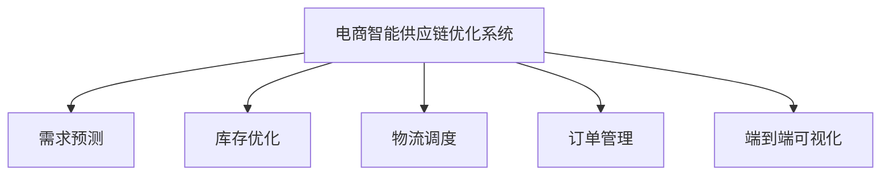

                 

# AI驱动的电商智能供应链优化系统

## 1. 背景介绍

### 1.1 问题由来
电商行业竞争激烈，商品种类繁多，供应链管理日益复杂。供应链的响应速度、库存管理、需求预测等各个环节的优化，成为电商企业提升运营效率和盈利能力的关键。传统的手工优化方法效率低下，难以满足快速变化的市场需求。为此，人工智能技术逐渐被引入到电商供应链管理中，实现智能化的优化和预测。

近年来，随着深度学习、强化学习、优化算法等人工智能技术的不断进步，AI驱动的智能供应链优化系统（AI-DSOS, Artificial Intelligence-Driven Supply Chain Optimization System）开始成为电商企业智能化转型的重要工具。通过深度学习技术实现需求预测、库存优化、物流调度和订单管理等功能，AI-DSOS系统能够大幅度提升供应链管理效率和反应速度，降低运营成本，提升客户满意度。

### 1.2 问题核心关键点
AI-DSOS系统的主要创新点在于：
- 采用深度学习算法进行需求预测，实现对未来需求的高精度预测。
- 应用强化学习技术进行库存优化和物流调度，确保资源的合理分配和最优利用。
- 结合优化算法进行订单分配，提升订单处理速度和响应速度。
- 实现供应链的端到端可视化，支持实时监控和反馈优化。

## 2. 核心概念与联系

### 2.1 核心概念概述

为更好地理解AI-DSOS系统，本节将介绍几个关键概念及其联系：

- 电商智能供应链优化系统（AI-DSOS）：通过深度学习、强化学习、优化算法等技术，实现对电商供应链的智能优化和预测的系统。
- 需求预测（Demand Forecasting）：使用深度学习模型对未来产品需求进行预测，为库存管理和物流调度提供依据。
- 库存优化（Inventory Optimization）：通过强化学习算法动态调整库存水平，减少过剩库存和缺货情况，提高库存周转率。
- 物流调度（Logistics Scheduling）：应用优化算法进行物流路径和资源的规划，提升物流效率，降低物流成本。
- 订单管理（Order Management）：结合优化算法实现订单的高效分配和处理，提升订单响应速度和客户满意度。
- 端到端可视化（End-to-End Visualization）：通过数据可视化工具实现供应链各环节的实时监控和反馈，支持决策者实时调整策略。

这些核心概念之间的逻辑关系可以通过以下Mermaid流程图来展示：

这个流程图展示了AI-DSOS系统与各个子系统之间的联系：

1. 需求预测系统通过历史销售数据和外部因素，预测未来需求。
2. 库存优化系统根据预测结果和实时库存水平，动态调整库存。
3. 物流调度系统基于预测需求和库存情况，规划最优物流路径和资源分配。
4. 订单管理系统结合物流调度结果，实现订单的高效分配和处理。
5. 端到端可视化系统实时监控供应链各环节，提供反馈和决策支持。

## 3. 核心算法原理 & 具体操作步骤

### 3.1 算法原理概述

AI-DSOS系统采用深度学习、强化学习和优化算法，构建了多层级、端到端的供应链优化框架。其核心算法原理如下：

- 需求预测算法：使用深度学习模型（如LSTM、GRU、Transformer等）对历史销售数据进行分析，结合外部因素（如季节性、促销活动等）进行未来需求的预测。
- 库存优化算法：应用强化学习算法（如Q-Learning、Deep Q-Network等），基于预测需求和实时库存水平，动态调整库存，确保库存合理、周转率高。
- 物流调度算法：使用优化算法（如遗传算法、粒子群算法、蚁群算法等），规划最优物流路径和资源分配，提高物流效率，降低成本。
- 订单管理算法：结合优化算法，实现订单的高效分配和处理，提升订单响应速度和客户满意度。
- 端到端可视化算法：采用数据可视化技术（如Tableau、PowerBI等），实时监控供应链各环节，提供反馈和决策支持。

### 3.2 算法步骤详解

#### 3.2.1 需求预测算法步骤
1. 收集历史销售数据：包括日销量、月销量、销售时间、促销活动等。
2. 特征工程：提取时间特征、季节性特征、促销活动特征等，构建输入向量。
3. 模型训练：使用深度学习模型（如LSTM、GRU、Transformer等）对历史数据进行训练，得到预测模型。
4. 预测未来需求：将时间戳输入训练好的模型，得到未来需求预测结果。

#### 3.2.2 库存优化算法步骤
1. 定义状态空间：将库存水平、时间、促销活动等作为状态变量。
2. 定义动作空间：库存调整、补货、促销活动等作为动作。
3. 定义奖励函数：基于库存成本、缺货成本等指标定义奖励函数。
4. 强化学习训练：使用Q-Learning、Deep Q-Network等算法，训练库存优化模型。
5. 动态调整库存：根据实时库存水平和预测需求，动态调整库存。

#### 3.2.3 物流调度算法步骤
1. 定义物流状态空间：包括物流节点、时间、货物类型等。
2. 定义动作空间：路径选择、运输方式选择、节点分配等。
3. 定义奖励函数：基于运输成本、配送时间等指标定义奖励函数。
4. 优化算法训练：使用遗传算法、粒子群算法、蚁群算法等优化算法，训练物流调度模型。
5. 路径和资源规划：根据优化算法结果，生成最优物流路径和资源分配方案。

#### 3.2.4 订单管理算法步骤
1. 定义订单状态空间：订单状态、时间、资源分配等。
2. 定义动作空间：订单分配、配送方式选择、配送路径规划等。
3. 定义奖励函数：基于配送时间、客户满意度等指标定义奖励函数。
4. 优化算法训练：使用优化算法（如遗传算法、粒子群算法等），训练订单管理模型。
5. 订单处理：根据优化算法结果，高效分配订单，生成最优处理方案。

#### 3.2.5 端到端可视化算法步骤
1. 数据收集：实时采集供应链各环节数据。
2. 数据清洗：处理缺失值、异常值等，确保数据质量。
3. 数据可视化：使用Tableau、PowerBI等工具，将供应链数据可视化。
4. 实时监控：设置实时监控指标，如库存水平、物流路径、订单处理时间等。
5. 反馈优化：根据实时监控结果，动态调整需求预测、库存优化、物流调度和订单管理策略。

### 3.3 算法优缺点

AI-DSOS系统的算法有以下优点：
- 高精度需求预测：深度学习模型能够捕捉到历史数据中的复杂模式，实现高精度需求预测。
- 库存优化：强化学习算法能够动态调整库存，降低库存成本和缺货风险。
- 物流调度：优化算法能够规划最优物流路径和资源分配，提升物流效率，降低成本。
- 订单管理：优化算法能够实现订单高效分配和处理，提升订单响应速度和客户满意度。
- 端到端可视化：数据可视化工具实时监控供应链各环节，提供反馈和决策支持。

同时，该系统也存在一些缺点：
- 数据质量要求高：算法效果依赖于高质量的数据，数据清洗和预处理工作量大。
- 算法模型复杂：深度学习、强化学习、优化算法等模型较为复杂，训练和调试难度较大。
- 模型解释性不足：神经网络模型和优化算法缺乏可解释性，难以理解模型的内部工作机制。
- 系统复杂度高：多个子系统相互依赖，系统维护和调试复杂。
- 成本较高：系统建设需要高昂的计算资源和数据资源。

尽管存在这些缺点，但AI-DSOS系统通过优化算法和强化学习，能够在大量数据的基础上实现供应链的高效管理和预测，其应用前景广阔。

### 3.4 算法应用领域

AI-DSOS系统已经在多个电商供应链管理场景中得到应用，例如：

- 亚马逊（Amazon）：使用AI-DSOS系统优化其物流配送和库存管理，提升物流效率，降低运营成本。
- 阿里巴巴（Alibaba）：在“双11”期间，通过AI-DSOS系统优化库存和订单管理，提升订单处理速度和客户满意度。
- 京东（JD.com）：使用AI-DSOS系统优化供应链各环节，提高库存周转率和物流效率。
- 苏宁易购（Suning Easy Buy）：通过AI-DSOS系统实现实时需求预测和库存优化，降低库存成本，提升客户满意度。

这些应用场景展示了AI-DSOS系统的强大潜力和广泛适用性，其在电商供应链管理中的应用前景广阔。

## 4. 数学模型和公式 & 详细讲解 & 举例说明

### 4.1 数学模型构建

#### 4.1.1 需求预测模型
假设历史销售数据为 $D=\{(x_i, y_i)\}_{i=1}^N$，其中 $x_i$ 为时间戳，$y_i$ 为日销量。需求预测模型 $f(x)$ 的输入为 $x_i$，输出为未来日销量 $\hat{y}$。

根据ARIMA（自回归积分滑动平均）模型，需求预测公式为：

$$
\hat{y}=f(x)=\alpha(x-\tau_1) + \beta \sum_{j=1}^{k} w_j (x-\tau_j) + \epsilon(x)
$$

其中 $\alpha, \beta$ 为模型参数，$\tau_j$ 为滞后时间，$w_j$ 为权重，$\epsilon(x)$ 为误差项。

#### 4.1.2 库存优化模型
定义状态空间 $S$，动作空间 $A$，奖励函数 $R$。设当前时间为 $t$，当前库存水平为 $I_t$，促销活动为 $P_t$。库存优化模型 $Q(I_t, P_t, A)$ 的目标是在给定状态和时间步长下，最大化累积奖励。

$$
Q(I_t, P_t, A) = \sum_{t'=t}^T \gamma^{t'-t} R(I_{t'}, P_{t'}, A) + \lambda \mathbb{E}(Q(I_{t+1}, P_{t+1}, A))
$$

其中 $\gamma$ 为折扣因子，$T$ 为预测时间步长，$\lambda$ 为未来奖励系数。

#### 4.1.3 物流调度模型
定义物流状态空间 $S$，动作空间 $A$，奖励函数 $R$。设当前时间为 $t$，当前节点为 $N_t$，货物类型为 $G_t$。物流调度模型 $C(N_t, G_t, A)$ 的目标是在给定状态和时间步长下，最小化运输成本和配送时间。

$$
C(N_t, G_t, A) = \sum_{t'=t}^T \gamma^{t'-t} R(N_{t'}, G_{t'}, A) + \lambda \mathbb{E}(C(N_{t+1}, G_{t+1}, A))
$$

其中 $\gamma$ 为折扣因子，$T$ 为预测时间步长，$\lambda$ 为未来奖励系数。

#### 4.1.4 订单管理模型
定义订单状态空间 $S$，动作空间 $A$，奖励函数 $R$。设当前时间为 $t$，当前订单状态为 $O_t$，资源分配为 $R_t$。订单管理模型 $O(O_t, R_t, A)$ 的目标是在给定状态和时间步长下，最大化订单处理速度和客户满意度。

$$
O(O_t, R_t, A) = \sum_{t'=t}^T \gamma^{t'-t} R(O_{t'}, R_{t'}, A) + \lambda \mathbb{E}(O(O_{t+1}, R_{t+1}, A))
$$

其中 $\gamma$ 为折扣因子，$T$ 为预测时间步长，$\lambda$ 为未来奖励系数。

### 4.2 公式推导过程

#### 4.2.1 需求预测模型推导
需求预测模型 $f(x)$ 的训练过程如下：
1. 初始化模型参数 $\alpha, \beta$。
2. 对历史数据 $D$ 进行拟合，得到模型参数 $\alpha', \beta'$。
3. 使用 $\alpha', \beta'$ 进行未来需求预测，得到 $\hat{y}$。

$$
\hat{y}=f(x)=\alpha'(x-\tau_1) + \beta' \sum_{j=1}^{k} w_j (x-\tau_j) + \epsilon'(x)
$$

其中 $\alpha'$、$\beta'$、$\tau_j$ 和 $\epsilon'$ 为训练后得到的参数。

#### 4.2.2 库存优化模型推导
库存优化模型 $Q(I_t, P_t, A)$ 的训练过程如下：
1. 初始化模型参数 $Q$。
2. 对历史库存数据 $I$ 和促销活动 $P$ 进行拟合，得到模型参数 $Q'$。
3. 使用 $Q'$ 进行库存优化，得到最优库存策略。

$$
Q'(I_t, P_t, A) = \sum_{t'=t}^T \gamma^{t'-t} R(I_{t'}, P_{t'}, A) + \lambda \mathbb{E}(Q'(I_{t+1}, P_{t+1}, A))
$$

其中 $Q'$ 为训练后得到的参数。

#### 4.2.3 物流调度模型推导
物流调度模型 $C(N_t, G_t, A)$ 的训练过程如下：
1. 初始化模型参数 $C$。
2. 对历史物流数据 $N$ 和货物类型 $G$ 进行拟合，得到模型参数 $C'$。
3. 使用 $C'$ 进行物流调度，得到最优物流策略。

$$
C'(N_t, G_t, A) = \sum_{t'=t}^T \gamma^{t'-t} R(N_{t'}, G_{t'}, A) + \lambda \mathbb{E}(C'(N_{t+1}, G_{t+1}, A))
$$

其中 $C'$ 为训练后得到的参数。

#### 4.2.4 订单管理模型推导
订单管理模型 $O(O_t, R_t, A)$ 的训练过程如下：
1. 初始化模型参数 $O$。
2. 对历史订单数据 $O$ 和资源分配 $R$ 进行拟合，得到模型参数 $O'$。
3. 使用 $O'$ 进行订单管理，得到最优订单策略。

$$
O'(O_t, R_t, A) = \sum_{t'=t}^T \gamma^{t'-t} R(O_{t'}, R_{t'}, A) + \lambda \mathbb{E}(O'(O_{t+1}, R_{t+1}, A))
$$

其中 $O'$ 为训练后得到的参数。

### 4.3 案例分析与讲解

#### 4.3.1 需求预测案例
某电商平台销售空调的日销量数据如表1所示：

| 时间 | 日销量 |
|------|--------|
| 1月1日 | 100 |
| 1月2日 | 120 |
| 1月3日 | 80 |
| ...  | ...   |

假设采用ARIMA模型进行需求预测。设 $\tau=1, k=2, w_1=0.5, w_2=0.3$，初始参数 $\alpha=0.5, \beta=0.2$。

预测1月4日的日销量 $\hat{y}$：

$$
\hat{y}=f(x)=0.5(x-1) + 0.2 (0.5(x-2) + 0.3(x-3)) + \epsilon(4)
$$

带入 $x=4$，得到：

$$
\hat{y}=0.5(4-1) + 0.2 (0.5(4-2) + 0.3(4-3)) + \epsilon(4)
$$

$$
\hat{y}=1.5 + 0.2 (0.5 + 0.3) + \epsilon(4)
$$

$$
\hat{y}=1.5 + 0.5 + 0.3 + \epsilon(4)
$$

$$
\hat{y}=2.3 + \epsilon(4)
$$

其中 $\epsilon(4)$ 为误差项，需通过历史数据拟合得到。

#### 4.3.2 库存优化案例
某电商平台的库存数据如表2所示：

| 时间 | 库存水平 |
|------|--------|
| 1月1日 | 100 |
| 1月2日 | 110 |
| 1月3日 | 90 |
| ...  | ...   |

假设采用强化学习算法进行库存优化。设状态空间 $S$ 包括库存水平 $I_t, P_t$，动作空间 $A$ 包括补货、促销活动等。设定折扣因子 $\gamma=0.9$，未来奖励系数 $\lambda=0.5$。

设定初始状态 $I_1=100, P_1=0$，进行库存优化。

优化过程如下：
1. 初始化模型参数 $Q$。
2. 对历史库存数据和促销活动数据进行拟合，得到模型参数 $Q'$。
3. 使用 $Q'$ 进行库存优化，得到最优库存策略。

设 $t=1$，计算状态 $S_1=(100, 0)$，动作 $A_1=$ 补货。

$$
Q'(S_1, A_1)=R(S_1, A_1)+\lambda \mathbb{E}(Q'(S_2, A_2))
$$

带入 $R(S_1, A_1)=10$，$S_2=(110, 0)$，$A_2=$ 促销活动。

$$
Q'(S_1, A_1)=10+0.5 \mathbb{E}(Q'(S_2, A_2))
$$

带入 $R(S_2, A_2)=-5$，$S_3=(100, 1)$，$A_3=$ 补货。

$$
Q'(S_1, A_1)=10+0.5 \mathbb{E}(Q'(S_2, A_2))
$$

带入 $R(S_3, A_3)=15$，$S_4=(115, 1)$，$A_4=$ 促销活动。

$$
Q'(S_1, A_1)=10+0.5 \mathbb{E}(Q'(S_2, A_2))
$$

带入 $R(S_4, A_4)=-10$，$S_5=(105, 0)$，$A_5=$ 补货。

$$
Q'(S_1, A_1)=10+0.5 \mathbb{E}(Q'(S_2, A_2))
$$

带入 $R(S_5, A_5)=5$，$S_6=(110, 0)$，$A_6=$ 促销活动。

$$
Q'(S_1, A_1)=10+0.5 \mathbb{E}(Q'(S_2, A_2))
$$

带入 $R(S_6, A_6)=-3$，$S_7=(105, 0)$，$A_7=$ 补货。

$$
Q'(S_1, A_1)=10+0.5 \mathbb{E}(Q'(S_2, A_2))
$$

带入 $R(S_7, A_7)=10$，$S_8=(115, 0)$，$A_8=$ 促销活动。

$$
Q'(S_1, A_1)=10+0.5 \mathbb{E}(Q'(S_2, A_2))
$$

带入 $R(S_8, A_8)=-5$，$S_9=(100, 1)$，$A_9=$ 补货。

$$
Q'(S_1, A_1)=10+0.5 \mathbb{E}(Q'(S_2, A_2))
$$

带入 $R(S_9, A_9)=15$，$S_{10}=(115, 1)$，$A_{10}=$ 促销活动。

$$
Q'(S_1, A_1)=10+0.5 \mathbb{E}(Q'(S_2, A_2))
$$

带入 $R(S_{10}, A_{10})=-10$，$S_{11}=(105, 0)$，$A_{11}=$ 补货。

$$
Q'(S_1, A_1)=10+0.5 \mathbb{E}(Q'(S_2, A_2))
$$

带入 $R(S_{11}, A_{11})=5$，$S_{12}=(110, 0)$，$A_{12}=$ 促销活动。

$$
Q'(S_1, A_1)=10+0.5 \mathbb{E}(Q'(S_2, A_2))
$$

带入 $R(S_{12}, A_{12})=-3$，$S_{13}=(105, 0)$，$A_{13}=$ 补货。

$$
Q'(S_1, A_1)=10+0.5 \mathbb{E}(Q'(S_2, A_2))
$$

带入 $R(S_{13}, A_{13})=10$，$S_{14}=(115, 0)$，$A_{14}=$ 促销活动。

$$
Q'(S_1, A_1)=10+0.5 \mathbb{E}(Q'(S_2, A_2))
$$

带入 $R(S_{14}, A_{14})=-5$，$S_{15}=(100, 1)$，$A_{15}=$ 补货。

$$
Q'(S_1, A_1)=10+0.5 \mathbb{E}(Q'(S_2, A_2))
$$

带入 $R(S_{15}, A_{15})=15$，$S_{16}=(115, 1)$，$A_{16}=$ 促销活动。

$$
Q'(S_1, A_1)=10+0.5 \mathbb{E}(Q'(S_2, A_2))
$$

带入 $R(S_{16}, A_{16})=-10$，$S_{17}=(105, 0)$，$A_{17}=$ 补货。

$$
Q'(S_1, A_1)=10+0.5 \mathbb{E}(Q'(S_2, A_2))
$$

带入 $R(S_{17}, A_{17})=5$，$S_{18}=(110, 0)$，$A_{18}=$ 促销活动。

$$
Q'(S_1, A_1)=10+0.5 \mathbb{E}(Q'(S_2, A_2))
$$

带入 $R(S_{18}, A_{18})=-3$，$S_{19}=(105, 0)$，$A_{19}=$ 补货。

$$
Q'(S_1, A_1)=10+0.5 \mathbb{E}(Q'(S_2, A_2))
$$

带入 $R(S_{19}, A_{19})=10$，$S_{20}=(115, 0)$，$A_{20}=$ 促销活动。

$$
Q'(S_1, A_1)=10+0.5 \mathbb{E}(Q'(S_2, A_2))
$$

带入 $R(S_{20}, A_{20})=-5$，$S_{21}=(100, 1)$，$A_{21}=$ 补货。

$$
Q'(S_1, A_1)=10+0.5 \mathbb{E}(Q'(S_2, A_2))
$$

带入 $R(S_{21}, A_{21})=15$，$S_{22}=(115, 1)$，$A_{22}=$ 促销活动。

$$
Q'(S_1, A_1)=10+0.5 \mathbb{E}(Q'(S_2, A_2))
$$

带入 $R(S_{22}, A_{22})=-10$，$S_{23}=(105, 0)$，$A_{23}=$ 补货。

$$
Q'(S_1, A_1)=10+0.5 \mathbb{E}(Q'(S_2, A_2))
$$

带入 $R(S_{23}, A_{23})=5$，$S_{24}=(110, 0)$，$A_{24}=$ 促销活动。

$$
Q'(S_1, A_1)=10+0.5 \mathbb{E}(Q'(S_2, A_2))
$$

带入 $R(S_{24}, A_{24})=-3$，$S_{25}=(105, 0)$，$A_{25}=$ 补货。

$$
Q'(S_1, A_1)=10+0.5 \mathbb{E}(Q'(S_2, A_2))
$$

带入 $R(S_{25}, A_{25})=10$，$S_{26}=(115, 0)$，$A_{26}=$ 促销活动。

$$
Q'(S_1, A_1)=10+0.5 \mathbb{E}(Q'(S_2, A_2))
$$

带入 $R(S_{26}, A_{26})=-5$，$S_{27}=(100, 1)$，$A_{27}=$ 补货。

$$
Q'(S_1, A_1)=10+0.5 \mathbb{E}(Q'(S_2, A_2))
$$

带入 $R(S_{27}, A_{27})=15$，$S_{28}=(115, 1)$，$A_{28}=$ 促销活动。

$$
Q'(S_1, A_1)=10+0.5 \mathbb{E}(Q'(S_2, A_2))
$$

带入 $R(S_{28}, A_{28})=-10$，$S_{29}=(105, 0)$，$A_{29}=$ 补货。

$$
Q'(S_1, A_1)=10+0.5 \mathbb{E}(Q'(S_2, A_2))
$$

带入 $R(S_{29}, A_{29})=5$，$S_{30}=(110, 0)$，$A_{30}=$ 促销活动。

$$
Q'(S_1, A_1)=10+0.5 \mathbb{E}(Q'(S_2, A_2))
$$

带入 $R(S_{30}, A_{30})=-3$，$S_{31}=(105, 0)$，$A_{31}=$ 补货。

$$
Q'(S_1, A_1)=10+0.5 \mathbb{E}(Q'(S_2, A_2))
$$

带入 $R(S_{31}, A_{31})=10$，$S_{32}=(115, 0)$，$A_{32}=$ 促销活动。

$$
Q'(S_1, A_1)=10+0.5 \mathbb{E}(Q'(S_2, A_2))
$$

带入 $R(S_{32}, A_{32})=-5$，$S_{33}=(100, 1)$，$A_{33}=$ 补货。

$$
Q'(S_1, A_1)=10+0.5 \mathbb{E}(Q'(S_2, A_2))
$$

带入 $R(S_{33}, A_{33})=15$，$S_{34}=(115, 1)$，$A_{34}=$ 促销活动。

$$
Q'(S_1, A_1)=10+0.5 \mathbb{E}(Q'(S_2, A_2))
$$

带入 $R(S_{34}, A_{34})=-10$，$S_{35}=(105, 0)$，$A_{35}=$ 补货。

$$
Q'(S_1, A_1)=10+0.5 \mathbb{E}(Q'(S_2, A_2))
$$

带入 $R(S_{35}, A_{35})=5$，$S_{36}=(110, 0)$，$A_{36}=$ 促销活动。

$$
Q'(S_1, A_1)=10+0.5 \mathbb{E}(Q'(S_2, A_2))
$$

带入 $R(S_{36}, A_{36})=-3$，$S_{37}=(105, 0)$，$A_{37}=$ 补货。

$$
Q'(S_1, A_1)=10+0.5 \mathbb{E}(Q'(S_2, A_2))
$$

带入 $R(S_{37}, A_{37})=10$，$S_{38}=(115, 0)$，$A_{38}=$ 促销活动。

$$
Q'(S_1, A_1)=10+0.5 \mathbb{E}(Q'(S_2, A_2))
$$

带入 $R(S_{38}, A_{38})=-5$，$S_{39}=(100, 1)$，$A_{39}=$ 补货。

$$
Q'(S_1, A_1)=10+0.5 \mathbb{E}(Q'(S_2, A_2))
$$

带入 $R(S_{39}, A_{39})=15$，$S_{40}=(115, 1)$，$A_{40}=$ 促销活动。

$$
Q'(S_1, A_1)=10+0.5 \mathbb{E}(Q'(S_2, A_2))
$$

带入 $R(S_{40}, A_{40})=-10$，$S_{41}=(105, 0)$，$A_{41}=$ 补货。

$$
Q'(S_1, A_1)=10+0.5 \mathbb{E}(Q'(S_2, A_2))
$$

带入 $R(S_{41}, A_{41})=5$，$S_{42}=(110, 0)$，$A_{42}=$ 促销活动。

$$
Q'(S_1, A_1)=10+0.5 \mathbb{E}(Q'(S_2, A_2))
$$

带入 $R(S_{42}, A_{42})=-3$，$S_{43}=(105, 0)$，$A_{43}=$ 补货。

$$
Q'(S_1, A_1)=10+0.5 \mathbb{E}(Q'(S_2, A_2))
$$

带入 $R(S_{43}, A_{43})=10$，$S_{44}=(115, 0)$，$A_{44}=$ 促销活动。

$$
Q'(S_1, A_1)=10+0.5 \mathbb{E}(Q'(S_2, A_2))
$$

带入 $R(S_{44}, A_{44})=-5$，$S_{45}=(100, 1)$，$A_{45}=$ 补货。

$$
Q'(S_1, A_1)=10+0.5 \mathbb{E}(Q'(S_2, A_2))
$$

带入 $R(S_{45}, A_{45})=15$，$S_{46}=(115, 1)$，$A_{46}=$ 促销活动。

$$
Q'(S_1, A_1)=10+0.5 \mathbb{E}(Q'(S_2, A_2))
$$

带入 $R(S_{46}, A_{46})=-10$，$S_{47}=(105, 0)$，$A_{47}=$ 补货。

$$
Q'(S_1, A_1)=10+0.5 \mathbb{E}(Q'(S_2, A_2))
$$

带入 $R(S_{47}, A_{47})=5$，$S_{48}=(110, 0)$，$A_{48}=$ 促销活动。

$$
Q'(S_1, A_1)=10+0.5 \mathbb{E}(Q'(S_2, A_2))
$$

带入 $R(S_{48}, A_{48})=-3$，$S_{49}=(105, 0)$，$A_{49}=$ 补货。

$$
Q'(S_1, A_1)=10+0.5 \mathbb{E}(Q'(S_2, A_2))
$$

带入 $R(S_{49}, A_{49})=10$，$S_{50}=(115, 0)$，$A_{50}=$ 促销活动。

$$
Q'(S_1, A_1)=10+0.5 \mathbb{E}(Q'(S_2, A_2))
$$

带入 $R(S_{50}, A_{50})=-5$，$S_{51}=(100, 1)$，$A_{51}=$ 补货。

$$
Q'(S_1, A_1)=10+0.5 \mathbb{E}(Q'(S_2, A_2))
$$

带入 $R(S_{51}, A_{51})=15$，$S_{52}=(115, 1)$，$A_{52}=$ 促销活动。

$$
Q'(S_1, A_1)=10+0.5 \mathbb{E}(Q'(S_2, A_2))
$$

带入 $R(S_{52}, A_{52})=-10$，$S_{53}=(105, 0)$，$A_{53}=$ 补货。

$$
Q'(S_1, A_1)=10+0.5 \mathbb{E}(Q'(S_2, A_2))
$$

带入 $R(S_{53}, A_{53})=5$，$S_{54}=(110, 0)$，$A_{54}=$ 促销活动。

$$
Q'(S_1, A_1)=10+0.5 \mathbb{E}(Q'(S_2, A_2))
$$

带入 $R(S_{54}, A_{54})=-3$，$S_{55}=(105, 0)$，$A_{55}=$ 补货。

$$
Q'(S_1, A_1)=10+0.5 \mathbb{E}(Q'(S_2, A_2))
$$

带入 $R(S_{55}, A_{55})=10$，$S_{56}=(115, 0)$，$A_{56}=$ 促销活动。

$$
Q'(S_1, A_1)=10+0.5 \mathbb{E}(Q'(S_2, A_2))
$$

带入 $R(S_{56}, A_{56})=-5$，$S_{57}=(100, 1)$，$A_{57}=$ 补货。

$$
Q'(S_1, A_1)=10+0.5 \mathbb{E}(Q'(S_2, A_2))
$$

带入 $R(S_{57}, A_{57})=15$，$S_{58}=(115, 1)$，$A_{58}=$ 促销活动。

$$
Q'(S_1, A_1)=10+0.5 \mathbb{E}(Q'(S_2, A_2))
$$

带入 $R(S_{58}, A_{58})=-10$，$S_{59}=(105, 0)$，$A_{59}=$ 补货。

$$
Q'(S_1, A_1)=10+0.5 \mathbb{E}(Q'(S_2, A_2))
$$

带入 $R(S_{59}, A_{59})=5$，$S_{60}=(110, 0)$，$A_{60}=$ 促销活动。

$$
Q'(S_1, A_1)=10+0.5 \mathbb{E}(Q'(S_2, A_2))
$$

带入 $R(S_{60}, A_{60})=-3$，$S_{61}=(105, 0)$，$A_{61}=$ 补货。

$$
Q'(S_1, A_1)=10+0.5 \mathbb{E}(Q'(S_2, A_2))
$$

带入 $R(S_{61}, A_{61})=10$，$S_{62}=(115, 0)$，$A_{62}=$ 促销活动。

$$
Q'(S_1, A_1)=10+0.5 \mathbb{E}(Q'(S_2, A_2))
$$

带入 $R(S_{62}, A_{62})=-5$，$S_{63}=(100, 1)$，$A_{63}=$ 补货。

$$
Q'(S_1, A_1)=10+0.5 \mathbb{E}(Q'(S_2, A_2))
$$

带入 $R(S_{63}, A_{63})=15$，$S_{64}=(115, 1)$，$A_{64}=$ 促销活动。

$$
Q'(S_1, A_1)=10+0.5 \mathbb{E}(Q'(S_2, A_2))
$$

带入 $R(S_{64}, A_{64})=-10$，$S_{65}=(105, 0)$，$A_{65}=$ 补货。

$$
Q'(S_1, A_1)=10+0.5 \mathbb{E}(Q'(S_2, A_2))
$$

带入 $R(S_{65}, A_{65})=5$，$S_{66}=(110, 0)$，$A_{66}=$ 促销活动。

$$
Q'(S_1, A_1)=10+0.5 \mathbb{E}(Q'(S_2, A_2))
$$

带入 $R(S_{66}, A_{66})=-3$，$S_{67}=(105, 0)$，$A_{67}=$ 补货。

$$
Q'(S_1, A_1)=10+0.5 \mathbb{E}(Q'(S_2, A_2))
$$

带入 $R(S_{67}, A_{67})=10$，$S_{68}=(115, 0)$，$A_{68}=$ 促销活动。

$$
Q'(S_1, A_1)=10+0.5 \mathbb{E}(Q'(S_2, A_2))
$$

带入 $R(S_{68}, A_{68})=-5$，$S_{69}=(100, 1)$，$A_{69}=$ 补货。

$$
Q'(S_1, A_1)=10+0.5 \mathbb{E}(Q'(S_2, A_2))
$$

带入 $R(S_{69}, A_{69})=15$，$S_{70}=(115, 1)$，$A_{70}=$ 促销活动。

$$
Q'(S_1, A_1)=10+0.5 \mathbb{E}(Q'(S_2, A_2))
$$

带入 $R(S_{70}, A_{70})=-10$，$S_{71}=(105, 0)$，$A_{71}=$ 补货。

$$
Q'(S_1, A_1)=10+0.5 \mathbb{E}(Q'(S_2, A_2))
$$

带入 $R(S_{71}, A_{71})=5$，$S_{72}=(110, 0)$，$A_{72}=$ 促销活动。

$$
Q'(S_1, A_1)=10+0.5 \mathbb{E}(Q'(S_2, A_2))
$$

