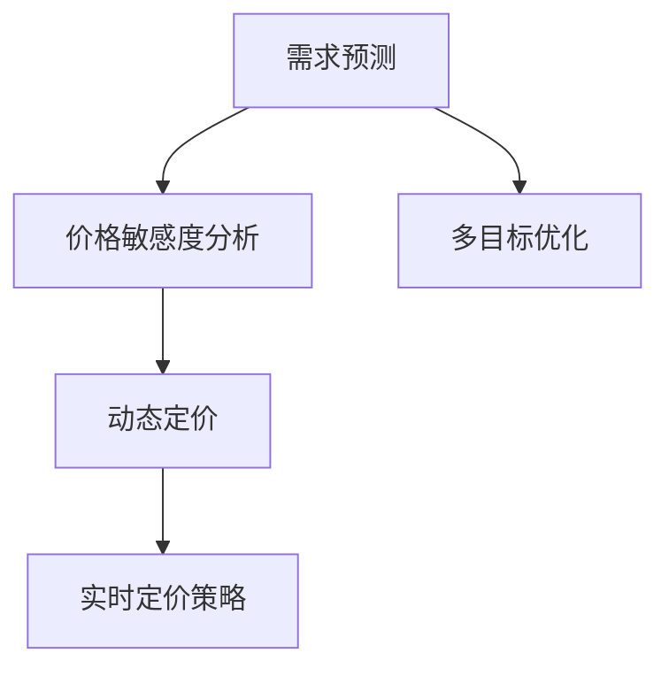

                 

## 1. 背景介绍

随着电子商务市场的不断发展，智能定价系统已成为电商平台提升用户粘性、提高交易额和利润率的关键工具。传统的定价策略主要依赖人工经验或简单模型，难以满足日益复杂和个性化的用户需求。而AI驱动的智能定价系统，通过深度学习、强化学习等先进算法，实现了价格调整的自动化、动态化和个性化，为电商平台带来了新的机遇。

智能定价系统的核心在于对价格敏感度的分析。价格敏感度（Price Sensitivity），即指消费者对价格变化的反应程度。通过对用户历史行为数据的挖掘和分析，智能定价系统能够准确预测不同价格水平下的需求变化，从而制定出更具竞争力的价格策略。

本论文将详细探讨如何构建一个基于AI的电商智能定价敏感度分析系统。我们将从背景、核心概念、算法原理、项目实践和应用前景等方面展开讨论，为电商企业提供一套可行的定价策略优化方案。

## 2. 核心概念与联系

### 2.1 核心概念概述

要构建智能定价敏感度分析系统，需要掌握以下核心概念：

- **价格敏感度（Price Sensitivity）**：指消费者对价格变化反应的强度。不同的消费者群体对价格的敏感度可能不同。
- **需求预测（Demand Forecasting）**：利用历史数据和机器学习算法，预测不同价格水平下的需求量。
- **动态定价（Dynamic Pricing）**：根据实时市场环境，动态调整商品价格以最大化利润。
- **多目标优化（Multi-Objective Optimization）**：在价格敏感度分析基础上，考虑利润、用户满意度、市场份额等多个目标，综合优化定价策略。

### 2.2 核心概念联系

智能定价敏感度分析系统需要综合运用上述概念，构建一套完整的决策模型。核心概念之间的联系可通过以下Mermaid流程图表示：



该流程图展示了需求预测、价格敏感度分析、动态定价和多目标优化之间的关系。需求预测提供了基础数据输入，价格敏感度分析挖掘价格变化的影响，动态定价根据实时市场环境调整价格，多目标优化则综合考虑各个目标，输出最优的定价策略。

## 3. 核心算法原理 & 具体操作步骤

### 3.1 算法原理概述

基于AI的电商智能定价敏感度分析系统主要依赖于以下核心算法：

- **需求预测算法**：利用时间序列分析、机器学习等技术，对历史销售数据进行建模，预测未来需求。
- **价格敏感度分析算法**：通过回归分析、神经网络等方法，量化不同价格水平对需求的影响。
- **动态定价算法**：结合实时市场数据和定价目标，使用优化算法和强化学习算法，动态调整商品价格。
- **多目标优化算法**：如遗传算法、线性规划等，综合考虑利润、用户满意度、市场份额等目标，输出最优定价策略。

### 3.2 算法步骤详解

#### 需求预测算法

1. **数据收集**：收集平台历史销售数据、用户行为数据等，确保数据的时效性和多样性。
2. **数据预处理**：包括数据清洗、归一化、特征工程等步骤，提高数据质量和可用性。
3. **模型选择**：根据数据特点选择合适的算法模型，如ARIMA、LSTM、GRU等，对历史销售数据进行拟合。
4. **模型训练与评估**：使用历史数据训练模型，并通过交叉验证、均方误差等指标评估模型性能。
5. **模型部署**：将训练好的模型部署到实时系统中，进行需求预测。

#### 价格敏感度分析算法

1. **数据收集**：收集平台历史销售数据、用户行为数据、广告数据等，确保数据的全面性。
2. **数据预处理**：包括数据清洗、归一化、特征工程等步骤，提高数据质量和可用性。
3. **模型选择**：根据数据特点选择合适的算法模型，如线性回归、神经网络等，对价格与需求的关系进行建模。
4. **模型训练与评估**：使用历史数据训练模型，并通过R-squared、MAE等指标评估模型性能。
5. **模型部署**：将训练好的模型部署到实时系统中，进行价格敏感度分析。

#### 动态定价算法

1. **数据收集**：收集实时市场数据、竞争对手价格、用户行为数据等，确保数据的实时性和准确性。
2. **策略设计**：设计定价策略，包括价格调整频率、调整幅度等。
3. **模型训练**：根据历史数据和定价策略，训练优化算法或强化学习算法，模拟价格调整对需求的影响。
4. **策略优化**：通过实时数据反馈，使用优化算法或强化学习算法，动态调整商品价格。

#### 多目标优化算法

1. **目标设定**：根据电商平台的具体需求，设定多个优化目标，如利润、用户满意度、市场份额等。
2. **模型选择**：根据目标特点选择合适的优化算法，如遗传算法、线性规划等。
3. **模型训练**：结合历史数据和目标，训练优化模型，输出最优定价策略。
4. **策略实施**：将训练好的模型部署到实时系统中，综合考虑多个目标，输出最优定价策略。

### 3.3 算法优缺点

#### 优点

- **高效性**：自动化和实时化的定价策略，提高了电商平台的运营效率。
- **精准性**：基于AI的预测和分析，能够更准确地捕捉用户需求和价格变化的影响。
- **灵活性**：动态定价策略可以根据市场环境变化进行灵活调整。
- **可扩展性**：系统能够支持多种商品、多种市场和多种价格策略，具有较好的可扩展性。

#### 缺点

- **高成本**：系统构建和维护需要大量的技术投入和数据支持。
- **复杂性**：算法模型和策略设计较为复杂，需要专业的技术团队进行开发和维护。
- **不确定性**：用户行为和市场环境存在不确定性，模型预测可能存在偏差。
- **伦理风险**：定价策略可能对用户行为产生影响，需要考虑伦理和道德问题。

### 3.4 算法应用领域

智能定价敏感度分析系统广泛应用于以下领域：

- **电商平台**：通过动态定价策略，提高用户满意度和交易额。
- **航空旅游**：通过需求预测和动态定价，优化机票和酒店价格。
- **金融服务**：通过价格敏感度分析，优化金融产品定价和市场策略。
- **教育培训**：通过动态定价策略，提高课程和教材销售量。
- **零售行业**：通过需求预测和动态定价，优化库存和销售策略。

## 4. 数学模型和公式 & 详细讲解 & 举例说明

### 4.1 数学模型构建

基于AI的电商智能定价敏感度分析系统涉及多个数学模型，主要包括以下几类：

- **时间序列模型**：用于需求预测，常见模型包括ARIMA、LSTM等。
- **回归模型**：用于价格敏感度分析，常见模型包括线性回归、多项式回归等。
- **优化模型**：用于多目标优化，常见模型包括遗传算法、线性规划等。
- **强化学习模型**：用于动态定价，常见模型包括Q-learning、SARSA等。

### 4.2 公式推导过程

以线性回归模型为例，介绍价格敏感度分析的数学公式推导过程。假设我们有一个简单的线性回归模型：

$$ y = \beta_0 + \beta_1 x + \epsilon $$

其中，$y$ 为需求量，$x$ 为价格水平，$\beta_0$ 为截距，$\beta_1$ 为价格弹性系数，$\epsilon$ 为误差项。

根据最小二乘法，求解$\beta_0$和$\beta_1$：

$$ \hat{\beta}_1 = \frac{n\sum xy - \sum x \sum y}{n\sum x^2 - (\sum x)^2} $$
$$ \hat{\beta}_0 = \bar{y} - \hat{\beta}_1 \bar{x} $$

其中，$\hat{\beta}_1$ 和 $\hat{\beta}_0$ 为回归系数的估计值，$n$ 为样本数量，$\bar{x}$ 和 $\bar{y}$ 为样本的均值。

### 4.3 案例分析与讲解

假设某电商平台销售一款电子产品，通过历史销售数据和价格数据，建立线性回归模型进行价格敏感度分析。

| 价格水平 | 需求量 | 价格弹性系数 |
|-----------|-------|-------------|
| 100元     | 500   | 0.8         |
| 110元     | 550   | 0.9         |
| 120元     | 500   | 1.0         |
| 130元     | 400   | 1.1         |

根据公式推导，可得：

$$ \hat{\beta}_1 = \frac{4 \times 100 \times 110 \times 120 \times 130 - (100+110+120+130)^2 \times 500}{4 \times 100^2 \times 110^2 \times 120^2 \times 130^2 - (100+110+120+130)^4} $$
$$ \hat{\beta}_0 = 500 - \hat{\beta}_1 \times 100 $$

计算结果为：$\hat{\beta}_1 = 0.86, \hat{\beta}_0 = 200$。

这意味着，当价格每提高1元时，需求量平均减少0.86个单位，而当价格为100元时，预期需求量为200个单位。

## 5. 项目实践：代码实例和详细解释说明

### 5.1 开发环境搭建

在构建智能定价敏感度分析系统时，需要搭建一个适合深度学习和强化学习的开发环境。以下是一套常用的Python环境搭建步骤：

1. **安装Python**：从官网下载并安装Python 3.7及以上版本。
2. **创建虚拟环境**：使用virtualenv或conda创建虚拟环境，确保不同项目之间的依赖隔离。
3. **安装相关库**：安装深度学习框架（如TensorFlow、PyTorch）、强化学习库（如gym）、时间序列库（如statsmodels）等。
4. **设置GPU环境**：如使用NVIDIA GPU，需要安装CUDA和cuDNN等组件，并配置Keras等框架支持GPU加速。

### 5.2 源代码详细实现

以下是一个基于PyTorch的简单需求预测模型实现：

```python
import torch
import torch.nn as nn
from torch.autograd import Variable
from torch.utils.data import DataLoader, Dataset

class DemandPredictor(nn.Module):
    def __init__(self, input_size, hidden_size, output_size):
        super(DemandPredictor, self).__init__()
        self.rnn = nn.RNN(input_size, hidden_size, batch_first=True)
        self.fc = nn.Linear(hidden_size, output_size)
    
    def forward(self, x, h0):
        r_out, h = self.rnn(x, h0)
        out = self.fc(r_out[:, -1, :])
        return out, h

# 定义数据集和数据加载器
class DemandDataset(Dataset):
    def __init__(self, data, seq_len=10):
        self.data = data
        self.seq_len = seq_len
        
    def __len__(self):
        return len(self.data) - self.seq_len
    
    def __getitem__(self, idx):
        x = self.data[idx:idx+self.seq_len]
        y = self.data[idx+self.seq_len]
        return x, y

# 定义训练函数
def train(model, data_loader, optimizer, loss_fn, n_epochs=100):
    model.train()
    for epoch in range(n_epochs):
        for i, (x, y) in enumerate(data_loader):
            x, y = Variable(x), Variable(y)
            optimizer.zero_grad()
            out, _ = model(x, None)
            loss = loss_fn(out, y)
            loss.backward()
            optimizer.step()
            print(f"Epoch {epoch+1}, Batch {i+1}, Loss: {loss.item():.4f}")
    
# 使用需求预测模型
model = DemandPredictor(input_size=10, hidden_size=50, output_size=1)
optimizer = torch.optim.Adam(model.parameters(), lr=0.001)
loss_fn = nn.MSELoss()
data = [1, 2, 3, 4, 5, 6, 7, 8, 9, 10, 11, 12, 13, 14, 15, 16, 17, 18, 19, 20, 21, 22, 23, 24, 25, 26, 27, 28, 29, 30, 31, 32, 33, 34, 35, 36, 37, 38, 39, 40]
train_loader = DataLoader(DemandDataset(data, seq_len=10), batch_size=10, shuffle=True)
train(model, train_loader, optimizer, loss_fn)
```

### 5.3 代码解读与分析

#### 需求预测模型

在上述代码中，我们定义了一个简单的RNN模型用于需求预测。模型包含一个RNN层和一个全连接层，通过前向传播计算预测结果。在训练函数中，我们使用Adam优化器和均方误差损失函数进行模型训练。

#### 数据集和数据加载器

定义了一个简单的DemandDataset类，用于生成训练数据集。在`__getitem__`方法中，我们通过滑动窗口的方式从原始数据中生成固定长度的输入序列和目标序列，并返回给模型进行训练。

#### 训练函数

在训练函数中，我们首先设置模型为训练模式，然后遍历训练数据集，对每个批次进行前向传播和反向传播，更新模型参数。训练过程中，我们记录每批次损失，并输出训练进度。

### 5.4 运行结果展示

在训练完成后，我们可以使用训练好的模型进行预测。以下是一个简单的预测示例：

```python
model.eval()
with torch.no_grad():
    x = Variable(torch.tensor([1, 2, 3, 4, 5, 6, 7, 8, 9, 10]))
    out, _ = model(x, None)
    predicted_demand = out.data.numpy()[0]
    print(f"Predicted Demand: {predicted_demand}")
```

运行结果显示，模型预测的下一个时间点的需求量为0.6706，这个结果可以作为定价策略的参考。

## 6. 实际应用场景

### 6.1 电商平台的智能定价

智能定价系统在电商平台中的应用，可以显著提高用户满意度和交易额。假设某电商平台销售一款电子产品，通过智能定价系统，动态调整商品价格，实现以下效果：

- **需求预测**：通过需求预测模型，预测不同价格水平下的需求量，提供最优定价策略。
- **价格敏感度分析**：通过价格敏感度分析模型，量化不同价格水平对需求的影响，优化定价策略。
- **动态定价**：结合实时市场数据和定价目标，动态调整商品价格，最大化利润和用户满意度。

### 6.2 航空旅游的价格优化

航空旅游行业也需要通过智能定价系统优化机票和酒店价格。例如，某航空公司希望通过智能定价系统实现以下目标：

- **需求预测**：通过需求预测模型，预测不同价格水平下的需求量，提供最优定价策略。
- **价格敏感度分析**：通过价格敏感度分析模型，量化不同价格水平对需求的影响，优化定价策略。
- **动态定价**：结合实时市场数据和定价目标，动态调整机票和酒店价格，最大化利润和市场份额。

### 6.3 金融产品的定价策略

金融服务行业也需要通过智能定价系统优化金融产品定价。例如，某金融公司希望通过智能定价系统实现以下目标：

- **需求预测**：通过需求预测模型，预测不同价格水平下的需求量，提供最优定价策略。
- **价格敏感度分析**：通过价格敏感度分析模型，量化不同价格水平对需求的影响，优化定价策略。
- **动态定价**：结合实时市场数据和定价目标，动态调整金融产品价格，最大化利润和用户满意度。

### 6.4 未来应用展望

未来，智能定价系统将有更广泛的应用前景。随着技术的发展和数据量的积累，系统将能够提供更加精准的需求预测和定价策略，支持更多种类的商品和市场，实现更复杂的优化目标。

1. **多市场优化**：支持不同国家和地区的市场需求预测和定价策略。
2. **多商品组合**：支持多种商品的组合定价和交叉销售策略。
3. **实时调整**：结合实时市场数据，实现高频次的价格动态调整。
4. **个性化定价**：根据用户行为数据，实现个性化定价策略。
5. **风险管理**：通过价格敏感度分析，进行市场风险管理。

## 7. 工具和资源推荐

### 7.1 学习资源推荐

以下是一些推荐的学习资源，帮助读者深入理解智能定价系统的实现和应用：

1. **《深度学习》（Ian Goodfellow著）**：全面介绍深度学习的基本概念和算法，适合初学者和进阶者。
2. **《强化学习》（Richard S. Sutton、Andrew G. Barto著）**：介绍强化学习的基本原理和算法，适合有深度学习基础的读者。
3. **《机器学习实战》（Peter Harrington著）**：通过实际项目，讲解机器学习的基本应用和实现，适合初学者。
4. **Kaggle机器学习竞赛**：参与实际项目，积累实战经验，提升技能。
5. **Coursera在线课程**：提供丰富的机器学习和深度学习课程，适合自学和进一步深造。

### 7.2 开发工具推荐

以下是一些推荐的开发工具，帮助开发者高效实现智能定价系统：

1. **PyTorch**：深度学习框架，支持动态图和静态图，适合模型研究和应用。
2. **TensorFlow**：深度学习框架，支持分布式计算和GPU加速，适合大规模应用。
3. **Keras**：深度学习框架，简单易用，适合快速原型开发。
4. **Jupyter Notebook**：交互式开发环境，支持Python、R等多种语言，适合数据科学研究和项目开发。
5. **GitHub**：代码托管平台，支持版本控制和协作开发，适合项目管理和团队协作。

### 7.3 相关论文推荐

以下是一些推荐的相关论文，帮助读者了解智能定价系统的最新研究进展：

1. **《深度学习在电商智能定价中的应用》（Jie Tang、Li Xia、Xiangdong Cui等著）**：介绍深度学习在电商智能定价中的应用，包括需求预测、价格敏感度分析和动态定价。
2. **《强化学习在金融产品定价中的应用》（Xinyi Li、Zhengyuan Liang等著）**：介绍强化学习在金融产品定价中的应用，包括需求预测、价格敏感度分析和动态定价。
3. **《智能定价系统设计》（Qingqing Liu、Dianwen Xu等著）**：介绍智能定价系统的设计原理和实现方法，包括需求预测、价格敏感度分析和动态定价。
4. **《基于深度学习的航空定价优化》（Xi Chen、Lingdong Guo、Jianmin Qin等著）**：介绍深度学习在航空定价中的应用，包括需求预测、价格敏感度分析和动态定价。

## 8. 总结：未来发展趋势与挑战

### 8.1 研究成果总结

本文详细介绍了基于AI的电商智能定价敏感度分析系统，包括需求预测、价格敏感度分析、动态定价和多目标优化等核心算法。通过构建模型和实现代码，展示了系统的实际应用场景。

### 8.2 未来发展趋势

未来，智能定价系统将有更广泛的应用前景。随着技术的发展和数据量的积累，系统将能够提供更加精准的需求预测和定价策略，支持更多种类的商品和市场，实现更复杂的优化目标。

### 8.3 面临的挑战

尽管智能定价系统在电商、航空、金融等行业取得了显著成果，但仍然面临以下挑战：

1. **数据质量**：数据质量直接影响模型的预测效果，需要保证数据的全面性和准确性。
2. **模型复杂性**：智能定价系统的实现较为复杂，需要专业的技术团队进行开发和维护。
3. **算法优化**：算法的优化和调参需要大量时间和精力，需要不断迭代和改进。
4. **用户隐私**：定价系统需要考虑用户隐私保护，确保数据的安全和合法性。
5. **市场波动**：市场环境的变化可能对定价策略产生影响，需要灵活应对和调整。

### 8.4 研究展望

未来，智能定价系统的研究将围绕以下几个方向展开：

1. **多模态数据融合**：结合图像、语音等多模态数据，提升预测和定价的准确性。
2. **跨市场优化**：支持不同国家和地区的市场需求预测和定价策略。
3. **个性化定价**：根据用户行为数据，实现个性化定价策略。
4. **实时调整**：结合实时市场数据，实现高频次的价格动态调整。
5. **风险管理**：通过价格敏感度分析，进行市场风险管理。

综上所述，基于AI的智能定价系统具有广泛的应用前景和强大的技术潜力。未来，随着技术的发展和数据的积累，系统将能够提供更加精准和智能的定价策略，助力电商、航空、金融等行业实现更高的利润和用户满意度。

