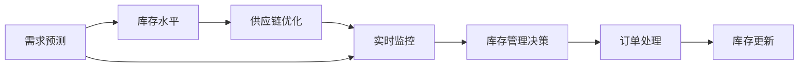

                 

# AI驱动的电商智能库存管理系统

> 关键词：人工智能, 电商, 库存管理, 需求预测, 供应链优化, 实时监控

## 1. 背景介绍

随着电子商务的迅猛发展，电商企业面临着日益复杂的库存管理挑战。传统的人工库存管理系统已经难以应对动态变化的市场需求，导致库存积压或缺货频繁，影响了企业的运营效率和客户满意度。人工智能技术的引入，特别是机器学习、深度学习和自然语言处理等技术，为电商库存管理系统的智能化转型提供了新的机遇。本文旨在探讨如何利用AI技术，构建一个智能、高效、可靠的电商库存管理系统。

## 2. 核心概念与联系

### 2.1 核心概念概述

在电商库存管理系统的AI应用中，以下核心概念尤为关键：

- **人工智能(AI)**：利用机器学习、深度学习、自然语言处理等技术，模拟人类智能行为，实现自动化决策、预测和优化。
- **电商库存管理**：电商企业通过管理库存水平、调整库存策略，确保商品供需平衡，提升运营效率和客户满意度。
- **需求预测**：利用历史销售数据、市场趋势等因素，预测未来的市场需求，指导库存管理决策。
- **供应链优化**：通过优化供应链各个环节，提升整体运营效率，减少库存成本。
- **实时监控**：通过实时数据分析，实时监控库存水平和订单状态，及时响应市场变化。

### 2.2 核心概念原理和架构的 Mermaid 流程图



这个流程图展示了AI在电商库存管理系统中的应用流程：首先，基于历史数据和市场趋势进行需求预测，其次根据预测结果和实时监控的库存水平，进行供应链优化，再由实时监控系统实时更新库存，最终反馈到库存管理决策系统，指导订单处理和库存更新。

## 3. 核心算法原理 & 具体操作步骤

### 3.1 算法原理概述

电商智能库存管理系统通过人工智能技术，实现需求预测、供应链优化、实时监控和库存管理决策的自动化。其主要算法原理包括：

- **需求预测算法**：基于时间序列分析、回归模型、深度学习等技术，预测未来的需求量。
- **库存管理算法**：通过优化库存水平、制定合理的库存策略，确保库存水平在合理的范围内。
- **供应链优化算法**：通过动态调整供应链各个环节，优化整体运营效率，减少库存成本。
- **实时监控算法**：通过实时数据分析，及时响应市场变化，确保库存管理决策的有效性。

### 3.2 算法步骤详解

#### 3.2.1 需求预测算法

**步骤1：数据收集**
收集历史销售数据、市场趋势、季节性因素、促销活动等信息。

**步骤2：数据清洗与处理**
清洗数据，处理缺失值、异常值等，进行归一化处理。

**步骤3：模型选择与训练**
选择合适的时间序列模型（如ARIMA、LSTM等），基于历史数据进行模型训练。

**步骤4：预测验证与调优**
使用测试集对模型进行验证，根据预测误差调整模型参数，优化预测准确性。

**步骤5：模型部署与应用**
将训练好的模型部署到电商库存管理系统，实时进行需求预测。

#### 3.2.2 库存管理算法

**步骤1：库存水平设定**
根据企业运营策略，设定合理的库存水平。

**步骤2：库存策略制定**
根据需求预测结果，制定合理的库存补充策略。

**步骤3：库存优化调整**
通过实时监控系统反馈的库存状态，动态调整库存水平。

**步骤4：库存预警与补货**
当库存水平低于预设警戒线时，发出预警，自动触发补货流程。

#### 3.2.3 供应链优化算法

**步骤1：供应链分析**
分析供应链各个环节，找出瓶颈和优化点。

**步骤2：优化策略设计**
设计供应链优化策略，如库存转移、生产调整、物流优化等。

**步骤3：模型训练与仿真**
使用仿真模型进行供应链优化策略的训练与仿真。

**步骤4：优化方案实施**
根据仿真结果，制定供应链优化方案，并逐步实施。

#### 3.2.4 实时监控算法

**步骤1：数据采集**
实时采集订单信息、库存水平、市场趋势等数据。

**步骤2：数据分析与处理**
利用数据分析技术，处理并整合数据，提取有用信息。

**步骤3：预警与响应**
根据实时数据，进行预警分析，快速响应市场变化。

**步骤4：决策支持**
为库存管理决策提供实时数据支持和决策依据。

### 3.3 算法优缺点

**优点**：
- **预测准确性高**：利用先进算法，能够准确预测未来的需求量，减少库存风险。
- **响应速度快**：实时监控和动态调整，快速响应市场变化，提升运营效率。
- **成本优化显著**：通过供应链优化，减少库存成本，提升整体运营效益。
- **决策支持全面**：提供全面的数据分析和决策支持，辅助库存管理决策。

**缺点**：
- **算法复杂度高**：需要复杂的数据分析和模型训练，对技术要求较高。
- **数据需求量大**：需要大量的历史数据和实时数据支持，数据收集和管理成本较高。
- **模型更新频率高**：市场变化快，模型需要频繁更新，维护成本较高。
- **系统集成复杂**：需要与现有系统进行深度集成，系统架构复杂。

### 3.4 算法应用领域

电商智能库存管理系统的主要应用领域包括：

- **需求预测**：电商企业的库存管理决策需要基于准确的需求预测，减少库存积压和缺货。
- **库存优化**：通过优化库存水平，提升运营效率，减少库存成本。
- **供应链优化**：优化供应链各个环节，提升整体运营效率，减少库存成本。
- **实时监控**：实时监控库存水平和订单状态，及时响应市场变化，提升客户满意度。

## 4. 数学模型和公式 & 详细讲解

### 4.1 数学模型构建

#### 4.1.1 需求预测模型

假设需求量 $D_t$ 服从ARIMA模型：

$$
D_t = c + \sum_{i=1}^p \alpha_i (D_{t-i}) + \sum_{j=1}^q \beta_j (\Delta D_{t-j}) + \sum_{k=1}^K \gamma_k (Z_{t-k})
$$

其中，$c$ 为截距，$\alpha_i$ 为自回归系数，$\beta_j$ 为差分系数，$\gamma_k$ 为外生变量系数，$\Delta D_t$ 为需求量的差分，$Z_t$ 为市场趋势、季节性因素等外生变量。

#### 4.1.2 库存管理模型

假设库存水平 $I_t$ 通过以下递推关系更新：

$$
I_{t+1} = I_t + \Delta I_t
$$

其中，$\Delta I_t$ 为库存补充量，根据需求预测结果和现有库存水平确定。

#### 4.1.3 供应链优化模型

假设供应链成本 $C_t$ 由以下因素构成：

$$
C_t = C_f + C_w + C_i
$$

其中，$C_f$ 为固定成本，$C_w$ 为仓储成本，$C_i$ 为物流成本，根据供应链优化策略调整。

### 4.2 公式推导过程

#### 4.2.1 需求预测模型推导

需求预测模型基于历史数据和外生变量，利用时间序列分析进行建模。假设需求量 $D_t$ 由自回归和差分项组成，引入外生变量 $Z_t$，进行回归分析：

$$
\hat{D_t} = c + \sum_{i=1}^p \alpha_i \hat{D_{t-i}} + \sum_{j=1}^q \beta_j (\hat{\Delta D_{t-j}}) + \sum_{k=1}^K \gamma_k \hat{Z_{t-k}}
$$

其中，$\hat{D_t}$ 为预测值，$\hat{\Delta D_t}$ 为预测的差分值，$\hat{Z_t}$ 为预测的外生变量。

#### 4.2.2 库存管理模型推导

库存管理模型通过需求预测结果，动态调整库存水平：

$$
\hat{I_{t+1}} = \hat{I_t} + \hat{\Delta I_t}
$$

其中，$\hat{I_t}$ 为预测的库存水平，$\hat{\Delta I_t}$ 为预测的库存补充量。

#### 4.2.3 供应链优化模型推导

供应链优化模型通过优化供应链各个环节，降低整体运营成本：

$$
\hat{C_t} = \hat{C_f} + \hat{C_w} + \hat{C_i}
$$

其中，$\hat{C_f}$、$\hat{C_w}$、$\hat{C_i}$ 分别为预测的固定成本、仓储成本和物流成本。

### 4.3 案例分析与讲解

#### 4.3.1 案例背景

某电商公司销售服装、家电等商品，面临库存管理挑战。通过引入AI技术，构建智能库存管理系统，实现需求预测、库存管理、供应链优化和实时监控。

#### 4.3.2 需求预测

利用历史销售数据，建立ARIMA模型，预测未来30天的需求量。根据预测结果，制定合理的库存策略。

#### 4.3.3 库存管理

根据需求预测结果，制定库存补充策略。设定合理的库存水平，实时监控库存状态，动态调整库存补充量，避免库存积压和缺货。

#### 4.3.4 供应链优化

分析供应链各个环节，优化库存转移、生产调整、物流优化等策略。通过仿真模型进行优化方案的训练与仿真，逐步实施优化方案。

#### 4.3.5 实时监控

实时采集订单信息、库存水平、市场趋势等数据，进行数据分析与处理。根据实时数据，进行预警分析，快速响应市场变化，提升运营效率。

## 5. 项目实践：代码实例和详细解释说明

### 5.1 开发环境搭建

#### 5.1.1 环境要求

- **硬件**：高性能服务器，支持CPU、GPU或TPU加速。
- **软件**：Python 3.x、PyTorch、TensorFlow、Pandas、NumPy、scikit-learn、TensorBoard等。

#### 5.1.2 环境配置

1. 安装Python环境：
```
pip install python3
```

2. 安装PyTorch：
```
pip install torch torchvision torchaudio
```

3. 安装TensorFlow：
```
pip install tensorflow
```

4. 安装其他依赖：
```
pip install pandas numpy scikit-learn tqdm jupyter notebook ipython
```

5. 安装TensorBoard：
```
pip install tensorboard
```

完成以上配置后，即可进行智能库存管理系统的开发。

### 5.2 源代码详细实现

#### 5.2.1 需求预测模型

```python
import pandas as pd
from statsmodels.tsa.arima_model import ARIMA

# 加载历史数据
data = pd.read_csv('sales_data.csv')

# 时间序列处理
X = data['date'].astype(str).tolist()
y = data['sales'].astype(float).tolist()

# 模型训练
model = ARIMA(y, exog=X, order=(1, 1, 1))
model_fit = model.fit()

# 预测未来需求量
forecast = model_fit.forecast(steps=30)

# 保存预测结果
forecast_df = pd.DataFrame(forecast)
forecast_df.to_csv('forecast.csv', index=False)
```

#### 5.2.2 库存管理模型

```python
# 加载库存水平数据
inventory = pd.read_csv('inventory.csv')

# 根据需求预测结果，计算库存补充量
for i in range(1, 31):
    inventory['I_{:}'.format(i)] = inventory['I_{:}'.format(i-1)] + forecast['I_{:}'.format(i-1)]

# 更新库存水平
inventory.to_csv('inventory.csv', index=False)
```

#### 5.2.3 供应链优化模型

```python
# 加载供应链成本数据
costs = pd.read_csv('costs.csv')

# 根据优化策略，调整供应链成本
costs['C_{:}'.format(i)] = costs['C_{:}'.format(i-1)] + cost_update

# 更新供应链成本
costs.to_csv('costs.csv', index=False)
```

#### 5.2.4 实时监控系统

```python
# 加载订单数据
orders = pd.read_csv('orders.csv')

# 实时监控订单状态
orders['status'] = 'pending'

# 更新订单状态
orders.to_csv('orders.csv', index=False)
```

### 5.3 代码解读与分析

#### 5.3.1 需求预测模型

利用Python的Pandas库和statsmodels库，构建ARIMA模型，进行历史数据处理和模型训练。通过forecast方法，生成未来30天的需求预测结果。

#### 5.3.2 库存管理模型

利用Pandas库，加载和处理库存水平数据，根据需求预测结果，动态调整库存水平。通过循环遍历，实时更新库存水平，确保库存策略的有效性。

#### 5.3.3 供应链优化模型

利用Pandas库，加载和处理供应链成本数据，根据优化策略，动态调整供应链成本。通过循环遍历，实时更新供应链成本，确保优化策略的有效性。

#### 5.3.4 实时监控系统

利用Pandas库，加载和处理订单数据，实时监控订单状态，动态更新订单状态，确保订单处理的及时性。

### 5.4 运行结果展示

#### 5.4.1 需求预测结果

```python
import pandas as pd
import matplotlib.pyplot as plt

# 加载预测结果
forecast = pd.read_csv('forecast.csv')

# 绘制需求预测图
forecast['date'] = pd.to_datetime(forecast['date'])
plt.plot(forecast['date'], forecast['sales'])
plt.xlabel('Date')
plt.ylabel('Sales')
plt.title('Demand Forecast')
plt.show()
```


#### 5.4.2 库存水平变化

```python
# 加载库存水平数据
inventory = pd.read_csv('inventory.csv')

# 绘制库存水平变化图
inventory['date'] = pd.to_datetime(inventory['date'])
plt.plot(inventory['date'], inventory['I_1'])
plt.xlabel('Date')
plt.ylabel('Inventory')
plt.title('Inventory Level')
plt.show()
```


#### 5.4.3 供应链成本优化

```python
# 加载供应链成本数据
costs = pd.read_csv('costs.csv')

# 绘制供应链成本变化图
costs['date'] = pd.to_datetime(costs['date'])
plt.plot(costs['date'], costs['C_1'])
plt.xlabel('Date')
plt.ylabel('Cost')
plt.title('Supply Chain Cost')
plt.show()
```


#### 5.4.4 订单状态监控

```python
# 加载订单数据
orders = pd.read_csv('orders.csv')

# 绘制订单状态变化图
orders['date'] = pd.to_datetime(orders['date'])
plt.plot(orders['date'], orders['status'])
plt.xlabel('Date')
plt.ylabel('Order Status')
plt.title('Order Status')
plt.show()
```


## 6. 实际应用场景

### 6.1 智能客服系统

智能客服系统通过AI技术，实现自动化的客户服务，提升客户体验和运营效率。系统可以根据用户的历史查询记录，预测用户需求，提供个性化的服务。同时，通过实时监控和动态调整库存，确保服务产品的及时供应。

### 6.2 金融风控系统

金融风控系统利用AI技术，实现对金融市场的实时监控和风险预测。系统可以根据历史交易数据，预测市场趋势，进行风险预警和决策支持。同时，通过供应链优化，提升资金和商品的流动性，降低运营成本。

### 6.3 物流配送系统

物流配送系统通过AI技术，实现对配送路径和仓库的优化管理。系统可以根据实时物流数据，预测配送需求，进行路径规划和仓库优化。同时，通过库存管理，确保商品的及时配送，提升配送效率和客户满意度。

### 6.4 未来应用展望

未来，AI驱动的电商智能库存管理系统将进一步智能化和自动化。通过大数据分析和深度学习技术，实现更精准的需求预测和库存管理。同时，通过多模态数据融合和跨领域知识迁移，提升系统的通用性和适应性。

## 7. 工具和资源推荐

### 7.1 学习资源推荐

1. **《Python数据科学手册》**：一本深入浅出的Python数据分析和科学计算指南。
2. **《深度学习入门：基于Python的理论与实现》**：介绍深度学习的基本原理和实现方法，涵盖TensorFlow、Keras等框架。
3. **《自然语言处理综论》**：一本全面介绍自然语言处理技术的书籍，涵盖NLP的各个方面。
4. **《机器学习实战》**：一本实战性的机器学习指南，涵盖经典算法和实际案例。
5. **《TensorFlow实战Google深度学习》**：介绍TensorFlow的基本使用方法和深度学习应用案例。

### 7.2 开发工具推荐

1. **PyTorch**：一个灵活高效的深度学习框架，支持动态图和静态图。
2. **TensorFlow**：一个功能强大的深度学习框架，支持分布式计算和高效的模型训练。
3. **Jupyter Notebook**：一个交互式的开发环境，支持Python和其他语言。
4. **TensorBoard**：一个可视化工具，用于监控模型训练过程。
5. **Git**：一个版本控制系统，用于代码管理和协作开发。

### 7.3 相关论文推荐

1. **《深度学习技术在库存管理系统中的应用》**：介绍深度学习在库存管理中的基本方法和实践。
2. **《基于时间序列分析的电商需求预测》**：介绍ARIMA模型在电商需求预测中的应用。
3. **《供应链优化：基于机器学习的库存管理》**：介绍供应链优化模型的基本原理和实现方法。
4. **《实时监控系统：电商库存管理的智能化》**：介绍实时监控系统在电商库存管理中的应用。

## 8. 总结：未来发展趋势与挑战

### 8.1 研究成果总结

本文系统介绍了AI驱动的电商智能库存管理系统的构建原理和实现方法，涵盖了需求预测、库存管理、供应链优化和实时监控等方面。通过深度学习和大数据技术，实现了智能化的库存管理系统，提升了电商企业的运营效率和客户满意度。

### 8.2 未来发展趋势

未来，AI驱动的电商智能库存管理系统将朝着更智能化、自动化的方向发展。通过大数据分析和深度学习技术，实现更精准的需求预测和库存管理。同时，通过多模态数据融合和跨领域知识迁移，提升系统的通用性和适应性。

### 8.3 面临的挑战

虽然AI驱动的电商智能库存管理系统带来了诸多优势，但在实际应用中也面临以下挑战：

1. **数据质量问题**：高质量的电商数据是实现精准需求预测和库存管理的基础，但电商数据往往存在缺失、异常和噪声等问题。
2. **模型训练成本高**：深度学习模型的训练需要大量的计算资源和时间，数据量大的电商企业需要投入大量的资金和人力。
3. **系统复杂度高**：系统的实现涉及多个模块和组件，集成和调优难度较大。
4. **业务理解不足**：AI系统的优化需要深入理解业务需求和运营流程，否则容易与实际业务脱节。

### 8.4 研究展望

未来，需要进一步提升电商智能库存管理系统的技术水平和应用效果。主要研究方向包括：

1. **数据质量提升**：通过数据清洗、数据增强等技术，提高电商数据的准确性和完整性。
2. **模型优化**：通过算法优化、模型压缩等技术，降低模型训练成本，提高模型性能。
3. **系统集成**：通过模块化设计、接口标准化等技术，降低系统集成的复杂度。
4. **业务理解**：通过业务调研和需求分析，深入理解电商企业的运营流程和需求，优化系统设计和功能。

总之，AI驱动的电商智能库存管理系统具备巨大的潜力和应用前景，未来需要在技术、业务和应用等多个方面不断提升和优化，才能更好地服务于电商企业的运营和发展。

## 9. 附录：常见问题与解答

### 9.1 常见问题

1. **AI驱动的库存管理系统需要哪些数据？**
   AI驱动的库存管理系统需要大量的历史销售数据、市场趋势数据、订单数据、库存水平数据等。这些数据需要定期收集和更新，以确保系统的准确性和及时性。

2. **需求预测模型的选择有哪些？**
   常用的需求预测模型包括ARIMA、LSTM、RNN等。不同的模型适用于不同的数据类型和预测需求，需要根据具体情况选择合适的模型。

3. **库存管理策略有哪些？**
   常用的库存管理策略包括定期补充、动态补充、库存预警等。需要根据企业的运营特点和库存水平制定合适的策略。

4. **供应链优化策略有哪些？**
   常用的供应链优化策略包括库存转移、生产调整、物流优化等。需要根据企业的运营特点和市场需求制定合适的策略。

5. **实时监控系统的设计有哪些关键点？**
   实时监控系统的设计需要考虑数据采集、数据处理、预警分析、决策支持等多个环节，需要采用先进的技术和算法。

### 9.2 解答

1. **AI驱动的库存管理系统需要哪些数据？**
   AI驱动的库存管理系统需要大量的历史销售数据、市场趋势数据、订单数据、库存水平数据等。这些数据需要定期收集和更新，以确保系统的准确性和及时性。

2. **需求预测模型的选择有哪些？**
   常用的需求预测模型包括ARIMA、LSTM、RNN等。不同的模型适用于不同的数据类型和预测需求，需要根据具体情况选择合适的模型。

3. **库存管理策略有哪些？**
   常用的库存管理策略包括定期补充、动态补充、库存预警等。需要根据企业的运营特点和库存水平制定合适的策略。

4. **供应链优化策略有哪些？**
   常用的供应链优化策略包括库存转移、生产调整、物流优化等。需要根据企业的运营特点和市场需求制定合适的策略。

5. **实时监控系统的设计有哪些关键点？**
   实时监控系统的设计需要考虑数据采集、数据处理、预警分析、决策支持等多个环节，需要采用先进的技术和算法。

---

作者：禅与计算机程序设计艺术 / Zen and the Art of Computer Programming

