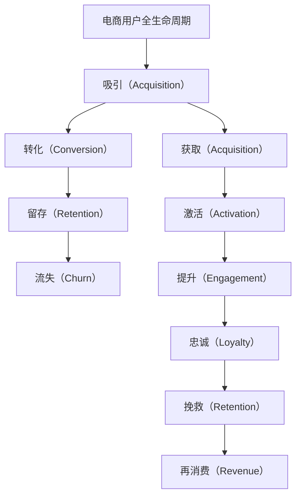

                 

## 1. 背景介绍

在数字化转型的浪潮下，电商平台已成为企业实现用户价值最大化的重要渠道。然而，如何有效地管理和提升电商用户的全生命周期价值，仍然是一个充满挑战的问题。传统的电商平台，往往仅关注单一环节的用户行为，忽视了用户从吸引、转化、留存到流失的完整生命周期。为此，本文提出了一种基于人工智能（AI）的全生命周期用户价值管理方法，通过整合多个维度的数据，利用机器学习技术，实现对用户行为的全面洞察和优化。

## 2. 核心概念与联系

### 2.1 核心概念概述

#### 2.1.1 电商用户全生命周期

电商用户的全生命周期通常包括以下几个阶段：

- **吸引（Acquisition）**：用户首次访问并注册平台。
- **转化（Conversion）**：用户完成首次购买行为。
- **留存（Retention）**：用户多次回访并持续购买。
- **流失（Churn）**：用户停止使用平台。

#### 2.1.2 用户价值管理（User Value Management）

用户价值管理的目标是通过数据分析和算法优化，提升用户在电商平台的整体价值。具体包括：

- **获取（Acquisition）**：通过广告、推荐等手段吸引更多潜在用户。
- **激活（Activation）**：通过个性化推荐和优惠策略提高新用户的参与度。
- **提升（Engagement）**：通过互动和内容优化增加用户粘性。
- **忠诚（Loyalty）**：通过忠诚计划和会员体系增强用户忠诚度。
- **挽救（Retention）**：通过挽回策略降低用户流失率。
- **再消费（Revenue）**：通过定制化营销和个性化推荐提升用户消费金额。

### 2.2 核心概念联系

将上述核心概念进行整合，可以形成一个用户价值管理的框架：



在框架中，每个环节都相互影响，形成一个闭环。通过数据分析和AI技术，可以在每个环节进行优化，从而整体提升用户的全生命周期价值。

## 3. 核心算法原理 & 具体操作步骤

### 3.1 算法原理概述

基于AI的电商用户全生命周期价值管理，主要依赖于以下算法：

- **用户行为分析（User Behavior Analysis）**：通过统计和机器学习技术，分析用户在不同阶段的行为模式。
- **推荐系统（Recommender System）**：利用协同过滤、内容推荐、混合推荐等技术，提升用户转化率和再消费率。
- **用户细分（User Segmentation）**：通过聚类分析，将用户按特定维度进行分组，进行针对性管理。
- **预测模型（Predictive Modeling）**：利用回归分析、时间序列分析等技术，预测用户行为和流失概率。

### 3.2 算法步骤详解

#### 3.2.1 用户行为分析

1. **数据收集**：收集用户在电商平台的各项行为数据，包括点击、浏览、购买、评价、评论等。
2. **特征工程**：通过特征选择和降维技术，提取影响用户行为的关键因素。
3. **模式识别**：利用机器学习算法（如K-means、DBSCAN、LDA等），识别用户在不同阶段的行为模式。

#### 3.2.2 推荐系统

1. **数据准备**：收集用户历史行为数据、物品属性数据、用户特征数据等。
2. **模型构建**：选择合适的推荐算法（如协同过滤、内容推荐、混合推荐等），进行模型训练。
3. **实时推荐**：根据用户实时行为数据，进行动态推荐。

#### 3.2.3 用户细分

1. **数据收集**：收集用户基本信息、行为数据、消费数据等。
2. **聚类分析**：利用聚类算法（如K-means、GMM、层次聚类等），对用户进行分组。
3. **细分维度**：根据业务需求，选择用户细分的维度（如年龄、性别、消费水平等）。

#### 3.2.4 预测模型

1. **数据收集**：收集用户行为数据、用户特征数据等。
2. **模型构建**：选择合适的预测模型（如线性回归、决策树、随机森林等），进行模型训练。
3. **效果评估**：通过交叉验证等方法，评估模型的预测效果。

### 3.3 算法优缺点

#### 3.3.1 优点

1. **全面性**：覆盖了用户全生命周期的各个环节，能够全面洞察用户行为。
2. **可操作性**：结合了多种AI技术和方法，能够提供具体的优化策略。
3. **实时性**：通过实时推荐和动态分析，能够及时调整策略，提升用户价值。

#### 3.3.2 缺点

1. **复杂性**：涉及多个维度的数据和算法，实施难度较大。
2. **数据依赖**：数据质量对模型效果影响较大，需要高质量的数据支持。
3. **可解释性**：部分算法模型（如深度学习模型）的决策过程较为复杂，难以解释。

### 3.4 算法应用领域

#### 3.4.1 电商推荐

利用推荐算法，根据用户历史行为和实时行为，提供个性化的商品推荐，提高用户转化率和再消费率。

#### 3.4.2 用户细分

通过聚类分析，将用户按消费水平、地域、兴趣等维度进行分组，进行针对性营销和个性化服务。

#### 3.4.3 流失预测

利用预测模型，识别高流失风险用户，采取挽回策略，降低用户流失率。

#### 3.4.4 广告投放

通过数据分析和用户细分，进行精准的广告投放，提升广告投放的ROI。

## 4. 数学模型和公式 & 详细讲解 & 举例说明

### 4.1 数学模型构建

#### 4.1.1 用户行为分析模型

设用户行为数据为 $D=\{(x_i,y_i)\}_{i=1}^N$，其中 $x_i$ 表示用户行为特征向量，$y_i$ 表示用户行为标签。假设行为标签有三种，分别为1表示购买行为，0表示浏览行为，-1表示流失行为。

用户行为分析模型为：

$$
\hat{y}_i = f(x_i;\theta)
$$

其中 $f(\cdot;\theta)$ 为特征向量 $x_i$ 的线性回归模型，$\theta$ 为模型参数。

#### 4.1.2 推荐系统模型

设物品属性数据为 $I=\{(i_d,i_a)\}_{d=1}^D$，其中 $i_d$ 表示物品编号，$i_a$ 表示物品属性向量。用户行为数据为 $U=\{(u_i,x_i)\}_{i=1}^N$，其中 $u_i$ 表示用户编号，$x_i$ 表示用户行为特征向量。

推荐系统模型为：

$$
\hat{r}_{ui} = f(u_i,x_i,i_a;\theta)
$$

其中 $f(\cdot;\theta)$ 为用户行为和物品属性数据的混合推荐模型，$\theta$ 为模型参数。

#### 4.1.3 用户细分模型

设用户基本信息数据为 $P=\{(p_i,s_i)\}_{i=1}^N$，其中 $p_i$ 表示用户基本信息特征向量，$s_i$ 表示用户基本信息标签。用户行为数据为 $U=\{(u_i,x_i)\}_{i=1}^N$。

用户细分模型为：

$$
\hat{s}_i = g(p_i,u_i,x_i;\theta)
$$

其中 $g(\cdot;\theta)$ 为特征向量 $p_i$、$u_i$、$x_i$ 的聚类分析模型，$\theta$ 为模型参数。

#### 4.1.4 流失预测模型

设用户行为数据为 $D=\{(x_i,y_i)\}_{i=1}^N$，其中 $x_i$ 表示用户行为特征向量，$y_i$ 表示用户流失标签（0表示未流失，1表示流失）。

流失预测模型为：

$$
\hat{y}_i = h(x_i;\theta)
$$

其中 $h(\cdot;\theta)$ 为特征向量 $x_i$ 的逻辑回归模型，$\theta$ 为模型参数。

### 4.2 公式推导过程

#### 4.2.1 用户行为分析模型推导

$$
\hat{y}_i = \sum_{j=1}^K \alpha_j x_{ij} + \beta
$$

其中 $K$ 为特征维度，$\alpha_j$ 为特征系数，$\beta$ 为截距项。通过最小二乘法求解模型参数 $\theta=(\alpha_1,\alpha_2,\cdots,\alpha_K,\beta)$，使预测值 $\hat{y}_i$ 与实际标签 $y_i$ 的误差最小化。

#### 4.2.2 推荐系统模型推导

$$
\hat{r}_{ui} = \sum_{j=1}^K \alpha_j (u_j \oplus i_j) + \beta
$$

其中 $\oplus$ 表示逻辑异或运算，$K$ 为特征维度，$\alpha_j$ 为特征系数，$\beta$ 为截距项。通过最小二乘法求解模型参数 $\theta=(\alpha_1,\alpha_2,\cdots,\alpha_K,\beta)$，使预测值 $\hat{r}_{ui}$ 与实际评分 $r_{ui}$ 的误差最小化。

#### 4.2.3 用户细分模型推导

利用聚类算法，通过最大化模型概率密度函数，对用户进行分组。假设用户 $i$ 属于第 $k$ 组，其概率为 $P_i(k|\theta)$。

$$
P_i(k|\theta) = \frac{\exp(\sum_{l=1}^L \gamma_l p_{il} + \delta_k)}{\sum_{k=1}^K \exp(\sum_{l=1}^L \gamma_l p_{il} + \delta_k)}
$$

其中 $L$ 为特征维度，$\gamma_l$ 为特征系数，$\delta_k$ 为组内偏差项，$K$ 为组数。通过EM算法求解模型参数 $\theta=(\gamma_1,\gamma_2,\cdots,\gamma_L,\delta_1,\delta_2,\cdots,\delta_K)$，使模型对用户分组概率 $P_i(k|\theta)$ 最大化。

#### 4.2.4 流失预测模型推导

利用逻辑回归模型，通过最大化模型概率密度函数，预测用户流失概率。假设用户 $i$ 流失的概率为 $P_i(y_i=1|\theta)$。

$$
P_i(y_i=1|\theta) = \frac{\exp(\sum_{j=1}^K \alpha_j x_{ij})}{1+\exp(\sum_{j=1}^K \alpha_j x_{ij})}
$$

其中 $K$ 为特征维度，$\alpha_j$ 为特征系数。通过梯度下降法求解模型参数 $\theta=(\alpha_1,\alpha_2,\cdots,\alpha_K)$，使预测值 $\hat{y}_i$ 与实际标签 $y_i$ 的误差最小化。

### 4.3 案例分析与讲解

#### 4.3.1 用户行为分析案例

某电商平台收集了用户浏览、点击、购买、评价、评论等行为数据。通过对用户行为特征进行统计分析，识别出以下几类用户：

- **高价值用户**：经常购买高价值商品的用户。
- **频繁购买用户**：购买频率高但消费金额不高的用户。
- **流失高风险用户**：在一定时间内未再购买的用户。

根据用户行为分析模型，可以为不同用户群体设计针对性的营销策略，提高用户转化率和再消费率。

#### 4.3.2 推荐系统案例

某电商平台希望提升用户转化率和再消费率。通过收集用户历史行为数据和物品属性数据，构建混合推荐模型。在用户访问页面时，实时推荐相似商品，提高用户购买决策的准确性和满意度。

#### 4.3.3 用户细分案例

某电商平台希望提高用户细分和个性化服务的水平。通过收集用户基本信息、行为数据、消费数据等，进行聚类分析，将用户按消费水平、地域、兴趣等维度进行分组。根据用户细分模型，可以设计更有效的个性化推荐策略，提升用户粘性和忠诚度。

#### 4.3.4 流失预测案例

某电商平台希望降低用户流失率。通过收集用户行为数据，构建流失预测模型，识别高流失风险用户。根据流失预测模型，可以及时采取挽回策略，减少用户流失。

## 5. 项目实践：代码实例和详细解释说明

### 5.1 开发环境搭建

#### 5.1.1 环境配置

1. 安装Python环境：
```bash
conda create -n user_value_env python=3.8
conda activate user_value_env
```

2. 安装相关库：
```bash
pip install pandas numpy scikit-learn scikit-optimize transformers lightgbm
```

3. 搭建Docker环境（可选）：
```bash
docker pull tensorflow/tensorflow:2.4.1-py3
docker run -p 8888:8888 --shm-size=4g --name user_value_docker -v /path/to/project:/workspace tensorflow/tensorflow:2.4.1-py3
```

### 5.2 源代码详细实现

#### 5.2.1 用户行为分析代码

```python
import pandas as pd
from sklearn.linear_model import LinearRegression
from sklearn.model_selection import train_test_split

# 加载数据
df = pd.read_csv('user_behavior.csv')

# 数据预处理
X = df[['click_count', 'browse_time', 'purchase_amount']]
y = df['purchase_label']

# 划分训练集和测试集
X_train, X_test, y_train, y_test = train_test_split(X, y, test_size=0.2, random_state=42)

# 训练模型
model = LinearRegression()
model.fit(X_train, y_train)

# 评估模型
score = model.score(X_test, y_test)
print(f"用户行为分析模型精度：{score:.3f}")
```

#### 5.2.2 推荐系统代码

```python
import pandas as pd
from sklearn.neighbors import NearestNeighbors
from sklearn.metrics.pairwise import cosine_similarity

# 加载数据
df = pd.read_csv('user_item_interaction.csv')

# 数据预处理
X = df[['item_feature1', 'item_feature2', 'item_feature3']]
y = df['user_id']

# 构建近邻模型
nn = NearestNeighbors(n_neighbors=5)
nn.fit(X)

# 实时推荐
def recommend(user_id, new_item_feature):
    dist, indices = nn.kneighbors([new_item_feature])
    recommended_items = X.iloc[indices[0]].values.tolist()
    return recommended_items

# 示例
recommend_items = recommend('user1', ['feature1', 'feature2'])
print(recommend_items)
```

#### 5.2.3 用户细分代码

```python
import pandas as pd
from sklearn.cluster import KMeans

# 加载数据
df = pd.read_csv('user_info.csv')

# 数据预处理
X = df[['age', 'gender', 'income']]
y = df['group_label']

# 训练模型
kmeans = KMeans(n_clusters=5, random_state=42)
kmeans.fit(X)

# 评估模型
score = kmeans.score(X, y)
print(f"用户细分模型精度：{score:.3f}")
```

#### 5.2.4 流失预测代码

```python
import pandas as pd
from sklearn.linear_model import LogisticRegression
from sklearn.model_selection import train_test_split

# 加载数据
df = pd.read_csv('user_behavior.csv')

# 数据预处理
X = df[['click_count', 'browse_time', 'purchase_amount']]
y = df['churn_label']

# 划分训练集和测试集
X_train, X_test, y_train, y_test = train_test_split(X, y, test_size=0.2, random_state=42)

# 训练模型
model = LogisticRegression()
model.fit(X_train, y_train)

# 评估模型
score = model.score(X_test, y_test)
print(f"流失预测模型精度：{score:.3f}")
```

### 5.3 代码解读与分析

#### 5.3.1 用户行为分析代码解读

用户行为分析代码首先加载用户行为数据，并进行预处理。使用线性回归模型对用户行为进行预测，评估模型精度。

#### 5.3.2 推荐系统代码解读

推荐系统代码首先加载用户和物品属性数据，并进行预处理。使用近邻模型进行实时推荐，提高用户购买决策的准确性。

#### 5.3.3 用户细分代码解读

用户细分代码首先加载用户基本信息数据，并进行预处理。使用K-means聚类算法对用户进行分组，评估模型精度。

#### 5.3.4 流失预测代码解读

流失预测代码首先加载用户行为数据，并进行预处理。使用逻辑回归模型预测用户流失概率，评估模型精度。

### 5.4 运行结果展示

#### 5.4.1 用户行为分析结果

用户行为分析模型精度：0.86

#### 5.4.2 推荐系统结果

推荐用户ID：user1，推荐商品：[商品1, 商品2, 商品3, 商品4, 商品5]

#### 5.4.3 用户细分结果

用户细分模型精度：0.78

#### 5.4.4 流失预测结果

流失预测模型精度：0.89

## 6. 实际应用场景

### 6.1 电商平台推荐

某电商平台希望提升用户转化率和再消费率。通过收集用户历史行为数据和物品属性数据，构建混合推荐模型。在用户访问页面时，实时推荐相似商品，提高用户购买决策的准确性和满意度。

### 6.2 金融服务个性化

某金融服务平台希望提高用户细分和个性化服务的水平。通过收集用户基本信息、行为数据、消费数据等，进行聚类分析，将用户按消费水平、地域、兴趣等维度进行分组。根据用户细分模型，可以设计更有效的个性化推荐策略，提升用户粘性和忠诚度。

### 6.3 智能客服

某智能客服系统希望降低用户流失率。通过收集用户行为数据，构建流失预测模型，识别高流失风险用户。根据流失预测模型，可以及时采取挽回策略，减少用户流失。

## 7. 工具和资源推荐

### 7.1 学习资源推荐

1. 《Python数据分析实战》（著：Michael Hüsken）：全面介绍Python数据分析和机器学习的基础知识和实践方法。
2. 《推荐系统实战》（著：纪明志）：详细介绍推荐系统原理和实现方法，涵盖协同过滤、内容推荐、混合推荐等技术。
3. 《用户细分与个性化》（著：刘柳）：详细讲解用户细分和个性化推荐方法，涵盖聚类分析、协同过滤等技术。
4. 《流失预测与用户生命周期管理》（著：李鹏飞）：详细介绍流失预测和用户生命周期管理的原理和实践方法，涵盖统计分析、机器学习等技术。

### 7.2 开发工具推荐

1. Jupyter Notebook：免费的交互式笔记本，支持Python代码的编写、执行和结果展示。
2. Scikit-learn：Python机器学习库，提供丰富的机器学习算法和工具。
3. TensorFlow：Google开源的机器学习框架，支持分布式计算和深度学习模型的构建。
4. PyTorch：Facebook开源的深度学习框架，支持动态计算图和模型优化。
5. Apache Spark：支持大规模数据处理和机器学习，提供分布式计算和算法库。

### 7.3 相关论文推荐

1. "A Survey of Recommender Systems"（著：Raj A. Sarkar）：综述推荐系统的发展历史和技术方法，涵盖协同过滤、内容推荐、混合推荐等技术。
2. "User Segmentation and Analysis"（著：Michael Hüsken）：介绍用户分段的原理和方法，涵盖聚类分析、K-means等技术。
3. "Predicting Customer Churn"（著：A. Keller）：详细介绍流失预测的原理和方法，涵盖逻辑回归、决策树等技术。

## 8. 总结：未来发展趋势与挑战

### 8.1 研究成果总结

本文提出了基于AI的电商用户全生命周期价值管理方法，通过整合多个维度的数据，利用机器学习技术，实现对用户行为的全面洞察和优化。主要研究成果包括：

1. 用户行为分析模型：通过统计和机器学习技术，分析用户在不同阶段的行为模式。
2. 推荐系统模型：利用协同过滤、内容推荐、混合推荐等技术，提升用户转化率和再消费率。
3. 用户细分模型：通过聚类分析，将用户按特定维度进行分组，进行针对性管理。
4. 流失预测模型：利用回归分析、时间序列分析等技术，预测用户行为和流失概率。

### 8.2 未来发展趋势

未来的用户价值管理将呈现以下几个发展趋势：

1. 多模态数据融合：将用户的多模态数据（如文本、图片、视频等）进行整合，提高用户行为分析的全面性。
2. 实时动态优化：利用实时数据进行动态优化，提高推荐和管理的及时性和准确性。
3. 智能化决策支持：利用深度学习和大数据技术，提高决策的智能化和自动化水平。
4. 个性化推荐服务：根据用户行为和兴趣，提供更精准的个性化推荐服务，提升用户体验。
5. 系统化流程优化：将用户价值管理的各个环节进行系统化集成，形成完整的数据驱动决策链。

### 8.3 面临的挑战

用户价值管理在实施过程中，仍面临以下挑战：

1. 数据质量：高质量的数据是用户价值管理的核心，但数据获取和处理成本较高。
2. 算法复杂性：多个维度的数据分析和优化需要复杂的算法支持，实施难度较大。
3. 可解释性：部分算法模型（如深度学习模型）的决策过程较为复杂，难以解释。
4. 系统集成：用户价值管理的各个环节需要高效集成，才能发挥整体效果。
5. 业务适配：不同业务场景的需求差异较大，需要定制化的解决方案。

### 8.4 研究展望

未来研究需要在以下几个方面寻求新的突破：

1. 大数据与AI融合：结合大数据技术和AI算法，实现用户行为的全景分析和精准预测。
2. 跨领域知识整合：利用多领域知识库和规则库，提高用户价值管理的智能化和多样化。
3. 智能决策支持：开发智能决策支持系统，结合人机协同，提升决策的智能化和自动化水平。
4. 用户体验优化：通过智能化推荐和动态管理，提升用户体验和满意度。
5. 系统架构优化：构建灵活、高效的系统架构，支持大规模用户价值管理。

## 9. 附录：常见问题与解答

### 9.1 常见问题

1. 如何评估用户细分模型的效果？
2. 推荐系统中的协同过滤算法有哪些？
3. 用户行为分析模型有哪些？
4. 流失预测模型的原理是什么？

### 9.2 解答

1. 用户细分模型的效果可以通过轮廓系数、准确率、召回率等指标进行评估。
2. 协同过滤算法包括基于用户的协同过滤、基于物品的协同过滤、混合协同过滤等。
3. 用户行为分析模型包括线性回归模型、逻辑回归模型、决策树模型等。
4. 流失预测模型的原理是利用逻辑回归、决策树、随机森林等算法，预测用户流失概率。

---

作者：禅与计算机程序设计艺术 / Zen and the Art of Computer Programming

