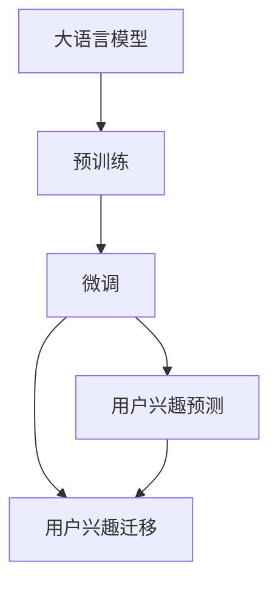

                 

# AI驱动的电商用户兴趣迁移模型

## 1. 背景介绍

在电商领域，用户兴趣的实时迁移与个性化推荐已经成为了推动转化率提升和用户留存率提高的关键因素。通过分析用户的历史行为和即时行为，可以更准确地预测用户的购买意向和兴趣，从而提供更精准的商品推荐。然而，电商平台的流量惊人，数据量庞大，传统的人工规则和基于简单的统计方法已经无法满足需求。

大语言模型和AI技术的发展，使得电商用户兴趣迁移模型得到了进一步的提升。基于大模型的预训练-微调范式，能够在大规模用户行为数据上进行高效训练，学习到用户兴趣的深层次表征，从而实现精准的用户兴趣预测和迁移。

## 2. 核心概念与联系

### 2.1 核心概念概述

为了更好地理解基于大模型的电商用户兴趣迁移模型，下面我们将介绍几个关键概念：

- **大语言模型(Large Language Model, LLM)**：指基于自回归或自编码结构的深度学习模型，在大规模无标签文本语料上进行预训练，学习到语言的知识表示。常用的模型包括BERT、GPT等。

- **预训练(Pre-training)**：指在大规模无标签文本语料上，通过自监督学习任务（如掩码语言模型、next sentence prediction等）训练通用语言模型。预训练为模型提供了丰富的语言知识。

- **微调(Fine-tuning)**：指在预训练模型的基础上，使用下游任务的标注数据进行有监督学习，优化模型在下游任务上的性能。电商用户兴趣迁移模型的微调数据通常来源于用户行为数据，如浏览记录、购买记录、评分记录等。

- **用户行为数据**：电商用户与电商平台互动过程中产生的数据，包括浏览行为、点击行为、购买行为等。这些数据用于建模用户兴趣和行为模式。

- **用户兴趣预测**：通过分析用户的历史行为和即时行为，预测用户的兴趣和购买意向。电商平台通常采用基于内容的推荐和基于协同过滤的推荐方式，以提升用户的购物体验和满意度。

- **用户兴趣迁移**：通过用户行为数据的分析，预测用户兴趣的变化趋势，从而实现个性化推荐和用户留存。用户兴趣迁移模型通常采用连续时间预测或序列预测的方式，建模用户兴趣随时间推移的动态变化。

### 2.2 核心概念原理和架构的 Mermaid 流程图



这个流程图展示了基于大模型的电商用户兴趣迁移模型的核心组件及其联系：

1. **大语言模型**：通过在大规模语料上预训练，学习到丰富的语言知识。
2. **预训练**：学习语言的通用知识表示。
3. **微调**：针对电商用户兴趣预测和迁移任务，通过标注数据进行有监督学习，优化模型性能。
4. **用户兴趣预测**：预测用户的即时兴趣和购买意向。
5. **用户兴趣迁移**：预测用户兴趣的动态变化，实现个性化推荐和用户留存。

## 3. 核心算法原理 & 具体操作步骤

### 3.1 算法原理概述

基于大模型的电商用户兴趣迁移模型通常采用预训练-微调的方法，其核心思想是：

1. **预训练**：在大规模无标签用户行为数据上，使用大语言模型进行自监督学习，学习用户兴趣的通用表征。
2. **微调**：利用标注数据，对预训练模型进行有监督学习，优化模型在电商用户兴趣预测和迁移任务上的性能。

用户兴趣迁移模型通常采用时间序列预测或序列预测的方式，学习用户兴趣随时间推移的动态变化。这一过程可以通过如下公式表示：

$$
y_t = f(x_t; \theta)
$$

其中，$y_t$ 表示用户在第 $t$ 时刻的兴趣，$x_t$ 表示用户在第 $t$ 时刻的行为数据（如浏览记录、点击记录、评分记录等），$f$ 表示模型预测函数，$\theta$ 表示模型参数。

### 3.2 算法步骤详解

#### 3.2.1 数据预处理

电商用户行为数据通常具有较高的维度，包含大量稀疏且噪声较多的特征。预处理阶段的目标是清洗和筛选出有用的特征，并对其进行归一化和编码。

- **数据清洗**：去除噪声和异常值，如空缺数据、异常评分等。
- **特征归一化**：将特征缩放到 $[0,1]$ 或 $[-1,1]$ 范围内，以提高模型的训练效率和收敛速度。
- **特征编码**：将分类特征（如商品类别、用户类别等）转化为数值型特征，以便于模型处理。

#### 3.2.2 模型训练

在预处理后的用户行为数据上，对大模型进行微调训练。微调过程通常包括以下几个步骤：

1. **模型选择**：选择适合电商用户兴趣迁移任务的预训练模型，如BERT、GPT等。
2. **数据划分**：将数据集划分为训练集、验证集和测试集。训练集用于模型训练，验证集用于模型调参，测试集用于模型评估。
3. **微调目标函数**：设计合适的损失函数，如均方误差、交叉熵等，用于衡量模型预测值和真实值之间的差异。
4. **超参数调优**：选择合适的学习率、批大小、优化器等超参数，进行网格搜索或随机搜索，寻找最优的超参数组合。
5. **模型评估**：在测试集上评估模型的性能，如均方误差、平均绝对误差等。

#### 3.2.3 模型应用

在训练完成后，将微调后的模型应用于电商平台的实时推荐系统中，实现用户兴趣的动态预测和迁移。

1. **实时预测**：对于用户即时行为数据，使用微调后的模型进行兴趣预测，输出用户即时兴趣值。
2. **兴趣迁移**：结合用户历史行为数据，使用时间序列预测或序列预测模型，预测用户未来兴趣的变化趋势。
3. **推荐生成**：根据用户即时兴趣和未来兴趣，生成个性化推荐列表，并实时推送给用户。

### 3.3 算法优缺点

#### 3.3.1 算法优点

- **高效性**：基于大模型的预训练-微调方法，能够高效地处理大规模用户行为数据，学习用户兴趣的深层次表征。
- **泛化能力**：大模型通常具备较强的泛化能力，能够适应不同的电商场景和用户行为数据。
- **实时性**：微调后的模型可以实时进行预测和推荐，提升用户的购物体验和满意度。
- **可解释性**：大模型通常具有较好的可解释性，能够提供透明的预测过程和推荐依据。

#### 3.3.2 算法缺点

- **计算成本高**：大模型的计算成本较高，需要高性能的计算资源支持。
- **数据隐私问题**：电商用户行为数据通常涉及隐私问题，需要遵循严格的隐私保护政策。
- **模型复杂度**：大模型的参数量较大，训练和推理过程较为复杂。
- **结果解释性**：尽管大模型具备较好的可解释性，但其内部决策过程仍然较难解释，可能对某些业务场景的决策产生一定的挑战。

### 3.4 算法应用领域

基于大模型的电商用户兴趣迁移模型已经在电商平台的个性化推荐、商品搜索、价格优化等多个领域得到了广泛应用。

- **个性化推荐**：通过预测用户的即时兴趣和未来兴趣，生成个性化推荐列表，提升用户满意度。
- **商品搜索**：利用用户兴趣的预测和迁移，优化商品搜索结果，提升用户购物体验。
- **价格优化**：通过分析用户对价格的敏感度，实时调整商品价格，提升销售效果。
- **库存管理**：预测商品销售趋势，优化库存管理，减少库存积压。

## 4. 数学模型和公式 & 详细讲解 & 举例说明

### 4.1 数学模型构建

电商用户兴趣迁移模型通常采用时间序列预测或序列预测的方式，学习用户兴趣随时间推移的动态变化。我们以时间序列预测模型为例，给出模型数学形式的构建。

假设用户行为数据 $x_t = (x_{t-1}, x_{t-2}, ..., x_{t-k})$，其中 $x_t$ 表示用户第 $t$ 时刻的行为数据，$k$ 表示历史行为数据的长度。用户即时兴趣 $y_t$ 可以表示为：

$$
y_t = f(x_t; \theta)
$$

其中，$f$ 表示模型预测函数，$\theta$ 表示模型参数。假设 $y_t$ 和 $x_t$ 之间存在线性关系，则可以使用如下线性回归模型进行建模：

$$
y_t = \beta_0 + \sum_{i=1}^{k} \beta_i x_{t-i} + \epsilon_t
$$

其中，$\beta_0$ 和 $\beta_i$ 表示模型参数，$\epsilon_t$ 表示随机误差。

### 4.2 公式推导过程

对上述线性回归模型进行最小二乘法参数估计，得到：

$$
\hat{\beta} = (X^TX)^{-1}X^Ty
$$

其中，$X$ 表示设计矩阵，$y$ 表示目标向量。

在实际应用中，考虑到用户兴趣的动态变化，可以使用递归神经网络(RNN)或长短期记忆网络(LSTM)等序列模型进行建模。例如，使用LSTM模型对用户兴趣进行建模：

$$
h_t = \text{LSTM}(h_{t-1}, x_t)
$$

$$
y_t = \beta_0 + \sum_{i=1}^{k} \beta_i h_{t-i} + \epsilon_t
$$

其中，$h_t$ 表示LSTM模型在时间 $t$ 的隐藏状态，$\beta_0$ 和 $\beta_i$ 表示模型参数，$\epsilon_t$ 表示随机误差。

### 4.3 案例分析与讲解

假设我们要对电商用户进行个性化推荐。首先，从电商平台收集用户的历史浏览记录 $x_t$，将商品ID和浏览时间作为输入特征。然后，使用预训练的BERT模型对用户行为数据进行微调，学习到用户兴趣的表征。接着，在微调后的模型上进行序列预测，得到用户即时兴趣 $y_t$。最后，根据即时兴趣生成个性化推荐列表，实时推送给用户。

## 5. 项目实践：代码实例和详细解释说明

### 5.1 开发环境搭建

在进行电商用户兴趣迁移模型的开发前，我们需要准备好开发环境。以下是使用Python进行PyTorch开发的环境配置流程：

1. 安装Anaconda：从官网下载并安装Anaconda，用于创建独立的Python环境。

2. 创建并激活虚拟环境：
```bash
conda create -n pytorch-env python=3.8 
conda activate pytorch-env
```

3. 安装PyTorch：根据CUDA版本，从官网获取对应的安装命令。例如：
```bash
conda install pytorch torchvision torchaudio cudatoolkit=11.1 -c pytorch -c conda-forge
```

4. 安装TensorFlow：
```bash
conda install tensorflow
```

5. 安装Transformers库：
```bash
pip install transformers
```

6. 安装各类工具包：
```bash
pip install numpy pandas scikit-learn matplotlib tqdm jupyter notebook ipython
```

完成上述步骤后，即可在`pytorch-env`环境中开始模型开发。

### 5.2 源代码详细实现

下面我们以LSTM模型为例，给出电商用户兴趣迁移模型的完整代码实现。

首先，定义数据预处理函数：

```python
import pandas as pd
import numpy as np
from sklearn.preprocessing import MinMaxScaler

def preprocess_data(data):
    # 清洗数据
    data = data.dropna()
    # 归一化特征
    features = data[['item_id', 'view_time']]
    features = MinMaxScaler().fit_transform(features)
    return features, data['label']
```

然后，定义模型训练函数：

```python
from torch.utils.data import Dataset, DataLoader
from torch import nn, optim
import torch.nn.functional as F

class CustomDataset(Dataset):
    def __init__(self, features, labels, seq_len):
        self.features = features
        self.labels = labels
        self.seq_len = seq_len
        
    def __len__(self):
        return len(self.features)
    
    def __getitem__(self, idx):
        # 将特征数据转换为tensor
        feature = self.features[idx].reshape(1, -1)
        label = self.labels[idx]
        return feature, label

def train_model(model, optimizer, train_loader, valid_loader, epochs):
    best_valid_loss = float('inf')
    for epoch in range(epochs):
        model.train()
        train_loss = 0
        for feature, label in train_loader:
            optimizer.zero_grad()
            output = model(feature)
            loss = F.mse_loss(output, label)
            loss.backward()
            optimizer.step()
            train_loss += loss.item()
        train_loss /= len(train_loader)
        
        model.eval()
        valid_loss = 0
        with torch.no_grad():
            for feature, label in valid_loader:
                output = model(feature)
                loss = F.mse_loss(output, label)
                valid_loss += loss.item()
        valid_loss /= len(valid_loader)
        
        if valid_loss < best_valid_loss:
            best_valid_loss = valid_loss
            torch.save(model.state_dict(), 'best_model.pth')
        
        print(f'Epoch {epoch+1}/{epochs}, train loss: {train_loss:.4f}, valid loss: {valid_loss:.4f}')
```

接着，定义LSTM模型：

```python
class LSTMModel(nn.Module):
    def __init__(self, input_size, hidden_size, output_size, seq_len):
        super(LSTMModel, self).__init__()
        self.hidden_size = hidden_size
        self.seq_len = seq_len
        self.lstm = nn.LSTM(input_size=input_size, hidden_size=hidden_size, num_layers=1, batch_first=True)
        self.fc = nn.Linear(hidden_size, output_size)
    
    def forward(self, x):
        # 初始化隐藏状态
        h0 = torch.zeros(1, x.size(0), self.hidden_size).to(device)
        c0 = torch.zeros(1, x.size(0), self.hidden_size).to(device)
        
        # 将特征数据转换为tensor
        x = x.to(device)
        
        # 前向传播
        output, (h_n, c_n) = self.lstm(x, (h0, c0))
        output = self.fc(output[:, -1, :])
        return output
```

最后，启动模型训练并保存模型：

```python
# 加载数据集
data = pd.read_csv('data.csv')
features, labels = preprocess_data(data)

# 划分数据集
train_features, valid_features, train_labels, valid_labels = train_test_split(features, labels, test_size=0.2, random_state=42)
train_dataset = CustomDataset(train_features, train_labels, seq_len=5)
valid_dataset = CustomDataset(valid_features, valid_labels, seq_len=5)

# 初始化模型和优化器
device = torch.device('cuda' if torch.cuda.is_available() else 'cpu')
model = LSTMModel(input_size=2, hidden_size=64, output_size=1, seq_len=5).to(device)
optimizer = optim.Adam(model.parameters(), lr=0.001)

# 训练模型
train_model(model, optimizer, train_dataset, valid_dataset, epochs=100)

# 加载最佳模型进行预测
model.load_state_dict(torch.load('best_model.pth'))
model.eval()
```

以上就是使用PyTorch进行LSTM模型训练的完整代码实现。代码涵盖了数据预处理、模型定义、训练和预测等关键步骤，可以作为一个完整的电商用户兴趣迁移模型的实现示例。

### 5.3 代码解读与分析

让我们再详细解读一下关键代码的实现细节：

**preprocess_data函数**：
- 清洗数据，去除缺失值。
- 对特征数据进行归一化处理。

**CustomDataset类**：
- 定义数据集，将特征和标签转化为tensor。
- 设置序列长度。

**LSTMModel类**：
- 定义LSTM模型，包括LSTM层和全连接层。
- 前向传播函数，初始化隐藏状态，进行LSTM层的前向传播，并输出最终结果。

**train_model函数**：
- 定义模型训练过程，包含训练集和验证集的损失计算和更新。
- 保存最佳模型。

**训练模型**：
- 加载数据集。
- 定义模型和优化器。
- 调用训练函数进行模型训练。
- 加载最佳模型进行预测。

## 6. 实际应用场景

### 6.1 智能推荐系统

基于LSTM模型的电商用户兴趣迁移模型可以应用于智能推荐系统，为用户提供个性化推荐。通过分析用户的历史行为数据，预测用户的即时兴趣和未来兴趣，生成个性化的推荐列表，提升用户的购物体验和满意度。

### 6.2 搜索排序优化

通过电商用户兴趣迁移模型，可以优化商品搜索和排序结果。模型可以预测用户对不同商品的兴趣，并根据预测结果调整搜索结果的排序，提升用户的搜索体验。

### 6.3 价格优化

电商平台的商品价格优化，也可以利用用户兴趣迁移模型。模型可以预测用户对价格的敏感度，根据预测结果实时调整商品价格，提升销售效果。

### 6.4 库存管理

通过用户兴趣迁移模型，可以预测商品销售趋势，优化库存管理，减少库存积压，提高库存周转率。

## 7. 工具和资源推荐

### 7.1 学习资源推荐

为了帮助开发者系统掌握电商用户兴趣迁移模型的理论基础和实践技巧，这里推荐一些优质的学习资源：

1. 《Deep Learning with Python》书籍：详细介绍了深度学习模型的基础和应用，包括LSTM等序列模型的构建和应用。
2. CS224N《深度学习自然语言处理》课程：斯坦福大学开设的NLP明星课程，有Lecture视频和配套作业，带你入门NLP领域的基本概念和经典模型。
3. PyTorch官方文档：提供了丰富的深度学习模型和算法的详细说明和代码示例，是快速上手深度学习开发的必备资源。
4. HuggingFace官方文档：提供了众多预训练语言模型和微调范式的详细介绍和代码示例，是构建电商用户兴趣迁移模型的重要参考。

通过对这些资源的学习实践，相信你一定能够快速掌握电商用户兴趣迁移模型的精髓，并用于解决实际的电商推荐问题。

### 7.2 开发工具推荐

高效的开发离不开优秀的工具支持。以下是几款用于电商用户兴趣迁移模型开发的常用工具：

1. PyTorch：基于Python的开源深度学习框架，灵活动态的计算图，适合快速迭代研究。大多数预训练语言模型都有PyTorch版本的实现。
2. TensorFlow：由Google主导开发的开源深度学习框架，生产部署方便，适合大规模工程应用。同样有丰富的预训练语言模型资源。
3. Weights & Biases：模型训练的实验跟踪工具，可以记录和可视化模型训练过程中的各项指标，方便对比和调优。与主流深度学习框架无缝集成。
4. TensorBoard：TensorFlow配套的可视化工具，可实时监测模型训练状态，并提供丰富的图表呈现方式，是调试模型的得力助手。
5. Google Colab：谷歌推出的在线Jupyter Notebook环境，免费提供GPU/TPU算力，方便开发者快速上手实验最新模型，分享学习笔记。

合理利用这些工具，可以显著提升电商用户兴趣迁移模型的开发效率，加快创新迭代的步伐。

### 7.3 相关论文推荐

电商用户兴趣迁移模型的发展源于学界的持续研究。以下是几篇奠基性的相关论文，推荐阅读：

1. Recurrent Neural Network Based Recommender System: An Overview（RNN推荐系统综述）：详细介绍了基于RNN的推荐系统的理论和实践。
2. Learning Deep Architectures for AI（深度学习综述）：深度学习领域的奠基性论文，介绍了深度学习的基本概念和经典模型。
3. Sequence to Sequence Learning with Neural Networks（序列到序列学习）：介绍了一种基于神经网络的序列到序列模型，可以用于电商用户兴趣迁移模型的构建。
4. Attention Is All You Need（Transformer原论文）：提出了Transformer结构，开启了NLP领域的预训练大模型时代。
5. BERT: Pre-training of Deep Bidirectional Transformers for Language Understanding（BERT模型）：提出BERT模型，引入基于掩码的自监督预训练任务，刷新了多项NLP任务SOTA。

这些论文代表了大模型微调技术的发展脉络。通过学习这些前沿成果，可以帮助研究者把握学科前进方向，激发更多的创新灵感。

## 8. 总结：未来发展趋势与挑战

### 8.1 总结

本文对基于大模型的电商用户兴趣迁移模型进行了全面系统的介绍。首先阐述了电商用户兴趣迁移模型的研究背景和意义，明确了模型在个性化推荐、搜索排序优化、价格优化、库存管理等多个电商场景中的应用价值。其次，从原理到实践，详细讲解了电商用户兴趣迁移模型的数学模型构建、算法步骤、模型训练和应用等关键环节，给出了电商用户兴趣迁移模型的完整代码实现。同时，本文还探讨了电商用户兴趣迁移模型在智能推荐系统、搜索排序优化、价格优化、库存管理等电商场景中的广泛应用前景，展示了模型强大的性能和普适性。最后，本文精选了电商用户兴趣迁移模型的学习资源和开发工具，力求为读者提供全方位的技术指引。

通过本文的系统梳理，可以看到，基于大模型的电商用户兴趣迁移模型在电商推荐领域具有广阔的应用前景，能够显著提升电商平台的个性化推荐能力，提升用户体验和满意度，推动电商行业的发展和创新。

### 8.2 未来发展趋势

展望未来，电商用户兴趣迁移模型将呈现以下几个发展趋势：

1. **模型复杂度提升**：随着深度学习技术的不断发展，电商用户兴趣迁移模型将向更加复杂的结构发展，如使用Transformer等先进模型，提升模型的表达能力和泛化能力。
2. **实时性提升**：电商用户兴趣迁移模型需要实时进行预测和推荐，因此需要进一步优化模型推理速度，提升实时性。
3. **多模态融合**：电商用户兴趣迁移模型可以融合视觉、语音、文本等多模态数据，提升模型的理解能力和推荐效果。
4. **个性化推荐**：电商用户兴趣迁移模型将更加注重个性化推荐，通过深度学习技术，精准匹配用户需求，提升用户体验。
5. **动态调整**：电商用户兴趣迁移模型需要根据用户行为和市场变化，动态调整推荐策略，提高模型的适应性和鲁棒性。

### 8.3 面临的挑战

尽管电商用户兴趣迁移模型已经取得了不错的成绩，但在应用过程中仍然面临诸多挑战：

1. **数据隐私问题**：电商用户行为数据涉及用户的隐私信息，需要遵循严格的隐私保护政策。
2. **模型复杂度**：电商用户兴趣迁移模型通常较为复杂，需要高性能的计算资源支持。
3. **实时性问题**：电商用户兴趣迁移模型需要实时进行预测和推荐，对模型的推理速度和内存占用提出了较高的要求。
4. **结果解释性**：电商用户兴趣迁移模型的内部决策过程较为复杂，难以解释，可能对某些业务场景的决策产生一定的挑战。

### 8.4 研究展望

面对电商用户兴趣迁移模型所面临的挑战，未来的研究需要在以下几个方面寻求新的突破：

1. **数据隐私保护**：开发更加安全和高效的数据处理方法，保护用户隐私，同时提高数据利用率。
2. **模型压缩与优化**：优化电商用户兴趣迁移模型的结构，提高模型的推理速度和内存占用效率。
3. **模型解释性增强**：开发可解释性较强的电商用户兴趣迁移模型，提升模型的透明性和可信度。
4. **多模态融合**：将视觉、语音、文本等多模态数据融合到电商用户兴趣迁移模型中，提升模型的综合理解能力和推荐效果。
5. **个性化推荐优化**：开发更加精准和个性化的电商用户兴趣迁移模型，提高用户满意度和留存率。
6. **动态调整优化**：开发能够动态调整电商用户兴趣迁移模型的推荐策略，提高模型的适应性和鲁棒性。

总之，未来的研究需要在电商用户兴趣迁移模型的复杂度、实时性、解释性、多模态融合、个性化推荐和动态调整等方面进行深入探索和优化，以适应电商行业的发展需求。

## 9. 附录：常见问题与解答

**Q1: 电商用户兴趣迁移模型如何应对数据不均衡问题？**

A: 电商用户行为数据通常具有显著的不均衡性，某些商品的浏览和购买次数远高于其他商品。为了应对这一问题，可以在模型训练过程中采用一些数据增强和加权技术，如数据重采样、加权损失函数等，来平衡不同商品的权重，提升模型的泛化能力。

**Q2: 电商用户兴趣迁移模型如何处理冷启动用户？**

A: 冷启动用户通常没有足够的行为数据，无法进行有效的兴趣预测。为了解决这一问题，可以采用基于用户画像或用户行为模板的推荐策略，对冷启动用户进行初始化推荐。同时，可以在模型训练过程中引入一些先验知识，如商品标签、用户标签等，帮助模型更好地理解新用户的兴趣。

**Q3: 电商用户兴趣迁移模型如何提升个性化推荐效果？**

A: 电商用户兴趣迁移模型可以通过不断优化模型结构、超参数调优和特征工程等方法，提升个性化推荐效果。同时，可以引入一些先进的技术，如深度学习、增强学习等，进一步提高推荐的精度和多样性。

**Q4: 电商用户兴趣迁移模型如何应对用户兴趣的变化？**

A: 电商用户兴趣迁移模型可以通过不断收集用户最新的行为数据，实时更新模型的参数，实现用户兴趣的动态预测和迁移。同时，可以引入一些时间序列预测和序列预测的方法，建模用户兴趣随时间推移的动态变化。

**Q5: 电商用户兴趣迁移模型如何应对用户的恶意行为？**

A: 电商用户兴趣迁移模型需要引入一些安全机制，如用户行为异常检测、恶意行为过滤等，防止恶意行为对推荐结果的影响。同时，可以引入一些伦理导向的评估指标，过滤和惩罚有偏见、有害的输出倾向。

**Q6: 电商用户兴趣迁移模型如何应对不同的用户群体？**

A: 电商用户兴趣迁移模型需要根据不同的用户群体，进行个性化的模型训练和推荐策略。可以通过对用户群体进行分类，针对不同群体设计不同的特征工程和模型结构，提高推荐的针对性和有效性。

**Q7: 电商用户兴趣迁移模型如何应对不同的电商场景？**

A: 电商用户兴趣迁移模型需要根据不同的电商场景，进行相应的模型训练和优化。如在跨境电商、二手电商等场景中，需要考虑货币汇率、物流成本等因素，进行相应的模型调整和优化。

总之，电商用户兴趣迁移模型在实际应用中需要根据具体的业务场景和数据特点，进行全面的模型优化和策略调整，以实现最佳的推荐效果。

---

作者：禅与计算机程序设计艺术 / Zen and the Art of Computer Programming

