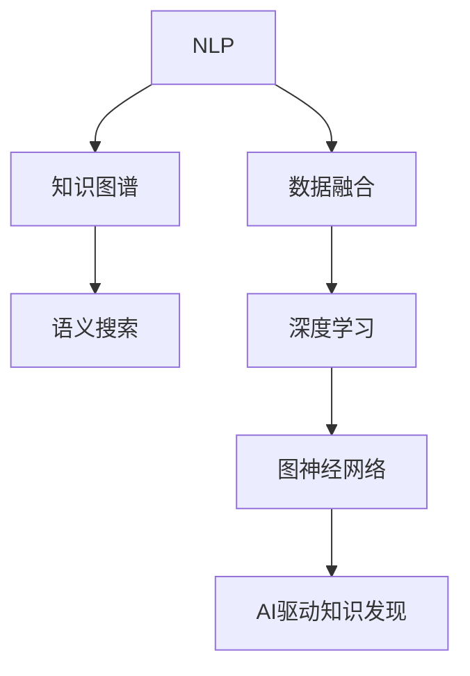

                 

# AI驱动的知识发现：超越简单搜索

## 1. 背景介绍

### 1.1 问题由来
随着互联网和大数据技术的发展，信息获取和知识检索已经变得越来越便捷。人们可以通过搜索引擎、知识图谱、社交媒体等多种途径快速找到所需的答案。然而，尽管技术进步带来了海量的信息，但知识的发现却并不仅限于简单的搜索与检索。

在现代社会，用户面临的查询往往更加复杂，可能涉及多领域、多场景、多模式的信息。例如，一个产品经理需要了解市场上的最新市场趋势、竞争对手的策略、用户需求等复杂信息；一个医生需要综合各类医学文献、专家意见、患者反馈等多源信息，制定个性化的治疗方案；一个研究人员需要跨越学科界限，整合不同领域的知识，推动创新。

### 1.2 问题核心关键点
针对上述复杂查询场景，传统的搜索和检索方法显得捉襟见肘。他们仅限于关键词匹配和简单的逻辑关系查询，难以应对更加灵活、深入的知识需求。

为了应对这一挑战，AI驱动的知识发现技术应运而生。它借助自然语言处理(NLP)、机器学习(ML)、数据挖掘、图神经网络(GNN)等技术，能够从海量数据中自动抽取、推理、融合知识，生成有价值的洞察和结论。通过与用户交互，AI驱动的知识发现能够理解用户真实意图，主动提供更精准、更全面的知识解答。

### 1.3 问题研究意义
研究AI驱动的知识发现技术，对于推动人类社会的知识进步、提升决策水平、加速创新进程，具有重要意义：

1. **提升决策质量**：通过综合多源数据，提供更全面、更客观的知识支持，帮助决策者更好地理解问题，制定合理策略。
2. **加速创新过程**：融合不同领域的知识，打破学科壁垒，促进交叉领域的研究和创新。
3. **优化资源配置**：基于数据的深入分析，优化资源分配，提升组织效率和效益。
4. **提高用户满意度**：理解用户真实需求，提供个性化、差异化的知识服务，提升用户体验。
5. **推动教育普及**：通过智能化的知识推荐，帮助学生获得个性化、互动式学习体验，提升学习效果。

## 2. 核心概念与联系

### 2.1 核心概念概述

为了更好地理解AI驱动的知识发现技术，本节将介绍几个关键概念：

- **自然语言处理(NLP)**：利用计算机技术处理和理解人类语言，包括文本预处理、词向量嵌入、语义理解、生成等环节。
- **知识图谱(Knowledge Graph)**：将实体、属性、关系等知识元素表示为图结构，便于机器理解和推理。
- **语义搜索(Semantic Search)**：通过理解查询中的语义关系，从知识图谱中匹配更相关的信息。
- **数据融合(Data Fusion)**：将来自不同数据源的信息整合，构建更全面、更准确的综合视图。
- **深度学习(Deep Learning)**：通过多层神经网络进行特征提取和模式识别，提升模型的复杂度和表达能力。
- **图神经网络(GNN)**：专门设计用于处理图结构数据的神经网络模型，能够进行节点和边信息的聚合与推理。

这些核心概念共同构成了AI驱动的知识发现技术体系，使其能够在复杂多变的信息环境下，自动发现、推理、融合知识，提供高质量的知识服务。

### 2.2 核心概念联系

这些概念之间的逻辑关系可以通过以下Mermaid流程图来展示：



该流程图展示了核心概念之间的联系：

1. NLP用于理解查询和数据，为知识图谱构建和语义搜索提供基础。
2. 知识图谱作为知识表示和推理的载体，与语义搜索紧密结合，提高信息检索的准确性。
3. 数据融合从多个数据源提取知识，丰富和深化知识图谱内容。
4. 深度学习通过复杂模型对数据进行高质量特征提取和模式识别。
5. GNN在图结构上进行操作，强化对复杂关系的处理和推理。
6. 最终，这些技术融合到AI驱动的知识发现系统中，为用户提供精准的知识服务。

## 3. 核心算法原理 & 具体操作步骤
### 3.1 算法原理概述

AI驱动的知识发现技术基于机器学习和深度学习的方法，旨在从大规模数据中自动抽取、推理、融合知识，生成有价值的洞察和结论。其核心思想是通过以下步骤实现：

1. **数据预处理**：收集和清洗数据，构建知识图谱。
2. **特征抽取**：利用NLP和深度学习模型提取文本、图像、视频等多种模态的数据特征。
3. **语义理解**：通过语义搜索和深度学习模型理解用户查询中的语义关系。
4. **知识推理**：利用知识图谱和图神经网络模型进行知识关系的推理。
5. **结果融合**：对多源信息进行数据融合，生成综合视图。
6. **知识呈现**：将推理结果转化为易于理解和使用的知识表示形式，如报表、图表、摘要等。

### 3.2 算法步骤详解

以AI驱动的知识发现技术在医疗领域的应用为例，以下是具体步骤：

**Step 1: 数据收集与清洗**
- 收集医院、医学文献、患者反馈等多源数据。
- 清洗数据，去除噪声和冗余信息，构建高质量的数据集。

**Step 2: 知识图谱构建**
- 将收集到的数据进行实体、属性、关系抽取，构建知识图谱。
- 利用图神经网络对知识图谱进行嵌入，生成高维向量表示。

**Step 3: 语义理解**
- 使用NLP模型解析用户查询，抽取关键词和关系。
- 在知识图谱中进行语义匹配，找到相关的实体和关系。

**Step 4: 知识推理**
- 利用图神经网络对知识图谱进行关系推理，生成更广泛的知识。
- 通过多轮推理，不断更新和扩展知识图谱。

**Step 5: 数据融合**
- 将不同数据源的信息进行整合，构建综合视图。
- 使用深度学习模型对融合后的数据进行再处理，提取关键信息。

**Step 6: 结果呈现**
- 将推理结果转化为易于理解的图表和报表。
- 提供多模态知识呈现形式，如可视化界面、交互式报表等。

### 3.3 算法优缺点

AI驱动的知识发现技术具有以下优点：

1. **全面性**：能够从多个数据源中提取信息，构建更全面、更深入的知识体系。
2. **智能性**：通过深度学习和图神经网络，能够自动进行复杂的知识推理和关系分析。
3. **适应性强**：能够根据不同领域的知识特性，自适应地调整模型参数和推理策略。
4. **用户友好**：通过自然语言处理，能够理解和处理用户查询，提供个性化知识服务。

同时，该技术也存在一些局限性：

1. **数据依赖**：需要大量高质量的数据支持，数据收集和清洗成本较高。
2. **模型复杂**：算法模型复杂度高，对计算资源要求较高。
3. **结果解释性差**：自动生成的知识可能缺乏可解释性，难以理解其推理过程。
4. **隐私安全**：涉及个人隐私数据，需要严格的隐私保护措施。

尽管存在这些局限性，但AI驱动的知识发现技术在特定领域仍具有显著的优势，为复杂知识需求提供了有力支撑。

### 3.4 算法应用领域

AI驱动的知识发现技术已经在多个领域得到广泛应用，例如：

- **医疗健康**：基于知识图谱和深度学习模型，辅助医生进行疾病诊断、治疗方案制定、患者风险评估等。
- **金融行业**：利用深度学习和图神经网络，进行市场分析、风险评估、投资决策等。
- **制造业**：通过数据分析和知识推理，优化生产流程、质量控制、供应链管理等。
- **教育领域**：根据学生的学习行为和反馈，推荐个性化学习内容和资源。
- **法律咨询**：通过案例分析，提供法律建议和风险评估。

除了这些领域外，AI驱动的知识发现技术还被应用到更多场景中，如环境保护、城市规划、市场营销等，为不同领域提供了创新性解决方案。

## 4. 数学模型和公式 & 详细讲解 & 举例说明

### 4.1 数学模型构建

本节将使用数学语言对AI驱动的知识发现技术进行更加严格的刻画。

记知识图谱为 $G=(V,E)$，其中 $V$ 为节点集合，表示实体；$E$ 为边集合，表示实体之间的关系。记节点向量为 $\mathbf{x}_v$，边向量为 $\mathbf{x}_e$。

定义知识图谱嵌入函数为 $f: V \rightarrow \mathbb{R}^d$，其中 $d$ 为嵌入向量的维度。节点嵌入和边嵌入分别表示为 $\mathbf{x}_v=f(v)$ 和 $\mathbf{x}_e=f(e)$。

### 4.2 公式推导过程

以知识图谱嵌入为例，其推导过程如下：

假设知识图谱包含 $n$ 个节点，每个节点的嵌入向量为 $\mathbf{x}_v \in \mathbb{R}^d$。节点嵌入函数 $f(v)$ 可以表示为：

$$
\mathbf{x}_v = \mathbf{W}_v \mathbf{h}(v)
$$

其中 $\mathbf{W}_v$ 为可训练的权重矩阵，$\mathbf{h}(v)$ 为节点的特征向量表示。

对于边 $e$，可以定义边嵌入函数 $f(e)$：

$$
\mathbf{x}_e = \mathbf{W}_e \mathbf{h}(e)
$$

其中 $\mathbf{W}_e$ 为可训练的权重矩阵，$\mathbf{h}(e)$ 为边的特征向量表示。

### 4.3 案例分析与讲解

以医疗领域为例，通过上述知识图谱嵌入技术，可以构建疾病和治疗之间的知识关系，辅助医生进行个性化治疗方案的制定。

首先，将疾病和治疗方法作为知识图谱的节点，将它们之间的关系作为边。然后，对每个节点和边进行特征提取和表示，构建完整的知识图谱。接着，利用图神经网络对知识图谱进行嵌入，生成高维向量表示。最后，将嵌入向量作为输入，利用深度学习模型进行推理和预测，生成个性化的治疗方案。

## 5. 项目实践：代码实例和详细解释说明
### 5.1 开发环境搭建

在进行项目实践前，我们需要准备好开发环境。以下是使用Python进行PyTorch开发的环境配置流程：

1. 安装Anaconda：从官网下载并安装Anaconda，用于创建独立的Python环境。

2. 创建并激活虚拟环境：
```bash
conda create -n pytorch-env python=3.8 
conda activate pytorch-env
```

3. 安装PyTorch：根据CUDA版本，从官网获取对应的安装命令。例如：
```bash
conda install pytorch torchvision torchaudio cudatoolkit=11.1 -c pytorch -c conda-forge
```

4. 安装其他必要库：
```bash
pip install networkx scikit-learn py2vec gensim
```

完成上述步骤后，即可在`pytorch-env`环境中开始项目实践。

### 5.2 源代码详细实现

下面以医疗领域的应用为例，给出使用PyTorch进行知识图谱嵌入和推理的代码实现。

```python
import torch
import torch.nn as nn
import torch.nn.functional as F
import networkx as nx
import numpy as np

class GraphConvLayer(nn.Module):
    def __init__(self, in_feats, out_feats):
        super(GraphConvLayer, self).__init__()
        self.weight = nn.Parameter(torch.FloatTensor(in_feats, out_feats))
        
    def forward(self, adj_matrix, feat):
        support = feat.mm(self.weight)
        return (1 + adj_matrix) * support

class GraphNet(nn.Module):
    def __init__(self, in_feats, hidden_feats, out_feats):
        super(GraphNet, self).__init__()
        self.conv1 = GraphConvLayer(in_feats, hidden_feats)
        self.conv2 = GraphConvLayer(hidden_feats, out_feats)
        
    def forward(self, adj_matrix, feat):
        h = F.relu(self.conv1(adj_matrix, feat))
        return self.conv2(adj_matrix, h)

def graph_embedding(G, num_epochs=100, learning_rate=0.01, hidden_feats=16):
    in_feats = G.number_of_nodes()
    out_feats = in_feats
    
    # 随机初始化节点特征向量
    feat = torch.randn(in_feats, out_feats)
    
    # 定义神经网络模型
    model = GraphNet(in_feats, hidden_feats, out_feats)
    
    # 定义优化器
    optimizer = torch.optim.Adam(model.parameters(), lr=learning_rate)
    
    # 进行训练
    for epoch in range(num_epochs):
        # 构建邻接矩阵
        adj_matrix = nx.adjacency_matrix(G)
        
        # 前向传播
        h = model(adj_matrix, feat)
        
        # 计算损失
        loss = F.mse_loss(h, feat)
        
        # 反向传播和优化
        optimizer.zero_grad()
        loss.backward()
        optimizer.step()
        
        print(f"Epoch {epoch+1}, loss: {loss.item()}")
    
    return h
```

在上述代码中，我们定义了两个类：`GraphConvLayer`和`GraphNet`，分别用于定义图卷积层和神经网络模型。`graph_embedding`函数用于训练知识图谱嵌入模型，输出节点的高维向量表示。

### 5.3 代码解读与分析

让我们再详细解读一下关键代码的实现细节：

**GraphConvLayer类**：
- `__init__`方法：定义权重矩阵，用于控制层之间的信息传播。
- `forward`方法：实现图卷积运算，计算支持向量。

**GraphNet类**：
- `__init__`方法：定义图神经网络模型结构，包含两个图卷积层。
- `forward`方法：实现前向传播，计算节点嵌入向量。

**graph_embedding函数**：
- 初始化节点特征向量，随机初始化为向量表示。
- 定义神经网络模型，并设置优化器。
- 在每个epoch内，进行邻接矩阵构建、前向传播、计算损失、反向传播和优化。
- 输出最终的节点嵌入向量表示。

以上代码实现了基于图神经网络的知识图谱嵌入过程。可以看到，通过图卷积层的设计，模型可以自动学习节点之间的关系特征，生成高维的节点嵌入向量。

## 6. 实际应用场景
### 6.1 智能医疗

在智能医疗领域，AI驱动的知识发现技术可以显著提升诊疗效率和质量。通过构建全面的医疗知识图谱，医生能够快速获取患者病史、症状、治疗方案等信息，辅助制定个性化治疗方案。例如，基于知识图谱的疾病推荐系统，可以推荐最合适的治疗方案，减少误诊误治；基于知识图谱的病情预警系统，可以提前发现病情变化，及时干预，降低医疗风险。

### 6.2 金融风控

在金融行业，AI驱动的知识发现技术可以用于风险评估和管理。通过构建风险知识图谱，银行和保险公司能够更全面地评估客户的信用状况和风险等级，提高贷款和保险审批的准确性和效率。例如，基于知识图谱的信用评分系统，可以综合考虑客户的财务状况、历史交易记录、社交网络等多源信息，生成更精准的信用评分；基于知识图谱的风险预警系统，可以及时发现风险信号，避免重大损失。

### 6.3 智能制造

在智能制造领域，AI驱动的知识发现技术可以优化生产流程和供应链管理。通过构建制造知识图谱，企业能够自动化地分析生产数据、设备状态、物料需求等信息，生成生产计划和调度方案。例如，基于知识图谱的生产优化系统，可以自动调整生产流程，提高生产效率和质量；基于知识图谱的供应链管理，可以优化库存和物流配置，降低成本和浪费。

### 6.4 未来应用展望

随着AI驱动的知识发现技术的不断发展，未来在更多领域将有广泛应用：

- **智慧城市**：通过构建智慧城市知识图谱，城市管理部门能够更好地理解城市运行状态，优化资源配置，提高城市治理效率。
- **环境保护**：构建环境知识图谱，通过数据分析和推理，制定更科学的环境保护策略，提高环境监测和治理效果。
- **教育培训**：构建教育知识图谱，提供个性化的学习推荐和课程推荐，提升学习效果和教育质量。
- **市场营销**：通过构建市场知识图谱，企业能够更全面地理解市场趋势和用户需求，优化产品设计和营销策略，提高市场竞争力。

## 7. 工具和资源推荐
### 7.1 学习资源推荐

为了帮助开发者系统掌握AI驱动的知识发现技术，这里推荐一些优质的学习资源：

1. 《深度学习与数据挖掘》书籍：介绍深度学习在数据挖掘和知识发现中的应用，涵盖NLP、知识图谱等多个前沿话题。
2. 《Python图网络》书籍：全面介绍图神经网络及其应用，适合初学者入门。
3. CS224W《深度学习在自然语言处理中的应用》课程：斯坦福大学开设的深度学习在NLP中的应用课程，包含大量案例和实践任务。
4. Kaggle竞赛：参加Kaggle的NLP和知识图谱相关的竞赛，锻炼实战能力，积累项目经验。
5. ArXiv论文：定期关注顶会如NeurIPS、ICML、ACL上发布的最新论文，了解最新的研究进展。

通过对这些资源的学习实践，相信你一定能够快速掌握AI驱动的知识发现技术的精髓，并用于解决实际的NLP问题。

### 7.2 开发工具推荐

高效的开发离不开优秀的工具支持。以下是几款用于AI驱动的知识发现开发的常用工具：

1. PyTorch：基于Python的开源深度学习框架，灵活动态的计算图，适合快速迭代研究。
2. TensorFlow：由Google主导开发的开源深度学习框架，生产部署方便，适合大规模工程应用。
3. NetworkX：用于构建和操作网络数据结构，方便处理知识图谱。
4. Py2Vec：基于Word2Vec的扩展，用于构建知识图谱的向量表示。
5. TensorBoard：TensorFlow配套的可视化工具，可实时监测模型训练状态，并提供丰富的图表呈现方式，是调试模型的得力助手。
6. Weights & Biases：模型训练的实验跟踪工具，可以记录和可视化模型训练过程中的各项指标，方便对比和调优。

合理利用这些工具，可以显著提升AI驱动的知识发现任务的开发效率，加快创新迭代的步伐。

### 7.3 相关论文推荐

AI驱动的知识发现技术的发展源于学界的持续研究。以下是几篇奠基性的相关论文，推荐阅读：

1. Attention is All You Need：提出Transformer结构，开启了NLP领域的预训练大模型时代。
2. Knowledge Graph Embeddings by Masked Transformation for Semantic Search：提出TransE模型，用于知识图谱嵌入。
3. Knowledge-aware Data Fusion for Heterogeneous Information Networks：提出基于图神经网络的数据融合方法。
4. Deep Collaborative Filtering for Recommendation：提出深度学习模型用于推荐系统，提升推荐精度。
5. Graph Neural Networks for Recommendation Systems：提出图神经网络用于推荐系统，能够处理多源异构数据。

这些论文代表了大语言模型微调技术的发展脉络。通过学习这些前沿成果，可以帮助研究者把握学科前进方向，激发更多的创新灵感。

## 8. 总结：未来发展趋势与挑战

### 8.1 总结

本文对AI驱动的知识发现技术进行了全面系统的介绍。首先阐述了知识发现技术的研究背景和意义，明确了其在提升决策质量、加速创新过程、优化资源配置、提高用户满意度等方面的独特价值。其次，从原理到实践，详细讲解了知识发现技术的数学模型和算法步骤，给出了知识发现任务开发的完整代码实例。同时，本文还广泛探讨了知识发现技术在智能医疗、金融风控、智能制造等多个领域的应用前景，展示了其巨大的潜力和广阔的应用场景。此外，本文精选了知识发现技术的各类学习资源，力求为读者提供全方位的技术指引。

通过本文的系统梳理，可以看到，AI驱动的知识发现技术正在成为知识获取和应用的重要范式，极大地拓展了数据驱动决策和知识服务的可能性。未来，伴随知识图谱、深度学习、图神经网络等技术的进一步发展，基于知识发现的方法将能够处理更加复杂、动态的数据，提供更加全面、智能的知识服务。

### 8.2 未来发展趋势

展望未来，AI驱动的知识发现技术将呈现以下几个发展趋势：

1. **多模态融合**：结合文本、图像、视频等多模态数据，构建更丰富、更全面的知识表示。
2. **实时化**：通过在线学习、增量学习等方法，使知识发现系统能够实时更新和扩展知识。
3. **跨领域应用**：将知识发现技术应用于更多领域，如智慧城市、环境保护、教育培训等。
4. **普适化**：通过知识图谱嵌入和深度学习模型，实现通用知识发现范式，支持更多场景和用户。
5. **人机协同**：通过自然语言交互，提高系统的可解释性和用户友好度，实现更高效的知识服务。
6. **隐私保护**：在数据收集和处理过程中，加强隐私保护措施，确保数据安全。

以上趋势凸显了AI驱动的知识发现技术的广阔前景。这些方向的探索发展，必将进一步提升知识发现系统的性能和应用范围，为知识获取和应用带来新的突破。

### 8.3 面临的挑战

尽管AI驱动的知识发现技术已经取得了显著成就，但在迈向更加智能化、普适化应用的过程中，它仍面临诸多挑战：

1. **数据质量和规模**：知识图谱构建需要高质量的源数据，数据收集和清洗成本较高，数据质量难以保证。
2. **模型复杂性**：知识图谱嵌入和推理模型复杂度高，对计算资源和算法优化要求较高。
3. **可解释性**：自动生成的知识可能缺乏可解释性，难以理解其推理过程，影响用户信任。
4. **隐私和安全**：涉及个人隐私数据，需要严格的隐私保护措施，防止数据泄露。

尽管存在这些挑战，但随着技术的发展和研究的深入，相信这些难题终将得到解决。AI驱动的知识发现技术将进一步提升数据的价值，推动知识获取和应用的进步。

### 8.4 研究展望

未来的研究需要在以下几个方面寻求新的突破：

1. **数据预处理和清洗**：开发高效、鲁棒的数据预处理和清洗方法，提高数据质量和可用性。
2. **知识图谱嵌入**：探索更高效、更鲁棒的知识图谱嵌入算法，提升知识推理和表示能力。
3. **跨领域知识融合**：研究跨领域知识融合方法，提升知识图谱的通用性和泛化能力。
4. **多模态知识推理**：开发多模态知识推理算法，综合利用不同模态的数据，提升知识发现系统的性能。
5. **实时知识发现**：研究实时知识发现方法，支持知识图谱的动态更新和扩展。
6. **隐私保护技术**：探索隐私保护技术，确保知识图谱构建和使用过程中的数据安全。

这些研究方向的探索，必将引领AI驱动的知识发现技术迈向更高的台阶，为知识获取和应用提供更全面、更智能的解决方案。面向未来，知识发现技术需要与其他人工智能技术进行更深入的融合，如因果推理、强化学习等，共同推动知识获取和应用的发展。只有勇于创新、敢于突破，才能不断拓展知识发现技术的边界，让知识服务更好地服务于社会。

## 9. 附录：常见问题与解答

**Q1：AI驱动的知识发现技术是否可以应用于所有领域？**

A: AI驱动的知识发现技术在特定领域的应用效果最为显著，如医疗、金融、制造等。但在其他领域，如农业、历史、艺术等，由于数据质量和多样性的限制，效果可能相对较差。因此，需要根据具体领域的特点，选择合适的技术和方法，进行适配和优化。

**Q2：知识图谱的构建需要哪些步骤？**

A: 知识图谱的构建一般包括以下步骤：
1. 数据收集：从各种数据源（如数据库、文献、社交网络等）收集数据。
2. 实体抽取：从收集的数据中抽取实体（如人名、地名、机构名等）和属性（如时间、地点、价值等）。
3. 关系抽取：识别实体之间的关系，如父子关系、合作关系等。
4. 实体合并和消歧：将重复的实体进行合并，消除歧义。
5. 知识图谱存储：使用图数据库或三元组存储知识图谱，方便查询和推理。

**Q3：知识图谱嵌入的目的是什么？**

A: 知识图谱嵌入的目的是将知识图谱中的实体和关系转换为高维向量表示，便于机器理解和处理。通过嵌入，知识图谱中的实体和关系可以转化为数值特征，方便进行向量相似度计算和关系推理。

**Q4：知识图谱嵌入的常用算法有哪些？**

A: 知识图谱嵌入的常用算法包括：
1. TransE：基于转置等式（Translational Equivalence）的嵌入算法，通过优化损失函数实现实体和关系嵌入。
2. DistMult：基于多重约束的多重线性关系模型，适用于实体关系复杂的情况。
3. ComplEx：基于复数的矩阵分解模型，适用于处理高阶关系。
4. RotatE：基于旋转几何关系，实现实体和关系嵌入。

**Q5：知识图谱嵌入有哪些实际应用？**

A: 知识图谱嵌入的实际应用包括：
1. 语义搜索：利用嵌入向量进行语义匹配，提高信息检索的准确性。
2. 推荐系统：通过嵌入向量进行推荐，提高推荐精度和个性化程度。
3. 问答系统：基于嵌入向量构建知识库，提供精准的问答服务。
4. 数据分析：通过嵌入向量进行知识推理和分析，提供更深入的洞察和结论。

通过本文的系统梳理，可以看到，AI驱动的知识发现技术正在成为知识获取和应用的重要范式，极大地拓展了数据驱动决策和知识服务的可能性。未来，伴随知识图谱、深度学习、图神经网络等技术的进一步发展，基于知识发现的方法将能够处理更加复杂、动态的数据，提供更加全面、智能的知识服务。

