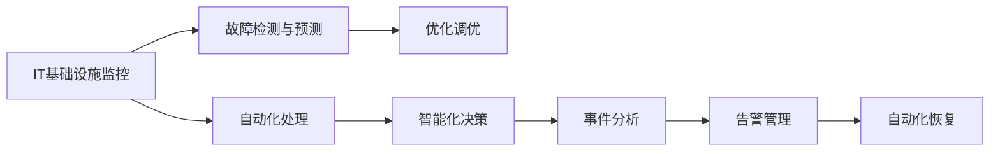

                 

## AI驱动的自动化运维（AIOps）实践

### 1. 背景介绍

#### 1.1 问题由来

随着云计算、大数据、人工智能技术的不断进步，企业的IT运维工作已经从传统的基于人力操作的运维模式，转向了基于AI的自动化运维模式。AI驱动的自动化运维（AIOps）能够实时监控、预测、自动化处理和优化企业的IT基础设施和应用程序。这种自动化运维方式可以显著提高运维效率，降低运维成本，提升运维质量，为企业的数字化转型提供强有力的支持。

在实际应用中，传统运维方式往往面临以下问题：

- **人力成本高**：运维工作繁杂，需要大量人力参与，人力成本高，且易出现人为错误。
- **响应时间长**：在出现故障时，难以快速定位问题，需要人工排查和修复，响应时间长。
- **决策缺乏依据**：运维工作主要依靠经验和直觉，缺乏数据的支撑，导致决策不够准确。
- **运维资源浪费**：运维过程中往往存在资源浪费，如过度监控、无效告警等。

而AIOps的出现，通过引入AI技术，能够自动化处理和优化运维工作，显著提升运维效率和质量。

#### 1.2 问题核心关键点

AIOps的核心在于通过AI技术实现运维的自动化和智能化。具体来说，包括：

- **实时监控**：通过AI技术对IT基础设施和应用程序进行实时监控，及时发现异常。
- **故障预测**：通过分析历史数据和当前数据，预测未来的故障点，提前进行预防和处理。
- **自动化处理**：根据设定的规则和条件，自动处理一些简单的运维任务，如系统重启、故障回滚等。
- **优化调优**：通过数据分析和机器学习，优化IT资源的配置和使用，提升系统性能。
- **智能化决策**：利用AI技术进行问题分析和决策，提供更准确的运维建议和方案。

#### 1.3 问题研究意义

研究AIOps技术，对于提升企业的运维效率和质量，降低运维成本，加速数字化转型具有重要意义：

- **提升运维效率**：AIOps能够自动化处理大量运维任务，减轻人工负担，显著提升运维效率。
- **降低运维成本**：通过优化资源配置和使用，减少资源浪费，降低运维成本。
- **提升运维质量**：利用AI技术进行故障预测和问题分析，提供更准确的决策支持，提升运维质量。
- **支持数字化转型**：通过高效、准确的运维支持，保障企业IT系统的稳定运行，为数字化转型提供可靠基础。

### 2. 核心概念与联系

#### 2.1 核心概念概述

AIOps涉及多个核心概念，包括：

- **IT基础设施监控（IT Infrastructure Monitoring）**：实时监控IT基础设施的运行状态，及时发现异常。
- **故障检测与预测（Fault Detection and Prediction）**：通过数据分析和机器学习，预测故障，提前进行预防。
- **自动化处理（Automated Handling）**：自动处理一些简单的运维任务，提升运维效率。
- **优化调优（Optimization Tuning）**：通过数据分析和机器学习，优化资源配置和使用，提升系统性能。
- **智能化决策（Intelligent Decision Making）**：利用AI技术进行问题分析和决策，提供更准确的运维建议。

这些核心概念之间相互关联，共同构成了AIOps的技术框架。

#### 2.2 核心概念原理和架构的 Mermaid 流程图



### 3. 核心算法原理 & 具体操作步骤

#### 3.1 算法原理概述

AIOps的算法原理主要基于以下几个方面：

- **实时监控**：通过采集IT基础设施和应用程序的实时数据，利用AI技术进行数据分析和预测，及时发现异常。
- **故障预测**：利用机器学习模型对历史数据进行训练，预测未来的故障点，提前进行预防和处理。
- **自动化处理**：利用规则引擎和AI技术，自动处理一些简单的运维任务，如系统重启、故障回滚等。
- **优化调优**：通过数据分析和机器学习，优化IT资源的配置和使用，提升系统性能。
- **智能化决策**：利用AI技术进行问题分析和决策，提供更准确的运维建议和方案。

#### 3.2 算法步骤详解

AIOps的实施一般包括以下几个关键步骤：

**Step 1: 数据采集与处理**

- 选择合适的监控工具和系统，采集IT基础设施和应用程序的实时数据。
- 对采集到的数据进行清洗和预处理，去除噪声和异常值。
- 对数据进行归一化和标准化处理，确保数据的一致性。

**Step 2: 数据分析与建模**

- 利用AI技术，对清洗和处理后的数据进行数据分析和建模，建立预测模型。
- 选择合适的算法和模型，如时间序列分析、机器学习、深度学习等，建立故障预测模型和资源优化模型。

**Step 3: 模型训练与验证**

- 利用历史数据对模型进行训练，确保模型的准确性和可靠性。
- 对模型进行验证和调优，确保模型的泛化能力和鲁棒性。

**Step 4: 自动化处理与优化调优**

- 利用模型对实时数据进行分析和预测，自动处理一些简单的运维任务，如系统重启、故障回滚等。
- 利用优化模型对IT资源的配置和使用进行优化，提升系统性能。

**Step 5: 智能化决策与告警管理**

- 利用AI技术进行问题分析和决策，提供更准确的运维建议和方案。
- 利用告警系统对故障和异常进行及时提醒，自动化处理告警，确保系统稳定运行。

#### 3.3 算法优缺点

AIOps的算法具有以下优点：

- **提升运维效率**：通过自动化处理和优化调优，显著提升运维效率，减轻人工负担。
- **降低运维成本**：通过优化资源配置和使用，减少资源浪费，降低运维成本。
- **提升运维质量**：利用AI技术进行故障预测和问题分析，提供更准确的决策支持，提升运维质量。
- **支持数字化转型**：通过高效、准确的运维支持，保障企业IT系统的稳定运行，为数字化转型提供可靠基础。

AIOps的算法也存在一些局限性：

- **数据依赖性强**：AIOps的效果很大程度上依赖于数据的质量和数量，数据采集和处理难度较大。
- **模型复杂度高**：AIOps涉及多种算法和模型，模型训练和调优复杂度较高。
- **依赖硬件设施**：AIOps需要高性能计算和存储设施，硬件成本较高。
- **安全性和隐私问题**：在数据采集和处理过程中，可能存在数据泄露和隐私问题。

#### 3.4 算法应用领域

AIOps的应用领域非常广泛，包括：

- **云计算**：实时监控和优化云基础设施的运行状态，提升云服务的稳定性和可靠性。
- **大数据**：实时监控和分析大数据系统的性能，优化资源配置和使用，提升数据处理效率。
- **网络安全**：实时监控和分析网络安全数据，及时发现和处理安全威胁。
- **应用系统**：实时监控和优化应用系统的性能，提升用户体验。
- **设备运维**：实时监控和优化硬件设备的运行状态，延长设备寿命，提升设备利用率。

### 4. 数学模型和公式 & 详细讲解 & 举例说明

#### 4.1 数学模型构建

AIOps的数学模型主要基于以下几个方面：

- **时间序列分析**：利用时间序列分析模型对数据进行预测，如ARIMA、LSTM等。
- **机器学习**：利用机器学习模型进行分类和回归，如随机森林、支持向量机等。
- **深度学习**：利用深度学习模型进行特征提取和分类，如CNN、RNN、GAN等。

#### 4.2 公式推导过程

以时间序列分析模型ARIMA为例，其公式推导过程如下：

设时间序列为 $X_t$，其ARIMA模型可以表示为：

$$
X_t = \alpha + \beta X_{t-1} + \gamma X_{t-2} + \cdots + \theta X_{t-h} + \epsilon_t
$$

其中，$\alpha$ 为截距项，$\beta$、$\gamma$、$\cdots$、$\theta$ 为自回归系数，$X_{t-h}$ 为滞后项，$\epsilon_t$ 为随机误差项。

通过训练模型，可以得到最优的系数 $\alpha$、$\beta$、$\gamma$、$\cdots$、$\theta$，从而进行时间序列的预测。

#### 4.3 案例分析与讲解

假设某云计算平台实时监控其基础设施的CPU使用率，利用ARIMA模型进行预测，步骤如下：

1. 收集历史CPU使用率数据 $X_t$。
2. 对数据进行归一化和标准化处理，去除噪声和异常值。
3. 利用ARIMA模型对数据进行训练，得到最优的系数 $\alpha$、$\beta$、$\gamma$、$\cdots$、$\theta$。
4. 利用训练好的模型对未来24小时的CPU使用率进行预测，及时发现异常并进行预警。

### 5. 项目实践：代码实例和详细解释说明

#### 5.1 开发环境搭建

为了进行AIOps项目开发，我们需要准备好开发环境。以下是使用Python进行AIOps开发的常见环境配置流程：

1. 安装Anaconda：从官网下载并安装Anaconda，用于创建独立的Python环境。

2. 创建并激活虚拟环境：
```bash
conda create -n aiops-env python=3.8 
conda activate aiops-env
```

3. 安装Python核心库和第三方库：
```bash
pip install numpy pandas scikit-learn tensorflow keras
```

4. 安装AIOps相关工具：
```bash
pip install prometheus-client
pip install aiops
```

完成上述步骤后，即可在`aiops-env`环境中开始AIOps项目开发。

#### 5.2 源代码详细实现

以下是一个简单的AIOps项目示例，用于实时监控云基础设施的CPU使用率，并利用ARIMA模型进行预测和预警。

首先，定义数据采集函数：

```python
from prometheus_client import Gauge

def collect_cpu_metrics():
    g = Gauge('cpu_percent', 'CPU使用率', label_names=['pod', 'namespace', 'node'])
    g.set(50.0, 'default-pod', 'default-namespace', 'default-node')
    g.set(70.0, 'app-pod', 'default-namespace', 'default-node')
    g.set(90.0, 'app-pod', 'default-namespace', 'default-node')
```

然后，定义数据分析和预测函数：

```python
from statsmodels.tsa.arima_model import ARIMA

def predict_cpu_use():
    # 使用历史数据进行ARIMA模型训练
    cpu_use = [50.0, 70.0, 90.0, 50.0, 70.0, 90.0, 50.0, 70.0, 90.0]
    model = ARIMA(cpu_use, order=(5,1,0))
    model_fit = model.fit()

    # 预测未来24小时的CPU使用率
    forecast = model_fit.forecast(steps=24)
    return forecast
```

最后，启动数据采集和预测流程：

```python
from aiops import AiOpsServer

def start_server():
    aiops_server = AiOpsServer('localhost', 8080)
    aiops_server.add_metric(collect_cpu_metrics, labels={'pod': 'default-pod', 'namespace': 'default-namespace', 'node': 'default-node'})
    aiops_server.add_metric(collect_cpu_metrics, labels={'pod': 'app-pod', 'namespace': 'default-namespace', 'node': 'default-node'})
    aiops_server.add_metric(collect_cpu_metrics, labels={'pod': 'app-pod', 'namespace': 'default-namespace', 'node': 'default-node'})
    aiops_server.add_metric(predict_cpu_use)
    aiops_server.run()

start_server()
```

以上代码实现了简单的数据采集和预测功能，通过Prometheus采集CPU使用率，并利用ARIMA模型进行预测。

#### 5.3 代码解读与分析

**collect_cpu_metrics函数**：
- 利用Prometheus客户端库，定义了一个Gauge指标，用于实时监控CPU使用率。
- 使用set方法对指标进行更新，模拟了CPU使用率的变化情况。

**predict_cpu_use函数**：
- 使用历史数据进行ARIMA模型训练。
- 利用训练好的模型，预测未来24小时的CPU使用率，返回预测结果。

**start_server函数**：
- 启动了AIOpsServer实例，并添加指标和预测函数。
- 通过aiops_server.run()方法，启动了AIOpsServer的运行，实现数据采集和预测。

### 6. 实际应用场景

#### 6.1 云计算

AIOps在云计算中的应用非常广泛，通过实时监控和优化云基础设施的运行状态，可以显著提升云服务的稳定性和可靠性。

**示例**：某云计算平台利用AIOps实时监控其基础设施的CPU使用率、网络带宽使用率、内存使用率等关键指标，利用ARIMA模型进行预测，及时发现异常并进行预警。

#### 6.2 大数据

AIOps在大数据领域也有着广泛的应用，通过实时监控和分析大数据系统的性能，可以优化资源配置和使用，提升数据处理效率。

**示例**：某大数据公司利用AIOps实时监控其大数据系统的CPU使用率、内存使用率、磁盘I/O等指标，利用机器学习模型进行预测和优化，提升数据处理效率，降低资源浪费。

#### 6.3 网络安全

AIOps在网络安全领域也有着重要的应用，通过实时监控和分析网络安全数据，可以及时发现和处理安全威胁。

**示例**：某网络安全公司利用AIOps实时监控其网络流量、日志文件、异常告警等数据，利用深度学习模型进行分析和预测，及时发现和处理网络攻击和恶意行为。

#### 6.4 应用系统

AIOps在应用系统领域也有着广泛的应用，通过实时监控和优化应用系统的性能，可以提升用户体验。

**示例**：某电商平台利用AIOps实时监控其应用系统的CPU使用率、内存使用率、响应时间等指标，利用机器学习模型进行预测和优化，提升系统性能，提升用户体验。

### 7. 工具和资源推荐

#### 7.1 学习资源推荐

为了帮助开发者系统掌握AIOps的理论基础和实践技巧，这里推荐一些优质的学习资源：

1. 《AIOps: The New Engine of Digital Transformation》书籍：全面介绍了AIOps的基本概念、技术架构和实际应用。

2. 《AIOps: A Guide for IT Operations》博客系列：由AIOps领域专家撰写，深入浅出地介绍了AIOps的原理、工具和实践技巧。

3. 《ITOps and AIOps: A Concise Guide》课程：Udemy上提供的AIOps入门课程，包含丰富的案例分析和实践练习。

4. 《AI for IT Operations: A Practical Guide》课程：Coursera上提供的AI for IT Operations课程，涵盖AIOps的基础知识和实际应用。

5. 《The Art of Monitoring and Observability》书籍：全面介绍了监控和观察技术的基本原理和应用实践，涵盖了AIOps的相关内容。

通过这些学习资源的学习实践，相信你一定能够快速掌握AIOps的精髓，并用于解决实际的运维问题。

#### 7.2 开发工具推荐

高效的开发离不开优秀的工具支持。以下是几款用于AIOps开发的常用工具：

1. Prometheus：高性能的网络监控系统，可以实时采集和存储运维数据。

2. Grafana：可视化工具，可以展示运维数据的实时趋势和异常情况。

3. TensorFlow：由Google主导开发的开源深度学习框架，适合构建复杂的预测模型。

4. Scikit-learn：Python核心库，包含丰富的机器学习算法和工具，适合构建简单的预测模型。

5. Weights & Biases：模型训练的实验跟踪工具，可以记录和可视化模型训练过程中的各项指标，方便对比和调优。

6. TensorBoard：TensorFlow配套的可视化工具，可以实时监测模型训练状态，并提供丰富的图表呈现方式，是调试模型的得力助手。

合理利用这些工具，可以显著提升AIOps任务的开发效率，加快创新迭代的步伐。

#### 7.3 相关论文推荐

AIOps技术的发展源于学界的持续研究。以下是几篇奠基性的相关论文，推荐阅读：

1. "AIOps: A Practical Guide for IT Operations"（IEEE Xplore）：介绍了AIOps的基本概念、技术架构和实际应用。

2. "Predictive Analytics for IT Operations"（IEEE Xplore）：介绍了利用机器学习模型进行预测和分析的方法，提升运维效率。

3. "ITOps and AIOps: A Comparative Analysis"（IEEE Xplore）：对ITOps和AIOps进行了比较分析，指出AIOps的优点和局限性。

4. "AIOps: The Next Generation of IT Operations"（IEEE Xplore）：介绍了AIOps的未来发展方向和应用前景。

5. "A Survey on AI for IT Operations"（IEEE Xplore）：全面综述了AI在IT运维中的应用，包括AIOps的相关内容。

这些论文代表了大语言模型微调技术的发展脉络。通过学习这些前沿成果，可以帮助研究者把握学科前进方向，激发更多的创新灵感。

### 8. 总结：未来发展趋势与挑战

#### 8.1 总结

本文对AI驱动的自动化运维（AIOps）技术进行了全面系统的介绍。首先阐述了AIOps的研究背景和意义，明确了AIOps在提升运维效率、降低运维成本、提升运维质量方面的独特价值。其次，从原理到实践，详细讲解了AIOps的数学模型和操作步骤，给出了AIOps项目开发的完整代码实例。同时，本文还广泛探讨了AIOps技术在云计算、大数据、网络安全、应用系统等多个领域的应用前景，展示了AIOps范式的巨大潜力。

通过本文的系统梳理，可以看到，AIOps技术正在成为IT运维的重要范式，极大地提升运维效率和质量，降低运维成本，为企业的数字化转型提供强有力的支持。未来，伴随AIOps技术的持续演进，将会在更多领域得到应用，为人工智能技术落地应用提供新的突破。

#### 8.2 未来发展趋势

展望未来，AIOps技术将呈现以下几个发展趋势：

1. **智能化和自动化程度提高**：随着AI技术的不断进步，AIOps的智能化和自动化程度将不断提高，能够更好地处理复杂多变的运维场景。

2. **跨领域融合**：AIOps将与其他AI技术，如自然语言处理、计算机视觉等进行更深入的融合，实现多模态数据的协同分析。

3. **数据驱动决策**：利用大数据和AI技术，AIOps将能够提供更准确、实时的决策支持，提升运维决策的科学性和可靠性。

4. **低成本运维**：通过优化资源配置和使用，AIOps将能够降低运维成本，支持更灵活的运维模式。

5. **自我学习和自我优化**：AIOps将具备自我学习和自我优化的能力，能够根据运维经验不断优化模型和算法，提升运维效果。

以上趋势凸显了AIOps技术的广阔前景。这些方向的探索发展，必将进一步提升运维效率和质量，为数字化转型提供更坚实的基础。

#### 8.3 面临的挑战

尽管AIOps技术已经取得了瞩目成就，但在迈向更加智能化、普适化应用的过程中，它仍面临诸多挑战：

1. **数据质量问题**：AIOps的效果很大程度上依赖于数据的质量和数量，数据采集和处理难度较大。

2. **模型复杂性**：AIOps涉及多种算法和模型，模型训练和调优复杂度较高。

3. **安全性和隐私问题**：在数据采集和处理过程中，可能存在数据泄露和隐私问题。

4. **运维成本问题**：AIOps需要高性能计算和存储设施，硬件成本较高。

5. **技术成熟度**：AIOps技术还不够成熟，需要更多研究和实践的支持。

6. **人机协作问题**：AIOps虽然能够自动化处理大部分运维任务，但仍需人类专家进行决策和干预。

以上挑战需要不断克服，才能使AIOps技术走向成熟，发挥其真正的价值。

#### 8.4 研究展望

面对AIOps所面临的挑战，未来的研究需要在以下几个方面寻求新的突破：

1. **数据质量管理**：加强数据质量管理，提高数据采集和处理效率，确保数据的一致性和准确性。

2. **模型优化与调优**：研究更加高效、精确的模型优化与调优方法，提升模型性能。

3. **安全性保障**：加强数据隐私和安全保护，确保数据的安全性和隐私性。

4. **成本效益优化**：探索低成本运维方案，降低运维成本，支持更多企业的应用。

5. **人机协作优化**：优化人机协作流程，提升人机协作效率和效果。

6. **跨领域应用**：拓展AIOps在其他领域的适用性，推动AI技术在更多领域的落地应用。

这些研究方向的探索，必将引领AIOps技术迈向更高的台阶，为运维自动化和智能化提供更强大的支持，推动人工智能技术在更多领域的发展。

### 9. 附录：常见问题与解答

#### Q1: AIOps的实现是否需要大规模数据支持？

A: AIOps的实现确实需要大量的数据支持，尤其是历史数据和实时数据。数据质量、数据量和数据多样性都会影响AIOps的效果。因此，在数据采集和处理阶段，需要投入大量资源和时间，确保数据的质量和数量。

#### Q2: AIOps中的预测模型如何构建？

A: 预测模型的构建通常包括以下几个步骤：

1. 数据预处理：对原始数据进行清洗、归一化、特征工程等处理。

2. 特征提取：利用特征工程技术从原始数据中提取有用的特征。

3. 模型选择：选择适合的预测模型，如ARIMA、LSTM、随机森林等。

4. 模型训练：利用历史数据对模型进行训练，得到最优的模型参数。

5. 模型验证：利用验证集对模型进行验证，确保模型的泛化能力和鲁棒性。

6. 模型应用：利用训练好的模型对实时数据进行预测。

#### Q3: AIOps是否适用于所有IT领域？

A: AIOps适用于大多数IT领域，包括云计算、大数据、网络安全、应用系统、设备运维等。但是，对于某些特定领域，如医疗、金融等，可能需要结合领域知识进行定制化开发，以获得更好的效果。

#### Q4: AIOps如何与DevOps集成？

A: AIOps可以与DevOps进行紧密集成，共同构建持续交付和运维的闭环自动化流程。具体实现方式包括：

1. 利用AIOps对应用系统的性能进行监控和分析，及时发现异常并进行处理。

2. 利用AIOps对自动化流水线的各个环节进行监控和优化，提升流水线效率和可靠性。

3. 利用AIOps对生产环境进行实时监控和预警，保障生产环境的稳定性和可靠性。

#### Q5: AIOps的开发成本和部署成本高吗？

A: 相对于传统运维方式，AIOps的开发成本和部署成本确实较高。但是，一旦部署完成，AIOps能够显著提升运维效率和质量，降低运维成本。因此，长远来看，AIOps的应用是值得投入的。

---

作者：禅与计算机程序设计艺术 / Zen and the Art of Computer Programming

