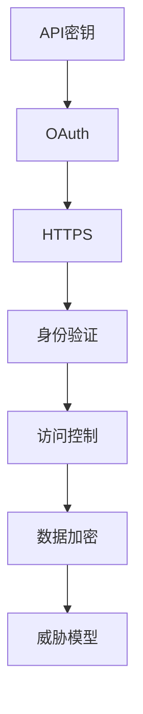

                 

# API 安全和认证机制

> 关键词：API安全,认证机制,OAuth,HTTPS,API密钥,身份验证,数据加密,漏洞防护,威胁模型

## 1. 背景介绍

在当今数字化时代，API (应用程序接口)已成为连接不同系统和服务的重要纽带。无论是企业内部系统间的交互，还是第三方服务整合，API都扮演着至关重要的角色。然而，API的广泛应用也带来了新的安全挑战，特别是面对恶意攻击、数据泄露等风险时，如何保护API的安全成为业界关注的焦点。

### 1.1 问题由来
API的安全威胁是多方面的，包括但不限于SQL注入、XSS攻击、CSRF攻击、DDoS攻击等。攻击者可以利用API的漏洞，窃取敏感数据，控制系统，甚至发动高级持续性威胁(APT)。

例如，2017年著名的Slack API安全漏洞事件中，攻击者通过API注入代码，利用Slack的权限管理漏洞，获得了超级管理员权限，非法访问了大量的企业数据。这一事件暴露了API在安全管理上的薄弱环节，使得API安全成为亟待解决的课题。

### 1.2 问题核心关键点
API安全问题的核心在于如何保护API的机密性、完整性和可用性。为此，需要构建一套完整的API安全认证机制，涵盖身份验证、访问控制、数据加密等多个层面。

- **身份验证**：验证请求者的身份，防止假冒攻击。
- **访问控制**：根据用户身份，限制访问权限，防止越权访问。
- **数据加密**：保护传输中的数据不被窃取或篡改。
- **漏洞防护**：识别并防范API的已知和未知漏洞。
- **威胁模型**：识别潜在的安全威胁，制定相应的防护策略。

本文将重点探讨API的认证机制，包括OAuth、API密钥、HTTPS等关键技术，以及如何构建高效的API安全体系。

## 2. 核心概念与联系

### 2.1 核心概念概述

为更好地理解API安全认证机制，本节将介绍几个密切相关的核心概念：

- **API密钥**：用于API调用时的身份认证，通常是一段唯一的字符串，存储在客户端和服务器端。
- **OAuth**：一种授权协议，允许用户授权第三方应用访问其资源。OAuth通过令牌机制，实现对API的访问控制。
- **HTTPS**：通过TLS/SSL协议，提供数据传输的加密保护，防止数据在传输过程中被窃听或篡改。
- **身份验证**：验证请求者的身份，确保其真实性。
- **访问控制**：根据用户身份，限制其访问权限，防止越权访问。
- **数据加密**：保护数据在传输和存储过程中的机密性和完整性。
- **威胁模型**：识别潜在的安全威胁，制定相应的防护策略。

这些核心概念之间的逻辑关系可以通过以下Mermaid流程图来展示：



这个流程图展示了许多核心概念及其之间的关系：

1. API密钥是OAuth的认证基础。
2. OAuth通过令牌机制，实现对API的访问控制。
3. HTTPS提供数据传输的加密保护。
4. 身份验证和访问控制共同构建了API的安全体系。
5. 数据加密保护了数据在传输和存储过程中的安全。
6. 威胁模型指导API安全体系的构建。

## 3. 核心算法原理 & 具体操作步骤

### 3.1 算法原理概述

API认证机制的核心在于建立一套有效的身份验证和访问控制流程，确保API的机密性、完整性和可用性。其基本原理如下：

- **身份验证**：通过API密钥或OAuth令牌验证请求者的身份，确保其真实性。
- **访问控制**：根据用户的身份信息，限制其访问权限，防止越权访问。
- **数据加密**：使用HTTPS对传输数据进行加密，防止数据被窃听或篡改。
- **漏洞防护**：定期扫描API漏洞，及时修复安全缺陷。
- **威胁模型**：构建威胁模型，识别潜在的安全威胁，并制定相应的防护策略。

### 3.2 算法步骤详解

基于上述原理，API安全认证机制的基本步骤如下：

1. **身份验证**：
   - 客户端发送API请求时，携带API密钥或OAuth令牌。
   - 服务器端接收请求后，通过API密钥或OAuth令牌进行身份验证。
   - 验证通过后，服务器端根据用户的身份信息，返回相应的响应。

2. **访问控制**：
   - 服务器端根据用户的身份信息，判断其是否有权限访问请求的API。
   - 如果用户有权限访问，服务器端返回请求结果；否则返回权限拒绝的错误信息。

3. **数据加密**：
   - 服务器端与客户端之间的通信使用HTTPS协议进行加密。
   - 数据在传输过程中，使用TLS/SSL协议进行加密，防止数据被窃听或篡改。

4. **漏洞防护**：
   - 定期扫描API的已知和未知漏洞，及时修复安全缺陷。
   - 使用Web应用防火墙(WAF)、入侵检测系统(IDS)等工具，防范恶意攻击。

5. **威胁模型**：
   - 构建威胁模型，识别潜在的安全威胁，如SQL注入、XSS攻击、CSRF攻击等。
   - 根据威胁模型的分析结果，制定相应的防护策略，如输入验证、输出编码、跨站请求伪造(CSRF)防护等。

### 3.3 算法优缺点

基于上述原理和步骤的API认证机制，具有以下优点：

- **安全性高**：通过身份验证和访问控制，确保只有授权用户可以访问API。
- **可扩展性强**：适用于各种API场景，无论是企业内部系统还是第三方服务。
- **用户体验好**：采用OAuth等协议，用户无需记住复杂的API密钥，只需一次授权即可长期使用。

同时，该机制也存在一些缺点：

- **复杂度高**：实现和维护一个完整的API安全认证体系，需要较复杂的技术和资源。
- **性能消耗大**：身份验证和访问控制等环节，会增加服务器的处理负担。
- **适用性受限**：对于一些低风险、高频率的API调用场景，API认证机制可能显得过于繁琐。

### 3.4 算法应用领域

API安全认证机制在现代软件开发中得到了广泛应用，适用于各种类型的API，包括企业内部系统API、第三方服务API、移动应用API等。

- **企业内部系统API**：用于连接企业内部不同系统和服务，如ERP、CRM、HR系统等。通过API认证机制，确保内部系统的安全。
- **第三方服务API**：如支付、地图、社交网络等服务，通过OAuth等协议，保护用户的隐私和数据安全。
- **移动应用API**：如天气预报、新闻资讯、在线购物等服务，通过API密钥或OAuth令牌，限制应用的访问权限。

## 4. 数学模型和公式 & 详细讲解 & 举例说明（备注：数学公式请使用latex格式，latex嵌入文中独立段落使用 $$，段落内使用 $)
### 4.1 数学模型构建

为了更好地理解API安全认证机制，本节将使用数学语言对API认证的基本流程进行严格的描述。

假设API的访问需要进行身份验证，身份验证的过程可以用以下数学模型表示：

- 设$K$为API密钥，$A$为认证算法，$X$为输入的API请求，$O$为认证结果，$C$为返回的认证结果。
- 身份验证过程可以表示为：$O = A(K, X)$。

其中，$K$为API密钥，$X$为API请求，$A$为认证算法，$O$为认证结果。

### 4.2 公式推导过程

以下我们将推导OAuth令牌的身份验证过程。

OAuth 2.0协议通常采用三种授权类型：授权码、隐式授权、客户端凭据授权。这里以授权码授权为例进行推导。

1. **授权请求**：
   - 用户通过第三方应用向API提供授权请求，包括客户端ID和密钥、重定向URL、授权范围等。
   - 授权服务器生成授权码并返回给用户。

2. **访问令牌请求**：
   - 用户将授权码传递给第三方应用。
   - 第三方应用使用授权码向授权服务器请求访问令牌。
   - 授权服务器验证授权码，生成访问令牌和刷新令牌，并返回给第三方应用。

3. **访问API**：
   - 第三方应用使用访问令牌和刷新令牌向API请求访问权限。
   - API服务器验证访问令牌的有效性，并根据令牌信息，返回API响应。

### 4.3 案例分析与讲解

以一个简单的示例来说明OAuth令牌的身份验证过程：

假设一个API服务器的认证流程如下：

1. 用户通过第三方应用向API提供授权请求，包括客户端ID和密钥、重定向URL、授权范围等。
2. 授权服务器生成授权码并返回给用户。
3. 用户将授权码传递给第三方应用。
4. 第三方应用使用授权码向授权服务器请求访问令牌。
5. 授权服务器验证授权码，生成访问令牌和刷新令牌，并返回给第三方应用。
6. 第三方应用使用访问令牌和刷新令牌向API请求访问权限。
7. API服务器验证访问令牌的有效性，并根据令牌信息，返回API响应。

这个流程展示了OAuth 2.0协议的基本工作原理，通过授权码和访问令牌的交换，实现了对API的访问控制。

## 5. 项目实践：代码实例和详细解释说明
### 5.1 开发环境搭建

在进行API安全认证机制的实现前，我们需要准备好开发环境。以下是使用Python进行Flask框架开发的环境配置流程：

1. 安装Anaconda：从官网下载并安装Anaconda，用于创建独立的Python环境。

2. 创建并激活虚拟环境：
```bash
conda create -n flask-env python=3.8 
conda activate flask-env
```

3. 安装Flask：
```bash
pip install flask
```

4. 安装requests：用于发送HTTP请求。
```bash
pip install requests
```

5. 安装Flask-OAuthlib：用于实现OAuth认证。
```bash
pip install Flask-OAuthlib
```

完成上述步骤后，即可在`flask-env`环境中开始Flask应用开发。

### 5.2 源代码详细实现

这里我们以Flask应用为例，实现一个简单的OAuth认证流程：

```python
from flask import Flask, request, redirect, url_for
from flask_oauthlib.provider import OAuth2Provider
import requests

app = Flask(__name__)
app.config['SECRET_KEY'] = 'your_secret_key'

oauth = OAuth2Provider(app)

@app.route('/oauth/token')
def token():
    code = request.args.get('code')
    response = requests.get('https://example.com/oauth/token', params={'code': code, 'client_id': 'your_client_id', 'client_secret': 'your_client_secret'})
    data = response.json()
    access_token = data['access_token']
    refresh_token = data['refresh_token']
    return {'token': access_token, 'refresh_token': refresh_token}

@app.route('/api/protected')
@oauth.require_oauth('read')
def protected():
    return 'Protected API endpoint'

if __name__ == '__main__':
    app.run(debug=True)
```

在这个示例中，我们使用了Flask框架，通过Flask-OAuthlib库实现了OAuth 2.0协议。具体流程如下：

1. 用户通过第三方应用向API提供授权请求，包括客户端ID和密钥、重定向URL、授权范围等。
2. 授权服务器生成授权码并返回给用户。
3. 用户将授权码传递给第三方应用。
4. 第三方应用使用授权码向授权服务器请求访问令牌。
5. 授权服务器验证授权码，生成访问令牌和刷新令牌，并返回给第三方应用。
6. 第三方应用使用访问令牌和刷新令牌向API请求访问权限。
7. API服务器验证访问令牌的有效性，并根据令牌信息，返回API响应。

### 5.3 代码解读与分析

让我们再详细解读一下关键代码的实现细节：

- `@app.route('/oauth/token')`：定义了OAuth令牌请求的路由，接收授权码并生成访问令牌和刷新令牌。
- `requests.get('https://example.com/oauth/token', params={'code': code, 'client_id': 'your_client_id', 'client_secret': 'your_client_secret'})`：使用requests库发送HTTP请求，获取OAuth令牌。
- `@app.route('/api/protected')`：定义了受保护的API路由，使用`@oauth.require_oauth('read')`装饰器进行OAuth令牌验证。
- `return 'Protected API endpoint'`：返回受保护的API响应。

以上代码展示了如何使用Flask和Flask-OAuthlib库实现一个简单的OAuth认证流程。开发者可以根据实际需求，进一步扩展和优化认证机制。

## 6. 实际应用场景
### 6.1 智能客服系统

基于OAuth的智能客服系统，可以实现用户授权第三方应用访问其对话记录的功能。用户在智能客服应用中授权第三方应用访问，第三方应用即可调用API获取用户的对话记录，进行数据分析和改进。

### 6.2 金融舆情监测

金融机构的API服务可以采用OAuth协议，允许第三方应用访问用户的交易记录和账户信息。第三方应用可以通过API获取用户的数据，进行舆情分析和风险监控。

### 6.3 个性化推荐系统

个性化推荐系统可以通过OAuth协议，允许第三方应用访问用户的浏览和购买记录，进行深度学习和数据分析，生成个性化的推荐结果。

### 6.4 未来应用展望

随着API安全认证机制的不断发展，其在更多领域得到应用，为传统行业带来变革性影响。

在智慧医疗领域，基于OAuth的医疗数据API服务，可以实现患者授权第三方应用访问其健康数据，推动医疗数据的共享和利用。

在智能教育领域，OAuth的在线教育API服务，可以实现学生授权第三方应用访问其学习数据，推动教育资源的共享和利用。

在智慧城市治理中，OAuth的公共服务API，可以实现市民授权第三方应用访问其城市数据，推动城市数据的共享和利用。

此外，在企业生产、社会治理、文娱传媒等众多领域，基于OAuth的API服务也将不断涌现，为传统行业数字化转型提供新的技术路径。

## 7. 工具和资源推荐
### 7.1 学习资源推荐

为了帮助开发者系统掌握API安全认证机制的理论基础和实践技巧，这里推荐一些优质的学习资源：

1. 《API安全》系列博文：由API安全专家撰写，深入浅出地介绍了API安全的核心概念和实践技巧。

2. OAuth 2.0官方文档：OAuth 2.0协议的官方文档，详细介绍了OAuth 2.0协议的各个方面，是学习API认证机制的重要参考资料。

3. 《API安全与隐私保护》书籍：全面介绍了API安全的原理和实践，包括身份验证、访问控制、数据加密等多个方面。

4. OpenSSL官方文档：TLS/SSL协议的官方文档，详细介绍了TLS/SSL协议的各个方面，是学习数据加密技术的重要参考资料。

5. OWASP API Security Project：OWASP组织发起的API安全项目，提供了丰富的API安全资源和工具。

通过对这些资源的学习实践，相信你一定能够快速掌握API安全认证机制的精髓，并用于解决实际的API安全问题。

### 7.2 开发工具推荐

高效的开发离不开优秀的工具支持。以下是几款用于API安全认证机制开发的常用工具：

1. Flask：基于Python的开源Web框架，灵活易用，适合快速迭代研究。

2. Flask-OAuthlib：用于实现OAuth认证的Flask扩展库，方便开发者实现OAuth认证流程。

3. requests：用于发送HTTP请求的Python库，简单易用，支持多种HTTP协议。

4. OpenSSL：TLS/SSL协议的实现库，支持多种加密算法和协议。

5. OWASP ZAP：开源的网络安全测试工具，可以检测API的常见漏洞，如SQL注入、XSS攻击等。

合理利用这些工具，可以显著提升API安全认证机制的开发效率，加快创新迭代的步伐。

### 7.3 相关论文推荐

API安全认证机制的研究源于学界的持续研究。以下是几篇奠基性的相关论文，推荐阅读：

1. OAuth 2.0协议：最早由Google、Yahoo和Microsoft联合提出，现已成为广泛使用的API授权协议。

2. SSL/TLS协议：TLS/SSL协议是网络安全传输的标准协议，由IETF（互联网工程任务组）制定。

3. API安全威胁模型：由安全专家提出的API安全威胁模型，识别API的常见威胁和攻击方式，指导API安全防护。

4. OAuth 2.0扩展：如OAuth 2.0 Client Credentials Grant、OAuth 2.0 Authorization Code Grant等扩展协议，增加了API认证的灵活性。

这些论文代表了大规模语言模型微调技术的发展脉络。通过学习这些前沿成果，可以帮助研究者把握学科前进方向，激发更多的创新灵感。

## 8. 总结：未来发展趋势与挑战

### 8.1 总结

本文对API安全认证机制进行了全面系统的介绍。首先阐述了API安全认证机制的研究背景和意义，明确了OAuth、API密钥、HTTPS等关键技术在API安全中的重要性。其次，从原理到实践，详细讲解了OAuth令牌的身份验证过程，给出了OAuth认证流程的代码实现。同时，本文还探讨了OAuth在智能客服、金融舆情、个性化推荐等多个行业领域的应用前景，展示了OAuth认证的强大功能。最后，本文精选了OAuth认证机制的学习资源，力求为开发者提供全方位的技术指引。

通过本文的系统梳理，可以看到，基于OAuth的API安全认证机制正在成为API开发的重要范式，极大地提升了API的安全性和用户体验。未来，伴随OAuth认证机制的持续演进，相信API安全技术将走向更高的台阶，为API应用提供更安全、更可靠、更灵活的保护。

### 8.2 未来发展趋势

展望未来，API安全认证机制将呈现以下几个发展趋势：

1. **多因素认证**：结合多种身份验证方式，提高API的安全性。如结合密码、生物识别、短信验证码等，增加认证的复杂度。

2. **OAuth 2.0扩展**：如OAuth 2.0 Client Credentials Grant、OAuth 2.0 Authorization Code Grant等扩展协议，增加了API认证的灵活性。

3. **OAuth 2.0加强**：如OAuth 2.0 Protection Profiles、OAuth 2.0 Authorization Server Security Profiles等加强措施，提升API认证的安全性。

4. **数据加密技术**：结合最新的加密技术，如AES、RSA等，进一步提升API数据传输的安全性。

5. **威胁检测技术**：结合机器学习、人工智能等技术，实时检测API的威胁行为，及时采取防护措施。

6. **微服务安全**：结合微服务架构的安全特性，如OAuth、API密钥等，提升微服务的整体安全水平。

以上趋势凸显了API安全认证机制的广阔前景。这些方向的探索发展，必将进一步提升API的安全性和用户体验，构建更安全、可靠的API生态系统。

### 8.3 面临的挑战

尽管API安全认证机制已经取得了瞩目成就，但在迈向更加智能化、普适化应用的过程中，它仍面临着诸多挑战：

1. **复杂度高**：实现和维护一个完整的API安全认证体系，需要较复杂的技术和资源。
2. **性能消耗大**：身份验证和访问控制等环节，会增加服务器的处理负担。
3. **适用性受限**：对于一些低风险、高频率的API调用场景，API认证机制可能显得过于繁琐。
4. **用户隐私保护**：如何在保证安全性的同时，保护用户的隐私信息，防止数据泄露。

### 8.4 研究展望

面对API安全认证机制所面临的挑战，未来的研究需要在以下几个方面寻求新的突破：

1. **简化认证流程**：结合多因素认证、OAuth 2.0扩展等技术，简化认证流程，提升用户体验。

2. **提高安全性**：结合最新的加密技术和威胁检测技术，进一步提升API的安全性。

3. **保护用户隐私**：在保证安全性的同时，保护用户的隐私信息，防止数据泄露。

4. **兼容不同场景**：对于低风险、高频率的API调用场景，设计更加灵活、高效的API认证机制。

这些研究方向的探索，必将引领API安全认证机制走向更高的台阶，为API应用提供更安全、更可靠、更灵活的保护。面向未来，API安全认证机制还需要与其他安全技术进行更深入的融合，如身份管理、访问控制等，多路径协同发力，共同推动API安全技术的发展。

## 9. 附录：常见问题与解答

**Q1：API密钥和OAuth令牌有何区别？**

A: API密钥和OAuth令牌是两种常见的身份验证方式，用于验证API请求的合法性。API密钥通常是一段唯一的字符串，存储在客户端和服务器端，用于在API调用时进行身份验证。OAuth令牌则是由授权服务器颁发的，用于授权第三方应用访问用户资源。

**Q2：如何选择适合API的加密算法？**

A: 选择适合API的加密算法需要考虑多个因素，如安全性、性能、易用性等。常见的加密算法包括AES、RSA、SHA等。一般来说，对于数据传输加密，AES算法比较常用；对于数字签名和证书验证，RSA算法比较常用。

**Q3：如何防范API的DDoS攻击？**

A: 防范API的DDoS攻击需要从多个方面进行综合防护，如增加API的访问频率限制、使用IP白名单和黑名单、部署DDoS防护设备等。同时，可以结合机器学习、人工智能等技术，实时检测和应对DDoS攻击。

**Q4：如何进行API的威胁检测？**

A: 进行API的威胁检测需要结合多种技术手段，如日志分析、异常检测、威胁情报等。可以使用机器学习、人工智能等技术，实时监测API的威胁行为，及时采取防护措施。

**Q5：API认证机制是否适用于所有API场景？**

A: API认证机制适用于大多数API场景，但对于一些低风险、高频率的API调用场景，API认证机制可能显得过于繁琐。对于这些场景，可以采用更简单的身份验证方式，如API密钥、Token等。

以上回答展示了API安全认证机制的核心概念和应用实践，希望能够帮助你更好地理解API安全技术，并应用于实际的API开发中。

---

作者：禅与计算机程序设计艺术 / Zen and the Art of Computer Programming

