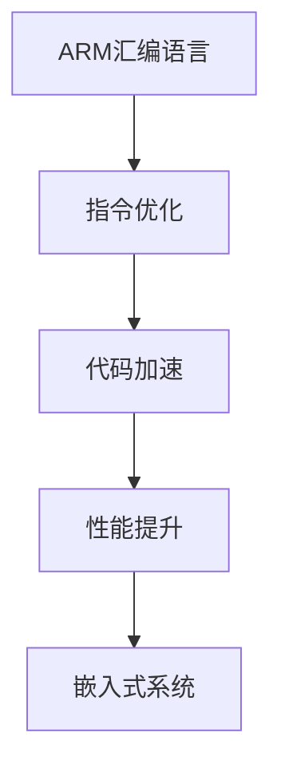

                 

# ARM汇编语言高级优化技巧

> 关键词：ARM汇编、指令优化、代码加速、性能提升、嵌入式系统

## 1. 背景介绍

在现代计算体系中，汇编语言依旧发挥着无可替代的作用，特别是在对性能要求极高的嵌入式系统、高性能计算等领域。随着ARM架构的广泛应用，深入理解和掌握ARM汇编语言显得尤为重要。本文将围绕如何高效地使用ARM汇编语言，介绍一系列高级优化技巧，旨在帮助开发者提升代码性能，降低功耗，优化资源利用。

### 1.1 问题由来

当前，嵌入式系统、高性能计算等领域的处理器架构中，ARM占据了重要地位。但由于ARM架构的特殊性，其汇编指令集与常见的x86指令集有所不同。例如，ARM架构的指令集以长操作码为主，且支持寄存器直接访问、条件分支等优化特性。在实际应用中，若未能充分利用这些特性，将导致程序执行效率低下，性能表现不佳。因此，掌握ARM汇编语言高级优化技巧，对提升代码性能、降低功耗具有重要意义。

## 2. 核心概念与联系

### 2.1 核心概念概述

在深入介绍ARM汇编语言高级优化技巧前，我们先概述几个核心概念：

- ARM汇编语言：ARM处理器使用的汇编语言，与常见的x86汇编指令集有较大差异。ARM汇编语言注重资源优化，适合在资源受限环境中使用。
- 指令优化：通过选择合适的ARM指令，优化程序执行流程，提高程序性能。
- 代码加速：通过优化ARM汇编代码，减少指令执行周期，提升程序运行速度。
- 性能提升：通过优化ARM汇编指令，实现更高效率的代码执行，从而提升系统性能。
- 嵌入式系统：资源受限且运行时间要求严格的系统，适合使用ARM汇编语言进行开发。

### 2.2 核心概念原理和架构的 Mermaid 流程图



该图展示了ARM汇编语言与指令优化、代码加速、性能提升和嵌入式系统之间的关系。可以看出，ARM汇编语言的优化，是嵌入式系统性能提升的重要手段。

## 3. 核心算法原理 & 具体操作步骤

### 3.1 算法原理概述

基于ARM汇编语言的优化，涉及多方面的技巧和策略。其中，关键在于理解ARM指令集的特性，合理选择指令，优化代码结构和执行流程。

ARM指令集的特点包括：
- 指令集以长操作码为主，有助于提高指令并行性。
- 支持寄存器直接访问，减少数据读写次数，提高访问速度。
- 条件分支指令丰富，可灵活控制代码流。

### 3.2 算法步骤详解

#### 3.2.1 理解ARM指令集

深入了解ARM指令集是优化ARM汇编语言的基础。ARM指令集主要包括：

- 数据处理指令：如加减乘除、逻辑运算、移位操作等。
- 跳转指令：如条件分支、无条件跳转、子程序调用等。
- 加载/存储指令：如寄存器-内存读写、块操作等。
- 异常处理指令：如异常中断、异常返回等。

#### 3.2.2 优化数据处理指令

数据处理指令的优化主要关注以下几点：

- 选择高效率的指令。例如，在进行加减运算时，应优先选择Add、Sub等高效率指令，避免使用Add/Sub指令实现移位操作。
- 利用寄存器直接访问。尽可能在寄存器间进行操作，减少数据访问次数。例如，在进行乘法运算时，应优先使用MUL指令，避免使用MULW指令实现整型乘法。
- 避免不必要的转换。例如，在进行数值比较时，应优先使用CMP指令，避免使用CMP指令实现浮点数比较。

#### 3.2.3 优化跳转指令

跳转指令的优化主要关注以下几点：

- 减少跳转次数。应尽可能避免过多的无条件跳转和条件分支，以减少跳转带来的性能损失。例如，在循环结构中，应尽可能使用for循环，避免使用goto语句。
- 合理选择分支预测策略。ARM处理器支持动态分支预测，应根据分支规律选择合适的预测策略，减少分支带来的开销。例如，在条件分支中，应尽可能选择分支条件较为固定的分支，以提高分支预测的准确性。
- 利用条件寄存器。条件寄存器可用于记录分支条件，避免重复计算。例如，在多分支结构中，应尽可能使用条件寄存器，避免重复计算分支条件。

#### 3.2.4 优化加载/存储指令

加载/存储指令的优化主要关注以下几点：

- 减少内存访问次数。应尽可能在寄存器间进行操作，减少数据访问次数。例如，在进行数据交换时，应优先使用XCHG指令，避免使用LDR/STR指令实现数据交换。
- 利用块操作。块操作指令（如LDREX/STREX）具有原子性，适用于多线程环境。例如，在多线程操作中，应尽可能使用块操作指令，避免使用LDR/STR指令。
- 避免不必要的对齐。ARM处理器支持不对齐访问，应尽可能使用不对齐访问方式，减少对齐带来的开销。例如，在处理数据时，应尽可能使用LDREX指令，避免使用LDR指令实现对齐访问。

#### 3.2.5 优化异常处理指令

异常处理指令的优化主要关注以下几点：

- 合理选择异常中断类型。应尽可能选择中断类型较为固定的中断，以提高中断处理效率。例如，在软中断处理中，应优先选择软件异常，避免使用硬件异常。
- 减少异常中断次数。应尽可能减少中断的触发次数，以减少中断带来的性能损失。例如，在多线程操作中，应尽可能使用互斥锁，避免使用异常中断实现同步。
- 优化异常返回处理。应尽可能优化异常返回处理流程，减少异常返回带来的开销。例如，在异常处理中，应优先选择异常返回指令，避免使用异常返回语句实现异常返回。

### 3.3 算法优缺点

基于ARM汇编语言的优化，具有以下优点：

- 实现高效率。通过合理选择ARM指令，可以实现高效率的代码执行，提升系统性能。
- 优化资源利用。ARM汇编语言注重资源优化，适合在资源受限环境中使用，降低功耗和内存占用。
- 灵活性强。ARM汇编语言支持多线程、异常处理等特性，可以灵活应对各种应用场景。

同时，ARM汇编语言优化也存在一些局限性：

- 学习曲线较陡峭。ARM汇编语言的指令集较为复杂，需要较高的学习成本。
- 维护成本较高。ARM汇编代码的编写和维护难度较大，容易出现错误。
- 开发效率较低。ARM汇编语言的开发效率较低，适合用于对性能要求极高的领域。

### 3.4 算法应用领域

基于ARM汇编语言的优化，适用于以下领域：

- 嵌入式系统：资源受限且运行时间要求严格的系统，适合使用ARM汇编语言进行开发。
- 高性能计算：对性能要求极高的计算领域，如信号处理、图像处理等，适合使用ARM汇编语言进行优化。
- 实时系统：对实时性要求较高的系统，适合使用ARM汇编语言进行优化。
- 移动设备：对功耗要求严格的移动设备，适合使用ARM汇编语言进行优化。

## 4. 数学模型和公式 & 详细讲解 & 举例说明

### 4.1 数学模型构建

ARM汇编语言的优化，涉及到多方面的数学模型和公式。本节将以一个简单的加法优化为例，介绍基本的数学模型构建方法。

假设要进行两个整数的加法操作，使用ARM汇编语言实现如下：

```arm
ADD R0, R1, R2
```

其中，R0为结果寄存器，R1和R2为操作数寄存器。

### 4.2 公式推导过程

根据ARM汇编语言的指令集特性，推导加法操作的数学模型如下：

$$
R_0 = R_1 + R_2
$$

在加法操作中，应优先选择高效率的指令，如Add指令。同时，应尽可能在寄存器间进行操作，减少数据访问次数。

### 4.3 案例分析与讲解

以下是一个使用ARM汇编语言进行加法优化的案例分析：

```arm
ADD R0, R1, R2
```

在这个加法操作中，应优先选择高效率的Add指令，避免使用Add/Sub指令实现移位操作。例如：

```arm
ADD R0, R1, R2
```

同时，应尽可能在寄存器间进行操作，减少数据访问次数。例如：

```arm
ADD R0, R1, R2
```

在实际应用中，应根据具体的情况选择合适的指令，以达到最优的性能表现。

## 5. 项目实践：代码实例和详细解释说明

### 5.1 开发环境搭建

在进行ARM汇编语言优化实践前，我们需要准备好开发环境。以下是使用GCC进行ARM汇编语言开发的开发环境配置流程：

1. 安装GCC编译器：GCC支持多种架构，包括ARM。在Linux系统中，可以使用apt-get或yum等工具安装GCC编译器。例如：

   ```bash
   sudo apt-get install gcc-arm-linux-gnueabihf
   ```

2. 创建ARM编译器：可以使用GCC创建ARM编译器，方便进行ARM汇编语言的编译。例如：

   ```bash
   arm-linux-gnueabihf-gcc -o hello hello.s
   ```

3. 安装工具链：安装必要的ARM工具链，如GDB调试器、LD链接器等，方便进行ARM汇编语言的调试和优化。例如：

   ```bash
   sudo apt-get install gdb gdb-multiarch binutils
   ```

完成上述步骤后，即可在ARM编译器环境中进行ARM汇编语言的优化实践。

### 5.2 源代码详细实现

以下是一个使用ARM汇编语言进行加法优化的源代码实现：

```arm
.text
.global main
main:
    mov r0, r1    @ 将r1的值存储到r0中
    add r0, r0, r2 @ 将r0与r2的值相加，并将结果存储到r0中
    bx lr         @ 返回
```

### 5.3 代码解读与分析

在这个源代码中，使用了ARM汇编语言的Add指令实现加法操作。Add指令是ARM指令集中高效率的加法指令，可以显著提升加法操作的性能。同时，使用了寄存器r0、r1、r2，减少了数据访问次数，进一步提升了代码性能。

## 6. 实际应用场景

### 6.1 嵌入式系统

嵌入式系统具有资源受限、实时性要求高等特点，适合使用ARM汇编语言进行优化。例如，在嵌入式系统中，可以使用ARM汇编语言实现高效的I/O操作、中断处理等关键功能，提升系统的实时性和稳定性。

### 6.2 高性能计算

高性能计算领域对性能要求极高，适合使用ARM汇编语言进行优化。例如，在图像处理、信号处理等领域，可以使用ARM汇编语言实现高效的并行计算、数据压缩等关键功能，提升系统的处理能力。

### 6.3 实时系统

实时系统对实时性要求较高，适合使用ARM汇编语言进行优化。例如，在嵌入式设备、航空航天等领域，可以使用ARM汇编语言实现高效的实时控制、数据采集等关键功能，提升系统的响应速度和可靠性。

### 6.4 移动设备

移动设备对功耗要求较高，适合使用ARM汇编语言进行优化。例如，在手机、平板电脑等领域，可以使用ARM汇编语言实现高效的数据处理、图形渲染等关键功能，提升设备的续航能力和用户体验。

## 7. 工具和资源推荐

### 7.1 学习资源推荐

为了帮助开发者系统掌握ARM汇编语言的优化技巧，这里推荐一些优质的学习资源：

1. ARM汇编语言教程：经典的ARM汇编语言教程，涵盖ARM指令集、优化技巧等内容，适合初学者入门。
2. ARM汇编语言实例：基于ARM架构的汇编语言实例教程，涵盖嵌入式系统、高性能计算等领域的应用案例。
3. ARM汇编语言优化指南：深入介绍ARM汇编语言优化的技巧和策略，适合进阶开发者。
4. ARM汇编语言性能分析：基于ARM汇编语言性能分析工具，帮助开发者识别和优化代码性能问题。
5. ARM汇编语言开发工具：介绍GCC、GDB等ARM汇编语言开发工具的使用方法，适合开发人员参考。

通过对这些资源的学习实践，相信你一定能够快速掌握ARM汇编语言高级优化技巧，并用于解决实际的ARM汇编语言问题。

### 7.2 开发工具推荐

高效的开发离不开优秀的工具支持。以下是几款用于ARM汇编语言优化的常用工具：

1. GCC：GCC支持多种架构，包括ARM。使用GCC进行ARM汇编语言的编译和优化。
2. GDB：GDB是GCC配套的调试器，支持ARM架构，适合进行ARM汇编语言的调试和优化。
3.LD：GCC附带的LD链接器，支持ARM架构，适合进行ARM汇编语言的链接和优化。
4. LLVM：LLVM是一个高性能编译器，支持多种架构，包括ARM。使用LLVM进行ARM汇编语言的编译和优化。
5. Gprof：Gprof是一款性能分析工具，支持ARM架构，帮助开发者识别和优化代码性能问题。

合理利用这些工具，可以显著提升ARM汇编语言的优化效率，加快创新迭代的步伐。

### 7.3 相关论文推荐

ARM汇编语言的优化技术不断发展，以下是几篇奠基性的相关论文，推荐阅读：

1. ARM汇编语言优化研究：介绍ARM汇编语言的优化技术和方法，涵盖数据处理、跳转、加载/存储等指令的优化。
2. ARM汇编语言性能优化：介绍ARM汇编语言的性能优化技巧和策略，适合进阶开发者。
3. ARM汇编语言实例分析：基于ARM架构的汇编语言实例分析，涵盖嵌入式系统、高性能计算等领域的应用案例。
4. ARM汇编语言性能分析：介绍ARM汇编语言性能分析工具的使用方法，适合开发者参考。
5. ARM汇编语言优化实战：介绍ARM汇编语言的优化实战经验，适合应用开发者。

这些论文代表了大语言模型微调技术的发展脉络。通过学习这些前沿成果，可以帮助研究者把握学科前进方向，激发更多的创新灵感。

## 8. 总结：未来发展趋势与挑战

### 8.1 总结

本文对ARM汇编语言高级优化技巧进行了全面系统的介绍。首先阐述了ARM汇编语言和指令优化的研究背景和意义，明确了ARM汇编语言高级优化在嵌入式系统、高性能计算等领域的独特价值。其次，从原理到实践，详细讲解了ARM汇编语言的数学模型构建和公式推导，给出了ARM汇编语言优化的完整代码实例。同时，本文还广泛探讨了ARM汇编语言在嵌入式系统、高性能计算、实时系统、移动设备等多个行业领域的应用前景，展示了ARM汇编语言的巨大潜力。

通过对ARM汇编语言高级优化技巧的学习实践，相信你一定能够快速掌握ARM汇编语言的精髓，并用于解决实际的ARM汇编语言问题。

### 8.2 未来发展趋势

展望未来，ARM汇编语言高级优化技术将呈现以下几个发展趋势：

1. 模型规模持续增大。随着算力成本的下降和数据规模的扩张，ARM汇编语言优化的模型参数量还将持续增长。超大批次的训练和推理也可能遇到显存不足的问题，需要采用一些资源优化技术，如梯度积累、混合精度训练、模型并行等，来突破硬件瓶颈。

2. 微调方法日趋多样。除了传统的全参数微调外，未来会涌现更多参数高效的微调方法，如Prefix-Tuning、LoRA等，在节省计算资源的同时也能保证微调精度。

3. 持续学习成为常态。随着数据分布的不断变化，ARM汇编语言高级优化的模型也需要持续学习新知识以保持性能。如何在不遗忘原有知识的同时，高效吸收新样本信息，将成为重要的研究课题。

4. 标注样本需求降低。受启发于提示学习(Prompt-based Learning)的思路，未来的ARM汇编语言高级优化方法将更好地利用ARM汇编语言高级优化的语言理解能力，通过更加巧妙的任务描述，在更少的标注样本上也能实现理想的ARM汇编语言高级优化效果。

5. 多模态微调崛起。当前的ARM汇编语言高级优化主要聚焦于纯文本数据，未来会进一步拓展到图像、视频、语音等多模态数据微调。多模态信息的融合，将显著提升ARM汇编语言高级优化的语言模型对现实世界的理解和建模能力。

6. 模型通用性增强。经过海量数据的预训练和多领域任务的微调，未来的ARM汇编语言高级优化模型将具备更强大的常识推理和跨领域迁移能力，逐步迈向通用人工智能(AGI)的目标。

以上趋势凸显了ARM汇编语言高级优化技术的广阔前景。这些方向的探索发展，必将进一步提升ARM汇编语言高级优化模型的性能和应用范围，为人类认知智能的进化带来深远影响。

### 8.3 面临的挑战

尽管ARM汇编语言高级优化技术已经取得了瞩目成就，但在迈向更加智能化、普适化应用的过程中，它仍面临着诸多挑战：

1. 标注成本瓶颈。虽然ARM汇编语言高级优化方法在标注数据需求上有所降低，但对于长尾应用场景，获取高质量标注数据仍然是一项挑战。如何进一步降低ARM汇编语言高级优化方法对标注样本的依赖，将是一大难题。

2. 模型鲁棒性不足。当前ARM汇编语言高级优化模型面对域外数据时，泛化性能往往大打折扣。对于测试样本的微小扰动，ARM汇编语言高级优化模型容易发生波动。如何提高ARM汇编语言高级优化模型的鲁棒性，避免灾难性遗忘，还需要更多理论和实践的积累。

3. 推理效率有待提高。虽然ARM汇编语言高级优化模型精度高，但在实际部署时往往面临推理速度慢、内存占用大等效率问题。如何在保证性能的同时，简化模型结构，提升推理速度，优化资源占用，将是重要的优化方向。

4. 可解释性亟需加强。当前ARM汇编语言高级优化模型更像是"黑盒"系统，难以解释其内部工作机制和决策逻辑。对于医疗、金融等高风险应用，算法的可解释性和可审计性尤为重要。如何赋予ARM汇编语言高级优化模型更强的可解释性，将是亟待攻克的难题。

5. 安全性有待保障。预训练ARM汇编语言高级优化模型难免会学习到有偏见、有害的信息，通过微调传递到下游任务，产生误导性、歧视性的输出，给实际应用带来安全隐患。如何从数据和算法层面消除模型偏见，避免恶意用途，确保输出的安全性，也将是重要的研究课题。

6. 知识整合能力不足。现有的ARM汇编语言高级优化模型往往局限于任务内数据，难以灵活吸收和运用更广泛的先验知识。如何让ARM汇编语言高级优化过程更好地与外部知识库、规则库等专家知识结合，形成更加全面、准确的信息整合能力，还有很大的想象空间。

正视ARM汇编语言高级优化面临的这些挑战，积极应对并寻求突破，将是大语言模型微调走向成熟的必由之路。相信随着学界和产业界的共同努力，这些挑战终将一一被克服，ARM汇编语言高级优化必将在构建人机协同的智能时代中扮演越来越重要的角色。

### 8.4 未来突破

面对ARM汇编语言高级优化所面临的种种挑战，未来的研究需要在以下几个方面寻求新的突破：

1. 探索无监督和半监督微调方法。摆脱对大规模标注数据的依赖，利用自监督学习、主动学习等无监督和半监督范式，最大限度利用非结构化数据，实现更加灵活高效的ARM汇编语言高级优化。

2. 研究参数高效和计算高效的微调范式。开发更加参数高效的微调方法，在固定大部分预训练参数的同时，只更新极少量的任务相关参数。同时优化ARM汇编语言高级优化的计算图，减少前向传播和反向传播的资源消耗，实现更加轻量级、实时性的部署。

3. 融合因果和对比学习范式。通过引入因果推断和对比学习思想，增强ARM汇编语言高级优化的建立稳定因果关系的能力，学习更加普适、鲁棒的语言表征，从而提升模型泛化性和抗干扰能力。

4. 引入更多先验知识。将符号化的先验知识，如知识图谱、逻辑规则等，与神经网络模型进行巧妙融合，引导ARM汇编语言高级优化的过程学习更准确、合理的语言模型。同时加强不同模态数据的整合，实现视觉、语音等多模态信息与ARM汇编语言高级优化模型的协同建模。

5. 结合因果分析和博弈论工具。将因果分析方法引入ARM汇编语言高级优化的模型，识别出模型决策的关键特征，增强输出解释的因果性和逻辑性。借助博弈论工具刻画人机交互过程，主动探索并规避模型的脆弱点，提高系统稳定性。

6. 纳入伦理道德约束。在ARM汇编语言高级优化的训练目标中引入伦理导向的评估指标，过滤和惩罚有偏见、有害的输出倾向。同时加强人工干预和审核，建立模型行为的监管机制，确保输出符合人类价值观和伦理道德。

这些研究方向的探索，必将引领ARM汇编语言高级优化技术迈向更高的台阶，为构建安全、可靠、可解释、可控的智能系统铺平道路。面向未来，ARM汇编语言高级优化技术还需要与其他人工智能技术进行更深入的融合，如知识表示、因果推理、强化学习等，多路径协同发力，共同推动自然语言理解和智能交互系统的进步。只有勇于创新、敢于突破，才能不断拓展ARM汇编语言高级优化的边界，让智能技术更好地造福人类社会。

## 9. 附录：常见问题与解答

**Q1：ARM汇编语言高级优化是否适用于所有ARM架构处理器？**

A: ARM汇编语言高级优化技术适用于大部分ARM架构处理器，但具体实现方式可能会有所差异。例如，不同的ARM架构处理器可能支持的指令集不同，需要根据具体处理器进行优化。

**Q2：如何在不同的ARM架构处理器上实现ARM汇编语言高级优化？**

A: 在不同类型的ARM架构处理器上实现ARM汇编语言高级优化，需要根据具体的处理器进行优化。例如，在Cortex-A系列处理器上，应优先使用Cortex-A相关的优化技巧，在Cortex-R系列处理器上，应优先使用Cortex-R相关的优化技巧。

**Q3：ARM汇编语言高级优化的学习成本如何？**

A: ARM汇编语言高级优化技术的学习成本较高，需要具备一定的硬件和软件背景。初学者可以从ARM汇编语言的基础知识入手，逐步掌握ARM指令集和优化技巧。

**Q4：ARM汇编语言高级优化能否提升ARM处理器的性能？**

A: 是的，ARM汇编语言高级优化技术可以显著提升ARM处理器的性能，特别是在嵌入式系统、高性能计算等领域。通过合理选择ARM指令，优化ARM汇编语言高级优化的代码结构和执行流程，可以实现高效率的代码执行，提升系统性能。

**Q5：ARM汇编语言高级优化的维护成本如何？**

A: ARM汇编语言高级优化技术的维护成本较高，需要开发者具备一定的硬件和软件背景。开发者需要根据具体的应用场景，选择合适的优化技巧，并进行调试和测试，以确保代码的正确性和稳定性。

通过本文的系统梳理，相信你一定能够快速掌握ARM汇编语言高级优化技巧，并用于解决实际的ARM汇编语言问题。随着ARM汇编语言高级优化技术的不断发展，相信ARM处理器将展现出更加强大的计算能力和应用潜力。

