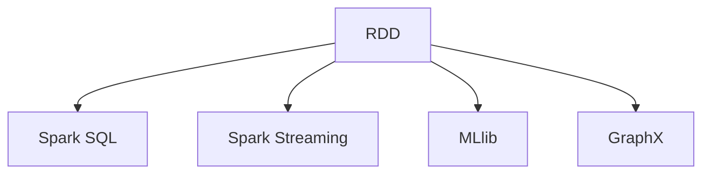

                 

## 1. 背景介绍

### 1.1 问题由来

随着大数据时代的到来，企业对海量数据的处理需求日益增加，传统的关系型数据库已无法满足这一需求。Apache Spark作为新一代的大数据处理引擎，其分布式计算能力和内存计算优势使其在大数据处理领域获得了广泛应用。无论是商业智能分析、实时流处理，还是机器学习任务，Spark都展现出了强大的处理能力。

### 1.2 问题核心关键点

Spark的独特优势在于其分布式计算模型和内存计算能力。Spark的核心组件RDD（弹性分布式数据集）实现了数据的分布式计算和高效的内存计算，能够在处理大数据时大幅提升效率。此外，Spark还提供了丰富的生态系统，包括Spark SQL、Spark Streaming、MLlib和GraphX等模块，支持大数据的各类处理需求。

### 1.3 问题研究意义

研究Spark的核心概念和实现原理，不仅有助于理解其工作机制，还能深入掌握其在实际应用中的使用方法和优化策略，从而提升大数据处理效率和系统性能。Spark的学习和应用对于大数据工程师、数据科学家以及需要处理大规模数据的应用开发人员来说都具有重要意义。

## 2. 核心概念与联系

### 2.1 核心概念概述

为了更好地理解Spark的分布式计算模型和核心功能，本节将介绍几个关键概念：

- **弹性分布式数据集 (RDD)**：Spark的核心数据抽象，支持数据的分布式计算和高效的内存计算，是Spark处理大规模数据的基础。
- **Spark SQL**：提供了一个高层次的数据处理接口，可以将SQL查询直接应用于大数据集上，支持交互式查询和实时分析。
- **Spark Streaming**：提供流式数据处理能力，支持实时数据流的大规模处理和分析。
- **MLlib**：Spark的机器学习库，提供了多种机器学习算法，支持特征提取、模型训练、预测等任务。
- **GraphX**：Spark的图形处理库，支持大规模图形数据的处理和分析。

这些核心概念之间的逻辑关系可以通过以下Mermaid流程图来展示：



这个流程图展示了我Spark的核心组件和它们之间的连接关系：

1. RDD作为基础数据抽象，提供数据的分布式计算和内存计算能力。
2. Spark SQL和Spark Streaming通过RDD实现实时和批处理数据的处理。
3. MLlib和GraphX通过RDD实现机器学习和图形处理的功能。

这些概念共同构成了Spark的计算框架，使其能够高效地处理大规模数据集。

## 3. 核心算法原理 & 具体操作步骤

### 3.1 算法原理概述

Spark的计算模型基于弹性分布式数据集 (RDD)，其核心思想是将数据分割成多个分区，然后并行处理每个分区。Spark通过将数据缓存在内存中，实现了高效的数据处理和计算。

Spark的计算过程可以简单地概括为以下几个步骤：

1. 数据分区（Partitioning）：将数据分割成多个分区，并行处理每个分区。
2. 数据转换（Transformation）：通过各种操作对数据进行转换，如map、filter、reduce等。
3. 数据聚合（Aggregation）：对分区内的数据进行聚合计算，如求和、计数等。
4. 数据持久化（Persistence）：将计算结果缓存在内存中，提高计算效率。

Spark的内存计算能力是其性能优化的重要手段。Spark使用内存中的数据缓存和优化算法，实现了快速的计算和数据传输。通过合理的分区和内存管理，Spark可以显著提高数据处理的效率。

### 3.2 算法步骤详解

以下是Spark数据处理的详细步骤：

**Step 1: 数据分区**

Spark将数据分割成多个分区，每个分区是一个可并行处理的数据集合。数据分区的目的是为了并行处理，提高计算效率。

Spark提供了多种分区策略，如Hash分区、范围分区等。Hash分区适用于键值对数据，范围分区适用于按照范围分区的数据。在实际应用中，选择合适的分区策略，可以显著提升Spark的性能。

**Step 2: 数据转换**

数据转换操作包括map、filter、reduce等，用于对数据进行处理和转换。这些操作可以通过RDD的API进行实现。

以map操作为例，假设有一个整数列表，可以通过map操作将其转换为另一个整数列表：

```python
data = [1, 2, 3, 4, 5]
result = data.map(lambda x: x * 2)
print(result.collect())  # [2, 4, 6, 8, 10]
```

**Step 3: 数据聚合**

数据聚合操作包括reduceByKey、reduce等，用于对分区内的数据进行聚合计算，如求和、计数等。这些操作可以通过RDD的API进行实现。

以reduce操作为例，假设有一个整数列表，可以通过reduce操作计算其总和：

```python
data = [1, 2, 3, 4, 5]
result = data.reduce(lambda x, y: x + y)
print(result)  # 15
```

**Step 4: 数据持久化**

数据持久化操作可以将计算结果缓存在内存中，提高计算效率。Spark提供了三种数据持久化级别：`MEMORY_ONLY`、`MEMORY_AND_DISK`、`DISK_ONLY`。

以`MEMORY_AND_DISK`为例，可以将计算结果缓存到内存中，同时将未使用的数据保存到磁盘中：

```python
data = [1, 2, 3, 4, 5]
result = data.map(lambda x: x * 2)
result.persist('MEMORY_AND_DISK')
print(result.collect())  # [2, 4, 6, 8, 10]
```

### 3.3 算法优缺点

Spark的优点包括：

1. **分布式计算**：Spark基于分布式计算模型，能够高效地处理大规模数据集。
2. **内存计算**：Spark使用内存中的数据缓存，显著提高了计算效率。
3. **丰富的API**：Spark提供了丰富的API和工具，支持大数据的各类处理需求。
4. **灵活性**：Spark支持多种数据源和存储格式，适应不同的数据处理场景。

Spark的缺点包括：

1. **资源消耗大**：Spark需要大量的内存和CPU资源，对于资源受限的环境可能不适用。
2. **学习曲线陡峭**：Spark的API和编程模型较为复杂，需要一定的学习成本。
3. **开发难度高**：Spark的开发和调试过程较为繁琐，需要具备一定的编程和数据处理经验。

### 3.4 算法应用领域

Spark的应用领域非常广泛，涵盖了大数据处理、机器学习、实时流处理等多个领域。以下是Spark在不同领域的应用示例：

- **大数据处理**：Spark支持大规模数据集的存储和处理，适用于数据仓库、数据湖等场景。
- **机器学习**：Spark的MLlib模块提供了多种机器学习算法，支持特征提取、模型训练、预测等任务。
- **实时流处理**：Spark Streaming模块支持实时流数据的处理和分析，适用于实时数据流应用。
- **图形处理**：Spark的GraphX模块支持大规模图形数据的处理和分析，适用于社交网络分析、推荐系统等场景。
- **数据可视化**：Spark可以与数据可视化工具如Tableau、PowerBI等结合，支持数据的可视化展示。

Spark的广泛应用，使其成为了大数据处理领域的重要工具，对于需要处理大规模数据的应用开发人员来说，学习Spark是一项必备技能。

## 4. 数学模型和公式 & 详细讲解  
### 4.1 数学模型构建

Spark的核心数据抽象RDD，可以表示为：

$$ RDD = \{p_1, p_2, ..., p_n\} $$

其中，$p_i$ 表示第$i$个分区，包含数据项$d_{i1}, d_{i2}, ..., d_{in}$。RDD支持多种操作，包括map、reduce、filter、join等。

Spark SQL和Spark Streaming通过RDD实现实时和批处理数据的处理。以Spark SQL为例，其查询表达式可以表示为：

$$ query = \sigma_{cond} \pi_{proj} \varphi_{groupBy} \psi_{join} \alpha_{limit} \beta_{order} $$

其中，$\sigma$表示筛选操作，$\pi$表示投影操作，$\varphi$表示分组操作，$\psi$表示连接操作，$\alpha$表示限制操作，$\beta$表示排序操作。

### 4.2 公式推导过程

以Spark的map操作为例，假设有一个整数列表，可以通过map操作将其转换为另一个整数列表：

$$ result = \{map(d_{i1}, f), map(d_{i2}, f), ..., map(d_{in}, f)\} $$

其中，$f$为map操作中的函数，$d_{ij}$表示第$i$个分区中的第$j$个数据项。

以Spark的reduce操作为例，假设有一个整数列表，可以通过reduce操作计算其总和：

$$ result = \sum_{i=1}^n reduce(d_{i1}, f, f, ..., f) $$

其中，$f$为reduce操作中的函数，$d_{ij}$表示第$i$个分区中的第$j$个数据项。

### 4.3 案例分析与讲解

假设有一个学生成绩列表，包含学生的姓名、科目和成绩信息：

| 姓名   | 科目 | 成绩 |
| ------ | ---- | ---- |
| 张三   | 语文 | 80   |
| 李四   | 数学 | 90   |
| 王五   | 英语 | 85   |

可以使用Spark的RDD操作进行数据处理，如筛选出所有科目的最高分和最低分：

```python
from pyspark import SparkContext, SparkConf
from pyspark.sql import SQLContext

conf = SparkConf().setMaster('local').setAppName('score analyze')
sc = SparkContext(conf=conf)
sqlContext = SQLContext(sc)

data = sc.parallelize([('张三', '语文', 80), ('李四', '数学', 90), ('王五', '英语', 85)])
df = sqlContext.createDataFrame(data, ['name', 'subject', 'score'])

# 筛选出所有科目的最高分和最低分
max_score = df.groupby('subject').agg({'score': 'max'})
min_score = df.groupby('subject').agg({'score': 'min'})
print(max_score.collect())  # [(语文, 80), (数学, 90), (英语, 85)]
print(min_score.collect())  # [(语文, 80), (数学, 90), (英语, 85)]
```

## 5. 项目实践：代码实例和详细解释说明
### 5.1 开发环境搭建

在进行Spark开发前，我们需要准备好开发环境。以下是使用Python进行Spark开发的流程：

1. 安装Spark：从官网下载并安装Spark，根据系统平台选择相应的安装包。
2. 配置Spark环境：设置Spark的配置文件（如spark-env.sh），指定Spark的安装路径、Java环境等。
3. 安装必要的库：Spark支持多种数据源和存储格式，需要安装相应的库和驱动程序。

完成上述步骤后，即可在本地启动Spark集群，开始Spark开发。

### 5.2 源代码详细实现

下面我们以Spark的RDD操作为例，给出使用Python进行Spark开发的代码实现。

首先，创建SparkContext和SQLContext：

```python
from pyspark import SparkContext, SparkConf
from pyspark.sql import SQLContext

conf = SparkConf().setMaster('local').setAppName('word count')
sc = SparkContext(conf=conf)
sqlContext = SQLContext(sc)
```

然后，定义RDD数据源，进行数据处理：

```python
data = sc.parallelize(['apple', 'banana', 'orange', 'apple', 'pear', 'banana', 'orange', 'pear'])
word_count = data.map(lambda x: (x, 1)).reduceByKey(lambda x, y: x + y)

result = word_count.collect()
for word, count in result:
    print(f"{word}: {count}")
```

这段代码实现了对字符串列表进行单词计数的操作。具体步骤如下：

1. 创建SparkContext和SQLContext。
2. 使用parallelize方法将字符串列表转换为RDD。
3. 使用map方法将每个字符串转换为键值对，键为单词，值为1。
4. 使用reduceByKey方法对键值对进行聚合，计算每个单词的计数。
5. 使用collect方法将结果输出到本地。

### 5.3 代码解读与分析

在Spark的RDD操作中，map和reduceByKey是两个常用的数据转换和聚合操作。map操作可以将数据转换为新的格式，而reduceByKey操作可以对分区内的数据进行聚合计算。

map操作支持多种函数，包括mapValues、mapPartitions、flatMap等。reduceByKey操作支持多种聚合函数，包括sum、count、min、max等。

通过合理使用map和reduceByKey操作，Spark可以高效地处理大规模数据集，实现复杂的计算和数据转换。

## 6. 实际应用场景

### 6.1 数据仓库构建

Spark在数据仓库构建中具有显著优势，能够高效地处理大规模数据集，支持快速查询和分析。

在实际应用中，可以通过Spark读取各种数据源（如HDFS、Hive、HBase等），对数据进行清洗、转换和聚合，最终构建数据仓库。Spark SQL提供了丰富的SQL查询功能，能够支持交互式查询和实时分析。

### 6.2 机器学习应用

Spark的MLlib模块提供了多种机器学习算法，支持特征提取、模型训练、预测等任务。

在实际应用中，可以通过Spark读取训练数据和测试数据，使用MLlib中的算法进行模型训练和预测。例如，使用逻辑回归算法进行分类任务：

```python
from pyspark.mllib.regression import LinearRegressionWithSGD

data = sc.parallelize([(1, 1.0), (2, 2.0), (3, 3.0), (4, 4.0)])
model = LinearRegressionWithSGD.train(data, iterations=5, lambda_=0.1)
predictions = model.predict([5, 6, 7, 8])
print(predictions)
```

### 6.3 实时流处理

Spark Streaming模块支持实时流数据的处理和分析，适用于实时数据流应用。

在实际应用中，可以使用Spark Streaming读取实时数据流，对数据进行实时处理和分析。例如，读取Kafka中的数据流，进行实时计数：

```python
from pyspark.streaming import StreamingContext

sc = SparkContext(appName="word count")
ssc = StreamingContext(sc, 1)

data = sc.parallelize(['apple', 'banana', 'orange', 'apple', 'pear', 'banana', 'orange', 'pear'])
rdd = ssc.socketTextStream('localhost', 9999)
word_count = rdd.flatMap(lambda line: line.split(" "))
result = word_count.map(lambda word: (word, 1)).reduceByKey(lambda x, y: x + y)

result.pprint()
```

### 6.4 未来应用展望

Spark的未来发展趋势包括：

1. **多云支持**：Spark将在更多云平台上部署，实现跨云无缝迁移。
2. **机器学习优化**：Spark将进一步优化机器学习算法，提升模型训练和预测的效率。
3. **实时流处理优化**：Spark将提升实时流处理的性能，支持更多数据源和存储格式。
4. **人工智能集成**：Spark将与更多AI技术结合，提供更强大的数据处理和分析能力。
5. **开源社区支持**：Spark将继续加强开源社区的支持，推动生态系统的发展和应用。

## 7. 工具和资源推荐
### 7.1 学习资源推荐

为了帮助开发者系统掌握Spark的理论基础和实践技巧，这里推荐一些优质的学习资源：

1. **Spark官方文档**：Spark的官方文档提供了丰富的学习资源和样例代码，是学习Spark的最佳入门材料。
2. **《大数据技术与应用》课程**：通过这门课程，可以系统学习Spark的基本概念和核心技术。
3. **《大数据处理实战》书籍**：该书深入浅出地介绍了Spark的实现原理和应用案例，是学习Spark的必读书籍。
4. **Hadoop、Spark、Hive大平台实战视频**：通过该视频，可以了解Spark在大数据平台中的应用和优化策略。
5. **Apache Spark Summit**：Apache Spark Conference是Spark社区的重要活动，汇集了全球的Spark专家和用户，提供了丰富的学习交流机会。

### 7.2 开发工具推荐

Spark提供了丰富的API和工具，支持大数据的各类处理需求。以下是几款常用的开发工具：

1. **PySpark**：Python语言的Spark API，支持Spark的各种功能，适用于大数据处理和分析。
2. **Scala**：Spark的官方语言，具有强大的并发编程能力和丰富的库支持，适用于大数据开发。
3. **Java**：Spark的官方语言，适用于企业级大数据应用。
4. **Spark Shell**：Spark的交互式命令行工具，方便进行数据测试和调试。
5. **Beam**：Google开源的大数据处理框架，与Spark兼容，适用于分布式数据处理。

### 7.3 相关论文推荐

Spark的研究成果和创新技术不断涌现，以下是几篇具有代表性的相关论文：

1. **Spark: Cluster Computing with Fault Tolerance**：Spark的原始论文，介绍了Spark的分布式计算模型和核心技术。
2. **Spark SQL: Distributed SQL Query Engine for Large-Scale Data Processing**：介绍Spark SQL的实现原理和应用场景。
3. **Spark Streaming: A Real-Time Processing Engine**：介绍Spark Streaming的实现原理和应用场景。
4. **Spark MLlib: Machine Learning Library for Spark**：介绍Spark的MLlib模块和机器学习算法。
5. **Spark GraphX: Graph Processing Library for Spark**：介绍Spark的GraphX模块和图形处理算法。

这些论文代表了大数据处理领域的最新研究成果，对于深入理解Spark的理论和实践具有重要意义。

## 8. 总结：未来发展趋势与挑战

### 8.1 总结

本文对Apache Spark的核心概念和实现原理进行了全面系统的介绍。首先阐述了Spark的核心组件和应用场景，明确了Spark在大数据处理中的独特优势。其次，从原理到实践，详细讲解了Spark的计算模型和核心功能，给出了Spark开发的全过程。同时，本文还探讨了Spark的未来发展趋势和面临的挑战，提出了未来研究的方向。

通过本文的系统梳理，可以看到，Spark作为大数据处理的重要工具，其分布式计算能力和内存计算优势使其在大数据处理领域具有不可替代的地位。Spark的学习和应用对于大数据工程师、数据科学家以及需要处理大规模数据的应用开发人员来说都具有重要意义。

### 8.2 未来发展趋势

展望未来，Spark的发展趋势包括：

1. **分布式计算优化**：Spark将继续优化分布式计算模型，提升数据处理的效率和稳定性。
2. **内存计算优化**：Spark将提升内存计算的性能，支持更多数据源和存储格式。
3. **机器学习优化**：Spark将进一步优化机器学习算法，提升模型训练和预测的效率。
4. **实时流处理优化**：Spark将提升实时流处理的性能，支持更多数据源和存储格式。
5. **人工智能集成**：Spark将与更多AI技术结合，提供更强大的数据处理和分析能力。

以上趋势凸显了Spark在处理大规模数据时的强大优势，对于需要处理大数据的应用开发人员来说，学习和掌握Spark将是一项必备技能。

### 8.3 面临的挑战

尽管Spark在大数据处理领域取得了显著成效，但在实际应用中也面临诸多挑战：

1. **资源消耗大**：Spark需要大量的内存和CPU资源，对于资源受限的环境可能不适用。
2. **学习曲线陡峭**：Spark的API和编程模型较为复杂，需要一定的学习成本。
3. **开发难度高**：Spark的开发和调试过程较为繁琐，需要具备一定的编程和数据处理经验。
4. **数据迁移困难**：Spark在不同云平台之间的迁移和互操作性还有待提升。

### 8.4 研究展望

未来的研究可以从以下几个方面进行突破：

1. **优化内存管理**：优化内存管理算法，减少内存使用，提高Spark的性能和稳定性。
2. **提升实时处理性能**：优化实时流处理算法，提升Spark Streaming的性能和稳定性。
3. **支持更多数据源**：支持更多数据源和存储格式，提升Spark的灵活性和适用性。
4. **增强机器学习功能**：进一步优化机器学习算法，提升Spark的机器学习能力。
5. **提高数据迁移能力**：提升Spark在不同云平台之间的迁移和互操作性，实现跨云无缝迁移。

这些研究方向将进一步推动Spark的发展，使其在处理大规模数据时发挥更大的作用，为大数据应用带来更多的可能性。

## 9. 附录：常见问题与解答

**Q1: 什么是Spark的RDD？**

A: RDD（弹性分布式数据集）是Spark的核心数据抽象，支持数据的分布式计算和高效的内存计算。RDD由多个分区组成，每个分区是一个可并行处理的数据集合。

**Q2: Spark的内存计算是如何实现的？**

A: Spark使用内存中的数据缓存，显著提高了计算效率。Spark支持内存中的数据持久化，通过缓存和更新机制，减少数据的重复计算和传输，从而提高计算效率。

**Q3: Spark的机器学习库MLlib有哪些功能？**

A: Spark的MLlib模块提供了多种机器学习算法，支持特征提取、模型训练、预测等任务。MLlib支持多种数据源和存储格式，支持大规模数据集的机器学习。

**Q4: 如何优化Spark的分布式计算？**

A: 优化Spark的分布式计算可以从以下几个方面入手：
1. 合理的分区策略，如Hash分区、范围分区等。
2. 合理的内存管理，减少内存使用和数据传输。
3. 优化计算算法，提高数据处理的效率和稳定性。

**Q5: 如何使用Spark进行实时流处理？**

A: 使用Spark Streaming模块，可以读取实时数据流，对数据进行实时处理和分析。Spark Streaming支持多种数据源和存储格式，如Kafka、HDFS等。

**Q6: Spark的未来发展方向是什么？**

A: Spark的未来发展方向包括：
1. 提升内存计算的性能，支持更多数据源和存储格式。
2. 优化分布式计算模型，提升数据处理的效率和稳定性。
3. 进一步优化机器学习算法，提升模型训练和预测的效率。
4. 支持更多数据源和存储格式，提升Spark的灵活性和适用性。
5. 增强机器学习功能，提供更强大的数据处理和分析能力。

通过这些研究方向和优化措施，Spark将继续在大数据处理领域发挥重要作用，为处理大规模数据提供更强大的工具。

