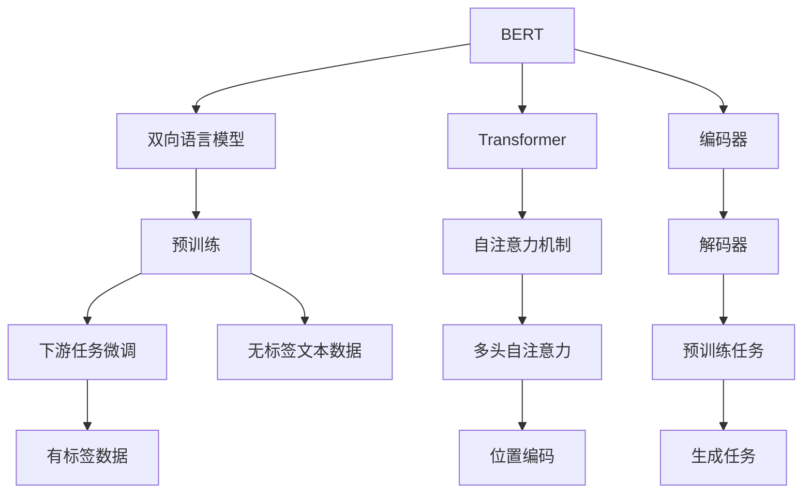

                 

# BERT vs GPT：双向vs单向语言模型

> 关键词：BERT, GPT, 双向语言模型, 单向语言模型, Transformer, 预训练, 微调, 自然语言处理(NLP), 深度学习, 注意力机制

## 1. 背景介绍

### 1.1 问题由来
自然语言处理（NLP）领域的技术发展日新月异，从传统的词袋模型到统计机器学习，再到近年来广受关注的深度学习模型。其中，基于Transformer的Transformer模型及其变体，如BERT、GPT等，在预训练语言模型的基础上，取得了令人瞩目的突破，显著提升了NLP任务的效果。这些大模型主要采用基于自注意力机制的Transformer网络结构，但它们在设计上存在一些差异，导致它们的性能和使用场景有所不同。BERT采用双向语言模型，而GPT则采用单向语言模型，两者的设计思路和应用效果各具特色。本文旨在深入探讨BERT与GPT的设计原理、算法步骤和应用领域，并对比两者的性能。

### 1.2 问题核心关键点
BERT与GPT的核心区别在于其语言模型的方向性。BERT是双向语言模型，能够同时考虑词语的前后文信息；而GPT则是单向语言模型，只考虑词语的后文信息。此外，两者的编码器结构、注意力机制、预训练任务和微调方法也有所不同。这些核心差异直接影响了它们在具体任务上的表现。

本文将详细对比BERT与GPT的设计原理和实现细节，通过数学公式和代码实例，帮助读者理解两者的不同点，并探讨它们在NLP任务中的应用场景和优缺点。

## 2. 核心概念与联系

### 2.1 核心概念概述

为了更好地理解BERT和GPT的差异，首先介绍几个关键概念：

- **双向语言模型(Bidirectional Language Model)**：在处理自然语言时，双向语言模型能够同时考虑词语的前后文信息，从而更好地理解语义。它通过同时前向和后向预测词语的下一步或上一步骤，从而能够捕捉词语间更丰富的关联信息。

- **单向语言模型(Unidirectional Language Model)**：单向语言模型只考虑词语的后文信息，通过逐个预测词语的下一个或前一个词语来构建语言模型。这种模型结构相对简单，但在处理一些需要前后文信息的NLP任务时，效果可能会稍差。

- **Transformer**：一种基于自注意力机制的深度学习模型，广泛用于NLP任务的建模。Transformer通过多头自注意力机制和位置编码，使得模型能够捕捉长距离的依赖关系，并且在训练过程中可以并行计算，提高训练效率。

- **BERT**：由Google开发的预训练语言模型，采用双向语言模型，能够从前后文信息中学习到丰富的语义表示。BERT通过在大规模无标签文本数据上进行预训练，学习到通用的语言表示，并在下游任务上进行微调，能够显著提升模型性能。

- **GPT**：由OpenAI开发的预训练语言模型，采用单向语言模型，能够根据前面的词语预测后面的词语。GPT通过自回归方式进行预训练，学习到语言生成的概率分布，在生成任务中表现优异。

这些核心概念之间的逻辑关系可以通过以下Mermaid流程图来展示：



这个流程图展示了BERT与GPT的核心概念及其之间的关系：

1. BERT基于双向语言模型，通过Transformer网络结构和预训练任务进行编码。
2. GPT采用单向语言模型，同样使用Transformer网络结构和预训练任务，但聚焦于语言生成任务。
3. 两者都在预训练阶段学习到通用的语言表示，并在下游任务上通过微调进行优化。
4. BERT的编码器结构与GPT类似，但双向语言模型使其能够更好地捕捉上下文信息。
5. GPT的解码器结构与BERT相同，但单向语言模型使其更擅长生成任务。
6. 两者都在预训练阶段使用了自注意力机制和位置编码，但GPT更加注重生成概率的建模。

这些概念共同构成了BERT和GPT的基础，使得它们在NLP任务中发挥各自的优势。

## 3. 核心算法原理 & 具体操作步骤
### 3.1 算法原理概述

BERT和GPT的算法原理主要体现在语言模型的构建、预训练任务的设计和下游任务的微调三个方面。下面分别介绍它们的设计思路和实现细节。

**BERT的算法原理**：
BERT通过双向语言模型来学习词语之间的语义关系。具体来说，它使用了Transformer网络结构，结合多头自注意力机制和位置编码，对输入的文本进行编码。BERT通过在大规模无标签文本数据上进行预训练，学习到通用的语言表示，并在下游任务上进行微调。

**GPT的算法原理**：
GPT通过单向语言模型来学习词语之间的生成关系。它同样使用Transformer网络结构，但聚焦于语言生成任务。GPT通过自回归方式进行预训练，学习到语言生成的概率分布，并在下游任务上进行微调。

### 3.2 算法步骤详解

**BERT的微调步骤**：
1. **数据预处理**：将文本数据进行分词、编码和padding，转化为模型所需的输入格式。
2. **预训练模型加载**：加载预训练的BERT模型，包括Transformer编码器和双向语言模型。
3. **微调模型训练**：在预训练模型的基础上，使用下游任务的标注数据进行微调，更新模型参数。
4. **评估模型性能**：在测试集上评估微调后模型的性能，输出评估结果。

**GPT的微调步骤**：
1. **数据预处理**：将文本数据进行分词、编码和padding，转化为模型所需的输入格式。
2. **预训练模型加载**：加载预训练的GPT模型，包括Transformer编码器和单向语言模型。
3. **微调模型训练**：在预训练模型的基础上，使用下游任务的标注数据进行微调，更新模型参数。
4. **评估模型性能**：在测试集上评估微调后模型的性能，输出评估结果。

### 3.3 算法优缺点

**BERT的优缺点**：
- **优点**：
  - 双向语言模型能够更好地捕捉词语之间的上下文关系，提升模型的语义理解能力。
  - 预训练任务丰富，能够学习到多种语言表示，适应性强。
  - 编码器结构灵活，可以适应不同的下游任务。

- **缺点**：
  - 双向语言模型的计算复杂度高，训练和推理速度较慢。
  - 参数量大，需要较大的计算资源。
  - 部分任务（如生成任务）可能表现不如GPT。

**GPT的优缺点**：
- **优点**：
  - 单向语言模型计算复杂度低，训练和推理速度快。
  - 生成任务表现优异，能够生成连贯、自然的文本。
  - 参数量适中，适合在计算资源有限的情况下进行部署。

- **缺点**：
  - 单向语言模型无法捕捉词语之间的上下文关系，可能导致语义理解的局限性。
  - 预训练任务单一，可能无法适应某些需要上下文信息的NLP任务。
  - 部分任务（如分类任务）可能表现不如BERT。

### 3.4 算法应用领域

**BERT的应用领域**：
- 文本分类：如情感分析、主题分类等。BERT能够从上下文信息中学习到更丰富的语义表示，提升分类性能。
- 命名实体识别：BERT能够更好地捕捉词语之间的上下文关系，识别出人名、地名等实体。
- 问答系统：BERT能够从上下文信息中学习到问题的语义表示，匹配最合适的答案。
- 机器翻译：BERT能够学习到源语言和目标语言之间的语义关系，提升翻译质量。
- 文本摘要：BERT能够从上下文信息中学习到关键句子的语义表示，生成简洁的摘要。

**GPT的应用领域**：
- 文本生成：如对话生成、文本补全、故事生成等。GPT能够生成连贯、自然的文本，适用于生成任务。
- 自然语言推理：GPT能够通过上下文信息推断出合理的推理结果。
- 翻译生成：GPT能够通过上下文信息生成目标语言的文本。
- 问答生成：GPT能够通过上下文信息生成问题对应的答案。

## 4. 数学模型和公式 & 详细讲解  
### 4.1 数学模型构建

这里以BERT为例，介绍其数学模型构建。BERT的数学模型包括预训练阶段和微调阶段。

**预训练阶段的数学模型**：
BERT的预训练模型通过在大规模无标签文本数据上进行自监督学习，学习到通用的语言表示。假设输入的文本序列为 $x = \{x_1, x_2, ..., x_n\}$，其中 $x_i$ 为第 $i$ 个词语。BERT通过Transformer编码器对文本进行编码，得到序列表示 $z = \{z_1, z_2, ..., z_n\}$。其中，$z_i = \text{Transformer}(x_i)$，$z$ 表示词语 $x$ 的语义表示。

**微调阶段的数学模型**：
在预训练的基础上，BERT通过下游任务的标注数据进行微调，更新模型参数。假设下游任务的标注数据为 $(x, y)$，其中 $x$ 为输入文本，$y$ 为标签。微调的目标是最大化任务损失函数 $\mathcal{L}$，使得模型能够更好地适应下游任务。

### 4.2 公式推导过程

以BERT为例，介绍其在微调阶段的具体公式推导过程。假设微调任务为分类任务，标签为 $y \in \{1, 2, ..., C\}$，其中 $C$ 为类别数。分类任务的目标是最小化交叉熵损失函数 $\ell(x, y)$：

$$
\ell(x, y) = -\sum_{c=1}^C y_c \log p(z, c)
$$

其中，$p(z, c)$ 表示模型在输入 $z$ 下预测标签为 $c$ 的概率。

BERT微调的优化目标是最小化损失函数 $\mathcal{L}$：

$$
\mathcal{L} = \frac{1}{N}\sum_{i=1}^N \ell(x_i, y_i)
$$

其中，$N$ 为训练样本数。

通过反向传播算法，更新模型参数 $\theta$：

$$
\theta \leftarrow \theta - \eta \nabla_{\theta}\mathcal{L}(\theta)
$$

其中，$\eta$ 为学习率，$\nabla_{\theta}\mathcal{L}(\theta)$ 为损失函数对模型参数的梯度。

### 4.3 案例分析与讲解

以文本分类任务为例，介绍BERT微调的案例分析。假设训练集为 $\{(x_1, y_1), (x_2, y_2), ..., (x_N, y_N)\}$，其中 $x_i$ 为输入文本，$y_i$ 为标签。在微调阶段，通过反向传播算法更新BERT模型的参数，最小化交叉熵损失函数：

$$
\mathcal{L} = -\frac{1}{N}\sum_{i=1}^N \sum_{c=1}^C y_{i,c} \log p(z_i, c)
$$

其中，$y_{i,c}$ 表示第 $i$ 个样本的第 $c$ 个类别的标签。

假设训练样本 $x_i$ 和标签 $y_i$ 如下：

| $x_i$ | $y_i$ |
| --- | --- |
| "这是一篇关于BERT的文章" | 1 |

假设BERT的预训练模型已经加载，编码器参数为 $\theta$。假设编码器输出表示为 $z_i = \text{Transformer}(x_i; \theta)$，分类器参数为 $\phi$，分类器输出为 $p(z_i; \phi)$。微调的目标是最小化交叉熵损失函数：

$$
\mathcal{L} = -y_i \log p(z_i; \phi)
$$

通过反向传播算法，更新分类器参数 $\phi$ 和编码器参数 $\theta$：

$$
\phi \leftarrow \phi - \eta \nabla_{\phi}\mathcal{L}(\phi)
$$
$$
\theta \leftarrow \theta - \eta \nabla_{\theta}\mathcal{L}(\theta)
$$

其中，$\nabla_{\phi}\mathcal{L}(\phi)$ 和 $\nabla_{\theta}\mathcal{L}(\theta)$ 分别为分类器和编码器的损失函数对参数的梯度。

## 5. 项目实践：代码实例和详细解释说明
### 5.1 开发环境搭建

在进行BERT和GPT的微调实践前，我们需要准备好开发环境。以下是使用Python进行PyTorch开发的环境配置流程：

1. 安装Anaconda：从官网下载并安装Anaconda，用于创建独立的Python环境。

2. 创建并激活虚拟环境：
```bash
conda create -n pytorch-env python=3.8 
conda activate pytorch-env
```

3. 安装PyTorch：根据CUDA版本，从官网获取对应的安装命令。例如：
```bash
conda install pytorch torchvision torchaudio cudatoolkit=11.1 -c pytorch -c conda-forge
```

4. 安装Transformers库：
```bash
pip install transformers
```

5. 安装各类工具包：
```bash
pip install numpy pandas scikit-learn matplotlib tqdm jupyter notebook ipython
```

完成上述步骤后，即可在`pytorch-env`环境中开始BERT和GPT的微调实践。

### 5.2 源代码详细实现

这里我们以文本分类任务为例，给出使用Transformers库对BERT模型进行微调的PyTorch代码实现。

首先，定义BERT分类任务的模型：

```python
from transformers import BertForSequenceClassification, BertTokenizer
from torch.utils.data import Dataset, DataLoader

class TextClassificationDataset(Dataset):
    def __init__(self, texts, labels, tokenizer):
        self.texts = texts
        self.labels = labels
        self.tokenizer = tokenizer

    def __len__(self):
        return len(self.texts)

    def __getitem__(self, item):
        text = self.texts[item]
        label = self.labels[item]
        encoding = self.tokenizer(text, truncation=True, padding='max_length', max_length=128)
        input_ids = encoding['input_ids']
        attention_mask = encoding['attention_mask']
        return {'input_ids': input_ids, 'attention_mask': attention_mask, 'labels': label}

tokenizer = BertTokenizer.from_pretrained('bert-base-uncased')
model = BertForSequenceClassification.from_pretrained('bert-base-uncased', num_labels=2)
```

然后，定义训练和评估函数：

```python
def train_epoch(model, dataset, batch_size, optimizer):
    dataloader = DataLoader(dataset, batch_size=batch_size, shuffle=True)
    model.train()
    epoch_loss = 0
    for batch in dataloader:
        input_ids = batch['input_ids'].to(device)
        attention_mask = batch['attention_mask'].to(device)
        labels = batch['labels'].to(device)
        model.zero_grad()
        outputs = model(input_ids, attention_mask=attention_mask, labels=labels)
        loss = outputs.loss
        epoch_loss += loss.item()
        loss.backward()
        optimizer.step()
    return epoch_loss / len(dataloader)

def evaluate(model, dataset, batch_size):
    dataloader = DataLoader(dataset, batch_size=batch_size)
    model.eval()
    preds, labels = [], []
    with torch.no_grad():
        for batch in dataloader:
            input_ids = batch['input_ids'].to(device)
            attention_mask = batch['attention_mask'].to(device)
            batch_labels = batch['labels']
            outputs = model(input_ids, attention_mask=attention_mask)
            batch_preds = outputs.logits.argmax(dim=1).to('cpu').tolist()
            batch_labels = batch_labels.to('cpu').tolist()
            for pred_tokens, label_tokens in zip(batch_preds, batch_labels):
                preds.append(pred_tokens)
                labels.append(label_tokens)
    print(classification_report(labels, preds))
```

最后，启动训练流程并在测试集上评估：

```python
epochs = 5
batch_size = 16

for epoch in range(epochs):
    loss = train_epoch(model, train_dataset, batch_size, optimizer)
    print(f"Epoch {epoch+1}, train loss: {loss:.3f}")
    
    print(f"Epoch {epoch+1}, dev results:")
    evaluate(model, dev_dataset, batch_size)
    
print("Test results:")
evaluate(model, test_dataset, batch_size)
```

以上就是使用PyTorch对BERT进行文本分类任务微调的完整代码实现。可以看到，得益于Transformers库的强大封装，我们可以用相对简洁的代码完成BERT模型的加载和微调。

## 6. 实际应用场景
### 6.1 智能客服系统

基于BERT的智能客服系统可以广泛应用于各类企业的客户服务部门。传统的客服系统需要配备大量的人力资源，高峰期响应速度较慢，且服务质量难以保证。而基于BERT的智能客服系统，可以通过预先训练和微调，学习到丰富的语义表示，实现自动化的客户服务，提高客户满意度。

在技术实现上，可以收集企业内部的历史客服对话记录，将其标注为不同的意图和问题类型。通过微调BERT模型，使其能够理解客户的意图，匹配最合适的回答。对于客户提出的新问题，可以接入检索系统实时搜索相关内容，动态生成回答。如此构建的智能客服系统，能够提升客户咨询体验和问题解决效率，降低人工成本。

### 6.2 金融舆情监测

金融机构需要实时监测市场舆论动向，以便及时应对负面信息传播，规避金融风险。传统的舆情监测方式依赖于人工分析和报告，成本高、效率低。而基于BERT的文本分类和情感分析技术，能够自动对市场新闻、评论等文本数据进行分类和情感分析，实时监测市场情绪变化，及时预警风险，帮助金融机构快速应对潜在风险。

具体而言，可以收集金融领域相关的新闻、报道、评论等文本数据，并对其进行情感标注和主题标注。在此基础上对BERT模型进行微调，使其能够自动判断文本属于何种主题，情感倾向是正面、中性还是负面。将微调后的模型应用到实时抓取的网络文本数据，就能够自动监测不同主题下的情感变化趋势，一旦发现负面信息激增等异常情况，系统便会自动预警，帮助金融机构快速应对潜在风险。

### 6.3 个性化推荐系统

当前的推荐系统往往只依赖用户的历史行为数据进行物品推荐，无法深入理解用户的真实兴趣偏好。基于BERT的个性化推荐系统可以更好地挖掘用户行为背后的语义信息，从而提供更精准、多样的推荐内容。

在实践中，可以收集用户浏览、点击、评论、分享等行为数据，提取和用户交互的物品标题、描述、标签等文本内容。将文本内容作为模型输入，用户的后续行为（如是否点击、购买等）作为监督信号，在此基础上微调BERT模型。微调后的模型能够从文本内容中准确把握用户的兴趣点。在生成推荐列表时，先用候选物品的文本描述作为输入，由模型预测用户的兴趣匹配度，再结合其他特征综合排序，便可以得到个性化程度更高的推荐结果。

### 6.4 未来应用展望

随着BERT和GPT模型的不断发展，基于微调范式将在更多领域得到应用，为传统行业带来变革性影响。

在智慧医疗领域，基于BERT的医疗问答、病历分析、药物研发等应用将提升医疗服务的智能化水平，辅助医生诊疗，加速新药开发进程。

在智能教育领域，微调技术可应用于作业批改、学情分析、知识推荐等方面，因材施教，促进教育公平，提高教学质量。

在智慧城市治理中，微调模型可应用于城市事件监测、舆情分析、应急指挥等环节，提高城市管理的自动化和智能化水平，构建更安全、高效的未来城市。

此外，在企业生产、社会治理、文娱传媒等众多领域，基于大模型微调的人工智能应用也将不断涌现，为NLP技术带来全新的突破。随着预训练语言模型和微调方法的持续演进，相信NLP技术将在更广阔的应用领域大放异彩，深刻影响人类的生产生活方式。

## 7. 工具和资源推荐
### 7.1 学习资源推荐

为了帮助开发者系统掌握BERT和GPT的设计原理和实践技巧，这里推荐一些优质的学习资源：

1. 《Transformer from the Inside to the Outside》：由Hugging Face的Jake Eliot所写，全面介绍了Transformer和BERT模型的设计思想和实现细节，适合深度学习初学者。

2. CS224N《Natural Language Processing with Deep Learning》课程：斯坦福大学开设的NLP明星课程，涵盖了BERT和GPT等大模型的设计与实现，适合系统学习NLP和深度学习技术。

3. 《Natural Language Processing with Transformers》书籍：由Google的Jurafsky和Martin所写，系统介绍了Transformer和GPT等大模型的应用，包括微调方法在内的诸多范式。

4. Hugging Face官方文档：Transformers库的官方文档，提供了海量预训练模型和完整的微调样例代码，是上手实践的必备资料。

5. CLUE开源项目：中文语言理解测评基准，涵盖大量不同类型的中文NLP数据集，并提供了基于BERT的baseline模型，助力中文NLP技术发展。

通过对这些资源的学习实践，相信你一定能够快速掌握BERT和GPT模型的设计原理，并用于解决实际的NLP问题。

### 7.2 开发工具推荐

高效的开发离不开优秀的工具支持。以下是几款用于BERT和GPT微调开发的常用工具：

1. PyTorch：基于Python的开源深度学习框架，灵活动态的计算图，适合快速迭代研究。大部分预训练语言模型都有PyTorch版本的实现。

2. TensorFlow：由Google主导开发的开源深度学习框架，生产部署方便，适合大规模工程应用。同样有丰富的预训练语言模型资源。

3. Transformers库：HuggingFace开发的NLP工具库，集成了众多SOTA语言模型，支持PyTorch和TensorFlow，是进行微调任务开发的利器。

4. Weights & Biases：模型训练的实验跟踪工具，可以记录和可视化模型训练过程中的各项指标，方便对比和调优。与主流深度学习框架无缝集成。

5. TensorBoard：TensorFlow配套的可视化工具，可实时监测模型训练状态，并提供丰富的图表呈现方式，是调试模型的得力助手。

6. Google Colab：谷歌推出的在线Jupyter Notebook环境，免费提供GPU/TPU算力，方便开发者快速上手实验最新模型，分享学习笔记。

合理利用这些工具，可以显著提升BERT和GPT微调的开发效率，加快创新迭代的步伐。

### 7.3 相关论文推荐

BERT和GPT模型的发展源于学界的持续研究。以下是几篇奠基性的相关论文，推荐阅读：

1. Attention is All You Need：提出Transformer结构，开启了NLP领域的预训练大模型时代。

2. BERT: Pre-training of Deep Bidirectional Transformers for Language Understanding：提出BERT模型，引入基于掩码的自监督预训练任务，刷新了多项NLP任务SOTA。

3. Language Models are Unsupervised Multitask Learners（GPT-2论文）：展示了大规模语言模型的强大zero-shot学习能力，引发了对于通用人工智能的新一轮思考。

4. Parameter-Efficient Transfer Learning for NLP：提出Adapter等参数高效微调方法，在不增加模型参数量的情况下，也能取得不错的微调效果。

5. Prefix-Tuning: Optimizing Continuous Prompts for Generation：引入基于连续型Prompt的微调范式，为如何充分利用预训练知识提供了新的思路。

6. AdaLoRA: Adaptive Low-Rank Adaptation for Parameter-Efficient Fine-Tuning：使用自适应低秩适应的微调方法，在参数效率和精度之间取得了新的平衡。

这些论文代表了大语言模型微调技术的发展脉络。通过学习这些前沿成果，可以帮助研究者把握学科前进方向，激发更多的创新灵感。

## 8. 总结：未来发展趋势与挑战

### 8.1 总结

本文对BERT与GPT的设计原理和微调方法进行了全面系统的介绍。首先阐述了两者的核心区别：双向语言模型与单向语言模型，介绍了Transformer网络结构、自注意力机制和位置编码等关键概念。其次，通过数学公式和代码实例，详细讲解了BERT和GPT的微调过程，包括数据预处理、模型加载、优化算法、损失函数等关键步骤。最后，对比了BERT与GPT在不同NLP任务上的应用效果，探讨了它们的优缺点和未来发展趋势。

通过本文的系统梳理，可以看到，BERT与GPT在大语言模型的预训练和微调中各自发挥着重要作用，它们的设计思路和实现方法为我们提供了丰富的选择。合理利用BERT和GPT，能够高效地解决多种NLP任务，推动NLP技术的发展。

### 8.2 未来发展趋势

展望未来，BERT和GPT将继续在NLP领域中发挥重要作用，其发展趋势主要体现在以下几个方面：

1. 模型规模持续增大。随着算力成本的下降和数据规模的扩张，预训练语言模型的参数量还将持续增长。超大规模语言模型蕴含的丰富语言知识，有望支撑更加复杂多变的下游任务微调。

2. 微调方法日趋多样。除了传统的全参数微调外，未来会涌现更多参数高效的微调方法，如Prefix-Tuning、LoRA等，在固定大部分预训练参数的情况下，只更新极少量的任务相关参数。同时，开发更加参数高效的微调方法，在固定大部分预训练参数的情况下，只更新极少量的任务相关参数。

3. 持续学习成为常态。随着数据分布的不断变化，微调模型也需要持续学习新知识以保持性能。如何在不遗忘原有知识的同时，高效吸收新样本信息，将成为重要的研究课题。

4. 标注样本需求降低。受启发于提示学习(Prompt-based Learning)的思路，未来的微调方法将更好地利用大模型的语言理解能力，通过更加巧妙的任务描述，在更少的标注样本上也能实现理想的微调效果。

5. 多模态微调崛起。当前的微调主要聚焦于纯文本数据，未来会进一步拓展到图像、视频、语音等多模态数据微调。多模态信息的融合，将显著提升语言模型对现实世界的理解和建模能力。

6. 模型通用性增强。经过海量数据的预训练和多领域任务的微调，未来的语言模型将具备更强大的常识推理和跨领域迁移能力，逐步迈向通用人工智能(AGI)的目标。

以上趋势凸显了BERT和GPT模型的广阔前景。这些方向的探索发展，必将进一步提升NLP系统的性能和应用范围，为人类认知智能的进化带来深远影响。

### 8.3 面临的挑战

尽管BERT和GPT在NLP领域取得了显著进展，但在迈向更加智能化、普适化应用的过程中，它们仍面临诸多挑战：

1. 标注成本瓶颈。尽管微调大大降低了标注数据的需求，但对于长尾应用场景，难以获得充足的高质量标注数据，成为制约微调性能的瓶颈。如何进一步降低微调对标注样本的依赖，将是一大难题。

2. 模型鲁棒性不足。当前微调模型面对域外数据时，泛化性能往往大打折扣。对于测试样本的微小扰动，微调模型的预测也容易发生波动。如何提高微调模型的鲁棒性，避免灾难性遗忘，还需要更多理论和实践的积累。

3. 推理效率有待提高。大规模语言模型虽然精度高，但在实际部署时往往面临推理速度慢、内存占用大等效率问题。如何在保证性能的同时，简化模型结构，提升推理速度，优化资源占用，将是重要的优化方向。

4. 可解释性亟需加强。当前微调模型更像是"黑盒"系统，难以解释其内部工作机制和决策逻辑。对于医疗、金融等高风险应用，算法的可解释性和可审计性尤为重要。如何赋予微调模型更强的可解释性，将是亟待攻克的难题。

5. 安全性有待保障。预训练语言模型难免会学习到有偏见、有害的信息，通过微调传递到下游任务，产生误导性、歧视性的输出，给实际应用带来安全隐患。如何从数据和算法层面消除模型偏见，避免恶意用途，确保输出的安全性，也将是重要的研究课题。

6. 知识整合能力不足。现有的微调模型往往局限于任务内数据，难以灵活吸收和运用更广泛的先验知识。如何让微调过程更好地与外部知识库、规则库等专家知识结合，形成更加全面、准确的信息整合能力，还有很大的想象空间。

正视BERT和GPT面临的这些挑战，积极应对并寻求突破，将是大规模语言模型微调技术迈向成熟的必由之路。相信随着学界和产业界的共同努力，这些挑战终将一一被克服，大规模语言模型微调技术必将在构建人机协同的智能时代中扮演越来越重要的角色。

### 8.4 研究展望

面对BERT和GPT模型的发展方向，未来的研究需要在以下几个方面寻求新的突破：

1. 探索无监督和半监督微调方法。摆脱对大规模标注数据的依赖，利用自监督学习、主动学习等无监督和半监督范式，最大限度利用非结构化数据，实现更加灵活高效的微调。

2. 研究参数高效和计算高效的微调范式。开发更加参数高效的微调方法，在固定大部分预训练参数的同时，只更新极少量的任务相关参数。同时优化微调模型的计算图，减少前向传播和反向传播的资源消耗，实现更加轻量级、实时性的部署。

3. 融合因果和对比学习范式。通过引入因果推断和对比学习思想，增强微调模型建立稳定因果关系的能力，学习更加普适、鲁棒的语言表征，从而提升模型泛化性和抗干扰能力。

4. 引入更多先验知识。将符号化的先验知识，如知识图谱、逻辑规则等，与神经网络模型进行巧妙融合，引导微调过程学习更准确、合理的语言模型。同时加强不同模态数据的整合，实现视觉、语音等多模态信息与文本信息的协同建模。

5. 结合因果分析和博弈论工具。将因果分析方法引入微调模型，识别出模型决策的关键特征，增强输出解释的因果性和逻辑性。借助博弈论工具刻画人机交互过程，主动探索并规避模型的脆弱点，提高系统稳定性。

6. 纳入伦理道德约束。在模型训练目标中引入伦理导向的评估指标，过滤和惩罚有偏见、有害的输出倾向。同时加强人工干预和审核，建立模型行为的监管机制，确保输出符合人类价值观和伦理道德。

这些研究方向的探索，必将引领BERT和GPT模型微调技术迈向更高的台阶，为构建安全、可靠、可解释、可控的智能系统铺平道路。面向未来，BERT和GPT模型微调技术还需要与其他人工智能技术进行更深入的融合，如知识表示、因果推理、强化学习等，多路径协同发力，共同推动自然语言理解和智能交互系统的进步。只有勇于创新、敢于突破，才能不断拓展语言模型的边界，让智能技术更好地造福人类社会。

## 9. 附录：常见问题与解答

**Q1：BERT与GPT在预训练阶段有何不同？**

A: BERT采用双向语言模型进行预训练，而GPT采用单向语言模型。双向语言模型能够同时考虑词语的前后文信息，学习到更丰富的语义表示。单向语言模型只考虑词语的后文信息，训练效率更高，但可能无法捕捉词语之间的上下文关系。

**Q2：BERT与GPT在微调阶段有何不同？**

A: BERT在微调阶段通过分类任务进行训练，最大化交叉熵损失函数；GPT通过语言生成任务进行训练，最大化自回归损失函数。BERT更适用于需要理解上下文信息的分类和命名实体识别等任务，GPT则更适用于生成任务，如对话生成、文本补全等。

**Q3：BERT与GPT在推理阶段有何不同？**

A: BERT在推理阶段可以同时考虑词语的前后文信息，输出更准确的上下文语义表示；GPT只能考虑词语的后文信息，输出更连贯的文本。BERT更适合需要理解上下文信息的推理任务，如问答系统、情感分析等；GPT更适合生成连贯、自然的文本，如对话生成、文本补全等。

**Q4：BERT与GPT在实际应用中有哪些优缺点？**

A: BERT的优点是双向语言模型能够更好地捕捉词语之间的上下文关系，提升模型的语义理解能力。BERT适用于需要理解上下文信息的分类和命名实体识别等任务，但在生成任务中表现不如GPT。BERT的缺点是双向语言模型计算复杂度高，训练和推理速度较慢，参数量大。

GPT的优点是单向语言模型训练效率高，能够生成连贯、自然的文本，适用于生成任务。GPT适用于对话生成、文本补全等任务，但在需要理解上下文信息的分类和命名实体识别等任务中表现不如BERT。GPT的缺点是单向语言模型无法捕捉词语之间的上下文关系，可能导致语义理解的局限性。

综上所述，BERT和GPT在大语言模型的预训练和微调中各自发挥着重要作用，它们的设计思路和实现方法为我们提供了丰富的选择。合理利用BERT和GPT，能够高效地解决多种NLP任务，推动NLP技术的发展。

---

作者：禅与计算机程序设计艺术 / Zen and the Art of Computer Programming

