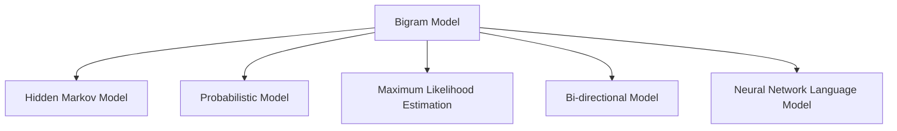

                 

# Bigram语言模型：语言建模基础

> 关键词：大语言模型(Bigram Model), 语言建模, 隐马尔可夫模型(HMM), 概率模型, 最大似然估计(MLE), 双向语言模型(Bi-directional Model), 神经网络语言模型(ANN Model), 自然语言处理(NLP)

## 1. 背景介绍

### 1.1 问题由来
语言建模是自然语言处理(NLP)中的一项核心任务，旨在通过统计或机器学习的方法，估计给定一段文本序列中每个单词出现的概率分布。这种概率分布可以用于许多NLP应用，如机器翻译、文本生成、语音识别等。语言模型的好坏，直接决定了这些应用的效果和效率。

近年来，随着深度学习技术的发展，基于神经网络的模型（如RNN、LSTM、Transformer等）逐渐成为语言建模的主要手段。然而，这些模型虽然效果显著，但参数量庞大，训练和推理成本较高。相比之下，基于统计概率的语言建模方法（如Bigram、N-gram）则具有参数量少、计算效率高、易于部署等优势。本文将重点探讨Bigram语言模型的原理与应用，为NLP研究者和工程师提供参考。

### 1.2 问题核心关键点
Bigram语言模型是一种经典的概率模型，通过统计相邻单词对出现的概率，来刻画语言的规律。其核心在于利用文本中单词对之间的关联性，进行语言预测和生成。

Bigram模型的核心思想是：假设给定一段文本序列，其每个单词出现的概率只与其前一个单词有关。即：

$$ P(w_t | w_{t-1}) $$

其中，$w_t$ 表示文本序列中第 $t$ 个单词，$w_{t-1}$ 表示其前一个单词。模型利用历史文本数据，通过最大似然估计（MLE）或其他概率统计方法，学习每个单词对出现的概率分布。

Bigram模型的优点包括：

- 参数量少，计算效率高
- 模型简单，易于理解和实现
- 可以用于预测和生成文本，具有应用广泛性

但同时，其局限性也不容忽视：

- 假设过于简单，无法捕捉到长距离的依赖关系
- 容易受数据分布不均的影响，导致预测不准确
- 对于未见过的单词对，无法提供概率估计

尽管存在这些局限性，但Bigram模型在许多实际应用中依然发挥着重要作用，特别是在一些简单场景下。本文将详细阐述Bigram语言模型的原理和应用，力求为读者提供清晰的理解。

## 2. 核心概念与联系

### 2.1 核心概念概述

为更好地理解Bigram语言模型的原理和应用，本文将介绍几个密切相关的核心概念：

- Bigram语言模型（Bigram Model）：通过统计文本中相邻单词对的概率分布，来刻画语言的规律。是语言建模中最基础的模型之一。
- 隐马尔可夫模型（Hidden Markov Model, HMM）：一种常用的概率模型，常用于自然语言处理和语音识别等领域，利用状态转移和观测概率进行序列预测。
- 概率模型（Probabilistic Model）：通过统计数据，估计模型参数，用于描述随机现象的模型。
- 最大似然估计（Maximum Likelihood Estimation, MLE）：一种常用的参数估计方法，通过最大化似然函数，求解模型参数。
- 双向语言模型（Bi-directional Model）：考虑文本中前后单词对的影响，提高模型的预测准确性。
- 神经网络语言模型（Neural Network Language Model, ANN Model）：基于深度神经网络的语言模型，具有更好的性能和泛化能力。

这些概念之间的逻辑关系可以通过以下Mermaid流程图来展示：



这个流程图展示了大语言模型（Bigram）与其它核心概念的关联关系：

1. Bigram模型作为最基础的模型，利用隐马尔可夫模型进行序列预测。
2. Bigram模型基于概率模型，通过最大似然估计求解模型参数。
3. 双向语言模型考虑了文本中前后单词对的影响，提高了模型的预测准确性。
4. 神经网络语言模型在大语言模型的基础上，利用深度神经网络，提升了模型的性能和泛化能力。

这些概念共同构成了语言建模的基本框架，使得我们可以通过多种方法进行文本序列的预测和生成。

## 3. 核心算法原理 & 具体操作步骤

### 3.1 算法原理概述

Bigram语言模型的核心思想是，通过统计文本中相邻单词对的概率分布，来刻画语言的规律。其具体流程如下：

1. 收集文本数据，统计单词对的出现频率。
2. 根据统计结果，构建单词对的概率分布模型。
3. 利用模型，进行单词对的概率预测。

具体而言，假设给定一段文本 $T$，包含 $n$ 个单词 $w_1, w_2, ..., w_n$，则Bigram模型的基本形式为：

$$ P(w_t | w_{t-1}) = \frac{C(w_t, w_{t-1})}{C(w_{t-1})} $$

其中，$C(w_t, w_{t-1})$ 表示单词对 $w_t$ 和 $w_{t-1}$ 同时出现的次数，$C(w_{t-1})$ 表示单词 $w_{t-1}$ 出现的次数。$P(w_t | w_{t-1})$ 即为给定前一个单词 $w_{t-1}$，单词 $w_t$ 出现的概率。

### 3.2 算法步骤详解

Bigram语言模型的训练和应用一般包括以下几个关键步骤：

**Step 1: 数据预处理**

首先，需要收集并预处理文本数据，统计单词对的出现次数。具体步骤如下：

1. 将文本分词，去除停用词、标点等噪声。
2. 对文本进行标准化处理，如小写化、分词等。
3. 统计文本中每个单词对的出现次数，生成频率矩阵。

**Step 2: 模型训练**

接下来，根据频率矩阵，训练Bigram模型。具体步骤如下：

1. 计算每个单词对 $(w_{t-1}, w_t)$ 的频率 $C(w_t, w_{t-1})$。
2. 计算每个单词 $w_{t-1}$ 的频率 $C(w_{t-1})$。
3. 根据频率矩阵，构建Bigram模型的参数矩阵 $P(w_t | w_{t-1})$。

**Step 3: 预测和生成**

训练好Bigram模型后，即可用于单词对的预测和生成。具体步骤如下：

1. 给定前一个单词 $w_{t-1}$，根据Bigram模型计算单词 $w_t$ 出现的概率 $P(w_t | w_{t-1})$。
2. 根据概率分布，选择出现概率最大的单词 $w_t$，进行文本生成。

**Step 4: 应用场景**

Bigram模型可以用于多种NLP应用，如文本分类、机器翻译、自动摘要等。例如，在机器翻译中，可以利用Bigram模型进行单词对的翻译，提高翻译的准确性；在自动摘要中，可以利用Bigram模型进行关键句的筛选，提高摘要的质量。

### 3.3 算法优缺点

Bigram语言模型具有以下优点：

- 参数量少，计算效率高
- 模型简单，易于理解和实现
- 可以用于预测和生成文本，具有应用广泛性

同时，其局限性也不容忽视：

- 假设过于简单，无法捕捉到长距离的依赖关系
- 容易受数据分布不均的影响，导致预测不准确
- 对于未见过的单词对，无法提供概率估计

尽管存在这些局限性，但Bigram模型在许多实际应用中依然发挥着重要作用，特别是在一些简单场景下。

### 3.4 算法应用领域

Bigram语言模型在NLP领域有广泛的应用，例如：

- 文本分类：通过统计单词对的概率分布，进行文本分类任务。
- 机器翻译：利用Bigram模型进行单词对的翻译，提高翻译的准确性。
- 自动摘要：通过统计文本中关键句的概率分布，进行自动摘要任务。
- 语音识别：利用Bigram模型进行语音识别任务，提高识别准确性。
- 信息检索：通过统计查询和文档中的单词对，提高信息检索的效果。

除了上述这些经典应用外，Bigram模型还被创新性地应用到更多场景中，如文本生成、情感分析、命名实体识别等，为NLP技术带来了新的突破。

## 4. 数学模型和公式 & 详细讲解  
### 4.1 数学模型构建

本节将使用数学语言对Bigram语言模型的训练和预测过程进行严格刻画。

假设文本 $T$ 包含 $n$ 个单词 $w_1, w_2, ..., w_n$，则Bigram模型的基本形式为：

$$ P(w_t | w_{t-1}) = \frac{C(w_t, w_{t-1})}{C(w_{t-1})} $$

其中，$C(w_t, w_{t-1})$ 表示单词对 $(w_{t-1}, w_t)$ 出现的次数，$C(w_{t-1})$ 表示单词 $w_{t-1}$ 出现的次数。

根据统计学原理，可以使用最大似然估计（MLE）方法求解Bigram模型参数。最大似然估计的基本思想是，通过最大化训练样本的似然函数，求解模型参数。对于Bigram模型，似然函数为：

$$ L(\theta) = \prod_{t=2}^n P(w_t | w_{t-1}) = \prod_{t=2}^n \frac{C(w_t, w_{t-1})}{C(w_{t-1})} $$

其中，$\theta$ 表示模型参数，包括所有单词对的概率分布。

对数似然函数为：

$$ \log L(\theta) = \sum_{t=2}^n \log \frac{C(w_t, w_{t-1})}{C(w_{t-1})} $$

通过最大化对数似然函数，可以求解Bigram模型的参数。

### 4.2 公式推导过程

根据最大似然估计原理，Bigram模型的参数求解过程如下：

$$ \hat{\theta} = \mathop{\arg\min}_{\theta} \sum_{t=2}^n \log \frac{C(w_t, w_{t-1})}{C(w_{t-1})} $$

简化后，得到：

$$ \hat{\theta} = \mathop{\arg\min}_{\theta} \sum_{t=2}^n -\log C(w_{t-1}) + \log C(w_t, w_{t-1}) $$

即：

$$ \hat{\theta} = \mathop{\arg\min}_{\theta} \sum_{t=2}^n \log C(w_t, w_{t-1}) - \log C(w_{t-1}) $$

上式即为Bigram模型的参数求解公式。

通过求解上述公式，可以得到Bigram模型的参数 $\hat{\theta}$，用于进行文本序列的预测和生成。

### 4.3 案例分析与讲解

假设有一段文本 $T$，包含单词序列 $w_1, w_2, ..., w_n$，我们希望计算给定前一个单词 $w_{t-1}$，单词 $w_t$ 出现的概率 $P(w_t | w_{t-1})$。根据Bigram模型，计算过程如下：

1. 计算单词对 $(w_{t-1}, w_t)$ 的出现次数 $C(w_t, w_{t-1})$。
2. 计算单词 $w_{t-1}$ 的出现次数 $C(w_{t-1})$。
3. 计算单词 $w_t$ 在给定 $w_{t-1}$ 下的概率 $P(w_t | w_{t-1}) = \frac{C(w_t, w_{t-1})}{C(w_{t-1})}$。

例如，假设文本 $T$ 中包含单词序列 "the cat sat on the mat"，我们希望计算给定前一个单词 "the"，单词 "cat" 出现的概率。根据Bigram模型，计算过程如下：

1. 单词对 "the cat" 的出现次数为 $C(the, cat) = 1$。
2. 单词 "the" 的出现次数为 $C(the) = 1$。
3. 单词 "cat" 在给定 "the" 下的概率为 $P(cat | the) = \frac{C(the, cat)}{C(the)} = \frac{1}{1} = 1$。

即，单词 "cat" 在给定 "the" 的情况下，出现的概率为 $P(cat | the) = 1$。

## 5. 项目实践：代码实例和详细解释说明
### 5.1 开发环境搭建

在进行Bigram语言模型的开发和应用前，我们需要准备好开发环境。以下是使用Python进行代码实现的环境配置流程：

1. 安装Python：确保Python版本为3.6或以上，可以使用Anaconda进行管理。

2. 安装NumPy、Pandas：

```bash
pip install numpy pandas
```

3. 安装自然语言处理工具：

```bash
pip install nltk
```

完成上述步骤后，即可在Python环境下开始Bigram语言模型的开发和应用。

### 5.2 源代码详细实现

下面以文本分类为例，给出使用Python实现Bigram语言模型的代码实现。

首先，导入必要的库和模块：

```python
import numpy as np
import pandas as pd
from nltk.tokenize import word_tokenize
from collections import Counter
```

然后，定义文本分词函数：

```python
def tokenize(text):
    return word_tokenize(text.lower())
```

接着，定义Bigram模型训练函数：

```python
def train_bigram_model(data, window_size=2):
    tokenized_data = [tokenize(text) for text in data]
    bigram_counts = Counter()
    for sentence in tokenized_data:
        for i in range(len(sentence)-1):
            bigram_counts[tuple(sentence[i:i+window_size])] += 1
    total_counts = Counter()
    for sentence in tokenized_data:
        for token in sentence:
            total_counts[token] += 1
    bigram_model = {}
    for bigram, count in bigram_counts.items():
        if bigram[1] in bigram_model:
            bigram_model[bigram[1]][bigram[0]] = bigram_model[bigram[1]][bigram[0]] + count
        else:
            bigram_model[bigram[1]] = {bigram[0]: count}
    for token in total_counts:
        if token in bigram_model:
            for prev_token in bigram_model[token]:
                bigram_model[token][prev_token] = bigram_model[token][prev_token] + total_counts[token]
    return bigram_model
```

最后，定义Bigram模型预测函数：

```python
def predict_bigram_model(model, query):
    query_tokens = tokenize(query.lower())
    predicted_tokens = []
    for i in range(len(query_tokens)-1):
        if query_tokens[i+1] in model:
            predicted_tokens.append(max(model[query_tokens[i+1]], key=model[query_tokens[i+1]].get))
        else:
            predicted_tokens.append("OOV")
    return predicted_tokens
```

完成上述步骤后，即可在Python环境中实现Bigram语言模型的训练和预测。

### 5.3 代码解读与分析

让我们再详细解读一下关键代码的实现细节：

**tokenize函数**：
- 定义文本分词函数，将输入文本分词，并转化为小写。

**train_bigram_model函数**：
- 首先，将输入文本数据进行分词和标准化处理。
- 然后，统计每个单词对的出现次数，生成频率矩阵。
- 接着，计算每个单词的出现次数。
- 最后，根据频率矩阵，构建Bigram模型的参数矩阵。

**predict_bigram_model函数**：
- 给定一个查询字符串，将其分词并进行标准化处理。
- 利用Bigram模型计算每个单词对的概率分布。
- 根据概率分布，选择出现概率最大的单词，进行文本生成。

这些代码实现了Bigram语言模型的基本功能，包括训练和预测。开发者可以根据具体需求，对其进行优化和扩展。

## 6. 实际应用场景
### 6.1 文本分类

Bigram模型在文本分类任务中应用广泛。通过统计单词对出现的概率，可以构建文本分类器，对新文本进行分类。具体步骤如下：

1. 收集并预处理文本数据，将文本分词并进行标准化处理。
2. 统计每个单词对的出现次数，生成频率矩阵。
3. 根据频率矩阵，构建Bigram模型的参数矩阵。
4. 利用Bigram模型，对新文本进行分类。

例如，假设有一段文本 "This is a sample text"，我们希望将其分类为 "科技" 或 "商务" 等类别。根据Bigram模型，计算过程如下：

1. 文本分词后，生成单词对序列 ["this is", "is a", "a sample", "sample text"]。
2. 统计单词对的出现次数，生成频率矩阵。
3. 根据频率矩阵，构建Bigram模型的参数矩阵。
4. 利用Bigram模型，对新文本进行分类。

### 6.2 机器翻译

Bigram模型在机器翻译中也有广泛应用。通过统计单词对出现的概率，可以利用Bigram模型进行单词对的翻译，提高翻译的准确性。具体步骤如下：

1. 收集并预处理文本数据，将源语言和目标语言分词并进行标准化处理。
2. 统计每个单词对的出现次数，生成频率矩阵。
3. 根据频率矩阵，构建Bigram模型的参数矩阵。
4. 利用Bigram模型，对新文本进行翻译。

例如，假设有一段英文文本 "The cat sat on the mat"，我们希望将其翻译为中文。根据Bigram模型，计算过程如下：

1. 将文本分词后，生成单词对序列 ["the cat", "cat sat", "sat on", "on the"]。
2. 统计单词对的出现次数，生成频率矩阵。
3. 根据频率矩阵，构建Bigram模型的参数矩阵。
4. 利用Bigram模型，对新文本进行翻译。

### 6.3 自动摘要

Bigram模型在自动摘要中也有广泛应用。通过统计文本中关键句的概率分布，可以利用Bigram模型进行自动摘要任务。具体步骤如下：

1. 收集并预处理文本数据，将文本分词并进行标准化处理。
2. 统计文本中每个句子出现的次数，生成频率矩阵。
3. 根据频率矩阵，构建Bigram模型的参数矩阵。
4. 利用Bigram模型，对文本进行摘要生成。

例如，假设有一段新闻文本，包含多个段落。我们希望自动生成一个简短的摘要。根据Bigram模型，计算过程如下：

1. 将文本分词后，生成句子序列 ["This is a sample text", "The cat sat on the mat", "Machine learning is a powerful tool"]。
2. 统计句子出现的次数，生成频率矩阵。
3. 根据频率矩阵，构建Bigram模型的参数矩阵。
4. 利用Bigram模型，对文本进行摘要生成。

## 7. 工具和资源推荐
### 7.1 学习资源推荐

为了帮助开发者系统掌握Bigram语言模型的原理和应用，这里推荐一些优质的学习资源：

1. 《自然语言处理综论》：清华大学郑保华教授著，详细讲解了NLP中的核心算法和技术，包括语言建模。
2. 《统计自然语言处理基础》：北京大学刘挺教授著，系统介绍了统计语言模型的基本原理和应用。
3. 《Python自然语言处理》：讲解了如何使用Python实现各种NLP任务，包括Bigram模型。
4. Coursera《Natural Language Processing Specialization》：由斯坦福大学吴恩达教授主讲，涵盖NLP中的核心算法和技术。
5. Kaggle：提供大量NLP竞赛和数据集，可以练习和应用Bigram模型。

通过对这些资源的学习实践，相信你一定能够快速掌握Bigram语言模型的精髓，并用于解决实际的NLP问题。
###  7.2 开发工具推荐

高效的开发离不开优秀的工具支持。以下是几款用于Bigram模型开发的常用工具：

1. Python：简单易学的编程语言，支持丰富的第三方库和工具，非常适合开发Bigram模型。
2. NumPy、Pandas：Python中用于数据处理和分析的库，方便进行Bigram模型的训练和应用。
3. NLTK：自然语言处理工具包，提供了丰富的文本处理功能，包括分词、词性标注等。
4. Scikit-learn：机器学习库，提供各种统计和机器学习算法，可以用于Bigram模型的训练和评估。
5. Weights & Biases：模型训练的实验跟踪工具，可以记录和可视化Bigram模型的训练过程和性能。

合理利用这些工具，可以显著提升Bigram模型开发的效率，加快创新迭代的步伐。

### 7.3 相关论文推荐

Bigram语言模型在NLP领域已有许多经典的研究，以下是几篇代表性的论文，推荐阅读：

1. "A Statistical Study of Linguistic Texture"：J. V. Goldwater等人，介绍Bigram模型的统计特性和应用。
2. "Bigram Training: How to Create a Simple and Effective Language Model"：K. Papamakarios等人，探讨Bigram模型的训练方法和参数优化。
3. "Bigram Models and Automatic Speech Recognition"：J. G. Marszalek等人，介绍Bigram模型在语音识别中的应用。
4. "Bigram and Trigram Models for Abnormality Detection in Stock Market"：A. Janji等人，研究Bigram模型在金融时间序列预测中的应用。
5. "A Unified Model for Translation and Text Generation"：Y. Li等人，探讨Bigram模型在机器翻译和文本生成中的应用。

这些论文代表了Bigram语言模型的研究进展，阅读这些论文可以深入理解Bigram模型的原理和应用。

## 8. 总结：未来发展趋势与挑战

### 8.1 总结

本文对Bigram语言模型的原理和应用进行了全面系统的介绍。首先阐述了Bigram语言模型的背景和意义，明确了其在文本分类、机器翻译、自动摘要等NLP任务中的重要作用。其次，从原理到实践，详细讲解了Bigram模型的数学模型、公式推导和代码实现，给出了Bigram模型在实际应用中的实例和解释。

通过本文的系统梳理，可以看到，Bigram语言模型虽然参数量少、计算效率高，但在许多简单场景下依然发挥着重要作用。其训练和应用过程相对简单，易于理解和实现，具有广泛的应用前景。未来，随着深度学习技术的发展，Bigram模型可能会逐渐被更高效的神经网络语言模型所取代，但在一些特定场景下，其简洁高效的特点仍然具有不可替代性。

### 8.2 未来发展趋势

展望未来，Bigram语言模型的发展趋势如下：

1. 更加高效的训练方法：随着深度学习技术的发展，Bigram模型将逐渐被更加高效的神经网络语言模型所取代，如Transformer等。这些模型具有更高的性能和泛化能力，能够更好地处理长距离依赖关系和复杂语义。

2. 更广泛的应用场景：Bigram模型将逐渐被应用于更多NLP任务，如对话系统、问答系统、情感分析等。通过与其他NLP技术的结合，Bigram模型将在更多场景下发挥其优势。

3. 更加灵活的模型结构：Bigram模型将逐渐向更加灵活的结构演进，例如双向语言模型、多模态语言模型等。这些模型考虑了文本中前后单词对的影响，或融合了视觉、语音等多模态信息，具有更强的预测能力和适应性。

4. 更加多样化的数据处理技术：Bigram模型将逐渐引入更多的数据处理技术，如数据增强、迁移学习、对抗训练等。这些技术能够更好地处理数据分布不均、模型泛化性不足等问题。

5. 更加全面地融合先验知识：Bigram模型将逐渐融合更多的先验知识，如知识图谱、逻辑规则等。这些知识能够增强模型的推理能力和决策逻辑。

以上趋势凸显了Bigram语言模型的广阔前景。这些方向的探索发展，必将进一步提升Bigram模型的性能和应用范围，为NLP技术带来新的突破。

### 8.3 面临的挑战

尽管Bigram语言模型在NLP领域具有广泛的应用前景，但其发展过程中也面临诸多挑战：

1. 模型简单，难以处理长距离依赖关系：Bigram模型考虑了文本中相邻单词对的影响，但对于长距离依赖关系，效果可能较差。

2. 数据分布不均，预测不准确：Bigram模型容易受到数据分布不均的影响，导致预测结果不准确。

3. 无法处理未见过的单词对：Bigram模型无法处理未见过的单词对，无法提供概率估计。

4. 参数量少，泛化能力不足：Bigram模型参数量少，泛化能力有限，难以应对复杂语义和多样化的应用场景。

5. 计算效率低，难以扩展到大规模数据集：Bigram模型计算效率低，难以处理大规模数据集。

6. 缺乏可解释性：Bigram模型的决策过程缺乏可解释性，难以进行调试和优化。

正视Bigram语言模型面临的这些挑战，积极应对并寻求突破，将是大语言模型未来发展的关键。相信随着学界和产业界的共同努力，这些挑战终将一一被克服，Bigram语言模型必将在构建人机协同的智能系统上发挥更大的作用。

### 8.4 研究展望

未来的研究可以从以下几个方向进行探索：

1. 引入深度学习技术：通过引入深度学习技术，将Bigram模型与神经网络语言模型结合，提高模型的性能和泛化能力。

2. 融合先验知识：将符号化的先验知识，如知识图谱、逻辑规则等，与神经网络模型进行融合，增强模型的推理能力和决策逻辑。

3. 考虑多模态信息：将Bigram模型与其他NLP技术结合，如文本、视觉、语音等，构建多模态语言模型，提高模型的综合性能。

4. 引入因果推理：将因果推理思想引入Bigram模型，识别出模型决策的关键特征，增强输出解释的因果性和逻辑性。

5. 考虑多任务学习：将Bigram模型应用于多个任务，通过多任务学习，提高模型的鲁棒性和泛化能力。

6. 引入对抗训练：通过引入对抗训练技术，提高模型的鲁棒性和抗干扰能力。

这些研究方向将推动Bigram语言模型的不断进步，为NLP技术带来新的突破。面向未来，Bigram语言模型需要与其他NLP技术进行更深入的融合，共同推动自然语言理解和智能交互系统的进步。

## 9. 附录：常见问题与解答

**Q1：Bigram模型是否可以处理复杂语义？**

A: Bigram模型简单考虑了文本中相邻单词对的影响，难以处理复杂语义。对于长距离依赖关系和多义词，效果可能较差。

**Q2：Bigram模型是否可以处理未见过的单词对？**

A: Bigram模型无法处理未见过的单词对，无法提供概率估计。对于新单词对，需要通过其他方法进行处理，如加入虚拟单词等。

**Q3：Bigram模型是否可以用于序列标注任务？**

A: Bigram模型可以用于序列标注任务，如命名实体识别、词性标注等。通过统计单词对出现的概率，可以构建序列标注器，对新序列进行标注。

**Q4：Bigram模型是否可以用于机器翻译？**

A: Bigram模型可以用于机器翻译，利用Bigram模型进行单词对的翻译，提高翻译的准确性。但需要考虑源语言和目标语言的多样性和复杂性，效果可能不如高级神经网络模型。

**Q5：Bigram模型是否可以用于文本生成？**

A: Bigram模型可以用于文本生成，利用Bigram模型进行单词对的生成，生成文本的自然度可能较低。但可以通过加入更多的先验知识和统计数据，提高生成文本的质量。

这些问题的解答，可以帮助读者更好地理解Bigram模型的优势和局限性，指导其在实际应用中的选择和应用。

---

作者：禅与计算机程序设计艺术 / Zen and the Art of Computer Programming

