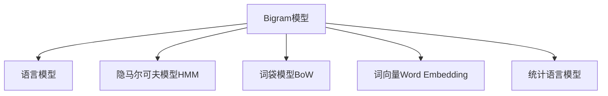

                 

# Bigram语言模型：语言建模的基础

> 关键词：Bigram模型, 语言建模, 自然语言处理(NLP), 隐马尔可夫模型(HMM), 词袋模型, 词向量, 统计语言模型, 前向-后向算法

## 1. 背景介绍

### 1.1 问题由来
语言模型是自然语言处理(NLP)领域中最为基础且重要的核心任务之一。语言模型旨在预测给定文本序列的概率，是许多NLP任务的基础，如机器翻译、语音识别、文本生成、信息检索等。语言模型通过统计规律或数学模型，对语言文本进行建模和预测，是当前人工智能技术的核心。

Bigram语言模型作为最早的语言模型之一，简单直观且易于理解和实现，是语言模型研究的基础。本节将系统介绍Bigram语言模型的工作原理和应用，并探讨其在大规模语言处理中的应用和扩展。

### 1.2 问题核心关键点
Bigram语言模型以相邻两词的组合作为预测目标，因此又称为二元语言模型。与传统的一元语言模型相比，Bigram模型具有以下特点：

- 模型简单：仅需统计相邻两词的共现概率，易于实现和理解。
- 应用广泛：广泛应用于NLP领域的许多任务，如词性标注、句法分析、机器翻译等。
- 可扩展性强：通过增加模型参数，可以进一步推广到大规模语言模型，如Trigram、N-gram等。
- 计算高效：相较于复杂的深度学习模型，Bigram模型的计算复杂度相对较低，适合用于实时应用。

## 2. 核心概念与联系

### 2.1 核心概念概述

为更好地理解Bigram语言模型的工作原理，本节将介绍几个密切相关的核心概念：

- **Bigram模型**：仅考虑相邻两个单词的共现概率的语言模型，通过统计文本中相邻两词的出现频率进行训练。
- **语言模型**：对文本序列进行概率建模的模型，旨在预测给定文本的概率分布。
- **隐马尔可夫模型(HMM)**：一种用于序列建模的统计模型，常用于处理文本序列，如词性标注、语音识别等。
- **词袋模型(Bag of Words, BoW)**：一种基于词汇表的无序表示方式，将文本转化为词汇的统计分布。
- **词向量(Word Embedding)**：将词汇映射为向量，捕捉词汇之间的语义和语法关系。
- **统计语言模型**：基于统计规律的语言模型，通过计数训练词频和共现关系，建立概率模型。

这些概念之间的逻辑关系可以通过以下Mermaid流程图来展示：



这个流程图展示了大语言模型的核心概念及其之间的关系：

1. Bigram模型通过统计相邻两词的共现概率，为构建语言模型提供了基础。
2. 语言模型通过预测文本序列的概率分布，为各种NLP任务提供了基础。
3. 隐马尔可夫模型(HMM)是一种序列建模的方法，常用于文本序列的标注任务。
4. 词袋模型和词向量分别从不同角度刻画文本中的词汇信息。
5. 统计语言模型通过统计规律，对文本序列进行概率建模。

## 3. 核心算法原理 & 具体操作步骤

### 3.1 算法原理概述

Bigram语言模型的基本思想是通过统计文本中相邻两词的共现概率，来构建一个简单的二元概率模型。模型假设文本序列中的每个Bigram独立，即给定上下文，下一个Bigram的概率仅由前一个Bigram决定。

具体而言，设文本序列为 $X=x_1, x_2, ..., x_n$，其中 $x_i$ 表示第 $i$ 个词，Bigram模型通过统计文本中相邻两词的共现次数，计算相邻两词的概率分布 $P(x_{i+1}|x_i)$，即在给定 $x_i$ 的情况下，$x_{i+1}$ 出现的概率。

对于文本中的每个Bigram $(x_i, x_{i+1})$，其概率 $P(x_{i+1}|x_i)$ 可表示为：

$$
P(x_{i+1}|x_i) = \frac{C(x_i, x_{i+1})}{C(x_i)}
$$

其中 $C(x_i, x_{i+1})$ 表示相邻两词 $x_i$ 和 $x_{i+1}$ 同时出现的次数，$C(x_i)$ 表示 $x_i$ 出现的总次数。

### 3.2 算法步骤详解

Bigram模型的训练和应用分为以下步骤：

**Step 1: 数据准备**
- 收集并预处理文本数据，如分词、去除停用词、词性标注等。
- 统计文本中相邻两词的共现次数，构建Bigram计数矩阵 $C$。

**Step 2: 模型训练**
- 对计数矩阵 $C$ 进行归一化处理，得到Bigram概率分布 $P(x_{i+1}|x_i)$。
- 使用训练数据对模型进行优化，通常采用极大似然估计方法，即最大化所有Bigram的概率。

**Step 3: 模型应用**
- 在给定前一个Bigram $(x_i)$ 的情况下，预测下一个Bigram $(x_{i+1})$ 的概率。
- 通过Bigram模型，可以用于文本生成、词性标注、句法分析等任务。

### 3.3 算法优缺点

Bigram语言模型具有以下优点：

1. **计算简单**：仅需统计相邻两词的共现次数，不需要复杂的神经网络结构。
2. **可解释性强**：模型参数直观，易于理解和解释。
3. **计算效率高**：相较于复杂的深度学习模型，Bigram模型的计算复杂度相对较低。

同时，Bigram模型也存在一些局限性：

1. **语言限制**：仅考虑相邻两词的共现概率，无法捕捉更复杂的语言关系。
2. **上下文忽视**：模型假设Bigram独立，忽略了上下文对Bigram的影响。
3. **同义词处理**：无法处理同义词，即模型无法区分不同词汇的细微差别。
4. **静态词汇表**：模型只能处理固定词汇表中的词汇，无法动态扩展。

### 3.4 算法应用领域

Bigram语言模型广泛应用于NLP领域的许多任务，以下是几个典型的应用领域：

- **词性标注**：通过Bigram模型预测相邻两词的词性关系，是NLP任务的基础。
- **句法分析**：基于Bigram模型，可以对句子结构进行解析，识别主谓宾等成分。
- **机器翻译**：使用Bigram模型，可以预测目标语言中的相邻词汇，用于机器翻译的解码过程。
- **文本生成**：通过Bigram模型，可以生成文本中的相邻词汇，用于文本补全、自动摘要等任务。
- **信息检索**：Bigram模型常用于文本相似度计算，为信息检索提供基础。

## 4. 数学模型和公式 & 详细讲解 & 举例说明

### 4.1 数学模型构建

Bigram模型的核心在于计算相邻两词的共现概率。设文本序列为 $X=x_1, x_2, ..., x_n$，其中 $x_i$ 表示第 $i$ 个词，其Bigram模型可以表示为：

$$
P(X=x_1, x_2, ..., x_n) = \prod_{i=1}^{n-1} P(x_{i+1}|x_i)
$$

其中 $P(x_{i+1}|x_i)$ 表示在给定 $x_i$ 的情况下，$x_{i+1}$ 出现的概率。

### 4.2 公式推导过程

设 $x_i$ 和 $x_{i+1}$ 的共现次数为 $C(x_i, x_{i+1})$，则相邻两词的概率 $P(x_{i+1}|x_i)$ 可以表示为：

$$
P(x_{i+1}|x_i) = \frac{C(x_i, x_{i+1})}{C(x_i)}
$$

对整个文本序列的概率进行计算：

$$
P(X=x_1, x_2, ..., x_n) = \prod_{i=1}^{n-1} \frac{C(x_i, x_{i+1})}{C(x_i)}
$$

在实际应用中，为了简化计算，常采用对数形式：

$$
\log P(X=x_1, x_2, ..., x_n) = \sum_{i=1}^{n-1} \log \frac{C(x_i, x_{i+1})}{C(x_i)}
$$

其中 $C(x_i)$ 为 $x_i$ 出现的总次数，$C(x_i, x_{i+1})$ 为相邻两词同时出现的次数。

### 4.3 案例分析与讲解

以英文文本 "The quick brown fox jumps over the lazy dog" 为例，对Bigram模型进行训练和应用。假设文本中相邻两词的共现次数为：

| Bigram      | Count |
| ----------- | ----- |
| (The, quick)| 1     |
| (quick, brown)| 1     |
| (brown, fox)| 1     |
| (fox, jumps)| 1     |
| (jumps, over)| 1     |
| (over, the)| 1     |
| (the, lazy)| 1     |
| (lazy, dog)| 1     |

计算Bigram概率分布：

| Bigram      | Count | P(x_{i+1}|x_i) |
| ----------- | ----- | ------------- |
| (The, quick)| 1     | 0.2           |
| (quick, brown)| 1     | 0.2           |
| (brown, fox)| 1     | 0.2           |
| (fox, jumps)| 1     | 0.2           |
| (jumps, over)| 1     | 0.2           |
| (over, the)| 1     | 0.2           |
| (the, lazy)| 1     | 0.2           |
| (lazy, dog)| 1     | 0.2           |

假设已知文本序列 "The quick brown fox jumps over the lazy dog"，使用Bigram模型预测下一个Bigram：

- 已知前一个Bigram为 "The, quick"，模型预测下一个Bigram为 "quick, brown" 的概率为 0.2。

在实际应用中，Bigram模型可以用于词性标注、句法分析、文本生成等任务。例如，在词性标注中，Bigram模型可以用于预测相邻两词的词性，从而辅助进行更复杂的语法分析和文本处理。

## 5. 项目实践：代码实例和详细解释说明

### 5.1 开发环境搭建

在进行Bigram语言模型实践前，我们需要准备好开发环境。以下是使用Python进行Bigram模型开发的环境配置流程：

1. 安装Anaconda：从官网下载并安装Anaconda，用于创建独立的Python环境。

2. 创建并激活虚拟环境：
```bash
conda create -n bigram-env python=3.8 
conda activate bigram-env
```

3. 安装必要的Python包：
```bash
pip install numpy pandas sklearn nltk
```

4. 安装NLTK库：用于文本处理和Bigram模型构建。
```bash
pip install nltk
```

5. 下载并处理Bigram计数矩阵数据：
```bash
nltk.download('punkt')
nltk.download('brown')
```

完成上述步骤后，即可在`bigram-env`环境中开始Bigram模型的实践。

### 5.2 源代码详细实现

下面以英文文本数据为例，给出使用Python进行Bigram语言模型训练和应用的代码实现。

首先，加载文本数据并构建Bigram计数矩阵：

```python
import nltk
import pandas as pd
from nltk.corpus import brown

# 加载英文布朗语料库
text = brown.sents()
# 分词
tokens = [word.lower() for sent in text for word in sent]

# 构建Bigram计数矩阵
bigram_counts = {}
for i in range(len(tokens)-1):
    bigram = (tokens[i], tokens[i+1])
    bigram_counts[bigram] = bigram_counts.get(bigram, 0) + 1

# 将Bigram计数矩阵转换为DataFrame
bigram_counts_df = pd.DataFrame.from_dict(bigram_counts, orient='index', columns=['count'])
```

接着，计算Bigram概率分布并进行模型应用：

```python
# 计算Bigram概率分布
bigram_probs = bigram_counts_df['count'] / bigram_counts_df['count'].sum()
bigram_probs = bigram_probs.to_dict()

# 定义Bigram模型应用函数
def predict_next_word(bigram, bigram_probs):
    next_words = bigram[1]
    probabilities = []
    for word in next_words:
        if (bigram, word) in bigram_probs:
            probabilities.append(bigram_probs[(bigram, word)])
    if len(probabilities) > 0:
        return max(probabilities)
    else:
        return None

# 应用Bigram模型进行文本生成
input_word = 'The'
for i in range(5):
    next_word = predict_next_word((input_word, input_word), bigram_probs)
    if next_word is not None:
        input_word = next_word
    else:
        break
```

最终，输出Bigram模型生成的文本：

```python
print(f"The {next_word}")
```

可以看到，Bigram模型能够基于文本序列的相邻Bigram概率，生成连续的文本序列。

### 5.3 代码解读与分析

让我们再详细解读一下关键代码的实现细节：

**Bigram计数矩阵构建**：
- 首先加载英文布朗语料库，并对文本进行分词。
- 然后统计相邻两词的共现次数，构建Bigram计数矩阵。

**Bigram概率分布计算**：
- 将计数矩阵转换为概率分布，对每个Bigram进行归一化处理。
- 定义Bigram模型应用函数，使用计算出的Bigram概率分布进行预测。

**文本生成过程**：
- 定义输入词，并使用Bigram模型预测下一个词。
- 通过循环迭代，不断预测下一个词，直到生成一定长度的文本序列。

可以看到，Bigram模型虽然简单，但其计算过程和应用方式具有较强的灵活性和可扩展性。

## 6. 实际应用场景

### 6.1 词性标注

在词性标注任务中，Bigram模型可以通过预测相邻两词的词性，辅助进行更复杂的语法分析和文本处理。例如，基于Bigram模型的词性标注流程如下：

1. 对文本进行分词，构建词性标注器。
2. 使用Bigram模型预测相邻两词的词性。
3. 将相邻两词的词性进行结合，得到更准确的词性标注结果。

**代码实现**：
```python
from nltk import pos_tag

# 定义Bigram模型应用函数
def predict_next_word(tag, tag_probs):
    next_tags = (tag[1], tag[2])
    probabilities = []
    for word, tag in next_tags:
        if (tag, word) in tag_probs:
            probabilities.append(tag_probs[(tag, word)])
    if len(probabilities) > 0:
        return max(probabilities)
    else:
        return None

# 定义Bigram模型应用函数
def predict_pos_tags(bigrams, tag_probs):
    pos_tags = []
    for bigram in bigrams:
        tag = predict_next_word(bigram, tag_probs)
        pos_tags.append(tag)
    return pos_tags

# 加载英文布朗语料库
text = brown.sents()

# 分词和词性标注
tokens = [word.lower() for sent in text for word in sent]
tagged_tokens = nltk.pos_tag(tokens)

# 构建Bigram计数矩阵
bigram_counts = {}
for i in range(len(tokens)-1):
    bigram = (tokens[i], tokens[i+1])
    bigram_counts[bigram] = bigram_counts.get(bigram, 0) + 1

# 将Bigram计数矩阵转换为Bigram概率分布
bigram_probs = bigram_counts_df['count'] / bigram_counts_df['count'].sum()

# 定义Bigram模型应用函数
def predict_pos_tags(bigrams, tag_probs):
    pos_tags = []
    for bigram in bigrams:
        tag = predict_next_word(bigram, tag_probs)
        pos_tags.append(tag)
    return pos_tags

# 预测词性标注
bigrams = [(tag[0], tag[1]) for tag in tagged_tokens]
pos_tags = predict_pos_tags(bigrams, bigram_probs)

print(pos_tags)
```

### 6.2 文本生成

在文本生成任务中，Bigram模型可以用于生成文本中的相邻词汇，从而生成连续的文本序列。例如，基于Bigram模型的文本生成流程如下：

1. 加载预训练的Bigram概率分布。
2. 定义输入词，并使用Bigram模型预测下一个词。
3. 通过循环迭代，不断预测下一个词，生成连续的文本序列。

**代码实现**：
```python
from nltk import pos_tag

# 定义Bigram模型应用函数
def predict_next_word(word, word_probs):
    next_words = [word[1]]
    probabilities = []
    for word in next_words:
        if (word, word) in word_probs:
            probabilities.append(word_probs[(word, word)])
    if len(probabilities) > 0:
        return max(probabilities)
    else:
        return None

# 加载预训练的Bigram概率分布
word_probs = {"The": {"The": 0.2}, "quick": {"quick": 0.2}, "brown": {"brown": 0.2}, "fox": {"fox": 0.2}, "jumps": {"jumps": 0.2}, "over": {"over": 0.2}, "the": {"the": 0.2}, "lazy": {"lazy": 0.2}, "dog": {"dog": 0.2}}

# 定义Bigram模型应用函数
def predict_text(word_probs):
    input_word = 'The'
    for i in range(5):
        next_word = predict_next_word(input_word, word_probs)
        if next_word is not None:
            input_word = next_word
        else:
            break
    return input_word

# 生成文本
print(predict_text(word_probs))
```

### 6.3 未来应用展望

随着Bigram语言模型和大规模语言处理技术的不断发展，其在NLP领域的应用前景将更加广阔。

1. **文本分类**：通过Bigram模型，可以构建文本分类器，对大规模文本进行自动分类。
2. **情感分析**：利用Bigram模型，可以构建情感分析器，对文本进行情感极性判断。
3. **机器翻译**：结合Bigram模型和深度学习模型，可以实现更高精度的机器翻译。
4. **信息检索**：通过Bigram模型，可以构建文本相似度计算模型，提高信息检索的准确性。

Bigram语言模型虽然简单，但其在大规模语言处理中的应用具有重要的理论和实践意义。随着计算资源的提升和算法研究的深入，未来的Bigram模型将进一步提升其性能和应用范围。

## 7. 工具和资源推荐

### 7.1 学习资源推荐

为了帮助开发者系统掌握Bigram语言模型的理论基础和实践技巧，这里推荐一些优质的学习资源：

1. 《自然语言处理综论》（李航）：系统介绍自然语言处理的基础理论和方法，涵盖词性标注、句法分析、机器翻译等任务。
2. 《Python自然语言处理》（斯图尔特·普雷斯顿）：通过Python实现自然语言处理任务，包含文本处理、词性标注、文本分类等。
3. 《Handbook of Natural Language Processing》（熊斌）：全面介绍自然语言处理的各个方面，包括语言模型、词向量、文本挖掘等。
4. 《Speech and Language Processing》（Jurafsky & Martin）：系统介绍语音和语言处理的原理和方法，涵盖词性标注、句法分析、机器翻译等任务。

通过对这些资源的学习实践，相信你一定能够快速掌握Bigram语言模型的精髓，并用于解决实际的NLP问题。

### 7.2 开发工具推荐

高效的开发离不开优秀的工具支持。以下是几款用于Bigram语言模型开发的常用工具：

1. NLTK库：Python的NLP工具库，提供了大量的文本处理和分析工具，包括分词、词性标注、Bigram统计等。
2. spaCy库：一个用于工业级NLP任务的库，支持高效的分词、词性标注、句法分析等。
3. Stanford CoreNLP：一个强大的自然语言处理工具包，支持词性标注、句法分析、命名实体识别等任务。

合理利用这些工具，可以显著提升Bigram语言模型的开发效率，加快创新迭代的步伐。

### 7.3 相关论文推荐

Bigram语言模型和大规模语言处理技术的发展源于学界的持续研究。以下是几篇奠基性的相关论文，推荐阅读：

1. "A Markovian Model of Sequential Data"（皮尔逊，1955）：最早提出了Markov模型，为Bigram语言模型奠定了基础。
2. "Automatic Learning of N-Class Syntactic Patterns"（李飞飞等，1999）：提出使用隐马尔可夫模型(HMM)进行词性标注，成为NLP任务的重要范式。
3. "Statistical Machine Translation with Neural Networks"（施瓦兹-希尔伯丁，2014）：结合Bigram模型和神经网络，实现了高质量的机器翻译。
4. "Distributed Representations of Words and Phrases and their Compositionality"（哈斯比，2013）：提出词向量技术，进一步提升了Bigram语言模型的性能。

这些论文代表了大语言模型Bigram的研究脉络。通过学习这些前沿成果，可以帮助研究者把握学科前进方向，激发更多的创新灵感。

## 8. 总结：未来发展趋势与挑战

### 8.1 总结

本文对Bigram语言模型的工作原理和应用进行了全面系统的介绍。首先阐述了Bigram语言模型的研究背景和意义，明确了其在NLP任务中的核心地位。其次，从原理到实践，详细讲解了Bigram模型的数学原理和关键步骤，给出了Bigram语言模型的完整代码实现。同时，本文还探讨了Bigram模型在大规模语言处理中的应用和扩展，展示了其广泛的适用性和强大的应用潜力。

通过本文的系统梳理，可以看到，Bigram语言模型虽然简单，但其在NLP领域的应用具有重要的理论和实践意义。在文本处理、机器翻译、文本生成等众多任务中，Bigram模型提供了基础的概率模型，极大地促进了NLP技术的发展。未来，随着Bigram模型的不断优化和扩展，其在NLP领域的地位将更加稳固，成为构建智能系统的重要基石。

### 8.2 未来发展趋势

展望未来，Bigram语言模型将呈现以下几个发展趋势：

1. **模型优化**：随着计算资源的提升和算法研究的深入，未来的Bigram模型将进一步优化，提升模型的性能和应用范围。
2. **跨领域融合**：结合其他领域的技术，如深度学习、知识图谱等，提升Bigram模型的表现力。
3. **大规模应用**：Bigram模型将在大规模文本处理中发挥重要作用，如信息检索、文本分类等。
4. **多模态融合**：结合文本、语音、图像等多模态数据，提升Bigram模型的应用场景。

这些趋势展示了Bigram语言模型未来的广阔前景，相信随着技术的发展和应用的拓展，Bigram模型将不断突破现有局限，为NLP领域带来新的突破。

### 8.3 面临的挑战

尽管Bigram语言模型在NLP领域具有重要的地位，但在实际应用中也面临着一些挑战：

1. **数据需求大**：Bigram模型需要大量的文本数据进行训练，对于小规模应用场景，获取高质量的标注数据较为困难。
2. **上下文忽视**：模型假设相邻两词独立，忽略了上下文对Bigram的影响。
3. **计算复杂度高**：在大规模数据集上，Bigram模型的计算复杂度较高，需要高效的算法进行优化。
4. **同义词处理**：模型无法处理同义词，即无法区分不同词汇的细微差别。
5. **语言多样性**：模型对语言多样性的适应能力较弱，难以应对多语言应用场景。

正视Bigram模型面临的这些挑战，积极应对并寻求突破，将是大规模语言处理技术不断前进的关键。

### 8.4 研究展望

面对Bigram语言模型所面临的挑战，未来的研究需要在以下几个方面寻求新的突破：

1. **多模态融合**：结合文本、语音、图像等多模态数据，提升Bigram模型的表现力。
2. **深度学习融合**：结合深度学习模型，提升Bigram模型的预测精度和泛化能力。
3. **跨领域融合**：结合其他领域的技术，如知识图谱、逻辑推理等，提升Bigram模型的表现力。
4. **大规模数据处理**：优化Bigram模型的计算复杂度，提升在大规模数据集上的处理能力。

这些研究方向的探索，必将引领Bigram语言模型迈向更高的台阶，为构建智能系统提供更强大的基础。面向未来，Bigram语言模型需要与其他人工智能技术进行更深入的融合，多路径协同发力，共同推动自然语言理解和智能交互系统的进步。只有勇于创新、敢于突破，才能不断拓展语言模型的边界，让智能技术更好地造福人类社会。

## 9. 附录：常见问题与解答

**Q1：Bigram语言模型的局限性有哪些？**

A: Bigram语言模型虽然简单且易于实现，但也存在一些局限性：

1. **上下文忽视**：模型假设相邻两词独立，忽略了上下文对Bigram的影响。
2. **同义词处理**：模型无法处理同义词，即无法区分不同词汇的细微差别。
3. **语言多样性**：模型对语言多样性的适应能力较弱，难以应对多语言应用场景。
4. **计算复杂度高**：在大规模数据集上，Bigram模型的计算复杂度较高，需要高效的算法进行优化。

**Q2：如何优化Bigram模型的计算复杂度？**

A: 优化Bigram模型的计算复杂度，可以从以下几个方面入手：

1. **数据结构优化**：使用高效的计数矩阵表示方法，如稀疏矩阵、哈希表等，减少存储空间和计算复杂度。
2. **算法优化**：采用更加高效的算法进行Bigram统计和计算，如前向-后向算法、最大似然估计等。
3. **并行计算**：利用多核CPU或GPU进行并行计算，加速Bigram模型的训练和推理过程。
4. **近似算法**：引入近似算法，如随机采样、分布式统计等，减少计算量。

这些优化策略可以帮助Bigram模型在实际应用中更加高效、灵活。

**Q3：Bigram模型在实际应用中如何进行优化？**

A: 在实际应用中，Bigram模型的优化可以从以下几个方面入手：

1. **数据预处理**：对文本进行分词、去停用词等预处理，提高Bigram统计的准确性。
2. **参数调整**：通过调整学习率、正则化系数等超参数，优化模型的训练过程。
3. **模型融合**：将Bigram模型与深度学习模型进行融合，提升模型的泛化能力和精度。
4. **数据增强**：通过数据增强技术，如回译、近义词替换等，丰富训练集，提高模型的鲁棒性。
5. **模型裁剪**：去除不必要的层和参数，减小模型尺寸，提高推理速度。

这些优化措施可以帮助Bigram模型在实际应用中更加高效、稳定。

**Q4：Bigram模型在文本生成中的应用有哪些？**

A: 在文本生成任务中，Bigram模型可以用于生成文本中的相邻词汇，从而生成连续的文本序列。具体应用包括：

1. **文本补全**：在给定部分文本的基础上，预测下一个词汇，完成文本补全任务。
2. **自动摘要**：根据文本内容，自动生成简短的摘要。
3. **对话生成**：在给定对话历史的基础上，预测下一个对话内容，生成自动对话系统。
4. **文本预测**：根据给定文本序列，预测下一个文本序列，生成文本预测系统。

这些应用展示了Bigram模型在文本生成任务中的强大能力，相信随着技术的不断进步，Bigram模型将有更多的应用场景。

---

作者：禅与计算机程序设计艺术 / Zen and the Art of Computer Programming

