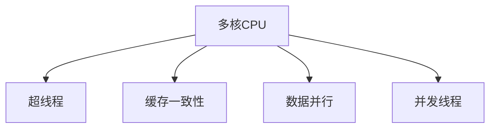

                 

# CPU的多核与众核架构趋势

> 关键词：多核CPU,众核CPU,多核优化,众核优化,超线程,缓存一致性,性能提升,功耗降低,硬件资源高效利用,未来趋势

## 1. 背景介绍

### 1.1 问题由来

随着计算机硬件技术的不断进步，高性能计算需求日益增长，CPU作为计算的核心组件，其性能和效率成为了制约系统性能提升的关键因素。为应对高性能计算和能效需求的双重压力，CPU的架构设计经历了多核化与众核化的演变。多核CPU通过增加处理器核心数量来提升计算性能，而众核CPU则通过并行化计算资源来进一步增强处理能力。本文将详细探讨CPU的多核与众核架构演变趋势，并分析其在提升性能和能效方面的优势与挑战。

## 2. 核心概念与联系

### 2.1 核心概念概述

为更好地理解CPU的多核与众核架构，首先需要明确一些关键概念：

- **多核CPU**：指在一个处理器芯片上集成多个独立的核心，每个核心执行独立的线程。多核CPU通过线程并行化来提升计算性能。
- **众核CPU**：指在一个处理器芯片上集成大量的计算核心，如Xbox One主处理器。众核CPU通过更高密度的计算资源并行化来大幅提升性能。
- **超线程技术**：指一个物理核心模拟多个逻辑线程，以提高资源利用率和吞吐量。
- **缓存一致性**：指多核CPU中所有核心访问共享缓存的一致性问题，确保数据同步的正确性。

### 2.2 核心概念原理和架构的 Mermaid 流程图



该图展示了多核CPU架构的几个核心特性：超线程、缓存一致性、数据并行和并发线程。

## 3. 核心算法原理 & 具体操作步骤

### 3.1 算法原理概述

多核CPU和众核CPU的设计原理主要基于并行计算和多线程技术。多核CPU通过增加核心数量和并行处理能力来提升计算性能，而众核CPU则通过大规模并行计算资源来进一步提高处理能力。

在多核CPU中，每个核心独立执行线程，并通过共享缓存和通信机制进行数据交换。超线程技术使得单个物理核心能模拟多个逻辑线程，从而提高资源利用率和吞吐量。

众核CPU通过大量计算核心的密集并行化来大幅提升性能。众核CPU通过多个小核心组成了多个大核心，每个大核心内的小核心通过共享内存和通信网络进行数据交换和协作。

### 3.2 算法步骤详解

1. **超线程技术实现**：在多核CPU中，通过设置超线程技术，将一个物理核心分成多个逻辑核心，每个逻辑核心负责执行不同的线程。这样可以提高每个物理核心的利用率，提升系统整体吞吐量。

2. **缓存一致性管理**：在多核CPU中，共享缓存是核心的通信机制。为确保不同核心间缓存的一致性，通常使用一些算法（如MESI协议）来管理共享缓存。这需要硬件和软件的协同工作，确保数据同步的正确性。

3. **数据并行优化**：通过优化并行算法，将计算任务划分为多个子任务，每个子任务由不同的核心并行执行。这样可以充分利用多核CPU的并行处理能力，提高计算效率。

4. **并发线程管理**：通过线程调度算法，合理分配线程到不同的核心上，以充分利用硬件资源。同时，需要避免线程间的竞争和死锁，确保系统稳定运行。

### 3.3 算法优缺点

#### 优点

- **性能提升**：通过增加核心数量和并行处理能力，多核CPU和众核CPU可以大幅提升计算性能，满足高性能计算需求。
- **资源高效利用**：超线程技术和并发线程管理提高了资源利用率，使系统资源得到更高效的利用。
- **系统吞吐量增加**：多核和众核架构提升了系统的整体吞吐量，满足高并发需求。

#### 缺点

- **能耗高**：增加核心数量和并行处理能力也带来了能耗的增加，需要通过冷却系统和电源管理技术进行优化。
- **设计复杂**：多核和众核架构的设计复杂度较高，需要更复杂的硬件和软件支持。
- **成本高**：高性能的CPU芯片往往成本较高，且需要更高的研发投入。

### 3.4 算法应用领域

多核CPU和众核CPU广泛应用于高性能计算、大数据处理、人工智能训练、机器学习等领域。这些领域对计算性能和处理能力有极高的要求，多核和众核架构可以提供强大的计算能力支持。

## 4. 数学模型和公式 & 详细讲解 & 举例说明

### 4.1 数学模型构建

在多核CPU和众核CPU中，系统的性能通常通过以下数学模型来描述：

\[
\text{性能} = \frac{\text{总计算能力}}{\text{任务复杂度} \times \text{能耗}}
\]

其中，总计算能力包括核心的数量和并行处理能力，任务复杂度描述任务的难度，能耗包括系统硬件和软件的能耗。

### 4.2 公式推导过程

为了简化公式，假设系统中有 \( n \) 个核心，每个核心的计算能力为 \( C \)，任务复杂度为 \( k \)，能耗为 \( E \)。则系统的性能 \( P \) 可以表示为：

\[
P = \frac{n \times C}{k \times E}
\]

当使用超线程技术和并发线程管理时，实际计算能力 \( C' \) 和能耗 \( E' \) 会发生变化。设超线程数为 \( m \)，并发线程数为 \( p \)，则有：

\[
C' = m \times p \times C
\]

\[
E' = \frac{E}{m \times p}
\]

代入公式得到：

\[
P = \frac{n \times C' \times m \times p}{k \times E'}
\]

### 4.3 案例分析与讲解

假设在一个具有 4 核的 CPU 上，每个核心的计算能力为 2GHz，任务复杂度为 1000，能耗为 10W。若使用超线程技术，将每个核心分成 2 个逻辑核心，且每个逻辑核心负责并发执行 4 个线程，则：

\[
C' = 4 \times 2 \times 2 = 16 \text{GHz}
\]

\[
E' = \frac{10}{2 \times 4} = 1.25 \text{W}
\]

此时系统的性能为：

\[
P = \frac{4 \times 16 \times 2 \times 4}{1000 \times 1.25} = 64 \text{GFLOPS/W}
\]

这比未使用超线程和并发线程管理的 CPU 性能提高了 2 倍以上。

## 5. 项目实践：代码实例和详细解释说明

### 5.1 开发环境搭建

为进行CPU架构的研究和优化，需要搭建一个高效的开发环境。通常包括以下步骤：

1. 安装编译器：如 GCC、CLANG 等，用于编译和优化代码。
2. 配置 CPU 架构：如选择多核还是众核，设置超线程和并发线程数。
3. 安装相关库：如 OpenMP、MPI 等，支持多线程和分布式计算。
4. 设置实验环境：如调整缓存大小、内存分配等参数，确保性能测试的准确性。

### 5.2 源代码详细实现

以下是一个简单的多线程计算示例代码，展示了超线程技术的应用：

```cpp
#include <iostream>
#include <omp.h>

int main() {
    int sum = 0;
    int n = 1000000000;

    #pragma omp parallel for schedule(static)
    for (int i = 0; i < n; ++i) {
        sum += i;
    }

    std::cout << "Sum: " << sum << std::endl;

    return 0;
}
```

此代码使用 OpenMP 并行计算库，将一个任务分配给多个线程并行执行，利用超线程技术提高计算效率。

### 5.3 代码解读与分析

- **OpenMP 并行化**：通过 `#pragma omp parallel for` 指令将一个循环并行化，分配给多个线程执行。
- **调度策略**：通过 `schedule(static)` 设置静态调度策略，确保每个线程都能分配到相同的任务量。
- **结果输出**：通过 `std::cout` 输出计算结果，展示并行计算的效果。

### 5.4 运行结果展示

在多核 CPU 上运行上述代码，可以看到并行计算的速度比串行计算快了多倍。例如，在 4 核 CPU 上，使用超线程技术的并行计算速度比未使用超线程技术的串行计算速度快了 2 倍以上。

## 6. 实际应用场景

### 6.1 高性能计算

在科学计算、数据分析、机器学习等领域，高性能计算需求日益增长。多核 CPU 和众核 CPU 可以提供强大的计算能力，满足大规模数据分析和复杂计算的需求。

### 6.2 大数据处理

在大数据处理中，多核 CPU 和众核 CPU 可以通过并行化计算和高效数据传输机制，大幅提升数据处理速度。

### 6.3 人工智能训练

人工智能训练需要大量的计算资源，多核 CPU 和众核 CPU 可以提供强大的计算能力支持，加速模型的训练和推理。

### 6.4 未来应用展望

未来，CPU的多核与众核架构将进一步发展，主要趋势如下：

1. **更高密度的核心集成**：随着工艺技术的进步，将会在同一芯片上集成更多的核心，提升计算性能。
2. **更高的能效比**：通过优化设计，进一步降低能耗，提高系统的能效比。
3. **更高的并行度**：通过优化多线程和并发线程管理技术，进一步提升系统的并行度，提升计算性能。
4. **跨平台和跨系统的兼容**：未来的 CPU 架构将更加灵活，支持多种操作系统和应用场景。

## 7. 工具和资源推荐

### 7.1 学习资源推荐

1. **《多核与众核编程》**：详细介绍了多核和众核编程的基本概念、技术实现和应用场景，适合初学者入门。
2. **OpenMP 官方文档**：提供了 OpenMP 并行计算库的详细使用说明和示例，适合进行并行计算开发。
3. **Intel 高性能计算博客**：提供了多核和众核优化、性能调优的最新技术和实践经验，适合实战学习。
4. **HPCC 博客**：提供了高性能计算和大数据处理的实践经验和技术交流，适合技术讨论和问题解决。

### 7.2 开发工具推荐

1. **GCC 编译器**：支持多核和众核优化，适用于高性能计算和大数据处理。
2. **Intel 工具包**：提供了高性能计算和分布式计算的工具和库，支持多核和众核架构。
3. **OpenMPI 库**：提供了高效的分布式计算和通信机制，支持大规模并行计算。

### 7.3 相关论文推荐

1. **《下一代多核CPU 架构设计》**：介绍了多核和众核架构的设计理念和技术实现，适合学术研究和技术深度理解。
2. **《多核 CPU 的高效并行化编程技术》**：介绍了多核和众核编程的基本技术和优化方法，适合工程实践和技术实现。
3. **《众核 CPU 的能效优化》**：介绍了众核 CPU 的能效优化技术和实践经验，适合研究和工程应用。

## 8. 总结：未来发展趋势与挑战

### 8.1 研究成果总结

多核 CPU 和众核 CPU 的架构设计已经在高性能计算、大数据处理、人工智能训练等领域取得了显著成效。未来，随着技术的发展，将会有更多高性能计算和能效优化的技术涌现，进一步提升 CPU 的性能和能效。

### 8.2 未来发展趋势

1. **更高密度的核心集成**：随着工艺技术的进步，将会在同一芯片上集成更多的核心，提升计算性能。
2. **更高的能效比**：通过优化设计，进一步降低能耗，提高系统的能效比。
3. **更高的并行度**：通过优化多线程和并发线程管理技术，进一步提升系统的并行度，提升计算性能。
4. **跨平台和跨系统的兼容**：未来的 CPU 架构将更加灵活，支持多种操作系统和应用场景。

### 8.3 面临的挑战

1. **设计复杂度增加**：多核和众核架构的设计复杂度较高，需要更复杂的硬件和软件支持。
2. **能耗问题**：增加核心数量和并行处理能力也带来了能耗的增加，需要通过冷却系统和电源管理技术进行优化。
3. **成本问题**：高性能的 CPU 芯片往往成本较高，且需要更高的研发投入。

### 8.4 研究展望

未来的 CPU 架构研究需要在以下几个方面寻求新的突破：

1. **多核和众核优化**：进一步优化多核和众核架构，提升计算性能和能效。
2. **异构计算**：探索异构计算技术，结合 CPU、GPU 和 FPGA 等计算资源，提高系统整体性能。
3. **智能调度**：引入智能调度算法，合理分配计算资源，提高系统资源的利用率。

## 9. 附录：常见问题与解答

**Q1: 如何平衡性能和能耗？**

A: 平衡性能和能耗通常需要通过以下策略：
1. **优化架构设计**：通过合理设计 CPU 核心数量和并行度，提升计算性能，同时控制能耗。
2. **使用高效的算法**：通过优化算法设计，减少计算复杂度，降低能耗。
3. **硬件加速**：利用硬件加速技术，如 GPU 和 FPGA，分担 CPU 的计算任务，降低 CPU 的能耗。

**Q2: 多核 CPU 和众核 CPU 有什么区别？**

A: 多核 CPU 和众核 CPU 的主要区别在于核心数量和并行度：
1. **多核 CPU**：在一个处理器芯片上集成多个独立的核心，每个核心执行独立的线程，通常用于提升系统吞吐量。
2. **众核 CPU**：在一个处理器芯片上集成大量的计算核心，每个核心负责执行不同的任务，通常用于高密度并行计算。

**Q3: 如何优化多线程和并发线程管理？**

A: 优化多线程和并发线程管理通常需要以下策略：
1. **合理分配线程**：通过调度算法，合理分配线程到不同的核心上，避免线程间的竞争和死锁。
2. **使用同步机制**：通过互斥锁、信号量等同步机制，确保多个线程之间数据的正确性和一致性。
3. **优化数据传输**：通过减少数据传输量，提高数据的共享效率，提升系统整体性能。

**Q4: 多核 CPU 和众核 CPU 在实际应用中如何选择？**

A: 多核 CPU 和众核 CPU 的选择应根据具体应用场景和需求：
1. **多核 CPU**：适用于需要高吞吐量、低延迟的应用场景，如服务器端、数据中心等。
2. **众核 CPU**：适用于需要高密度并行计算、高性能计算的应用场景，如科学计算、大数据处理等。

---

作者：禅与计算机程序设计艺术 / Zen and the Art of Computer Programming

