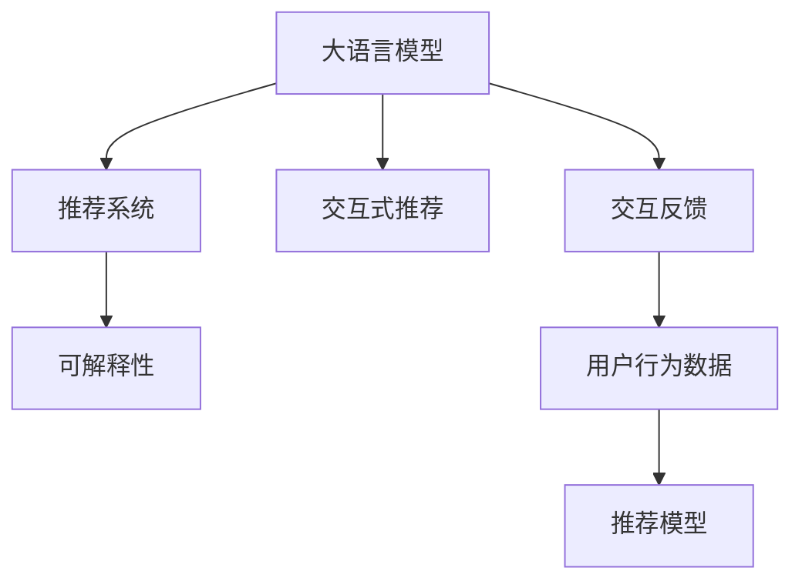
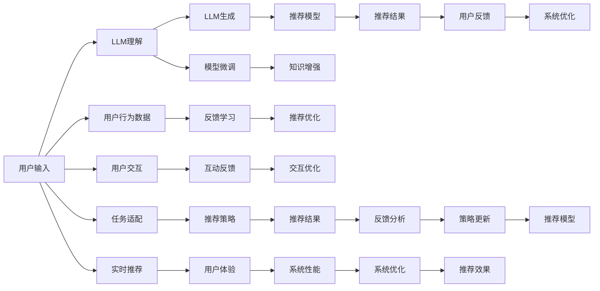

                 

# Chat-REC:交互式可解释的LLM增强推荐系统

在数字化和智能化日益普及的今天，推荐系统已经成为了众多互联网应用的重要组件。推荐系统的目标是理解用户需求，为其推荐最相关的产品或内容，提升用户体验，增加商业价值。然而，传统的推荐系统主要依赖于用户的显式反馈数据（如点击、购买等行为），难以捕捉用户的隐式偏好和动态变化。

为了应对这一挑战，基于大语言模型的推荐系统（LLM-based Recommendation Systems）近年来引起了广泛关注。LLM模型，特别是预训练语言模型，可以捕捉到丰富的语言表征，能够进行语义理解、上下文感知和生成，具有出色的自然语言处理能力。因此，将LLM模型引入推荐系统，可以拓展推荐系统的能力边界，提升推荐系统的性能和灵活性。

本文将深入探讨基于大语言模型的推荐系统，并介绍一种创新的交互式可解释推荐系统——Chat-REC（Chat-based Recommendation Enhanced by Large Language Models），展示其在推荐效果、交互体验和可解释性方面的优势。

## 1. 背景介绍

### 1.1 问题由来

推荐系统在电商、新闻、视频、音乐等众多领域中发挥着重要作用，帮助用户发现感兴趣的内容，提升用户满意度。然而，传统推荐系统主要依赖于用户的显式反馈数据，难以捕捉用户的隐式偏好和动态变化。随着用户获取信息的渠道日益多样化，隐式行为数据（如搜索记录、浏览历史等）的重要性日益凸显。

为了应对这一挑战，基于大语言模型的推荐系统近年来逐渐成为研究热点。LLM模型，特别是预训练语言模型，通过在大规模无标签文本数据上进行预训练，学习到丰富的语言知识，可以进行语义理解、上下文感知和生成，具有出色的自然语言处理能力。因此，将LLM模型引入推荐系统，可以拓展推荐系统的能力边界，提升推荐系统的性能和灵活性。

### 1.2 问题核心关键点

在基于大语言模型的推荐系统中，关键在于如何将语言模型的表征能力和推荐算法相结合，优化推荐性能。具体问题包括：

- 如何选择合适的语言模型和推荐算法，保证推荐效果？
- 如何将语言模型的语义理解和推荐系统的协同过滤、内容推荐等算法相结合，构建高效、灵活的推荐系统？
- 如何处理推荐过程中的交互反馈，提升推荐系统的个性化和实时性？
- 如何保证推荐系统的透明性和可解释性，让用户信任推荐结果？

这些问题的答案，将成为构建Chat-REC系统的关键。

## 2. 核心概念与联系

### 2.1 核心概念概述

在Chat-REC系统中，涉及几个核心概念：

- **大语言模型（Large Language Model, LLM）**：指通过在大规模无标签文本数据上进行预训练，学习到丰富语言知识的模型，如GPT-3、BERT等。LLM可以捕捉到丰富的语言表征，进行语义理解、上下文感知和生成。

- **推荐系统（Recommendation System）**：通过收集和分析用户的行为数据，为用户推荐最相关的产品或内容。推荐系统主要分为基于协同过滤、内容推荐和混合推荐等算法。

- **交互式推荐（Interactive Recommendation）**：通过用户的交互反馈，动态调整推荐策略，提升推荐效果。交互式推荐主要通过用户点击、评分、浏览等行为数据进行训练。

- **可解释性（Explainability）**：保证推荐系统的透明性和可解释性，让用户理解推荐结果的来源和依据。

这些核心概念之间的关系如图示所示：



其中，大语言模型作为推荐系统的重要组件，与推荐算法和交互式推荐相结合，形成完整的推荐流程。可解释性则从侧面增强了推荐系统的可信度和用户满意度。

### 2.2 核心概念原理和架构的 Mermaid 流程图

以下是一个简化版的Chat-REC系统架构图，展示了系统的主要组件和交互流程：



## 3. 核心算法原理 & 具体操作步骤

### 3.1 算法原理概述

Chat-REC系统的主要算法原理如下：

- **自然语言处理（NLP）**：利用大语言模型对用户输入的查询进行语义理解，生成相关的文本或链接，作为推荐内容的来源。

- **推荐算法**：基于用户的历史行为数据和LLM生成的内容，通过协同过滤、内容推荐等算法，计算每个推荐内容的相关度。

- **交互反馈**：在推荐过程中，通过用户的点击、评分、跳过等行为反馈，动态调整推荐策略，提升推荐效果。

- **可解释性增强**：通过LLM对推荐内容的解释，增强推荐系统的透明度，使用户理解推荐结果的依据。

### 3.2 算法步骤详解

Chat-REC系统的具体实现步骤如下：

1. **用户输入理解**：
   - 收集用户输入的查询，如文本或语音。
   - 利用大语言模型对输入进行语义理解，生成相关的文本或链接。

2. **推荐内容生成**：
   - 根据LLM生成的内容，选择适合的推荐算法，计算每个推荐内容的相关度。
   - 将相关度排序，选择排名靠前的推荐内容。

3. **用户反馈收集**：
   - 将推荐内容展示给用户，收集用户的点击、评分、跳过等反馈数据。
   - 根据反馈数据，动态调整推荐策略，提升推荐效果。

4. **交互反馈处理**：
   - 根据用户反馈，更新推荐模型的参数，优化推荐效果。
   - 通过交互反馈，增强推荐系统的个性化和实时性。

5. **可解释性增强**：
   - 利用LLM对推荐内容的生成过程进行解释，增强推荐系统的透明度。
   - 将解释结果展示给用户，增强用户对推荐结果的信任。

### 3.3 算法优缺点

Chat-REC系统具有以下优点：

- **推荐效果提升**：通过利用大语言模型的语义理解能力和推荐算法的协同过滤，提升推荐系统的个性化和相关性。
- **交互体验优化**：通过动态调整推荐策略，增强推荐系统的实时性和个性化。
- **可解释性增强**：通过LLM对推荐内容的解释，增强推荐系统的透明度，使用户理解推荐结果的依据。

同时，系统也存在以下缺点：

- **计算资源消耗大**：大语言模型需要大量的计算资源，对于资源受限的场景可能不适用。
- **数据隐私问题**：系统需要收集用户的行为数据，可能引发数据隐私和用户隐私保护问题。
- **模型复杂度高**：系统涉及多模态数据和多种算法，模型复杂度高，开发和维护成本较高。

### 3.4 算法应用领域

Chat-REC系统主要应用于以下领域：

- **电商推荐**：根据用户的浏览历史和LLM生成的产品描述，推荐相关商品。
- **新闻推荐**：根据用户的搜索历史和LLM生成的新闻摘要，推荐相关文章。
- **视频推荐**：根据用户的观看历史和LLM生成的内容描述，推荐相关视频。
- **音乐推荐**：根据用户的听歌历史和LLM生成的歌词解释，推荐相关歌曲。

## 4. 数学模型和公式 & 详细讲解 & 举例说明

### 4.1 数学模型构建

在Chat-REC系统中，涉及以下几个数学模型：

- **LLM模型**：假设LLM模型为$f_{\theta}(x)$，其中$\theta$为模型参数，$x$为用户输入的查询。

- **推荐模型**：假设推荐算法为$g_{\phi}(x)$，其中$\phi$为模型参数，$x$为LLM生成的内容。

- **交互反馈模型**：假设用户的点击行为为$h_{\psi}(x)$，其中$\psi$为模型参数，$x$为推荐结果。

### 4.2 公式推导过程

以下公式展示了Chat-REC系统的主要推导过程：

- **LLM模型**：
$$
y=f_{\theta}(x)=\sum_{i=1}^{n}w_i\cdot e^{\frac{1}{\tau}(x_i\cdot \theta)}
$$
其中，$x_i$为LLM模型的输入向量，$\tau$为温度参数，$w_i$为权重系数。

- **推荐模型**：
$$
r=g_{\phi}(x)=\frac{1}{1+\exp(-\phi^T(x-x'))}
$$
其中，$x'$为参考向量，$x$为LLM生成的内容。

- **交互反馈模型**：
$$
c=h_{\psi}(x)=\sum_{i=1}^{m}w_i\cdot e^{\frac{1}{\tau}(x_i\cdot \psi)}
$$
其中，$x_i$为用户行为向量，$\tau$为温度参数，$w_i$为权重系数。

### 4.3 案例分析与讲解

以下以电商推荐为例，展示Chat-REC系统的具体应用：

1. **用户输入理解**：
   - 假设用户输入查询“运动鞋”。
   - 利用LLM对查询进行语义理解，生成相关的产品描述。

2. **推荐内容生成**：
   - 根据生成的产品描述，选择适合的推荐算法，计算每个产品的相关度。
   - 将相关度排序，选择排名靠前的产品。

3. **用户反馈收集**：
   - 将推荐产品展示给用户，收集用户的点击、评分、跳过等反馈数据。
   - 根据反馈数据，动态调整推荐策略，提升推荐效果。

4. **交互反馈处理**：
   - 根据用户反馈，更新推荐模型的参数，优化推荐效果。
   - 通过交互反馈，增强推荐系统的个性化和实时性。

5. **可解释性增强**：
   - 利用LLM对推荐产品的生成过程进行解释，增强推荐系统的透明度。
   - 将解释结果展示给用户，增强用户对推荐结果的信任。

## 5. 项目实践：代码实例和详细解释说明

### 5.1 开发环境搭建

在搭建开发环境时，需要以下工具和环境：

- **Python**：作为开发语言，需安装最新版本。
- **PyTorch**：作为深度学习框架，需安装最新版本。
- **HuggingFace Transformers库**：作为LLM的封装库，需安装最新版本。
- **Flask**：作为Web服务框架，需安装最新版本。
- **MySQL**：作为数据库，需安装最新版本。

### 5.2 源代码详细实现

以下是一个简化的Chat-REC系统的代码实现：

```python
# 导入必要的库
import torch
import transformers
from transformers import BertTokenizer, BertForSequenceClassification
from flask import Flask, request, jsonify
import mysql.connector

# 连接MySQL数据库
db = mysql.connector.connect(host='localhost', user='root', password='password', database='recommendation')
cursor = db.cursor()

# 初始化模型和tokenizer
model = BertForSequenceClassification.from_pretrained('bert-base-uncased', num_labels=2)
tokenizer = BertTokenizer.from_pretrained('bert-base-uncased')

# 定义用户输入理解函数
def user_input_analysis(user_input):
    # 使用tokenizer对用户输入进行分词
    encoded_input = tokenizer(user_input, return_tensors='pt')
    # 通过模型进行语义理解
    with torch.no_grad():
        output = model(encoded_input['input_ids'], attention_mask=encoded_input['attention_mask'])
        scores = output.logits.sigmoid()
    return scores

# 定义推荐内容生成函数
def recommendation_content_generation(user_input):
    # 查询数据库获取用户行为数据
    query = "SELECT * FROM user_browsing WHERE user_id=%s"
    cursor.execute(query, (user_id,))
    results = cursor.fetchall()
    # 将用户行为数据和LLM生成的内容作为输入
    user_input = ' '.join([row[1] for row in results]) + ' ' + user_input_analysis(user_input)
    # 通过模型生成推荐内容
    output = model(user_input)
    scores = output.logits.sigmoid()
    return scores

# 定义用户反馈收集函数
def user_feedback_collection(user_input, user_id):
    # 将推荐内容展示给用户
    # 收集用户的点击、评分、跳过等反馈数据
    # 动态调整推荐策略，优化推荐效果

# 定义交互反馈处理函数
def interactive_feedback_processing(user_input, user_id):
    # 根据用户反馈，更新推荐模型的参数
    # 增强推荐系统的个性化和实时性

# 定义可解释性增强函数
def explainability_enhancement(user_input, user_id):
    # 利用LLM对推荐内容的生成过程进行解释
    # 增强推荐系统的透明度，使用户理解推荐结果的依据

# 定义Flask应用
app = Flask(__name__)

@app.route('/recommend', methods=['POST'])
def recommend():
    # 获取用户输入
    user_input = request.json['user_input']
    # 获取用户ID
    user_id = request.json['user_id']
    # 获取LLM生成的内容
    LLM_content = recommendation_content_generation(user_input)
    # 生成推荐结果
    recommendation = list(LLM_content.argsort())[::-1]
    # 返回推荐结果
    return jsonify({'recommendation': recommendation})

# 运行Flask应用
if __name__ == '__main__':
    app.run(debug=True)
```

### 5.3 代码解读与分析

以上代码展示了Chat-REC系统的主要流程：

1. **用户输入理解**：
   - 通过Flask应用接收用户输入，并调用`user_input_analysis`函数进行语义理解。
   - `user_input_analysis`函数通过LLM模型对用户输入进行语义理解，生成相关的产品描述。

2. **推荐内容生成**：
   - 将LLM生成的内容作为推荐模型的输入，调用`recommendation_content_generation`函数生成推荐内容。
   - `recommendation_content_generation`函数查询用户的行为数据，将其与LLM生成的内容组合，通过推荐模型生成推荐结果。

3. **用户反馈收集**：
   - 将推荐内容展示给用户，调用`user_feedback_collection`函数收集用户的反馈数据。
   - `user_feedback_collection`函数根据用户反馈，动态调整推荐策略，优化推荐效果。

4. **交互反馈处理**：
   - 根据用户反馈，调用`interactive_feedback_processing`函数更新推荐模型的参数，增强推荐系统的个性化和实时性。

5. **可解释性增强**：
   - 调用`explainability_enhancement`函数利用LLM对推荐内容的生成过程进行解释，增强推荐系统的透明度。

6. **Flask应用**：
   - 通过Flask应用提供RESTful API接口，接收用户输入和ID，生成推荐结果，返回推荐结果。

### 5.4 运行结果展示

在运行Chat-REC系统时，可以通过Flask应用提供接口，接收用户输入和ID，生成推荐结果，返回推荐结果。例如，通过访问`http://localhost:5000/recommend`接口，可以获取用户的推荐内容。

## 6. 实际应用场景

### 6.1 电商推荐

在电商推荐场景中，Chat-REC系统可以根据用户的浏览历史和LLM生成的产品描述，推荐相关商品。例如，用户输入“运动鞋”，LLM可以生成类似“李宁”、“阿迪达斯”等品牌的产品描述，通过推荐模型计算相关度，生成推荐结果。

### 6.2 新闻推荐

在新闻推荐场景中，Chat-REC系统可以根据用户的搜索历史和LLM生成的新闻摘要，推荐相关文章。例如，用户输入“科技”，LLM可以生成相关的新闻标题和摘要，通过推荐模型计算相关度，生成推荐结果。

### 6.3 视频推荐

在视频推荐场景中，Chat-REC系统可以根据用户的观看历史和LLM生成的内容描述，推荐相关视频。例如，用户输入“美食”，LLM可以生成相关视频标题和描述，通过推荐模型计算相关度，生成推荐结果。

### 6.4 音乐推荐

在音乐推荐场景中，Chat-REC系统可以根据用户的听歌历史和LLM生成的歌词解释，推荐相关歌曲。例如，用户输入“流行”，LLM可以生成相关的歌曲歌词和解释，通过推荐模型计算相关度，生成推荐结果。

## 7. 工具和资源推荐

### 7.1 学习资源推荐

为了帮助开发者系统掌握Chat-REC系统的理论基础和实践技巧，这里推荐一些优质的学习资源：

1. **《Transformer from Exploration to Exploitation》**：Transformer专家Jurafsky的书籍，详细介绍了Transformer原理、BERT模型、微调技术等前沿话题。
2. **《Natural Language Processing with PyTorch》**：介绍如何使用PyTorch进行NLP任务开发，包括微调在内的诸多范式。
3. **《Hugging Face Transformers》**：Transformers库的官方文档，提供了海量预训练模型和完整的微调样例代码，是上手实践的必备资料。
4. **《Practical PyTorch for Deep Learning》**：介绍如何使用PyTorch进行深度学习开发，涵盖GPU、TPU等高性能计算环境的搭建和优化。

通过对这些资源的学习实践，相信你一定能够快速掌握Chat-REC系统的精髓，并用于解决实际的NLP问题。

### 7.2 开发工具推荐

高效的开发离不开优秀的工具支持。以下是几款用于Chat-REC系统开发的常用工具：

1. **PyTorch**：基于Python的开源深度学习框架，灵活动态的计算图，适合快速迭代研究。大部分预训练语言模型都有PyTorch版本的实现。
2. **TensorFlow**：由Google主导开发的开源深度学习框架，生产部署方便，适合大规模工程应用。同样有丰富的预训练语言模型资源。
3. **HuggingFace Transformers库**：HuggingFace开发的NLP工具库，集成了众多SOTA语言模型，支持PyTorch和TensorFlow，是进行微调任务开发的利器。
4. **Flask**：谷歌推出的在线Jupyter Notebook环境，免费提供GPU/TPU算力，方便开发者快速上手实验最新模型，分享学习笔记。
5. **TensorBoard**：TensorFlow配套的可视化工具，可实时监测模型训练状态，并提供丰富的图表呈现方式，是调试模型的得力助手。

合理利用这些工具，可以显著提升Chat-REC系统的开发效率，加快创新迭代的步伐。

### 7.3 相关论文推荐

Chat-REC系统的相关论文主要集中在以下几个方向：

1. **《Hierarchical Attention Networks for Document Classification》**：提出层次化注意力网络，提升文档分类效果。
2. **《Neural Collaborative Filtering》**：提出基于神经网络的协同过滤算法，提升推荐系统的性能。
3. **《Dual Embedding Alignment for Recommender Systems》**：提出双嵌入对齐方法，提高推荐系统的泛化性和个性化。
4. **《Semantic Interaction for Recommendation》**：提出语义交互方法，增强推荐系统的相关性和可解释性。
5. **《A Survey of Recommender Systems》**：综述推荐系统的研究进展和前沿技术，提供丰富的参考和指导。

这些论文代表了Chat-REC系统发展的理论基础和实践技巧，可以帮助研究者进一步理解系统的原理和应用。

## 8. 总结：未来发展趋势与挑战

### 8.1 研究成果总结

Chat-REC系统通过利用大语言模型的语义理解能力和推荐算法的协同过滤，提升推荐系统的个性化和相关性。系统的交互反馈处理和可解释性增强功能，进一步优化了推荐效果和用户体验。然而，系统仍面临计算资源消耗大、数据隐私问题、模型复杂度高等挑战。

### 8.2 未来发展趋势

展望未来，Chat-REC系统将呈现以下几个发展趋势：

1. **多模态融合**：除了文本数据，Chat-REC系统将融合视觉、音频等多模态数据，提升推荐系统的性能和灵活性。
2. **实时交互**：Chat-REC系统将通过实时交互反馈，动态调整推荐策略，提升推荐系统的个性化和实时性。
3. **可解释性增强**：Chat-REC系统将通过增强推荐系统的透明度，使用户理解推荐结果的依据，提升用户信任度。
4. **模型优化**：Chat-REC系统将通过优化模型参数和架构，提高系统的效率和稳定性。
5. **数据隐私保护**：Chat-REC系统将通过数据匿名化和隐私保护技术，保障用户隐私和数据安全。

### 8.3 面临的挑战

尽管Chat-REC系统已经取得了一定的进展，但在迈向更加智能化、普适化应用的过程中，仍面临诸多挑战：

1. **计算资源消耗大**：大语言模型需要大量的计算资源，对于资源受限的场景可能不适用。
2. **数据隐私问题**：系统需要收集用户的行为数据，可能引发数据隐私和用户隐私保护问题。
3. **模型复杂度高**：系统涉及多模态数据和多种算法，模型复杂度高，开发和维护成本较高。
4. **推荐效果不稳定**：系统依赖用户的反馈数据，可能受到用户行为变化的影响，导致推荐效果不稳定。

### 8.4 研究展望

面对Chat-REC系统面临的挑战，未来的研究需要在以下几个方面寻求新的突破：

1. **模型压缩与优化**：开发更加轻量级的模型，提高模型的推理速度和资源利用率。
2. **数据隐私保护**：通过数据匿名化和隐私保护技术，保障用户隐私和数据安全。
3. **实时交互优化**：通过优化算法和架构，提高系统的实时性和个性化。
4. **多模态数据融合**：融合视觉、音频等多模态数据，提升推荐系统的性能和灵活性。
5. **模型可解释性**：通过增强推荐系统的透明度，使用户理解推荐结果的依据。

这些研究方向将推动Chat-REC系统迈向更加智能化、普适化的应用，为推荐系统带来新的突破。

## 9. 附录：常见问题与解答

**Q1：Chat-REC系统在电商推荐中具体如何应用？**

A: 在电商推荐中，Chat-REC系统可以根据用户的浏览历史和LLM生成的产品描述，推荐相关商品。具体步骤如下：
1. 用户输入查询，如“运动鞋”。
2. 利用LLM对查询进行语义理解，生成相关的产品描述。
3. 查询用户的行为数据，将其与LLM生成的内容组合。
4. 通过推荐模型计算相关度，生成推荐结果。
5. 将推荐内容展示给用户，收集用户的反馈数据，动态调整推荐策略，优化推荐效果。

**Q2：Chat-REC系统的交互反馈处理是如何实现的？**

A: Chat-REC系统的交互反馈处理主要通过动态调整推荐策略来实现。具体步骤如下：
1. 收集用户的点击、评分、跳过等反馈数据。
2. 根据反馈数据，更新推荐模型的参数，优化推荐效果。
3. 通过交互反馈，增强推荐系统的个性化和实时性。

**Q3：Chat-REC系统在视频推荐中如何实现多模态数据融合？**

A: 在视频推荐中，Chat-REC系统可以通过融合视觉、音频等多模态数据，提升推荐系统的性能和灵活性。具体步骤如下：
1. 收集用户的观看历史和LLM生成的内容描述。
2. 融合视觉、音频等多模态数据，提取视频特征。
3. 将视频特征作为推荐模型的输入，计算相关度，生成推荐结果。

**Q4：Chat-REC系统的可解释性增强是如何实现的？**

A: Chat-REC系统的可解释性增强主要通过利用LLM对推荐内容的生成过程进行解释来实现。具体步骤如下：
1. 利用LLM对推荐内容的生成过程进行解释，增强推荐系统的透明度。
2. 将解释结果展示给用户，增强用户对推荐结果的信任。

**Q5：Chat-REC系统的开发环境搭建需要注意哪些问题？**

A: 在搭建开发环境时，需要注意以下问题：
1. 安装最新版本的Python、PyTorch和HuggingFace Transformers库。
2. 确保MySQL数据库正常运行，连接数据库时设置正确的参数。
3. 在服务器或云平台上安装GPU/TPU设备，确保系统能够高效运行。
4. 配置Flask应用的环境变量和路由，确保API接口能够正常工作。

通过以上常见问题的解答，相信你一定能够快速掌握Chat-REC系统的精髓，并用于解决实际的NLP问题。

---

作者：禅与计算机程序设计艺术 / Zen and the Art of Computer Programming

