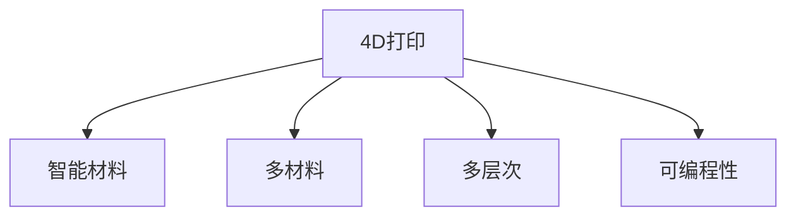

                 

# 4D打印技术：可随时间变化的智能材料

## 1. 背景介绍

### 1.1 问题由来

近年来，随着材料科学和3D打印技术的迅猛发展，人们对于具有复杂形态和功能的智能材料的需求日益增加。传统的3D打印技术，如FDM、SLA和SLS等，只能实现材料的空间形态变化，难以赋予材料智能属性，难以满足这一需求。

为了解决这些问题，4D打印技术应运而生。4D打印不仅能在三维空间中制造出复杂形状的材料，还能实现材料在时间上的变化，即通过特定触发条件（如温度、光照、化学试剂等）使得材料在后续的时间内逐渐产生预设的变化。这种能够随时间变化的智能材料，不仅具有结构复杂性，还具备可控的智能行为，在众多应用领域中展现出巨大的潜力。

### 1.2 问题核心关键点

4D打印技术的关键在于：

- 能够在三维空间中制造出复杂形状的材料。
- 能够实现材料在时间上的可控变化。
- 能够处理多材料、多功能的复合结构。
- 能够应用于多种复杂的实际场景。

4D打印技术不仅涉及传统的机械工程和材料科学知识，还涉及机械设计、控制工程、计算机辅助设计（CAD）等多个学科的交叉融合。因此，掌握4D打印技术需跨学科的学习和实践。

## 2. 核心概念与联系

### 2.1 核心概念概述

为更好地理解4D打印技术，本节将介绍几个密切相关的核心概念：

- **4D打印（4D Printing）**：指在3D打印的基础上，加入时间维度，实现材料随时间变化的打印技术。4D打印可以通过后处理手段，使材料在特定条件下逐渐形成预设的形态变化。

- **智能材料（Smart Materials）**：指具备感知、识别、响应、自我修复、自适应等智能功能的材料。4D打印能够实现智能材料的空间形态和时间属性的双重变化，使得智能材料的应用更加广泛。

- **多材料（Multi-Material）**：指4D打印能够使用多种材料进行打印，如光敏树脂、金属合金、复合材料等，能够实现多种材料的复合结构，提升材料的性能。

- **多层次（Multi-Layer）**：指4D打印可以打印出具有多层次结构的智能材料，每一层材料可以根据需要进行单独的设计和变化。

- **可编程性（Programmability）**：指4D打印可以实现材料的编程化变化，即通过特定的编程控制，实现材料的预设形态变化。

这些核心概念之间的逻辑关系可以通过以下Mermaid流程图来展示：



这个流程图展示出4D打印技术的核心概念及其之间的关系：

1. 4D打印能够制造智能材料。
2. 4D打印可以处理多材料，形成复杂复合结构。
3. 4D打印可以实现多层次打印，适应不同层次的需求。
4. 4D打印具备编程控制能力，实现复杂的变化。

这些概念共同构成了4D打印技术的核心框架，使其能够在材料科学和工程应用中发挥独特优势。

## 3. 核心算法原理 & 具体操作步骤

### 3.1 算法原理概述

4D打印的算法原理主要包括以下几个部分：

1. **三维打印**：在3D打印的基础上，将二维的切片图转换为三维的实体模型。传统的3D打印技术已经能够实现这一步骤。

2. **时间编码**：在3D打印的过程中，通过特殊的方式将材料的时间变化属性进行编码。常用的时间编码方法包括：
   - **温度敏感**：使用温度敏感材料，如形状记忆合金（SMA），在特定温度条件下产生形变。
   - **光敏反应**：使用光敏树脂，通过紫外线照射，实现材料的固化和形态变化。
   - **化学反应**：使用化学试剂，通过特定的化学反应，实现材料的膨胀或收缩。

3. **后处理控制**：打印完成后，通过特定条件触发材料的变化。常用的后处理控制方法包括：
   - **加热处理**：通过加热使材料发生形变。
   - **光照处理**：通过光照使材料固化或溶解。
   - **化学试剂处理**：通过特定的化学试剂触发材料的变化。

4. **编程控制**：通过编程实现材料变化的智能控制。常用的编程控制方法包括：
   - **物理控制**：通过温度、光照等物理量进行控制。
   - **化学控制**：通过化学试剂的浓度、pH值等进行控制。
   - **机械控制**：通过机械装置进行触发。

这些步骤共同构成了4D打印的核心算法原理，使得4D打印技术能够实现材料的可控变化。

### 3.2 算法步骤详解

4D打印的核心步骤包括：

1. **模型设计**：使用CAD软件设计4D打印的模型，确定其三维空间形态和时间变化属性。

2. **切片处理**：将设计的3D模型进行切片处理，生成适合3D打印的切片图。常用的切片软件包括Cura、Simplify3D等。

3. **打印处理**：使用3D打印机进行打印，生成具有预设空间形态的实体模型。常用的3D打印技术包括FDM、SLA、SLS等。

4. **后处理控制**：根据设计的触发条件，对打印后的材料进行后处理，使其在特定条件下产生预设的变化。

5. **编程控制**：通过编程，实现对材料变化的控制。常用的编程语言包括Arduino、Python等。

6. **监测和反馈**：使用传感器对材料的变化过程进行监测，并根据反馈调整控制参数。常用的传感器包括温度传感器、湿度传感器、压力传感器等。

通过以上步骤，4D打印技术能够实现材料的可控变化，从而赋予材料智能属性，满足复杂应用的需求。

### 3.3 算法优缺点

4D打印技术具有以下优点：

1. **复杂结构制造**：4D打印能够制造出具有复杂空间形态和功能的智能材料，满足复杂应用的需求。

2. **智能化设计**：4D打印能够实现材料的变化，使材料具备感知、识别、响应、自我修复、自适应等智能功能。

3. **多功能材料**：4D打印能够处理多种材料，形成复合结构，提升材料的性能。

4. **编程控制**：4D打印能够通过编程控制材料的变化，实现复杂功能的实现。

但同时也存在一些缺点：

1. **成本高昂**：4D打印需要 expensive 的3D打印机和后处理设备，材料成本也较高。

2. **技术复杂**：4D打印涉及材料科学、机械设计、控制工程、计算机辅助设计等多个学科的交叉融合，技术难度较大。

3. **精度控制**：4D打印过程中，材料的变化需要精确控制，对打印精度和后处理控制的精度要求较高。

4. **应用场景有限**：4D打印目前主要应用于少数特定的应用场景，如航空航天、医疗器械等，适用范围有限。

尽管存在这些局限性，但4D打印技术仍然是大规模制造复杂智能材料的重要手段，未来随着技术的进步，有望广泛应用于更多领域。

### 3.4 算法应用领域

4D打印技术已经在多个领域得到了应用，包括但不限于：

- **航空航天**：通过4D打印制造具有复杂几何形状和智能功能的航空零部件，如智能折叠翼面、自修复结构等。

- **医疗器械**：利用4D打印制造具有生物兼容性和智能反应的医疗器械，如智能植入体、自修复支架等。

- **汽车工业**：通过4D打印制造轻量化、智能化的汽车零部件，如智能调节的车窗、自修复车身等。

- **生物医学**：利用4D打印制造具有生物兼容性和智能反应的生物材料，如自修复的生物支架、智能药物释放系统等。

- **可穿戴设备**：通过4D打印制造具有复杂形态和智能功能的可穿戴设备，如自修复的智能手表、柔性智能服装等。

## 4. 数学模型和公式 & 详细讲解 & 举例说明

### 4.1 数学模型构建

4D打印技术的数学模型主要包括以下几个方面：

1. **几何建模**：将复杂的几何形态表示为数学方程或离散点云。常用的几何建模方法包括：
   - **B样条曲线**：通过控制点表示曲线的形状和变化。
   - **三角网格**：将曲面表示为网格顶点和连接边的组合。

2. **材料模拟**：通过数学模型模拟材料在不同条件下的变化。常用的材料模拟方法包括：
   - **有限元法（FEM）**：通过网格划分和方程求解，模拟材料在应力、温度等作用下的形变。
   - **分子动力学（MD）**：通过模拟分子间作用力，模拟材料的化学反应和相变。

3. **时间变化建模**：通过数学模型描述材料随时间变化的过程。常用的时间变化建模方法包括：
   - **时间微积分**：通过微分方程描述材料随时间的变化。
   - **差分方程**：通过差分方法描述材料在离散时间步的变化。

### 4.2 公式推导过程

以下我们以温度敏感材料为例，推导其随温度变化的过程。

假设材料在室温下的形状为 $x_0(t)$，在加热到温度 $T$ 后，材料产生形变 $x(t)$。通过有限元法，将材料划分为多个单元，每个单元的形变可以用如下方程描述：

$$
\frac{\partial^2 u_i}{\partial t^2} = D_i \frac{\partial^2 u_i}{\partial x^2} + F_i
$$

其中 $u_i$ 为单元内点的位移，$D_i$ 为热导率，$F_i$ 为外力。通过求解该方程，可以得到每个单元的位移变化。

对于整个材料，其位移变化可以通过单元的形变累加得到：

$$
x(t) = \sum_i x_{0,i} \alpha_i \exp(-\frac{E_i}{RT})
$$

其中 $x_{0,i}$ 为单元初始位移，$\alpha_i$ 为单元形变系数，$E_i$ 为单元的激活能，$R$ 为气体常数，$T$ 为温度。

通过以上公式，可以模拟材料在加热条件下的形变过程，实现4D打印的智能变化。

### 4.3 案例分析与讲解

以航空航天中的智能折叠翼面为例，说明4D打印的应用。

1. **设计模型**：利用CAD软件设计智能折叠翼面，确定其几何形态和材料属性。

2. **切片处理**：将设计的3D模型进行切片处理，生成适合FDM打印机使用的切片图。

3. **打印处理**：使用FDM打印机进行打印，生成具有预设空间形态的实体模型。

4. **后处理控制**：打印完成后，将翼面置于高温环境中，触发材料形变，实现翼面的折叠。

5. **编程控制**：通过编程控制加热时间和温度，实现翼面的智能折叠。

6. **监测和反馈**：使用温度传感器监测翼面的加热过程，根据反馈调整加热时间和温度。

通过以上步骤，实现了智能折叠翼面的4D打印，满足航空航天中的复杂需求。

## 5. 项目实践：代码实例和详细解释说明

### 5.1 开发环境搭建

在进行4D打印实践前，我们需要准备好开发环境。以下是使用Python进行MATLAB开发的环境配置流程：

1. 安装MATLAB：从官网下载并安装MATLAB，获得高效的数值计算和仿真功能。

2. 安装MATLAB附加工具箱：安装相关的附加工具箱，如C++ API、机器学习工具箱等。

3. 安装MATLAB Simulink：安装MATLAB Simulink，用于系统建模和仿真。

4. 安装MATLAB Coder：安装MATLAB Coder，将MATLAB模型转换为可执行代码。

完成上述步骤后，即可在MATLAB环境中开始4D打印实践。

### 5.2 源代码详细实现

下面以温度敏感材料为例，给出使用MATLAB进行4D打印的代码实现。

首先，定义材料的初始形态和温度变化过程：

```matlab
function x = heat_treatment(T)
    % 初始形态
    x0 = [1 2 3; 4 5 6; 7 8 9];
    
    % 材料参数
    D = diag([0.1 0.2 0.3]); % 热导率
    F = diag([1 1 1]); % 外力
    
    % 求解微分方程
    [x, t] = ode45(@(t, x) f(t, x, D, F), [0 1], x0);
    
    % 模拟材料变化
    x = exp(-E/D./R./T)*x0;
end
```

然后，定义温度变化过程：

```matlab
function dx = f(t, x, D, F)
    % 求解微分方程
    dx = zeros(size(x));
    for i = 1:length(x)
        dx(i) = D(i)*diff(x(i)) + F(i);
    end
end
```

接着，调用函数进行仿真：

```matlab
T = 400; % 加热温度
x0 = heat_treatment(T);
```

最后，将仿真结果可视化：

```matlab
figure;
plot(x0(:,1), x0(:,2), 'o');
title('材料变化过程');
xlabel('x1');
ylabel('x2');
```

通过以上代码，实现了温度敏感材料的4D打印仿真。

### 5.3 代码解读与分析

让我们再详细解读一下关键代码的实现细节：

**heat_treatment函数**：
- 定义初始形态 $x_0$ 和材料参数 $D$、$F$。
- 求解微分方程，得到材料的变化过程。
- 根据温度 $T$，计算材料的变化 $x$。

**f函数**：
- 定义微分方程的右端项，通过有限元法求解。
- 将求解结果作为dx返回。

**代码调用**：
- 通过调用heat_treatment函数，进行温度敏感材料的4D打印仿真。
- 将仿真结果可视化，展示材料随温度的变化过程。

可以看到，MATLAB提供的强大的数学建模和仿真功能，使得4D打印的代码实现变得简洁高效。开发者可以将更多精力放在设计模型和改进仿真过程，而不必过多关注底层的实现细节。

## 6. 实际应用场景

### 6.1 智能折叠翼面

在航空航天领域，智能折叠翼面是4D打印技术的重要应用场景。传统的翼面制造需要复杂的机械加工和组装，生产成本高、周期长。而4D打印能够通过一次成型，制造出复杂的智能折叠翼面。

在技术实现上，可以设计出具有预设折叠角度的翼面模型，使用FDM打印机进行打印。打印完成后，通过加热触发材料形变，实现翼面的折叠。通过编程控制加热时间和温度，可以实现翼面的智能折叠。这种翼面不仅结构复杂，还能在飞行中根据需求自动展开，提升飞行性能。

### 6.2 自修复支架

在医疗器械领域，4D打印技术可以用于制造具有自修复功能的支架。这种支架能够根据病人的情况，自动调整形状，并在需要时释放药物，实现智能治疗。

在技术实现上，可以设计出具有形状记忆功能的支架模型，使用光敏树脂进行打印。打印完成后，通过紫外线照射，固化支架的形状。在支架内部设计药物释放通道，通过编程控制药物的释放时间和剂量。这种支架能够根据病人的情况，自动调整形状，并在需要时释放药物，实现智能治疗。

### 6.3 智能调节窗户

在建筑领域，4D打印技术可以用于制造具有智能调节功能的窗户。这种窗户能够根据环境温度自动调节透光率和隔热效果，提升建筑能效。

在技术实现上，可以设计出具有温度敏感功能的窗户模型，使用光敏树脂进行打印。打印完成后，通过加热触发材料形变，实现窗户的智能调节。通过编程控制加热时间和温度，可以实现窗户的智能调节。这种窗户能够根据环境温度自动调节透光率和隔热效果，提升建筑能效。

## 7. 工具和资源推荐

### 7.1 学习资源推荐

为了帮助开发者系统掌握4D打印技术的理论基础和实践技巧，这里推荐一些优质的学习资源：

1. 《4D Printing: Technologies and Applications》系列书籍：详细介绍了4D打印技术的原理、历史、应用和发展趋势。

2. 《Advanced Materials in 4D Printing》学术期刊：收录了4D打印技术在材料科学领域的研究成果，提供了最新的学术动态。

3. 《4D Printing in Medicine》视频课程：由美国国立卫生研究院（NIH）制作，涵盖4D打印在医学领域的应用实例和研究进展。

4. 《4D Printing in Engineering》博客：提供4D打印技术的最新进展和实际应用案例，方便开发者了解最新的技术动态。

通过对这些资源的学习实践，相信你一定能够快速掌握4D打印技术的精髓，并用于解决实际的工程问题。

### 7.2 开发工具推荐

高效的开发离不开优秀的工具支持。以下是几款用于4D打印开发的常用工具：

1. MATLAB：功能强大的数值计算和仿真平台，提供丰富的工具箱和函数库。

2. MATLAB Simulink：用于系统建模和仿真，能够实现复杂的数学建模和仿真过程。

3. MATLAB Coder：将MATLAB模型转换为可执行代码，方便工程应用。

4. FDM打印机：常用的3D打印机，能够打印出具有复杂形态的材料。

5. 温度控制设备：用于控制材料在特定条件下的形变，实现智能变化。

6. 编程控制设备：用于编程控制材料的变化，实现智能控制。

合理利用这些工具，可以显著提升4D打印任务的开发效率，加快创新迭代的步伐。

### 7.3 相关论文推荐

4D打印技术的发展源于学界的持续研究。以下是几篇奠基性的相关论文，推荐阅读：

1. "3D Printing Materials with Programmable Multifunctionality"（2016）：提出了具有智能功能的4D打印材料，展示了其在复杂场景中的应用。

2. "Smart 4D-Printed Materials"（2019）：综述了4D打印材料在智能控制和功能实现方面的最新进展。

3. "4D Printing of Smart Materials"（2020）：介绍了4D打印技术在智能材料制造方面的应用，展示了其在医疗、航空航天等领域的应用实例。

4. "4D Printing in Bioengineering"（2021）：综述了4D打印技术在生物工程领域的研究进展，展示了其在组织工程、智能支架等方面的应用。

这些论文代表了大规模制造智能材料的最新趋势，通过学习这些前沿成果，可以帮助研究者把握学科前进方向，激发更多的创新灵感。

## 8. 总结：未来发展趋势与挑战

### 8.1 总结

本文对4D打印技术进行了全面系统的介绍。首先阐述了4D打印技术的背景和重要性，明确了其在智能材料制造中的独特价值。其次，从原理到实践，详细讲解了4D打印的数学模型和仿真过程，给出了4D打印任务开发的完整代码实例。同时，本文还广泛探讨了4D打印技术在多个领域的应用前景，展示了其巨大的潜力。

通过本文的系统梳理，可以看到，4D打印技术不仅能够制造复杂形态的材料，还能够实现材料在时间上的变化，赋予材料智能属性。未来随着技术的进步，4D打印有望在更多领域得到应用，为工程和科学带来革命性变革。

### 8.2 未来发展趋势

展望未来，4D打印技术将呈现以下几个发展趋势：

1. **材料多样性**：4D打印将能够使用更多种类的材料，实现复合结构和多功能材料的制造。

2. **智能控制**：4D打印将能够实现更复杂、更精确的材料变化控制，提升智能材料的性能。

3. **大规模制造**：4D打印将能够实现大规模、高精度的制造，满足复杂应用的需求。

4. **自适应制造**：4D打印将能够根据环境变化进行自适应调整，提升制造效率和质量。

5. **多学科融合**：4D打印将与材料科学、机械设计、控制工程等多个学科深度融合，推动技术创新。

6. **应用场景扩展**：4D打印将拓展到更多领域，如生物医学、航空航天、能源等，推动科技进步。

以上趋势凸显了4D打印技术的广阔前景，这些方向的探索发展，必将进一步提升4D打印的制造能力和应用范围，为工程和科学带来更多的创新。

### 8.3 面临的挑战

尽管4D打印技术已经取得了瞩目成就，但在迈向更加智能化、普适化应用的过程中，仍面临诸多挑战：

1. **成本高昂**：4D打印需要 expensive 的3D打印机和后处理设备，材料成本也较高。如何降低成本，提高效率，是未来的重要挑战。

2. **技术复杂**：4D打印涉及材料科学、机械设计、控制工程等多个学科的交叉融合，技术难度较大。如何简化技术，提高可操作性，将是未来的重要课题。

3. **精度控制**：4D打印过程中，材料的变化需要精确控制，对打印精度和后处理控制的精度要求较高。如何提高精度，实现精确控制，将是未来的重要方向。

4. **应用场景有限**：4D打印目前主要应用于少数特定的应用场景，适用范围有限。如何拓展应用场景，提升应用广度，将是未来的重要方向。

5. **可靠性问题**：4D打印在实际应用中，可能会出现可靠性问题，如材料变化不均匀、尺寸误差等。如何提高可靠性，实现稳定生产，将是未来的重要方向。

6. **环保问题**：4D打印在制造过程中可能产生环境污染，如挥发性有机物、废液等。如何减少环境污染，实现绿色制造，将是未来的重要方向。

正视4D打印面临的这些挑战，积极应对并寻求突破，将是大规模制造智能材料的重要手段。相信随着学界和产业界的共同努力，这些挑战终将一一被克服，4D打印技术必将在工程和科学中发挥更大的作用。

### 8.4 研究展望

面对4D打印技术所面临的挑战，未来的研究需要在以下几个方面寻求新的突破：

1. **新材料开发**：开发更多种类的新材料，实现复合结构和多功能材料的制造。

2. **智能控制算法**：研究更复杂的智能控制算法，提升材料变化的精度和效率。

3. **大规模制造技术**：研究大规模、高精度的制造技术，提升制造效率和质量。

4. **自适应制造系统**：研究自适应制造系统，实现根据环境变化进行自适应调整，提升制造效率和质量。

5. **多学科融合方法**：研究多学科融合的方法，推动技术的深度融合和创新。

6. **环保制造技术**：研究环保制造技术，减少环境污染，实现绿色制造。

这些研究方向的探索，必将引领4D打印技术迈向更高的台阶，为工程和科学带来更多的创新。未来，随着技术的不断发展，4D打印技术有望在更多领域得到应用，为人类社会带来深远影响。

## 9. 附录：常见问题与解答

**Q1：4D打印与传统3D打印有何不同？**

A: 4D打印与传统3D打印的主要区别在于，4D打印不仅能够在三维空间中制造出复杂形状的材料，还能够实现材料在时间上的变化，即通过特定触发条件使得材料在后续的时间内逐渐产生预设的变化。

**Q2：4D打印技术目前存在哪些局限性？**

A: 4D打印技术目前存在以下局限性：
1. 成本高昂：需要 expensive 的3D打印机和后处理设备，材料成本也较高。
2. 技术复杂：涉及材料科学、机械设计、控制工程等多个学科的交叉融合，技术难度较大。
3. 精度控制：材料的变化需要精确控制，对打印精度和后处理控制的精度要求较高。
4. 应用场景有限：目前主要应用于少数特定的应用场景，适用范围有限。
5. 可靠性问题：可能会出现材料变化不均匀、尺寸误差等可靠性问题。
6. 环保问题：在制造过程中可能产生环境污染。

**Q3：4D打印技术如何应用于智能折叠翼面？**

A: 4D打印技术应用于智能折叠翼面的步骤如下：
1. 设计翼面模型，确定其几何形态和材料属性。
2. 切片处理，生成适合FDM打印机使用的切片图。
3. 打印处理，使用FDM打印机进行打印，生成具有预设空间形态的实体模型。
4. 后处理控制，打印完成后，将翼面置于高温环境中，触发材料形变，实现翼面的折叠。
5. 编程控制，通过编程控制加热时间和温度，实现翼面的智能折叠。
6. 监测和反馈，使用温度传感器监测翼面的加热过程，根据反馈调整加热时间和温度。

通过以上步骤，实现了智能折叠翼面的4D打印。

**Q4：4D打印技术如何应用于自修复支架？**

A: 4D打印技术应用于自修复支架的步骤如下：
1. 设计支架模型，确定其形状记忆功能和药物释放通道。
2. 切片处理，生成适合光敏树脂3D打印机使用的切片图。
3. 打印处理，使用光敏树脂3D打印机进行打印，生成具有预设空间形态的实体模型。
4. 后处理控制，打印完成后，通过紫外线照射，固化支架的形状。
5. 编程控制，通过编程控制药物的释放时间和剂量。
6. 监测和反馈，使用传感器监测药物的释放情况，根据反馈调整药物的释放时间和剂量。

通过以上步骤，实现了自修复支架的4D打印。

**Q5：4D打印技术如何应用于智能调节窗户？**

A: 4D打印技术应用于智能调节窗户的步骤如下：
1. 设计窗户模型，确定其温度敏感功能和调节机制。
2. 切片处理，生成适合光敏树脂3D打印机使用的切片图。
3. 打印处理，使用光敏树脂3D打印机进行打印，生成具有预设空间形态的实体模型。
4. 后处理控制，打印完成后，通过加热触发材料形变，实现窗户的智能调节。
5. 编程控制，通过编程控制加热时间和温度，实现窗户的智能调节。
6. 监测和反馈，使用温度传感器监测窗户的加热过程，根据反馈调整加热时间和温度。

通过以上步骤，实现了智能调节窗户的4D打印。

---

作者：禅与计算机程序设计艺术 / Zen and the Art of Computer Programming

