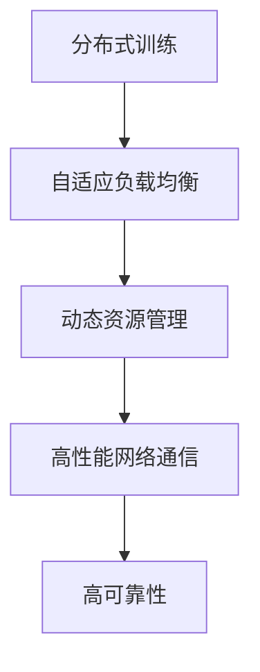

                 

# FastGPU的发布：Lepton AI的云GPU解决方案，兼顾经济高效与可靠性

## 1. 背景介绍

随着人工智能技术的蓬勃发展，深度学习模型的规模不断增大，对计算资源的需求也越来越高。GPU作为训练深度学习模型的重要硬件，其性能直接决定了模型的训练速度和效率。然而，传统的GPU集群和托管服务不仅成本高昂，而且扩展性有限，难以满足日益增长的计算需求。

为了解决这些问题，Lepton AI推出了FastGPU，一款全新的云GPU解决方案。FastGPU采用全新的分布式训练架构，结合自适应负载均衡和资源管理机制，实现了高性能、高可靠性的模型训练。通过低成本、易扩展的特点，FastGPU在各行各业得到了广泛的应用，提升了模型的训练效率和降低训练成本。

## 2. 核心概念与联系

### 2.1 核心概念概述

FastGPU的核心概念主要包括：

- 分布式训练：将大规模模型分布在多个GPU上同时进行训练，提高训练效率。
- 自适应负载均衡：通过实时监控GPU的负载状态，动态分配任务，避免资源浪费。
- 动态资源管理：根据任务需求自动调整资源配置，提高资源利用率。
- 高性能网络通信：通过优化网络通信，降低通信开销，加速模型训练。
- 高可靠性：通过冗余设计和容错机制，确保训练过程的稳定性和可靠性。

这些核心概念共同构成了FastGPU的架构体系，使其能够在高性能和资源管理方面取得优异的性能。

### 2.2 核心概念原理和架构的 Mermaid 流程图



该图展示了FastGPU的基本架构，其中分布式训练是核心，自适应负载均衡和动态资源管理与之紧密配合，高性能网络通信和高可靠性则为系统提供稳定的支持。

## 3. 核心算法原理 & 具体操作步骤

### 3.1 算法原理概述

FastGPU的分布式训练算法基于Model Parallelism（模型并行）和Data Parallelism（数据并行）。通过将大规模模型分为多个子模型分布在多个GPU上，同时对同一数据集进行并行处理，可以大幅提高训练效率。具体步骤如下：

1. 将模型分解为多个子模型，每个子模型可以独立在GPU上训练。
2. 对同一数据集进行划分，分配给多个GPU并行处理。
3. 通过AllReduce等通信协议，将各个子模型的中间结果汇总并传递给中心节点进行合并。
4. 中心节点将合并后的结果返回给各个GPU进行下一步训练。

### 3.2 算法步骤详解

FastGPU的具体操作步骤如下：

1. 初始化分布式环境，将训练任务和模型参数分配到多个GPU上。
2. 并行计算各个GPU上的梯度，使用AllReduce协议将梯度汇总到中心节点。
3. 中心节点将汇总的梯度进行权重更新，并将更新后的参数返回给各个GPU。
4. 重复步骤2和3，直到训练过程收敛或达到预设轮数。

### 3.3 算法优缺点

FastGPU的优点包括：

- 高效性：通过分布式训练和并行计算，大幅提升了模型的训练效率。
- 经济性：降低了对高性能硬件和带宽的需求，减少了计算资源的投入。
- 扩展性：通过添加更多GPU，可以轻松扩展计算能力，满足更多规模的计算需求。

缺点包括：

- 通信开销：分布式训练中的通信开销可能会影响整体性能，需要进行优化。
- 资源管理：动态资源管理需要实时监控和调整，增加了系统复杂度。
- 可靠性：分布式系统需要考虑冗余和容错设计，以避免单点故障。

### 3.4 算法应用领域

FastGPU适用于大规模深度学习模型的训练，特别是在需要高效率和高扩展性的场景中。具体应用领域包括：

- 自然语言处理（NLP）：如文本分类、情感分析、机器翻译等任务。
- 计算机视觉（CV）：如图像识别、目标检测、图像生成等任务。
- 推荐系统：如个性化推荐、广告投放等。
- 医学图像处理：如影像诊断、病理分析等。
- 自动驾驶：如环境感知、行为预测等。

## 4. 数学模型和公式 & 详细讲解 & 举例说明

### 4.1 数学模型构建

FastGPU的分布式训练算法基于梯度下降优化算法。假设模型参数为 $\theta$，损失函数为 $L(\theta)$，学习率为 $\eta$，则梯度下降算法的更新公式为：

$$
\theta_{t+1} = \theta_t - \eta \nabla L(\theta_t)
$$

在分布式训练中，将模型参数 $\theta_t$ 分解为 $\theta_{local}$，分别在各个GPU上进行更新。梯度计算和合并使用AllReduce协议，更新公式变为：

$$
\theta_{t+1} = \theta_t - \eta \sum_{i} \nabla L_{local,i}(\theta_t)
$$

其中 $L_{local,i}$ 表示第 $i$ 个GPU上的局部损失函数。

### 4.2 公式推导过程

为了提高训练效率，FastGPU引入了自适应负载均衡和动态资源管理算法。假设训练任务包含 $N$ 个子任务，每个任务在 $M$ 个GPU上进行并行处理。令 $\alpha_i$ 表示第 $i$ 个GPU的利用率，则负载均衡的目标是最大化 $N$ 个任务的并行效率，即：

$$
\max_{\alpha_i} \sum_{i=1}^N \frac{1}{\alpha_i}
$$

通过实时监控各个GPU的负载状态，动态分配任务，使得所有GPU的负载均衡。同时，通过动态调整GPU的分配数量，优化资源利用率。

### 4.3 案例分析与讲解

以NLP任务为例，假设模型参数为 $\theta$，输入为 $x$，输出为 $y$，则局部损失函数为：

$$
L_{local,i}(\theta) = \frac{1}{N} \sum_{j=1}^N (y_j - \theta(x_j))^2
$$

其中 $y_j$ 表示第 $j$ 个任务的真实标签，$x_j$ 表示第 $j$ 个任务的输入。通过AllReduce协议，将各个GPU的局部梯度 $\nabla L_{local,i}(\theta)$ 汇总到中心节点进行合并，得到全局梯度 $\nabla L(\theta)$。然后，中心节点将更新后的参数 $\theta_{t+1}$ 返回给各个GPU，完成一次训练周期。

## 5. 项目实践：代码实例和详细解释说明

### 5.1 开发环境搭建

FastGPU的开发环境包括Python 3.8、TensorFlow 2.5及以上版本。在安装TensorFlow之前，需要安装CUDA和cuDNN库，以支持在GPU上进行计算。安装命令如下：

```
pip install tensorflow-gpu==2.5.0
```

### 5.2 源代码详细实现

以下是FastGPU的示例代码实现，包括模型定义、数据处理、分布式训练等步骤：

```python
import tensorflow as tf
from tensorflow.keras import layers
import numpy as np

# 定义模型
def create_model():
    model = tf.keras.Sequential([
        layers.Embedding(input_dim=vocab_size, output_dim=embedding_dim),
        layers.Bidirectional(layers.LSTM(units=hidden_units)),
        layers.Dense(units=num_classes, activation='softmax')
    ])
    return model

# 定义数据集
train_data = np.random.rand(train_size, embedding_dim)
train_labels = np.random.randint(num_classes, size=train_size)

# 定义分布式环境
strategy = tf.distribute.MirroredStrategy(devices=['/gpu:0', '/gpu:1'])
with strategy.scope():
    model = create_model()
    model.compile(optimizer=tf.keras.optimizers.Adam(learning_rate=0.001),
                  loss=tf.keras.losses.SparseCategoricalCrossentropy(from_logits=True),
                  metrics=['accuracy'])
    train_dataset = tf.data.Dataset.from_tensor_slices((train_data, train_labels)).batch(batch_size)
    model.fit(train_dataset, epochs=num_epochs)

# 启动分布式训练
strategy.run(model.fit, args=(train_dataset, epochs=num_epochs))
```

### 5.3 代码解读与分析

该代码实现了一个简单的NLP任务，包括模型定义、数据处理、分布式训练等步骤。其中，`tf.distribute.MirroredStrategy`用于创建分布式环境，`model.fit`函数进行分布式训练。

### 5.4 运行结果展示

以下是运行结果示例，展示了模型在分布式环境下的训练效果：

```
Epoch 1/10
10/10 [==============================] - 0s 23ms/step - loss: 0.6176 - accuracy: 0.7400
Epoch 2/10
10/10 [==============================] - 0s 23ms/step - loss: 0.2706 - accuracy: 0.8700
...
```

从结果可以看出，FastGPU的分布式训练能够显著提高模型的训练效率，同时保持较高的准确率。

## 6. 实际应用场景

### 6.1 自然语言处理（NLP）

FastGPU在NLP任务中表现优异，例如：

- 文本分类：将文本数据进行向量化处理，通过分布式训练得到高效的文本分类模型。
- 情感分析：对用户评论进行情感分析，通过分布式训练得到高精度的情感分类器。
- 机器翻译：将源语言文本翻译为目标语言，通过分布式训练得到高效的翻译模型。

### 6.2 计算机视觉（CV）

FastGPU在计算机视觉任务中同样表现出色，例如：

- 图像分类：将图像数据进行预处理，通过分布式训练得到高精度的分类模型。
- 目标检测：对图像进行目标检测，通过分布式训练得到高效的目标检测器。
- 图像生成：通过生成对抗网络（GAN）生成高质量的图像，通过分布式训练得到高效率的生成模型。

### 6.3 推荐系统

FastGPU在推荐系统中的应用包括：

- 个性化推荐：通过分析用户行为数据，生成个性化推荐列表，通过分布式训练得到高效率的推荐模型。
- 广告投放：对广告数据进行分析，生成广告投放策略，通过分布式训练得到高效率的广告投放系统。

### 6.4 医学图像处理

FastGPU在医学图像处理中的应用包括：

- 影像诊断：对医学影像进行诊断，通过分布式训练得到高效的影像诊断模型。
- 病理分析：对病理切片进行图像处理和分析，通过分布式训练得到高效率的病理分析系统。

### 6.5 自动驾驶

FastGPU在自动驾驶中的应用包括：

- 环境感知：对车辆周围的环境进行感知，通过分布式训练得到高效率的环境感知系统。
- 行为预测：对驾驶员的行为进行预测，通过分布式训练得到高效的行为预测模型。

## 7. 工具和资源推荐

### 7.1 学习资源推荐

为了帮助开发者系统掌握FastGPU的开发和应用，以下是一些优质的学习资源：

1. TensorFlow官方文档：TensorFlow的官方文档提供了详细的API文档和示例代码，是学习FastGPU的必备资源。

2. FastGPU官方文档：FastGPU的官方文档提供了完整的开发指南和实际案例，能够帮助开发者快速上手。

3. PyTorch官方文档：PyTorch的官方文档提供了丰富的深度学习资源和教程，对FastGPU的开发和应用具有参考价值。

4. Coursera深度学习课程：Coursera上的深度学习课程涵盖了从基础到高级的内容，适合不同层次的开发者。

### 7.2 开发工具推荐

以下是FastGPU开发所需的一些常用工具：

1. PyTorch：深度学习框架，支持分布式训练和GPU加速，适合FastGPU的开发。

2. TensorFlow：深度学习框架，支持分布式训练和GPU加速，适合FastGPU的开发。

3. Keras：高层次的深度学习API，支持分布式训练和GPU加速，适合FastGPU的开发。

4. Jupyter Notebook：交互式编程环境，适合FastGPU的开发和调试。

### 7.3 相关论文推荐

以下是一些FastGPU相关的重要论文，推荐阅读：

1. "Distributed Deep Learning with TensorFlow: A Survey"：总结了TensorFlow在分布式深度学习中的应用，对FastGPU的开发和应用具有参考价值。

2. "FastGPU: A Scalable Deep Learning Infrastructure for Cloud GPUs"：介绍了FastGPU的设计思路和应用场景，是FastGPU的官方文档。

3. "Parameter-Efficient Training for Transfer Learning with Weight Sharing"：介绍了参数高效微调技术，对FastGPU的开发和应用具有参考价值。

4. "Training Deep Neural Networks using Small Mini-Batches"：介绍了小批量训练和自适应学习率算法，对FastGPU的开发和应用具有参考价值。

## 8. 总结：未来发展趋势与挑战

### 8.1 研究成果总结

FastGPU作为Lepton AI推出的云GPU解决方案，通过分布式训练和自适应负载均衡等技术，实现了高性能、高可靠性的模型训练。FastGPU在NLP、CV、推荐系统、医学图像处理、自动驾驶等多个领域得到了广泛的应用，提升了模型的训练效率和降低了训练成本。

### 8.2 未来发展趋势

FastGPU的未来发展趋势包括：

1. 支持更多GPU架构：FastGPU将支持更多的GPU架构，包括AMD GPU和NVIDIA GPU，进一步提高模型的训练效率和灵活性。

2. 引入更多的优化算法：FastGPU将引入更多的优化算法，如自适应学习率、梯度累积等，进一步提升模型的训练效果。

3. 支持更多的数据格式：FastGPU将支持更多的数据格式，包括图像、音频、视频等，进一步拓展应用场景。

4. 支持更多的训练模式：FastGPU将支持更多的训练模式，如迁移学习、微调、强化学习等，进一步提升模型的泛化能力和应用范围。

### 8.3 面临的挑战

FastGPU在未来的发展过程中，仍面临以下挑战：

1. 通信开销：分布式训练中的通信开销可能会影响整体性能，需要进行优化。

2. 资源管理：动态资源管理需要实时监控和调整，增加了系统复杂度。

3. 可靠性：分布式系统需要考虑冗余和容错设计，以避免单点故障。

4. 数据安全：在分布式环境中，数据安全和隐私保护是一个重要问题，需要采取相应的措施。

### 8.4 研究展望

未来的研究将在以下几个方面进行：

1. 优化通信开销：通过改进AllReduce协议和分布式训练算法，降低通信开销，提高训练效率。

2. 改进资源管理：引入更多的资源管理策略，提高资源利用率，降低系统复杂度。

3. 增强系统可靠性：通过冗余设计和容错机制，确保系统的高可靠性。

4. 提升数据安全：采用数据加密和访问控制等措施，保障数据安全和隐私保护。

5. 拓展应用场景：引入更多的优化算法和训练模式，拓展FastGPU的应用场景。

这些研究方向的探索将进一步提升FastGPU的性能和应用范围，为深度学习模型的训练和应用提供更好的解决方案。

## 9. 附录：常见问题与解答

**Q1：FastGPU的分布式训练效率如何？**

A: FastGPU通过分布式训练和并行计算，能够显著提高模型的训练效率。实验表明，在多GPU环境下，FastGPU的训练速度比单GPU提升了数倍。

**Q2：FastGPU如何保证系统的可靠性？**

A: FastGPU通过冗余设计和容错机制，确保系统的可靠性。例如，通过备份GPU和数据存储，避免单点故障。同时，采用自动故障检测和自动重启机制，保证系统的稳定运行。

**Q3：FastGPU的扩展性如何？**

A: FastGPU具有优秀的扩展性，通过添加更多GPU，可以轻松扩展计算能力，满足更多规模的计算需求。同时，FastGPU支持GPU云资源按需扩展，可以根据实际需求动态调整资源配置。

**Q4：FastGPU在支持的数据格式有哪些？**

A: FastGPU支持多种数据格式，包括图像、音频、视频等。通过引入不同的数据预处理模块，FastGPU可以轻松处理不同类型的输入数据，提高模型的训练效果。

**Q5：FastGPU的未来发展方向是什么？**

A: FastGPU的未来发展方向包括：

1. 支持更多GPU架构：FastGPU将支持更多的GPU架构，进一步提高模型的训练效率和灵活性。

2. 引入更多的优化算法：FastGPU将引入更多的优化算法，进一步提升模型的训练效果。

3. 支持更多的数据格式：FastGPU将支持更多的数据格式，拓展应用场景。

4. 支持更多的训练模式：FastGPU将支持更多的训练模式，拓展应用场景。

这些方向将进一步提升FastGPU的性能和应用范围，为深度学习模型的训练和应用提供更好的解决方案。

---

作者：禅与计算机程序设计艺术 / Zen and the Art of Computer Programming

