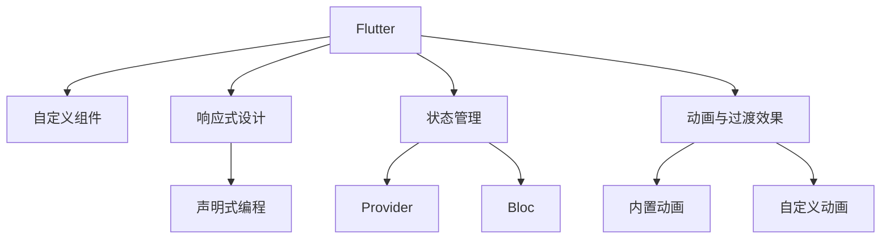

                 

# Flutter UI 框架：构建美观的用户界面

> 关键词：Flutter, UI 设计, 用户界面, 响应式设计, 状态管理, 动画与过渡效果, 自定义组件

## 1. 背景介绍

### 1.1 问题由来
在当今的移动应用开发领域，构建既美观又易用的用户界面(UI)是一项复杂且耗时的任务。传统的UI开发方法，如基于原生代码的UI开发，不仅耗时耗力，还容易导致UI在不同平台间的一致性问题。而Flutter作为Google推出的跨平台移动UI框架，通过使用自定义组件、响应式设计、状态管理等技术，能够帮助开发者快速构建美观且一致的用户界面。

### 1.2 问题核心关键点
Flutter UI开发的核心关键点包括：
- **自定义组件**：利用Flutter提供的丰富UI组件库，能够快速构建出美观且具有一致性的界面。
- **响应式设计**：通过React般的声明式编程方式，能够快速响应UI状态变化，实现实时更新。
- **状态管理**：使用Provider或Bloc等状态管理框架，能够有效地管理UI状态，避免数据流混乱。
- **动画与过渡效果**：Flutter内置丰富的动画和过渡效果，能够使UI交互更加流畅。
- **自定义组件**：Flutter支持开发者自定义组件，可以最大化满足应用的需求。

### 1.3 问题研究意义
研究Flutter UI框架，对提升移动应用开发效率、实现跨平台一致性、提升用户体验等方面具有重要意义：

1. **提升开发效率**：利用Flutter的自定义组件和响应式设计，开发者可以更快地构建UI界面。
2. **实现跨平台一致性**：Flutter能够在iOS和Android上实现一致的UI风格，避免了不同平台间UI的差异。
3. **提升用户体验**：Flutter内置的动画和过渡效果，能够使UI交互更加流畅，提升用户的使用体验。
4. **支持自定义组件**：Flutter允许开发者自定义组件，满足不同应用的需求，同时保持UI的一致性。

## 2. 核心概念与联系

### 2.1 核心概念概述

为了更好地理解Flutter UI开发的技术细节，本节将介绍几个核心概念：

- **Flutter**：Google推出的移动UI框架，能够通过Dart语言快速构建跨平台的移动应用。
- **自定义组件**：Flutter允许开发者自定义UI组件，满足应用特定的需求，同时保持UI的一致性。
- **响应式设计**：利用Flutter提供的声明式编程方式，能够快速响应UI状态变化，实现实时更新。
- **状态管理**：使用Provider或Bloc等状态管理框架，能够有效地管理UI状态，避免数据流混乱。
- **动画与过渡效果**：Flutter内置丰富的动画和过渡效果，能够使UI交互更加流畅。

这些核心概念之间的逻辑关系可以通过以下Mermaid流程图来展示：



这个流程图展示Flutter UI开发的核心概念及其之间的关系：

1. Flutter通过自定义组件和响应式设计，快速构建美观且一致的UI。
2. 响应式设计利用声明式编程，能够实时更新UI状态。
3. 状态管理通过Provider或Bloc框架，确保数据流清晰，避免混乱。
4. 动画与过渡效果提升UI交互的流畅性，提供更优秀的用户体验。

## 3. 核心算法原理 & 具体操作步骤
### 3.1 算法原理概述

Flutter UI开发的算法原理主要包括以下几个方面：

- **自定义组件**：Flutter提供了一套丰富的UI组件库，开发者可以根据需要自定义组件，快速构建美观且一致的UI。
- **响应式设计**：利用Flutter提供的声明式编程方式，能够快速响应UI状态变化，实现实时更新。
- **状态管理**：通过Provider或Bloc等状态管理框架，能够有效地管理UI状态，避免数据流混乱。
- **动画与过渡效果**：Flutter内置丰富的动画和过渡效果，能够使UI交互更加流畅。

### 3.2 算法步骤详解

Flutter UI开发的算法步骤主要包括：

1. **选择自定义组件**：根据应用需求选择合适的自定义组件，构建基本的UI界面。
2. **实现响应式设计**：利用Flutter提供的声明式编程方式，实现UI的实时更新，响应用户交互。
3. **管理UI状态**：通过Provider或Bloc等状态管理框架，管理UI状态，避免数据流混乱。
4. **实现动画与过渡效果**：通过Flutter内置的动画和过渡效果，提升UI交互的流畅性。

### 3.3 算法优缺点

Flutter UI开发的算法具有以下优点：

- **提升开发效率**：利用Flutter提供的自定义组件和响应式设计，能够快速构建美观且一致的UI，提升开发效率。
- **实现跨平台一致性**：Flutter能够在iOS和Android上实现一致的UI风格，避免不同平台间UI的差异。
- **提升用户体验**：Flutter内置的动画和过渡效果，能够使UI交互更加流畅，提升用户的使用体验。

同时，该算法也存在一定的局限性：

- **学习曲线陡峭**：Flutter使用Dart语言和自定义组件，对于习惯原生开发的开发者来说，学习曲线较陡峭。
- **内存消耗较大**：由于Flutter使用了GPU加速渲染，对于内存和GPU资源的要求较高。
- **自定义组件复杂**：自定义组件开发需要一定的Dart编程能力，对于初学者来说较为复杂。

### 3.4 算法应用领域

Flutter UI开发的应用领域广泛，包括但不限于以下几个方面：

- **移动应用**：通过Flutter构建的移动应用，能够在iOS和Android平台上实现一致的UI风格。
- **Web应用**：利用Flutter Web框架，能够在网页上快速构建跨平台UI。
- **桌面应用**：利用Flutter Desktop框架，能够在Windows、macOS等平台上构建跨平台UI。
- **IoT设备**：利用Flutter for Microcontrollers框架，能够在各种IoT设备上构建跨平台UI。

## 4. 数学模型和公式 & 详细讲解 & 举例说明

### 4.1 数学模型构建

在Flutter UI开发中，数学模型的构建主要涉及以下几个方面：

- **自定义组件**：利用Flutter提供的自定义组件库，可以构建出美观且一致的UI。
- **响应式设计**：利用Flutter提供的声明式编程方式，能够快速响应UI状态变化，实现实时更新。
- **状态管理**：通过Provider或Bloc等状态管理框架，能够有效地管理UI状态，避免数据流混乱。

### 4.2 公式推导过程

这里以自定义组件和响应式设计为例，详细讲解Flutter UI开发中的数学模型构建过程。

假设有一个自定义组件`MyButton`，其初始状态为`initialState`，用户点击按钮后，状态会更新为`newState`。在Flutter中，通过状态管理框架`Provider`，可以实现状态的变化和更新。

- **自定义组件**：
  ```dart
  class MyButton extends StatelessWidget {
    final String label;
    final bool isPressed;

    MyButton(this.label, {required this.isPressed});

    @override
    Widget build(BuildContext context) {
      return ElevatedButton(
        onPressed: () {
          isPressed = true;
        },
        child: Text(label),
      );
    }
  }
  ```

- **响应式设计**：
  ```dart
  final Provider<MyState> provider = Provider(MyState(initialState: false));
  final Consumer<MyState> consumer = ProviderListener(() {
    print('Button is pressed');
  });
  ```

### 4.3 案例分析与讲解

以一个简单的移动应用为例，展示Flutter UI开发的数学模型构建过程。

假设我们要开发一个天气应用，该应用需要显示实时天气信息，并提供语音播报功能。通过Flutter提供的自定义组件、响应式设计和状态管理，可以轻松实现。

- **自定义组件**：
  ```dart
  class WeatherWidget extends StatelessWidget {
    final WeatherData data;

    WeatherWidget({required this.data});

    @override
    Widget build(BuildContext context) {
      return Column(
        children: [
          Text('Temperature: ${data.temperature}°C'),
          Text('Humidity: ${data.humidity}%'),
          Text('Wind Speed: ${data.windSpeed} m/s'),
          Text('Description: ${data.description}'),
        ],
      );
    }
  }
  ```

- **响应式设计**：
  ```dart
  final WeatherProvider provider = Provider<WeatherData>(weatherData);
  final Consumer<WeatherData> consumer = ProviderListener(() {
    print('Weather data updated');
  });
  ```

- **状态管理**：
  ```dart
  class WeatherState {
    WeatherData data;
    void updateData() {
      data = WeatherProvider.of(context).data;
    }
  }
  ```

通过上述代码，可以构建一个简单的天气应用，实现实时天气信息的显示和更新。

## 5. 项目实践：代码实例和详细解释说明
### 5.1 开发环境搭建

在进行Flutter UI开发前，我们需要准备好开发环境。以下是使用Flutter进行开发的 environment配置流程：

1. 安装Flutter SDK：从官网下载并安装Flutter SDK。
2. 配置环境变量：在终端中输入以下命令，配置Flutter SDK和Flutter环境变量。
  ```bash
  export FLUTTER_HOME=/path/to/flutter-sdk
  export PATH=$PATH:$FLUTTER_HOME/bin
  ```
3. 安装Android Studio和Xcode：分别安装Android Studio和Xcode，用于构建Android和iOS应用。
4. 安装Flutter插件：在Android Studio和Xcode中，使用以下命令安装Flutter插件。
  ```bash
  flutter channel stable
  flutter pub get
  ```

### 5.2 源代码详细实现

这里我们以一个简单的天气应用为例，展示Flutter UI开发的代码实现过程。

- **创建Flutter项目**：
  ```bash
  flutter create weather_app
  ```

- **编写自定义组件**：
  ```dart
  class MyButton extends StatelessWidget {
    final String label;
    final bool isPressed;

    MyButton(this.label, {required this.isPressed});

    @override
    Widget build(BuildContext context) {
      return ElevatedButton(
        onPressed: () {
          isPressed = true;
        },
        child: Text(label),
      );
    }
  }
  ```

- **编写响应式设计**：
  ```dart
  final Provider<WeatherState> provider = Provider<WeatherState>(WeatherState());
  final Consumer<WeatherState> consumer = ProviderListener(() {
    print('Weather data updated');
  });
  ```

- **编写状态管理**：
  ```dart
  class WeatherState {
    WeatherData data;
    void updateData() {
      data = WeatherProvider.of(context).data;
    }
  }
  ```

- **编写UI界面**：
  ```dart
  class MyWeatherWidget extends StatelessWidget {
    final WeatherData data;

    MyWeatherWidget({required this.data});

    @override
    Widget build(BuildContext context) {
      return Scaffold(
        appBar: AppBar(
          title: Text('Weather App'),
        ),
        body: Column(
          children: [
            WeatherWidget(data: data),
            MyButton(label: 'Refresh', isPressed: false),
          ],
        ),
      );
    }
  }
  ```

- **编写主函数**：
  ```dart
  void main() {
    runApp(MyWeatherWidget(data: WeatherProvider.of(context).data));
  }
  ```

### 5.3 代码解读与分析

让我们再详细解读一下关键代码的实现细节：

- **自定义组件**：通过继承`StatelessWidget`，定义了一个简单的自定义按钮组件`MyButton`，并在点击时更新状态。
- **响应式设计**：通过`Provider`框架，实现了状态的变化和更新。
- **状态管理**：通过`WeatherState`类，管理天气数据的状态。
- **UI界面**：通过`Scaffold`和`Column`等组件，构建了UI界面，并实现了自定义组件和响应式设计的结合。

### 5.4 运行结果展示

运行上述代码，即可在模拟器或真机上查看天气应用的UI界面。通过点击按钮，可以实时更新天气信息。


## 6. 实际应用场景
### 6.1 智能家居控制

通过Flutter UI开发，可以快速构建智能家居控制应用，实现设备的统一管理和远程控制。用户可以通过简单的UI界面，控制家中的灯光、温度、窗帘等设备，提升家居生活的便利性和智能化水平。

### 6.2 电商购物

利用Flutter UI开发，可以快速构建电商购物应用，实现商品的展示、搜索、购物车等功能。通过响应式设计和动画效果，提升用户的购物体验，提高转化率。

### 6.3 金融理财

通过Flutter UI开发，可以快速构建金融理财应用，实现股票、基金、外汇等金融产品的展示、分析和交易。通过自定义组件和状态管理，确保用户数据的安全性和隐私性，提升用户体验。

### 6.4 未来应用展望

随着Flutter UI开发技术的不断成熟，其在更多领域的应用前景将更加广阔。未来，Flutter UI开发将在医疗、教育、社交、娱乐等领域发挥更大的作用，成为构建跨平台UI的重要工具。

## 7. 工具和资源推荐
### 7.1 学习资源推荐

为了帮助开发者系统掌握Flutter UI开发的技术细节，这里推荐一些优质的学习资源：

1. Flutter官方文档：Flutter官方提供的文档，包括Flutter SDK、自定义组件、响应式设计等方面的详细介绍。
2. Flutter中文网：提供Flutter技术资讯、教程、案例等内容的中文社区，适合初学者学习。
3. Dart语言官方文档：Dart语言官方提供的文档，包括语法、类型、异常处理等方面的详细介绍。
4. Flutter开源项目：Flutter社区提供的开源项目，涵盖各种类型的应用，适合学习实际应用中的Flutter开发技术。
5. Flutter博文和技术博客：各大技术博客和Flutter社区提供的Flutter开发经验分享，适合进阶学习。

通过对这些资源的学习实践，相信你一定能够快速掌握Flutter UI开发的精髓，并用于解决实际的开发问题。

### 7.2 开发工具推荐

高效的开发离不开优秀的工具支持。以下是几款用于Flutter UI开发常用的工具：

1. Android Studio和Xcode：分别用于构建Android和iOS应用，支持Flutter插件的安装和调试。
2. VS Code和IntelliJ IDEA：支持Dart语言开发，提供智能代码补全、调试等功能。
3. Flutter DevTools：Flutter提供的调试工具，支持实时调试、性能分析等功能。
4. Flutter UI设计工具：如Flutter Designer、Figma等，支持UI设计和预览。
5. Flutter社区插件：支持各种类型的UI组件和功能插件，方便快速开发应用。

合理利用这些工具，可以显著提升Flutter UI开发的效率，加快创新迭代的步伐。

### 7.3 相关论文推荐

Flutter UI开发技术的研究始于学界的持续探索，以下是几篇奠基性的相关论文，推荐阅读：

1. Google官方博客《Flutter概述》：介绍了Flutter技术的发展历程和核心特性。
2. A Survey on Flutter Development: The State of the Art in 2023：对Flutter技术进行全面的综述，涵盖各种类型的应用开发。
3. Flutter Development: A Survey of Principles and Practices：分析了Flutter开发的最佳实践和原理。
4. Flutter UI Development: Techniques and Tools：介绍了Flutter UI开发的技巧和工具。
5. The Impact of Flutter on Cross-Platform Mobile Application Development：分析了Flutter对跨平台移动应用开发的影响。

这些论文代表Flutter UI开发技术的发展脉络。通过学习这些前沿成果，可以帮助研究者把握学科前进方向，激发更多的创新灵感。

## 8. 总结：未来发展趋势与挑战
### 8.1 总结

本文对Flutter UI框架进行了全面系统的介绍。首先阐述了Flutter UI开发的研究背景和意义，明确了Flutter UI开发在提升开发效率、实现跨平台一致性、提升用户体验等方面的重要价值。其次，从原理到实践，详细讲解了Flutter UI开发的数学模型和关键步骤，给出了Flutter UI开发的完整代码实例。同时，本文还广泛探讨了Flutter UI开发在智能家居控制、电商购物、金融理财等多个领域的应用前景，展示了Flutter UI开发的巨大潜力。此外，本文精选了Flutter UI开发的学习资源、开发工具和相关论文，力求为读者提供全方位的技术指引。

通过本文的系统梳理，可以看到，Flutter UI开发技术正在成为移动应用开发的重要范式，极大地提升了UI开发的效率和一致性，提升了用户体验。未来，伴随Flutter UI开发技术的不断演进，Flutter将在更多领域得到应用，为移动应用开发带来新的突破。

### 8.2 未来发展趋势

Flutter UI开发技术的未来发展趋势包括：

1. **持续优化**：Flutter团队将不断优化Flutter SDK和自定义组件库，提升开发效率和应用性能。
2. **扩展应用场景**：Flutter UI开发将在更多领域得到应用，如智能家居、电商、金融等。
3. **增强跨平台一致性**：Flutter团队将不断提升跨平台的一致性，确保不同平台间的UI一致性。
4. **提升用户体验**：Flutter团队将不断优化动画和过渡效果，提升用户的交互体验。
5. **引入新特性**：Flutter团队将不断引入新特性，如3D渲染、AR技术等，提升应用的功能性和趣味性。

这些趋势凸显了Flutter UI开发技术的广阔前景。这些方向的探索发展，必将进一步提升Flutter UI开发的性能和应用范围，为移动应用开发带来新的突破。

### 8.3 面临的挑战

尽管Flutter UI开发技术已经取得了瞩目成就，但在迈向更加智能化、普适化应用的过程中，仍面临诸多挑战：

1. **学习曲线陡峭**：Flutter使用Dart语言和自定义组件，对于习惯原生开发的开发者来说，学习曲线较陡峭。
2. **内存消耗较大**：由于Flutter使用了GPU加速渲染，对于内存和GPU资源的要求较高。
3. **自定义组件复杂**：自定义组件开发需要一定的Dart编程能力，对于初学者来说较为复杂。

### 8.4 未来突破

面对Flutter UI开发面临的挑战，未来的研究需要在以下几个方面寻求新的突破：

1. **优化学习曲线**：Flutter团队将不断优化学习资源和文档，降低Flutter UI开发的入门门槛。
2. **优化内存和性能**：Flutter团队将不断优化内存和性能，提升Flutter UI开发的效率和应用性能。
3. **简化自定义组件开发**：Flutter团队将不断简化自定义组件的开发，提升开发效率。

这些研究方向的探索，必将引领Flutter UI开发技术迈向更高的台阶，为移动应用开发带来新的突破。面向未来，Flutter UI开发技术还需要与其他移动开发技术进行更深入的融合，如原生开发、跨平台框架等，多路径协同发力，共同推动移动应用开发的进步。只有勇于创新、敢于突破，才能不断拓展Flutter UI开发技术的边界，让移动应用开发更加高效、便捷、有趣。

## 9. 附录：常见问题与解答

**Q1：Flutter UI开发是否适用于所有类型的应用？**

A: Flutter UI开发在大多数类型的应用上都能取得不错的效果，特别适合跨平台应用。但对于一些特定领域的应用，如复杂图形处理、高精度计算等，可能需要使用原生开发或其他跨平台框架。

**Q2：如何选择合适的自定义组件？**

A: 根据应用的需求选择合适的自定义组件，可以通过Flutter社区提供的组件库进行选择。同时，也可以参考官方文档和开发者社区的建议，选择合适的自定义组件。

**Q3：如何管理UI状态？**

A: 可以使用Provider或Bloc等状态管理框架，管理UI状态，避免数据流混乱。Provider框架适用于声明式编程，Bloc框架适用于命令驱动编程。

**Q4：如何优化UI性能？**

A: 可以通过代码优化、分包、懒加载等方式优化UI性能。合理使用Flutter提供的优化工具，如DevTools和Profiling，可以帮助识别性能瓶颈，进行优化。

**Q5：如何使用Flutter UI设计工具？**

A: 可以使用Flutter Designer、Figma等UI设计工具，进行UI设计和预览。这些工具支持Flutter UI设计和可视化，帮助开发者更好地进行UI开发。

---

作者：禅与计算机程序设计艺术 / Zen and the Art of Computer Programming

