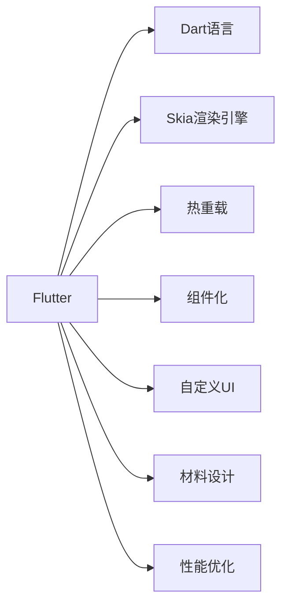

                 

# Flutter：谷歌的移动 UI 框架

## 1. 背景介绍

移动应用开发一直是一个快速发展的领域。从早期的原生开发到后来的Web和跨平台开发，开发方式不断演进。但每一种方式都有其局限性，原生开发效率低下，Web开发难以访问设备功能，跨平台开发则存在性能问题。2015年，谷歌推出了Flutter框架，这是一个基于Skia渲染引擎的移动UI框架，旨在解决这些挑战。Flutter通过使用Dart语言和热重载（Hot Reload）技术，提供了跨平台开发的高性能和开发效率。

## 2. 核心概念与联系

### 2.1 核心概念概述

Flutter框架由Google开发，是一个用于构建移动应用的UI框架。它的主要特点包括：

- **跨平台开发**：Flutter支持iOS和Android两个平台，开发人员可以使用一套代码同时为两个平台生成本地应用。
- **高性能**：使用Skia渲染引擎，支持GPU加速，保证应用流畅的用户体验。
- **热重载**：允许开发者在运行时实时修改代码，而无需重新编译和部署。
- **组件化**：Flutter的构建块称为widget，这些组件可以重用，使得开发更加模块化和可维护。
- **自定义UI**：支持使用自定义UI组件，满足不同的用户界面设计需求。
- **材料设计**：遵循谷歌的Material Design设计语言，提供一致的UI风格。
- **性能优化**：提供各种性能优化工具，如内存分析器、分析器等，帮助开发者提升应用性能。

### 2.2 核心概念原理和架构的 Mermaid 流程图



这个流程图展示了Flutter框架的几个关键概念及其相互关系。开发者使用Dart语言编写代码，通过Skia渲染引擎实现UI渲染，使用热重载技术实时预览和调试代码，通过组件化实现代码复用和模块化，同时支持自定义UI设计、Material Design风格和性能优化。

## 3. 核心算法原理 & 具体操作步骤

### 3.1 算法原理概述

Flutter的算法原理主要基于以下几点：

- **布局算法**：Flutter使用Flex布局模型，通过容器和子组件的布局关系实现UI布局。
- **渲染算法**：Flutter使用Skia引擎进行GPU加速渲染，确保UI流畅和快速响应用户操作。
- **动画算法**：Flutter的动画效果是通过物体的变换来实现的，如平移、旋转、缩放等，使用的时间控制算法确保动画效果平滑流畅。
- **性能优化算法**：Flutter提供了性能分析工具，如内存分析器、分析器等，帮助开发者优化性能，提高应用响应速度。

### 3.2 算法步骤详解

#### 3.2.1 初始化

1. 安装Flutter SDK。
2. 配置环境变量。
3. 创建Flutter项目。

#### 3.2.2 布局

1. 定义布局容器（Container），设置主轴和交叉轴。
2. 添加子组件，通过`Directionality`和`Flex`布局来设置子组件的排列顺序和大小。
3. 使用`Positioned`和`Center`来精确控制组件的位置。

#### 3.2.3 渲染

1. 使用`Canvas`和`Paint`进行自定义渲染。
2. 使用`Paint`的`Style`属性设置颜色、形状和文本样式。
3. 使用`Paint`的`Path`属性绘制自定义形状。

#### 3.2.4 动画

1. 使用`AnimationController`来创建动画控制器。
2. 使用`Tween`类定义动画的关键帧。
3. 使用`AnimatedWidget`来应用动画效果。

#### 3.2.5 性能优化

1. 使用`MemoryDebugger`来分析内存使用情况。
2. 使用`PerformanceOverlay`来查看性能数据。
3. 使用`cupcachefinder`工具来查找缓存问题。

### 3.3 算法优缺点

#### 3.3.1 优点

- **跨平台开发**：Flutter提供了一套代码生成不同平台的本地应用，极大地提高了开发效率。
- **性能高效**：使用Skia渲染引擎，支持GPU加速，保证应用流畅的用户体验。
- **热重载**：实时预览和调试代码，提高了开发效率和可靠性。
- **组件化**：通过组件化实现代码复用和模块化，提高代码可维护性。
- **自定义UI**：支持自定义UI组件和Material Design设计语言，满足不同的设计需求。
- **性能优化**：提供了各种性能优化工具，帮助开发者提升应用性能。

#### 3.3.2 缺点

- **学习成本较高**：需要开发者熟悉Dart语言和Flutter框架。
- **依赖性强**：依赖于Flutter SDK和Skia渲染引擎，可能会影响代码的移植性。
- **复杂度较高**：相比于原生开发，可能需要更多的代码来处理某些功能。

### 3.4 算法应用领域

Flutter适用于各种移动应用开发场景，包括但不限于：

- **电商应用**：如电商平台、商品推荐、购物车等。
- **社交应用**：如社交网络、聊天应用、视频通话等。
- **游戏应用**：如卡牌游戏、射击游戏、益智游戏等。
- **金融应用**：如在线支付、理财平台、股票交易等。
- **教育应用**：如在线教育、语言学习、考试系统等。
- **医疗应用**：如健康管理、电子病历、医疗咨询等。

Flutter的高性能和开发效率使得它在上述领域的应用广泛，可以帮助开发者快速开发出高质量的移动应用。

## 4. 数学模型和公式 & 详细讲解 & 举例说明

### 4.1 数学模型构建

Flutter的布局算法主要基于Flex布局模型。Flex布局模型是一种基于大小和比例的布局模型，通过容器和子组件的布局关系实现UI布局。

#### 4.1.1 Flex布局模型

Flex布局模型由以下五个属性组成：

1. `flexDirection`：定义主轴方向，可选值有`row`、`column`、`row-reverse`和`column-reverse`。
2. `mainAxisAlignment`：定义主轴对齐方式，可选值有`flex-start`、`flex-end`、`center`、`stretch`和`space-between`。
3. `crossAxisAlignment`：定义交叉轴对齐方式，可选值有`flex-start`、`flex-end`、`center`、`stretch`和`space-between`。
4. `alignSelf`：定义子组件的对齐方式，可选值有`auto`、`flex-start`、`flex-end`、`center`和`stretch`。
5. `justifyContent`：定义容器的子组件的排列方式，可选值有`flex-start`、`flex-end`、`center`、`space-between`、`space-around`和`space-evenly`。

#### 4.1.2 布局容器

在Flutter中，布局容器通过`Container`类实现。`Container`类提供了以下属性：

- `height`：容器高度。
- `width`：容器宽度。
- `alignment`：容器的对齐方式，可选值有`center`、`bottom-left`、`bottom-right`、`top-left`和`top-right`。

#### 4.1.3 子组件布局

在Flex布局模型中，子组件的排列方式和对齐方式通过`Flex`和`Positioned`来实现。

- `Flex`：定义子组件在主轴和交叉轴上的大小和对齐方式。
- `Positioned`：定义子组件的位置，可选值有`left`、`right`、`top`、`bottom`、`left-top`、`left-bottom`、`right-top`和`right-bottom`。

### 4.2 公式推导过程

在Flex布局模型中，子组件的大小和位置可以通过以下公式计算：

#### 4.2.1 主轴大小计算

主轴大小计算公式如下：

$$
F_{main} = (F_{main,total} - F_{main,pad}) + \frac{F_{main,rem} \times F_{main,pad}}{F_{main,total}}
$$

其中，$F_{main,total}$ 是主轴总大小，$F_{main,pad}$ 是主轴内边距大小，$F_{main,rem}$ 是剩余大小，$F_{main,rem}$ 是主轴剩余大小。

#### 4.2.2 交叉轴大小计算

交叉轴大小计算公式如下：

$$
F_{cross} = (F_{cross,total} - F_{cross,pad}) + \frac{F_{cross,rem} \times F_{cross,pad}}{F_{cross,total}}
$$

其中，$F_{cross,total}$ 是交叉轴总大小，$F_{cross,pad}$ 是交叉轴内边距大小，$F_{cross,rem}$ 是剩余大小，$F_{cross,rem}$ 是交叉轴剩余大小。

#### 4.2.3 子组件位置计算

子组件的位置计算公式如下：

$$
x = P_{main} + P_{main,pad} \times (F_{main} - P_{main,pad}) / F_{main,total}
$$

$$
y = P_{cross} + P_{cross,pad} \times (F_{cross} - P_{cross,pad}) / F_{cross,total}
$$

其中，$P_{main}$ 和 $P_{cross}$ 是子组件在主轴和交叉轴上的起始位置，$F_{main}$ 和 $F_{cross}$ 是子组件在主轴和交叉轴上的大小，$F_{main,pad}$ 和 $F_{cross,pad}$ 是子组件在主轴和交叉轴上的内边距大小，$F_{main,total}$ 和 $F_{cross,total}$ 是主轴和交叉轴的总大小。

### 4.3 案例分析与讲解

#### 4.3.1 案例一：布局容器

```dart
Container(
  alignment: Alignment.center,
  height: 100,
  width: 200,
  child: Row(
    children: [
      Container(
        alignment: Alignment.center,
        height: 50,
        width: 100,
        color: Colors.red,
      ),
      Container(
        alignment: Alignment.center,
        height: 50,
        width: 100,
        color: Colors.green,
      ),
    ],
  ),
)
```

#### 4.3.2 案例二：Flex布局

```dart
Container(
  height: 200,
  width: 300,
  alignment: Alignment.center,
  child: Column(
    children: [
      Flex(
        direction: FlexDirection.row,
        mainAxisAlignment: MainAxisAlignment.center,
        crossAxisAlignment: CrossAxisAlignment.center,
        child: Padding(
          padding: const EdgeInsets.all(8.0),
          child: Text('Flex'),
        ),
      ),
      Flex(
        direction: FlexDirection.column,
        mainAxisAlignment: MainAxisAlignment.center,
        crossAxisAlignment: CrossAxisAlignment.center,
        child: Padding(
          padding: const EdgeInsets.all(8.0),
          child: Text('Flex'),
        ),
      ),
    ],
  ),
)
```

#### 4.3.3 案例三：自定义渲染

```dart
Container(
  height: 200,
  width: 300,
  alignment: Alignment.center,
  child: Canvas(
    child: Paint()
      ..color = Colors.red
      ..strokeWidth = 4.0
      ..strokeCap = StrokeCap.round
      ..strokeJoin = StrokeJoin.miter
      ..moveTo(50.0, 50.0)
      ..lineTo(100.0, 100.0)
      ..stroke(),
  ),
)
```

## 5. 项目实践：代码实例和详细解释说明

### 5.1 开发环境搭建

1. 安装Flutter SDK。
2. 配置环境变量。
3. 创建Flutter项目。

#### 5.1.1 安装Flutter SDK

1. 下载Flutter SDK并解压。
2. 在`.bashrc`或`.zshrc`文件中添加以下环境变量：

```bash
export FLUTTER_HOME=/path/to/flutter-sdk
export PATH=$PATH:$FLUTTER_HOME/bin
```

3. 执行命令`flutter doctor`，检查Flutter环境是否配置正确。

#### 5.1.2 配置环境变量

在`.bashrc`或`.zshrc`文件中添加以下命令：

```bash
export FLUTTER_HOME=/path/to/flutter-sdk
export PATH=$PATH:$FLUTTER_HOME/bin
```

#### 5.1.3 创建Flutter项目

在终端中执行命令`flutter create my_app`，即可创建一个名为`my_app`的Flutter项目。

### 5.2 源代码详细实现

#### 5.2.1 布局容器

```dart
Container(
  alignment: Alignment.center,
  height: 100,
  width: 200,
  child: Row(
    children: [
      Container(
        alignment: Alignment.center,
        height: 50,
        width: 100,
        color: Colors.red,
      ),
      Container(
        alignment: Alignment.center,
        height: 50,
        width: 100,
        color: Colors.green,
      ),
    ],
  ),
)
```

#### 5.2.2 Flex布局

```dart
Container(
  height: 200,
  width: 300,
  alignment: Alignment.center,
  child: Column(
    children: [
      Flex(
        direction: FlexDirection.row,
        mainAxisAlignment: MainAxisAlignment.center,
        crossAxisAlignment: CrossAxisAlignment.center,
        child: Padding(
          padding: const EdgeInsets.all(8.0),
          child: Text('Flex'),
        ),
      ),
      Flex(
        direction: FlexDirection.column,
        mainAxisAlignment: MainAxisAlignment.center,
        crossAxisAlignment: CrossAxisAlignment.center,
        child: Padding(
          padding: const EdgeInsets.all(8.0),
          child: Text('Flex'),
        ),
      ),
    ],
  ),
)
```

#### 5.2.3 自定义渲染

```dart
Container(
  height: 200,
  width: 300,
  alignment: Alignment.center,
  child: Canvas(
    child: Paint()
      ..color = Colors.red
      ..strokeWidth = 4.0
      ..strokeCap = StrokeCap.round
      ..strokeJoin = StrokeJoin.miter
      ..moveTo(50.0, 50.0)
      ..lineTo(100.0, 100.0)
      ..stroke(),
  ),
)
```

### 5.3 代码解读与分析

#### 5.3.1 布局容器

布局容器`Container`是Flutter中最基本的布局组件，它可以设置容器的高度、宽度和对齐方式，并包含子组件。

#### 5.3.2 Flex布局

Flex布局模型是Flutter中的核心布局模型之一，通过`Flex`组件可以实现子组件在主轴和交叉轴上的布局。

#### 5.3.3 自定义渲染

自定义渲染是通过`Canvas`和`Paint`来实现的，可以实现各种复杂的UI效果。

### 5.4 运行结果展示

运行上述代码，可以看到Flutter生成的UI效果。

## 6. 实际应用场景

Flutter可以应用于各种移动应用开发场景，包括但不限于：

- **电商应用**：如电商平台、商品推荐、购物车等。
- **社交应用**：如社交网络、聊天应用、视频通话等。
- **游戏应用**：如卡牌游戏、射击游戏、益智游戏等。
- **金融应用**：如在线支付、理财平台、股票交易等。
- **教育应用**：如在线教育、语言学习、考试系统等。
- **医疗应用**：如健康管理、电子病历、医疗咨询等。

Flutter的高性能和开发效率使得它在上述领域的应用广泛，可以帮助开发者快速开发出高质量的移动应用。

## 7. 工具和资源推荐

### 7.1 学习资源推荐

1. Flutter官方文档：Flutter官方提供的文档，详细介绍了Flutter的各种API和用法。
2. Flutter中文网：中文社区，提供Flutter的入门教程、实践案例和讨论交流。
3. Flutter杂志：Flutter官方期刊，涵盖Flutter的最新动态、技术分享和实践经验。
4. Flutter教学视频：在YouTube等平台上可以找到大量Flutter教学视频，帮助开发者学习Flutter。

### 7.2 开发工具推荐

1. Dart语言：Flutter的开发语言，Dart语言易于学习和使用，适合移动应用开发。
2. VS Code：Flutter的官方IDE，提供了丰富的插件和功能，支持Dart语言和Flutter开发。
3. Android Studio：Android平台下的IDE，支持Android应用的开发和调试。
4. Xcode：iOS平台下的IDE，支持iOS应用的开发和调试。
5. Flutter内置调试工具：如热重载（Hot Reload）、性能分析工具等，方便开发者调试和优化应用。

### 7.3 相关论文推荐

1. Flutter官方论文：Flutter的学术论文，介绍了Flutter的设计理念和实现细节。
2. Dart语言论文：Dart语言的学术论文，介绍了Dart语言的设计理念和实现细节。
3. Material Design论文：Material Design的学术论文，介绍了Material Design的设计理念和实现细节。
4. Skia渲染引擎论文：Skia渲染引擎的学术论文，介绍了Skia渲染引擎的设计理念和实现细节。

## 8. 总结：未来发展趋势与挑战

### 8.1 研究成果总结

Flutter作为一个跨平台移动UI框架，通过使用Dart语言和Skia渲染引擎，实现了高性能和高开发效率。Flutter的布局算法、渲染算法、动画算法和性能优化算法，确保了应用的流畅和快速响应。Flutter的支持社区和丰富的学习资源，帮助开发者快速上手，并开发出高质量的移动应用。

### 8.2 未来发展趋势

Flutter的未来发展趋势如下：

1. **Flutter for Web**：Flutter for Web已经在2020年推出，未来将进一步完善和优化，支持更多的Web应用开发。
2. **Flutter for Desktop**：Flutter for Desktop将在未来推出，支持桌面应用的开发。
3. **Flutter for TV**：Flutter for TV将在未来推出，支持电视应用的开发。
4. **Flutter for Wearable**：Flutter for Wearable将在未来推出，支持可穿戴设备的开发。
5. **Flutter for Augmented Reality**：Flutter for Augmented Reality将在未来推出，支持增强现实应用的开发。

### 8.3 面临的挑战

Flutter目前面临的挑战包括：

1. **学习曲线较陡峭**：Dart语言和Flutter框架的入门门槛较高，需要一定的学习成本。
2. **社区生态尚需完善**：虽然Flutter社区已经较为活跃，但仍需要更多的插件和工具来丰富生态系统。
3. **性能瓶颈待优化**：在一些高复杂度的场景下，Flutter的性能仍有提升空间。
4. **跨平台兼容性需提升**：Flutter在跨平台开发中，有时需要处理一些平台特定的兼容性问题。
5. **生态系统待扩展**：Flutter需要更多的生态系统支持，包括第三方插件、主题库等。

### 8.4 研究展望

Flutter未来的研究展望包括：

1. **提升性能**：优化渲染算法和动画算法，提升应用性能。
2. **扩展生态**：丰富第三方插件和工具库，提升Flutter的生态系统。
3. **支持更多平台**：支持更多的移动、Web、桌面、可穿戴、增强现实等平台。
4. **优化跨平台兼容性**：优化跨平台兼容性，提升应用性能和用户体验。
5. **提升社区生态**：加强社区建设，提升开发者社区活跃度和参与度。

## 9. 附录：常见问题与解答

### 9.1 常见问题

#### Q1：Flutter与其他跨平台开发框架相比有什么优势？

A: Flutter相比其他跨平台开发框架的优势在于：
1. 高性能：Flutter使用Skia渲染引擎，提供GPU加速渲染，确保应用流畅。
2. 热重载：Flutter支持热重载，实时预览和调试代码，提高开发效率。
3. 组件化：Flutter的组件化设计，使得代码复用和维护更加容易。
4. 自定义UI：Flutter支持自定义UI，满足不同的设计需求。
5. 丰富的插件生态：Flutter拥有丰富的插件生态，支持更多的功能和效果。

#### Q2：Dart语言和Flutter框架的学习门槛高吗？

A: Dart语言和Flutter框架的学习门槛确实较高，但通过官方文档、社区教程和实践案例，可以较快上手。对于有一定编程基础的开发者，学习Flutter不会太困难。

#### Q3：Flutter的性能瓶颈有哪些？

A: Flutter的性能瓶颈主要在于以下几点：
1. 渲染引擎：Skia渲染引擎在高复杂度场景下性能有待提升。
2. 内存管理：Flutter在复杂UI场景下内存占用较大，需要优化。
3. 跨平台兼容性：在跨平台开发中，有时需要处理一些平台特定的兼容性问题。

#### Q4：如何提升Flutter应用的性能？

A: 提升Flutter应用性能的方法包括：
1. 使用热重载（Hot Reload）减少编译时间。
2. 使用性能优化工具，如内存分析器、性能分析器等。
3. 优化渲染算法，使用缓存机制减少渲染次数。
4. 使用内存分析器，查找内存泄漏问题。
5. 使用机器学习模型进行性能预测和优化。

#### Q5：Flutter的跨平台兼容性有哪些问题？

A: Flutter的跨平台兼容性主要存在以下问题：
1. 平台特定组件：一些平台特定的组件在跨平台开发中需要处理兼容性问题。
2. 样式差异：不同平台的样式和设计语言有所不同，需要进行适配。
3. 动画效果：不同平台上的动画效果需要根据平台特性进行调整。

## 9.2 解答

以上是Flutter框架的全面介绍，通过学习Flutter，可以显著提升移动应用的开发效率和用户体验。Flutter的未来发展趋势和面临的挑战也将引导开发者不断探索和优化，使得Flutter在跨平台开发领域中持续领跑。

