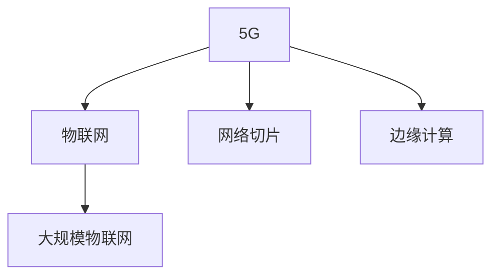

                 

# 5G 在物联网中的优势：支持大规模物联网

> 关键词：5G,物联网,大规模,网络切片,边缘计算,网络性能

## 1. 背景介绍

### 1.1 问题由来
近年来，随着物联网(IoT)设备的快速增长，对网络传输速率、延迟、稳定性和安全性的需求也在不断提升。5G作为新一代移动通信技术，以其高带宽、低延迟、大规模连接能力等特点，为物联网的发展提供了新的契机。然而，传统4G网络在连接数、传输速率等方面已难以满足大规模物联网应用的需求。因此，本文将详细探讨5G在物联网中的优势，及其在支持大规模物联网方面的关键技术和应用。

### 1.2 问题核心关键点
本文将重点分析5G在物联网中的优势，特别是在支持大规模物联网方面的关键技术和应用。

## 2. 核心概念与联系

### 2.1 核心概念概述

为更好地理解5G在物联网中的优势，本节将介绍几个密切相关的核心概念：

- 5G：第五代移动通信技术，其关键特点包括高带宽、低延迟、大规模连接、网络切片和边缘计算等。
- 物联网：通过传感器、智能设备等实现物体间互联互通的网络，以提高效率、降低成本和提升用户体验。
- 大规模物联网：指连接数可达数十亿到数百亿的设备数量级，对网络带宽、延迟和安全性提出更高要求。
- 网络切片：将共享的网络资源划分为多个虚拟专网，实现不同应用场景下的独立网络管理。
- 边缘计算：将数据处理和计算任务分布式部署在网络边缘的本地节点上，减少数据传输和延迟。

这些核心概念之间的逻辑关系可以通过以下Mermaid流程图来展示：



这个流程图展示了大规模物联网中5G的关键技术和作用：

1. 5G作为新一代移动通信技术，为物联网设备的广泛连接提供了可能。
2. 通过网络切片技术，不同应用场景可以共享5G网络资源，但彼此独立，提高网络灵活性和可靠性。
3. 边缘计算通过将数据处理任务本地化，减少延迟，提升数据处理效率。

## 3. 核心算法原理 & 具体操作步骤
### 3.1 算法原理概述

5G在物联网中的优势主要体现在以下几个方面：

- **高带宽和低延迟**：5G网络能够提供更高的传输速率和更低的时延，满足物联网设备对数据传输速度和实时性的高要求。
- **大规模连接能力**：5G网络支持百万级设备的连接，能够处理大规模物联网设备的接入和管理。
- **网络切片**：通过网络切片技术，可以为不同的物联网应用分配独立的网络资源，提高网络的灵活性和可靠性。
- **边缘计算**：通过将数据处理任务本地化，边缘计算可以降低延迟，提高数据处理效率，更好地支持实时性要求高的应用。

### 3.2 算法步骤详解

下面详细介绍5G在物联网中的具体应用步骤：

**Step 1: 网络设计**

1. **5G网络规划**：根据物联网应用需求，进行5G网络覆盖和容量规划，选择适合的频段和天线配置。
2. **切片设计**：为不同应用场景设计不同的网络切片，分配独立的带宽、时延和优先级。
3. **边缘计算部署**：根据物联网设备的分布，在网络边缘部署计算资源，如边缘云和分布式边缘服务器。

**Step 2: 设备接入**

1. **设备管理**：通过5G网络协议和接口，实现对物联网设备的接入、管理和监控。
2. **身份认证**：为设备分配唯一标识，进行安全认证和授权。
3. **数据采集**：通过5G网络收集设备产生的数据，并传输到云端或边缘计算节点。

**Step 3: 数据处理**

1. **数据预处理**：在边缘计算节点对数据进行预处理和清洗，减少数据传输量。
2. **数据传输**：通过5G网络将预处理后的数据传输到云端或目标节点。
3. **实时分析**：在云端或边缘计算节点进行实时数据分析和决策。

**Step 4: 应用部署**

1. **应用开发**：根据物联网应用需求，开发相应的应用和服务。
2. **应用部署**：将应用和服务部署到边缘计算节点或云端，实现快速响应和处理。
3. **应用监控**：对应用进行监控和调优，确保应用稳定运行。

**Step 5: 安全防护**

1. **网络安全**：通过5G网络安全机制，防止数据泄露和攻击。
2. **设备安全**：加强设备身份认证和安全防护，防止未授权访问。
3. **数据安全**：采用加密和匿名化技术，保护数据隐私和安全。

### 3.3 算法优缺点

5G在物联网中的优势主要体现在以下几个方面：

**优点**：
1. **高带宽和低延迟**：5G网络能够满足物联网设备对数据传输速度和实时性的高要求，支持大规模数据传输和处理。
2. **大规模连接能力**：5G网络支持百万级设备的连接，能够处理大规模物联网设备的接入和管理。
3. **网络切片**：通过网络切片技术，可以为不同的物联网应用分配独立的网络资源，提高网络的灵活性和可靠性。
4. **边缘计算**：通过将数据处理任务本地化，边缘计算可以降低延迟，提高数据处理效率，更好地支持实时性要求高的应用。

**缺点**：
1. **成本高**：5G网络的部署和维护成本较高，需要大量的资本投入。
2. **复杂性高**：5G网络的复杂性较高，需要综合考虑网络规划、切片设计和边缘计算部署等因素。
3. **设备兼容性**：并非所有物联网设备都能支持5G网络，需要选择合适的设备进行升级或替换。

尽管存在这些局限性，但就目前而言，5G在物联网中仍然是支撑大规模物联网应用的重要技术，具有显著的性能优势。

### 3.4 算法应用领域

5G在物联网中的应用领域非常广泛，以下是几个典型应用场景：

1. **智慧城市**：通过5G网络，实现智能交通、公共安全、环境监测等应用，提高城市管理效率和安全性。
2. **工业物联网**：通过5G网络，实现工业设备的远程监控、预测性维护和自动化生产，提升工业生产效率和质量。
3. **医疗物联网**：通过5G网络，实现远程医疗、健康监测和智能医疗设备的管理，提高医疗服务质量和效率。
4. **农业物联网**：通过5G网络，实现农作物的智能监测、精准施肥和自动化农机管理，提升农业生产效率和产量。
5. **智能家居**：通过5G网络，实现家居设备的互联互通、智能控制和远程管理，提升家庭生活品质。

## 4. 数学模型和公式 & 详细讲解 & 举例说明

### 4.1 数学模型构建

5G在物联网中的应用主要涉及以下几个关键指标：

1. **带宽**：表示网络单位时间（每秒）内传输数据的能力。
2. **时延**：表示数据从发送端到接收端所需的时间。
3. **连接数**：表示单位时间内网络能够接入的设备数量。
4. **吞吐量**：表示单位时间内网络能够传输的数据量。

假设一个物联网应用场景需要同时连接10万个设备，每个设备每秒需要传输1MB的数据，则网络带宽至少需要：

$$
\text{带宽} = \frac{\text{连接数} \times \text{每秒数据量}}{\text{传输速率}}
$$

在5G网络中，时延控制在1ms以下，满足实时性要求。具体公式推导如下：

### 4.2 公式推导过程

假设5G网络的总带宽为1Gbps（1000Mbps），则每个设备每秒传输1MB的数据时，所需的连接数为：

$$
\text{连接数} = \frac{\text{带宽}}{\text{每秒数据量} \times \text{传输速率}}
$$

代入数据：

$$
\text{连接数} = \frac{1000 \times 8}{1 \times 1000} = 8
$$

因此，5G网络能够同时支持至少8万个设备，满足大规模物联网的需求。

### 4.3 案例分析与讲解

以下以智慧城市应用为例，具体分析5G在物联网中的优势。

**智慧城市交通管理**

智慧城市交通管理需要实时采集车辆位置、速度和交通流量等信息，并进行实时分析和优化。5G网络的高带宽和低延迟能够满足这些需求：

1. **实时数据采集**：通过5G网络，车辆、道路摄像头等设备能够实时传输交通数据到交通管理中心。
2. **实时数据分析**：交通管理中心能够对实时数据进行快速分析和处理，优化交通信号和路线。
3. **实时控制**：通过5G网络，交通管理中心能够向车辆发送实时控制指令，调整交通流量和速度。

## 5. 项目实践：代码实例和详细解释说明
### 5.1 开发环境搭建

在进行5G在物联网中的应用实践前，我们需要准备好开发环境。以下是使用Python进行项目开发的详细环境配置流程：

1. **安装Anaconda**：从官网下载并安装Anaconda，用于创建独立的Python环境。
2. **创建并激活虚拟环境**：
```bash
conda create -n iot-env python=3.8 
conda activate iot-env
```

3. **安装必要的库**：
```bash
pip install tensorflow pytorch sklearn pandas numpy
```

4. **安装物联网相关库**：
```bash
pip install paho-mqtt pyserial
```

完成上述步骤后，即可在`iot-env`环境中开始项目开发。

### 5.2 源代码详细实现

以下是一个使用Python和MQTT协议进行物联网设备数据采集的示例代码：

```python
import paho.mqtt.client as mqtt
import pyserial

# 设备串口配置
ser = pyserial.Serial(port='/dev/ttyUSB0', baudrate=9600)

# MQTT客户端配置
client = mqtt.Client()
client.connect('mqtt.example.com', 1883, 60)

# 订阅设备数据主题
client.subscribe('device/data')

# 处理数据接收回调函数
def on_data_recieved(client, userdata, msg):
    data = ser.readline().decode('utf-8')
    print(data)
    # 将数据发送到MQTT主题
    client.publish('device/process', data)

client.on_message = on_data_recieved

# 循环接收数据
while True:
    client.loop()
```

以上代码实现了以下功能：

1. **设备数据采集**：通过串口读取设备的实时数据，并解析为字符串格式。
2. **数据发送到MQTT主题**：将设备数据发送到MQTT服务器的主题，供后续处理。
3. **循环接收数据**：持续接收设备数据，并进行处理。

### 5.3 代码解读与分析

让我们再详细解读一下关键代码的实现细节：

**MQTT客户端配置**：
- `mqtt.Client()`：创建一个MQTT客户端。
- `client.connect()`：连接到MQTT服务器，并设置超时时间为60秒。
- `client.subscribe()`：订阅设备数据主题。

**数据接收回调函数**：
- `on_data_recieved()`：处理设备数据的接收和处理。
- `ser.readline()`：从串口读取设备数据。
- `client.publish()`：将设备数据发布到MQTT主题。

**循环接收数据**：
- `while True`：持续循环，接收设备数据并处理。

## 6. 实际应用场景
### 6.1 智慧城市交通管理

智慧城市交通管理是5G在物联网中应用的一个典型场景。通过5G网络的高带宽和低延迟，能够实现实时交通数据采集、分析和优化，提升城市交通效率和管理水平。

具体实现步骤如下：

1. **设备数据采集**：通过5G网络，车辆、道路摄像头等设备能够实时传输交通数据到交通管理中心。
2. **数据预处理**：在交通管理中心，对实时数据进行预处理和清洗，提取有用的交通信息。
3. **实时分析与优化**：利用边缘计算或云计算资源，对交通数据进行实时分析和优化，调整交通信号和路线。
4. **实时控制**：通过5G网络，交通管理中心能够向车辆发送实时控制指令，调整交通流量和速度。

**未来应用展望**：

随着5G网络的进一步普及和优化，智慧城市交通管理将变得更加智能化、高效化。通过5G网络的边缘计算和网络切片技术，可以实现更加灵活、可靠的交通管理方案，提升城市交通体验和效率。

### 6.2 工业物联网设备监控

工业物联网设备监控是5G在物联网中的另一个重要应用场景。通过5G网络的高带宽和低延迟，能够实现工业设备的实时监控和预测性维护，提高工业生产效率和质量。

具体实现步骤如下：

1. **设备数据采集**：通过5G网络，工业设备能够实时传输运行状态、性能数据到工业互联网平台。
2. **数据预处理**：在工业互联网平台，对实时数据进行预处理和清洗，提取有用的设备状态信息。
3. **实时分析与优化**：利用云计算资源，对设备数据进行实时分析和优化，预测设备故障和维护需求。
4. **预测性维护**：通过5G网络，工业互联网平台能够向设备发送维护指令，提前进行故障排查和维修。

**未来应用展望**：

未来，随着5G网络的进一步普及和优化，工业物联网设备监控将变得更加智能化、高效化。通过5G网络的高带宽和低延迟，可以实现更加灵活、可靠的工业设备监控方案，提升工业生产效率和质量。

## 7. 工具和资源推荐
### 7.1 学习资源推荐

为了帮助开发者系统掌握5G在物联网中的应用理论基础和实践技巧，这里推荐一些优质的学习资源：

1. **5G基础知识**：推荐阅读《5G移动通信技术基础》一书，全面介绍了5G网络的原理、关键技术和应用场景。
2. **物联网技术**：推荐学习《物联网技术概论》一书，了解物联网设备的连接、数据采集和应用场景。
3. **边缘计算**：推荐学习《边缘计算技术与应用》一书，掌握边缘计算的基本概念、技术实现和应用案例。
4. **MQTT协议**：推荐阅读《MQTT协议入门与实战》一书，了解MQTT协议的基本原理和应用场景。
5. **TensorFlow和PyTorch**：推荐学习官方文档和教程，掌握深度学习框架的基本概念和应用。

通过对这些资源的学习实践，相信你一定能够快速掌握5G在物联网中的应用精髓，并用于解决实际的物联网问题。

### 7.2 开发工具推荐

高效的开发离不开优秀的工具支持。以下是几款用于5G在物联网中的应用开发的常用工具：

1. **MQTT客户端**：推荐使用Eclipse Paho MQTT，支持多种编程语言，方便接入物联网设备。
2. **串口调试工具**：推荐使用Tera Term，方便调试物联网设备的串口通信。
3. **边缘计算平台**：推荐使用Apache Kafka和Apache Flink，支持数据流处理和计算任务部署。
4. **云计算平台**：推荐使用AWS、阿里云和腾讯云，提供强大的计算和存储资源。
5. **开发调试工具**：推荐使用PyCharm和Visual Studio Code，支持Python和多种编程语言的开发调试。

合理利用这些工具，可以显著提升5G在物联网中的应用开发效率，加快创新迭代的步伐。

### 7.3 相关论文推荐

5G在物联网中的应用源于学界的持续研究。以下是几篇奠基性的相关论文，推荐阅读：

1. **5G网络切片技术**：推荐阅读《5G网络切片技术综述》一文，全面介绍了5G网络切片的基本原理和应用场景。
2. **边缘计算技术**：推荐阅读《边缘计算：技术、应用与未来发展》一文，探讨边缘计算的基本概念、技术实现和应用案例。
3. **工业物联网设备监控**：推荐阅读《工业物联网设备监控与维护技术》一文，介绍工业物联网设备监控的基本原理和应用场景。
4. **智慧城市交通管理**：推荐阅读《智慧城市交通管理技术综述》一文，全面介绍智慧城市交通管理的基本概念和应用场景。

这些论文代表了大规模物联网应用的研究进展，可以帮助研究者把握学科前进方向，激发更多的创新灵感。

## 8. 总结：未来发展趋势与挑战

### 8.1 总结

本文对5G在物联网中的应用进行了全面系统的介绍。首先阐述了5G在物联网中的优势，明确了5G网络支持大规模物联网应用的潜力和关键技术。其次，从原理到实践，详细讲解了5G在物联网中的应用过程，包括网络设计、设备接入、数据处理、应用部署和安全防护等关键步骤。最后，本文还探讨了5G在物联网中的实际应用场景，展望了未来发展趋势和面临的挑战。

通过本文的系统梳理，可以看到，5G在物联网中具有显著的优势，为大规模物联网应用提供了新的契机。未来，随着5G网络的进一步普及和优化，5G在物联网中的应用将更加广泛和深入，推动物联网技术的不断发展。

### 8.2 未来发展趋势

展望未来，5G在物联网中的应用将呈现以下几个发展趋势：

1. **网络切片技术优化**：通过网络切片技术，为不同物联网应用分配更灵活、更可靠的网络资源，提高网络性能和稳定性。
2. **边缘计算普及**：边缘计算将在更多的物联网应用中得到普及，降低数据传输延迟，提高数据处理效率。
3. **智能设备普及**：随着智能设备技术的不断发展，更多的物联网设备将支持5G网络，提升设备间的互联互通和智能化水平。
4. **实时性增强**：5G网络的低延迟特性将使更多的实时性要求高的物联网应用得以实现，如智能交通、实时监控等。
5. **安全防护加强**：5G网络将引入更强大的安全机制，保护物联网设备和数据的安全性。

以上趋势凸显了5G在物联网中的重要地位，为物联网技术的进一步发展提供了新的机遇。

### 8.3 面临的挑战

尽管5G在物联网中具有显著的优势，但在实际应用中也面临诸多挑战：

1. **成本高**：5G网络的部署和维护成本较高，需要大量的资本投入。
2. **设备兼容性**：并非所有物联网设备都能支持5G网络，需要选择合适的设备进行升级或替换。
3. **网络复杂性**：5G网络的复杂性较高，需要综合考虑网络规划、切片设计和边缘计算部署等因素。
4. **安全风险**：5G网络的安全性需要进一步加强，防止数据泄露和攻击。
5. **设备维护**：物联网设备的维护和管理仍然是一个重要问题，需要解决设备的自动化和远程管理。

尽管存在这些挑战，但5G在物联网中的应用前景依然广阔。未来，通过技术创新和政策支持，这些挑战将逐步被克服，5G在物联网中的应用将更加广泛和深入。

### 8.4 研究展望

未来，需要在以下几个方面进行更多的研究和探索：

1. **网络优化技术**：研究如何通过网络优化技术，进一步提升5G网络的性能和可靠性。
2. **设备管理技术**：研究如何通过设备管理技术，提升物联网设备的智能化水平和维护效率。
3. **边缘计算优化**：研究如何通过边缘计算优化技术，进一步降低数据传输延迟，提高数据处理效率。
4. **安全防护技术**：研究如何通过安全防护技术，增强5G网络的安全性和隐私保护。
5. **跨领域应用**：研究如何将5G在物联网中的应用推广到更多的领域，如医疗、农业、教育等。

这些研究方向的探索，将进一步推动5G在物联网中的应用，为构建更加智能、高效、安全的物联网生态系统铺平道路。

## 9. 附录：常见问题与解答

**Q1：5G网络切片技术是什么？**

A: 网络切片技术是将共享的网络资源划分为多个虚拟专网，实现不同应用场景下的独立网络管理。通过网络切片技术，可以为不同的物联网应用分配独立的网络资源，提高网络的灵活性和可靠性。

**Q2：5G在物联网中的应用有哪些？**

A: 5G在物联网中的应用非常广泛，包括智慧城市交通管理、工业物联网设备监控、医疗物联网应用、农业物联网应用和智能家居等。

**Q3：5G网络的优势是什么？**

A: 5G网络的优势主要体现在高带宽、低延迟、大规模连接能力、网络切片和边缘计算等方面。

**Q4：如何提高5G在物联网中的应用效果？**

A: 提高5G在物联网中的应用效果，需要综合考虑网络设计、设备接入、数据处理、应用部署和安全防护等因素。通过网络切片技术、边缘计算、智能设备普及和安全防护技术等手段，可以进一步提升5G在物联网中的应用效果。

**Q5：5G在物联网中的应用前景如何？**

A: 5G在物联网中的应用前景非常广阔，随着5G网络的进一步普及和优化，将推动物联网技术的不断发展和应用。

---

作者：禅与计算机程序设计艺术 / Zen and the Art of Computer Programming

