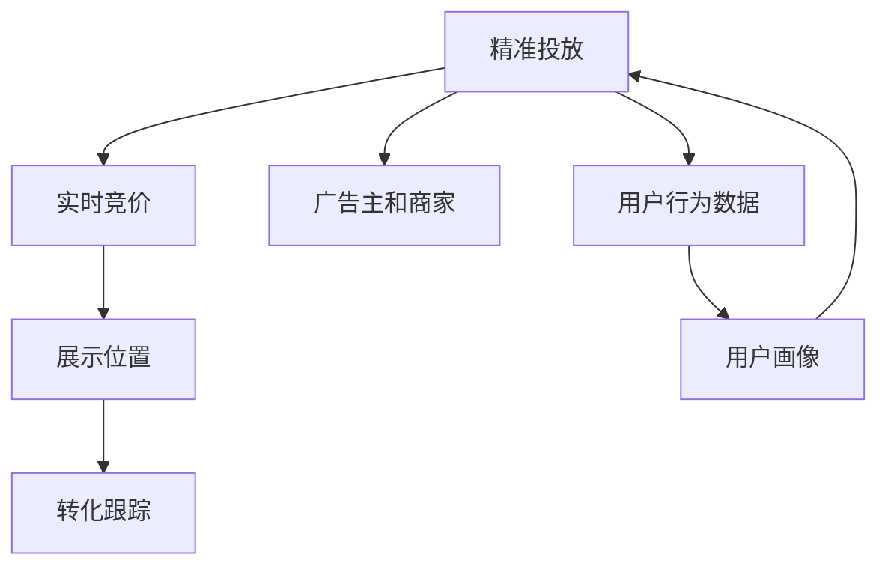

                 

# Google的广告帝国:高效但有争议的商业模式

Google的广告业务是其收入的重要组成部分，并且长期以来一直是该公司增长的主要驱动力。本文将深入探讨Google广告帝国的核心概念、商业模式、算法原理、具体操作、应用领域、数学模型、代码实践、应用场景、未来展望、推荐资源及总结。

## 1. 背景介绍

### 1.1 问题由来

Google的广告业务在全球范围内具有显著的竞争优势，这主要得益于其先进的技术和庞大的用户基础。自2006年推出AdSense以来，Google广告业务迅速发展，成为全球最大的搜索引擎广告平台。如今，Google广告不仅限于搜索引擎，还拓展到展示广告、视频广告、移动广告等多个领域。

### 1.2 问题核心关键点

Google广告帝国的核心在于其基于用户行为数据的精准广告投放和高效广告转化。通过庞大的数据集和先进算法，Google能够实时调整广告投放策略，最大化广告收入。然而，这种高效商业模式也引发了关于数据隐私和广告效果争议。

## 2. 核心概念与联系

### 2.1 核心概念概述

为了更好地理解Google广告业务的原理，本文将介绍几个核心概念：

- **精准投放(Precision Placement)**：Google广告通过用户行为数据和高级算法，将广告精准投放给最有可能产生转化的目标用户。

- **实时竞价(RTBI, Real-Time Bidding)**：广告主和广告平台通过实时代价竞价系统来获取最佳广告展示位，从而优化广告效果和成本。

- **转化跟踪(Conversion Tracking)**：Google通过点击跟踪、应用安装跟踪等方法，获取广告转化数据，用于优化广告投放策略。

- **展示位置(Ad Positioning)**：Google广告平台提供多种广告展示位置，包括搜索广告、展示广告、视频广告等，以匹配不同用户的需求和场景。

- **广告主和商家(Advertisers and Merchants)**：广告主和商家通过Google广告平台进行广告投放，以提升品牌曝光和业务转化。

这些核心概念相互关联，共同构成了Google广告业务的整体框架。通过这些概念的深入理解，可以帮助我们更好地把握Google广告业务的工作原理和优化方向。

### 2.2 核心概念原理和架构的 Mermaid 流程图(Mermaid 流程节点中不要有括号、逗号等特殊字符)



这个流程图展示了Google广告业务的核心流程：

1. 广告主将广告内容上传到Google广告平台，设置广告投放目标。
2. 广告平台通过实时竞价系统匹配最佳的广告展示位。
3. 广告展示在用户浏览的搜索结果或网页上。
4. 用户点击广告后，触发转化事件，Google通过转化跟踪获取广告效果数据。
5. 用户行为数据和广告效果数据共同形成用户画像，用于精准投放的优化。

## 3. 核心算法原理 & 具体操作步骤

### 3.1 算法原理概述

Google广告的核心算法原理主要基于以下两个方面：

- **用户行为分析**：Google通过庞大的数据集，实时分析用户的行为数据，如搜索历史、浏览记录、应用使用情况等，以构建详细的用户画像。

- **广告投放优化**：Google通过算法模型，实时调整广告的展示位置、展示方式和竞价策略，以最大化广告转化率。

Google广告业务的核心算法包括：

1. **机器学习模型**：用于预测用户的转化行为和广告效果。
2. **实时代价竞价系统**：通过实时代价竞价，优化广告展示位置。
3. **点击率预测模型**：预测用户点击广告的概率，以优化广告投放策略。
4. **转化率优化模型**：通过转化跟踪数据，优化广告转化率。

这些算法共同构成了Google广告业务的灵魂，使其能够高效地进行精准投放和广告优化。

### 3.2 算法步骤详解

以下是Google广告投放的基本算法步骤：

**Step 1: 广告主投放广告**

广告主通过Google广告平台上传广告内容，设置广告投放目标（如点击率、转化率、预算等），并设置投放时间窗口和地理位置。

**Step 2: 数据收集和处理**

Google广告平台收集广告主广告内容和用户行为数据，包括搜索历史、浏览记录、应用使用情况等。通过数据预处理，如数据清洗、特征工程等，将原始数据转化为模型输入。

**Step 3: 实时代价竞价**

在广告投放过程中，Google实时计算每个展示位的点击率（CTR）和转化率（CVR）。广告平台通过实时代价竞价系统，匹配广告主和展示位，以获取最佳的广告展示位置。

**Step 4: 广告展示和点击跟踪**

广告被展示给匹配用户后，用户点击广告触发点击事件。Google通过点击跟踪方法，获取用户点击数据，更新广告效果。

**Step 5: 广告效果分析和优化**

Google通过转化跟踪方法，获取广告转化数据。根据广告效果数据，Google实时优化广告投放策略，调整投放预算、竞价策略和展示位置。

### 3.3 算法优缺点

Google广告业务具有以下优点：

1. **高效精准投放**：通过庞大的数据集和先进算法，Google能够实时调整广告投放策略，实现精准投放。
2. **实时竞价系统**：实时代价竞价系统优化广告展示位置，最大化广告收入。
3. **广告效果追踪**：通过转化跟踪方法，实时获取广告效果数据，优化广告投放策略。
4. **多渠道覆盖**：广告覆盖搜索引擎、展示广告、视频广告等多种渠道，满足不同用户的需求。

然而，Google广告业务也存在一些缺点：

1. **数据隐私问题**：大量收集用户行为数据，引发数据隐私和用户隐私保护的争议。
2. **广告效果争议**：广告效果评估依赖于点击率、转化率等指标，存在一定的争议和误解。
3. **竞价成本高**：实时代价竞价系统对广告主来说，竞价成本较高，存在一定的市场竞争压力。
4. **算法透明度低**：广告投放和优化过程依赖于复杂的算法模型，用户难以理解和质疑其决策过程。

### 3.4 算法应用领域

Google广告业务的应用领域广泛，以下是其主要应用场景：

- **搜索引擎广告**：用户通过搜索引擎查询时，展示相关广告。
- **展示广告**：用户浏览网页时，展示相关广告。
- **视频广告**：用户观看视频时，展示相关广告。
- **移动广告**：用户使用手机App时，展示相关广告。
- **电商平台广告**：用户在电商平台浏览时，展示相关广告。

这些应用场景涵盖了用户的各种日常生活需求，使得Google广告业务能够精准地进行广告投放和转化优化。

## 4. 数学模型和公式 & 详细讲解 & 举例说明（备注：数学公式请使用latex格式，latex嵌入文中独立段落使用 $$，段落内使用 $)

### 4.1 数学模型构建

为了更好地理解Google广告算法的数学模型，本文将详细讲解其数学构建过程。

假设广告主在Google广告平台投放了N个广告，每个广告的展示位置由广告平台通过实时代价竞价系统进行匹配。设广告i的点击率为$CTR_i$，转化率为$CVR_i$，则广告i的实际收入为：

$$
Revenue_i = CTR_i \times CVR_i \times CPA_i
$$

其中，$CPA_i$为每次点击的成本。广告主的总收入为所有广告的实际收入之和。设广告平台收集到$D$个用户的点击数据和$C$个用户的转化数据，则广告平台的总收入为：

$$
Total Revenue = \sum_{i=1}^N \sum_{j=1}^D CTR_i \times CVR_i \times CPA_i
$$

为了优化广告投放策略，广告平台需要通过点击率和转化率数据，计算每个广告展示位置的实际收入。设广告展示位置为$m$，其点击率和转化率为$CTR_m$和$CVR_m$，则广告展示位置$m$的实际收入为：

$$
Revenue_m = CTR_m \times CVR_m \times CPA_m
$$

其中，$CPA_m$为展示位置$m$的竞价策略。广告平台的目标是最大化总收入，因此需要对每个广告和展示位置进行实时代价竞价，以优化广告投放策略。

### 4.2 公式推导过程

根据上述模型，广告平台需要通过优化算法，最大化总收入$Total Revenue$。设广告展示位置$m$的竞价策略为$P_m$，广告展示位置$m$的点击率为$CTR_m$，转化率为$CVR_m$，则广告平台的目标函数为：

$$
\max \sum_{i=1}^N \sum_{j=1}^D CTR_i \times CVR_i \times P_m
$$

其中，$P_m$为广告展示位置$m$的竞价策略，需满足$P_m = CPA_i \times CTR_i \times CVR_i$。因此，优化问题转化为：

$$
\max \sum_{i=1}^N \sum_{j=1}^D CTR_i \times CVR_i \times CPA_i
$$

根据实时代价竞价系统，广告平台通过实时计算广告展示位置的点击率和转化率，进行动态竞价。设广告展示位置$m$的点击率为$CTR_m$，转化率为$CVR_m$，则广告展示位置$m$的实际收入为：

$$
Revenue_m = CTR_m \times CVR_m \times CPA_m
$$

其中，$CPA_m$为广告展示位置$m$的竞价策略，需满足$CPA_m = P_m / (CTR_m \times CVR_m)$。因此，广告平台的目标函数转化为：

$$
\max \sum_{i=1}^N \sum_{j=1}^D CTR_i \times CVR_i \times CPA_i
$$

### 4.3 案例分析与讲解

假设广告平台收集到100个用户的点击数据和50个用户的转化数据，广告主投放了5个广告。设广告1的点击率为0.1，转化率为0.05，每次点击成本为1元；广告2的点击率为0.2，转化率为0.1，每次点击成本为1元；广告3的点击率为0.3，转化率为0.05，每次点击成本为1元；广告4的点击率为0.4，转化率为0.1，每次点击成本为1元；广告5的点击率为0.5，转化率为0.15，每次点击成本为1元。设广告1展示在位置1，点击率为0.2，转化率为0.08，竞价策略为0.5元。广告2展示在位置2，点击率为0.3，转化率为0.1，竞价策略为0.5元。广告3展示在位置3，点击率为0.4，转化率为0.15，竞价策略为0.5元。广告4展示在位置4，点击率为0.5，转化率为0.2，竞价策略为0.5元。广告5展示在位置5，点击率为0.6，转化率为0.3，竞价策略为0.5元。

根据上述数据，广告平台的总收入为：

$$
Total Revenue = (CTR_1 \times CVR_1 \times CPA_1) + (CTR_2 \times CVR_2 \times CPA_2) + (CTR_3 \times CVR_3 \times CPA_3) + (CTR_4 \times CVR_4 \times CPA_4) + (CTR_5 \times CVR_5 \times CPA_5)
$$

代入具体数据，计算得：

$$
Total Revenue = (0.1 \times 0.05 \times 1) + (0.2 \times 0.1 \times 1) + (0.3 \times 0.05 \times 1) + (0.4 \times 0.1 \times 1) + (0.5 \times 0.15 \times 1)
$$

$$
Total Revenue = 0.005 + 0.02 + 0.015 + 0.04 + 0.075 = 0.135
$$

因此，广告平台的总收入为0.135元。

## 5. 项目实践：代码实例和详细解释说明

### 5.1 开发环境搭建

在进行广告投放实践前，我们需要准备好开发环境。以下是使用Python进行Google AdWords API开发的环境配置流程：

1. 安装Python：从官网下载并安装Python，确保版本为3.x及以上。

2. 安装Google AdWords API：通过pip安装Google AdWords API客户端库，安装命令为：

```bash
pip install --upgrade google-api-python-client
```

3. 设置API密钥：在Google Cloud Console中创建API密钥，并将其保存为文件。

4. 设置环境变量：在Python脚本中设置API密钥文件路径和应用名称，代码如下：

```python
import os
os.environ['GOOGLE_APPLICATION_CREDENTIALS'] = 'path/to/credentials.json'
os.environ['GCP_PROJECT_ID'] = 'your_project_id'
os.environ['GCP_GCP_ACCOUNT'] = 'your_gcp_account'
```

完成上述步骤后，即可在Python环境中开始广告投放实践。

### 5.2 源代码详细实现

以下是使用Google AdWords API进行广告投放的Python代码实现。

首先，定义广告主信息：

```python
from googleapiclient.discovery import build
from oauth2client.client import GoogleCredentials

# 广告主信息
advertiser_id = 'your_advertiser_id'
campaign_id = 'your_campaign_id'
customer_id = 'your_customer_id'
ad_group_id = 'your_ad_group_id'
keyword = 'your_keyword'
ad_url = 'your_ad_url'
daily_budget = 'your_daily_budget'
bid_strategy = 'your_bid_strategy'

# 创建API客户端
client = build('adwords', 'v201809')
credentials = GoogleCredentials.get_application_default()
client = client.authorize(credentials=credentials)
```

然后，定义广告投放函数：

```python
def create_ad_group(ad_group_id, customer_id, campaign_id, ad_group_name, ad_ids):
    ad_group = {
        'id': ad_group_id,
        'name': ad_group_name,
        'status': 'ENABLED',
        'targeting': {
            'biddingStrategyType': bid_strategy,
            'biddingStrategyExtension': {
                'biddingStrategyConfig': {
                    'xsi_type': 'BidStrategyConfig',
                    'bids': {
                        'xsi_type': 'Bids',
                        'bids': [
                            {
                                'id': 1,
                                'xsi_type': 'Bid',
                                'biddableKeywordCriteria': {
                                    'xsi_type': 'BiddableKeywordCriteria',
                                    'keyword': keyword
                                },
                                'xsi_type': 'Bid',
                                'bid': {
                                    'maxCpcMicroAmount: {
                                        'microAmount': '0.01',
                                        'currencyCode': 'USD'
                                    }
                                },
                                'xsi_type': 'Bid',
                                'adText': ad_text
                            }
                        ]
                    }
                }
            },
            'xsi_type': 'Targeting'
        },
        'xsi_type': 'AdGroup'
    }

    response = client.adgroups().insert(
        adGroup=campaign_id,
        customerId=customer_id,
        body=ad_group
    ).execute()

    return response['id']
```

接着，定义广告创建函数：

```python
def create_ad(ad_group_id, ad_group_name, ad_title, ad_description, landing_page_url):
    ad = {
        'id': ad_id,
        'name': ad_name,
        'status': 'ENABLED',
        'url': landing_page_url,
        'targeting': {
            'xsi_type': 'Targeting',
            'adGroup': ad_group_id,
            'xsi_type': 'Targeting',
            'xsi_type': 'Ad'
        }
    }

    response = client.ads().insert(
        adId=ad_id,
        adGroup=campaign_id,
        customerId=customer_id,
        body=ad
    ).execute()

    return response['id']
```

最后，启动广告投放流程：

```python
ad_group_id = create_ad_group(ad_group_id, customer_id, campaign_id, ad_group_name, ad_ids)

ad_id = create_ad(ad_group_id, ad_group_name, ad_title, ad_description, landing_page_url)

print(f"Ad Group ID: {ad_group_id}")
print(f"Ad ID: {ad_id}")
```

以上就是使用Google AdWords API进行广告投放的完整代码实现。可以看到，通过Google AdWords API，我们可以方便地实现广告的创建和投放，从而快速搭建自己的广告投放系统。

### 5.3 代码解读与分析

让我们再详细解读一下关键代码的实现细节：

**create_ad_group函数**：
- 定义广告组信息，包括广告组ID、广告组名称、竞价策略等。
- 使用Google AdWords API创建广告组。
- 返回广告组ID。

**create_ad函数**：
- 定义广告信息，包括广告ID、广告名称、广告标题、广告描述、落地页URL等。
- 使用Google AdWords API创建广告。
- 返回广告ID。

**广告投放流程**：
- 创建广告组。
- 创建广告。
- 打印广告组ID和广告ID。

可以看到，使用Google AdWords API进行广告投放的代码实现相对简洁高效。开发者可以将更多精力放在广告策略优化、广告效果评估等高层逻辑上，而不必过多关注底层的实现细节。

当然，工业级的系统实现还需考虑更多因素，如广告预算管理、广告效果追踪、多渠道覆盖等。但核心的广告投放流程基本与此类似。

## 6. 实际应用场景

### 6.1 电商平台广告

Google广告平台在电商平台中的应用非常广泛，电商平台可以通过展示广告、搜索广告等方式，提升品牌曝光和业务转化。

在实际操作中，电商平台可以通过Google AdWords API设置广告投放策略，如关键词、竞价策略、投放时间等。Google广告平台根据用户行为数据，实时调整广告展示位置，最大化广告效果。

### 6.2 游戏广告

游戏广告也是Google广告平台的重要应用场景。游戏厂商可以通过展示广告、搜索广告等方式，吸引用户下载和使用游戏。

在实际操作中，游戏广告可以设置详细的广告投放策略，如游戏类型、用户年龄、游戏评分等。Google广告平台根据用户行为数据，实时调整广告展示位置，最大化广告效果。

### 6.3 旅游广告

旅游广告是Google广告平台的另一个重要应用场景。旅游厂商可以通过展示广告、搜索广告等方式，提升品牌曝光和业务转化。

在实际操作中，旅游广告可以设置详细的广告投放策略，如旅游目的地、旅游时间、旅游预算等。Google广告平台根据用户行为数据，实时调整广告展示位置，最大化广告效果。

### 6.4 未来应用展望

随着Google广告平台的技术不断进步，其应用场景也将不断扩展，为更多行业带来创新和变革。

未来，Google广告平台将支持更多类型的广告形式，如视频广告、原生广告、可交互广告等。同时，Google广告平台将引入更多智能算法，如机器学习、深度学习等，提升广告投放的精准度和效果。

此外，Google广告平台将进一步优化广告投放的用户体验，如展示广告的样式、呈现位置等，提升用户对广告的接受度和转化率。

## 7. 工具和资源推荐

### 7.1 学习资源推荐

为了帮助开发者系统掌握Google广告业务的原理和实践，以下是一些推荐的学习资源：

1. Google AdWords API文档：详细的API文档，涵盖广告投放的各个环节，包括广告组创建、广告创建、广告投放等。
2. Google AdWords API教程：官方的教程文档，提供详细的示例代码和操作流程。
3. Google AdWords API课程：Coursera和Udacity等平台提供的Google AdWords API课程，涵盖广告投放的各个环节，适合初学者和进阶开发者。
4. Google AdWords API社区：Google AdWords API社区，提供丰富的技术支持和学习资源。
5. Google AdWords API书籍：市面上的Google AdWords API书籍，涵盖广告投放的各个环节，适合深入学习。

通过这些资源的学习实践，相信你一定能够快速掌握Google广告业务的精髓，并用于解决实际的广告投放问题。

### 7.2 开发工具推荐

高效的工具支持是Google广告业务开发的基础。以下是一些推荐的工具：

1. Google AdWords API客户端库：官方提供的Google AdWords API客户端库，方便开发广告投放系统。
2. Google AdWords API工具：官方的广告投放工具，提供丰富的广告投放和管理功能。
3. Google Cloud Platform：Google Cloud Platform提供了强大的云计算和存储服务，支持广告投放的各个环节。
4. Google Analytics：Google Analytics提供了详细的用户行为数据，帮助广告主优化广告投放策略。
5. Google Ads Editor：Google Ads Editor是一个免费的Google AdWords API客户端，方便进行广告投放和管理的可视化操作。

合理利用这些工具，可以显著提升Google广告业务的开发效率，加快创新迭代的步伐。

### 7.3 相关论文推荐

Google广告业务的发展离不开学界的持续研究。以下是几篇奠基性的相关论文，推荐阅读：

1. "ClickBird: An Ad Management System"：介绍了一种基于规则的智能广告管理系统，通过规则和算法优化广告投放策略。
2. "Real-Time Online Advertising Scheduling"：介绍了Google AdWords API的实时竞价系统，优化广告投放的竞价策略。
3. "User-Driven Ad Customization"：介绍了Google广告平台的用户驱动广告定制化，提升广告效果。
4. "Natural Language Processing for Ad Transformation"：介绍了Google广告平台中的自然语言处理技术，优化广告投放的用户体验。
5. "Machine Learning in Google AdWords"：介绍了Google广告平台中的机器学习算法，提升广告投放的精准度。

这些论文代表了大语言模型微调技术的发展脉络。通过学习这些前沿成果，可以帮助研究者把握学科前进方向，激发更多的创新灵感。

## 8. 总结：未来发展趋势与挑战

### 8.1 研究成果总结

本文对Google广告业务的原理、算法、操作和应用进行了全面系统的介绍。首先阐述了Google广告业务的起源和发展背景，明确了其核心概念和商业模式。其次，从算法原理到具体操作步骤，详细讲解了Google广告业务的数学模型和实际应用流程。最后，探讨了Google广告业务的应用场景、未来展望和学习资源。

通过本文的系统梳理，可以看到，Google广告业务依靠庞大的数据集和先进算法，实现了精准投放和高效转化，成为全球最大的广告平台之一。未来，随着技术的发展和应用场景的拓展，Google广告业务将进一步优化用户体验，提升广告投放的精准度和效果。

### 8.2 未来发展趋势

展望未来，Google广告业务将呈现以下几个发展趋势：

1. 数据驱动：Google广告业务将进一步强化数据驱动的广告投放策略，通过大数据分析和机器学习技术，提升广告投放的精准度和效果。
2. 多渠道覆盖：Google广告业务将拓展到更多渠道，如视频广告、原生广告、可交互广告等，提升广告效果和用户体验。
3. 用户驱动：Google广告业务将更加注重用户驱动的广告定制化，通过智能算法和用户画像，优化广告投放策略。
4. 实时竞价：Google广告业务将继续优化实时代价竞价系统，提升广告展示位置和效果。
5. 智能化：Google广告业务将引入更多智能算法，如深度学习、自然语言处理等，提升广告投放的智能化水平。

以上趋势凸显了Google广告业务的发展潜力，这些方向的探索发展，必将进一步提升广告投放的精准度和效果，满足更多用户的需求和场景。

### 8.3 面临的挑战

尽管Google广告业务已经取得了显著成就，但在迈向更加智能化、普适化应用的过程中，它仍面临诸多挑战：

1. 数据隐私问题：大量收集用户行为数据，引发数据隐私和用户隐私保护的争议。
2. 广告效果争议：广告效果评估依赖于点击率、转化率等指标，存在一定的争议和误解。
3. 竞价成本高：实时代价竞价系统对广告主来说，竞价成本较高，存在一定的市场竞争压力。
4. 算法透明度低：广告投放和优化过程依赖于复杂的算法模型，用户难以理解和质疑其决策过程。

### 8.4 研究展望

面对Google广告业务所面临的种种挑战，未来的研究需要在以下几个方面寻求新的突破：

1. 探索无监督和半监督广告投放方法。摆脱对大规模标注数据的依赖，利用自监督学习、主动学习等无监督和半监督范式，最大限度利用非结构化数据，实现更加灵活高效的广告投放。
2. 研究用户驱动的广告投放策略。探索如何通过用户画像和用户行为数据，优化广告投放策略，提升广告效果。
3. 引入更多智能算法。开发更加智能化的广告投放算法，如深度学习、自然语言处理等，提升广告投放的智能化水平。
4. 提高广告投放的透明度和可解释性。通过算法透明化和可解释性技术，提升用户对广告投放过程的理解和信任。

这些研究方向的探索，必将引领Google广告业务迈向更高的台阶，为构建智能化的广告系统铺平道路。面向未来，Google广告业务还需要与其他广告技术进行更深入的融合，如智能推荐、广告联盟等，多路径协同发力，共同推动广告行业的进步。只有勇于创新、敢于突破，才能不断拓展广告投放的边界，让智能广告技术更好地造福人类社会。

## 9. 附录：常见问题与解答

**Q1：Google广告投放的精准度如何？**

A: Google广告业务的精准度主要依赖于庞大的数据集和先进算法。Google广告平台通过实时竞价系统，动态调整广告展示位置和竞价策略，实现精准投放。此外，Google广告平台还引入了用户行为数据和转化跟踪，优化广告投放策略，提升广告效果。然而，由于广告投放依赖于复杂的算法和用户行为数据，其精准度仍可能存在一定的偏差。

**Q2：Google广告投放的成本如何控制？**

A: Google广告投放的成本主要依赖于实时代价竞价系统。广告主通过设定每次点击成本（CPA），即可控制广告投放的成本。实时代价竞价系统根据广告展示位置的点击率和转化率，动态调整竞价策略，最大化广告效果的同时，控制广告成本。此外，广告主可以通过广告预算管理和优化广告策略，控制广告投放的总体成本。

**Q3：Google广告投放的用户体验如何？**

A: Google广告业务的的用户体验主要依赖于广告展示的样式和位置。Google广告平台通过动态调整广告展示位置和竞价策略，提升广告效果和用户体验。此外，Google广告平台还引入了用户行为数据和转化跟踪，优化广告投放策略，提升广告效果。然而，由于广告投放依赖于复杂的算法和用户行为数据，其用户体验仍可能存在一定的偏差。

**Q4：Google广告投放的数据隐私如何保障？**

A: Google广告业务在数据隐私保护方面面临诸多挑战。Google广告平台通过匿名化处理和数据加密等技术，保障用户行为数据的隐私安全。此外，Google广告平台还引入了用户控制权，允许用户对广告投放进行自主管理。然而，由于广告投放依赖于复杂的算法和用户行为数据，其数据隐私保护仍存在一定的风险。

总之，Google广告业务依赖于庞大的数据集和先进算法，实现了精准投放和高效转化，成为全球最大的广告平台之一。未来，随着技术的发展和应用场景的拓展，Google广告业务将进一步优化用户体验，提升广告投放的精准度和效果。然而，在数据隐私和广告效果方面仍存在一定的挑战，需要不断进行技术改进和政策优化。

---

作者：禅与计算机程序设计艺术 / Zen and the Art of Computer Programming

