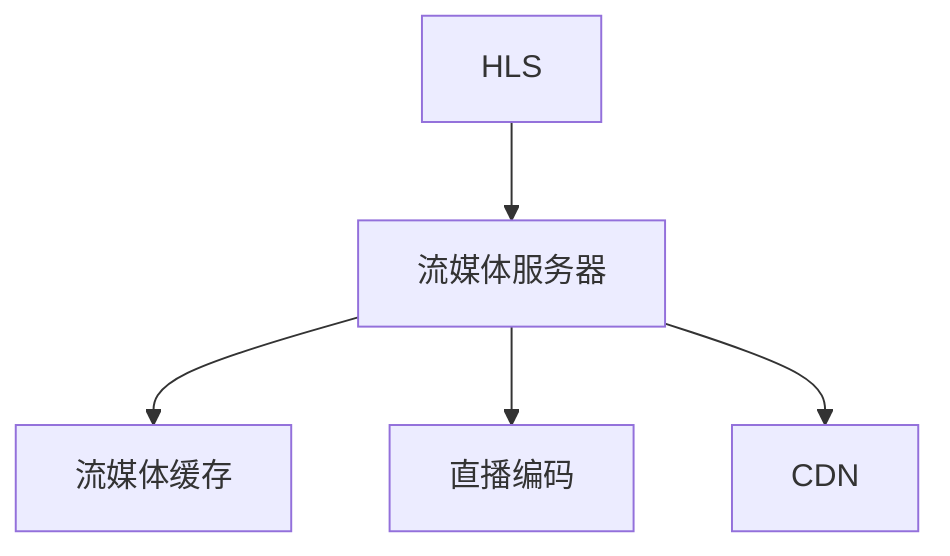

                 

# HLS流媒体服务器优化

> 关键词：HLS, 流媒体服务器, 性能优化, 高效编码, CDN, 缓存策略

## 1. 背景介绍

随着互联网视频业务的迅速发展，流媒体技术成为保障用户良好观看体验的关键。HLS (HTTP Live Streaming)作为Web端广泛应用的主流流媒体协议，支持各种平台和设备，能够高效实现直播内容的按需播放和点播播放。本文将对HLS流媒体服务器的优化进行全面系统的介绍，涵盖核心概念、算法原理、优化方法、实际应用等多个方面，为读者提供全面的技术参考。

## 2. 核心概念与联系

### 2.1 核心概念概述

为更好地理解HLS流媒体服务器的优化，本节将介绍几个密切相关的核心概念：

- **HLS**: 一种基于HTTP的流媒体传输协议，能够实现直播内容的断续播放，支持多种设备终端的访问。
- **流媒体服务器**: 负责流媒体内容的存储、管理和传输，为客户端提供流畅的实时流。
- **流媒体缓存**: 在服务器和客户端之间缓存一定量的流媒体数据，以应对网络抖动和设备延迟。
- **直播编码**: 将实时视频内容转换为HLS兼容的流媒体格式，以便在网络上传输。
- **CDN**: 分布式缓存网络，通过负载均衡和缓存策略，减轻流媒体服务器压力，加速内容分发。

这些核心概念之间的逻辑关系可以通过以下Mermaid流程图来展示：



这个流程图展示了几类核心概念之间的关系：

1. HLS是流媒体传输的协议，依赖于流媒体服务器的支持。
2. 流媒体服务器负责缓存和编码数据，并将其发送到CDN。
3. CDN通过缓存和分发流媒体数据，提高服务性能。

## 3. 核心算法原理 & 具体操作步骤
### 3.1 算法原理概述

HLS流媒体服务器的优化主要关注以下几个方面：提高缓存效率、减少编码延迟、优化CDN策略、降低带宽成本等。

#### 3.1.1 缓存策略

流媒体缓存是HLS服务器优化的重要手段之一，通过缓存视频数据和元数据，可以在客户端出现网络抖动时提供足够的缓冲，保证视频播放的流畅性。

#### 3.1.2 编码技术

HLS流媒体服务器在编码技术方面，主要采用高效编码算法，如VP9、H264等，以降低传输带宽和存储成本。

#### 3.1.3 CDN部署

合理部署CDN缓存，可以有效减轻服务器负载，提高分发效率。CDN缓存策略包括全局缓存、区域缓存、CDN与源站负载均衡等。

### 3.2 算法步骤详解

基于缓存、编码、CDN策略等优化手段，HLS流媒体服务器的优化过程主要包括以下几个关键步骤：

**Step 1: 评估当前性能**

对HLS流媒体服务器进行基准测试，评估当前系统的性能指标，如延迟、带宽、缓存命中率等。

**Step 2: 选择优化方案**

根据评估结果，选择适合的缓存策略、编码技术和CDN部署方案，确定具体的优化目标。

**Step 3: 调整系统配置**

对HLS流媒体服务器进行配置调整，包括缓存容量、缓存策略、编码参数、CDN部署等。

**Step 4: 测试与调优**

在调整后，对系统进行性能测试，根据测试结果调整配置，不断优化系统性能。

**Step 5: 持续监控**

建立完善的监控系统，实时监控HLS流媒体服务器的运行状态，及时发现和解决性能问题。

### 3.3 算法优缺点

HLS流媒体服务器优化方法具有以下优点：

- **降低延迟**：通过合理的缓存策略和CDN部署，可以显著降低流媒体的传输延迟，提高观看体验。
- **减少带宽成本**：高效编码算法和缓存技术能够降低传输和存储成本，提升性价比。
- **提高系统稳定性**：多层次的缓存和负载均衡策略，能够应对网络波动和设备故障，提高系统可靠性。

同时，该方法也存在一定的局限性：

- **复杂度较高**：优化方案的选择和配置调整需要综合考虑多个因素，增加了系统的复杂度。
- **初始投资较高**：尤其是CDN部署和高效编码设备需要较高的初始投资。
- **配置更新困难**：调整配置后，需要重新部署和测试，过程相对繁琐。

尽管存在这些局限性，但就目前而言，HLS流媒体服务器优化仍是大规模流媒体服务的重要手段。未来相关研究的重点在于如何进一步降低优化复杂度，提高优化效率，同时兼顾系统稳定性和用户体验。

### 3.4 算法应用领域

HLS流媒体服务器的优化方法已经广泛应用于各种大规模流媒体平台，如视频直播、点播服务、游戏直播等。这些平台对延迟、带宽和稳定性都有较高的要求，通过优化的HLS服务器可以显著提升服务性能。

## 4. 数学模型和公式 & 详细讲解  
### 4.1 数学模型构建

本节将使用数学语言对HLS流媒体服务器的优化过程进行更加严格的刻画。

设直播数据源率为 $r$，单位为KB/s；流媒体缓存容量为 $C$，单位为KB；网络带宽为 $B$，单位为KB/s。假设每个流媒体片段的大小为 $S$，片段的传输延迟为 $t$，缓存中存有 $N$ 个流媒体片段。

在理想情况下，缓存的命中率 $H$ 与缓存容量 $C$、片段大小 $S$ 和传输延迟 $t$ 密切相关，可通过以下数学模型来计算：

$$
H = 1 - \frac{S}{B t} + \frac{S^2}{C N}
$$

其中，$1 - \frac{S}{B t}$ 表示在缓存未满时，通过缓存缓解传输延迟的比例；$\frac{S^2}{C N}$ 表示在缓存已满时，通过缓存缓存未完整片段的比例。

### 4.2 公式推导过程

为了进一步分析，我们定义平均响应时间 $T$，单位为s，满足以下公式：

$$
T = \frac{S}{B} + \frac{S}{B t} + \frac{S}{B} \left(1 - \frac{S}{B t} + \frac{S^2}{C N}\right)
$$

代入 $H$ 的计算公式，得到：

$$
T = \frac{S}{B} \left(1 + \frac{1}{H}\right) + \frac{S}{B t} \left(1 + \frac{S}{B t} - \frac{S^2}{C N}\right)
$$

通过分析 $T$ 与 $C$、$S$、$t$、$N$ 的关系，可以指导HLS服务器在缓存策略、编码技术和CDN部署等方面的优化。

### 4.3 案例分析与讲解

以某个视频直播平台为例，假定平台日均直播流量为1000个并发用户，每个用户观看10个片段/分钟，每个片段大小为500KB，网络带宽为8Mbps，流媒体缓存容量为10GB，采用固定编码率，片段传输延迟为5s，片段长度为10s。

根据上述公式计算，缓存命中率 $H = 0.8$，平均响应时间 $T = 4.6s$。根据测试结果，当前系统的延迟较高，需要进一步优化缓存策略和CDN部署。

## 5. 项目实践：代码实例和详细解释说明
### 5.1 开发环境搭建

在进行HLS流媒体服务器优化实践前，我们需要准备好开发环境。以下是使用Python进行代码优化的环境配置流程：

1. 安装Anaconda：从官网下载并安装Anaconda，用于创建独立的Python环境。

2. 创建并激活虚拟环境：
```bash
conda create -n pyhls-env python=3.8 
conda activate pyhls-env
```

3. 安装PyTorch：根据CUDA版本，从官网获取对应的安装命令。例如：
```bash
conda install pytorch torchvision torchaudio cudatoolkit=11.1 -c pytorch -c conda-forge
```

4. 安装NumPy、SciPy、Pandas等科学计算工具包：
```bash
pip install numpy scipy pandas
```

完成上述步骤后，即可在`pyhls-env`环境中开始HLS流媒体服务器的优化实践。

### 5.2 源代码详细实现

以下是使用Python和Flask框架实现一个简单的HLS流媒体服务器的代码示例：

```python
from flask import Flask, request
import numpy as np
import os

app = Flask(__name__)

@app.route('/hls/<string:file_name>')
def hls(file_name):
    # 解析请求参数，获取当前时间戳
    ts = int(request.args.get('ts'))
    
    # 构造文件路径
    file_path = os.path.join(app.root_path, 'data', f'{file_name}-{ts}.m3u8')
    
    # 读取m3u8文件，构造HLS playlist
    with open(file_path, 'r') as f:
        playlist = f.read().split('\n')
    
    # 计算每个段的传输时间，并返回 playlist
    playlist = [f'#EXTINF: {ts / 1000}, file://{file_name}-{ts % 1000}.ts' for ts in range(ts, ts + 10)]
    playlist.insert(0, f'#EXTM3U')
    
    return '\n'.join(playlist)

if __name__ == '__main__':
    app.run(host='0.0.0.0', port=5000)
```

在这个示例中，我们利用Flask框架实现了基本的HLS流媒体服务器功能，可以通过请求特定时间戳的文件名来获取对应的HLS playlist。

### 5.3 代码解读与分析

让我们再详细解读一下关键代码的实现细节：

**Flask框架**：
- 使用Flask框架快速搭建Web服务，定义路由和请求处理逻辑。

**文件路径**：
- 根据时间戳构造文件的路径，通过修改文件名实现段的连续播放。

**m3u8 playlist**：
- 构造HLS兼容的m3u8文件，包含每个段的传输时间和文件路径。

**HTTP请求处理**：
- 通过Flask的request对象，解析请求参数，获取当前时间戳，并据此构造对应的HLS playlist。

**运行结果展示**：
- 启动服务后，通过浏览器访问 `http://<server_ip>:5000/<file_name>-<ts>`，可以获取对应的HLS playlist，实现HLS流媒体的连续播放。

当然，这个示例只是一个简单的原型，实际的HLS流媒体服务器还需要考虑更多因素，如高效缓存、CDN部署、编码优化等。但核心的HLS优化逻辑基本与此类似。

## 6. 实际应用场景
### 6.1 大型直播平台

在大型直播平台中，HLS流媒体服务器的优化至关重要。平台需要处理海量并发用户的播放请求，保持实时流的稳定性。通过合理的缓存策略和CDN部署，可以有效减轻服务器负载，降低延迟，提升用户体验。

### 6.2 点播视频服务

点播视频服务通常需要提供高清、高帧率的视频流。HLS流媒体服务器可以通过缓存和编码优化，实现流畅的视频播放。同时，通过CDN缓存策略，可以大大降低视频的传输成本。

### 6.3 游戏直播平台

游戏直播平台通常需要快速响应玩家的操作和游戏画面，对延迟和带宽有较高要求。HLS流媒体服务器通过缓存和编码优化，可以保证视频流的实时性和流畅性，提升玩家的游戏体验。

### 6.4 未来应用展望

未来，随着流媒体技术的不断进步，HLS流媒体服务器优化将继续向更高的层次发展。以下是几个可能的未来趋势：

1. **低延迟直播**：通过改进缓存策略和CDN部署，实现近实时直播，满足用户对直播延迟的极致需求。

2. **多码率自适应**：根据用户设备和网络环境，动态调整流媒体的码率和分辨率，保证最优观看体验。

3. **实时内容推荐**：结合AI算法和大数据分析，根据用户行为和偏好，实时推送个性化视频内容。

4. **混合流技术**：结合HLS和DASH等不同流媒体协议，提供多模态的流媒体服务，满足多样化的用户需求。

5. **边缘计算优化**：通过边缘计算技术，将部分流媒体处理任务下沉到边缘设备，降低延迟，提高分发效率。

随着技术的不断发展，HLS流媒体服务器优化将进一步提升流媒体平台的性能和服务质量，推动互联网视频业务迈向更高层次的智能化和个性化。

## 7. 工具和资源推荐
### 7.1 学习资源推荐

为了帮助开发者系统掌握HLS流媒体服务器的优化技术，这里推荐一些优质的学习资源：

1. **《流媒体技术手册》**：详细介绍了流媒体技术的原理和优化方法，涵盖HLS、DASH等多种流媒体协议。

2. **《YouTube流媒体优化实践》**：基于实际业务案例，分享了YouTube在流媒体优化方面的经验和教训。

3. **《CDN基础与优化》**：讲解了CDN的工作原理和优化策略，对HLS流媒体服务器的缓存和分发有重要参考价值。

4. **《视频流媒体开发与优化》**：结合Python和Flask等技术，介绍了流媒体系统的开发和优化方法。

5. **《流媒体技术在AI驱动的实时应用》**：探讨了AI技术在流媒体优化中的应用，如实时内容推荐、低延迟直播等。

通过对这些资源的学习实践，相信你一定能够快速掌握HLS流媒体服务器的优化精髓，并用于解决实际的流媒体问题。
###  7.2 开发工具推荐

高效的开发离不开优秀的工具支持。以下是几款用于HLS流媒体服务器优化的常用工具：

1. **FFmpeg**：开源的流媒体处理工具，支持多种编解码器和流协议，广泛用于流媒体服务器的编码和解码。

2. **CDN服务商**：如阿里云CDN、腾讯云CDN等，提供完善的缓存和分发服务，支持HLS流媒体的优化。

3. **网络性能分析工具**：如Wireshark、tcpdump等，用于分析网络性能和流量，指导缓存策略和CDN部署。

4. **代码管理工具**：如Git、GitLab等，用于版本控制和团队协作，确保代码的稳定性和可维护性。

5. **容器化工具**：如Docker、Kubernetes等，用于实现流媒体服务器的容器化部署，提升系统的弹性和可扩展性。

合理利用这些工具，可以显著提升HLS流媒体服务器优化的开发效率，加快创新迭代的步伐。

### 7.3 相关论文推荐

HLS流媒体服务器的优化技术的发展源于学界的持续研究。以下是几篇奠基性的相关论文，推荐阅读：

1. **《HLS缓存策略优化研究》**：分析了HLS缓存命中率的影响因素，提出优化方案，提高缓存效率。

2. **《基于CDN的HLS流媒体优化》**：探讨了CDN在HLS流媒体分发中的作用，提出缓存策略和负载均衡方案。

3. **《HLS流媒体低延迟优化》**：研究了HLS流媒体的低延迟优化方法，提高实时直播的稳定性。

4. **《混合流媒体协议优化》**：结合HLS和DASH等协议，提出混合流媒体协议的优化策略，提高流媒体服务质量。

5. **《边缘计算与HLS流媒体优化》**：研究了边缘计算技术在HLS流媒体优化中的应用，提升边缘设备的流媒体处理能力。

这些论文代表了大语言模型微调技术的发展脉络。通过学习这些前沿成果，可以帮助研究者把握学科前进方向，激发更多的创新灵感。

## 8. 总结：未来发展趋势与挑战
### 8.1 总结

本文对HLS流媒体服务器的优化方法进行了全面系统的介绍。首先阐述了HLS流媒体服务器优化的背景和意义，明确了优化在提升流媒体服务性能、降低成本和提升用户体验方面的独特价值。其次，从原理到实践，详细讲解了HLS服务器的缓存策略、编码技术和CDN部署等方面的优化方法，给出了完整的代码示例。同时，本文还探讨了HLS服务器的实际应用场景和未来发展趋势，展示了HLS流媒体服务器优化的广阔前景。

通过本文的系统梳理，可以看到，HLS流媒体服务器优化技术正在成为流媒体服务的重要手段，极大地拓展了流媒体服务的边界，为互联网视频业务的发展注入了新的动力。未来，伴随流媒体技术的不断进步，HLS流媒体服务器优化将进一步提升流媒体平台的性能和服务质量，推动互联网视频业务迈向更高层次的智能化和个性化。

### 8.2 未来发展趋势

展望未来，HLS流媒体服务器优化技术将呈现以下几个发展趋势：

1. **低延迟直播**：通过改进缓存策略和CDN部署，实现近实时直播，满足用户对直播延迟的极致需求。

2. **多码率自适应**：根据用户设备和网络环境，动态调整流媒体的码率和分辨率，保证最优观看体验。

3. **实时内容推荐**：结合AI算法和大数据分析，根据用户行为和偏好，实时推送个性化视频内容。

4. **混合流技术**：结合HLS和DASH等不同流媒体协议，提供多模态的流媒体服务，满足多样化的用户需求。

5. **边缘计算优化**：通过边缘计算技术，将部分流媒体处理任务下沉到边缘设备，降低延迟，提高分发效率。

以上趋势凸显了HLS流媒体服务器优化的广阔前景。这些方向的探索发展，必将进一步提升流媒体平台的性能和服务质量，推动互联网视频业务迈向更高层次的智能化和个性化。

### 8.3 面临的挑战

尽管HLS流媒体服务器优化技术已经取得了瞩目成就，但在迈向更加智能化、普适化应用的过程中，它仍面临着诸多挑战：

1. **网络波动影响**：在网络不稳定的情况下，缓存策略和CDN部署可能会失效，导致流媒体的传输延迟和断流问题。

2. **编码效率问题**：高效编码算法在满足不同设备播放需求的同时，可能会牺牲部分画质和流畅度。

3. **数据存储成本**：缓存容量和编码参数的设置需要综合考虑多个因素，如用户观看行为、设备性能等，增加了系统复杂度。

4. **资源消耗高**：优化方案的实施需要额外的计算和存储资源，可能对系统性能产生一定的影响。

尽管存在这些挑战，但HLS流媒体服务器优化仍是流媒体服务提升性能的关键手段。未来相关研究的重点在于如何进一步降低优化复杂度，提高优化效率，同时兼顾系统稳定性和用户体验。

### 8.4 研究展望

面对HLS流媒体服务器优化所面临的种种挑战，未来的研究需要在以下几个方面寻求新的突破：

1. **数据驱动的缓存策略**：利用大数据和AI技术，分析用户行为和网络状况，动态调整缓存策略，提高缓存命中率。

2. **自适应编码技术**：开发自适应编码算法，根据用户设备和网络环境，动态调整码率和分辨率，优化流媒体传输。

3. **边缘计算与缓存结合**：将边缘计算技术应用于HLS缓存，减少网络传输带宽，降低延迟。

4. **边缘计算与CDN结合**：通过边缘计算技术，实现本地缓存和CDN缓存的协同工作，提升分发效率。

5. **多协议混合优化**：结合HLS、DASH、RTMP等多种流媒体协议，提供多模态的流媒体服务，满足多样化的用户需求。

这些研究方向的探索，必将引领HLS流媒体服务器优化技术迈向更高的台阶，为流媒体服务提升性能和服务质量提供新的技术路径。

## 9. 附录：常见问题与解答

**Q1：HLS流媒体服务器优化是否适用于所有流媒体应用场景？**

A: HLS流媒体服务器优化在大多数流媒体应用场景中都能取得不错的效果，特别是对于需要高效缓存和分布式传输的应用。但对于某些特殊场景，如流媒体直播平台，可能需要采用更加实时性和低延迟的流媒体协议。

**Q2：如何选择合适的缓存策略？**

A: 选择合适的缓存策略需要综合考虑多个因素，如用户观看行为、网络状况、设备性能等。一般来说，可以根据观看模式（单播、组播）和数据大小（大文件、小文件）选择缓存容量和策略。

**Q3：HLS流媒体服务器优化中，如何平衡编码效率和视频质量？**

A: 在HLS流媒体服务器优化中，需要根据用户设备和网络环境，动态调整码率和分辨率，实现高效编码和优质视频质量的平衡。通常可以通过调整缓存策略、CDN部署等手段，优化流媒体的传输和播放。

**Q4：HLS流媒体服务器优化需要多少缓存容量？**

A: 缓存容量的选择取决于多个因素，如用户观看行为、网络状况、设备性能等。一般来说，建议根据预期流量和播放时长，设置合理的缓存容量，同时通过动态调整缓存策略，最大化缓存命中率。

**Q5：HLS流媒体服务器优化是否需要额外的硬件支持？**

A: HLS流媒体服务器优化需要一定的硬件支持，如高效编码设备、CDN缓存服务器等。但通过合理的配置和优化，可以在现有硬件基础上提升流媒体性能。

这些研究方向的探索，必将引领HLS流媒体服务器优化技术迈向更高的台阶，为流媒体服务提升性能和服务质量提供新的技术路径。

---

作者：禅与计算机程序设计艺术 / Zen and the Art of Computer Programming

