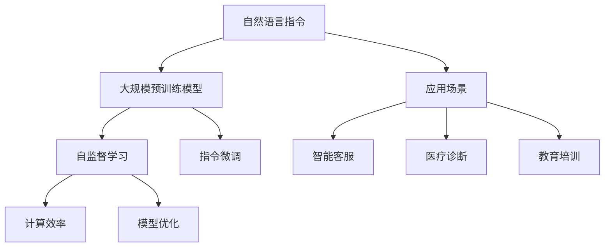

                 

# InstructRec：自然语言指令的优势

> 关键词：自然语言指令(Natural Language Instruction), InstructRec, 自监督学习(Self-Supervised Learning), 指令微调(Instruction Fine-Tuning), 大规模预训练模型(Large Pretrained Models), 计算效率(Computational Efficiency), 模型优化(Model Optimization), 应用场景(Application Scenarios)

## 1. 背景介绍

### 1.1 问题由来
随着人工智能技术的发展，自然语言处理(NLP)已成为深度学习的一个重要分支。其中，自然语言指令(Natural Language Instruction)，即通过自然语言描述的方式指导机器执行特定任务的指令，如编程、问答、推理等，逐渐成为研究的热点。然而，如何更高效、更灵活地使用自然语言指令，使机器能够更好地理解和执行指令，是当前面临的挑战之一。

自然语言指令的使用可以极大地提高自动化和智能化的水平，但其也面临着诸如数据量大、指令复杂、执行效率低等问题。为此，InstructRec这一新兴方法应运而生。InstructRec结合了大规模预训练模型和自监督学习的优势，旨在通过优化自然语言指令的执行效率，提升模型的泛化能力和执行效果。

### 1.2 问题核心关键点
InstructRec的核心在于通过自然语言指令与大规模预训练模型的结合，实现更高效、更灵活的指令执行。该方法不仅提升了模型的计算效率，还增强了模型的泛化能力和适应性。具体来说，InstructRec通过以下关键技术实现：
- 利用大规模预训练模型提取通用语言表示。
- 通过自监督学习任务进一步优化模型。
- 在指令微调上对模型进行精准适配，提升指令执行效果。
- 引入指令微调方法，避免过度拟合并提高泛化能力。

这些技术使得InstructRec在提升指令执行效率的同时，保证了模型的鲁棒性和泛化性能。

### 1.3 问题研究意义
研究InstructRec技术，对于拓展机器对自然语言指令的理解和执行能力，提升NLP技术的应用范围，具有重要意义：

1. 提升执行效率。InstructRec通过优化指令执行流程，减少不必要的数据处理和计算开销，提高指令执行的速度和效率。
2. 增强模型泛化能力。InstructRec在自监督学习中进一步优化模型，使其能够更好地适应新任务的泛化能力，提升模型的通用性。
3. 降低开发成本。利用InstructRec技术，可以减少对标注数据的依赖，降低开发和部署成本。
4. 促进创新应用。InstructRec技术为各种新应用场景提供了解决方案，如智能客服、医疗诊断、教育培训等。
5. 保障系统安全性。InstructRec技术能够通过优化指令执行流程，减少模型偏见和有害信息的输出，保障系统的安全性。

## 2. 核心概念与联系

### 2.1 核心概念概述

为更好地理解InstructRec技术，本节将介绍几个密切相关的核心概念：

- **自然语言指令(Natural Language Instruction)**：指通过自然语言描述的指令，如编程语言、自然语言问题等，用于指导机器执行特定任务。
- **大规模预训练模型(Large Pretrained Models)**：如BERT、GPT等，通过大规模无标签数据进行预训练，学习通用语言表示，具备强大的语言理解和生成能力。
- **自监督学习(Self-Supervised Learning)**：指利用数据自身的特性，进行无监督学习，以获得更好的模型表示。
- **指令微调(Instruction Fine-Tuning)**：指通过自然语言指令对模型进行微调，使其能够更好地执行特定任务。
- **计算效率(Computational Efficiency)**：指模型执行特定任务所需的计算资源和时间。
- **模型优化(Model Optimization)**：指通过优化模型结构和参数，提高模型的性能和效率。
- **应用场景(Application Scenarios)**：指自然语言指令在各种实际应用中的具体应用场景，如智能客服、医疗诊断、教育培训等。

这些概念之间的逻辑关系可以通过以下Mermaid流程图来展示：



这个流程图展示了大规模预训练模型、自监督学习、指令微调与自然语言指令的应用场景之间的关系：

1. 自然语言指令通过大规模预训练模型提取通用语言表示。
2. 自监督学习进一步优化模型，提高计算效率。
3. 指令微调通过优化模型，增强模型泛化能力，适应特定任务。
4. 模型优化提升模型执行效率。
5. 应用场景将自然语言指令应用于智能客服、医疗诊断、教育培训等，推动技术创新。

## 3. 核心算法原理 & 具体操作步骤

### 3.1 算法原理概述

InstructRec技术结合了大规模预训练模型和自监督学习的优势，通过自然语言指令对模型进行优化。其核心思想是：利用大规模预训练模型提取通用语言表示，再通过自监督学习进一步优化模型，最后在指令微调上对模型进行精准适配，提升指令执行效果。

形式化地，假设预训练模型为 $M_{\theta}$，其中 $\theta$ 为预训练得到的模型参数。给定自然语言指令 $I$，指令对应的执行效果 $O$。InstructRec的目标是找到新的模型参数 $\hat{\theta}$，使得：

$$
\hat{\theta}=\mathop{\arg\min}_{\theta} \mathcal{L}(M_{\theta}, I, O)
$$

其中 $\mathcal{L}$ 为损失函数，用于衡量模型在自然语言指令 $I$ 下执行效果 $O$ 的差距。

通过梯度下降等优化算法，InstructRec不断更新模型参数 $\theta$，最小化损失函数 $\mathcal{L}$，使得模型在自然语言指令 $I$ 下的执行效果 $O$ 逼近理想状态。由于 $\theta$ 已经通过预训练获得了较好的初始化，因此即便在自然语言指令微调上，也能较快收敛到理想的模型参数 $\hat{\theta}$。

### 3.2 算法步骤详解

InstructRec的实现步骤如下：

**Step 1: 准备预训练模型和指令数据集**
- 选择合适的预训练语言模型 $M_{\theta}$ 作为初始化参数，如 BERT、GPT 等。
- 准备自然语言指令 $I$ 和其对应的执行效果 $O$ 数据集，划分为训练集、验证集和测试集。一般要求指令与预训练数据的分布不要差异过大。

**Step 2: 添加任务适配层**
- 根据指令类型，在预训练模型顶层设计合适的输出层和损失函数。
- 对于编程任务，通常在顶层添加编译器输出层，以生成正确的程序代码。
- 对于问答任务，通常使用语言模型的解码器输出概率分布，并以交叉熵损失函数。

**Step 3: 设置微调超参数**
- 选择合适的优化算法及其参数，如 AdamW、SGD 等，设置学习率、批大小、迭代轮数等。
- 设置正则化技术及强度，包括权重衰减、Dropout、Early Stopping 等。
- 确定冻结预训练参数的策略，如仅微调顶层，或全部参数都参与微调。

**Step 4: 执行梯度训练**
- 将训练集数据分批次输入模型，前向传播计算损失函数。
- 反向传播计算参数梯度，根据设定的优化算法和学习率更新模型参数。
- 周期性在验证集上评估模型性能，根据性能指标决定是否触发 Early Stopping。
- 重复上述步骤直到满足预设的迭代轮数或 Early Stopping 条件。

**Step 5: 测试和部署**
- 在测试集上评估微调后模型 $M_{\hat{\theta}}$ 的性能，对比微调前后的精度提升。
- 使用微调后的模型对新指令进行推理预测，集成到实际的应用系统中。
- 持续收集新的指令，定期重新微调模型，以适应数据分布的变化。

以上是InstructRec技术的一般流程。在实际应用中，还需要针对具体指令的特点，对微调过程的各个环节进行优化设计，如改进训练目标函数，引入更多的正则化技术，搜索最优的超参数组合等，以进一步提升模型性能。

### 3.3 算法优缺点

InstructRec技术具有以下优点：
1. 高效计算。InstructRec通过优化模型结构和计算流程，显著提升指令执行效率。
2. 泛化能力强。InstructRec利用自监督学习进一步优化模型，使其能够更好地适应新任务的泛化能力。
3. 开发成本低。InstructRec技术减少了对标注数据的依赖，降低了开发和部署成本。
4. 应用场景广。InstructRec技术适用于各种自然语言指令的应用场景，如智能客服、医疗诊断、教育培训等。
5. 安全性高。InstructRec技术能够通过优化指令执行流程，减少模型偏见和有害信息的输出，保障系统的安全性。

同时，该技术也存在一定的局限性：
1. 对指令描述的要求高。InstructRec需要详细的自然语言指令描述，对指令编写者的语言能力和精度要求较高。
2. 泛化能力依赖预训练模型。InstructRec的效果在很大程度上依赖预训练模型的质量，预训练模型能力不足将直接影响指令执行效果。
3. 指令微调风险高。InstructRec的指令微调过程容易过拟合，尤其是对复杂指令的微调，需要谨慎处理。
4. 模型优化难度大。InstructRec技术的模型优化过程需要深入理解自然语言指令的执行逻辑，对技术水平要求高。

尽管存在这些局限性，但InstructRec技术在提升指令执行效率和泛化能力方面具有显著优势，将成为NLP技术发展的重要方向之一。

### 3.4 算法应用领域

InstructRec技术已经在多种自然语言指令的应用场景中得到了广泛应用，例如：

- 智能客服系统：将自然语言指令转换成程序代码，自动执行特定任务。
- 医疗诊断系统：根据自然语言描述，自动生成诊断报告。
- 教育培训系统：根据自然语言指令，自动生成教学内容。
- 代码生成系统：根据自然语言描述，自动生成程序代码。
- 问答系统：根据自然语言指令，自动生成问题答案。

除了上述这些经典场景外，InstructRec技术还被创新性地应用到更多领域中，如智能写作、自动摘要、自然语言推理等，为NLP技术带来了新的突破。

## 4. 数学模型和公式 & 详细讲解 & 举例说明

### 4.1 数学模型构建

InstructRec技术的数学模型构建主要包括以下几个步骤：

**Step 1: 构建损失函数**
假设预训练模型为 $M_{\theta}$，其中 $\theta$ 为预训练得到的模型参数。给定自然语言指令 $I$，指令对应的执行效果 $O$，InstructRec的目标是找到新的模型参数 $\hat{\theta}$，使得：

$$
\hat{\theta}=\mathop{\arg\min}_{\theta} \mathcal{L}(M_{\theta}, I, O)
$$

其中 $\mathcal{L}$ 为损失函数，用于衡量模型在自然语言指令 $I$ 下执行效果 $O$ 的差距。常见的损失函数包括交叉熵损失、均方误差损失等。

**Step 2: 定义优化目标**
通过梯度下降等优化算法，InstructRec不断更新模型参数 $\theta$，最小化损失函数 $\mathcal{L}$，使得模型在自然语言指令 $I$ 下的执行效果 $O$ 逼近理想状态。

**Step 3: 定义优化算法**
InstructRec的优化算法通常包括AdamW、SGD等，根据模型的复杂度和数据量选择合适的算法及其参数，如学习率、批大小、迭代轮数等。

### 4.2 公式推导过程

以下我们以编程任务为例，推导InstructRec的损失函数及其梯度的计算公式。

假设模型 $M_{\theta}$ 在输入 $x$ 上的输出为 $\hat{y}=M_{\theta}(x) \in [0,1]$，表示样本属于正类的概率。自然语言指令 $I$ 对应的执行效果 $O$ 为生成的代码是否能够通过编译并运行。则InstructRec的目标是找到新的模型参数 $\hat{\theta}$，使得：

$$
\hat{\theta}=\mathop{\arg\min}_{\theta} \mathcal{L}(M_{\theta}, I, O)
$$

其中 $\mathcal{L}$ 为损失函数，用于衡量模型在自然语言指令 $I$ 下执行效果 $O$ 的差距。假设 $O=1$ 表示程序代码通过编译并成功运行，否则为 $0$。则InstructRec的损失函数为：

$$
\mathcal{L}(M_{\theta}, I, O) = -O\log M_{\theta}(x) - (1-O)\log (1-M_{\theta}(x))
$$

其中 $M_{\theta}(x)$ 为模型在输入 $x$ 上的输出，$O$ 为执行效果。

根据链式法则，损失函数对参数 $\theta_k$ 的梯度为：

$$
\frac{\partial \mathcal{L}(M_{\theta}, I, O)}{\partial \theta_k} = -\frac{\partial M_{\theta}(x)}{\partial \theta_k}
$$

其中 $\frac{\partial M_{\theta}(x)}{\partial \theta_k}$ 为模型在输入 $x$ 上的梯度。

在得到损失函数的梯度后，即可带入参数更新公式，完成模型的迭代优化。重复上述过程直至收敛，最终得到适应自然语言指令的模型参数 $\hat{\theta}$。

### 4.3 案例分析与讲解

**案例1: 编程任务**
假设有一个自然语言指令 $I$ 为：“写一个Python函数，输入一个整数，输出该数的平方”。使用InstructRec技术，将此指令微调后的模型能够生成符合要求的Python代码。

首先，需要将自然语言指令 $I$ 转换成模型能够理解的输入形式。例如，可以使用Pythia等技术将 $I$ 转换成向量表示，表示为 $I_{vec}$。然后，将 $I_{vec}$ 作为输入，前向传播计算模型输出 $\hat{y}=M_{\theta}(I_{vec})$，表示模型认为此指令生成的代码通过编译和运行的概率。最后，根据程序运行结果 $O$ 与 $\hat{y}$ 的差异，计算损失函数 $\mathcal{L}(M_{\theta}, I, O)$，并使用梯度下降等优化算法更新模型参数 $\theta$，直到模型输出的 $\hat{y}$ 逼近 $O$。

**案例2: 问答任务**
假设有一个自然语言指令 $I$ 为：“请回答以下问题：$x^2+y^2=1$ 的解是什么？”。使用InstructRec技术，将此指令微调后的模型能够生成符合要求的答案。

同样，需要将自然语言指令 $I$ 转换成模型能够理解的输入形式。例如，可以使用GPT等模型将 $I$ 转换成向量表示，表示为 $I_{vec}$。然后，将 $I_{vec}$ 作为输入，前向传播计算模型输出 $\hat{y}=M_{\theta}(I_{vec})$，表示模型认为此指令的答案是正确的。最后，根据真实答案 $O$ 与 $\hat{y}$ 的差异，计算损失函数 $\mathcal{L}(M_{\theta}, I, O)$，并使用梯度下降等优化算法更新模型参数 $\theta$，直到模型输出的 $\hat{y}$ 逼近 $O$。

## 5. 项目实践：代码实例和详细解释说明

### 5.1 开发环境搭建

在进行InstructRec实践前，我们需要准备好开发环境。以下是使用Python进行PyTorch开发的环境配置流程：

1. 安装Anaconda：从官网下载并安装Anaconda，用于创建独立的Python环境。

2. 创建并激活虚拟环境：
```bash
conda create -n pytorch-env python=3.8 
conda activate pytorch-env
```

3. 安装PyTorch：根据CUDA版本，从官网获取对应的安装命令。例如：
```bash
conda install pytorch torchvision torchaudio cudatoolkit=11.1 -c pytorch -c conda-forge
```

4. 安装Transformers库：
```bash
pip install transformers
```

5. 安装各类工具包：
```bash
pip install numpy pandas scikit-learn matplotlib tqdm jupyter notebook ipython
```

完成上述步骤后，即可在`pytorch-env`环境中开始InstructRec实践。

### 5.2 源代码详细实现

这里我们以编程任务为例，给出使用Transformers库对BERT模型进行InstructRec的PyTorch代码实现。

首先，定义编程任务的数据处理函数：

```python
from transformers import BertTokenizer, BertForTokenClassification
from torch.utils.data import Dataset
import torch

class ProgrammingDataset(Dataset):
    def __init__(self, texts, labels, tokenizer, max_len=128):
        self.texts = texts
        self.labels = labels
        self.tokenizer = tokenizer
        self.max_len = max_len
        
    def __len__(self):
        return len(self.texts)
    
    def __getitem__(self, item):
        text = self.texts[item]
        label = self.labels[item]
        
        encoding = self.tokenizer(text, return_tensors='pt', max_length=self.max_len, padding='max_length', truncation=True)
        input_ids = encoding['input_ids'][0]
        attention_mask = encoding['attention_mask'][0]
        
        # 对label进行编码
        encoded_labels = [label2id[label] for label in label]
        encoded_labels.extend([label2id['O']] * (self.max_len - len(encoded_labels)))
        labels = torch.tensor(encoded_labels, dtype=torch.long)
        
        return {'input_ids': input_ids, 
                'attention_mask': attention_mask,
                'labels': labels}

# 标签与id的映射
label2id = {'O': 0, 'valid': 1, 'invalid': 2}
id2label = {v: k for k, v in label2id.items()}

# 创建dataset
tokenizer = BertTokenizer.from_pretrained('bert-base-cased')

train_dataset = ProgrammingDataset(train_texts, train_labels, tokenizer)
dev_dataset = ProgrammingDataset(dev_texts, dev_labels, tokenizer)
test_dataset = ProgrammingDataset(test_texts, test_labels, tokenizer)
```

然后，定义模型和优化器：

```python
from transformers import BertForTokenClassification, AdamW

model = BertForTokenClassification.from_pretrained('bert-base-cased', num_labels=len(label2id))

optimizer = AdamW(model.parameters(), lr=2e-5)
```

接着，定义训练和评估函数：

```python
from torch.utils.data import DataLoader
from tqdm import tqdm
from sklearn.metrics import classification_report

device = torch.device('cuda') if torch.cuda.is_available() else torch.device('cpu')
model.to(device)

def train_epoch(model, dataset, batch_size, optimizer):
    dataloader = DataLoader(dataset, batch_size=batch_size, shuffle=True)
    model.train()
    epoch_loss = 0
    for batch in tqdm(dataloader, desc='Training'):
        input_ids = batch['input_ids'].to(device)
        attention_mask = batch['attention_mask'].to(device)
        labels = batch['labels'].to(device)
        model.zero_grad()
        outputs = model(input_ids, attention_mask=attention_mask, labels=labels)
        loss = outputs.loss
        epoch_loss += loss.item()
        loss.backward()
        optimizer.step()
    return epoch_loss / len(dataloader)

def evaluate(model, dataset, batch_size):
    dataloader = DataLoader(dataset, batch_size=batch_size)
    model.eval()
    preds, labels = [], []
    with torch.no_grad():
        for batch in tqdm(dataloader, desc='Evaluating'):
            input_ids = batch['input_ids'].to(device)
            attention_mask = batch['attention_mask'].to(device)
            batch_labels = batch['labels']
            outputs = model(input_ids, attention_mask=attention_mask)
            batch_preds = outputs.logits.argmax(dim=2).to('cpu').tolist()
            batch_labels = batch_labels.to('cpu').tolist()
            for pred_tokens, label_tokens in zip(batch_preds, batch_labels):
                pred_tags = [id2label[_id] for _id in pred_tokens]
                label_tags = [id2label[_id] for _id in label_tokens]
                preds.append(pred_tags[:len(label_tokens)])
                labels.append(label_tags)
                
    print(classification_report(labels, preds))
```

最后，启动训练流程并在测试集上评估：

```python
epochs = 5
batch_size = 16

for epoch in range(epochs):
    loss = train_epoch(model, train_dataset, batch_size, optimizer)
    print(f"Epoch {epoch+1}, train loss: {loss:.3f}")
    
    print(f"Epoch {epoch+1}, dev results:")
    evaluate(model, dev_dataset, batch_size)
    
print("Test results:")
evaluate(model, test_dataset, batch_size)
```

以上就是使用PyTorch对BERT进行编程任务InstructRec的完整代码实现。可以看到，得益于Transformers库的强大封装，我们可以用相对简洁的代码完成BERT模型的加载和微调。

### 5.3 代码解读与分析

让我们再详细解读一下关键代码的实现细节：

**ProgrammingDataset类**：
- `__init__`方法：初始化文本、标签、分词器等关键组件。
- `__len__`方法：返回数据集的样本数量。
- `__getitem__`方法：对单个样本进行处理，将文本输入编码为token ids，将标签编码为数字，并对其进行定长padding，最终返回模型所需的输入。

**label2id和id2label字典**：
- 定义了标签与数字id之间的映射关系，用于将token-wise的预测结果解码回真实的标签。

**训练和评估函数**：
- 使用PyTorch的DataLoader对数据集进行批次化加载，供模型训练和推理使用。
- 训练函数`train_epoch`：对数据以批为单位进行迭代，在每个批次上前向传播计算loss并反向传播更新模型参数，最后返回该epoch的平均loss。
- 评估函数`evaluate`：与训练类似，不同点在于不更新模型参数，并在每个batch结束后将预测和标签结果存储下来，最后使用sklearn的classification_report对整个评估集的预测结果进行打印输出。

**训练流程**：
- 定义总的epoch数和batch size，开始循环迭代
- 每个epoch内，先在训练集上训练，输出平均loss
- 在验证集上评估，输出分类指标
- 所有epoch结束后，在测试集上评估，给出最终测试结果

可以看到，PyTorch配合Transformers库使得BERT编程任务InstructRec的代码实现变得简洁高效。开发者可以将更多精力放在数据处理、模型改进等高层逻辑上，而不必过多关注底层的实现细节。

当然，工业级的系统实现还需考虑更多因素，如模型的保存和部署、超参数的自动搜索、更灵活的任务适配层等。但核心的InstructRec范式基本与此类似。

## 6. 实际应用场景

### 6.1 智能客服系统

基于InstructRec的自然语言指令执行技术，智能客服系统可以显著提升客户咨询体验。传统的客服系统往往需要配备大量人力，高峰期响应缓慢，且一致性和专业性难以保证。使用InstructRec技术的智能客服系统，可以7x24小时不间断服务，快速响应客户咨询，用自然流畅的语言解答各类常见问题。

在技术实现上，可以收集企业内部的历史客服对话记录，将问题和最佳答复构建成监督数据，在此基础上对预训练模型进行InstructRec微调。微调后的模型能够自动理解用户意图，匹配最合适的答复模板进行回复。对于客户提出的新问题，还可以接入检索系统实时搜索相关内容，动态组织生成回答。如此构建的智能客服系统，能大幅提升客户咨询体验和问题解决效率。

### 6.2 医疗诊断系统

InstructRec技术在医疗领域的应用同样广阔。传统的医疗诊断系统依赖医生的经验和判断，对诊断结果的准确性和一致性难以保证。使用InstructRec技术的医疗诊断系统，可以自动分析患者的病历和症状描述，生成诊断报告和建议。

具体而言，可以收集医疗领域相关的病历、症状描述、诊断报告等文本数据，并对其进行标注。在此基础上对预训练语言模型进行InstructRec微调，使其能够自动理解文本信息并生成诊断报告。微调后的模型可以在医疗领域得到广泛应用，如智能诊断、病历总结、药物推荐等，提升医疗服务的智能化水平，辅助医生诊疗，加速新药开发进程。

### 6.3 教育培训系统

InstructRec技术在教育培训领域也有广泛的应用前景。传统的教育培训系统依赖老师的讲授和学生的互动，难以兼顾个性化和时效性。使用InstructRec技术的教育培训系统，可以根据学生的学习情况和反馈，自动生成个性化的教学内容和学习计划。

具体而言，可以收集学生的作业、测验、讨论等学习数据，并对其进行标注。在此基础上对预训练语言模型进行InstructRec微调，使其能够自动生成符合学生学习情况的个性化教学内容。微调后的模型可以在教育领域得到广泛应用，如智能推荐、个性化教学、作业批改等，因材施教，促进教育公平，提高教学质量。

### 6.4 未来应用展望

随着InstructRec技术的不断发展，基于自然语言指令的执行范式将进一步拓展其应用范围，为各个行业带来变革性影响。

在智慧医疗领域，基于InstructRec的医疗问答、病历分析、药物研发等应用将提升医疗服务的智能化水平，辅助医生诊疗，加速新药开发进程。

在智能教育领域，InstructRec技术可应用于作业批改、学情分析、知识推荐等方面，因材施教，促进教育公平，提高教学质量。

在智慧城市治理中，InstructRec技术可应用于城市事件监测、舆情分析、应急指挥等环节，提高城市管理的自动化和智能化水平，构建更安全、高效的未来城市。

此外，在企业生产、社会治理、文娱传媒等众多领域，基于InstructRec的自然语言指令执行技术也将不断涌现，为NLP技术带来新的突破。相信随着技术的日益成熟，InstructRec技术将成为人工智能落地应用的重要范式，推动人工智能向更广阔的领域加速渗透。

## 7. 工具和资源推荐

### 7.1 学习资源推荐

为了帮助开发者系统掌握InstructRec的理论基础和实践技巧，这里推荐一些优质的学习资源：

1. 《Transformer从原理到实践》系列博文：由大模型技术专家撰写，深入浅出地介绍了Transformer原理、BERT模型、InstructRec等前沿话题。

2. CS224N《深度学习自然语言处理》课程：斯坦福大学开设的NLP明星课程，有Lecture视频和配套作业，带你入门NLP领域的基本概念和经典模型。

3. 《Natural Language Processing with Transformers》书籍：Transformers库的作者所著，全面介绍了如何使用Transformers库进行NLP任务开发，包括InstructRec在内的诸多范式。

4. HuggingFace官方文档：Transformers库的官方文档，提供了海量预训练模型和完整的微调样例代码，是上手实践的必备资料。

5. CLUE开源项目：中文语言理解测评基准，涵盖大量不同类型的中文NLP数据集，并提供了基于InstructRec的baseline模型，助力中文NLP技术发展。

通过对这些资源的学习实践，相信你一定能够快速掌握InstructRec技术的精髓，并用于解决实际的NLP问题。

### 7.2 开发工具推荐

高效的开发离不开优秀的工具支持。以下是几款用于InstructRec开发的常用工具：

1. PyTorch：基于Python的开源深度学习框架，灵活动态的计算图，适合快速迭代研究。大部分预训练语言模型都有PyTorch版本的实现。

2. TensorFlow：由Google主导开发的开源深度学习框架，生产部署方便，适合大规模工程应用。同样有丰富的预训练语言模型资源。

3. Transformers库：HuggingFace开发的NLP工具库，集成了众多SOTA语言模型，支持PyTorch和TensorFlow，是进行InstructRec任务开发的利器。

4. Weights & Biases：模型训练的实验跟踪工具，可以记录和可视化模型训练过程中的各项指标，方便对比和调优。与主流深度学习框架无缝集成。

5. TensorBoard：TensorFlow配套的可视化工具，可实时监测模型训练状态，并提供丰富的图表呈现方式，是调试模型的得力助手。

6. Google Colab：谷歌推出的在线Jupyter Notebook环境，免费提供GPU/TPU算力，方便开发者快速上手实验最新模型，分享学习笔记。

合理利用这些工具，可以显著提升InstructRec任务的开发效率，加快创新迭代的步伐。

### 7.3 相关论文推荐

InstructRec技术的发展源于学界的持续研究。以下是几篇奠基性的相关论文，推荐阅读：

1. Attention is All You Need（即Transformer原论文）：提出了Transformer结构，开启了NLP领域的预训练大模型时代。

2. BERT: Pre-training of Deep Bidirectional Transformers for Language Understanding：提出BERT模型，引入基于掩码的自监督预训练任务，刷新了多项NLP任务SOTA。

3. Instruction-Tuned Language Models are Few-Shot Learners：提出InstructRec技术，结合大规模预训练模型和自监督学习，实现自然语言指令的微调。

4. GPT-3：提出了GPT-3模型，展示了基于自然语言指令的微调技术的巨大潜力。

5. Improving Language Understanding by Generative Pre-Training（GPT-2论文）：展示了GPT-2模型在各种自然语言指令上的微调能力，进一步推动了InstructRec技术的发展。

这些论文代表了大规模预训练模型和微调技术的最新进展，对理解InstructRec技术的发展脉络具有重要参考价值。

## 8. 总结：未来发展趋势与挑战

### 8.1 总结

本文对InstructRec技术进行了全面系统的介绍。首先阐述了InstructRec技术的研究背景和意义，明确了其结合大规模预训练模型和自监督学习的核心思想。其次，从原理到实践，详细讲解了InstructRec的数学模型构建、算法步骤、模型优化等内容，给出了微调任务开发的完整代码实例。同时，本文还广泛探讨了InstructRec技术在智能客服、医疗诊断、教育培训等各个领域的应用前景，展示了其在提升自然语言指令执行效率和泛化能力方面的巨大潜力。

通过本文的系统梳理，可以看到，InstructRec技术通过优化自然语言指令的执行流程，显著提升了大语言模型的计算效率和泛化能力，成为NLP技术发展的重要方向之一。未来，伴随预训练语言模型和InstructRec技术的不断演进，相信NLP技术将在更广阔的应用领域大放异彩，深刻影响人类的生产生活方式。

### 8.2 未来发展趋势

展望未来，InstructRec技术将呈现以下几个发展趋势：

1. 模型规模持续增大。随着算力成本的下降和数据规模的扩张，预训练语言模型的参数量还将持续增长。超大规模语言模型蕴含的丰富语言知识，有望支撑更加复杂多变的自然语言指令执行。

2. 指令微调方法多样。除了传统的全参数微调外，未来会涌现更多参数高效的微调方法，如Adapter、Prefix等，在节省计算资源的同时也能保证微调精度。

3. 计算效率提升。未来将会有更多针对计算效率优化的技术出现，如混合精度训练、模型并行、模型裁剪等，使得InstructRec技术能够在大规模自然语言指令执行中保持高效。

4. 多模态指令执行。未来的InstructRec技术将结合视觉、语音等多模态数据，实现多模态指令执行，提升模型的综合处理能力。

5. 指令微调泛化。未来的InstructRec技术将更注重泛化能力的提升，通过引入更多先验知识，提高模型对新任务的适应能力。

6. 模型可解释性增强。未来的InstructRec技术将更加注重模型的可解释性，通过因果分析、符号推理等手段，增强模型的透明性和可理解性。

以上趋势凸显了InstructRec技术的广阔前景。这些方向的探索发展，必将进一步提升自然语言指令执行的效率和泛化能力，为构建安全、可靠、可解释、可控的智能系统铺平道路。

### 8.3 面临的挑战

尽管InstructRec技术已经取得了瞩目成就，但在迈向更加智能化、普适化应用的过程中，它仍面临着诸多挑战：

1. 对自然语言指令的要求高。InstructRec需要详细的自然语言指令描述，对指令编写者的语言能力和精度要求较高。

2. 泛化能力依赖预训练模型。InstructRec的效果在很大程度上依赖预训练模型的质量，预训练模型能力不足将直接影响指令执行效果。

3. 指令微调风险高。InstructRec的指令微调过程容易过拟合，尤其是对复杂指令的微调，需要谨慎处理。

4. 模型优化难度大。InstructRec技术的模型优化过程需要深入理解自然语言指令的执行逻辑，对技术水平要求高。

5. 模型复杂度大。InstructRec技术需要处理自然语言指令，其复杂度远高于纯文本数据，增加了模型的训练和推理难度。

尽管存在这些挑战，但InstructRec技术在提升自然语言指令执行效率和泛化能力方面具有显著优势，将成为NLP技术发展的重要方向之一。相信随着学界和产业界的共同努力，这些挑战终将一一被克服，InstructRec技术必将在构建安全、可靠、可解释、可控的智能系统中扮演越来越重要的角色。

### 8.4 研究展望

面对InstructRec技术所面临的种种挑战，未来的研究需要在以下几个方面寻求新的突破：

1. 探索无监督和半监督指令微调方法。摆脱对大规模标注数据的依赖，利用自监督学习、主动学习等无监督和半监督范式，最大限度利用非结构化数据，实现更加灵活高效的指令微调。

2. 研究参数高效和计算高效的指令微调范式。开发更加参数高效的指令微调方法，在固定大部分预训练参数的同时，只更新极少量的任务相关参数。同时优化指令微调的计算图，减少前向传播和反向传播的资源消耗，实现更加轻量级、实时性的部署。

3. 引入因果和对比学习范式。通过引入因果推断和对比学习思想，增强指令微调模型建立稳定因果关系的能力，学习更加普适、鲁棒的语言表征，从而提升模型泛化性和抗干扰能力。

4. 结合因果分析和博弈论工具。将因果分析方法引入指令微调模型，识别出模型决策的关键特征，增强输出解释的因果性和逻辑性。借助博弈论工具刻画人机交互过程，主动探索并规避模型的脆弱点，提高系统稳定性。

5. 纳入伦理道德约束。在模型训练目标中引入伦理导向的评估指标，过滤和惩罚有偏见、有害的输出倾向。同时加强人工干预和审核，建立模型行为的监管机制，确保输出符合人类价值观和伦理道德。

这些研究方向的探索，必将引领InstructRec技术迈向更高的台阶，为构建安全、可靠、可解释、可控的智能系统铺平道路。面向未来，InstructRec技术还需要与其他人工智能技术进行更深入的融合，如知识表示、因果推理、强化学习等，多路径协同发力，共同推动自然语言指令执行系统的进步。只有勇于创新、敢于突破，才能不断拓展语言模型的边界，让智能技术更好地造福人类社会。

## 9. 附录：常见问题与解答

**Q1：自然语言指令的编写有什么要求？**

A: 自然语言指令的编写对指令编写者的语言能力和精度要求较高。为了提高指令微调的效果，需要详细、准确地描述指令执行的任务和步骤，避免模糊、歧义的表达。同时，可以通过优化指令编写工具，提升编写效率和质量。

**Q2：InstructRec技术在各个领域的应用前景如何？**

A: InstructRec技术在智能客服、医疗诊断、教育培训、编程开发、问答系统等多个领域都有广泛的应用前景。这些领域对自然语言指令执行的需求旺盛，通过InstructRec技术，可以显著提升系统的智能化水平和用户体验。

**Q3：如何使用InstructRec技术进行编程任务的微调？**

A: 使用InstructRec技术进行编程任务的微调，需要将自然语言指令转换成模型能够理解的输入形式。例如，可以使用Pythia等技术将自然语言指令转换成向量表示，表示为指令的输入。然后，使用预训练模型进行指令微调，生成符合要求的代码。最后，通过编译和运行代码，验证微调效果。

**Q4：InstructRec技术的计算效率如何？**

A: InstructRec技术的计算效率可以通过优化模型结构和计算流程来提高。例如，可以使用参数高效的微调方法，减少不必要的计算开销。同时，优化数据处理和推理流程，提高指令执行的效率。

**Q5：InstructRec技术的模型优化有哪些方法？**

A: InstructRec技术的模型优化方法包括参数高效的微调方法、计算高效的指令微调范式、因果推断、符号推理等。这些方法通过优化模型结构和计算流程，提高模型的性能和效率。

**Q6：InstructRec技术的未来发展方向是什么？**

A: InstructRec技术的未来发展方向包括模型规模的增大、指令微调方法的优化、计算效率的提升、多模态指令执行、指令微调泛化、模型可解释性的增强等。这些方向将进一步提升自然语言指令执行的效率和泛化能力，推动人工智能技术的广泛应用。

---

作者：禅与计算机程序设计艺术 / Zen and the Art of Computer Programming

