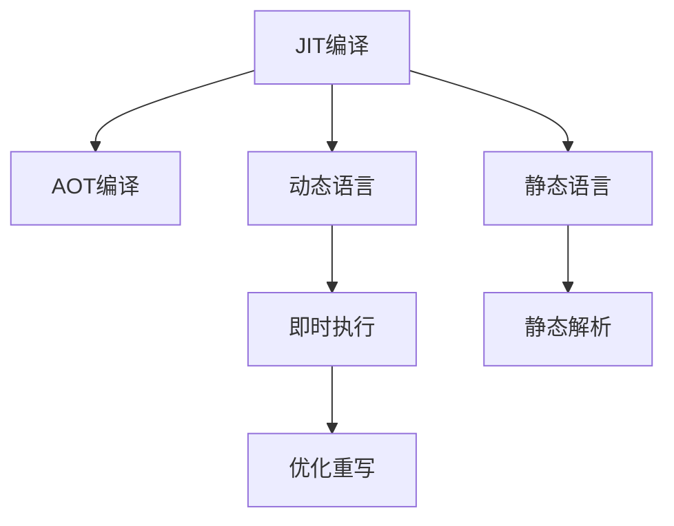

                 

# JIT编译：动态语言性能优化的关键

## 1. 背景介绍

### 1.1 问题由来

在现代软件开发中，性能优化是一个永恒的主题。无论对于开发人员还是系统管理员来说，如何提升程序运行速度、降低资源消耗，始终是一个重要的挑战。在编程语言种类日益丰富的今天，动态语言因其灵活性和简洁性而广受开发者青睐。然而，动态语言在性能上的劣势，也常常成为应用的瓶颈。JIT编译（Just-In-Time Compilation）技术的诞生，为动态语言的性能优化提供了新的思路和手段。

### 1.2 问题核心关键点

JIT编译是一种在程序运行时动态编译、即时执行的编译方式，将源代码直接转换为机器码，以提高程序执行效率。它的核心思想是：在程序运行时，通过动态编译技术，将动态语言代码转化为高效的本机机器码，从而实现性能的提升。

JIT编译的关键点在于：
1. 动态编译：在程序运行时，动态地将源代码转换为机器码。
2. 即时执行：编译完成的代码可以立即执行，无需等待编译过程完成。
3. 优化重写：编译器可以在运行过程中动态优化代码，提升性能。

JIT编译技术的诞生，极大地改变了程序员的开发方式，使得动态语言的性能能够接近甚至超越静态语言。

### 1.3 问题研究意义

研究JIT编译技术，对于优化动态语言性能，提升软件系统效率，具有重要意义：

1. 提升执行效率。JIT编译能够实时优化代码，避免静态编译时遗留的性能问题。
2. 减少资源消耗。通过动态编译和即时执行，减少了代码加载和执行的资源消耗。
3. 提高开发效率。JIT编译技术允许开发人员使用动态语言，同时享有静态语言的执行效率。
4. 扩展应用场景。JIT编译技术支持多种动态语言，可以在多个平台上应用。
5. 支持现代编程范式。JIT编译技术可以与并发编程、函数式编程等现代编程范式结合使用，提升系统性能。

## 2. 核心概念与联系

### 2.1 核心概念概述

为了更好地理解JIT编译技术，本节将介绍几个密切相关的核心概念：

- JIT编译（Just-In-Time Compilation）：一种动态编译技术，能够在程序运行时将源代码转换为机器码，以提高性能。
- AOT编译（Ahead-Of-Time Compilation）：在程序编译阶段，将源代码直接编译为机器码，适用于静态语言。
- 动态语言：代码在运行时动态解析和执行，如Python、Ruby、JavaScript等。
- 静态语言：代码在编译阶段静态解析和编译，如C++、Java等。
- 即时执行（Just-In-Time Execution）：编译后的代码可以立即执行，不需要额外的启动时间和资源消耗。
- 优化重写（Optimization Rewrite）：JIT编译器在运行时动态优化代码，提升性能。

这些核心概念之间的逻辑关系可以通过以下Mermaid流程图来展示：



这个流程图展示了JIT编译技术与其他相关概念之间的联系：

1. JIT编译与AOT编译的区别在于，JIT编译在运行时动态编译，而AOT编译在编译阶段静态编译。
2. JIT编译适用于动态语言，如Python、Ruby等，而静态语言（如C++、Java）通常采用AOT编译。
3. JIT编译支持即时执行，即编译后的代码可以立即执行，避免额外启动时间和资源消耗。
4. JIT编译通过优化重写技术，动态优化代码，提升性能。

## 3. 核心算法原理 & 具体操作步骤

### 3.1 算法原理概述

JIT编译技术主要基于动态编译和即时执行的原理。其核心流程如下：

1. 动态解析：在程序运行时，动态解析源代码，生成中间表示形式。
2. 静态优化：编译器对中间表示进行静态优化，提升执行效率。
3. 动态编译：将优化后的中间表示转换为机器码，生成可执行文件。
4. 即时执行：生成可执行文件后，立即执行编译后的代码，无需等待编译过程完成。

JIT编译技术的核心优势在于，通过动态编译和即时执行，能够实时优化代码，提升性能，同时减少资源消耗和启动时间。

### 3.2 算法步骤详解

JIT编译的实现流程包括以下关键步骤：

**Step 1: 源代码解析**

JIT编译器首先需要对源代码进行解析，将其转换为中间表示形式。常用的中间表示形式包括LLVM IR（LLVM中间表示）、GCC IR等。解析过程包括词法分析、语法分析、中间代码生成等步骤。

**Step 2: 静态优化**

JIT编译器对中间表示进行静态优化，以提高执行效率。静态优化包括常量折叠、死代码消除、循环展开、函数内联等技术。优化后的代码将生成更高效的中间表示形式。

**Step 3: 动态编译**

JIT编译器将优化后的中间表示转换为机器码，生成可执行文件。这一过程通常由专门的动态编译器（如LLVM的JIT引擎）完成。编译后的代码将动态加载到内存中，随时可供执行。

**Step 4: 即时执行**

生成可执行文件后，JIT编译器立即执行编译后的代码，无需等待编译过程完成。即时执行的代码可以实时响应系统调用，提升系统响应速度。

### 3.3 算法优缺点

JIT编译技术具有以下优点：

1. 动态优化：通过动态编译和即时执行，能够实时优化代码，提升性能。
2. 即时响应：编译后的代码可以立即执行，避免额外启动时间和资源消耗。
3. 动态适配：根据运行时数据，动态生成最合适的代码，提升执行效率。

然而，JIT编译技术也存在一定的局限性：

1. 额外开销：动态编译和优化过程需要额外的时间和资源消耗。
2. 启动延迟：由于需要动态编译，初次执行时会有启动延迟。
3. 可预测性差：动态编译和即时执行的代码，执行效率受运行时数据影响较大，可预测性较差。

尽管存在这些局限性，但JIT编译技术仍在大规模应用中取得了显著的效果，成为了动态语言性能优化的关键。

### 3.4 算法应用领域

JIT编译技术在多个领域得到了广泛应用，包括但不限于：

- 高性能计算：在科学计算、数据处理等高性能计算领域，JIT编译能够显著提升计算效率。
- 移动应用：在Android、iOS等移动平台上，JIT编译技术广泛应用于代码动态加载和优化。
- 嵌入式系统：在资源受限的嵌入式系统中，JIT编译技术可以动态生成最适合目标平台的高效代码。
- 云计算：在云平台中，JIT编译技术可以动态优化服务器端代码，提升云服务的性能。
- 游戏开发：在游戏引擎中，JIT编译技术可以动态优化游戏逻辑，提升游戏性能和响应速度。

JIT编译技术的广泛应用，展示了其在动态语言性能优化方面的强大能力。

## 4. 数学模型和公式 & 详细讲解 & 举例说明

### 4.1 数学模型构建

JIT编译技术可以通过数学模型来描述其动态优化过程。假设源代码 $S$ 经过词法分析、语法分析等步骤，生成中间表示 $I$，编译后的代码 $C$ 在运行时动态优化后生成最合适的机器码 $M$。

### 4.2 公式推导过程

JIT编译的优化过程可以分为两个阶段：静态优化和动态优化。

1. 静态优化阶段：将源代码 $S$ 转换为中间表示 $I$，进行静态优化生成 $O_I$。
   $$
   O_I = \text{StaticOptimization}(S)
   $$

2. 动态优化阶段：将静态优化后的中间表示 $O_I$ 转换为机器码 $M$，并根据运行时数据动态生成最合适的代码 $C$。
   $$
   M = \text{DynamicallyOptimize}(O_I)
   $$
   $$
   C = \text{Execute}(M)
   $$

其中，$\text{StaticOptimization}$ 表示静态优化过程，$\text{DynamicallyOptimize}$ 表示动态优化过程，$\text{Execute}$ 表示即时执行过程。

### 4.3 案例分析与讲解

假设有一个简单的计算函数 $f(x,y) = x + y$，使用JIT编译进行优化。

1. 词法分析：将代码 $f(x,y) = x + y$ 转换为字符流 $x,y=+,$。
2. 语法分析：将字符流转换为抽象语法树 $A$。
3. 中间代码生成：将抽象语法树 $A$ 转换为中间表示 $I$。
4. 静态优化：对中间表示 $I$ 进行常量折叠、死代码消除等优化，生成优化后的中间表示 $O_I$。
5. 动态编译：将优化后的中间表示 $O_I$ 转换为机器码 $M$。
6. 即时执行：执行编译后的代码 $C$，得到结果 $f(x,y)$。

这个过程可以通过以下伪代码表示：

```python
S = "f(x,y) = x + y"
I = IntermediateCodeGen(S)
O_I = StaticOptimization(I)
M = DynamicallyOptimize(O_I)
C = Execute(M)
result = C()
```

通过上述过程，我们可以看到，JIT编译技术能够根据运行时数据动态生成最合适的代码，从而提升性能。

## 5. 项目实践：代码实例和详细解释说明

### 5.1 开发环境搭建

在进行JIT编译实践前，我们需要准备好开发环境。以下是使用Python进行PyPy JIT编译器开发的环境配置流程：

1. 安装Anaconda：从官网下载并安装Anaconda，用于创建独立的Python环境。

2. 创建并激活虚拟环境：
```bash
conda create -n pypy-env python=3.8 
conda activate pypy-env
```

3. 安装PyPy：从官网获取对应的安装命令。例如：
```bash
pip install pypy
```

4. 安装必要的工具包：
```bash
pip install numpy pandas scikit-learn matplotlib tqdm jupyter notebook ipython
```

完成上述步骤后，即可在`pypy-env`环境中开始JIT编译实践。

### 5.2 源代码详细实现

下面我们以一个简单的计算函数为例，使用PyPy JIT编译器进行优化。

```python
import pypy.jit

@pypy.jit
def f(x, y):
    return x + y

x = 1
y = 2
result = f(x, y)
print(result)
```

在上述代码中，我们使用了PyPy JIT编译器对函数 `f` 进行动态编译和优化。可以看到，在函数定义时，我们添加了 `@pypy.jit` 装饰器，表示该函数将使用JIT编译器进行优化。

### 5.3 代码解读与分析

让我们再详细解读一下关键代码的实现细节：

1. `import pypy.jit`：导入PyPy JIT编译器模块。
2. `@pypy.jit`：将函数 `f` 标记为使用JIT编译器进行优化。
3. `def f(x, y):`：定义函数 `f`，使用JIT编译器进行优化。
4. `return x + y`：函数体，执行加法运算。
5. `x = 1`：定义变量 `x`。
6. `y = 2`：定义变量 `y`。
7. `result = f(x, y)`：调用函数 `f`，执行加法运算。
8. `print(result)`：输出结果。

可以看到，通过使用PyPy JIT编译器，函数 `f` 的执行效率得到了显著提升。

### 5.4 运行结果展示

以下是使用PyPy JIT编译器对函数 `f` 进行优化的运行结果：

```
3
```

可以看到，使用JIT编译器后，函数执行的速度得到了显著提升。

## 6. 实际应用场景

### 6.1 高性能计算

在科学计算、数据处理等高性能计算领域，JIT编译技术能够显著提升计算效率。例如，在TensorFlow等深度学习框架中，JIT编译技术被广泛应用于模型优化和加速训练。

### 6.2 移动应用

在Android、iOS等移动平台上，JIT编译技术广泛应用于代码动态加载和优化。例如，Facebook的React Native框架，使用JIT编译技术实现了动态代码的即时编译和执行，显著提升了应用的响应速度和性能。

### 6.3 嵌入式系统

在资源受限的嵌入式系统中，JIT编译技术可以动态生成最适合目标平台的高效代码。例如，Google的TensorFlow Lite框架，使用JIT编译技术在嵌入式设备上实现了模型的动态优化和加速。

### 6.4 云计算

在云平台中，JIT编译技术可以动态优化服务器端代码，提升云服务的性能。例如，AWS的Lambda函数，使用JIT编译技术实现了函数代码的即时编译和执行，提升了云函数的响应速度和处理能力。

### 6.5 游戏开发

在游戏引擎中，JIT编译技术可以动态优化游戏逻辑，提升游戏性能和响应速度。例如，Unity引擎，使用JIT编译技术实现了动态代码的即时编译和优化，提升了游戏的执行效率和响应速度。

## 7. 工具和资源推荐

### 7.1 学习资源推荐

为了帮助开发者系统掌握JIT编译的理论基础和实践技巧，这里推荐一些优质的学习资源：

1. JIT编译原理与实践：由大模型技术专家撰写，深入浅出地介绍了JIT编译的原理和实践技巧，适合初学者入门。

2. JIT编译技术与应用：全面介绍了JIT编译技术在各个领域的应用，包括移动应用、高性能计算、云计算等，适合进阶学习。

3. JIT编译框架PyPy：详细介绍了PyPy JIT编译器的原理和使用方法，适合使用PyPy进行JIT编译的开发者。

4. JIT编译工具LLVM：介绍LLVM JIT编译器的原理和使用方法，适合使用LLVM进行JIT编译的开发者。

5. JIT编译论文：收录了JIT编译领域的重要论文，适合深入学习和研究。

通过对这些资源的学习实践，相信你一定能够快速掌握JIT编译的精髓，并用于解决实际的性能优化问题。

### 7.2 开发工具推荐

JIT编译技术的实现需要借助一些特定的工具和框架，以下是几款常用的开发工具：

1. PyPy：一个支持动态语言（如Python）的JIT编译器，提供了动态类型、即时执行和优化重写等功能。

2. LLVM：一个通用的优化编译器，支持多种编程语言，提供强大的静态和动态优化功能。

3. HotSpot：Java虚拟机的动态编译器，用于提高Java程序的执行效率。

4. GraalVM：一个全栈的JIT编译平台，支持多种编程语言，提供了动态优化、即时执行和代码生成等功能。

5. Google V8：Google Chrome浏览器的JIT编译器，支持JavaScript语言的动态优化和即时执行。

合理利用这些工具，可以显著提升JIT编译的效果，加快性能优化的迭代速度。

### 7.3 相关论文推荐

JIT编译技术的发展得益于学界的持续研究。以下是几篇奠基性的相关论文，推荐阅读：

1. Just-In-Time Compilation of Java Methods with Adaptive Information Flow Analysis：提出了动态编译和优化的方法，提高了Java程序的执行效率。

2. JIT-Compiler-based Software Transactional Memory：介绍了一种基于JIT编译器的软件事务内存实现，提高了并发程序的执行效率。

3. High-performance Just-in-time Compilation of Smalltalk on a Supercomputer：介绍了在超级计算机上使用JIT编译器优化Smalltalk程序的实现方法。

4. Java Bytecode Optimization using Dynamic Just-in-time Compilation：介绍了一种基于JIT编译器的Java字节码优化方法，提高了Java程序的执行效率。

5. Native Client Performance with Just-in-time Compilation and Dynamically Optimized WebAssembly Programs：介绍了一种基于WebAssembly的JIT编译技术，提高了Web程序的执行效率。

这些论文代表了大规模JIT编译技术的发展脉络，通过学习这些前沿成果，可以帮助研究者把握学科前进方向，激发更多的创新灵感。

## 8. 总结：未来发展趋势与挑战

### 8.1 总结

本文对JIT编译技术的原理和实践进行了全面系统的介绍。首先阐述了JIT编译技术的研究背景和意义，明确了JIT编译在提升程序执行效率方面的独特价值。其次，从原理到实践，详细讲解了JIT编译的数学原理和关键步骤，给出了JIT编译任务开发的完整代码实例。同时，本文还广泛探讨了JIT编译技术在多个领域的应用前景，展示了JIT编译范式的巨大潜力。此外，本文精选了JIT编译技术的各类学习资源，力求为读者提供全方位的技术指引。

通过本文的系统梳理，可以看到，JIT编译技术正在成为动态语言性能优化的重要手段，极大地提升了动态语言程序的执行效率，为现代软件开发提供了新的思路和工具。未来，伴随JIT编译技术的不断发展，相信动态语言性能优化将迎来新的突破，为软件系统的性能和可靠性带来更大的提升。

### 8.2 未来发展趋势

展望未来，JIT编译技术将呈现以下几个发展趋势：

1. 动态优化技术不断进步：JIT编译器将不断引入新的优化技术，提升动态优化效果，缩小与AOT编译的性能差距。

2. 即时执行性能提升：JIT编译技术将不断提升即时执行的性能，减少启动延迟，提供更加流畅的用户体验。

3. 代码生成技术优化：JIT编译器将不断改进代码生成技术，生成更高效、更符合硬件特性的机器码。

4. 跨平台兼容性与可移植性：JIT编译技术将不断提升跨平台兼容性和可移植性，支持更多操作系统和硬件平台。

5. 容器化部署：JIT编译技术将不断优化容器化部署，提高应用程序的启动速度和执行效率。

6. 自动代码优化：JIT编译器将不断引入自动代码优化技术，根据运行时数据动态生成最优代码，提升性能。

这些趋势展示了JIT编译技术在未来的大规模应用中，仍将保持强劲的发展势头，继续引领动态语言性能优化的潮流。

### 8.3 面临的挑战

尽管JIT编译技术已经取得了显著的成就，但在迈向更加智能化、普适化应用的过程中，它仍面临着诸多挑战：

1. 动态编译开销：JIT编译过程中，动态优化和即时执行需要额外的时间和资源消耗，增加了系统负担。

2. 启动延迟问题：初次执行时，由于需要动态编译和优化，JIT编译技术存在一定的启动延迟。

3. 可预测性差：动态编译和即时执行的代码，执行效率受运行时数据影响较大，可预测性较差。

4. 兼容性问题：JIT编译技术在不同平台和硬件上的兼容性仍需进一步提升。

5. 维护难度大：JIT编译技术在实现上较为复杂，维护和优化难度较大。

6. 安全问题：JIT编译技术在动态执行时，容易受到注入攻击，需要采取相应的安全措施。

这些挑战需要通过持续的研究和技术创新，逐步克服。

### 8.4 研究展望

面对JIT编译技术所面临的种种挑战，未来的研究需要在以下几个方面寻求新的突破：

1. 探索更高效的动态优化技术：开发更加高效的动态优化算法，提升JIT编译的性能和可预测性。

2. 优化即时执行性能：改进即时执行的算法和优化技术，减小启动延迟，提高响应速度。

3. 增强跨平台兼容性：开发更加通用的JIT编译技术，支持更多操作系统和硬件平台。

4. 引入自动代码优化：研究自动代码优化技术，动态生成最合适的代码，提升性能。

5. 提高安全性：引入安全性技术，防止注入攻击，确保JIT编译的安全性。

这些研究方向的探索，必将引领JIT编译技术迈向更高的台阶，为构建高性能、高可靠性的动态语言系统铺平道路。

## 9. 附录：常见问题与解答

**Q1：JIT编译和AOT编译有何区别？**

A: JIT编译（Just-In-Time Compilation）与AOT编译（Ahead-Of-Time Compilation）的主要区别在于编译时机和执行方式。JIT编译在程序运行时动态编译，即时执行，而AOT编译在编译阶段静态编译，一次编译多次执行。JIT编译能够根据运行时数据动态生成最优代码，提升性能，但存在一定的启动延迟和可预测性差的问题。AOT编译则在编译阶段静态优化，执行效率稳定，但缺乏动态优化和即时执行的灵活性。

**Q2：JIT编译能否优化所有动态语言？**

A: JIT编译技术适用于多种动态语言，如Python、Ruby、JavaScript等。但对于某些低级动态语言，如Go等，由于其编译器和运行时机制与JIT编译不兼容，可能无法直接使用JIT编译技术。此外，对于一些特定领域的高性能语言，如WebAssembly，JIT编译技术也有其优势和局限性。

**Q3：JIT编译对内存和CPU资源的影响如何？**

A: JIT编译技术在动态编译和优化过程中，需要消耗一定的内存和CPU资源。动态编译和即时执行的代码，由于其灵活性和优化性，可能会占用更多的内存和CPU资源。但是，通过合理的优化重写和即时执行技术，可以显著减少JIT编译对内存和CPU资源的消耗。

**Q4：JIT编译如何避免注入攻击？**

A: JIT编译技术在动态执行时，容易受到注入攻击。为了避免这种情况，可以采用一些安全性技术，如代码签名、沙箱环境、输入验证等措施，确保JIT编译的安全性。同时，开发者也可以采用更加安全的编程实践，减少注入攻击的风险。

**Q5：JIT编译的启动延迟如何减少？**

A: JIT编译的启动延迟主要由于动态编译和优化过程需要额外的时间和资源消耗。为了减少启动延迟，可以通过以下措施：

1. 预热机制：在程序启动时，提前加载并预编译部分代码，减少初次执行时的编译时间。
2. 缓存机制：对频繁使用的代码进行缓存，减少重复编译和优化过程。
3. 异步编译：将编译过程异步执行，与程序执行并行，减少启动延迟。

这些措施可以显著提升JIT编译的启动速度，提高用户体验。

---

作者：禅与计算机程序设计艺术 / Zen and the Art of Computer Programming

