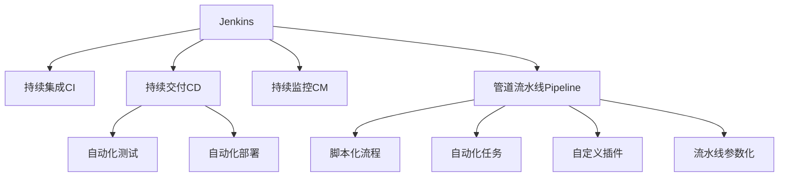

                 

# Jenkins持续集成Pipeline设计

> 关键词：Jenkins, 持续集成, 自动化, 持续交付, 持续部署, 持续监控, 管道流水线, 自动化测试, 自动化部署, 自定义插件, 流水线参数化

## 1. 背景介绍

### 1.1 问题由来
在软件开发过程中，传统的开发、测试和部署流程常常会出现集成效率低、人工操作繁琐、代码质量难以保障等问题。为了提升软件开发的效率和质量，持续集成（Continuous Integration, CI）和持续交付（Continuous Delivery, CD）成为开发团队必须采用的工具和方法。持续集成通过频繁的代码合并，及时发现和修复问题，缩短开发周期。持续交付则通过自动化测试、集成和部署，确保软件的质量和稳定性，降低发布风险。

然而，尽管持续集成和持续交付的理念已经成为业界共识，但实际操作中往往面临工具选择、流程设计、团队协作等多方面的挑战。如何构建高效、稳定、灵活的持续集成和持续交付流程，一直是开发团队需要面对的重要课题。

### 1.2 问题核心关键点
持续集成和持续交付的精髓在于自动化。自动化是持续集成的核心，其目的是减少人为操作的误差和等待时间，提升开发效率。通过构建自动化流水线，可以在代码变更后立即执行测试、构建和部署等任务，确保每次提交的代码都能及时通过质量检测，并按时发布到生产环境。

要实现这一目标，关键在于设计合理的持续集成和持续交付流程，构建可配置、可扩展的自动化流水线。为此，本文将详细介绍基于Jenkins的持续集成Pipeline的设计方法和实现步骤，旨在帮助读者快速搭建高效、灵活的持续集成和持续交付系统。

## 2. 核心概念与联系

### 2.1 核心概念概述

为更好地理解基于Jenkins的持续集成Pipeline，本节将介绍几个密切相关的核心概念：

- Jenkins：一款开源的持续集成和持续交付（CI/CD）工具，能够帮助团队构建和管理自动化流水线。
- 持续集成（CI）：通过自动化地将代码合并到共享的源代码库中，频繁地执行集成测试，及早发现和修复问题。
- 持续交付（CD）：通过自动化地构建、测试和部署软件，确保每次提交的代码都能按时发布到生产环境。
- 持续监控（CM）：通过自动化地监测软件运行状态，及时发现和修复问题，确保软件稳定运行。
- 管道流水线（Pipeline）：一种自动化任务执行机制，由多个步骤（Stage）组成，每个步骤由多个操作（Step）组成，通过脚本化流程实现自动化。
- 自动化测试（Test Automation）：通过脚本或工具自动执行测试用例，提高测试效率和覆盖率。
- 自动化部署（Deployment Automation）：通过脚本或工具自动执行软件部署任务，提升部署效率和一致性。
- 自定义插件（Custom Plugin）：Jenkins提供了丰富的插件生态，可以扩展Jenkins的功能，满足不同的需求。
- 流水线参数化（Pipeline Parameterization）：通过参数化配置，使流水线能够根据不同的输入值自动调整执行流程，提升流水线的灵活性和可配置性。

这些核心概念之间的逻辑关系可以通过以下Mermaid流程图来展示：



这个流程图展示了大语言模型的核心概念及其之间的关系：

1. Jenkins是构建自动化流水线的核心工具。
2. 持续集成、持续交付和持续监控是Jenkins支持的三个核心功能。
3. 管道流水线是实现自动化任务执行的核心机制。
4. 自动化测试和自动化部署是持续集成和持续交付的核心环节。
5. Jenkins提供了丰富的自定义插件和流水线参数化功能，进一步提升了流水线的灵活性和可配置性。

这些核心概念共同构成了Jenkins的持续集成和持续交付框架，使得开发团队能够高效地构建和管理自动化流水线。

## 3. 核心算法原理 & 具体操作步骤
### 3.1 算法原理概述

基于Jenkins的持续集成Pipeline设计，本质上是一个自动化流程构建和管理的过程。其核心思想是：通过脚本化流程定义任务执行的顺序、依赖关系和输入输出，自动执行并监控任务的执行状态，以实现持续集成和持续交付的目标。

形式化地，假设一个持续集成任务由 $N$ 个操作（Operation）组成，操作 $i$ 的执行依赖于前 $k$ 个操作的输出结果，则持续集成 Pipeline 的执行过程可以表示为：

$$
\text{Pipeline} = \{ O_1, O_2, \dots, O_N \}
$$

其中 $O_i$ 表示第 $i$ 个操作，$O_i$ 的执行依赖于 $O_{i-1}, O_{i-2}, \dots, O_{i-k}$ 的输出结果。通过定义操作之间的依赖关系，Pipeline 能够自动执行并监控每个操作的执行状态，确保每个操作都在预期的时间内完成。

### 3.2 算法步骤详解

基于Jenkins的持续集成Pipeline一般包括以下几个关键步骤：

**Step 1: 设计Pipeline**
- 明确持续集成 Pipeline 的流程，包括每个操作的具体执行任务、依赖关系、输入输出等。
- 使用Jenkins提供的Pipeline插件（Pipeline Plugin）定义Pipeline的脚本化流程。

**Step 2: 配置Pipeline**
- 在Jenkins系统中创建Pipeline配置，选择Pipeline类型为Pipeline Definition。
- 配置Pipeline的输入参数，如触发方式、分支、环境变量等。

**Step 3: 实现Pipeline脚本**
- 编写Pipeline脚本，使用Groovy语言定义Pipeline的操作、依赖关系和输出结果。
- 脚本中可以使用各种Jenkins内置的命令和插件，如Shell命令、SVN命令、Maven命令等，实现各种自动化任务。

**Step 4: 构建Pipeline**
- 在Pipeline配置中添加Pipeline脚本，保存并提交Pipeline。
- 在Pipeline配置中添加触发方式，如定时任务、SCM触发、按钮触发等。

**Step 5: 执行Pipeline**
- 使用Pipeline配置创建的Pipeline进行触发，Jenkins系统将自动执行Pipeline脚本中的操作。
- 监控Pipeline的执行状态，查看每个操作的执行日志和结果。

**Step 6: 持续优化Pipeline**
- 根据执行结果和日志信息，持续优化Pipeline脚本，提升Pipeline的执行效率和稳定性。
- 根据业务需求，调整Pipeline的输入参数，实现灵活的配置管理。

以上是基于Jenkins的持续集成Pipeline的一般流程。在实际应用中，还需要针对具体任务的需求，对Pipeline的设计和实现进行优化，如引入更多的自定义插件、流水线参数化、分布式执行等，以进一步提升Pipeline的灵活性和可扩展性。

### 3.3 算法优缺点

基于Jenkins的持续集成Pipeline设计方法具有以下优点：
1. 灵活可配置。通过脚本化流程定义Pipeline，能够实现多种自动化任务，灵活应对不同的业务需求。
2. 自动化程度高。通过Pipeline自动执行任务的执行，减少人为操作，提高开发效率和代码质量。
3. 可扩展性强。Jenkins提供丰富的插件生态，可以通过自定义插件扩展Pipeline的功能。
4. 易于维护。Pipeline的脚本化流程使得任务的执行过程透明化，便于后期维护和优化。

同时，该方法也存在一定的局限性：
1. 学习曲线较陡。 Pipeline 的设计和实现需要一定的学习成本，特别是在复杂的业务场景中。
2. 依赖外部工具。Pipeline的实现依赖Jenkins系统的内置命令和插件，需要在Jenkins中进行脚本编写和执行，可能存在兼容性问题。
3. 可读性差。Pipeline的脚本化流程对于初学者来说，可读性可能较差，难以理解流程的逻辑关系。
4. 系统限制。Jenkins本身的性能和稳定性也可能会限制Pipeline的扩展性和可靠性。

尽管存在这些局限性，但就目前而言，基于Jenkins的持续集成Pipeline设计方法仍是目前业界最主流、最有效的持续集成和持续交付实现方案之一。未来相关研究的重点在于如何进一步提升Pipeline的可读性和可扩展性，优化Jenkins的性能和稳定性，同时兼顾灵活性和易于维护性等因素。

### 3.4 算法应用领域

基于Jenkins的持续集成Pipeline设计方法在软件开发和运维过程中得到了广泛的应用，覆盖了从代码提交到生产部署的各个环节，例如：

- 版本控制：自动执行代码合并、版本标签等任务，确保代码变更的及时性和准确性。
- 代码质量检查：自动执行代码风格检查、静态代码分析等任务，提高代码质量。
- 单元测试：自动执行单元测试用例，提高测试覆盖率和效率。
- 集成测试：自动执行集成测试，验证各个模块之间的协同工作能力。
- 功能测试：自动执行功能测试用例，确保系统功能的正确性。
- 自动化部署：自动执行软件部署任务，提升部署效率和一致性。
- 性能测试：自动执行性能测试，评估软件性能和稳定性。
- 持续监控：自动执行系统监控任务，及时发现和修复问题。

除了上述这些经典任务外，持续集成Pipeline还被创新性地应用到更多场景中，如DevOps自动化、微服务部署、容器化应用等，为软件开发和运维的各个环节提供了全面的自动化支持。

## 4. 数学模型和公式 & 详细讲解  
### 4.1 数学模型构建

本节将使用数学语言对基于Jenkins的持续集成Pipeline的流程进行更加严格的刻画。

假设持续集成任务由 $N$ 个操作组成，操作 $i$ 的执行依赖于前 $k$ 个操作的输出结果。设 $O_i$ 的输入结果为 $x_i$，输出结果为 $y_i$，则操作的执行过程可以表示为：

$$
y_i = f_i(x_1, x_2, \dots, x_k)
$$

其中 $f_i$ 表示操作 $i$ 的执行函数。整个持续集成 Pipeline 的执行过程可以表示为：

$$
\text{Pipeline} = \{ O_1, O_2, \dots, O_N \}
$$

其中 $O_i$ 的输入为前 $k_i$ 个操作的输出，输出为 $y_i$。通过定义操作之间的依赖关系，Pipeline 能够自动执行并监控每个操作的执行状态，确保每个操作都在预期的时间内完成。

### 4.2 公式推导过程

以下我们以一个典型的持续集成 Pipeline 为例，推导其执行过程的计算公式。

假设持续集成 Pipeline 由三个操作 $O_1, O_2, O_3$ 组成，操作 $O_1$ 需要两个输入 $x_1, x_2$，操作 $O_2$ 需要操作 $O_1$ 的输出 $y_1$ 和一个外部输入 $x_3$，操作 $O_3$ 需要操作 $O_2$ 的输出 $y_2$。则整个 Pipeline 的执行过程可以表示为：

$$
\begin{aligned}
&y_1 = f_1(x_1, x_2) \\
&y_2 = f_2(y_1, x_3) \\
&y_3 = f_3(y_2)
\end{aligned}
$$

根据上述公式，我们可以得到 Pipeline 的计算过程为：

$$
y_3 = f_3(f_2(f_1(x_1, x_2), x_3))
$$

这个公式表示了持续集成 Pipeline 的执行过程，即每个操作通过输入其他操作的输出结果，最终得到整个 Pipeline 的输出结果。

## 5. 项目实践：代码实例和详细解释说明
### 5.1 开发环境搭建

在进行持续集成Pipeline实践前，我们需要准备好开发环境。以下是使用Jenkins搭建持续集成环境的步骤：

1. 安装Jenkins：从官网下载并安装Jenkins，部署到服务器中。

2. 安装插件：在Jenkins系统中安装Pipeline插件、Groovy插件、Maven插件等，为Pipeline的实现提供支持。

3. 创建用户账号：为Pipeline的创建者和执行者创建Jenkins账号，并设置相应的权限。

完成上述步骤后，即可在Jenkins系统中开始构建持续集成Pipeline。

### 5.2 源代码详细实现

下面我们以一个简单的持续集成Pipeline为例，给出在Jenkins中实现Pipeline的PyTorch代码实现。

首先，在Jenkins系统中创建一个Pipeline配置，选择Pipeline类型为Pipeline Definition。

然后，在Pipeline脚本中定义持续集成任务的操作：

```groovy
pipeline {
    agent any

    stages {
        stage('代码质量检查') {
            steps {
                // 执行代码风格检查
                sh 'mvn clean install checkstyle:check'
                // 执行静态代码分析
                sh 'mvn clean install pmd:pmd'
            }
        }

        stage('构建') {
            steps {
                // 执行单元测试
                sh 'mvn clean test'
            }
        }

        stage('集成测试') {
            steps {
                // 执行集成测试
                sh 'mvn clean integration-test'
            }
        }

        stage('功能测试') {
            steps {
                // 执行功能测试
                sh 'mvn clean integration-test'
            }
        }

        stage('自动化部署') {
            steps {
                // 执行自动化部署
                sh 'mvn clean package deploy'
            }
        }
    }
}
```

在上述代码中，我们定义了五个操作：代码质量检查、构建、集成测试、功能测试和自动化部署。每个操作通过执行Maven命令，实现代码质量检查、构建和测试等任务。

接着，配置Pipeline的输入参数，如触发方式、分支、环境变量等：

```groovy
pipeline {
    agent any

    triggers {
        schedule '0 0 * * *' // 每日凌晨0点触发Pipeline
    }

    parameters {
        string branch // 指定构建的分支
        string envName // 指定构建的环境名称
    }

    stages {
        stage('代码质量检查') {
            steps {
                // 执行代码风格检查
                sh 'mvn clean install checkstyle:check'
                // 执行静态代码分析
                sh 'mvn clean install pmd:pmd'
            }
        }

        stage('构建') {
            steps {
                // 执行单元测试
                sh 'mvn clean test'
            }
        }

        stage('集成测试') {
            steps {
                // 执行集成测试
                sh 'mvn clean integration-test'
            }
        }

        stage('功能测试') {
            steps {
                // 执行功能测试
                sh 'mvn clean integration-test'
            }
        }

        stage('自动化部署') {
            steps {
                // 执行自动化部署
                sh 'mvn clean package deploy'
            }
        }
    }
}
```

在上述代码中，我们通过定义参数 `branch` 和 `envName`，指定了Pipeline的触发分支和执行环境。这使得Pipeline能够根据不同的构建任务和环境，自动调整执行流程。

最后，保存Pipeline配置，并设置触发方式：

```groovy
pipeline {
    agent any

    triggers {
        schedule '0 0 * * *' // 每日凌晨0点触发Pipeline
    }

    parameters {
        string branch // 指定构建的分支
        string envName // 指定构建的环境名称
    }

    stages {
        stage('代码质量检查') {
            steps {
                // 执行代码风格检查
                sh 'mvn clean install checkstyle:check'
                // 执行静态代码分析
                sh 'mvn clean install pmd:pmd'
            }
        }

        stage('构建') {
            steps {
                // 执行单元测试
                sh 'mvn clean test'
            }
        }

        stage('集成测试') {
            steps {
                // 执行集成测试
                sh 'mvn clean integration-test'
            }
        }

        stage('功能测试') {
            steps {
                // 执行功能测试
                sh 'mvn clean integration-test'
            }
        }

        stage('自动化部署') {
            steps {
                // 执行自动化部署
                sh 'mvn clean package deploy'
            }
        }
    }
}
```

在上述代码中，我们通过定义参数 `branch` 和 `envName`，指定了Pipeline的触发分支和执行环境。这使得Pipeline能够根据不同的构建任务和环境，自动调整执行流程。

### 5.3 代码解读与分析

让我们再详细解读一下关键代码的实现细节：

**Pipeline配置**：
- `pipeline` 标签：定义Pipeline的基本信息，如Pipeline名称、代理配置等。
- `agent any`：指定Pipeline使用的代理类型，这里以任意代理为例。
- `triggers` 标签：定义Pipeline的触发方式，这里使用定时任务触发。
- `parameters` 标签：定义Pipeline的输入参数，这里使用字符串类型参数 `branch` 和 `envName`。

**Pipeline脚本**：
- `stage` 标签：定义Pipeline的不同阶段，每个阶段可以包含多个操作。
- 每个操作使用 `steps` 标签，定义该操作的执行任务，这里以Maven命令为例。

**Pipeline配置**：
- `triggers` 标签：定义Pipeline的触发方式，这里使用定时任务触发。
- `parameters` 标签：定义Pipeline的输入参数，这里使用字符串类型参数 `branch` 和 `envName`。

通过上述代码，我们可以看到Jenkins的Pipeline是如何通过脚本化流程实现自动化任务的执行。Pipeline的脚本化流程使得任务的执行过程透明化，便于后期维护和优化。

当然，工业级的系统实现还需考虑更多因素，如Pipeline的持续优化、自动化测试、分布式执行等。但核心的Pipeline范式基本与此类似。

## 6. 实际应用场景
### 6.1 智能客服系统

基于Jenkins的持续集成Pipeline设计方法，可以广泛应用于智能客服系统的构建。智能客服系统通过持续集成Pipeline，能够自动构建、测试和部署新的功能模块，确保系统稳定高效运行。

在技术实现上，可以收集用户反馈和业务需求，构建持续集成Pipeline，自动执行代码合并、构建、测试和部署等任务。每次提交新代码后，系统能够自动进行功能测试和集成测试，确保新功能的正确性和稳定性。通过持续集成Pipeline，智能客服系统能够快速响应用户需求，提升用户体验和满意度。

### 6.2 金融舆情监测

金融机构需要实时监测市场舆论动向，以便及时应对负面信息传播，规避金融风险。基于Jenkins的持续集成Pipeline设计方法，可以为金融舆情监测提供自动化支持。

具体而言，可以收集金融领域相关的新闻、报道、评论等文本数据，并构建持续集成Pipeline。Pipeline自动执行数据抓取、文本清洗、情感分析等任务，实时监测市场舆论动向。一旦发现负面信息激增等异常情况，系统能够自动预警，帮助金融机构快速应对潜在风险。

### 6.3 个性化推荐系统

当前的推荐系统往往只依赖用户的历史行为数据进行物品推荐，无法深入理解用户的真实兴趣偏好。基于Jenkins的持续集成Pipeline设计方法，个性化推荐系统可以更好地挖掘用户行为背后的语义信息，从而提供更精准、多样的推荐内容。

在技术实现上，可以收集用户浏览、点击、评论、分享等行为数据，提取和用户交互的物品标题、描述、标签等文本内容。将文本内容作为模型输入，用户的后续行为（如是否点击、购买等）作为监督信号，在此基础上构建持续集成Pipeline，自动执行模型训练、测试和部署等任务。持续集成Pipeline能够及时发现和修复模型问题，确保推荐系统的准确性和稳定性。

### 6.4 未来应用展望

随着Jenkins的持续集成Pipeline设计方法的不断发展，其在软件开发和运维过程中将得到更广泛的应用。

在智慧医疗领域，基于持续集成Pipeline的医疗问答、病历分析、药物研发等应用将提升医疗服务的智能化水平，辅助医生诊疗，加速新药开发进程。

在智能教育领域，持续集成Pipeline可应用于作业批改、学情分析、知识推荐等方面，因材施教，促进教育公平，提高教学质量。

在智慧城市治理中，持续集成Pipeline可应用于城市事件监测、舆情分析、应急指挥等环节，提高城市管理的自动化和智能化水平，构建更安全、高效的未来城市。

此外，在企业生产、社会治理、文娱传媒等众多领域，基于持续集成Pipeline的自动化流程设计方法也将不断涌现，为各行各业带来新的技术支持。相信随着Jenkins的持续集成Pipeline设计方法的持续演进，其将为软件开发和运维的各个环节提供更加全面、高效的自动化支持，推动AI技术在各行各业的应用和发展。

## 7. 工具和资源推荐
### 7.1 学习资源推荐

为了帮助开发者系统掌握持续集成Pipeline的设计方法和实现技巧，这里推荐一些优质的学习资源：

1. Jenkins官方文档：Jenkins官网提供了详细的文档，涵盖持续集成Pipeline的设计、实现和优化技巧，是学习持续集成Pipeline的重要参考资料。

2. Jenkins Continuous Pipeline Plugin：Jenkins官方推荐的Pipeline插件，提供丰富的Pipeline设计和优化功能。

3. Groovy编程语言：Groovy是Jenkins持续集成Pipeline的脚本语言，通过学习Groovy编程语言，可以更好地掌握Pipeline的实现细节。

4. Jenkins Pipeline插件实战：《Jenkins Pipeline插件实战》书籍，详细介绍了持续集成Pipeline的实现技巧和最佳实践。

5. Jenkins Pipeline插件社区：Jenkins Pipeline插件社区提供了丰富的插件和示例，可以快速实现各种自动化任务。

通过对这些资源的学习实践，相信你一定能够快速掌握持续集成Pipeline的设计和实现技巧，并用于解决实际的持续集成和持续交付问题。

### 7.2 开发工具推荐

高效的开发离不开优秀的工具支持。以下是几款用于持续集成Pipeline开发的常用工具：

1. Jenkins：作为持续集成和持续交付（CI/CD）的首选工具，Jenkins提供了丰富的插件生态和持续集成Pipeline设计功能。

2. Maven：开源的Java项目管理工具，通过持续集成Pipeline的构建任务，能够自动执行代码构建和依赖管理。

3. Git：流行的版本控制系统，通过持续集成Pipeline的SCM触发，能够自动执行代码合并和版本管理。

4. Docker：开源的容器技术，通过持续集成Pipeline的自动化部署，能够实现软件容器的快速构建和部署。

5. Jenkins Pipeline插件：Jenkins官方推荐的Pipeline插件，提供丰富的Pipeline设计和优化功能。

6. Jenkins Pipeline插件社区：Jenkins Pipeline插件社区提供了丰富的插件和示例，可以快速实现各种自动化任务。

合理利用这些工具，可以显著提升持续集成Pipeline的开发效率，加快创新迭代的步伐。

### 7.3 相关论文推荐

持续集成Pipeline技术的发展源于学界的持续研究。以下是几篇奠基性的相关论文，推荐阅读：

1. Continuous Integration and Continuous Delivery: Definitions, Status, and Challenges：定义了持续集成和持续交付的概念，分析了其发展现状和面临的挑战。

2. A Survey on Continuous Deployment in the Software Industry：综述了持续部署技术的发展历程和现状，分析了其关键技术和应用场景。

3. Continuous Integration with Maven：介绍如何使用Maven实现持续集成Pipeline，提供了详细的示例和最佳实践。

4. Continuous Integration and Continuous Delivery：介绍了持续集成Pipeline的实现方法和最佳实践，分析了其应用效果和挑战。

5. Continuous Integration and Continuous Deployment in the Workflow of Software Engineering：分析了持续集成Pipeline在软件开发工作流中的应用效果和挑战。

这些论文代表了大语言模型微调技术的发展脉络。通过学习这些前沿成果，可以帮助研究者把握学科前进方向，激发更多的创新灵感。

## 8. 总结：未来发展趋势与挑战

### 8.1 总结

本文对基于Jenkins的持续集成Pipeline设计方法进行了全面系统的介绍。首先阐述了持续集成和持续交付的精髓在于自动化，以及Jenkins作为持续集成和持续交付工具的核心作用。其次，从原理到实践，详细讲解了持续集成Pipeline的设计方法和实现步骤，给出了持续集成Pipeline的完整代码实例。同时，本文还广泛探讨了持续集成Pipeline在智能客服、金融舆情、个性化推荐等多个行业领域的应用前景，展示了持续集成Pipeline的巨大潜力。

通过本文的系统梳理，可以看到，基于Jenkins的持续集成Pipeline设计方法正在成为软件开发和运维过程中不可或缺的重要工具，极大地提升了开发效率和代码质量。未来，随着持续集成Pipeline设计方法的持续演进，其将为软件开发和运维的各个环节提供更加全面、高效的自动化支持，推动AI技术在各行各业的应用和发展。

### 8.2 未来发展趋势

展望未来，持续集成Pipeline技术将呈现以下几个发展趋势：

1. 自动化程度提升。随着自动化测试、自动化部署等技术的进步，持续集成Pipeline的自动化程度将进一步提升，减少人为操作的误差和等待时间。

2. 容器化应用普及。容器技术的应用将使得持续集成Pipeline的部署更加便捷和灵活，提高系统的可扩展性和稳定性。

3. 分布式执行优化。持续集成Pipeline的执行过程将更加注重分布式执行的优化，通过多节点并行执行任务，提高系统的高可用性和可靠性。

4. 持续监控和反馈优化。持续集成Pipeline的持续监控和反馈机制将更加完善，通过实时监测系统状态和用户反馈，持续优化Pipeline的执行效果。

5. 持续交付流程完善。持续交付流程将更加注重软件的质量和安全，通过自动化测试、自动化部署等手段，确保软件的高质量和稳定性。

6. 跨部门协作加强。持续集成Pipeline的设计和实现将更加注重跨部门的协作，通过自动化的任务执行和管理，提高团队的协作效率和开发效率。

以上趋势凸显了持续集成Pipeline技术的广阔前景。这些方向的探索发展，必将进一步提升持续集成Pipeline的执行效率和稳定性，推动软件开发和运维的各个环节实现自动化和智能化。

### 8.3 面临的挑战

尽管持续集成Pipeline技术已经取得了瞩目成就，但在迈向更加智能化、普适化应用的过程中，它仍面临着诸多挑战：

1. 系统复杂性增加。随着持续集成Pipeline的执行流程和任务增多，系统的复杂性将增加，调试和维护难度也会提高。如何提高系统的可扩展性和可维护性，将是重要的挑战。

2. 系统性能瓶颈。持续集成Pipeline的执行过程需要大量的计算资源和存储空间，如何在保证性能的同时，优化资源利用率，是一个重要的技术挑战。

3. 系统安全性问题。持续集成Pipeline涉及到代码的自动化合并、构建和部署等敏感操作，如何保障系统的安全性，防止恶意攻击和数据泄露，是一个重要的安全挑战。

4. 系统兼容性问题。持续集成Pipeline的实现依赖Jenkins系统的内置命令和插件，如何在不同的Jenkins版本和环境中保持兼容，是一个重要的挑战。

5. 系统可靠性和稳定性问题。持续集成Pipeline的执行过程涉及多个操作的协同工作，如何确保系统的可靠性和稳定性，避免系统故障和任务失败，是一个重要的技术挑战。

6. 系统可配置性和灵活性问题。持续集成Pipeline的设计和实现需要根据不同的业务需求进行灵活配置，如何提高系统的可配置性和灵活性，使得系统能够适应不同的业务场景，是一个重要的挑战。

正视持续集成Pipeline面临的这些挑战，积极应对并寻求突破，将是大语言模型微调技术走向成熟的必由之路。相信随着学界和产业界的共同努力，这些挑战终将一一被克服，持续集成Pipeline必将在构建人机协同的智能时代中扮演越来越重要的角色。

### 8.4 研究展望

面对持续集成Pipeline所面临的种种挑战，未来的研究需要在以下几个方面寻求新的突破：

1. 持续集成Pipeline的自动化程度提升。探索更多自动化测试、自动化部署等技术，进一步减少人为操作，提升开发效率和代码质量。

2. 容器化应用在持续集成Pipeline中的普及。探索更多容器化技术和应用，实现持续集成Pipeline的便捷和灵活部署。

3. 分布式执行在持续集成Pipeline中的优化。探索更多分布式执行技术和应用，实现持续集成Pipeline的高可用性和可靠性。

4. 持续监控和反馈在持续集成Pipeline中的优化。探索更多持续监控和反馈技术，实现持续集成Pipeline的实时监测和优化。

5. 持续交付流程的完善。探索更多持续交付技术和应用，确保软件的高质量和稳定性。

6. 跨部门协作的加强。探索更多跨部门协作技术和应用，提高团队的协作效率和开发效率。

这些研究方向将推动持续集成Pipeline技术迈向更高的台阶，为构建安全、可靠、可解释、可控的智能系统铺平道路。面向未来，持续集成Pipeline技术还需要与其他AI技术进行更深入的融合，如知识表示、因果推理、强化学习等，多路径协同发力，共同推动持续集成Pipeline技术的发展。

## 9. 附录：常见问题与解答

**Q1：持续集成Pipeline如何与DevOps实践结合？**

A: 持续集成Pipeline是DevOps实践的核心组件之一。DevOps实践强调自动化和持续交付，持续集成Pipeline通过自动化执行代码构建、测试和部署等任务，提升了开发效率和代码质量，减少了人为操作的误差和等待时间。通过持续集成Pipeline，团队可以实现持续交付，及时发现和修复问题，提升软件质量和稳定性。

**Q2：持续集成Pipeline是否适用于所有软件开发项目？**

A: 持续集成Pipeline适用于大部分软件开发项目，尤其是涉及多人协作、代码合并频繁的项目。对于小规模项目或纯手工编写的项目，持续集成Pipeline的价值相对较小。

**Q3：持续集成Pipeline的部署方式有哪些？**

A: 持续集成Pipeline的部署方式包括本地部署、远程部署和云部署等。本地部署适用于小型项目或本地开发环境，远程部署适用于多节点环境或团队协作环境，云部署适用于大规模项目或云环境。

**Q4：持续集成Pipeline的设计和实现需要考虑哪些因素？**

A: 持续集成Pipeline的设计和实现需要考虑以下因素：
1. 任务的自动化程度：持续集成Pipeline的自动化程度越高，开发效率和代码质量越高。
2. 任务的复杂性：持续集成Pipeline的任务复杂性越高，系统维护难度越大。
3. 任务的优先级：持续集成Pipeline的任务优先级越高，系统的高可用性和可靠性越重要。
4. 任务的执行频率：持续集成Pipeline的任务执行频率越高，系统的响应速度越关键。
5. 任务的可配置性：持续集成Pipeline的任务可配置性越高，系统的灵活性越强。

**Q5：持续集成Pipeline在软件开发生命周期中的应用场景有哪些？**

A: 持续集成Pipeline在软件开发生命周期中的应用场景包括：
1. 代码合并：持续集成Pipeline自动执行代码合并任务，确保代码变更的及时性和准确性。
2. 代码质量检查：持续集成Pipeline自动执行代码风格检查、静态代码分析等任务，提高代码质量。
3. 构建和部署：持续集成Pipeline自动执行代码构建和部署任务，提升部署效率和一致性。
4. 测试：持续集成Pipeline自动执行单元测试、集成测试和功能测试等任务，确保软件质量。
5. 持续监控：持续集成Pipeline自动执行系统监控任务，及时发现和修复问题。

通过持续集成Pipeline的应用，软件开发团队可以实现自动化和智能化，提升开发效率和软件质量，推动软件开发向高质量、高效率、高可靠性的方向发展。总之，持续集成Pipeline是DevOps实践的重要组成部分，是软件开发和运维过程中不可或缺的工具和方法。

---

作者：禅与计算机程序设计艺术 / Zen and the Art of Computer Programming

