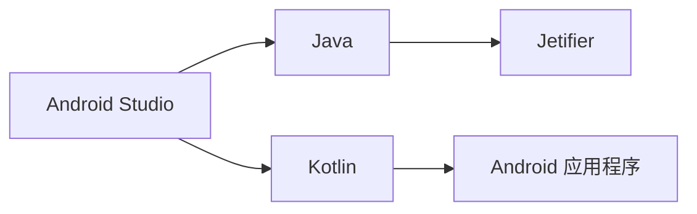

                 

# Kotlin 语言：现代 Android 开发语言

## 1. 背景介绍

Kotlin 是一种现代化的编程语言，其语法简洁、类型安全，为 Android 应用程序开发提供了更好的支持。相比 Java，Kotlin 提供了更少的样板代码、更好的工具集成、更高效的类型推断、更丰富的函数式编程特性，使得 Android 开发更加高效、可靠。本博文将从 Kotlin 语言的核心概念、主要特性、应用场景以及未来发展趋势等方面进行全面介绍。

## 2. 核心概念与联系

### 2.1 核心概念概述

- **Kotlin 语言**：一种静态类型、编译型编程语言，由 JetBrains 公司开发。Kotlin 与 Java 互操作性强，可以无缝集成现有 Java 代码基础，同时提供了更多的编程便利性。

- **Android Studio**：谷歌官方提供的 Android 应用程序开发集成开发环境（IDE）。Android Studio 支持 Kotlin 与 Java 两种语言，使得开发 Android 应用更加便捷。

- **Jetifier**：由 JetBrains 提供的工具，用于将旧 Java 代码转换为 Kotlin 代码。Jetifier 简化了迁移过程，帮助开发者快速上手 Kotlin。

- **Kotlin 特性**：包括扩展函数、数据类、协程、内联函数、函数式编程等，使得 Android 应用程序开发更加高效、简洁。

### 2.2 核心概念原理和架构的 Mermaid 流程图



这个简单的流程图示意了 Kotlin 在 Android Studio 中与 Java 代码的互操作性，以及 Jetifier 的作用。Kotlin 语言通过 Android Studio 编译为 Java 字节码，实现与现有 Android 生态系统的兼容。Jetifier 工具则帮助将 Java 代码转换为 Kotlin 代码，使得开发者可以逐步向 Kotlin 过渡。

## 3. 核心算法原理 & 具体操作步骤

### 3.1 算法原理概述

Kotlin 的核心算法原理主要包括以下几个方面：

- **静态类型**：Kotlin 提供了静态类型，编译器可以在编译阶段检查类型错误，提前发现和修复潜在的bug。
- **表达式求值**：Kotlin 支持延迟计算，可以有效地处理函数式编程中的副作用问题。
- **类型推断**：Kotlin 支持变量类型推断，使得开发者可以更加简洁地编写代码，同时保持类型安全。
- **lambda 表达式**：Kotlin 提供了简洁的 lambda 表达式，方便实现函数式编程。

### 3.2 算法步骤详解

Kotlin 的开发流程包括以下几个关键步骤：

1. **环境搭建**：安装 Android Studio，确保环境中有 Kotlin 插件和 Jetifier 工具。
2. **项目创建**：使用 Android Studio 创建新项目，选择 Kotlin 作为编程语言。
3. **代码编写**：在 Android Studio 中编写 Kotlin 代码，使用 Jetifier 工具将 Java 代码转换为 Kotlin 代码。
4. **调试与测试**：使用 Android Studio 的调试和测试工具，进行代码调试和单元测试。
5. **发布与部署**：将构建好的 APK 文件发布到 Google Play 商店或其他分发平台。

### 3.3 算法优缺点

**优点**：
- **简洁高效**：Kotlin 提供了简洁的语法，减少了样板代码，提高开发效率。
- **类型安全**：静态类型编译使得代码更加健壮，减少了运行时错误。
- **跨语言互操作**：Kotlin 与 Java 无缝集成，可以逐步从 Java 过渡到 Kotlin。
- **现代特性**：Kotlin 支持扩展函数、协程、内联函数、数据类等现代编程特性，使得 Android 开发更加便捷。

**缺点**：
- **学习曲线**：Kotlin 提供了许多新的特性，需要开发者学习一定的曲线。
- **生态成熟度**：Kotlin 在 Android 开发生态中的成熟度还需进一步提升。

### 3.4 算法应用领域

Kotlin 在 Android 应用程序开发中的应用非常广泛，适用于以下领域：

- **用户界面**：使用 Kotlin 编写 Android 界面逻辑，实现响应式 UI 设计。
- **数据处理**：使用 Kotlin 处理数据和实现数据绑定。
- **网络请求**：使用 Kotlin 编写网络请求，进行数据传输和处理。
- **后台服务**：使用 Kotlin 实现后台服务，如消息推送、定时任务等。
- **依赖注入**：使用 Kotlin 编写依赖注入框架，实现组件的灵活调用。

## 4. 数学模型和公式 & 详细讲解

由于 Kotlin 主要用于编程开发，不涉及数学建模和公式计算，因此本节将直接跳过数学模型和公式部分。

## 5. 项目实践：代码实例和详细解释说明

### 5.1 开发环境搭建

1. **安装 Android Studio**：从官网下载并安装 Android Studio。
2. **创建 Kotlin 项目**：选择 `File -> New -> New Project`，选择 Kotlin 作为语言，创建新项目。
3. **配置 Jetifier**：在 Android Studio 中，通过 `Configure -> Plugins` 安装 Kotlin 插件，并使用 Jetifier 工具将 Java 代码转换为 Kotlin 代码。

### 5.2 源代码详细实现

以下是一个简单的 Kotlin 代码示例，用于实现一个基本的 Android 应用程序：

```kotlin
package com.example.myapplication

import android.os.Bundle
import androidx.appcompat.app.AppCompatActivity
import android.widget.TextView

class MainActivity : AppCompatActivity() {
    override fun onCreate(savedInstanceState: Bundle?) {
        super.onCreate(savedInstanceState)
        setContentView(R.layout.activity_main)

        // 设置 UI
        val textView = findViewById<TextView>(R.id.textView)
        textView.text = "Hello, Kotlin!"
    }
}
```

这个示例展示了如何在 Android 应用程序中编写 Kotlin 代码，并使用 Jetifier 工具将其转换为 Java 代码。

### 5.3 代码解读与分析

- **import 语句**：导入需要使用的类和库。
- **override fun**：重写父类方法。
- **findViewById**：通过 ID 查找视图，用于设置 UI。
- **setContentView**：设置布局文件。

### 5.4 运行结果展示

运行该应用程序，可以看到简单的 UI 界面上显示 "Hello, Kotlin!"。

## 6. 实际应用场景

Kotlin 在 Android 应用程序开发中具有广泛的应用场景，适用于以下实际应用：

- **UI 界面**：通过 Kotlin 实现界面逻辑，支持响应式 UI 设计。
- **数据绑定**：使用 Kotlin 处理数据，实现 MVVM 模式。
- **网络请求**：使用 Kotlin 编写网络请求，实现数据传输和处理。
- **后台服务**：使用 Kotlin 实现后台服务，如消息推送、定时任务等。
- **依赖注入**：使用 Kotlin 编写依赖注入框架，实现组件的灵活调用。

## 7. 工具和资源推荐

### 7.1 学习资源推荐

- **Kotlin 官方文档**：Kotlin 官方提供的文档，涵盖 Kotlin 语言和 Android 开发的最佳实践。
- **Android Developers**：谷歌提供的 Android 开发文档，涵盖 Android 应用程序开发的方方面面。
- **Kotlin Koans**：Kotlin 的入门教程，通过交互式练习帮助开发者掌握 Kotlin 基础。
- **Kotlin in Action**：Kotlin 的官方书籍，详细介绍了 Kotlin 语言和 Android 开发的核心概念和技术。

### 7.2 开发工具推荐

- **Android Studio**：谷歌官方提供的 Android 应用程序开发 IDE。
- **JetBrains IntelliJ IDEA**：强大的 Java 和 Kotlin IDE，支持跨语言开发和调试。
- **Android Jetifier**：JetBrains 提供的工具，用于将 Java 代码转换为 Kotlin 代码。

### 7.3 相关论文推荐

- **Kotlin Programming Language**：JetBrains 发表的 Kotlin 编程语言论文，详细介绍了 Kotlin 的设计理念和核心特性。
- **Kotlin for Android**：谷歌发表的 Kotlin 在 Android 开发中的应用论文，介绍了 Kotlin 在 Android 中的实际应用案例。

## 8. 总结：未来发展趋势与挑战

### 8.1 未来发展趋势

Kotlin 在 Android 开发中的应用前景广阔，未来发展趋势主要包括以下几个方面：

- **生态系统完善**：随着 Kotlin 在 Android 生态中的成熟度不断提高，Kotlin 将取代 Java 成为 Android 开发的首选语言。
- **跨语言集成**：Kotlin 与 Java 的无缝集成将进一步提升 Android 应用程序的开发效率。
- **工具与插件**：更多的工具和插件将涌现，帮助开发者更加便捷地使用 Kotlin。
- **教育与培训**：Kotlin 的教育和培训资源将不断丰富，吸引更多开发者使用 Kotlin。

### 8.2 面临的挑战

Kotlin 在 Android 开发中也面临着一些挑战：

- **生态成熟度**：Kotlin 在 Android 生态中的成熟度还需进一步提升，需要更多开发者和社区的支持。
- **学习曲线**：Kotlin 的现代特性和语法需要开发者投入一定的学习成本。
- **工具支持**：现有的开发工具和插件仍需进一步优化和完善，以适应 Kotlin 的发展。

### 8.3 研究展望

未来的 Kotlin 研究主要集中在以下几个方面：

- **语言特性优化**：优化 Kotlin 的语法和特性，提高开发效率和代码可读性。
- **跨语言集成**：深入研究 Kotlin 与 Java 的互操作性，进一步提升跨语言开发的支持。
- **教育与培训**：开发更多的教育资源和培训课程，吸引更多开发者使用 Kotlin。

## 9. 附录：常见问题与解答

**Q1：Kotlin 是否支持 Java 的旧版特性？**

A: Kotlin 与 Java 兼容性强，可以逐步从 Java 过渡到 Kotlin，并支持 Java 的旧版特性。

**Q2：Kotlin 是否会影响性能？**

A: Kotlin 的性能与 Java 相当，由于编译阶段的类型检查，编译后的字节码与 Java 相同，因此不会影响性能。

**Q3：如何从 Java 迁移为 Kotlin？**

A: 使用 Jetifier 工具将 Java 代码转换为 Kotlin 代码，逐步从 Java 过渡到 Kotlin。

**Q4：Kotlin 与 Java 互操作性如何？**

A: Kotlin 与 Java 互操作性强，可以无缝集成现有 Java 代码基础，同时支持交互式 Kotlin 与 Java 的混合编程。

---

作者：禅与计算机程序设计艺术 / Zen and the Art of Computer Programming

