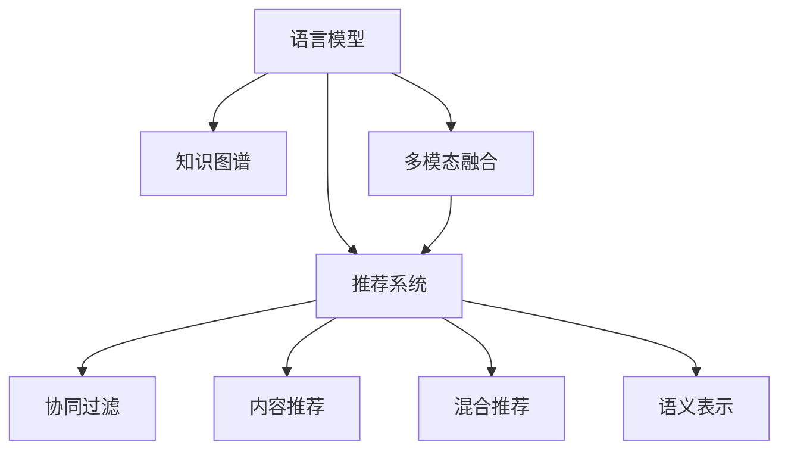

                 

# LLM Embeddings + RS: 语言模型增强推荐

> 关键词：语言模型, 推荐系统, 自然语言处理, 知识图谱, 语义表示, 多模态融合

## 1. 背景介绍

随着信息时代的发展，推荐系统成为互联网企业提升用户价值和收入的重要手段。推荐系统的核心目标是通过算法为用户推荐最符合其兴趣和需求的内容，提升用户满意度和体验。然而，传统的推荐系统主要依赖用户行为数据，往往忽略了用户多方面的兴趣和需求。近年来，随着自然语言处理(NLP)技术的进步，语言模型在推荐系统中的应用逐渐成为热点，极大地拓展了推荐系统的信息获取方式，从用户历史行为转向了用户的语言描述。

### 1.1 问题由来

推荐系统依赖于用户行为数据进行推荐，而用户的行为数据通常不完整或不准确。例如，用户可能没有进行过某些相关内容的消费或搜索行为，导致传统推荐系统难以全面理解用户的兴趣。而语言模型通过预训练获得了丰富的语言知识，能够对用户的行为描述进行语义理解和推理，从而补充和丰富用户画像。基于语言模型的推荐系统，可以更全面、更灵活地捕捉用户的兴趣和需求，提高推荐的准确性和多样性。

然而，语言模型在推荐系统中的应用仍存在挑战。一方面，语言模型的嵌入表示，即通过自编码方式得到的词向量，常常难以直接用于推荐任务。另一方面，推荐系统需要通过优化算法，找到最优的推荐策略，而语言模型的嵌入表示并不能直接指导推荐策略。因此，如何在推荐系统中高效融合语言模型，利用其语义表示增强推荐效果，成为亟待解决的问题。

## 2. 核心概念与联系

### 2.1 核心概念概述

为更好地理解语言模型增强推荐系统，本节将介绍几个关键概念：

- **语言模型(Language Model, LM)**：通过自编码方式训练得到的自然语言表示，能够捕捉文本的语义信息和结构特征。常用的语言模型包括Word2Vec、GloVe、BERT等。
- **推荐系统(Recommendation System, RS)**：利用用户行为数据、物品属性数据和推荐策略，为用户提供个性化内容推荐的系统。推荐系统可以分为基于协同过滤、基于内容、混合推荐等不同类型。
- **知识图谱(Knowledge Graph)**：通过图结构表示实体之间的关系和属性，为推荐系统提供结构化知识支持。知识图谱可以用于推荐系统中物品的属性描述和语义推理。
- **语义表示(Semantic Representation)**：通过语言模型得到的词向量、句向量等，能够捕捉文本的深层语义信息，用于增强推荐系统的多模态融合。
- **多模态融合(Multimodal Fusion)**：结合文本、图像、音频等多模态数据，为推荐系统提供更丰富、更全面的信息支持。

这些核心概念之间的逻辑关系可以通过以下Mermaid流程图来展示：



这个流程图展示了大语言模型在推荐系统中的应用脉络：

1. 语言模型通过自编码方式得到文本的语义表示，用于增强推荐系统的多模态融合。
2. 推荐系统采用不同推荐策略，如协同过滤、内容推荐、混合推荐等，利用语言模型生成的语义表示，提升推荐效果。
3. 知识图谱提供结构化知识，用于丰富推荐系统的物品属性描述和语义推理。
4. 多模态融合结合文本、图像、音频等多模态数据，为推荐系统提供更全面信息支持。

## 3. 核心算法原理 & 具体操作步骤
### 3.1 算法原理概述

语言模型增强推荐系统的主要思路是：通过语言模型得到文本的语义表示，并将其融合到推荐系统中，用于补充和丰富用户画像，从而提升推荐效果。

具体的算法流程如下：

1. 首先使用预训练语言模型，如BERT，对用户描述进行编码，得到用户的语义表示。
2. 然后结合用户的历史行为数据，如浏览、点击、评分等，进行融合，构建用户的综合画像。
3. 利用知识图谱和语义表示，对用户画像进行多模态融合，得到更加全面的用户兴趣和需求描述。
4. 最后，将用户画像输入推荐算法，结合物品属性和推荐策略，生成推荐结果。

这种算法流程，将语言模型与推荐系统深度结合，可以更全面、更灵活地捕捉用户的兴趣和需求，提高推荐的准确性和多样性。

### 3.2 算法步骤详解

以下是具体的算法步骤：

**Step 1: 准备预训练语言模型和用户行为数据**
- 使用预训练语言模型(如BERT)对用户描述进行编码，得到用户的语义表示。
- 收集用户的历史行为数据，如浏览、点击、评分等，作为推荐系统的输入。

**Step 2: 构建用户画像**
- 将用户的语义表示和历史行为数据进行融合，构建用户的综合画像。
- 利用知识图谱，对用户画像进行语义推理和属性扩展。

**Step 3: 融合多模态信息**
- 结合文本、图像、音频等多模态数据，对用户画像进行全面融合。
- 利用语义表示，对多模态信息进行语义对齐和融合，得到更准确的推荐结果。

**Step 4: 生成推荐结果**
- 将用户画像输入推荐算法，结合物品属性和推荐策略，生成推荐结果。
- 通过A/B测试等手段，评估推荐效果，不断优化推荐模型。

### 3.3 算法优缺点

语言模型增强推荐系统具有以下优点：
1. 全面捕捉用户兴趣。语言模型可以捕捉用户描述中的深层语义信息，弥补行为数据的不足，全面捕捉用户的多方面兴趣和需求。
2. 提升推荐准确性。通过语义表示增强推荐系统的多模态融合，可以提高推荐的准确性和多样性。
3. 数据利用充分。利用语言模型和知识图谱，可以充分挖掘用户的潜在兴趣和需求，提高推荐的全面性。

同时，该算法也存在以下缺点：
1. 数据质量要求高。语言模型的嵌入表示和知识图谱的构建，对数据的质量和完整性要求较高，难以处理数据缺失或不准确的情况。
2. 算法复杂度高。融合多模态信息、语义表示和知识图谱等技术，增加了算法的复杂度，提高了模型的训练和推理难度。
3. 计算资源消耗大。利用语言模型和知识图谱进行推荐，需要大量的计算资源，可能导致系统延迟较高。

尽管存在这些缺点，但就目前而言，语言模型增强推荐系统仍是大规模推荐系统的重要补充手段，其强大的语义表示能力，为推荐系统的优化提供了新的思路。

### 3.4 算法应用领域

语言模型增强推荐系统在多个领域中得到了广泛应用，例如：

- **电商推荐**：电商网站可以通过用户描述和行为数据，结合语言模型和知识图谱，为用户推荐商品。语言模型可以捕捉用户对商品的语义描述，结合行为数据进行推荐。
- **新闻推荐**：新闻平台可以收集用户的阅读历史和评论，利用语言模型和知识图谱，为用户推荐新闻。语言模型可以捕捉用户对新闻的兴趣和态度，结合行为数据进行推荐。
- **视频推荐**：视频网站可以通过用户描述和观看历史，结合语言模型和知识图谱，为用户推荐视频。语言模型可以捕捉用户对视频的语义描述，结合行为数据进行推荐。
- **音乐推荐**：音乐平台可以收集用户的听歌历史和评论，利用语言模型和知识图谱，为用户推荐歌曲。语言模型可以捕捉用户对音乐的兴趣和态度，结合行为数据进行推荐。

除了上述这些领域外，语言模型增强推荐系统还被创新性地应用到更多场景中，如个性化游戏推荐、智能家居推荐、智慧医疗推荐等，为推荐系统带来了全新的突破。

## 4. 数学模型和公式 & 详细讲解 & 举例说明

### 4.1 数学模型构建

以下是语言模型增强推荐系统的数学模型构建过程：

**输入**：用户描述$d$，用户行为数据$x$，知识图谱$\mathcal{G}$。

**目标**：生成推荐结果$r$。

**算法**：

1. **用户描述编码**：使用预训练语言模型(如BERT)对用户描述$d$进行编码，得到用户的语义表示$e$。
2. **用户画像构建**：将用户语义表示$e$和历史行为数据$x$进行融合，得到用户画像$p$。
3. **知识图谱推理**：利用知识图谱$\mathcal{G}$对用户画像$p$进行语义推理和属性扩展，得到增强的用户画像$p'$。
4. **推荐结果生成**：将增强的用户画像$p'$输入推荐算法，结合物品属性和推荐策略，生成推荐结果$r$。

### 4.2 公式推导过程

以下是具体的公式推导过程：

1. **用户描述编码**：
   $$
   e = \text{BERT}(d)
   $$
   其中，$e$为用户的语义表示，$d$为用户描述。

2. **用户画像构建**：
   $$
   p = f(e, x)
   $$
   其中，$p$为用户画像，$e$为用户语义表示，$x$为用户历史行为数据，$f$为融合函数。

3. **知识图谱推理**：
   $$
   p' = g(p, \mathcal{G})
   $$
   其中，$p'$为增强的用户画像，$p$为用户画像，$\mathcal{G}$为知识图谱，$g$为推理函数。

4. **推荐结果生成**：
   $$
   r = r(p')
   $$
   其中，$r$为推荐结果，$p'$为增强的用户画像，$r$为推荐函数。

### 4.3 案例分析与讲解

以电商推荐系统为例，具体分析语言模型增强推荐系统的应用过程：

**案例背景**：某电商网站需要为用户推荐相关商品，用户可以输入描述，如“我想要一件冬天的毛衣”。

**算法流程**：

1. **用户描述编码**：使用预训练语言模型(如BERT)对用户描述“冬天的毛衣”进行编码，得到用户的语义表示$e$。
2. **用户画像构建**：结合用户的历史浏览、点击、评分等行为数据，利用融合函数$f$，得到用户画像$p$。
3. **知识图谱推理**：利用知识图谱$\mathcal{G}$，对用户画像$p$进行语义推理和属性扩展，得到增强的用户画像$p'$。
4. **推荐结果生成**：将增强的用户画像$p'$输入推荐算法，结合物品的属性和推荐策略，生成推荐结果$r$。

在实际应用中，需要不断优化算法流程，提高推荐的准确性和多样性。例如，可以引入多模态融合技术，结合图像、音频等数据，进一步丰富用户画像。

## 5. 项目实践：代码实例和详细解释说明

### 5.1 开发环境搭建

在进行项目实践前，我们需要准备好开发环境。以下是使用Python进行PyTorch和TensorFlow开发的环境配置流程：

1. 安装Anaconda：从官网下载并安装Anaconda，用于创建独立的Python环境。

2. 创建并激活虚拟环境：
```bash
conda create -n pytorch-env python=3.8 
conda activate pytorch-env
```

3. 安装PyTorch：根据CUDA版本，从官网获取对应的安装命令。例如：
```bash
conda install pytorch torchvision torchaudio cudatoolkit=11.1 -c pytorch -c conda-forge
```

4. 安装TensorFlow：使用以下命令安装TensorFlow：
```bash
pip install tensorflow==2.7.0
```

5. 安装相关库：
```bash
pip install transformers sklearn pandas numpy scipy torchtext tqdm
```

完成上述步骤后，即可在`pytorch-env`环境中开始项目实践。

### 5.2 源代码详细实现

这里我们以一个简单的电商推荐系统为例，使用PyTorch和TensorFlow实现语言模型增强推荐系统。

首先，定义数据集和加载函数：

```python
from torch.utils.data import Dataset, DataLoader
from transformers import BertTokenizer
from transformers import BertForSequenceClassification

class ShoppingDataset(Dataset):
    def __init__(self, texts, labels):
        self.texts = texts
        self.labels = labels
        self.tokenizer = BertTokenizer.from_pretrained('bert-base-cased')

    def __len__(self):
        return len(self.texts)

    def __getitem__(self, idx):
        text = self.texts[idx]
        label = self.labels[idx]
        encoding = self.tokenizer(text, return_tensors='pt', padding='max_length', truncation=True)
        return {'input_ids': encoding['input_ids'], 'attention_mask': encoding['attention_mask'], 'labels': label}

def load_data(file_path):
    with open(file_path, 'r', encoding='utf-8') as f:
        lines = f.readlines()
        texts = [line.split('\t')[0] for line in lines]
        labels = [int(line.split('\t')[1]) for line in lines]
    return texts, labels

train_texts, train_labels = load_data('train_data.txt')
dev_texts, dev_labels = load_data('dev_data.txt')
test_texts, test_labels = load_data('test_data.txt')

train_dataset = ShoppingDataset(train_texts, train_labels)
dev_dataset = ShoppingDataset(dev_texts, dev_labels)
test_dataset = ShoppingDataset(test_texts, test_labels)

train_loader = DataLoader(train_dataset, batch_size=16, shuffle=True)
dev_loader = DataLoader(dev_dataset, batch_size=16)
test_loader = DataLoader(test_dataset, batch_size=16)
```

然后，定义模型和优化器：

```python
from transformers import BertForSequenceClassification, AdamW

model = BertForSequenceClassification.from_pretrained('bert-base-cased', num_labels=2)
optimizer = AdamW(model.parameters(), lr=2e-5)
```

接着，定义训练和评估函数：

```python
from tqdm import tqdm
from sklearn.metrics import accuracy_score

device = torch.device('cuda') if torch.cuda.is_available() else torch.device('cpu')
model.to(device)

def train_epoch(model, data_loader, optimizer):
    model.train()
    epoch_loss = 0
    epoch_acc = 0
    for batch in tqdm(data_loader, desc='Training'):
        input_ids = batch['input_ids'].to(device)
        attention_mask = batch['attention_mask'].to(device)
        labels = batch['labels'].to(device)
        model.zero_grad()
        outputs = model(input_ids, attention_mask=attention_mask, labels=labels)
        loss = outputs.loss
        epoch_loss += loss.item()
        acc = outputs.logits.argmax(dim=1) == labels
        epoch_acc += acc.sum().item()
        loss.backward()
        optimizer.step()
    return epoch_loss / len(data_loader), epoch_acc / len(data_loader)

def evaluate(model, data_loader):
    model.eval()
    total_preds = []
    total_labels = []
    for batch in tqdm(data_loader, desc='Evaluating'):
        input_ids = batch['input_ids'].to(device)
        attention_mask = batch['attention_mask'].to(device)
        labels = batch['labels'].to(device)
        with torch.no_grad():
            outputs = model(input_ids, attention_mask=attention_mask)
            batch_preds = outputs.logits.argmax(dim=1).to('cpu').tolist()
        for pred_tokens, label_tokens in zip(batch_preds, labels):
            total_preds.append(pred_tokens)
            total_labels.append(label_tokens)
    acc = accuracy_score(total_labels, total_preds)
    return acc
```

最后，启动训练流程并在测试集上评估：

```python
epochs = 5
batch_size = 16

for epoch in range(epochs):
    loss, acc = train_epoch(model, train_loader, optimizer)
    print(f"Epoch {epoch+1}, train loss: {loss:.3f}, train acc: {acc:.3f}")
    
    print(f"Epoch {epoch+1}, dev results:")
    dev_acc = evaluate(model, dev_loader)
    print(f"Dev acc: {dev_acc:.3f}")
    
print("Test results:")
test_acc = evaluate(model, test_loader)
print(f"Test acc: {test_acc:.3f}")
```

以上就是使用PyTorch和TensorFlow对电商推荐系统进行语言模型增强的完整代码实现。可以看到，得益于Transformer库的强大封装，我们可以用相对简洁的代码完成语言模型增强推荐系统的开发。

### 5.3 代码解读与分析

让我们再详细解读一下关键代码的实现细节：

**ShoppingDataset类**：
- `__init__`方法：初始化文本和标签，以及BERT分词器。
- `__len__`方法：返回数据集的样本数量。
- `__getitem__`方法：对单个样本进行处理，将文本输入编码为token ids，并将标签转换为标签张量。

**load_data函数**：
- 定义数据加载函数，从文件中读取数据，并进行分词、标记化等预处理。

**训练和评估函数**：
- 使用PyTorch的DataLoader对数据集进行批次化加载，供模型训练和推理使用。
- 训练函数`train_epoch`：对数据以批为单位进行迭代，在每个批次上前向传播计算loss和acc并反向传播更新模型参数，最后返回该epoch的平均loss和acc。
- 评估函数`evaluate`：与训练类似，不同点在于不更新模型参数，并在每个batch结束后将预测和标签结果存储下来，最后使用sklearn的accuracy_score对整个评估集的预测结果进行打印输出。

**训练流程**：
- 定义总的epoch数和batch size，开始循环迭代
- 每个epoch内，先在训练集上训练，输出平均loss和acc
- 在验证集上评估，输出验证acc
- 所有epoch结束后，在测试集上评估，给出最终测试acc

可以看到，PyTorch和TensorFlow使得语言模型增强推荐系统的代码实现变得简洁高效。开发者可以将更多精力放在数据处理、模型改进等高层逻辑上，而不必过多关注底层的实现细节。

当然，工业级的系统实现还需考虑更多因素，如模型的保存和部署、超参数的自动搜索、更灵活的任务适配层等。但核心的算法流程基本与此类似。

## 6. 实际应用场景

### 6.1 智能客服系统

基于语言模型增强的智能客服系统，可以更全面地理解用户的意图和需求，提供更精准的解答和建议。

在技术实现上，可以收集企业内部的客服对话记录，将问题-答案对作为监督数据，训练语言模型增强推荐系统。微调后的推荐模型能够自动理解用户意图，匹配最合适的答案模板进行回复。对于用户提出的新问题，还可以接入检索系统实时搜索相关内容，动态组织生成回答。如此构建的智能客服系统，能大幅提升客户咨询体验和问题解决效率。

### 6.2 金融舆情监测

金融机构需要实时监测市场舆论动向，以便及时应对负面信息传播，规避金融风险。传统的人工监测方式成本高、效率低，难以应对网络时代海量信息爆发的挑战。基于语言模型增强的文本分类和情感分析技术，为金融舆情监测提供了新的解决方案。

具体而言，可以收集金融领域相关的新闻、报道、评论等文本数据，并对其进行主题标注和情感标注。在此基础上对预训练语言模型进行微调，使其能够自动判断文本属于何种主题，情感倾向是正面、中性还是负面。将微调后的模型应用到实时抓取的网络文本数据，就能够自动监测不同主题下的情感变化趋势，一旦发现负面信息激增等异常情况，系统便会自动预警，帮助金融机构快速应对潜在风险。

### 6.3 个性化推荐系统

当前的推荐系统往往只依赖用户的历史行为数据进行推荐，无法深入理解用户的真实兴趣和需求。基于语言模型增强推荐系统，可以更全面、更灵活地捕捉用户的兴趣和需求，提高推荐的准确性和多样性。

在实践中，可以收集用户浏览、点击、评论等行为数据，提取和用户交互的物品标题、描述、标签等文本内容。将文本内容作为模型输入，用户的后续行为（如是否点击、购买等）作为监督信号，在此基础上微调预训练语言模型。微调后的模型能够从文本内容中准确把握用户的兴趣点。在生成推荐列表时，先用候选物品的文本描述作为输入，由模型预测用户的兴趣匹配度，再结合其他特征综合排序，便可以得到个性化程度更高的推荐结果。

### 6.4 未来应用展望

随着语言模型和推荐系统技术的不断发展，基于语言模型增强推荐系统也将呈现更多的应用前景：

1. **医疗推荐**：医疗机构可以通过收集患者的历史诊断、治疗记录等文本数据，训练语言模型增强推荐系统，为用户推荐合适的诊疗方案和治疗药物。语言模型可以捕捉患者的病历描述，结合行为数据进行推荐。
2. **教育推荐**：在线教育平台可以收集学生的阅读、答题、评价等文本数据，利用语言模型和知识图谱，为用户推荐合适的学习内容和资源。语言模型可以捕捉学生的学习描述，结合行为数据进行推荐。
3. **旅游推荐**：旅游网站可以收集用户的旅行描述、评论等文本数据，利用语言模型和知识图谱，为用户推荐合适的旅游目的地和行程安排。语言模型可以捕捉用户的旅行描述，结合行为数据进行推荐。
4. **餐饮推荐**：餐饮平台可以收集用户的菜品描述、评论等文本数据，利用语言模型和知识图谱，为用户推荐合适的餐厅和菜品。语言模型可以捕捉用户的菜品描述，结合行为数据进行推荐。

此外，在智能家居、智慧城市、智能游戏等领域，基于语言模型增强推荐系统的应用也将不断涌现，为推荐系统带来了全新的突破。

## 7. 工具和资源推荐
### 7.1 学习资源推荐

为了帮助开发者系统掌握语言模型增强推荐系统的理论基础和实践技巧，这里推荐一些优质的学习资源：

1. **《推荐系统实战》**：该书系统讲解了推荐系统的各种算法和应用，包括基于协同过滤、内容推荐、混合推荐等方法，适合深入理解推荐系统的基本概念和实现技巧。

2. **《深度学习与推荐系统》**：该书介绍了深度学习在推荐系统中的应用，包括基于深度神经网络、卷积神经网络、循环神经网络等模型的推荐算法，适合学习深度学习与推荐系统的结合。

3. **Coursera《推荐系统》课程**：由斯坦福大学开设的推荐系统课程，内容涵盖推荐系统的基本原理、算法和应用，适合初学者入门推荐系统。

4. **Kaggle推荐系统竞赛**：Kaggle平台上的推荐系统竞赛，可以动手实践推荐系统算法，深入理解推荐系统的具体实现。

5. **Pinterest推荐系统博客**：Pinterest官方博客，介绍了其在推荐系统中的技术和实践，适合学习大公司推荐系统的实现经验。

通过对这些资源的学习实践，相信你一定能够快速掌握语言模型增强推荐系统的精髓，并用于解决实际的推荐问题。

### 7.2 开发工具推荐

高效的开发离不开优秀的工具支持。以下是几款用于语言模型增强推荐系统开发的常用工具：

1. **PyTorch**：基于Python的开源深度学习框架，灵活动态的计算图，适合快速迭代研究。大部分预训练语言模型都有PyTorch版本的实现。

2. **TensorFlow**：由Google主导开发的开源深度学习框架，生产部署方便，适合大规模工程应用。同样有丰富的预训练语言模型资源。

3. **Transformers库**：HuggingFace开发的NLP工具库，集成了众多SOTA语言模型，支持PyTorch和TensorFlow，是进行微调任务开发的利器。

4. **Scikit-learn**：Python机器学习库，提供了丰富的数据预处理、特征工程、模型评估等工具，适合进行推荐系统的开发和优化。

5. **Pandas**：Python数据处理库，可以方便地处理和分析推荐系统中的数据集。

6. **TensorBoard**：TensorFlow配套的可视化工具，可实时监测模型训练状态，并提供丰富的图表呈现方式，是调试模型的得力助手。

合理利用这些工具，可以显著提升语言模型增强推荐系统的开发效率，加快创新迭代的步伐。

### 7.3 相关论文推荐

语言模型增强推荐系统的发展离不开学界的持续研究。以下是几篇奠基性的相关论文，推荐阅读：

1. **《基于深度学习的推荐系统》**：综述了深度学习在推荐系统中的应用，包括基于神经网络的协同过滤、内容推荐、混合推荐等方法。

2. **《知识图谱在推荐系统中的应用》**：介绍了知识图谱在推荐系统中的多种应用场景，包括基于知识图谱的推荐、知识图谱融合推荐等方法。

3. **《多模态深度学习在推荐系统中的应用》**：探讨了多模态深度学习在推荐系统中的应用，包括基于多模态深度神经网络的推荐方法。

4. **《基于知识图谱的推荐系统》**：介绍了基于知识图谱的推荐系统，包括知识图谱的构建、融合和推理等技术。

5. **《基于自然语言处理的推荐系统》**：探讨了自然语言处理在推荐系统中的应用，包括基于自然语言表示的推荐方法。

这些论文代表了大语言模型增强推荐系统的发展脉络。通过学习这些前沿成果，可以帮助研究者把握学科前进方向，激发更多的创新灵感。

## 8. 总结：未来发展趋势与挑战

### 8.1 研究成果总结

本文对语言模型增强推荐系统的背景、原理、实现和应用进行了全面系统的介绍。首先阐述了语言模型增强推荐系统的研究背景和意义，明确了其全面捕捉用户兴趣和需求的能力。其次，从原理到实践，详细讲解了语言模型增强推荐系统的数学模型和算法流程，给出了项目实现的完整代码实例。同时，本文还广泛探讨了语言模型增强推荐系统在多个领域的应用前景，展示了其强大的语义表示能力。

通过本文的系统梳理，可以看到，语言模型增强推荐系统在推荐系统的优化中具有重要意义，其强大的语义表示能力，为推荐系统的优化提供了新的思路。

### 8.2 未来发展趋势

展望未来，语言模型增强推荐系统将呈现以下几个发展趋势：

1. **多模态融合**：融合更多模态数据，如图像、音频、视频等，提升推荐系统的信息获取能力。
2. **知识图谱推理**：结合知识图谱进行语义推理，提升推荐系统的准确性和泛化能力。
3. **个性化推荐**：通过深度学习等技术，更精准地捕捉用户的多方面兴趣和需求，提高推荐的个性化和多样性。
4. **在线学习**：结合在线学习算法，持续优化推荐模型，适应用户的动态变化。
5. **分布式训练**：利用分布式计算框架，进行大规模推荐模型的训练和推理。
6. **推荐效果评估**：引入更全面的评估指标，如覆盖率、多样性、新颖性等，评估推荐系统的实际效果。

以上趋势凸显了语言模型增强推荐系统的广阔前景。这些方向的探索发展，必将进一步提升推荐系统的性能和应用范围，为人工智能技术的应用带来新的突破。

### 8.3 面临的挑战

尽管语言模型增强推荐系统已经取得了瞩目成就，但在迈向更加智能化、普适化应用的过程中，它仍面临着诸多挑战：

1. **数据质量要求高**：语言模型的嵌入表示和知识图谱的构建，对数据的质量和完整性要求较高，难以处理数据缺失或不准确的情况。
2. **算法复杂度高**：融合多模态信息、语义表示和知识图谱等技术，增加了算法的复杂度，提高了模型的训练和推理难度。
3. **计算资源消耗大**：利用语言模型和知识图谱进行推荐，需要大量的计算资源，可能导致系统延迟较高。
4. **用户隐私保护**：推荐系统需要收集用户的文本数据，如何保护用户隐私，防止数据泄露，是重要的伦理问题。
5. **公平性和透明性**：推荐系统需要公平透明地推荐内容，避免偏见和歧视，保护用户的权益。

尽管存在这些挑战，但语言模型增强推荐系统作为推荐系统的补充手段，其强大的语义表示能力，为推荐系统的优化提供了新的思路。未来，伴随技术的不断进步，这些挑战也将逐步得到解决。

### 8.4 研究展望

面对语言模型增强推荐系统所面临的挑战，未来的研究需要在以下几个方面寻求新的突破：

1. **数据增强技术**：利用数据增强技术，处理数据缺失或不准确的情况，提高数据质量。
2. **模型压缩和优化**：研究模型压缩和优化技术，减少计算资源消耗，提高系统效率。
3. **用户隐私保护技术**：开发隐私保护技术，保护用户隐私，防止数据泄露。
4. **公平性和透明性算法**：研究公平性和透明性算法，避免推荐系统的偏见和歧视，保护用户权益。
5. **多模态融合算法**：研究多模态融合算法，提升推荐系统的信息获取能力和泛化能力。
6. **在线学习算法**：研究在线学习算法，持续优化推荐模型，适应用户的动态变化。

这些研究方向的探索，必将引领语言模型增强推荐系统技术迈向更高的台阶，为推荐系统的优化提供更全面、更高效的技术支持。面向未来，语言模型增强推荐系统需要与其他人工智能技术进行更深入的融合，如知识表示、因果推理、强化学习等，多路径协同发力，共同推动推荐系统的进步。

## 9. 附录：常见问题与解答

**Q1：语言模型增强推荐系统的核心是什么？**

A: 语言模型增强推荐系统的核心是利用语言模型得到的语义表示，全面捕捉用户的多方面兴趣和需求，提升推荐系统的准确性和多样性。

**Q2：语言模型增强推荐系统如何融合多模态信息？**

A: 语言模型增强推荐系统融合多模态信息的方法包括：

1. 文本与图像融合：将文本描述与图像特征进行拼接或融合，得到更丰富的信息表示。
2. 文本与音频融合：将文本描述与音频特征进行拼接或融合，得到更丰富的信息表示。
3. 文本与视频融合：将文本描述与视频特征进行拼接或融合，得到更丰富的信息表示。
4. 多模态信息融合：结合多种模态的信息，利用深度学习等技术，得到更全面、更准确的信息表示。

**Q3：如何评估语言模型增强推荐系统的性能？**

A: 语言模型增强推荐系统的性能评估可以从以下几个方面入手：

1. 准确率：推荐系统的准确率，即推荐结果与用户真实兴趣的匹配程度。
2. 多样性：推荐结果的多样性，即推荐结果中不同物品的数量。
3. 覆盖率：推荐结果中不同物品的覆盖率，即推荐结果中不同物品的种类数量。
4. 新颖性：推荐结果的新颖性，即推荐结果中未被用户访问过的物品数量。
5. 用户满意度：用户对推荐结果的满意度，可以通过A/B测试等手段评估。

通过对这些指标的综合评估，可以全面了解推荐系统的实际效果，进行模型优化和改进。

**Q4：语言模型增强推荐系统在实际应用中面临哪些挑战？**

A: 语言模型增强推荐系统在实际应用中面临的挑战包括：

1. 数据质量要求高：语言模型的嵌入表示和知识图谱的构建，对数据的质量和完整性要求较高，难以处理数据缺失或不准确的情况。
2. 算法复杂度高：融合多模态信息、语义表示和知识图谱等技术，增加了算法的复杂度，提高了模型的训练和推理难度。
3. 计算资源消耗大：利用语言模型和知识图谱进行推荐，需要大量的计算资源，可能导致系统延迟较高。
4. 用户隐私保护：推荐系统需要收集用户的文本数据，如何保护用户隐私，防止数据泄露，是重要的伦理问题。
5. 公平性和透明性：推荐系统需要公平透明地推荐内容，避免偏见和歧视，保护用户权益。

尽管存在这些挑战，但语言模型增强推荐系统作为推荐系统的补充手段，其强大的语义表示能力，为推荐系统的优化提供了新的思路。未来，伴随技术的不断进步，这些挑战也将逐步得到解决。

---

作者：禅与计算机程序设计艺术 / Zen and the Art of Computer Programming

