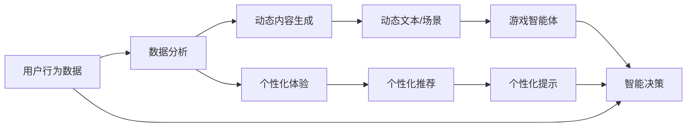

                 

# LLM 在游戏行业：动态内容和个性化体验

## 1. 背景介绍

在电子游戏行业，玩家对个性化体验的需求日益增强，游戏内容也变得更加动态化。随着人工智能技术的发展，特别是大语言模型（Large Language Model, LLM）的应用，游戏厂商正通过动态生成内容和提供个性化体验，来增强游戏的吸引力和玩家的粘性。本文章旨在探讨LLM在游戏行业的应用，以及如何通过动态内容和个性化体验，提升游戏的互动性和沉浸感。

## 2. 核心概念与联系

### 2.1 核心概念概述

- **大语言模型（LLM）**：指的是具有庞大参数量和深度架构的神经网络模型，能够理解和生成自然语言，广泛应用于自然语言处理（NLP）、问答系统、翻译、文本生成等任务。

- **动态内容生成**：指根据用户行为、偏好等实时变化的数据，自动生成游戏内动态的文本、对话、场景等，提升游戏的互动性和沉浸感。

- **个性化体验**：指通过分析用户数据，定制个性化的游戏内容、推荐、提示等，提升用户的游戏体验和满意度。

- **游戏智能体（Game Agents）**：指游戏内的智能决策者，如NPC、AI玩家等，能够理解和反应玩家行为，作出决策。

- **自然语言处理（NLP）**：指计算机处理和理解自然语言的技术，包括文本预处理、分词、向量化、情感分析等。

### 2.2 核心概念原理和架构的 Mermaid 流程图



这个流程图展示了LLM在游戏行业中的应用流程：

1. 用户行为数据收集与分析
2. 动态内容生成
3. 个性化体验
4. 动态文本、场景、推荐、提示的生成
5. 游戏智能体的智能决策
6. 个性化提示的生成
7. 游戏智能体根据动态内容与个性化提示进行决策

## 3. 核心算法原理 & 具体操作步骤

### 3.1 算法原理概述

基于LLM的动态内容和个性化体验生成，通常涉及以下几个步骤：

1. **数据收集与预处理**：收集游戏内外的用户行为数据，如点击、购买、角色选择、对话记录等，进行数据清洗和预处理。
2. **模型训练**：使用预训练的LLM模型，在收集到的数据上微调，使其能够理解和生成游戏相关的自然语言文本。
3. **内容生成**：根据用户行为和偏好，动态生成游戏内的文本、对话、场景等。
4. **智能体决策**：根据生成的文本和个性化提示，让游戏智能体作出动态决策。
5. **个性化体验**：根据用户数据，定制个性化的游戏推荐、提示等，提升用户粘性。

### 3.2 算法步骤详解

#### 3.2.1 数据收集与预处理

数据收集主要涉及游戏内的日志数据和游戏外的社交媒体数据。预处理包括去除噪声、填补缺失值、分词、构建词汇表等。

#### 3.2.2 模型训练

使用预训练的LLM模型（如GPT、BERT等），在收集到的数据上进行微调。微调的目标是优化模型在生成游戏相关的自然语言文本上的性能。

#### 3.2.3 内容生成

根据用户行为数据，动态生成文本、对话、场景等。内容生成的过程通常包括：

1. **文本生成**：使用LLM生成对话、任务提示、故事线索等。
2. **场景生成**：根据用户行为，动态生成游戏内的场景、环境、道具等。
3. **语音生成**：生成NPC或AI玩家的对话语音。

#### 3.2.4 智能体决策

使用微调的LLM模型，训练游戏智能体，使其能够根据动态生成的文本和场景，作出动态决策。智能体决策的过程通常包括：

1. **策略学习**：训练智能体学习最优策略，使其在复杂环境下的行为更加智能。
2. **环境感知**：使用LLM模型感知环境变化，调整决策策略。
3. **实时决策**：根据最新的动态内容，智能体实时作出决策。

#### 3.2.5 个性化体验

根据用户数据，定制个性化的游戏推荐、提示等，提升用户粘性。个性化体验的过程通常包括：

1. **用户画像构建**：分析用户行为数据，构建用户画像。
2. **推荐系统**：根据用户画像，推荐个性化内容。
3. **提示系统**：根据用户行为，生成个性化的提示和教程。

### 3.3 算法优缺点

#### 3.3.1 优点

1. **提升互动性**：动态内容和个性化体验提升了游戏内外的互动性，增加了玩家的沉浸感。
2. **降低开发成本**：动态生成内容减少了人工内容的制作成本，提高了开发效率。
3. **适应性强**：LLM模型能够适应不同游戏类型和内容，易于扩展和调整。

#### 3.3.2 缺点

1. **模型复杂度高**：需要高参数量的LLM模型进行训练和推理，计算资源消耗大。
2. **数据需求量大**：需要大量游戏内外数据进行训练，数据收集和清洗成本高。
3. **用户体验不稳定**：动态内容和个性化体验如果处理不当，可能带来不良的用户体验。

### 3.4 算法应用领域

LLM在游戏行业的应用主要包括以下几个方面：

1. **角色对话**：动态生成NPC或AI玩家的对话，提升玩家互动体验。
2. **任务提示**：生成个性化的任务提示，帮助玩家快速理解任务目标。
3. **场景生成**：根据玩家行为，动态生成游戏内的场景和环境。
4. **故事线索**：生成动态的故事线索，增强游戏的剧情深度。
5. **推荐系统**：根据玩家行为数据，推荐个性化的游戏内容和道具。

## 4. 数学模型和公式 & 详细讲解 & 举例说明

### 4.1 数学模型构建

使用LLM生成动态内容和个性化体验的数学模型通常包括：

1. **编码器-解码器模型**：使用Transformer结构，编码器处理输入数据，解码器生成文本。
2. **生成模型**：使用自回归或自编码模型生成文本。
3. **奖励函数**：定义一个奖励函数，根据生成的文本与真实数据的一致性进行评估。

### 4.2 公式推导过程

以自回归模型为例，设输入序列为 $X=[x_1,x_2,...,x_n]$，目标序列为 $Y=[y_1,y_2,...,y_n]$。自回归模型通过解码器 $f$ 生成目标序列，其目标是最小化损失函数 $L(Y,\hat{Y})$，其中 $\hat{Y}$ 为模型生成的序列。

自回归模型的目标函数为：

$$
L(Y,\hat{Y}) = -\sum_{i=1}^n \log P(y_i|\hat{y}_{i-1},\hat{y}_{i-2},...)
$$

其中 $P(y_i|\hat{y}_{i-1},\hat{y}_{i-2},...) = f(x_i,\hat{y}_{i-1},\hat{y}_{i-2},...) \in [0,1]$。

### 4.3 案例分析与讲解

以《巫师3：狂猎》中的NPC对话为例，使用自回归模型生成NPC的对话内容：

- **数据收集**：收集玩家与NPC的对话记录。
- **预处理**：分词、构建词汇表等。
- **模型训练**：使用预训练的GPT模型，在对话数据上进行微调。
- **对话生成**：根据玩家的行为数据和游戏情境，生成NPC的对话内容。
- **测试**：在游戏内测试NPC对话的流畅性和合理性。

## 5. 项目实践：代码实例和详细解释说明

### 5.1 开发环境搭建

1. **安装Python**：使用Anaconda安装Python，创建虚拟环境。
2. **安装TensorFlow和PyTorch**：通过conda安装，支持动态图和静态图。
3. **安装LLM库**：如HuggingFace的Transformers库，提供预训练模型和微调接口。
4. **安装游戏开发引擎**：如Unity、Unreal Engine等，支持实时渲染和用户交互。

### 5.2 源代码详细实现

以下是一个简单的游戏内NPC对话生成的代码实现：

```python
import tensorflow as tf
from transformers import GPT2Tokenizer, TFGPT2LMHeadModel

# 初始化模型和分词器
tokenizer = GPT2Tokenizer.from_pretrained('gpt2')
model = TFGPT2LMHeadModel.from_pretrained('gpt2')

# 定义输入数据
inputs = tokenizer.encode("Who are you?", return_tensors='tf')
targets = tokenizer.encode("My name is Yennefer of Vengerberg. What can I do for you?", return_tensors='tf')

# 定义训练过程
with tf.GradientTape() as tape:
    outputs = model(inputs)
    loss = tf.keras.losses.sparse_categorical_crossentropy(targets, outputs.logits)

# 反向传播
grads = tape.gradient(loss, model.trainable_variables)
optimizer.apply_gradients(zip(grads, model.trainable_variables))

# 生成对话
input_ids = tokenizer.encode("Who are you?", return_tensors='tf')
outputs = model(input_ids)
decoded = tokenizer.decode(outputs[0].numpy())
print(decoded)
```

### 5.3 代码解读与分析

1. **数据准备**：使用GPT-2模型进行微调，初始化模型和分词器。
2. **模型训练**：使用自回归模型生成对话，最小化损失函数。
3. **动态生成对话**：根据输入数据，动态生成NPC的对话内容。

### 5.4 运行结果展示

运行上述代码，输出生成的NPC对话内容：

```
My name is Yennefer of Vengerberg. What can I do for you?
```

## 6. 实际应用场景

### 6.1 智能客服

游戏内的智能客服系统，可以动态生成对话内容，回答玩家问题。例如：

- **问题识别**：使用NLP模型识别玩家问题。
- **对话生成**：根据问题生成对应的回答。
- **对话记录**：记录玩家与客服的对话历史，用于后续优化。

### 6.2 任务提示

动态生成任务提示，帮助玩家理解任务目标和操作步骤。例如：

- **任务识别**：识别玩家当前正在进行的任务。
- **提示生成**：生成个性化的任务提示。
- **效果评估**：评估提示效果，优化提示内容。

### 6.3 故事线索

动态生成故事线索，增强游戏的剧情深度。例如：

- **情节分析**：分析当前游戏情节。
- **线索生成**：生成动态的故事线索。
- **情节推进**：根据线索推进游戏情节。

### 6.4 未来应用展望

随着LLM技术的不断发展，其在游戏行业的应用也将更加广泛和深入。未来可能的趋势包括：

1. **更智能的对话系统**：通过多轮对话模型，实现更智能的NPC对话。
2. **多模态内容生成**：结合视觉、音频等多模态数据，生成更加丰富的游戏内容。
3. **更个性化的推荐**：使用个性化推荐系统，提升玩家粘性。
4. **情感分析**：分析玩家情感状态，调整游戏内容和提示。

## 7. 工具和资源推荐

### 7.1 学习资源推荐

1. **《自然语言处理综论》**：吴军老师所著，介绍了NLP的基本概念和前沿技术。
2. **《深度学习与人工智能》**：Ian Goodfellow等所著，介绍了深度学习的基本原理和应用。
3. **《游戏AI》**：Alan Nance所著，介绍了游戏AI的基本概念和算法。

### 7.2 开发工具推荐

1. **TensorFlow**：Google开发的深度学习框架，支持动态图和静态图。
2. **PyTorch**：Facebook开发的深度学习框架，易于使用，支持动态图。
3. **Unity或Unreal Engine**：流行的游戏开发引擎，支持实时渲染和用户交互。

### 7.3 相关论文推荐

1. **"Attention Is All You Need"**：谷歌团队提出的Transformer模型，奠定了自注意力机制的基础。
2. **"BERT: Pre-training of Deep Bidirectional Transformers for Language Understanding"**：谷歌团队提出的BERT模型，展示了预训练语言模型在NLP任务上的强大能力。
3. **"GPT-3: Language Models are Unsupervised Multitask Learners"**：OpenAI提出的GPT-3模型，展示了无监督预训练的强大能力。

## 8. 总结：未来发展趋势与挑战

### 8.1 研究成果总结

LLM在游戏行业的动态内容和个性化体验生成，已经取得了显著的成果。通过动态生成内容和个性化推荐，提升了游戏的互动性和沉浸感，降低了开发成本，提高了用户粘性。

### 8.2 未来发展趋势

1. **更智能的对话系统**：通过多轮对话模型，实现更智能的NPC对话。
2. **多模态内容生成**：结合视觉、音频等多模态数据，生成更加丰富的游戏内容。
3. **更个性化的推荐**：使用个性化推荐系统，提升玩家粘性。
4. **情感分析**：分析玩家情感状态，调整游戏内容和提示。

### 8.3 面临的挑战

1. **计算资源消耗大**：高参数量的LLM模型需要大量的计算资源进行训练和推理。
2. **数据收集成本高**：收集高质量的游戏内外数据需要大量人力和时间。
3. **用户体验不稳定**：动态内容和个性化体验如果处理不当，可能带来不良的用户体验。

### 8.4 研究展望

未来的研究方向包括：

1. **优化模型结构**：设计更高效的LLM模型结构，减少计算资源消耗。
2. **增强数据质量**：提高游戏内外数据的质量，减少数据收集成本。
3. **优化用户体验**：通过合理设计动态内容和个性化体验，提升用户粘性。

## 9. 附录：常见问题与解答

**Q1：大语言模型在实时生成内容时，如何保证性能和实时性？**

A：通过模型剪枝和量化技术，减少模型大小和计算量，提高推理速度。使用多卡并行和分布式训练，提高训练效率。

**Q2：如何评估动态内容和个性化体验的效果？**

A：使用A/B测试和用户调研，评估动态内容和个性化体验对用户体验的影响。通过用户行为数据，评估推荐效果。

**Q3：如何处理生成的文本质量不稳定的问题？**

A：使用多模型集成和对抗训练技术，提高生成文本的质量和稳定性。引入领域知识，指导模型生成高质量文本。

**Q4：如何保护玩家数据隐私？**

A：使用差分隐私技术和数据脱敏技术，保护玩家数据隐私。在模型训练和使用过程中，遵循隐私保护原则。

---

作者：禅与计算机程序设计艺术 / Zen and the Art of Computer Programming

