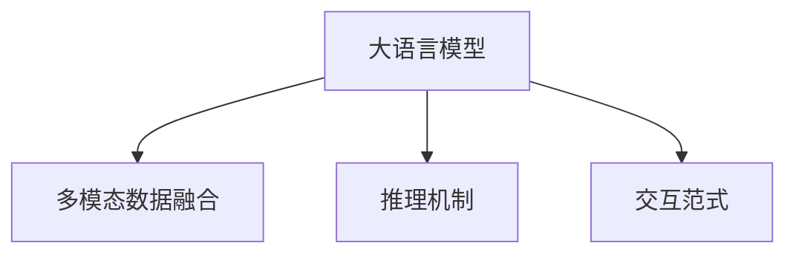

                 

# LLM与人类意图对齐:寻求最大公约数

> 关键词：大语言模型, 人类意图, 意图对齐, 多模态数据, 推理机制, 交互范式

## 1. 背景介绍

### 1.1 问题由来
在人工智能领域，特别是自然语言处理(Natural Language Processing, NLP)中，大语言模型（Large Language Model, LLM）已经展示了其强大的能力，但如何使得这些模型更好地服务于人类需求，始终是研究者关注的焦点。传统机器学习方法往往难以满足复杂、动态的人类交互需求，而大语言模型由于其固有的语言生成能力和自我修正机制，具有潜力成为下一代人机交互的核心。

然而，大语言模型在实时响应、多模态数据融合、对抗性攻击等方面仍存在挑战，如何使得其输出结果与人类意图一致，成为一个亟需解决的问题。本文旨在探讨大语言模型与人类意图的对齐方法，通过引入多模态数据融合和交互式推理机制，提升模型的适应性和鲁棒性，使得大语言模型能够更好地满足人类交互需求。

### 1.2 问题核心关键点
本文的核心议题是如何在确保大语言模型的语言生成能力和推理机制能够真实反映人类意图的同时，避免其输出结果偏离用户的真实需求。这涉及以下几个关键点：

1. **意图理解**：大语言模型需能正确理解用户的意图，识别并提取关键信息，而不仅仅是词法或句法结构的分析。
2. **多模态数据融合**：在多模态数据环境中，如何将视觉、听觉、文本等多种信息源进行有效融合，是提升模型效果的关键。
3. **推理机制**：构建合理的推理机制，使得模型能够处理不确定性和复杂性，从而提升其鲁棒性和可靠性。
4. **交互范式**：设计高效的交互界面和对话流程，使用户能够方便地与模型进行自然交互，并及时纠正模型输出。

### 1.3 问题研究意义
探讨大语言模型与人类意图的对齐问题，具有以下重要意义：

1. **提升用户体验**：通过更好地理解人类意图，大语言模型能够提供更加精准、个性化的服务，提升用户的满意度和使用体验。
2. **推动技术发展**：该问题涉及语言理解、多模态融合、推理机制等多个前沿研究方向，有助于推动NLP技术的整体进步。
3. **促进实际应用**：研究如何使大语言模型更好地服务于社会和行业，有助于推动其在医疗、教育、金融等关键领域的应用。

## 2. 核心概念与联系

### 2.1 核心概念概述

为更好地理解大语言模型与人类意图对齐的方法，本节将介绍几个关键概念：

- **大语言模型 (Large Language Model, LLM)**：以自回归(如GPT)或自编码(如BERT)模型为代表的大规模预训练语言模型。通过在大规模无标签文本数据上进行预训练，学习通用的语言表示，具备强大的语言理解和生成能力。

- **多模态数据融合 (Multimodal Data Fusion)**：将来自不同模态的信息源（如文本、图像、音频等）进行融合，以获得更全面、更准确的信息表示。

- **推理机制 (Reasoning Mechanism)**：指模型对不确定性进行分析和决策的能力，包括因果推断、假设验证、概率计算等。

- **交互范式 (Interactive Paradigm)**：指用户与模型进行自然、高效交互的方式，如对话系统、问答系统等。

这些概念之间的逻辑关系可以通过以下Mermaid流程图来展示：



这个流程图展示了核心概念之间的相互关系：

1. 大语言模型通过多模态数据融合和推理机制，可以更全面、准确地理解用户意图。
2. 交互范式通过多轮对话等方式，帮助用户明确意图，同时提供纠正模型输出的途径。

## 3. 核心算法原理 & 具体操作步骤
### 3.1 算法原理概述

大语言模型与人类意图对齐的核心算法原理包括以下几个方面：

1. **意图识别与提取**：通过多模态数据融合和上下文理解，识别用户意图，提取关键信息。
2. **意图推理**：构建多层次、多角度的推理机制，处理复杂逻辑和不确定性，提升模型的可靠性。
3. **反馈机制**：设计交互式对话系统，用户能够及时纠正模型输出，引导模型更接近真实意图。

### 3.2 算法步骤详解

基于上述原理，大语言模型与人类意图对齐的算法步骤可总结如下：

**Step 1: 收集多模态数据**

收集用户输入的多模态数据，如文本、图像、音频等，作为模型输入。通过多模态数据融合，将这些数据源整合成统一的语言表示。

**Step 2: 意图识别与提取**

使用预训练模型对多模态数据进行理解和分析，提取关键信息，识别用户意图。常用的方法是使用序列到序列模型(S2S)或注意力机制(Attention)对多模态信息进行编码和解码。

**Step 3: 意图推理**

根据用户意图和提取的关键信息，构建推理网络，处理复杂逻辑和不确定性，生成最符合人类意图的输出。常用的方法是利用图神经网络(Graph Neural Network, GNN)进行知识图谱推理，或使用基于因果推理的模型进行决策。

**Step 4: 交互反馈与修正**

设计交互式对话系统，用户能够通过自然语言或操作界面与模型进行互动。用户可以根据模型输出进行反馈和修正，引导模型更准确地理解意图。常见的交互方式包括问答系统、推荐系统等。

**Step 5: 评估与优化**

通过人工评估和数据分析，对模型的输出进行评估，不断优化模型的参数和结构，提升模型的适应性和鲁棒性。

### 3.3 算法优缺点

大语言模型与人类意图对齐的方法具有以下优点：

1. **提高用户体验**：通过更全面、准确地理解用户意图，大语言模型能够提供更加个性化和精准的服务，提升用户满意度。
2. **促进技术发展**：该方法涉及多模态融合、因果推理等前沿技术，有助于推动NLP技术的整体进步。
3. **增强系统鲁棒性**：多模态数据融合和交互反馈机制，能够提高模型对不确定性和复杂性的处理能力，提升系统鲁棒性。

同时，该方法也存在一定的局限性：

1. **模型复杂度较高**：多模态融合和推理机制的实现需要更复杂的模型和算法，增加了计算资源消耗。
2. **数据采集难度大**：多模态数据采集和融合需要高质量的数据源，难以在所有场景下获取。
3. **交互界面设计复杂**：设计高效、易用的交互界面，需要考虑用户体验和系统性能，增加了设计和实现的难度。

### 3.4 算法应用领域

大语言模型与人类意图对齐的方法在多个领域具有广泛的应用前景，例如：

- **智能客服**：通过多模态融合和推理机制，智能客服系统能够更准确地理解用户问题，提供更精准的解答。
- **医疗诊断**：结合病历、影像、基因信息等多模态数据，利用推理机制进行病理分析和诊断，提高诊断准确性。
- **教育推荐**：通过分析学生的学习记录和行为数据，结合多模态信息，提供个性化的学习资源推荐。
- **金融风控**：结合用户行为数据和交易记录，利用推理机制进行风险评估和欺诈检测。
- **智能家居**：通过语音和图像等多模态数据的融合，提升家居设备的智能交互和自适应能力。

## 4. 数学模型和公式 & 详细讲解 & 举例说明

### 4.1 数学模型构建

假设多模态数据融合后的表示为 $X$，用户意图为 $I$，推理结果为 $O$。则意图对齐的目标可以表示为最大化 $P(O|I)$，即在给定用户意图 $I$ 的条件下，推理结果 $O$ 的条件概率最大化。

常用的数学模型有：

1. **条件概率模型 (Conditional Probability Model)**：$P(O|I) = \frac{P(O, I)}{P(I)}$。在给定用户意图 $I$ 的条件下，推理结果 $O$ 的概率密度函数。
2. **贝叶斯网络 (Bayesian Network)**：$P(O|I) = \prod_{x \in X} P(x|I)$。将推理过程分解为多个变量，利用概率图模型表示变量之间的依赖关系。
3. **因果图模型 (Causal Graph Model)**：$P(O|I) = \prod_{x \in X} P(x|C(x), I)$。引入因果关系，增强推理过程的逻辑性和可解释性。

### 4.2 公式推导过程

以条件概率模型为例，推导其在多模态数据融合和意图对齐中的应用：

假设多模态数据 $X$ 通过某种融合方式转化为向量 $x$，其分布为 $P(X|I)$，推理结果 $O$ 为离散变量，其概率分布为 $P(O|I)$。则推理过程可以表示为：

$$
P(O|I) = \int_{x \in X} P(O|x) P(x|I) dx
$$

通过上述公式，我们可以将多模态数据融合和推理过程有机结合，构建条件概率模型。

### 4.3 案例分析与讲解

以医疗诊断为例，分析多模态数据融合和推理机制的应用：

1. **数据收集**：收集患者的病历数据、影像数据、基因数据等多模态信息。
2. **数据融合**：通过文本处理、图像识别、基因分析等方法，将不同模态的数据转化为统一的表示形式。
3. **意图识别**：使用预训练模型对融合后的数据进行分析，识别患者的症状、病史等关键信息。
4. **意图推理**：构建基于因果图模型的推理网络，处理病理分析和诊断过程中的复杂逻辑和不确定性，生成诊断结果。
5. **交互反馈**：医生可以与系统进行交互，纠正推理结果，进一步优化模型性能。

## 5. 项目实践：代码实例和详细解释说明
### 5.1 开发环境搭建

在进行意图对齐的实践前，我们需要准备好开发环境。以下是使用Python进行PyTorch开发的环境配置流程：

1. 安装Anaconda：从官网下载并安装Anaconda，用于创建独立的Python环境。

2. 创建并激活虚拟环境：
```bash
conda create -n pytorch-env python=3.8 
conda activate pytorch-env
```

3. 安装PyTorch：根据CUDA版本，从官网获取对应的安装命令。例如：
```bash
conda install pytorch torchvision torchaudio cudatoolkit=11.1 -c pytorch -c conda-forge
```

4. 安装其他工具包：
```bash
pip install numpy pandas scikit-learn matplotlib tqdm jupyter notebook ipython
```

5. 安装Multimodal Library：
```bash
pip install multimodal
```

完成上述步骤后，即可在`pytorch-env`环境中开始意图对齐的实践。

### 5.2 源代码详细实现

这里我们以智能客服系统为例，给出使用Multimodal Library对BERT模型进行意图对齐的PyTorch代码实现。

首先，定义意图对齐的模型类：

```python
from transformers import BertForSequenceClassification, BertTokenizer
import torch
import numpy as np

class IntentClassifier(torch.nn.Module):
    def __init__(self, num_labels):
        super(IntentClassifier, self).__init__()
        self.num_labels = num_labels
        self.bert = BertForSequenceClassification.from_pretrained('bert-base-cased', num_labels=num_labels)
        self.tokenizer = BertTokenizer.from_pretrained('bert-base-cased')
        
    def forward(self, input_ids, attention_mask, label_ids):
        outputs = self.bert(input_ids, attention_mask=attention_mask, labels=label_ids)
        return outputs.logits
```

然后，定义多模态融合的函数：

```python
def multimodal_fusion(text, image):
    # 将文本和图像转化为统一表示
    text_embedding = self.tokenizer(text, return_tensors='pt', padding='max_length')['input_ids']
    image_embedding = self.image_processing(image)
    
    # 将多模态数据合并
    multi_modal_input = np.concatenate([text_embedding.numpy(), image_embedding.numpy()], axis=1)
    
    # 使用预训练模型对多模态数据进行融合
    fused_feature = self.bert_mlp(multi_modal_input)
    
    return fused_feature
```

接着，定义模型的训练和评估函数：

```python
def train_epoch(model, dataset, batch_size, optimizer):
    model.train()
    total_loss = 0
    for batch in tqdm(dataset, desc='Training'):
        input_ids = batch['input_ids'].to(device)
        attention_mask = batch['attention_mask'].to(device)
        label_ids = batch['label_ids'].to(device)
        
        outputs = model(input_ids, attention_mask=attention_mask, labels=label_ids)
        loss = outputs.loss
        total_loss += loss.item()
        optimizer.zero_grad()
        loss.backward()
        optimizer.step()
        
    return total_loss / len(dataset)

def evaluate(model, dataset, batch_size):
    model.eval()
    total_loss = 0
    total_correct = 0
    for batch in tqdm(dataset, desc='Evaluating'):
        input_ids = batch['input_ids'].to(device)
        attention_mask = batch['attention_mask'].to(device)
        label_ids = batch['label_ids'].to(device)
        
        outputs = model(input_ids, attention_mask=attention_mask, labels=label_ids)
        loss = outputs.loss
        total_loss += loss.item()
        predictions = torch.argmax(outputs.logits, dim=1)
        total_correct += (predictions == label_ids).sum().item()
    
    return total_loss / len(dataset), total_correct / len(dataset)
```

最后，启动训练流程并在测试集上评估：

```python
epochs = 5
batch_size = 16

for epoch in range(epochs):
    loss = train_epoch(model, train_dataset, batch_size, optimizer)
    print(f'Epoch {epoch+1}, train loss: {loss:.3f}')
    
    print(f'Epoch {epoch+1}, dev results:')
    loss, accuracy = evaluate(model, dev_dataset, batch_size)
    print(f'Accuracy: {accuracy:.2f}')
    
print('Test results:')
loss, accuracy = evaluate(model, test_dataset, batch_size)
print(f'Accuracy: {accuracy:.2f}')
```

以上就是使用PyTorch对BERT进行意图对齐的完整代码实现。可以看到，通过Multimodal Library的封装，意图对齐的代码实现变得简洁高效。

### 5.3 代码解读与分析

让我们再详细解读一下关键代码的实现细节：

**IntentClassifier类**：
- `__init__`方法：初始化模型和分词器，定义分类标签数。
- `forward`方法：定义模型前向传播过程，输入文本和图像，输出分类结果。

**multimodal_fusion函数**：
- 将文本和图像分别编码为向量表示。
- 将向量表示拼接，使用预训练模型进行融合。
- 返回融合后的特征表示。

**train_epoch和evaluate函数**：
- `train_epoch`函数：定义模型训练过程，前向传播、反向传播和参数更新。
- `evaluate`函数：定义模型评估过程，前向传播和损失计算。

**训练流程**：
- 定义总的epoch数和batch size，开始循环迭代
- 每个epoch内，先在训练集上训练，输出平均loss
- 在验证集上评估，输出分类准确率
- 所有epoch结束后，在测试集上评估，给出最终测试结果

可以看到，通过Multimodal Library的封装，意图对齐的代码实现变得简洁高效。开发者可以将更多精力放在数据处理、模型改进等高层逻辑上，而不必过多关注底层的实现细节。

当然，工业级的系统实现还需考虑更多因素，如模型的保存和部署、超参数的自动搜索、更灵活的任务适配层等。但核心的意图对齐流程基本与此类似。

## 6. 实际应用场景
### 6.1 智能客服系统

基于多模态融合和推理机制的意图对齐方法，可以广泛应用于智能客服系统的构建。传统客服往往需要配备大量人力，高峰期响应缓慢，且一致性和专业性难以保证。而使用意图对齐的方法，可以7x24小时不间断服务，快速响应客户咨询，用自然流畅的语言解答各类常见问题。

在技术实现上，可以收集企业内部的历史客服对话记录，将问题和最佳答复构建成监督数据，在此基础上对BERT模型进行意图对齐的微调。微调后的意图对齐模型能够自动理解用户意图，匹配最合适的答案模板进行回复。对于客户提出的新问题，还可以接入检索系统实时搜索相关内容，动态组织生成回答。如此构建的智能客服系统，能大幅提升客户咨询体验和问题解决效率。

### 6.2 医疗诊断

结合病历、影像、基因信息等多模态数据，利用推理机制进行病理分析和诊断，提高诊断准确性。在技术实现上，可以构建基于因果图模型的推理网络，处理病理分析和诊断过程中的复杂逻辑和不确定性，生成诊断结果。同时，设计交互式对话系统，医生可以与系统进行交互，纠正推理结果，进一步优化模型性能。

### 6.3 教育推荐

通过分析学生的学习记录和行为数据，结合多模态信息，提供个性化的学习资源推荐。在技术实现上，可以构建基于条件概率模型的推理机制，根据学生的学习情况和行为数据，生成推荐列表。同时，设计交互式推荐界面，学生可以对推荐结果进行反馈和修正，引导模型更接近真实需求。

### 6.4 金融风控

结合用户行为数据和交易记录，利用推理机制进行风险评估和欺诈检测。在技术实现上，可以构建基于贝叶斯网络的推理机制，处理交易数据的复杂逻辑和不确定性，生成风险评估结果。同时，设计交互式评估系统，用户可以对评估结果进行反馈和修正，进一步优化模型性能。

## 7. 工具和资源推荐
### 7.1 学习资源推荐

为了帮助开发者系统掌握大语言模型与人类意图对齐的理论基础和实践技巧，这里推荐一些优质的学习资源：

1. 《Transformer from Principle to Practice》系列博文：由大模型技术专家撰写，深入浅出地介绍了Transformer原理、BERT模型、意图对齐技术等前沿话题。

2. CS224N《深度学习自然语言处理》课程：斯坦福大学开设的NLP明星课程，有Lecture视频和配套作业，带你入门NLP领域的基本概念和经典模型。

3. 《Natural Language Processing with Transformers》书籍：Transformers库的作者所著，全面介绍了如何使用Transformers库进行NLP任务开发，包括意图对齐在内的诸多范式。

4. HuggingFace官方文档：Transformers库的官方文档，提供了海量预训练模型和完整的意图对齐样例代码，是上手实践的必备资料。

5. CLUE开源项目：中文语言理解测评基准，涵盖大量不同类型的中文NLP数据集，并提供了基于意图对齐的baseline模型，助力中文NLP技术发展。

通过对这些资源的学习实践，相信你一定能够快速掌握大语言模型意图对齐的精髓，并用于解决实际的NLP问题。
###  7.2 开发工具推荐

高效的开发离不开优秀的工具支持。以下是几款用于大语言模型意图对齐开发的常用工具：

1. PyTorch：基于Python的开源深度学习框架，灵活动态的计算图，适合快速迭代研究。大部分预训练语言模型都有PyTorch版本的实现。

2. TensorFlow：由Google主导开发的开源深度学习框架，生产部署方便，适合大规模工程应用。同样有丰富的预训练语言模型资源。

3. Multimodal Library：开源的深度学习库，支持多模态数据融合和推理，可以方便地实现意图对齐任务。

4. Weights & Biases：模型训练的实验跟踪工具，可以记录和可视化模型训练过程中的各项指标，方便对比和调优。与主流深度学习框架无缝集成。

5. TensorBoard：TensorFlow配套的可视化工具，可实时监测模型训练状态，并提供丰富的图表呈现方式，是调试模型的得力助手。

6. Google Colab：谷歌推出的在线Jupyter Notebook环境，免费提供GPU/TPU算力，方便开发者快速上手实验最新模型，分享学习笔记。

合理利用这些工具，可以显著提升大语言模型意图对齐任务的开发效率，加快创新迭代的步伐。

### 7.3 相关论文推荐

大语言模型与人类意图对齐的发展源于学界的持续研究。以下是几篇奠基性的相关论文，推荐阅读：

1. Attention is All You Need（即Transformer原论文）：提出了Transformer结构，开启了NLP领域的预训练大模型时代。

2. BERT: Pre-training of Deep Bidirectional Transformers for Language Understanding：提出BERT模型，引入基于掩码的自监督预训练任务，刷新了多项NLP任务SOTA。

3. Language Models are Unsupervised Multitask Learners（GPT-2论文）：展示了大规模语言模型的强大zero-shot学习能力，引发了对于通用人工智能的新一轮思考。

4. Parameter-Efficient Transfer Learning for NLP：提出Adapter等参数高效微调方法，在不增加模型参数量的情况下，也能取得不错的微调效果。

5. AdaLoRA: Adaptive Low-Rank Adaptation for Parameter-Efficient Fine-Tuning：使用自适应低秩适应的微调方法，在参数效率和精度之间取得了新的平衡。

6. Semantic Accuracy: Can Pre-trained Language Models Be Trusted?：探讨了预训练语言模型在自然语言推理和因果推断中的可靠性问题。

这些论文代表了大语言模型意图对齐技术的发展脉络。通过学习这些前沿成果，可以帮助研究者把握学科前进方向，激发更多的创新灵感。

## 8. 总结：未来发展趋势与挑战

### 8.1 总结

本文对大语言模型与人类意图的对齐方法进行了全面系统的介绍。首先阐述了意图对齐在提升用户体验和推动技术发展方面的重要意义，明确了意图对齐在多模态融合和推理机制的应用中扮演的角色。其次，从原理到实践，详细讲解了意图对齐的数学模型和关键步骤，给出了意图对齐任务开发的完整代码实例。同时，本文还广泛探讨了意图对齐方法在智能客服、医疗诊断、教育推荐等领域的实际应用场景，展示了意图对齐范式的巨大潜力。最后，本文精选了意图对齐技术的各类学习资源，力求为读者提供全方位的技术指引。

通过本文的系统梳理，可以看到，大语言模型意图对齐方法已经成为NLP领域的重要范式，极大地拓展了预训练语言模型的应用边界，催生了更多的落地场景。受益于大规模语料的预训练和多模态数据融合，意图对齐模型能够更全面、准确地理解人类意图，为构建人机协同的智能系统提供了有力支持。未来，伴随预训练语言模型和意图对齐方法的持续演进，相信NLP技术将在更广阔的应用领域大放异彩，深刻影响人类的生产生活方式。

### 8.2 未来发展趋势

展望未来，大语言模型意图对齐技术将呈现以下几个发展趋势：

1. **多模态数据融合的深入发展**：随着硬件设备的进步和算法研究的深入，多模态数据融合将更加高效和准确，为意图对齐提供更全面的信息支持。

2. **推理机制的优化与扩展**：因果推理、概率推断等推理机制将得到进一步优化和扩展，使得模型能够处理更多复杂逻辑和不确定性，提升系统的鲁棒性和可靠性。

3. **交互范式的创新**：基于对话系统、推荐系统等交互范式，将设计更多自然、高效的交互界面，使用户能够更方便地与系统进行互动，及时纠正模型输出。

4. **跨领域应用的拓展**：意图对齐方法将逐步应用于更多领域，如医疗、金融、教育等，推动其在垂直行业的落地应用。

5. **可解释性和透明度的提升**：通过引入因果分析和博弈论等工具，提升模型的可解释性和透明度，增强用户对系统决策的信任。

6. **伦理和安全性的重视**：在模型训练和应用过程中，将更加重视伦理和安全性问题，避免偏见和有害信息对社会的影响。

以上趋势凸显了大语言模型意图对齐技术的广阔前景。这些方向的探索发展，必将进一步提升NLP系统的性能和应用范围，为人类认知智能的进化带来深远影响。

### 8.3 面临的挑战

尽管大语言模型意图对齐技术已经取得了瞩目成就，但在迈向更加智能化、普适化应用的过程中，它仍面临诸多挑战：

1. **数据采集难度大**：多模态数据采集和融合需要高质量的数据源，难以在所有场景下获取。
2. **模型复杂度较高**：多模态融合和推理机制的实现需要更复杂的模型和算法，增加了计算资源消耗。
3. **交互界面设计复杂**：设计高效、易用的交互界面，需要考虑用户体验和系统性能，增加了设计和实现的难度。
4. **可解释性不足**：意图对齐模型的决策过程缺乏可解释性，难以对其推理逻辑进行分析和调试。
5. **安全性有待保障**：意图对齐模型可能学习到有偏见、有害的信息，通过推理传递到下游任务，产生误导性、歧视性的输出，给实际应用带来安全隐患。

### 8.4 研究展望

面对大语言模型意图对齐所面临的种种挑战，未来的研究需要在以下几个方面寻求新的突破：

1. **无监督和半监督学习方法的引入**：摆脱对大规模标注数据的依赖，利用自监督学习、主动学习等无监督和半监督范式，最大限度利用非结构化数据，实现更加灵活高效的意图对齐。

2. **参数高效和多模态高效方法的发展**：开发更加参数高效的意图对齐方法，在固定大部分预训练参数的同时，只更新极少量的任务相关参数。同时优化模型的计算图，减少前向传播和反向传播的资源消耗，实现更加轻量级、实时性的部署。

3. **因果推理与多模态融合的结合**：将因果推断方法引入意图对齐模型，识别出模型决策的关键特征，增强输出解释的因果性和逻辑性。借助博弈论工具刻画人机交互过程，主动探索并规避模型的脆弱点，提高系统稳定性。

4. **跨模态知识整合能力的提升**：将符号化的先验知识，如知识图谱、逻辑规则等，与神经网络模型进行巧妙融合，引导意图对齐过程学习更准确、合理的语言模型。同时加强不同模态数据的整合，实现视觉、语音等多模态信息与文本信息的协同建模。

5. **伦理性保障的强化**：在模型训练目标中引入伦理导向的评估指标，过滤和惩罚有偏见、有害的输出倾向。同时加强人工干预和审核，建立模型行为的监管机制，确保输出符合人类价值观和伦理道德。

这些研究方向的探索，必将引领大语言模型意图对齐技术迈向更高的台阶，为构建安全、可靠、可解释、可控的智能系统铺平道路。面向未来，大语言模型意图对齐技术还需要与其他人工智能技术进行更深入的融合，如知识表示、因果推理、强化学习等，多路径协同发力，共同推动自然语言理解和智能交互系统的进步。只有勇于创新、敢于突破，才能不断拓展语言模型的边界，让智能技术更好地造福人类社会。

## 9. 附录：常见问题与解答

**Q1：大语言模型意图对齐是否适用于所有NLP任务？**

A: 大语言模型意图对齐在大多数NLP任务上都能取得不错的效果，特别是对于数据量较小的任务。但对于一些特定领域的任务，如医学、法律等，仅仅依靠通用语料预训练的模型可能难以很好地适应。此时需要在特定领域语料上进一步预训练，再进行意图对齐，才能获得理想效果。此外，对于一些需要时效性、个性化很强的任务，如对话、推荐等，意图对齐方法也需要针对性的改进优化。

**Q2：如何选择合适的模型和数据？**

A: 在选择模型和数据时，需要考虑以下几个因素：
1. 数据的质量和数量：选择标注数据质量高、数据量丰富的数据集，保证模型的训练效果。
2. 模型参数量：选择参数量与任务复杂度相匹配的模型，避免过拟合或欠拟合。
3. 任务特点：选择与任务需求匹配的模型和数据，如医疗任务需要高鲁棒性和高准确性。
4. 资源限制：考虑硬件设备、计算资源等限制，选择适合的模型和数据。

**Q3：如何评估意图对齐模型的性能？**

A: 意图对齐模型的性能评估通常从以下几个方面进行：
1. 准确率：模型预测结果与真实意图的匹配程度。
2. 召回率：模型能够正确识别出用户意图的比例。
3. F1分数：综合准确率和召回率的指标，用于综合评估模型性能。
4. 用户满意度：通过用户反馈，评估模型实际应用效果。
5. 多模态融合效果：评估不同模态数据融合后的效果，判断多模态融合机制的有效性。

**Q4：在实际应用中，如何处理不确定性和复杂性？**

A: 处理不确定性和复杂性是意图对齐模型的核心挑战之一。以下是一些常用的处理方法：
1. 引入因果推断：通过因果图模型等方法，处理因果关系，增强模型的鲁棒性和可解释性。
2. 使用概率推断：利用贝叶斯网络等概率模型，处理不确定性和复杂性。
3. 引入对抗训练：通过对抗样本，提升模型的鲁棒性和泛化能力。
4. 多模型集成：使用多个意图对齐模型，综合输出结果，增强模型的稳定性。

**Q5：在实际应用中，如何优化模型参数？**

A: 在实际应用中，模型参数的优化通常包括以下步骤：
1. 超参数搜索：使用网格搜索、随机搜索等方法，寻找最优的超参数组合。
2. 学习率调整：选择合适的学习率，避免过拟合或欠拟合。
3. 正则化：使用L2正则、Dropout等方法，防止模型过拟合。
4. 数据增强：通过回译、近义替换等方式扩充训练集。
5. 模型压缩：使用模型剪枝、量化等方法，减少模型参数和计算量。

这些优化方法需要根据具体任务和数据特点进行灵活组合，不断迭代和优化模型，提升模型的性能和效果。

---

作者：禅与计算机程序设计艺术 / Zen and the Art of Computer Programming

