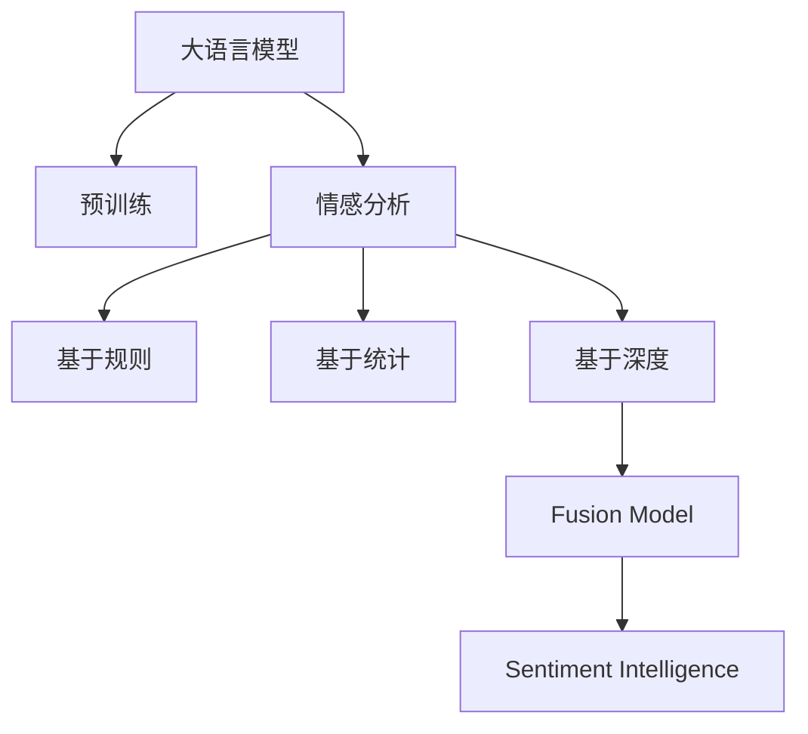

                 

# LLM与传统情感分析技术的融合：情感智能新高度

> 关键词：
1. 情感分析 (Sentiment Analysis)
2. 语言模型 (Language Models)
3. 深度学习 (Deep Learning)
4. 自然语言处理 (Natural Language Processing)
5. 情感智能 (Sentiment Intelligence)
6. 数据融合 (Data Fusion)
7. 融合模型 (Fusion Model)

## 1. 背景介绍

在人工智能的迅猛发展下，自然语言处理（NLP）成为了推动信息科技发展的重要引擎之一。情感分析作为NLP的重要分支，致力于从文本中抽取情感信息，为舆情监测、用户反馈分析、品牌管理等众多领域提供决策支持。然而，传统的基于规则或统计的情感分析方法，存在知识获取困难、泛化能力不足、对新领域适应性差等缺陷。

近年来，大语言模型（Large Language Models, LLMs）如BERT、GPT等，以其强大的语言理解和生成能力，在NLP领域取得了巨大突破。通过在大规模无标签文本上预训练，这些模型学习到了丰富的语言知识和语义结构，能够实现更精准、更高效的情感分析。大语言模型与传统情感分析技术的融合，不仅能够提升情感识别的准确性，还能扩展情感分析的应用场景，推动情感智能的发展。

## 2. 核心概念与联系

### 2.1 核心概念概述

为更好地理解LLM与传统情感分析技术的融合，本节将介绍几个核心概念及其相互联系：

- **大语言模型 (LLMs)**：以自回归（如GPT）或自编码（如BERT）模型为代表的大规模预训练语言模型。通过在大规模无标签文本语料上进行预训练，学习通用的语言表示，具备强大的语言理解和生成能力。

- **预训练 (Pre-training)**：指在大规模无标签文本语料上，通过自监督学习任务训练通用语言模型的过程。常见的预训练任务包括言语建模、遮挡语言模型等。

- **情感分析 (Sentiment Analysis)**：通过分析文本中的情感词汇、情感模式等，判断文本的情感倾向。传统方法多基于词典、规则或分类器，存在知识获取困难、泛化能力不足等问题。

- **深度学习 (Deep Learning)**：一种基于人工神经网络的学习方法，能够处理复杂非线性问题，是实现大语言模型预训练和微调的基础。

- **自然语言处理 (NLP)**：研究如何让计算机理解和处理自然语言的技术，涉及词法分析、句法分析、语义分析、情感分析等多个方向。

- **情感智能 (Sentiment Intelligence)**：通过分析情感信息，为决策制定、舆情监控、用户体验优化等提供支持。

- **融合模型 (Fusion Model)**：将多种技术和模型进行有机结合，形成更高效、更精准的情感智能系统。

这些核心概念之间的逻辑关系可以通过以下Mermaid流程图来展示：



这个流程图展示了大语言模型与传统情感分析技术之间的联系及其融合趋势：

1. 大语言模型通过预训练获得基础能力。
2. 情感分析方法通过规则、统计和深度学习技术，实现文本情感的识别和分析。
3. 基于深度学习的情感分析方法，能够学习到更为复杂的语言模式和情感表达。
4. 融合模型将大语言模型的预训练能力与情感分析方法相结合，形成更加精准、高效的情感智能系统。

## 3. 核心算法原理 & 具体操作步骤
### 3.1 算法原理概述

LLM与传统情感分析技术的融合，本质上是利用LLM的强大语言理解能力，提升情感分析的准确性和泛化能力。其核心思想是：在LLM的预训练过程中，加入情感相关的训练任务，如情感词汇标注、情感分类、情感生成等，从而在LLM中编码情感信息。在情感分析任务中，利用LLM输出的情感编码，进一步优化传统情感分析方法。

### 3.2 算法步骤详解

基于LLM与传统情感分析技术的融合，情感智能系统的一般流程如下：

**Step 1: 准备情感数据集和预训练模型**
- 收集情感分析任务的相关标注数据集，如电影评论、社交媒体帖子、产品评论等。
- 选择合适的预训练语言模型，如BERT、GPT-3等。

**Step 2: 添加情感相关的预训练任务**
- 在预训练过程中，加入情感相关的任务，如情感分类、情感生成等。
- 使用情感数据集进行有监督的情感相关任务训练，优化预训练模型。

**Step 3: 构建情感分析模型**
- 根据任务类型，选择合适的情感分析方法，如基于词典的情感分析、基于统计的情感分析、基于深度学习的情感分析等。
- 利用预训练模型提取的情感编码，改进传统情感分析模型。

**Step 4: 训练和优化模型**
- 将预训练模型输出的情感编码作为特征，输入到情感分析模型进行训练。
- 使用标注数据集进行有监督训练，最小化模型与真实标签的差异。
- 应用正则化技术，如L2正则、Dropout、Early Stopping等，防止模型过拟合。

**Step 5: 评估和部署**
- 在测试集上评估情感分析模型的性能，对比传统方法与融合方法的效果。
- 将优化后的情感分析模型集成到实际应用系统中，如舆情监控、品牌管理、用户反馈分析等。
- 持续收集新的数据，定期重新微调和训练模型，以适应数据分布的变化。

### 3.3 算法优缺点

基于LLM与传统情感分析技术的融合，具有以下优点：

1. 提升情感分析的准确性。LLM能够学习到更全面的语言知识和情感模式，提升情感识别的准确性和鲁棒性。
2. 增强泛化能力。LLM的预训练过程在大规模语料上进行，使其具备更强的泛化能力，适应新领域和新任务。
3. 优化传统方法。通过融合LLM的情感编码，改进传统情感分析方法，提升其性能。

同时，该方法也存在一定的局限性：

1. 数据质量要求高。融合方法的效果很大程度上取决于情感标注数据的质量，获取高质量情感标注数据的成本较高。
2. 模型复杂度增加。融合模型通常比单独使用LLM或传统方法的模型复杂度更高，需要更多的计算资源和存储空间。
3. 解释性不足。融合模型内部的决策过程难以解释，难以对其推理逻辑进行分析和调试。
4. 可能引入噪声。预训练模型中可能存在偏见和有害信息，这些信息在融合过程中可能被引入，影响模型性能。

尽管存在这些局限性，但就目前而言，基于LLM与传统情感分析技术的融合方法在情感智能领域仍是一种有效范式。未来相关研究的重点在于如何进一步降低情感分析对标注数据的依赖，提高模型的泛化能力和解释性，同时兼顾性能和成本等因素。

### 3.4 算法应用领域

基于LLM与传统情感分析技术的融合，已经在舆情监控、品牌管理、用户反馈分析等多个领域得到了应用，为相关业务提供了强大的情感分析支持。

- **舆情监控**：利用情感智能系统，实时监测网络舆情，分析情感趋势，为政府和企业提供决策支持。
- **品牌管理**：通过情感分析，评估消费者对品牌的情感倾向，及时调整营销策略，提升品牌形象和市场份额。
- **用户反馈分析**：分析用户对产品、服务的情感反馈，优化产品设计和用户体验，提升用户满意度。
- **社交媒体分析**：从社交媒体数据中提取情感信息，了解用户情绪变化，为产品迭代和市场定位提供参考。
- **医疗健康**：通过情感智能系统，监测患者的情感状态，评估治疗效果，提升医疗服务的质量。

除了上述这些应用外，融合LLM与传统情感分析技术，还在智能客服、智能推荐、金融分析等领域有着广泛的应用前景，推动情感智能技术的发展和应用。

## 4. 数学模型和公式 & 详细讲解 & 举例说明
### 4.1 数学模型构建

本节将使用数学语言对基于LLM与传统情感分析技术融合的情感智能系统进行更加严格的刻画。

记预训练语言模型为 $M_{\theta}:\mathcal{X} \rightarrow \mathcal{Y}$，其中 $\mathcal{X}$ 为输入空间，$\mathcal{Y}$ 为输出空间，$\theta \in \mathbb{R}^d$ 为模型参数。假设情感分析任务的数据集为 $D=\{(x_i,y_i)\}_{i=1}^N, x_i \in \mathcal{X}, y_i \in \{0,1\}$，其中 $y_i$ 表示文本的情感标签。

定义模型 $M_{\theta}$ 在输入 $x$ 上的输出为 $\hat{y}=M_{\theta}(x) \in [0,1]$，表示模型预测情感的置信度。则在数据集 $D$ 上的经验风险为：

$$
\mathcal{L}(\theta) = -\frac{1}{N}\sum_{i=1}^N y_i \log \hat{y}
$$

其中 $y_i$ 为情感标签，$\hat{y}$ 为模型预测的情感置信度。

通过梯度下降等优化算法，最小化经验风险，得到最优模型参数 $\theta^*$：

$$
\theta^* = \mathop{\arg\min}_{\theta} \mathcal{L}(\theta)
$$

在实践中，我们通常使用基于梯度的优化算法（如SGD、Adam等）来近似求解上述最优化问题。

### 4.2 公式推导过程

以下我们以情感分类任务为例，推导基于LLM与传统情感分析技术融合的数学模型及其梯度计算公式。

假设模型 $M_{\theta}$ 在输入 $x$ 上的输出为 $\hat{y}=M_{\theta}(x) \in [0,1]$，表示模型预测情感的置信度。真实标签 $y \in \{0,1\}$。则二分类交叉熵损失函数定义为：

$$
\ell(M_{\theta}(x),y) = -[y\log \hat{y} + (1-y)\log (1-\hat{y})]
$$

将其代入经验风险公式，得：

$$
\mathcal{L}(\theta) = -\frac{1}{N}\sum_{i=1}^N [y_i\log M_{\theta}(x_i)+(1-y_i)\log(1-M_{\theta}(x_i))]
$$

根据链式法则，损失函数对参数 $\theta_k$ 的梯度为：

$$
\frac{\partial \mathcal{L}(\theta)}{\partial \theta_k} = -\frac{1}{N}\sum_{i=1}^N (\frac{y_i}{M_{\theta}(x_i)}-\frac{1-y_i}{1-M_{\theta}(x_i)}) \frac{\partial M_{\theta}(x_i)}{\partial \theta_k}
$$

其中 $\frac{\partial M_{\theta}(x_i)}{\partial \theta_k}$ 可进一步递归展开，利用自动微分技术完成计算。

### 4.3 案例分析与讲解

以社交媒体情感分析为例，具体分析基于LLM与传统情感分析技术融合的情感智能系统。

首先，收集社交媒体用户对某一产品的评论数据，将其分为训练集和测试集。然后，使用BERT等预训练语言模型，在社交媒体评论数据上进行情感相关任务的预训练，如情感分类、情感生成等。在预训练过程中，引入情感标注数据，优化模型参数 $\theta$。

接着，在传统情感分析方法中，将预训练模型输出的情感编码作为特征，输入到情感分类器中进行训练。例如，使用基于规则的情感分类方法，如情感词典匹配、情感模式识别等。在训练过程中，利用标注数据集最小化分类器的损失函数，优化模型参数 $\theta'$。

最后，在测试集上评估融合模型的性能，对比传统方法与融合方法的效果。例如，使用准确率、召回率、F1值等指标，评估情感分类器的准确性和鲁棒性。

## 5. 项目实践：代码实例和详细解释说明
### 5.1 开发环境搭建

在进行情感智能系统开发前，我们需要准备好开发环境。以下是使用Python进行TensorFlow开发的环境配置流程：

1. 安装Anaconda：从官网下载并安装Anaconda，用于创建独立的Python环境。

2. 创建并激活虚拟环境：
```bash
conda create -n tensorflow-env python=3.8 
conda activate tensorflow-env
```

3. 安装TensorFlow：根据CUDA版本，从官网获取对应的安装命令。例如：
```bash
conda install tensorflow==2.8 -c tensorflow -c conda-forge
```

4. 安装各类工具包：
```bash
pip install numpy pandas scikit-learn matplotlib tqdm jupyter notebook ipython
```

完成上述步骤后，即可在`tensorflow-env`环境中开始情感智能系统的开发。

### 5.2 源代码详细实现

下面我们以社交媒体情感分析为例，给出使用TensorFlow对BERT模型进行情感分析微调的PyTorch代码实现。

首先，定义情感分类器的数据处理函数：

```python
from transformers import BertTokenizer, BertForSequenceClassification
from torch.utils.data import Dataset
import torch

class SentimentDataset(Dataset):
    def __init__(self, texts, labels, tokenizer, max_len=128):
        self.texts = texts
        self.labels = labels
        self.tokenizer = tokenizer
        self.max_len = max_len
        
    def __len__(self):
        return len(self.texts)
    
    def __getitem__(self, item):
        text = self.texts[item]
        label = self.labels[item]
        
        encoding = self.tokenizer(text, return_tensors='pt', max_length=self.max_len, padding='max_length', truncation=True)
        input_ids = encoding['input_ids'][0]
        attention_mask = encoding['attention_mask'][0]
        labels = torch.tensor(label, dtype=torch.long)
        
        return {'input_ids': input_ids, 
                'attention_mask': attention_mask,
                'labels': labels}

# 标签与id的映射
label2id = {'negative': 0, 'positive': 1}
id2label = {v: k for k, v in label2id.items()}

# 创建dataset
tokenizer = BertTokenizer.from_pretrained('bert-base-cased')

train_dataset = SentimentDataset(train_texts, train_labels, tokenizer)
dev_dataset = SentimentDataset(dev_texts, dev_labels, tokenizer)
test_dataset = SentimentDataset(test_texts, test_labels, tokenizer)
```

然后，定义模型和优化器：

```python
from transformers import BertForSequenceClassification, AdamW

model = BertForSequenceClassification.from_pretrained('bert-base-cased', num_labels=2)

optimizer = AdamW(model.parameters(), lr=2e-5)
```

接着，定义训练和评估函数：

```python
from torch.utils.data import DataLoader
from tqdm import tqdm
from sklearn.metrics import accuracy_score

device = torch.device('cuda') if torch.cuda.is_available() else torch.device('cpu')
model.to(device)

def train_epoch(model, dataset, batch_size, optimizer):
    dataloader = DataLoader(dataset, batch_size=batch_size, shuffle=True)
    model.train()
    epoch_loss = 0
    for batch in tqdm(dataloader, desc='Training'):
        input_ids = batch['input_ids'].to(device)
        attention_mask = batch['attention_mask'].to(device)
        labels = batch['labels'].to(device)
        model.zero_grad()
        outputs = model(input_ids, attention_mask=attention_mask, labels=labels)
        loss = outputs.loss
        epoch_loss += loss.item()
        loss.backward()
        optimizer.step()
    return epoch_loss / len(dataloader)

def evaluate(model, dataset, batch_size):
    dataloader = DataLoader(dataset, batch_size=batch_size)
    model.eval()
    preds, labels = [], []
    with torch.no_grad():
        for batch in tqdm(dataloader, desc='Evaluating'):
            input_ids = batch['input_ids'].to(device)
            attention_mask = batch['attention_mask'].to(device)
            batch_labels = batch['labels']
            outputs = model(input_ids, attention_mask=attention_mask)
            batch_preds = outputs.logits.argmax(dim=2).to('cpu').tolist()
            batch_labels = batch_labels.to('cpu').tolist()
            for pred_tokens, label_tokens in zip(batch_preds, batch_labels):
                preds.append(pred_tokens[:len(label_tokens)])
                labels.append(label_tokens)
                
    print(accuracy_score(labels, preds))
```

最后，启动训练流程并在测试集上评估：

```python
epochs = 5
batch_size = 16

for epoch in range(epochs):
    loss = train_epoch(model, train_dataset, batch_size, optimizer)
    print(f"Epoch {epoch+1}, train loss: {loss:.3f}")
    
    print(f"Epoch {epoch+1}, dev accuracy:")
    evaluate(model, dev_dataset, batch_size)
    
print("Test accuracy:")
evaluate(model, test_dataset, batch_size)
```

以上就是使用TensorFlow对BERT进行社交媒体情感分析微调的完整代码实现。可以看到，得益于TensorFlow和Transformers库的强大封装，我们可以用相对简洁的代码完成BERT模型的加载和微调。

### 5.3 代码解读与分析

让我们再详细解读一下关键代码的实现细节：

**SentimentDataset类**：
- `__init__`方法：初始化文本、标签、分词器等关键组件。
- `__len__`方法：返回数据集的样本数量。
- `__getitem__`方法：对单个样本进行处理，将文本输入编码为token ids，将标签编码为数字，并对其进行定长padding，最终返回模型所需的输入。

**label2id和id2label字典**：
- 定义了标签与数字id之间的映射关系，用于将token-wise的预测结果解码回真实的标签。

**训练和评估函数**：
- 使用PyTorch的DataLoader对数据集进行批次化加载，供模型训练和推理使用。
- 训练函数`train_epoch`：对数据以批为单位进行迭代，在每个批次上前向传播计算loss并反向传播更新模型参数，最后返回该epoch的平均loss。
- 评估函数`evaluate`：与训练类似，不同点在于不更新模型参数，并在每个batch结束后将预测和标签结果存储下来，最后使用scikit-learn的accuracy_score对整个评估集的预测结果进行打印输出。

**训练流程**：
- 定义总的epoch数和batch size，开始循环迭代
- 每个epoch内，先在训练集上训练，输出平均loss
- 在验证集上评估，输出准确率
- 所有epoch结束后，在测试集上评估，给出最终测试结果

可以看到，TensorFlow配合Transformers库使得BERT微调的代码实现变得简洁高效。开发者可以将更多精力放在数据处理、模型改进等高层逻辑上，而不必过多关注底层的实现细节。

当然，工业级的系统实现还需考虑更多因素，如模型的保存和部署、超参数的自动搜索、更灵活的任务适配层等。但核心的微调范式基本与此类似。

## 6. 实际应用场景
### 6.1 社交媒体情感分析

社交媒体情感分析是情感智能系统的重要应用场景。利用情感智能系统，可以从海量的社交媒体数据中提取出用户的情感信息，为舆情监控、品牌管理等业务提供决策支持。

具体而言，可以收集用户对某一品牌的社交媒体评论数据，通过情感智能系统分析用户的情感倾向，实时监测情感变化，评估品牌形象和市场表现。例如，在电商平台上，品牌可以通过情感分析识别用户对产品的好评和差评，及时调整产品设计和营销策略，提升用户体验和满意度。

### 6.2 产品评论情感分析

产品评论情感分析是评价产品质量和用户满意度的重要手段。通过情感智能系统，可以从用户评论中提取情感信息，评估产品的市场表现。

例如，在电子产品评论网站，情感智能系统可以分析用户的评论，了解产品的优缺点，提供改进建议，提升产品质量。在餐饮、旅游等行业，情感智能系统也可以用来评估客户对餐饮服务、旅游体验的满意度，优化服务流程，提升客户体验。

### 6.3 品牌舆情监测

品牌舆情监测是情感智能系统在品牌管理中的重要应用。通过情感智能系统，可以实时监测社交媒体、新闻、论坛等平台上的品牌舆情，了解用户的情感倾向。

例如，在社交媒体平台上，品牌可以实时监测用户对品牌的情感反馈，及时发现负面舆情，采取措施应对。在品牌合作、市场推广等活动中，情感智能系统也可以用来评估活动效果，优化营销策略。

### 6.4 金融舆情分析

金融舆情分析是情感智能系统在金融领域的重要应用。通过情感智能系统，可以从新闻、社交媒体、评论等平台中提取金融舆情信息，评估市场情绪和投资风险。

例如，在股市中，情感智能系统可以分析新闻、评论等数据，判断市场的情绪波动，提供投资决策支持。在金融产品推广中，情感智能系统也可以用来评估广告效果，优化推广策略。

### 6.5 用户情感分析

用户情感分析是情感智能系统在客户服务中的重要应用。通过情感智能系统，可以实时监测用户的情感状态，提供个性化服务。

例如，在客服系统中，情感智能系统可以分析用户与客服的对话记录，了解用户的情感倾向，提供个性化的服务建议。在在线购物平台，情感智能系统也可以用来分析用户的情感反馈，提供商品推荐和售后服务。

### 6.6 未来应用展望

随着情感智能技术的发展，基于LLM与传统情感分析技术的融合方法将在更多领域得到应用，为各行各业带来变革性影响。

在智慧医疗领域，情感智能系统可以用于监测患者的情感状态，评估治疗效果，提升医疗服务的质量。在教育领域，情感智能系统可以用于分析学生的情感状态，提供个性化的学习建议，提升教学质量。

在智能家居领域，情感智能系统可以用于监测用户的情感状态，提供智能化的家居服务，提升用户的生活质量。在安全领域，情感智能系统可以用于监测用户的情绪波动，预防犯罪行为，提升公共安全。

此外，在智慧城市、智能交通、智能制造等众多领域，基于情感智能系统的应用也在不断涌现，为社会治理和产业发展注入新的动力。相信随着技术的日益成熟，情感智能技术必将在构建智慧社会中发挥更大的作用。

## 7. 工具和资源推荐
### 7.1 学习资源推荐

为了帮助开发者系统掌握LLM与传统情感分析技术的融合方法，这里推荐一些优质的学习资源：

1. 《深度学习与自然语言处理》书籍：斯坦福大学Andrew Ng的入门级教材，介绍了深度学习的基本概念和在NLP中的应用。

2. 《自然语言处理》课程：北京大学李宏毅教授的课程，详细讲解了NLP的各个方向，包括情感分析、机器翻译、语义分析等。

3. 《Transformers in NLP》书籍：Google AI的书籍，详细介绍了Transformer模型在NLP中的应用，包括情感智能系统的构建。

4. TensorFlow官方文档：TensorFlow的官方文档，提供了丰富的预训练模型和情感智能系统的实现示例。

5. Weights & Biases：模型训练的实验跟踪工具，可以记录和可视化模型训练过程中的各项指标，方便对比和调优。

6. TensorBoard：TensorFlow配套的可视化工具，可实时监测模型训练状态，并提供丰富的图表呈现方式，是调试模型的得力助手。

通过对这些资源的学习实践，相信你一定能够快速掌握基于LLM与传统情感分析技术融合的方法，并用于解决实际的情感智能问题。
###  7.2 开发工具推荐

高效的开发离不开优秀的工具支持。以下是几款用于情感智能系统开发的常用工具：

1. TensorFlow：基于Python的开源深度学习框架，灵活动态的计算图，适合快速迭代研究。大部分预训练语言模型都有TensorFlow版本的实现。

2. PyTorch：基于Python的开源深度学习框架，灵活动态的计算图，适合快速迭代研究。大部分预训练语言模型都有PyTorch版本的实现。

3. Transformers库：HuggingFace开发的NLP工具库，集成了众多SOTA语言模型，支持PyTorch和TensorFlow，是进行情感智能系统开发的利器。

4. Weights & Biases：模型训练的实验跟踪工具，可以记录和可视化模型训练过程中的各项指标，方便对比和调优。与主流深度学习框架无缝集成。

5. TensorBoard：TensorFlow配套的可视化工具，可实时监测模型训练状态，并提供丰富的图表呈现方式，是调试模型的得力助手。

6. Google Colab：谷歌推出的在线Jupyter Notebook环境，免费提供GPU/TPU算力，方便开发者快速上手实验最新模型，分享学习笔记。

合理利用这些工具，可以显著提升情感智能系统的开发效率，加快创新迭代的步伐。

### 7.3 相关论文推荐

LLM与传统情感分析技术的融合源于学界的持续研究。以下是几篇奠基性的相关论文，推荐阅读：

1. Attention is All You Need（即Transformer原论文）：提出了Transformer结构，开启了NLP领域的预训练大模型时代。

2. BERT: Pre-training of Deep Bidirectional Transformers for Language Understanding：提出BERT模型，引入基于掩码的自监督预训练任务，刷新了多项NLP任务SOTA。

3. Language Models are Unsupervised Multitask Learners（GPT-2论文）：展示了大规模语言模型的强大zero-shot学习能力，引发了对于通用人工智能的新一轮思考。

4. Mixture of Experts（MoE）：一种混合专家模型的优化方法，通过少量专家模型提升大规模模型性能，同时保持模型参数量。

5. Encoder-Decoder Architecture for Sentiment Analysis：提出了一种基于Encoder-Decoder结构的情感分析方法，通过将预训练语言模型应用于情感分类，提升情感分析的精度和鲁棒性。

6. Multimodal Sentiment Analysis：探索了多模态情感分析方法，结合文本、语音、图像等多种信息源，提升情感智能系统的准确性和鲁棒性。

这些论文代表了大语言模型与传统情感分析技术融合的发展脉络。通过学习这些前沿成果，可以帮助研究者把握学科前进方向，激发更多的创新灵感。

## 8. 总结：未来发展趋势与挑战

### 8.1 总结

本文对基于LLM与传统情感分析技术的融合方法进行了全面系统的介绍。首先阐述了LLM与情感分析技术的研究背景和意义，明确了融合方法在提升情感智能准确性和泛化能力方面的独特价值。其次，从原理到实践，详细讲解了LLM与情感分析技术的数学原理和关键步骤，给出了情感智能系统的完整代码实例。同时，本文还广泛探讨了融合方法在社交媒体情感分析、产品评论分析等多个领域的应用前景，展示了融合技术的巨大潜力。此外，本文精选了融合技术的各类学习资源，力求为开发者提供全方位的技术指引。

通过本文的系统梳理，可以看到，基于LLM与传统情感分析技术的融合方法，为情感智能的发展提供了新的方向。LLM强大的语言理解和生成能力，与传统情感分析技术结合，能够提升情感分析的准确性和鲁棒性，扩展情感分析的应用场景，推动情感智能技术的发展和应用。

### 8.2 未来发展趋势

展望未来，LLM与情感分析技术的融合将呈现以下几个发展趋势：

1. 模型规模持续增大。随着算力成本的下降和数据规模的扩张，预训练语言模型的参数量还将持续增长。超大规模语言模型蕴含的丰富语言知识，有望支撑更加复杂多变的情感分析任务。

2. 情感分析方法的创新。未来的情感分析方法将更加注重多模态融合、多任务学习、自监督学习等前沿方向，提升情感识别的准确性和鲁棒性。

3. 情感智能系统的智能化。未来的情感智能系统将更多地结合常识推理、因果分析等技术，提升系统的决策能力，减少人为干预。

4. 实时情感智能。未来的情感智能系统将能够实时处理情感数据，动态调整模型参数，适应不断变化的数据分布和用户需求。

5. 端到端的情感智能系统。未来的情感智能系统将实现从数据采集、预处理、模型训练、推理部署到应用分析的一体化解决方案，提供完整的情感智能服务。

6. 跨领域的情感智能应用。未来的情感智能系统将拓展到医疗、金融、教育、安全等多个领域，提供更加全面、精准的情感分析服务。

以上趋势凸显了LLM与情感分析技术融合的未来前景。这些方向的探索发展，必将进一步提升情感智能系统的性能和应用范围，为各行各业带来变革性影响。

### 8.3 面临的挑战

尽管LLM与情感分析技术的融合方法已经取得了瞩目成就，但在迈向更加智能化、普适化应用的过程中，它仍面临诸多挑战：

1. 数据质量要求高。融合方法的效果很大程度上取决于情感标注数据的质量，获取高质量情感标注数据的成本较高。如何进一步降低情感分析对标注数据的依赖，将是一大难题。

2. 模型鲁棒性不足。当前情感分析模型面对域外数据时，泛化性能往往大打折扣。对于测试样本的微小扰动，情感分析模型的预测也容易发生波动。如何提高情感分析模型的鲁棒性，避免灾难性遗忘，还需要更多理论和实践的积累。

3. 推理效率有待提高。大规模情感分析模型推理速度慢、内存占用大，尤其在实时情感分析应用中面临挑战。如何优化模型结构和推理算法，提升效率，优化资源占用，将是重要的优化方向。

4. 可解释性不足。情感分析模型的内部决策过程难以解释，难以对其推理逻辑进行分析和调试。对于金融、医疗等高风险应用，算法的可解释性和可审计性尤为重要。如何赋予情感分析模型更强的可解释性，将是亟待攻克的难题。

5. 安全性有待保障。情感分析模型可能学习到有偏见、有害的信息，通过融合传递到下游任务，产生误导性、歧视性的输出，给实际应用带来安全隐患。如何从数据和算法层面消除模型偏见，避免恶意用途，确保输出的安全性，也将是重要的研究课题。

6. 知识整合能力不足。当前的情感分析模型往往局限于任务内数据，难以灵活吸收和运用更广泛的先验知识。如何让融合过程更好地与外部知识库、规则库等专家知识结合，形成更加全面、准确的信息整合能力，还有很大的想象空间。

正视情感智能技术面临的这些挑战，积极应对并寻求突破，将是大语言模型与情感分析技术融合走向成熟的必由之路。相信随着学界和产业界的共同努力，这些挑战终将一一被克服，情感智能技术必将在构建智慧社会中发挥更大的作用。

### 8.4 研究展望

面对情感智能技术所面临的挑战，未来的研究需要在以下几个方面寻求新的突破：

1. 探索无监督和半监督情感分析方法。摆脱对大规模标注数据的依赖，利用自监督学习、主动学习等无监督和半监督范式，最大限度利用非结构化数据，实现更加灵活高效的情感分析。

2. 研究参数高效和计算高效的情感分析范式。开发更加参数高效的情感分析方法，在固定大部分预训练参数的同时，只更新极少量的情感相关参数。同时优化情感分析模型的计算图，减少前向传播和反向传播的资源消耗，实现更加轻量级、实时性的部署。

3. 引入更多先验知识。将符号化的先验知识，如知识图谱、逻辑规则等，与神经网络模型进行巧妙融合，引导情感分析过程学习更准确、合理的情感模式。同时加强不同模态数据的整合，实现视觉、语音等多模态信息与文本信息的协同建模。

4. 结合因果分析和博弈论工具。将因果分析方法引入情感分析模型，识别出模型决策的关键特征，增强输出解释的因果性和逻辑性。借助博弈论工具刻画人机交互过程，主动探索并规避模型的脆弱点，提高系统稳定性。

5. 纳入伦理道德约束。在模型训练目标中引入伦理导向的评估指标，过滤和惩罚有偏见、有害的输出倾向。同时加强人工干预和审核，建立模型行为的监管机制，确保输出符合人类价值观和伦理道德。

这些研究方向的探索，必将引领情感智能技术迈向更高的台阶，为构建安全、可靠、可解释、可控的情感智能系统铺平道路。面向未来，情感智能技术还需要与其他人工智能技术进行更深入的融合，如知识表示、因果推理、强化学习等，多路径协同发力，共同推动情感智能系统的发展。只有勇于创新、敢于突破，才能不断拓展情感分析的边界，让情感智能技术更好地造福人类社会。

## 9. 附录：常见问题与解答

**Q1：融合方法与传统情感分析方法相比，有什么优势？**

A: 融合方法与传统情感分析方法相比，有以下几个优势：

1. 提升情感分析的准确性。LLM能够学习到更全面的语言知识和情感模式，提升情感识别的准确性和鲁棒性。
2. 增强泛化能力。LLM的预训练过程在大规模语料上进行，使其具备更强的泛化能力，适应新领域和新任务。
3. 优化传统方法。通过融合LLM的情感编码，改进传统情感分析方法，提升其性能。

**Q2：融合方法在实际应用中需要考虑哪些问题？**

A: 融合方法在实际应用中需要考虑以下问题：

1. 数据质量要求高。融合方法的效果很大程度上取决于情感标注数据的质量，获取高质量情感标注数据的成本较高。
2. 模型鲁棒性不足。当前情感分析模型面对域外数据时，泛化性能往往大打折扣。对于测试样本的微小扰动，情感分析模型的预测也容易发生波动。
3. 推理效率有待提高。大规模情感分析模型推理速度慢、内存占用大，尤其在实时情感分析应用中面临挑战。
4. 可解释性不足。情感分析模型的内部决策过程难以解释，难以对其推理逻辑进行分析和调试。
5. 安全性有待保障。情感分析模型可能学习到有偏见、有害的信息，通过融合传递到下游任务，产生误导性、歧视性的输出，给实际应用带来安全隐患。
6. 知识整合能力不足。当前的情感分析模型往往局限于任务内数据，难以灵活吸收和运用更广泛的先验知识。

**Q3：如何进一步降低情感分析对标注数据的依赖？**

A: 为了降低情感分析对标注数据的依赖，可以探索以下方法：

1. 利用无监督学习方法。通过自监督学习、主动学习等方法，利用非结构化数据进行情感分析模型的训练。
2. 引入外部知识库。将符号化的先验知识，如知识图谱、逻辑规则等，与神经网络模型进行融合，引导情感分析过程学习更准确、合理的情感模式。
3. 多模态融合。结合文本、语音、图像等多种信息源，提升情感分析的准确性和鲁棒性。

**Q4：融合方法在实际应用中如何优化模型推理效率？**

A: 为了优化模型推理效率，可以采取以下措施：

1. 模型裁剪。去除不必要的层和参数，减小模型尺寸，加快推理速度。
2. 量化加速。将浮点模型转为定点模型，压缩存储空间，提高计算效率。
3. 模型并行。利用分布式计算资源，提升模型推理速度。
4. 模型压缩。采用模型压缩技术，如剪枝、量化、蒸馏等，减少模型参数量，优化推理效率。

**Q5：如何在模型训练中引入伦理道德约束？**

A: 为了在模型训练中引入伦理道德约束，可以采取以下措施：

1. 设置伦理导向的评估指标。在模型训练目标中引入伦理导向的指标，如公平性、透明性、安全性等。
2. 过滤和惩罚有偏见、有害的输出倾向。在训练过程中，设置过滤机制，消除模型中的偏见和有害信息。
3. 加强人工干预和审核。建立模型行为的监管机制，确保输出符合人类价值观和伦理道德。

这些措施可以确保情感智能系统的输出符合伦理道德规范，提升系统的可信赖性和安全性。

---

作者：禅与计算机程序设计艺术 / Zen and the Art of Computer Programming

