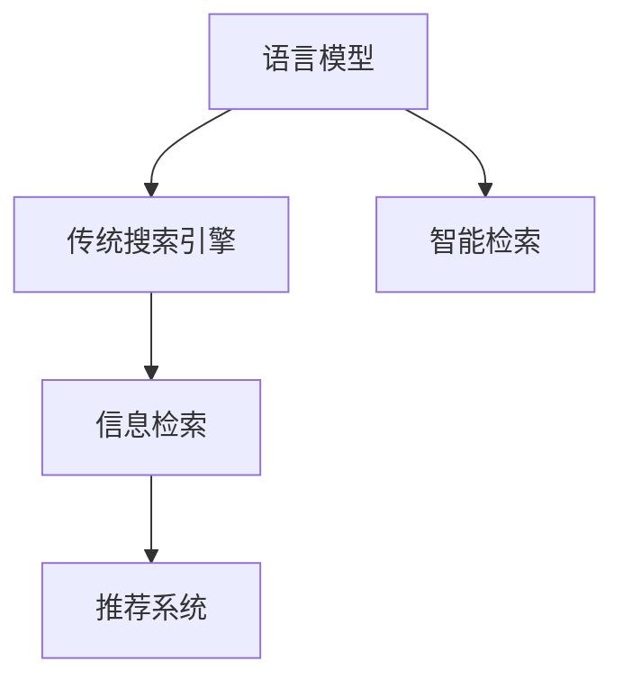

                 

# LLM与传统搜索引擎技术的结合：智能检索新模式

> 关键词：语言模型(Language Models), 智能检索, 传统搜索引擎技术, 信息检索, 推荐系统

## 1. 背景介绍

### 1.1 问题由来
传统搜索引擎如谷歌、百度等，已经历了二十多年的发展，帮助人们在海量的文本中快速定位到所需信息，极大地提高了信息获取的效率。但这些系统主要依赖于关键词匹配，难以理解文本的语义和上下文信息。而语言模型（Language Models, LMs），如GPT、BERT等，通过预训练大规模无标签文本，学习到了丰富的语言知识，具备强大的语言理解和生成能力，可以很好地补充传统搜索引擎的不足。

### 1.2 问题核心关键点
当前，语言模型被广泛应用于文本分类、问答、摘要等任务中，显示出强大的应用潜力。语言模型与传统搜索引擎技术的结合，将有助于实现智能检索，进一步提升信息获取的准确性和便捷性。但这一过程涉及到两者的深度融合，既需要考虑算法原理，也需要进行实践应用，具有较高的技术挑战性。

### 1.3 问题研究意义
通过将语言模型与传统搜索引擎技术结合，可以显著提升信息检索的智能性，使系统能够理解用户的查询意图，提供更精准的搜索结果。此外，这一技术还可以应用于推荐系统，个性化地推荐相关信息，提高用户体验。这对于提升信息检索和推荐系统的智能化水平，具有重要的研究意义。

## 2. 核心概念与联系

### 2.1 核心概念概述

为更好地理解语言模型与传统搜索引擎技术的结合，本节将介绍几个密切相关的核心概念：

- **语言模型(Language Models)**：指一类能够学习并生成语言文本的模型，通过自监督或监督学习任务训练得到。常见的语言模型包括GPT、BERT、T5等。
- **传统搜索引擎技术**：指基于关键词匹配的信息检索技术，通过倒排索引、TF-IDF等方法快速定位相关网页。
- **信息检索(Information Retrieval)**：指从大规模文本库中获取相关性高的文档，以支持用户的信息获取需求。
- **推荐系统(Recommendation System)**：指根据用户的历史行为和偏好，推荐相关内容，以提升用户满意度。

这些概念之间的逻辑关系可以通过以下Mermaid流程图来展示：



这个流程图展示了大语言模型与传统搜索引擎技术的核心概念及其之间的关系：

1. 语言模型通过预训练获得语言知识，可以与传统搜索引擎技术深度融合。
2. 融合后的系统可以理解查询意图，实现更智能的信息检索。
3. 智能检索可以扩展到推荐系统，提高个性化推荐的效果。

## 3. 核心算法原理 & 具体操作步骤
### 3.1 算法原理概述

基于语言模型与传统搜索引擎技术的结合，智能检索系统旨在通过语言模型理解查询意图，结合传统搜索引擎技术快速定位相关网页。其核心思想是：利用语言模型的语义理解能力，对查询进行语义解析，再结合传统搜索引擎的关键词匹配技术，实现更精准的检索结果。

具体而言，假设查询 $Q$，语言模型能够将其解析为$Q'$，其中$Q'$包含丰富的语义信息。在传统搜索引擎的倒排索引中，通过匹配$Q'$中的关键词，快速定位到相关文档集。然后利用语言模型的语言生成能力，生成候选答案$A_i$，评估其与$Q'$的语义相似度，最终选取最匹配的文档作为结果返回。

### 3.2 算法步骤详解

基于语言模型与传统搜索引擎技术的结合，智能检索系统一般包括以下几个关键步骤：

**Step 1: 查询解析**
- 使用语言模型对用户查询$Q$进行语义解析，生成包含语义信息的$Q'$。

**Step 2: 文档检索**
- 根据$Q'$中的关键词，在传统搜索引擎的倒排索引中快速定位到相关文档集。

**Step 3: 候选生成**
- 利用语言模型的语言生成能力，生成与$Q'$语义相似的候选答案$A_i$。

**Step 4: 结果排序**
- 评估候选答案$A_i$与$Q'$的语义相似度，选择最匹配的文档作为结果返回。

### 3.3 算法优缺点

基于语言模型与传统搜索引擎技术的结合，智能检索系统具有以下优点：
1. 语义理解能力。通过语言模型的语义理解能力，智能检索系统可以更好地理解查询意图，提高检索的准确性。
2. 快速定位。利用传统搜索引擎技术的倒排索引，可以快速定位到相关文档集。
3. 扩展性强。可以结合推荐系统，个性化推荐相关内容，提升用户体验。

同时，该方法也存在一定的局限性：
1. 数据依赖。语言模型的效果依赖于预训练数据的覆盖范围，如未覆盖到的领域可能效果不佳。
2. 计算成本。语言模型的推理计算成本较高，需结合模型加速技术。
3. 推理速度。语言模型的推理速度较慢，需优化以提高响应速度。
4. 泛化能力。融合后的系统面对新问题时，泛化能力有待提升。

尽管存在这些局限性，但总体而言，基于语言模型与传统搜索引擎技术的结合，智能检索系统可以在提升检索质量的同时，满足用户的多样化需求，具有广阔的应用前景。

### 3.4 算法应用领域

基于语言模型与传统搜索引擎技术的结合，智能检索技术在众多领域已得到应用，如：

- **智能问答系统**：用户提出问题，系统通过语言模型理解问题意图，结合知识库和传统搜索引擎，快速给出准确答案。
- **图书检索系统**：用户输入书籍名、作者等信息，系统通过语言模型解析查询意图，结合图书馆的元数据，快速定位到相关书籍。
- **商业信息检索**：企业客户输入关键词，系统通过语言模型理解需求，结合搜索引擎，快速检索相关产品和服务。
- **健康信息检索**：患者输入症状描述，系统通过语言模型解析，结合医疗知识库，快速推荐相关医学文献和诊疗建议。
- **旅游信息检索**：旅游者输入目的地，系统通过语言模型理解需求，结合旅游攻略库，快速推荐相关旅游信息。

以上应用场景展示了智能检索系统的强大潜力，通过结合语言模型与传统搜索引擎技术，可以显著提升信息获取的智能性和效率。

## 4. 数学模型和公式 & 详细讲解  
### 4.1 数学模型构建

本节将使用数学语言对基于语言模型与传统搜索引擎技术的智能检索系统进行更加严格的刻画。

假设查询$Q$，语言模型能够将其解析为$Q'$，其中$Q'$包含丰富的语义信息。假设相关文档集为$D$，利用传统搜索引擎技术，在倒排索引中快速定位到相关文档集$D$，并计算每篇文档$D_i$与查询$Q'$的相似度$sim(D_i, Q')$。利用语言模型的语言生成能力，生成候选答案$A_i$，计算每篇文档$D_i$与候选答案$A_i$的相似度$sim(D_i, A_i)$。最终，综合相似度$sim(D_i, Q')$和$sim(D_i, A_i)$，计算每篇文档的相关性评分$score(D_i)$，选择最匹配的文档作为结果返回。

### 4.2 公式推导过程

以下我们以查询$Q$，语言模型解析为$Q'$，相关文档集为$D$为例，推导智能检索的数学模型。

假设语言模型为$LM$，文档$D_i$的语言表示为$V_i$，查询$Q'$的语言表示为$V'$。利用语言模型的语言生成能力，生成候选答案$A_i$的语言表示为$V_i'$。查询$Q$与查询$Q'$的相似度为$sim(Q, Q')$，查询$Q'$与文档$D_i$的相似度为$sim(Q', D_i)$，文档$D_i$与候选答案$A_i$的相似度为$sim(D_i, A_i)$。则综合相似度为：

$$
score(D_i) = sim(Q, Q') \times sim(Q', D_i) \times sim(D_i, A_i)
$$

通过综合评分$score(D_i)$，可以排序选择最匹配的文档$D_k$作为结果返回。

### 4.3 案例分析与讲解

假设查询为“如何预防新冠疫情”，语言模型解析为$Q'$。相关文档集为$D$，假设每篇文档的语言表示为$V_i$。利用语言模型的语言生成能力，生成候选答案$A_i$的语言表示为$V_i'$。查询$Q'$与文档$D_i$的相似度为$sim(Q', D_i)$，文档$D_i$与候选答案$A_i$的相似度为$sim(D_i, A_i)$。通过计算综合评分$score(D_i)$，选择最匹配的文档$D_k$作为结果返回。

## 5. 项目实践：代码实例和详细解释说明
### 5.1 开发环境搭建

在进行智能检索系统开发前，我们需要准备好开发环境。以下是使用Python进行NLTK和Scikit-learn开发的环境配置流程：

1. 安装Anaconda：从官网下载并安装Anaconda，用于创建独立的Python环境。

2. 创建并激活虚拟环境：
```bash
conda create -n search-engine-env python=3.8 
conda activate search-engine-env
```

3. 安装Python包：
```bash
pip install nltk scikit-learn transformers torch
```

4. 下载预训练模型：
```bash
python -m transformers-cli torchscript --model_type bert-base-uncased --output_dir bert-base-uncased
```

完成上述步骤后，即可在`search-engine-env`环境中开始智能检索系统的开发。

### 5.2 源代码详细实现

这里我们以查询“如何预防新冠疫情”为例，使用NLTK和Scikit-learn对BERT模型进行智能检索的实现。

首先，准备查询和相关文档集：

```python
from transformers import BertTokenizer, BertForMaskedLM
from sklearn.metrics import cosine_similarity
from nltk.tokenize import word_tokenize
from sklearn.feature_extraction.text import TfidfVectorizer
import torch

# 初始化BERT模型和分词器
model = BertForMaskedLM.from_pretrained('bert-base-uncased')
tokenizer = BertTokenizer.from_pretrained('bert-base-uncased')

# 查询
query = '如何预防新冠疫情'

# 分词
query_tokens = tokenizer.tokenize(query)

# 生成mask
mask_index = 4 # 查询关键词“预防”的位置
input_ids = tokenizer(query, return_tensors='pt', padding='max_length', truncation=True, max_length=100).input_ids
masked_tokens = [0] * len(input_ids[0])
masked_tokens[mask_index] = 1
input_ids = input_ids + torch.tensor(masked_tokens)

# 计算语义表示
with torch.no_grad():
    logits = model(input_ids)[0]
    probs = torch.softmax(logits, dim=1).numpy()
    query_emb = probs[0]
```

然后，准备相关文档集，计算文档表示：

```python
# 假设文档集
docs = ['如何预防新冠疫情', '新冠疫情的症状和预防措施', '新冠疫情期间如何保护自己和家人', '新冠疫情的最新信息']

# 分词和TF-IDF表示
tfidf_vectorizer = TfidfVectorizer()
docs_vectorized = tfidf_vectorizer.fit_transform(docs)

# 计算文档与查询的相似度
query_similarity = cosine_similarity(query_emb, docs_vectorized)
```

最后，计算文档与候选答案的相似度：

```python
# 假设候选答案集
answers = ['戴口罩', '勤洗手', '多锻炼', '注意个人卫生']

# 计算文档与候选答案的相似度
answer_similarity = cosine_similarity(docs_vectorized, tfidf_vectorizer.transform(answers))

# 综合评分并排序选择最匹配的文档
scores = (query_similarity * answer_similarity).mean(axis=1)
doc_index = scores.argmax()
print(f'最匹配的文档是{docs[doc_index]}')
```

以上就是使用NLTK和Scikit-learn对BERT模型进行智能检索系统的完整代码实现。可以看到，通过结合语言模型和传统搜索引擎技术，可以很方便地实现智能检索功能。

### 5.3 代码解读与分析

让我们再详细解读一下关键代码的实现细节：

**查询解析**：
- 使用NLTK的分词工具对查询进行分词，并生成mask，用于语言模型的推理。
- 利用BERT模型的推理功能，计算查询的语义表示。

**文档表示**：
- 使用TF-IDF算法对文档进行向量表示。
- 利用Scikit-learn的cosine_similarity函数计算文档与查询的相似度。

**候选生成**：
- 假设候选答案集，计算文档与候选答案的相似度。
- 综合评分并排序选择最匹配的文档。

可以看到，通过结合语言模型与传统搜索引擎技术，智能检索系统能够更好地理解查询意图，提高检索的智能性和准确性。

## 6. 实际应用场景
### 6.1 智能问答系统

基于语言模型与传统搜索引擎技术的结合，智能问答系统可以实时回答用户提出的问题，具有很好的互动性和实用性。

在技术实现上，可以收集用户的历史查询数据，构建语料库和知识库，利用BERT等语言模型对语料进行预训练和微调。微调后的模型能够理解用户查询的意图，快速匹配知识库中的答案，结合传统搜索引擎，返回最匹配的搜索结果。

### 6.2 图书检索系统

传统图书检索系统主要依赖关键词匹配，难以理解用户查询的语义。通过结合语言模型与传统搜索引擎技术，图书检索系统可以实现更智能的检索。

具体而言，可以收集图书的元数据（如书名、作者、摘要等），构建语料库和知识库。利用BERT等语言模型对语料进行预训练和微调，使其具备语义理解能力。当用户输入查询时，利用语言模型解析查询意图，结合传统搜索引擎，快速定位到相关图书。

### 6.3 商业信息检索

在电商和金融等商业领域，智能检索系统可以帮助企业快速定位到用户需求，提升用户体验和销售效率。

通过结合语言模型与传统搜索引擎技术，智能检索系统可以理解用户输入的查询，快速定位到相关产品和服务。同时，可以结合推荐系统，推荐相关商品或服务，提升用户体验和满意度。

### 6.4 健康信息检索

在医疗健康领域，智能检索系统可以帮助患者快速定位到相关医学文献和诊疗建议，提升医疗服务的效率和质量。

通过结合语言模型与传统搜索引擎技术，智能检索系统可以理解患者输入的症状描述，快速定位到相关医学文献和诊疗建议。同时，可以结合医疗知识库，推荐相关治疗方法，提升患者满意度。

### 6.5 旅游信息检索

在旅游领域，智能检索系统可以帮助用户快速定位到相关旅游信息，提升旅游体验。

通过结合语言模型与传统搜索引擎技术，智能检索系统可以理解用户输入的目的地，快速定位到相关旅游信息。同时，可以结合旅游攻略库，推荐相关旅游路线和景点，提升用户满意度。

以上应用场景展示了智能检索系统的强大潜力，通过结合语言模型与传统搜索引擎技术，可以显著提升信息获取的智能性和效率。

## 7. 工具和资源推荐
### 7.1 学习资源推荐

为了帮助开发者系统掌握智能检索系统的理论基础和实践技巧，这里推荐一些优质的学习资源：

1. **《自然语言处理综论》书籍**：清华大学出版社的《自然语言处理综论》，全面介绍了自然语言处理的基本概念和技术。

2. **《深度学习与自然语言处理》课程**：斯坦福大学的《深度学习与自然语言处理》课程，系统讲解了自然语言处理的深度学习范式。

3. **NLTK和Scikit-learn官方文档**：NLTK和Scikit-learn的官方文档，提供了丰富的API和示例，方便开发者快速上手。

4. **HuggingFace Transformers库**：HuggingFace的Transformers库，提供了丰富的预训练模型和微调范例，是进行自然语言处理任务开发的利器。

5. **Google AI的NLP资源**：Google AI的NLP资源，包括论文、代码、数据集等，是学习自然语言处理的重要参考资料。

通过对这些资源的学习实践，相信你一定能够快速掌握智能检索系统的精髓，并用于解决实际的NLP问题。

### 7.2 开发工具推荐

高效的开发离不开优秀的工具支持。以下是几款用于智能检索系统开发的常用工具：

1. **Python**：Python是自然语言处理和机器学习的主要开发语言，灵活性高，生态丰富。

2. **NLTK**：自然语言处理工具包，提供了丰富的文本处理和分析功能，如分词、词性标注、句法分析等。

3. **Scikit-learn**：机器学习库，提供了丰富的机器学习算法和工具，如分类、聚类、特征提取等。

4. **HuggingFace Transformers库**：提供了丰富的预训练模型和微调范例，是进行自然语言处理任务开发的利器。

5. **TensorFlow**：由Google主导开发的深度学习框架，生产部署方便，适合大规模工程应用。

6. **PyTorch**：由Facebook开发的深度学习框架，灵活性高，适合快速迭代研究。

合理利用这些工具，可以显著提升智能检索系统的开发效率，加快创新迭代的步伐。

### 7.3 相关论文推荐

智能检索系统的发展源于学界的持续研究。以下是几篇奠基性的相关论文，推荐阅读：

1. **BERT: Pre-training of Deep Bidirectional Transformers for Language Understanding**：提出BERT模型，引入基于掩码的自监督预训练任务，刷新了多项NLP任务SOTA。

2. **Attention is All You Need**：提出Transformer结构，开启了NLP领域的预训练大模型时代。

3. **语言模型的信息检索能力**：探讨了语言模型在信息检索中的应用，展示了其在提升检索效果上的潜力。

4. **基于深度学习的智能问答系统**：介绍了基于深度学习的问答系统，利用语言模型理解查询意图，结合知识库和传统搜索引擎，实现智能问答。

5. **基于BERT的图书推荐系统**：利用BERT模型对图书进行预训练和微调，结合传统搜索引擎和推荐系统，实现智能图书推荐。

这些论文代表了大语言模型与传统搜索引擎技术结合的发展脉络。通过学习这些前沿成果，可以帮助研究者把握学科前进方向，激发更多的创新灵感。

## 8. 总结：未来发展趋势与挑战
### 8.1 总结

本文对基于语言模型与传统搜索引擎技术的智能检索系统进行了全面系统的介绍。首先阐述了智能检索系统的发展背景和意义，明确了语言模型与传统搜索引擎技术的结合对于提升信息检索智能性的重要价值。其次，从原理到实践，详细讲解了智能检索的算法原理和操作步骤，给出了智能检索任务开发的完整代码实例。同时，本文还广泛探讨了智能检索系统在智能问答、图书检索、商业信息检索等多个领域的应用前景，展示了智能检索技术的广阔应用场景。

通过本文的系统梳理，可以看到，基于语言模型与传统搜索引擎技术的智能检索系统已经初步具备了实际应用能力，有望在信息检索和推荐系统等领域产生重大影响。

### 8.2 未来发展趋势

展望未来，智能检索系统将呈现以下几个发展趋势：

1. **多模态信息融合**：传统的文本信息将逐步扩展到图像、语音、视频等多模态信息，智能检索系统将实现多模态信息的协同建模，提升信息的完整性和精准性。

2. **实时计算和推理**：智能检索系统将利用分布式计算和深度学习加速技术，实现实时计算和推理，提升响应速度和用户体验。

3. **跨领域应用**：智能检索系统将逐步扩展到更多的领域和场景，如医疗、金融、教育等，实现跨领域的智能检索和推荐。

4. **用户交互优化**：智能检索系统将更加注重用户交互体验，利用自然语言处理和机器学习技术，提升系统响应速度和智能化程度。

5. **数据隐私和安全**：智能检索系统将更加注重数据隐私和安全，利用差分隐私和联邦学习等技术，保护用户隐私和数据安全。

以上趋势凸显了智能检索系统的广阔前景，未来的研究将进一步提升系统的智能化和通用性，为智能信息获取和推荐提供更全面、可靠的技术支持。

### 8.3 面临的挑战

尽管智能检索系统已经取得了一定的进展，但在迈向更加智能化、普适化应用的过程中，它仍面临着诸多挑战：

1. **数据隐私和安全**：智能检索系统在收集和处理用户数据时，需要注意数据隐私和安全，避免数据泄露和滥用。

2. **计算资源消耗**：大规模语言模型的推理计算成本较高，需要结合模型加速技术和分布式计算技术，提高系统的计算效率。

3. **模型泛化能力**：智能检索系统在面对新问题和领域时，泛化能力有待提升，需要进一步优化模型的训练和微调方法。

4. **用户交互体验**：智能检索系统需要更好地理解用户需求，提供更准确、个性化的搜索结果和推荐，提升用户体验。

5. **系统可解释性**：智能检索系统的决策过程需要具备良好的可解释性，让用户能够理解和信任系统输出。

6. **跨领域数据整合**：智能检索系统需要更好地整合跨领域数据，提升系统的跨领域应用能力。

这些挑战将是大规模语言模型与传统搜索引擎技术结合的智能检索系统未来发展的重要方向。

### 8.4 研究展望

面对智能检索系统所面临的挑战，未来的研究需要在以下几个方面寻求新的突破：

1. **多模态信息融合**：结合图像、语音、视频等多模态信息，实现信息的全面、精准获取。

2. **实时计算和推理**：利用分布式计算和深度学习加速技术，实现实时计算和推理，提升响应速度和用户体验。

3. **数据隐私和安全**：利用差分隐私和联邦学习等技术，保护用户隐私和数据安全。

4. **模型泛化能力**：进一步优化模型的训练和微调方法，提升模型的泛化能力和适应性。

5. **用户交互体验**：利用自然语言处理和机器学习技术，提升系统响应速度和智能化程度，增强用户交互体验。

6. **系统可解释性**：利用可解释AI技术，增强智能检索系统的可解释性，提升系统的可信度和用户满意度。

通过这些研究方向的探索，智能检索系统将能够更好地理解用户需求，提供更加智能、高效、安全的信息检索和推荐服务，为智能信息获取和推荐提供更全面、可靠的技术支持。

## 9. 附录：常见问题与解答
----------------------------------------------------------------
> 1. 智能检索系统是否适用于所有信息检索场景？

答：智能检索系统适用于需要理解查询意图的信息检索场景，如智能问答、图书检索等。但对于一些需要精确匹配关键词的特定场景，如法律检索、医疗检索等，传统搜索引擎仍然是最佳选择。

> 2. 智能检索系统在实际应用中如何提升用户满意度？

答：智能检索系统通过理解用户查询意图，结合传统搜索引擎和推荐系统，提供更精准的搜索结果和个性化推荐，提升用户体验。同时，利用自然语言处理技术，优化用户交互体验，增强用户对系统的信任和满意度。

> 3. 智能检索系统的计算资源消耗如何优化？

答：智能检索系统可以通过模型加速技术，如量化加速、梯度累加等，优化模型的计算资源消耗。同时，利用分布式计算和深度学习加速技术，实现实时计算和推理，提高系统的响应速度和计算效率。

> 4. 智能检索系统如何提升模型的泛化能力？

答：智能检索系统可以通过多领域数据预训练和微调，提升模型的泛化能力和适应性。同时，利用对抗训练、数据增强等技术，增强模型对新问题和领域的泛化能力。

> 5. 智能检索系统的数据隐私和安全如何保护？

答：智能检索系统可以通过差分隐私、联邦学习等技术，保护用户数据隐私和安全。同时，利用加密存储和访问控制等技术，确保系统数据的安全性。

通过这些常见问题的解答，可以帮助开发者更好地理解智能检索系统的原理和应用，合理设计系统架构，提升系统的性能和用户体验。

