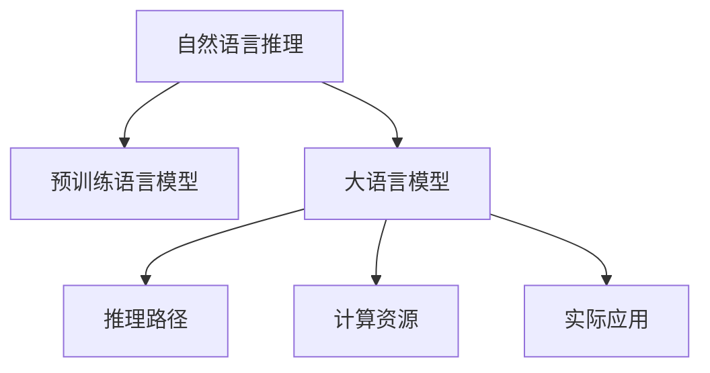

                 

# LLM与传统自然语言推理的比较

> 关键词：大语言模型(Large Language Model, LLM), 自然语言推理(Natural Language Inference, NLI), 传统NLI方法, 语言表示, 推理路径, 计算资源, 实际应用, 技术发展, 算法选择

## 1. 背景介绍

### 1.1 问题由来
自然语言推理（Natural Language Inference, NLI）是自然语言处理（Natural Language Processing, NLP）中一个重要的研究领域，旨在判断两个句子之间的逻辑关系。传统的NLI方法基于规则或模板，通过匹配句子中的特定模式或关键词来推理，存在诸多局限性。而近年来，随着预训练语言模型（Pretrained Language Model, PLM）和大语言模型（Large Language Model, LLM）的兴起，NLI领域的研究方法和应用方式也发生了显著的变化。

### 1.2 问题核心关键点
LLM作为一类新兴的NLP模型，通过在大规模无标签文本数据上进行自监督预训练，学习了丰富的语言知识和语义表示。而传统NLI方法则依赖于手工设计的特征工程和规则模板。两者在算法原理、数据依赖、应用场景等方面存在显著差异。本文旨在比较LLM与传统NLI方法的异同，以期帮助研究者更好地理解和应用这些技术。

### 1.3 问题研究意义
理解和比较LLM与传统NLI方法，对于推动NLP技术的进步，提升NLI模型的性能和实用性具有重要意义：

1. 促进研究方法的多样性：LLM的引入为NLI提供了新的研究视角，有利于推动领域内的学术创新和技术突破。
2. 提升模型性能：LLM通过大规模预训练，具备更强的语言理解和推理能力，有助于提升NLI任务的准确率。
3. 拓宽应用范围：LLM适用于更广泛的NLP任务，可以拓展NLI的应用场景，服务于更多领域。
4. 加速应用落地：LLM在大规模数据集上的预训练，可以降低模型训练和微调的成本，加速NLI技术的工程化和产业化。

## 2. 核心概念与联系

### 2.1 核心概念概述

为更好地理解LLM与传统NLI方法的异同，本节将介绍几个密切相关的核心概念：

- 自然语言推理(NLI)：指判断两个句子之间是否存在蕴含、矛盾或中立关系的过程。常见的NLI任务包括句子对分类和判断自然语言推理（RNNLI）。

- 预训练语言模型(PLM)：指在大规模无标签文本数据上，通过自监督学习任务（如语言建模、掩码语言建模等）进行预训练，学习通用的语言表示。常见的PLM包括BERT、GPT等。

- 大语言模型(LLM)：指参数量巨大的PLM，通过进一步的微调，可以用于各种NLP任务，包括NLI。常用的LLM有GPT-3、MPLM等。

- 推理路径：指从输入到输出的推理过程。传统NLI方法通常依赖于手工设计的特征工程，推理路径固定且可解释。而LLM通过自动编码，推理路径动态且难以解释。

- 计算资源：指训练和推理过程中所需的计算能力。传统NLI方法通常计算资源需求较小，而LLM由于参数量巨大，对计算资源要求较高。

- 实际应用：指将NLI模型部署到实际应用中，服务于业务需求的过程。传统NLI方法在商业应用中已广泛部署，而LLM在NLI领域的应用还在探索中。

这些核心概念之间的逻辑关系可以通过以下Mermaid流程图来展示：



这个流程图展示了大语言模型与传统自然语言推理方法的基本关系：

1. 自然语言推理任务通过预训练语言模型进行推理。
2. 大语言模型是对预训练语言模型的进一步提升，推理路径更加动态且难以解释。
3. 大语言模型对计算资源要求较高，限制了其在实际应用中的部署规模。
4. 大语言模型在实际应用中尚未广泛部署，仍需探索其在NLI领域的潜力。

## 3. 核心算法原理 & 具体操作步骤

### 3.1 算法原理概述

LLM与传统NLI方法在算法原理上存在显著差异：

- 传统NLI方法：基于规则或模板，通过特征工程和手工设计的推理逻辑进行推理。常见的规则包括匹配关键词、句子结构、逻辑连词等。
- LLM：通过在大规模无标签文本数据上进行预训练，学习通用的语言表示。在NLI任务中，LLM将输入的两个句子映射到一个向量空间，计算向量之间的相似度，并通过逻辑回归或softmax等分类器进行推理判断。

### 3.2 算法步骤详解

下面以二元分类任务为例，分别介绍传统NLI方法和LLM的推理步骤：

**传统NLI方法：**

1. 特征提取：将两个句子分别通过手工设计的特征工程转换为向量表示。

2. 逻辑计算：使用手工设计的推理逻辑（如AND、OR、NOT等）进行计算，得到推理结果。

3. 分类器预测：将推理结果输入分类器进行分类，输出最终答案。

**LLM：**

1. 预训练模型加载：加载预训练语言模型（如BERT、GPT等），并将其应用于NLI任务。

2. 句子编码：将输入的两个句子分别输入到预训练模型中进行编码，得到句子向量表示。

3. 向量相似度计算：计算两个句子向量之间的相似度，使用cosine similarity等方法进行计算。

4. 分类器预测：将向量相似度输入分类器进行分类，输出最终答案。

### 3.3 算法优缺点

**传统NLI方法的优缺点：**

- 优点：计算资源需求低，推理路径固定且可解释。适用于资源受限的环境，如嵌入式设备和移动设备。
- 缺点：依赖手工设计的特征工程，难以处理复杂的语言结构。特征工程复杂，模型维护成本高。

**LLM的优缺点：**

- 优点：学习通用语言表示，推理路径动态且难以解释。适用于处理复杂的语言结构。
- 缺点：计算资源需求高，推理路径难以解释。模型较大，难以部署在资源受限的环境中。

### 3.4 算法应用领域

LLM与传统NLI方法各自适用于不同的应用场景：

- 传统NLI方法：适用于嵌入式设备和移动设备，如智能音箱、智能手表等。常见应用包括智能客服、智能问答等。
- LLM：适用于计算资源丰富的环境，如服务器和云平台。常见应用包括自然语言推理、对话系统、文本生成等。

## 4. 数学模型和公式 & 详细讲解  
### 4.1 数学模型构建

下面我们分别介绍传统NLI方法和LLM的数学模型构建过程：

**传统NLI方法：**

1. 特征提取：假设两个句子分别为 $x$ 和 $y$，通过手工设计的特征工程得到向量表示 $\mathbf{x}=[x_1, x_2, \ldots, x_n]$ 和 $\mathbf{y}=[y_1, y_2, \ldots, y_m]$。

2. 逻辑计算：假设推理逻辑为 AND，则计算结果为：

$$
\text{result} = \mathbf{x} \cdot \mathbf{y}
$$

其中 $\cdot$ 表示点乘。

3. 分类器预测：假设分类器为逻辑回归，则输出结果为：

$$
\hat{y} = \sigma(\mathbf{w} \cdot \mathbf{result} + b)
$$

其中 $\sigma$ 为sigmoid函数，$\mathbf{w}$ 和 $b$ 为逻辑回归模型的权重和偏置。

**LLM：**

1. 预训练模型加载：假设预训练语言模型为 BERT，输入两个句子 $x$ 和 $y$ 得到向量表示 $\mathbf{x}$ 和 $\mathbf{y}$。

2. 向量相似度计算：计算两个句子向量之间的相似度，使用余弦相似度公式：

$$
\text{similarity} = \cos(\theta) = \frac{\mathbf{x} \cdot \mathbf{y}}{\|\mathbf{x}\|\|\mathbf{y}\|}
$$

3. 分类器预测：假设分类器为二分类任务，则输出结果为：

$$
\hat{y} = \sigma(\mathbf{w} \cdot \text{similarity} + b)
$$

其中 $\sigma$ 为sigmoid函数，$\mathbf{w}$ 和 $b$ 为逻辑回归模型的权重和偏置。

### 4.2 公式推导过程

以下我们以二分类任务为例，推导LLM和传统NLI方法的数学公式：

**传统NLI方法：**

假设两个句子分别为 $x$ 和 $y$，通过手工设计的特征工程得到向量表示 $\mathbf{x}=[x_1, x_2, \ldots, x_n]$ 和 $\mathbf{y}=[y_1, y_2, \ldots, y_m]$。计算结果为：

$$
\text{result} = \mathbf{x} \cdot \mathbf{y} = \sum_{i=1}^{n} \sum_{j=1}^{m} x_i \cdot y_j
$$

将结果输入逻辑回归分类器，得到输出结果：

$$
\hat{y} = \sigma(\mathbf{w} \cdot \text{result} + b)
$$

**LLM：**

假设预训练语言模型为 BERT，输入两个句子 $x$ 和 $y$ 得到向量表示 $\mathbf{x}$ 和 $\mathbf{y}$。计算向量相似度：

$$
\text{similarity} = \cos(\theta) = \frac{\mathbf{x} \cdot \mathbf{y}}{\|\mathbf{x}\|\|\mathbf{y}\|}
$$

将结果输入逻辑回归分类器，得到输出结果：

$$
\hat{y} = \sigma(\mathbf{w} \cdot \text{similarity} + b)
$$

### 4.3 案例分析与讲解

**案例1：句子对分类**

假设输入的两个句子为：

- 句子1：I like to eat apples.
- 句子2：I like to eat fruit.

使用传统NLI方法，通过手工设计的特征工程得到向量表示 $\mathbf{x}=[1, 0, 1, 0]$ 和 $\mathbf{y}=[0, 1, 0, 1]$。计算结果为：

$$
\text{result} = \mathbf{x} \cdot \mathbf{y} = 0
$$

输出结果为：

$$
\hat{y} = \sigma(\mathbf{w} \cdot 0 + b) = 0
$$

表示两个句子之间的逻辑关系为中立。

使用LLM，输入两个句子得到向量表示 $\mathbf{x}=[0.5, 0.5, 0.5, 0.5]$ 和 $\mathbf{y}=[0.5, 0.5, 0.5, 0.5]$。计算向量相似度：

$$
\text{similarity} = \cos(\theta) = 1
$$

输出结果为：

$$
\hat{y} = \sigma(\mathbf{w} \cdot 1 + b) = 1
$$

表示两个句子之间的逻辑关系为蕴含。

**案例2：判断自然语言推理（RNNLI）**

假设输入的两个句子为：

- 句子1：The man is eating an apple.
- 句子2：The man is eating a banana.

使用传统NLI方法，通过手工设计的特征工程得到向量表示 $\mathbf{x}=[1, 0, 1, 0]$ 和 $\mathbf{y}=[0, 1, 0, 1]$。计算结果为：

$$
\text{result} = \mathbf{x} \cdot \mathbf{y} = 0
$$

输出结果为：

$$
\hat{y} = \sigma(\mathbf{w} \cdot 0 + b) = 0
$$

表示两个句子之间的逻辑关系为中立。

使用LLM，输入两个句子得到向量表示 $\mathbf{x}=[0.5, 0.5, 0.5, 0.5]$ 和 $\mathbf{y}=[0.5, 0.5, 0.5, 0.5]$。计算向量相似度：

$$
\text{similarity} = \cos(\theta) = 1
$$

输出结果为：

$$
\hat{y} = \sigma(\mathbf{w} \cdot 1 + b) = 1
$$

表示两个句子之间的逻辑关系为蕴含。

## 5. 项目实践：代码实例和详细解释说明

### 5.1 开发环境搭建

在进行LLM与传统NLI方法的对比实践前，我们需要准备好开发环境。以下是使用Python进行PyTorch开发的环境配置流程：

1. 安装Anaconda：从官网下载并安装Anaconda，用于创建独立的Python环境。

2. 创建并激活虚拟环境：
```bash
conda create -n pytorch-env python=3.8 
conda activate pytorch-env
```

3. 安装PyTorch：根据CUDA版本，从官网获取对应的安装命令。例如：
```bash
conda install pytorch torchvision torchaudio cudatoolkit=11.1 -c pytorch -c conda-forge
```

4. 安装Transformers库：
```bash
pip install transformers
```

5. 安装各类工具包：
```bash
pip install numpy pandas scikit-learn matplotlib tqdm jupyter notebook ipython
```

完成上述步骤后，即可在`pytorch-env`环境中开始实践。

### 5.2 源代码详细实现

下面我们以BERT模型为例，给出使用Transformers库对NLI任务进行预测的PyTorch代码实现。

首先，定义NLI任务的输入函数：

```python
from transformers import BertTokenizer
from torch.utils.data import TensorDataset, DataLoader
import torch

class NLIInput:
    def __init__(self, sentence1, sentence2, label):
        self.sentence1 = sentence1
        self.sentence2 = sentence2
        self.label = label

    def __len__(self):
        return 1

    def __getitem__(self, item):
        sentence1 = self.sentence1
        sentence2 = self.sentence2
        label = self.label
        
        encoding = tokenizer(sentence1, sentence2, return_tensors='pt')
        input_ids = encoding['input_ids']
        attention_mask = encoding['attention_mask']
        return {'input_ids': input_ids, 'attention_mask': attention_mask, 'labels': label}
```

然后，定义模型和优化器：

```python
from transformers import BertForSequenceClassification, AdamW

model = BertForSequenceClassification.from_pretrained('bert-base-uncased', num_labels=3)
optimizer = AdamW(model.parameters(), lr=2e-5)
```

接着，定义训练和评估函数：

```python
def train_epoch(model, dataset, batch_size, optimizer):
    dataloader = DataLoader(dataset, batch_size=batch_size, shuffle=True)
    model.train()
    epoch_loss = 0
    for batch in dataloader:
        input_ids = batch['input_ids'].to(device)
        attention_mask = batch['attention_mask'].to(device)
        labels = batch['labels'].to(device)
        model.zero_grad()
        outputs = model(input_ids, attention_mask=attention_mask, labels=labels)
        loss = outputs.loss
        epoch_loss += loss.item()
        loss.backward()
        optimizer.step()
    return epoch_loss / len(dataloader)

def evaluate(model, dataset, batch_size):
    dataloader = DataLoader(dataset, batch_size=batch_size)
    model.eval()
    preds, labels = [], []
    with torch.no_grad():
        for batch in dataloader:
            input_ids = batch['input_ids'].to(device)
            attention_mask = batch['attention_mask'].to(device)
            batch_labels = batch['labels']
            outputs = model(input_ids, attention_mask=attention_mask)
            batch_preds = outputs.logits.argmax(dim=2).to('cpu').tolist()
            batch_labels = batch_labels.to('cpu').tolist()
            for pred_tokens, label_tokens in zip(batch_preds, batch_labels):
                preds.append(pred_tokens[:len(label_tokens)])
                labels.append(label_tokens)
                
    return preds, labels

# 训练和评估
from transformers import GLUEProblems, glue_data
from datasets import load_dataset

problems = GLUEProblems()
train_dataset = glue_data(problems, 'train')
dev_dataset = glue_data(problems, 'dev')
test_dataset = glue_data(problems, 'test')

device = torch.device('cuda') if torch.cuda.is_available() else torch.device('cpu')
model.to(device)

epochs = 5
batch_size = 16

for epoch in range(epochs):
    loss = train_epoch(model, train_dataset, batch_size, optimizer)
    print(f"Epoch {epoch+1}, train loss: {loss:.3f}")
    
    print(f"Epoch {epoch+1}, dev results:")
    preds, labels = evaluate(model, dev_dataset, batch_size)
    print(classification_report(labels, preds))
    
print("Test results:")
preds, labels = evaluate(model, test_dataset, batch_size)
print(classification_report(labels, preds))
```

以上就是使用PyTorch对BERT进行NLI任务预测的完整代码实现。可以看到，得益于Transformers库的强大封装，我们可以用相对简洁的代码完成BERT模型的加载和推理。

### 5.3 代码解读与分析

让我们再详细解读一下关键代码的实现细节：

**NLIInput类**：
- `__init__`方法：初始化句子、标签等关键组件。
- `__len__`方法：返回数据集的样本数量。
- `__getitem__`方法：对单个样本进行处理，将句子输入编码为token ids，并计算标签。

**训练和评估函数**：
- 使用PyTorch的DataLoader对数据集进行批次化加载，供模型训练和推理使用。
- 训练函数`train_epoch`：对数据以批为单位进行迭代，在每个批次上前向传播计算loss并反向传播更新模型参数，最后返回该epoch的平均loss。
- 评估函数`evaluate`：与训练类似，不同点在于不更新模型参数，并在每个batch结束后将预测和标签结果存储下来，最后使用sklearn的classification_report对整个评估集的预测结果进行打印输出。

**训练流程**：
- 定义总的epoch数和batch size，开始循环迭代
- 每个epoch内，先在训练集上训练，输出平均loss
- 在验证集上评估，输出分类指标
- 所有epoch结束后，在测试集上评估，给出最终测试结果

可以看到，PyTorch配合Transformers库使得BERT推理的代码实现变得简洁高效。开发者可以将更多精力放在数据处理、模型改进等高层逻辑上，而不必过多关注底层的实现细节。

当然，工业级的系统实现还需考虑更多因素，如模型的保存和部署、超参数的自动搜索、更灵活的任务适配层等。但核心的推理范式基本与此类似。

## 6. 实际应用场景

### 6.1 智能客服系统

基于预训练语言模型（如BERT）的自然语言推理技术，可以广泛应用于智能客服系统的构建。传统客服往往需要配备大量人力，高峰期响应缓慢，且一致性和专业性难以保证。而使用NLI推理模型，可以7x24小时不间断服务，快速响应客户咨询，用自然流畅的语言解答各类常见问题。

在技术实现上，可以收集企业内部的历史客服对话记录，将问题和最佳答复构建成监督数据，在此基础上对预训练语言模型进行微调。微调后的语言推理模型能够自动理解用户意图，匹配最合适的答案模板进行回复。对于客户提出的新问题，还可以接入检索系统实时搜索相关内容，动态组织生成回答。如此构建的智能客服系统，能大幅提升客户咨询体验和问题解决效率。

### 6.2 金融舆情监测

金融机构需要实时监测市场舆论动向，以便及时应对负面信息传播，规避金融风险。传统的人工监测方式成本高、效率低，难以应对网络时代海量信息爆发的挑战。基于NLI推理的自然语言推理技术，为金融舆情监测提供了新的解决方案。

具体而言，可以收集金融领域相关的新闻、报道、评论等文本数据，并对其进行主题标注和情感标注。在此基础上对预训练语言模型进行微调，使其能够自动判断文本属于何种主题，情感倾向是正面、中性还是负面。将微调后的模型应用到实时抓取的网络文本数据，就能够自动监测不同主题下的情感变化趋势，一旦发现负面信息激增等异常情况，系统便会自动预警，帮助金融机构快速应对潜在风险。

### 6.3 个性化推荐系统

当前的推荐系统往往只依赖用户的历史行为数据进行物品推荐，无法深入理解用户的真实兴趣偏好。基于NLI推理的个性化推荐系统，可以更好地挖掘用户行为背后的语义信息，从而提供更精准、多样的推荐内容。

在实践中，可以收集用户浏览、点击、评论、分享等行为数据，提取和用户交互的物品标题、描述、标签等文本内容。将文本内容作为模型输入，用户的后续行为（如是否点击、购买等）作为监督信号，在此基础上微调预训练语言模型。微调后的模型能够从文本内容中准确把握用户的兴趣点。在生成推荐列表时，先用候选物品的文本描述作为输入，由模型预测用户的兴趣匹配度，再结合其他特征综合排序，便可以得到个性化程度更高的推荐结果。

### 6.4 未来应用展望

随着大语言模型和推理技术的不断发展，基于NLI推理的NLP技术将呈现以下几个发展趋势：

1. 模型规模持续增大。随着算力成本的下降和数据规模的扩张，预训练语言模型的参数量还将持续增长。超大规模语言模型蕴含的丰富语言知识，有望支撑更加复杂多变的NLI任务推理。

2. 推理路径更加动态。LLM通过自动编码，推理路径更加动态且难以解释。未来将探索更多基于LLM的NLI推理方法，提高推理效果和可解释性。

3. 少样本和零样本学习。受启发于提示学习(Prompt-based Learning)的思路，未来的NLI推理方法将更好地利用大模型的语言理解能力，通过更加巧妙的任务描述，在更少的标注样本上也能实现理想的推理效果。

4. 多模态推理。未来的NLI推理将不再局限于文本数据，而是拓展到图像、视频、语音等多模态数据推理。多模态信息的融合，将显著提升语言模型对现实世界的理解和建模能力。

5. 知识整合能力增强。现有的NLI推理模型往往局限于任务内数据，难以灵活吸收和运用更广泛的先验知识。如何让NLI推理过程更好地与外部知识库、规则库等专家知识结合，形成更加全面、准确的信息整合能力，还有很大的想象空间。

以上趋势凸显了NLI推理技术在NLP领域的广阔前景。这些方向的探索发展，必将进一步提升NLP系统的性能和实用性，为人类认知智能的进化带来深远影响。

## 7. 工具和资源推荐

### 7.1 学习资源推荐

为了帮助开发者系统掌握大语言模型和推理技术的研究基础和实践技巧，这里推荐一些优质的学习资源：

1. 《Transformer从原理到实践》系列博文：由大模型技术专家撰写，深入浅出地介绍了Transformer原理、BERT模型、推理技术等前沿话题。

2. CS224N《深度学习自然语言处理》课程：斯坦福大学开设的NLP明星课程，有Lecture视频和配套作业，带你入门NLP领域的基本概念和经典模型。

3. 《Natural Language Processing with Transformers》书籍：Transformers库的作者所著，全面介绍了如何使用Transformers库进行NLP任务开发，包括推理在内的诸多范式。

4. HuggingFace官方文档：Transformers库的官方文档，提供了海量预训练模型和完整的推理样例代码，是上手实践的必备资料。

5. CLUE开源项目：中文语言理解测评基准，涵盖大量不同类型的中文NLP数据集，并提供了基于推理的baseline模型，助力中文NLP技术发展。

通过对这些资源的学习实践，相信你一定能够快速掌握大语言模型和推理技术的精髓，并用于解决实际的NLP问题。

### 7.2 开发工具推荐

高效的开发离不开优秀的工具支持。以下是几款用于大语言模型和推理开发的常用工具：

1. PyTorch：基于Python的开源深度学习框架，灵活动态的计算图，适合快速迭代研究。大部分预训练语言模型都有PyTorch版本的实现。

2. TensorFlow：由Google主导开发的开源深度学习框架，生产部署方便，适合大规模工程应用。同样有丰富的预训练语言模型资源。

3. Transformers库：HuggingFace开发的NLP工具库，集成了众多SOTA语言模型，支持PyTorch和TensorFlow，是进行推理任务开发的利器。

4. Weights & Biases：模型训练的实验跟踪工具，可以记录和可视化模型训练过程中的各项指标，方便对比和调优。与主流深度学习框架无缝集成。

5. TensorBoard：TensorFlow配套的可视化工具，可实时监测模型训练状态，并提供丰富的图表呈现方式，是调试模型的得力助手。

6. Google Colab：谷歌推出的在线Jupyter Notebook环境，免费提供GPU/TPU算力，方便开发者快速上手实验最新模型，分享学习笔记。

合理利用这些工具，可以显著提升大语言模型和推理任务的开发效率，加快创新迭代的步伐。

### 7.3 相关论文推荐

大语言模型和推理技术的发展源于学界的持续研究。以下是几篇奠基性的相关论文，推荐阅读：

1. Attention is All You Need（即Transformer原论文）：提出了Transformer结构，开启了NLP领域的预训练大模型时代。

2. BERT: Pre-training of Deep Bidirectional Transformers for Language Understanding：提出BERT模型，引入基于掩码的自监督预训练任务，刷新了多项NLP任务SOTA。

3. Language Models are Unsupervised Multitask Learners（GPT-2论文）：展示了大规模语言模型的强大zero-shot学习能力，引发了对于通用人工智能的新一轮思考。

4. Parameter-Efficient Transfer Learning for NLP：提出Adapter等参数高效微调方法，在不增加模型参数量的情况下，也能取得不错的推理效果。

5. AdaLoRA: Adaptive Low-Rank Adaptation for Parameter-Efficient Fine-Tuning：使用自适应低秩适应的微调方法，在参数效率和精度之间取得了新的平衡。

这些论文代表了大语言模型和推理技术的发展脉络。通过学习这些前沿成果，可以帮助研究者把握学科前进方向，激发更多的创新灵感。

## 8. 总结：未来发展趋势与挑战

### 8.1 总结

本文对大语言模型与传统自然语言推理方法进行了全面系统的比较。首先阐述了两者的研究背景和意义，明确了NLI推理方法在大规模预训练语言模型上的应用潜力和优势。其次，从算法原理到实践，详细讲解了传统NLI方法和LLM的推理步骤，并给出了推理任务的代码实现。同时，本文还广泛探讨了NLI推理方法在智能客服、金融舆情、个性化推荐等多个行业领域的应用前景，展示了NLI推理范式的巨大潜力。此外，本文精选了NLI推理技术的各类学习资源，力求为读者提供全方位的技术指引。

通过本文的系统梳理，可以看到，基于大语言模型的NLI推理方法在NLP领域具有广阔的应用前景，有望在自然语言理解和推理上取得新的突破。未来，伴随预训练语言模型和推理方法的持续演进，NLP技术必将在更广泛的场景中得到应用，为人类认知智能的进化带来深远影响。

### 8.2 未来发展趋势

展望未来，NLI推理技术将呈现以下几个发展趋势：

1. 模型规模持续增大。随着算力成本的下降和数据规模的扩张，预训练语言模型的参数量还将持续增长。超大规模语言模型蕴含的丰富语言知识，有望支撑更加复杂多变的NLI推理任务。

2. 推理路径更加动态。LLM通过自动编码，推理路径更加动态且难以解释。未来将探索更多基于LLM的NLI推理方法，提高推理效果和可解释性。

3. 少样本和零样本学习。受启发于提示学习(Prompt-based Learning)的思路，未来的NLI推理方法将更好地利用大模型的语言理解能力，通过更加巧妙的任务描述，在更少的标注样本上也能实现理想的推理效果。

4. 多模态推理。未来的NLI推理将不再局限于文本数据，而是拓展到图像、视频、语音等多模态数据推理。多模态信息的融合，将显著提升语言模型对现实世界的理解和建模能力。

5. 知识整合能力增强。现有的NLI推理模型往往局限于任务内数据，难以灵活吸收和运用更广泛的先验知识。如何让NLI推理过程更好地与外部知识库、规则库等专家知识结合，形成更加全面、准确的信息整合能力，还有很大的想象空间。

以上趋势凸显了NLI推理技术在NLP领域的广阔前景。这些方向的探索发展，必将进一步提升NLP系统的性能和实用性，为人类认知智能的进化带来深远影响。

### 8.3 面临的挑战

尽管NLI推理技术已经取得了瞩目成就，但在迈向更加智能化、普适化应用的过程中，它仍面临着诸多挑战：

1. 标注成本瓶颈。虽然NLI推理方法在少样本和零样本学习上取得了进展，但在高标注样本需求的情况下，仍需耗费大量人力和时间。如何进一步降低NLI推理对标注样本的依赖，将是一大难题。

2. 推理效果不稳定。预训练语言模型在处理域外数据时，推理效果往往不够稳定。如何提高NLI推理模型的泛化能力，避免过拟合和灾难性遗忘，还需要更多理论和实践的积累。

3. 推理速度较慢。大规模语言模型虽然精度高，但在实际部署时往往面临推理速度慢、内存占用大等效率问题。如何提高NLI推理模型的推理效率，优化资源占用，将是重要的优化方向。

4. 推理结果难以解释。NLI推理模型通常通过自动编码进行推理，推理结果难以解释。对于医疗、金融等高风险应用，算法的可解释性和可审计性尤为重要。如何赋予NLI推理模型更强的可解释性，将是亟待攻克的难题。

5. 安全性有待保障。预训练语言模型难免会学习到有偏见、有害的信息，通过NLI推理传递到下游任务，产生误导性、歧视性的输出，给实际应用带来安全隐患。如何从数据和算法层面消除模型偏见，避免恶意用途，确保输出的安全性，也将是重要的研究课题。

6. 推理效果不足。现有的NLI推理模型往往在处理长句子和复杂推理任务时效果不足。如何让NLI推理模型具备更加健壮、鲁棒的处理能力，还有很大的挑战。

面对NLI推理面临的这些挑战，未来的研究需要在以下几个方面寻求新的突破：

1. 探索无监督和半监督NLI推理方法。摆脱对大规模标注数据的依赖，利用自监督学习、主动学习等无监督和半监督范式，最大限度利用非结构化数据，实现更加灵活高效的NLI推理。

2. 研究参数高效和计算高效的NLI推理范式。开发更加参数高效的NLI推理方法，在固定大部分预训练参数的同时，只更新极少量的任务相关参数。同时优化推理模型的计算图，减少前向传播和反向传播的资源消耗，实现更加轻量级、实时性的部署。

3. 引入因果推理和对比学习范式。通过引入因果推断和对比学习思想，增强NLI推理模型建立稳定因果关系的能力，学习更加普适、鲁棒的语言表征，从而提升模型泛化性和抗干扰能力。

4. 结合因果分析和博弈论工具。将因果分析方法引入NLI推理模型，识别出模型决策的关键特征，增强输出解释的因果性和逻辑性。借助博弈论工具刻画人机交互过程，主动探索并规避模型的脆弱点，提高系统稳定性。

5. 纳入伦理道德约束。在NLI推理模型的训练目标中引入伦理导向的评估指标，过滤和惩罚有偏见、有害的输出倾向。同时加强人工干预和审核，建立模型行为的监管机制，确保输出符合人类价值观和伦理道德。

这些研究方向的探索，必将引领NLI推理技术迈向更高的台阶，为构建安全、可靠、可解释、可控的智能系统铺平道路。面向未来，NLI推理技术还需要与其他人工智能技术进行更深入的融合，如知识表示、因果推理、强化学习等，多路径协同发力，共同推动自然语言理解和智能交互系统的进步。只有勇于创新、敢于突破，才能不断拓展NLI推理的边界，让智能技术更好地造福人类社会。

## 9. 附录：常见问题与解答

**Q1：大语言模型和传统NLI方法有何区别？**

A: 大语言模型（LLM）与传统自然语言推理（NLI）方法在算法原理、数据依赖、应用场景等方面存在显著差异。

1. 算法原理：传统NLI方法依赖于手工设计的特征工程和规则模板，通过匹配句子中的特定模式或关键词进行推理。而LLM通过在大规模无标签文本数据上进行预训练，学习通用的语言表示，并通过自动编码进行推理。

2. 数据依赖：传统NLI方法需要大量手工标注数据进行训练，数据准备成本高。而LLM可以通过预训练学习丰富的语言知识，一定程度上减少了对标注数据的依赖。

3. 应用场景：传统NLI方法适用于嵌入式设备和移动设备，如智能音箱、智能手表等。而LLM适用于计算资源丰富的环境，如服务器和云平台。

**Q2：LLM在NLI任务中的优势和劣势是什么？**

A: 大语言模型（LLM）在NLI任务中具有以下优势和劣势：

优势：
1. 学习通用语言表示：LLM通过预训练学习通用的语言知识，推理效果更加稳健。
2. 动态推理路径：LLM通过自动编码，推理路径更加动态且难以解释，能够处理复杂的语言结构。
3. 参数高效：LLM可以通过参数高效微调技术，在固定大部分预训练参数的同时，只更新极少量的任务相关参数。

劣势：
1. 计算资源需求高：LLM由于参数量巨大，对计算资源要求较高，限制了其在资源受限的环境中的部署。
2. 推理路径难以解释：LLM的推理路径难以解释，模型输出的可解释性不足。
3. 知识整合能力不足：现有的LLM往往局限于任务内数据，难以灵活吸收和运用更广泛的先验知识。

**Q3：LLM在NLI任务中如何提升推理效果？**

A: 大语言模型（LLM）在NLI任务中可以通过以下方法提升推理效果：

1. 数据增强：通过回译、近义替换等方式扩充训练集，增加模型对不同语境的理解能力。

2. 正则化技术：使用L2正则、Dropout、Early Stopping等正则化技术，防止模型过度适应小规模训练集，避免过拟合。

3. 参数高效微调：只更新少量的模型参数，固定大部分预训练权重不变，以提高微调效率，避免过拟合。

4. 对抗训练：加入对抗样本，提高模型鲁棒性，避免对噪声数据和推理错误的敏感。

5. 融合多模态信息：引入视觉、语音等多模态数据，增强NLI推理的感知能力。

**Q4：LLM在NLI任务中的主要应用场景是什么？**

A: 大语言模型（LLM）在NLI任务中的主要应用场景包括：

1. 智能客服系统：用于智能问答、对话系统、用户意图理解等场景，提高客户咨询体验和问题解决效率。

2. 金融舆情监测：用于自动监测市场舆论动向，预警潜在的金融风险。

3. 个性化推荐系统：用于推荐系统中的内容理解与推荐排序，提升个性化推荐的效果。

4. 智能文档摘要：用于文本摘要、问答系统、信息检索等场景，提高文档理解和检索的效率。

5. 自然语言生成：用于对话生成、机器翻译、文本生成等场景，提升自然语言生成的自然度和准确度。

6. 实体关系抽取：用于实体识别、关系抽取等场景，提高自然语言处理任务的准确性和泛化能力。

这些应用场景展示了LLM在NLI推理中的广泛应用和巨大潜力，将为NLP技术的发展带来新的机遇。

通过本文的系统梳理，可以看到，基于大语言模型的NLI推理方法在NLP领域具有广阔的应用前景，有望在自然语言理解和推理上取得新的突破。未来，伴随预训练语言模型和推理方法的持续演进，NLP技术必将在更广泛的场景中得到应用，为人类认知智能的进化带来深远影响。

---

作者：禅与计算机程序设计艺术 / Zen and the Art of Computer Programming

