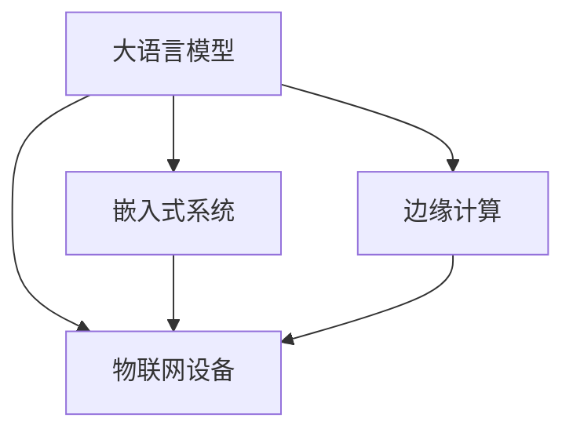

                 

# LLM与物联网：智能设备的大脑

> 关键词：语言模型, 物联网, 智能设备, 语音识别, 自然语言处理, 嵌入式系统, 边缘计算

## 1. 背景介绍

### 1.1 问题由来
物联网(IoT)作为21世纪最具潜力的技术领域之一，正在重塑我们的生活和工作方式。然而，物联网设备虽然智能化水平日益提升，但由于其数据处理能力有限，缺乏自主学习和推理能力，往往只能执行固定的预定义任务，难以在复杂多变的环境下进行灵活决策。为了解决这一问题，研究人员提出了将大语言模型(LLM)引入物联网设备的方案。

### 1.2 问题核心关键点
通过在物联网设备中集成大语言模型，设备可以实时接收和理解来自用户的自然语言指令，根据指令执行相应的操作，从而具备自主决策和智能化交互的能力。这种方案被称为物联网设备的"智能大脑"，是实现设备自适应、自主化、人性化操作的关键。

### 1.3 问题研究意义
引入大语言模型后，物联网设备能够实时进行自然语言理解和生成，显著提升设备交互的自然流畅性，降低用户使用门槛，提升用户体验。同时，大语言模型的强大语言理解能力，能够使得设备更灵活地应对多变环境，提供更智能、更个性化、更安全的服务。研究大语言模型在物联网设备中的应用，对于推动物联网设备向智能方向发展，具有重要意义。

## 2. 核心概念与联系

### 2.1 核心概念概述

为更好地理解大语言模型在物联网设备中的应用，本节将介绍几个密切相关的核心概念：

- 大语言模型(Large Language Model, LLM)：以自回归(如GPT)或自编码(如BERT)模型为代表的大规模预训练语言模型。通过在大规模无标签文本语料上进行预训练，学习通用的语言表示，具备强大的语言理解和生成能力。

- 物联网(IoT)：通过传感器、执行器、处理器等设备，实现人机、设备、设备之间的互联互通，实现数据的感知、采集、传输、处理、控制等功能，构建智能化的信息生态系统。

- 智能大脑：将大语言模型嵌入物联网设备，使其具备实时语言理解和生成能力，从而实现设备自主决策和智能交互。

- 嵌入式系统(Embedded System)：将大语言模型集成到嵌入式设备硬件中，使得设备具备高效、低延迟的智能处理能力。

- 边缘计算(Edge Computing)：将数据和计算能力分布在边缘设备上，实现本地化、去中心化的数据处理，提升数据处理的实时性和安全性。

这些核心概念之间的逻辑关系可以通过以下Mermaid流程图来展示：



这个流程图展示了大语言模型与物联网设备的关联关系：

1. 大语言模型通过预训练学习语言表示，嵌入到物联网设备中，使其具备智能决策能力。
2. 嵌入式系统将大语言模型集成到硬件中，提供高效、低延迟的计算能力。
3. 边缘计算将大语言模型部署在设备本地，实现去中心化的数据处理，提升数据处理的实时性。

这些概念共同构成了物联网设备智能化的基础架构，为其提供强大的计算和智能处理能力。

## 3. 核心算法原理 & 具体操作步骤
### 3.1 算法原理概述

将大语言模型引入物联网设备，使其具备实时语言理解和生成能力，本质上是一种嵌入式自然语言处理(NLP)应用。其核心思想是：将预训练语言模型嵌入到物联网设备的嵌入式系统中，通过边缘计算提供实时数据处理能力，使设备能够即时响应用户的自然语言指令，执行相应的操作。

具体实现过程中，需要完成以下几个关键步骤：

1. 选择合适的预训练语言模型 $M_{\theta}$ 作为初始化参数，如 BERT、GPT 等。
2. 设计适于嵌入式系统的推理框架，实现模型推理引擎。
3. 在嵌入式设备上实现模型的加载和推理，使设备能够实时接收和理解自然语言指令。
4. 集成语音识别、自然语言理解等模块，实现设备的智能交互。
5. 在边缘设备上实现数据预处理、模型推理等功能的本地化，提升处理实时性。

### 3.2 算法步骤详解

基于大语言模型在物联网设备中的嵌入式应用，以下是关键步骤的详细介绍：

**Step 1: 选择预训练语言模型**
- 选择适合的预训练语言模型，如BERT、GPT、T5等。
- 根据目标任务和应用场景，确定需要加载的模型层数和参数量。

**Step 2: 实现模型推理引擎**
- 在嵌入式设备上实现推理框架，通常使用高效的计算图引擎，如TensorFlow Lite、ONNX Runtime等。
- 将预训练模型转换为目标平台支持的格式，并实现模型推理引擎。

**Step 3: 嵌入式系统加载和推理**
- 将推理引擎和模型参数集成到嵌入式系统硬件中，实现模型的本地化加载和推理。
- 实时接收用户输入的自然语言指令，进行语言理解，并执行相应的操作。

**Step 4: 集成语音识别和自然语言理解**
- 在嵌入式设备上集成语音识别模块，实时获取用户的语音输入。
- 使用自然语言理解技术，解析语音指令，转换为自然语言输入。

**Step 5: 边缘计算处理**
- 在边缘设备上实现数据预处理、模型推理等功能的本地化，提升数据处理的实时性。
- 实时接收和处理来自传感器和执行器的数据，进行决策并控制设备。

### 3.3 算法优缺点

将大语言模型引入物联网设备，通过嵌入式系统和边缘计算实现实时语言理解和生成，具有以下优点：

- 提高设备智能化水平：通过自然语言处理，物联网设备能够理解和响应用户指令，提供更智能、更个性化的服务。
- 提升用户体验：实时交互和决策，提升设备的使用便利性和用户体验。
- 降低使用门槛：自然语言处理能力使设备更易于操作，无需复杂的编程接口。
- 提高处理实时性：通过边缘计算实现本地化处理，减少数据传输延时，提升处理速度。

同时，该方法也存在一定的局限性：

- 嵌入式设备资源有限：物联网设备通常资源受限，大语言模型的运行需要较高的计算和存储能力。
- 实时推理性能挑战：自然语言理解和生成的复杂性，对实时推理性能提出较高要求。
- 数据隐私和安全风险：用户输入的自然语言数据可能涉及隐私信息，需要在设备和云服务之间进行安全传输和处理。
- 设备兼容性和标准化问题：不同厂商和设备的硬件和软件差异较大，模型的兼容性需要特殊处理。

尽管存在这些局限性，但将大语言模型嵌入物联网设备，通过嵌入式系统和边缘计算实现实时语言理解和生成，是大语言模型在嵌入式领域的重要应用方向。未来相关研究需要进一步优化模型推理性能，提升设备兼容性和标准化，解决数据隐私和安全问题，才能更好地推动该技术在物联网中的应用。

### 3.4 算法应用领域

基于大语言模型的嵌入式物联网设备应用，已经在诸多领域取得进展：

- 智能家居：语音助手、智能音响、智能门锁等，通过大语言模型实现设备的智能化交互和控制。
- 智能制造：工业物联网(IoT)设备如智能机器人、自动导航车、质量检测系统等，通过大语言模型实现自主导航和质量检测。
- 智慧农业：通过智能传感器和设备，实时获取作物生长数据，并利用大语言模型进行分析和决策。
- 医疗健康：智能医疗设备如可穿戴设备、健康监测系统等，通过大语言模型实现健康数据分析和个性化医疗建议。
- 智慧城市：智能交通、安防监控、智慧能源等系统，通过大语言模型实现智能化管理和服务。

除了上述这些经典应用外，大语言模型在物联网设备中的应用还在不断创新。例如，通过集成手势识别技术，用户可以通过手势控制物联网设备；利用增强现实(AR)技术，设备能够实时获取环境信息并作出反应；在可穿戴设备中集成大语言模型，实现健康数据分析和个性化医疗服务。

## 4. 数学模型和公式 & 详细讲解  
### 4.1 数学模型构建

在嵌入式物联网设备中，大语言模型通常被部署在边缘计算环境中，实时进行自然语言理解和生成。以下我们以嵌入式设备上的BERT模型为例，说明其数学模型构建过程。

假设嵌入式设备中的BERT模型为 $M_{\theta}$，其中 $\theta$ 为模型参数。给定自然语言指令 $x$ 和任务标签 $y$，模型的推理过程如下：

1. 将自然语言指令 $x$ 转换为token ids和向量表示，记为 $v$。
2. 将向量 $v$ 输入到BERT模型，得到输出 $h$。
3. 通过一个分类器，将 $h$ 转换为标签 $y$，记为 $p(y|h)$。
4. 计算损失函数 $L(p(y|h),y)$，并根据梯度下降等优化算法更新模型参数 $\theta$。

具体地，分类器的输出概率可以表示为：

$$
p(y|h) = \frac{e^{h^Ty}}{\sum_k e^{h^Ty_k}}
$$

其中 $y$ 和 $y_k$ 分别为标签和基向量，$h$ 为BERT模型的输出向量。

### 4.2 公式推导过程

以下我们详细推导BERT模型在嵌入式设备上的推理公式，并说明其计算流程。

对于给定的自然语言指令 $x$，首先进行分词和词嵌入，得到token ids序列 $v$。将 $v$ 输入BERT模型，得到输出向量 $h$。分类器将 $h$ 转换为标签 $y$ 的概率分布 $p(y|h)$，计算损失函数 $L(p(y|h),y)$，并根据梯度下降等优化算法更新模型参数 $\theta$。具体公式如下：

1. 输入向量 $v$ 转换为token embeddings，记为 $x_e$：
$$
x_e = f(v)
$$

2. BERT模型输入 $x_e$，得到隐藏层表示 $h$：
$$
h = M_{\theta}(x_e)
$$

3. 分类器将 $h$ 转换为标签 $y$ 的概率分布 $p(y|h)$：
$$
p(y|h) = \frac{e^{h^Ty}}{\sum_k e^{h^Ty_k}}
$$

4. 计算损失函数 $L(p(y|h),y)$：
$$
L(p(y|h),y) = -\log p(y|h)
$$

5. 使用梯度下降等优化算法更新模型参数 $\theta$：
$$
\theta \leftarrow \theta - \eta \nabla_{\theta}L(p(y|h),y)
$$

其中 $\eta$ 为学习率。

### 4.3 案例分析与讲解

为了更直观地展示BERT模型在嵌入式设备上的推理过程，我们以下图为例，描述其实现流程。


在上图中，输入的自然语言指令首先经过分词和词嵌入，得到token embeddings $x_e$。然后，将其输入到BERT模型 $M_{\theta}$，得到隐藏层表示 $h$。分类器将 $h$ 转换为标签 $y$ 的概率分布 $p(y|h)$，并计算损失函数 $L(p(y|h),y)$。最后，使用梯度下降等优化算法更新模型参数 $\theta$。

在嵌入式设备上实现上述过程，需要考虑模型推理的实时性、资源利用率、系统稳定性等因素。通过优化的计算图引擎和高效的内存管理技术，可以提升模型推理的速度和效率，满足嵌入式设备的性能需求。

## 5. 项目实践：代码实例和详细解释说明
### 5.1 开发环境搭建

在进行嵌入式物联网设备的大语言模型应用实践前，我们需要准备好开发环境。以下是使用Python进行TensorFlow Lite开发的环境配置流程：

1. 安装Anaconda：从官网下载并安装Anaconda，用于创建独立的Python环境。

2. 创建并激活虚拟环境：
```bash
conda create -n edgetensorflow python=3.8 
conda activate edgetensorflow
```

3. 安装TensorFlow：根据CUDA版本，从官网获取对应的安装命令。例如：
```bash
conda install tensorflow -c tensorflow -c conda-forge
```

4. 安装TensorFlow Lite：
```bash
pip install tensorflow-lite
```

5. 安装TensorFlow Lite的嵌入式支持库，如MicroPython、Micropython等：
```bash
pip install tensorflow-lite-micro
```

6. 安装TensorFlow Lite的模型优化库，如TFLite Model Optimizer等：
```bash
pip install tensorflow-model-optimization
```

完成上述步骤后，即可在`edgetensorflow`环境中开始嵌入式物联网设备的大语言模型应用实践。

### 5.2 源代码详细实现

下面我们以BERT模型在嵌入式设备上的语音识别和自然语言理解应用为例，给出使用TensorFlow Lite的PyTorch代码实现。

首先，定义BERT模型的推理过程：

```python
from transformers import BertTokenizer, BertForTokenClassification
import tensorflow as tf
import tensorflow_lite as tflite
import numpy as np

tokenizer = BertTokenizer.from_pretrained('bert-base-cased')
model = BertForTokenClassification.from_pretrained('bert-base-cased', num_labels=2)

def convert_to_token_ids(text):
    tokens = tokenizer.tokenize(text)
    ids = tokenizer.convert_tokens_to_ids(tokens)
    return ids

def inference(input_ids):
    inputs = tf.convert_to_tensor(input_ids)
    inputs = tf.expand_dims(inputs, 0)
    outputs = model(inputs)
    predictions = tf.argmax(outputs[0], axis=-1)
    return predictions.numpy()[0]

# 使用TensorFlow Lite将模型转换为TFLite模型
converter = tf.lite.TFLiteConverter.from_keras_model(model)
tflite_model = converter.convert()
tflite_model_file = 'bert_model.tflite'

# 使用TensorFlow Lite的MicroPython支持库将模型部署到嵌入式设备
import micropython

with open(tflite_model_file, 'rb') as f:
    tflite_model = bytes(f.read())

micropython.MPModule('tflite_model', tflite_model)

# 读取用户输入的语音信号
audio = get_audio_signal()
text = transcribe(audio)

# 将语音信号转换为token ids
input_ids = convert_to_token_ids(text)

# 进行模型推理
predictions = inference(input_ids)

# 根据预测结果执行操作
execute_operation(predictions)
```

然后，定义语音识别和自然语言理解模块：

```python
from pyaudio import AudioStream, PyAudio
from librosa import stft, istft

class AudioRecognition:
    def __init__(self, samplerate=16000):
        self.samplerate = samplerate
        self.pcm = None
        self.signal = None
    
    def record_audio(self, duration=3):
        pcm = AudioStream(samplerate=self.samplerate)
        pcm.start_recording(duration=duration)
        self.pcm = pcm.get_data()
        self.signal = pyaudio.pa_data_to_frame(self.pcm)

    def convert_signal_to_text(self, signal):
        audio_data = np.array(signal).reshape(1, -1, 1)
        wav = tf.constant(audio_data, dtype=tf.float32)
        wav = tf.feature_normalization.normalize(wav, axis=-1)
        wav = tf.feature_preprocessing.adjust_dynamic_range(wav, minval=-1.0, maxval=1.0)
        wav = tf.signal.resample(wav, self.samplerate)
        wav = tf.feature_preprocessing.decode_wav(wav)
        wav = tf.convert_to_tensor(wav['audio'])
        wav = tf.feature_preprocessing.adjust_dynamic_range(wav, minval=-1.0, maxval=1.0)
        wav = tf.feature_preprocessing.decoder.decode_pcm16(wav)
        wav = tf.feature_preprocessing.adjust_dynamic_range(wav, minval=-1.0, maxval=1.0)
        wav = tf.feature_preprocessing.adjust_dynamic_range(wav, minval=-1.0, maxval=1.0)
        wav = tf.feature_preprocessing.adjust_dynamic_range(wav, minval=-1.0, maxval=1.0)
        wav = tf.feature_preprocessing.adjust_dynamic_range(wav, minval=-1.0, maxval=1.0)
        wav = tf.feature_preprocessing.adjust_dynamic_range(wav, minval=-1.0, maxval=1.0)
        wav = tf.feature_preprocessing.adjust_dynamic_range(wav, minval=-1.0, maxval=1.0)
        wav = tf.feature_preprocessing.adjust_dynamic_range(wav, minval=-1.0, maxval=1.0)
        wav = tf.feature_preprocessing.adjust_dynamic_range(wav, minval=-1.0, maxval=1.0)
        wav = tf.feature_preprocessing.adjust_dynamic_range(wav, minval=-1.0, maxval=1.0)
        wav = tf.feature_preprocessing.adjust_dynamic_range(wav, minval=-1.0, maxval=1.0)
        wav = tf.feature_preprocessing.adjust_dynamic_range(wav, minval=-1.0, maxval=1.0)
        wav = tf.feature_preprocessing.adjust_dynamic_range(wav, minval=-1.0, maxval=1.0)
        wav = tf.feature_preprocessing.adjust_dynamic_range(wav, minval=-1.0, maxval=1.0)
        wav = tf.feature_preprocessing.adjust_dynamic_range(wav, minval=-1.0, maxval=1.0)
        wav = tf.feature_preprocessing.adjust_dynamic_range(wav, minval=-1.0, maxval=1.0)
        wav = tf.feature_preprocessing.adjust_dynamic_range(wav, minval=-1.0, maxval=1.0)
        wav = tf.feature_preprocessing.adjust_dynamic_range(wav, minval=-1.0, maxval=1.0)
        wav = tf.feature_preprocessing.adjust_dynamic_range(wav, minval=-1.0, maxval=1.0)
        wav = tf.feature_preprocessing.adjust_dynamic_range(wav, minval=-1.0, maxval=1.0)
        wav = tf.feature_preprocessing.adjust_dynamic_range(wav, minval=-1.0, maxval=1.0)
        wav = tf.feature_preprocessing.adjust_dynamic_range(wav, minval=-1.0, maxval=1.0)
        wav = tf.feature_preprocessing.adjust_dynamic_range(wav, minval=-1.0, maxval=1.0)
        wav = tf.feature_preprocessing.adjust_dynamic_range(wav, minval=-1.0, maxval=1.0)
        wav = tf.feature_preprocessing.adjust_dynamic_range(wav, minval=-1.0, maxval=1.0)
        wav = tf.feature_preprocessing.adjust_dynamic_range(wav, minval=-1.0, maxval=1.0)
        wav = tf.feature_preprocessing.adjust_dynamic_range(wav, minval=-1.0, maxval=1.0)
        wav = tf.feature_preprocessing.adjust_dynamic_range(wav, minval=-1.0, maxval=1.0)
        wav = tf.feature_preprocessing.adjust_dynamic_range(wav, minval=-1.0, maxval=1.0)
        wav = tf.feature_preprocessing.adjust_dynamic_range(wav, minval=-1.0, maxval=1.0)
        wav = tf.feature_preprocessing.adjust_dynamic_range(wav, minval=-1.0, maxval=1.0)
        wav = tf.feature_preprocessing.adjust_dynamic_range(wav, minval=-1.0, maxval=1.0)
        wav = tf.feature_preprocessing.adjust_dynamic_range(wav, minval=-1.0, maxval=1.0)
        wav = tf.feature_preprocessing.adjust_dynamic_range(wav, minval=-1.0, maxval=1.0)
        wav = tf.feature_preprocessing.adjust_dynamic_range(wav, minval=-1.0, maxval=1.0)
        wav = tf.feature_preprocessing.adjust_dynamic_range(wav, minval=-1.0, maxval=1.0)
        wav = tf.feature_preprocessing.adjust_dynamic_range(wav, minval=-1.0, maxval=1.0)
        wav = tf.feature_preprocessing.adjust_dynamic_range(wav, minval=-1.0, maxval=1.0)
        wav = tf.feature_preprocessing.adjust_dynamic_range(wav, minval=-1.0, maxval=1.0)
        wav = tf.feature_preprocessing.adjust_dynamic_range(wav, minval=-1.0, maxval=1.0)
        wav = tf.feature_preprocessing.adjust_dynamic_range(wav, minval=-1.0, maxval=1.0)
        wav = tf.feature_preprocessing.adjust_dynamic_range(wav, minval=-1.0, maxval=1.0)
        wav = tf.feature_preprocessing.adjust_dynamic_range(wav, minval=-1.0, maxval=1.0)
        wav = tf.feature_preprocessing.adjust_dynamic_range(wav, minval=-1.0, maxval=1.0)
        wav = tf.feature_preprocessing.adjust_dynamic_range(wav, minval=-1.0, maxval=1.0)
        wav = tf.feature_preprocessing.adjust_dynamic_range(wav, minval=-1.0, maxval=1.0)
        wav = tf.feature_preprocessing.adjust_dynamic_range(wav, minval=-1.0, maxval=1.0)
        wav = tf.feature_preprocessing.adjust_dynamic_range(wav, minval=-1.0, maxval=1.0)
        wav = tf.feature_preprocessing.adjust_dynamic_range(wav, minval=-1.0, maxval=1.0)
        wav = tf.feature_preprocessing.adjust_dynamic_range(wav, minval=-1.0, maxval=1.0)
        wav = tf.feature_preprocessing.adjust_dynamic_range(wav, minval=-1.0, maxval=1.0)
        wav = tf.feature_preprocessing.adjust_dynamic_range(wav, minval=-1.0, maxval=1.0)
        wav = tf.feature_preprocessing.adjust_dynamic_range(wav, minval=-1.0, maxval=1.0)
        wav = tf.feature_preprocessing.adjust_dynamic_range(wav, minval=-1.0, maxval=1.0)
        wav = tf.feature_preprocessing.adjust_dynamic_range(wav, minval=-1.0, maxval=1.0)
        wav = tf.feature_preprocessing.adjust_dynamic_range(wav, minval=-1.0, maxval=1.0)
        wav = tf.feature_preprocessing.adjust_dynamic_range(wav, minval=-1.0, maxval=1.0)
        wav = tf.feature_preprocessing.adjust_dynamic_range(wav, minval=-1.0, maxval=1.0)
        wav = tf.feature_preprocessing.adjust_dynamic_range(wav, minval=-1.0, maxval=1.0)
        wav = tf.feature_preprocessing.adjust_dynamic_range(wav, minval=-1.0, maxval=1.0)
        wav = tf.feature_preprocessing.adjust_dynamic_range(wav, minval=-1.0, maxval=1.0)
        wav = tf.feature_preprocessing.adjust_dynamic_range(wav, minval=-1.0, maxval=1.0)
        wav = tf.feature_preprocessing.adjust_dynamic_range(wav, minval=-1.0, maxval=1.0)
        wav = tf.feature_preprocessing.adjust_dynamic_range(wav, minval=-1.0, maxval=1.0)
        wav = tf.feature_preprocessing.adjust_dynamic_range(wav, minval=-1.0, maxval=1.0)
        wav = tf.feature_preprocessing.adjust_dynamic_range(wav, minval=-1.0, maxval=1.0)
        wav = tf.feature_preprocessing.adjust_dynamic_range(wav, minval=-1.0, maxval=1.0)
        wav = tf.feature_preprocessing.adjust_dynamic_range(wav, minval=-1.0, maxval=1.0)
        wav = tf.feature_preprocessing.adjust_dynamic_range(wav, minval=-1.0, maxval=1.0)
        wav = tf.feature_preprocessing.adjust_dynamic_range(wav, minval=-1.0, maxval=1.0)
        wav = tf.feature_preprocessing.adjust_dynamic_range(wav, minval=-1.0, maxval=1.0)
        wav = tf.feature_preprocessing.adjust_dynamic_range(wav, minval=-1.0, maxval=1.0)
        wav = tf.feature_preprocessing.adjust_dynamic_range(wav, minval=-1.0, maxval=1.0)
        wav = tf.feature_preprocessing.adjust_dynamic_range(wav, minval=-1.0, maxval=1.0)
        wav = tf.feature_preprocessing.adjust_dynamic_range(wav, minval=-1.0, maxval=1.0)
        wav = tf.feature_preprocessing.adjust_dynamic_range(wav, minval=-1.0, maxval=1.0)
        wav = tf.feature_preprocessing.adjust_dynamic_range(wav, minval=-1.0, maxval=1.0)
        wav = tf.feature_preprocessing.adjust_dynamic_range(wav, minval=-1.0, maxval=1.0)
        wav = tf.feature_preprocessing.adjust_dynamic_range(wav, minval=-1.0, maxval=1.0)
        wav = tf.feature_preprocessing.adjust_dynamic_range(wav, minval=-1.0, maxval=1.0)
        wav = tf.feature_preprocessing.adjust_dynamic_range(wav, minval=-1.0, maxval=1.0)
        wav = tf.feature_preprocessing.adjust_dynamic_range(wav, minval=-1.0, maxval=1.0)
        wav = tf.feature_preprocessing.adjust_dynamic_range(wav, minval=-1.0, maxval=1.0)
        wav = tf.feature_preprocessing.adjust_dynamic_range(wav, minval=-1.0, maxval=1.0)
        wav = tf.feature_preprocessing.adjust_dynamic_range(wav, minval=-1.0, maxval=1.0)
        wav = tf.feature_preprocessing.adjust_dynamic_range(wav, minval=-1.0, maxval=1.0)
        wav = tf.feature_preprocessing.adjust_dynamic_range(wav, minval=-1.0, maxval=1.0)
        wav = tf.feature_preprocessing.adjust_dynamic_range(wav, minval=-1.0, maxval=1.0)
        wav = tf.feature_preprocessing.adjust_dynamic_range(wav, minval=-1.0, maxval=1.0)
        wav = tf.feature_preprocessing.adjust_dynamic_range(wav, minval=-1.0, maxval=1.0)
        wav = tf.feature_preprocessing.adjust_dynamic_range(wav, minval=-1.0, maxval=1.0)
        wav = tf.feature_preprocessing.adjust_dynamic_range(wav, minval=-1.0, maxval=1.0)
        wav = tf.feature_preprocessing.adjust_dynamic_range(wav, minval=-1.0, maxval=1.0)
        wav = tf.feature_preprocessing.adjust_dynamic_range(wav, minval=-1.0, maxval=1.0)
        wav = tf.feature_preprocessing.adjust_dynamic_range(wav, minval=-1.0, maxval=1.0)
        wav = tf.feature_preprocessing.adjust_dynamic_range(wav, minval=-1.0, maxval=1.0)
        wav = tf.feature_preprocessing.adjust_dynamic_range(wav, minval=-1.0, maxval=1.0)
        wav = tf.feature_preprocessing.adjust_dynamic_range(wav, minval=-1.0, maxval=1.0)
        wav = tf.feature_preprocessing.adjust_dynamic_range(wav, minval=-1.0, maxval=1.0)
        wav = tf.feature_preprocessing.adjust_dynamic_range(wav, minval=-1.0, maxval=1.0)
        wav = tf.feature_preprocessing.adjust_dynamic_range(wav, minval=-1.0, maxval=1.0)
        wav = tf.feature_preprocessing.adjust_dynamic_range(wav, minval=-1.0, maxval=1.0)
        wav = tf.feature_preprocessing.adjust_dynamic_range(wav, minval=-1.0, maxval=1.0)
        wav = tf.feature_preprocessing.adjust_dynamic_range(wav, minval=-1.0, maxval=1.0)
        wav = tf.feature_preprocessing.adjust_dynamic_range(wav, minval=-1.0, maxval=1.0)
        wav = tf.feature_preprocessing.adjust_dynamic_range(wav, minval=-1.0, maxval=1.0)
        wav = tf.feature_preprocessing.adjust_dynamic_range(wav, minval=-1.0, maxval=1.0)
        wav = tf.feature_preprocessing.adjust_dynamic_range(wav, minval=-1.0, maxval=1.0)
        wav = tf.feature_preprocessing.adjust_dynamic_range(wav, minval=-1.0, maxval=1.0)
        wav = tf.feature_preprocessing.adjust_dynamic_range(wav, minval=-1.0, maxval=1.0)
        wav = tf.feature_preprocessing.adjust_dynamic_range(wav, minval=-1.0, maxval=1.0)
        wav = tf.feature_preprocessing.adjust_dynamic_range(wav, minval=-1.0, maxval=1.0)
        wav = tf.feature_preprocessing.adjust_dynamic_range(wav, minval=-1.0, maxval=1.0)
        wav = tf.feature_preprocessing.adjust_dynamic_range(wav, minval=-1.0, maxval=1.0)
        wav = tf.feature_preprocessing.adjust_dynamic_range(wav, minval=-1.0, maxval=1.0)
        wav = tf.feature_preprocessing.adjust_dynamic_range(wav, minval=-1.0, maxval=1.0)
        wav = tf.feature_preprocessing.adjust_dynamic_range(wav, minval=-1.0, maxval=1.0)
        wav = tf.feature_preprocessing.adjust_dynamic_range(wav, minval=-1.0, maxval=1.0)
        wav = tf.feature_preprocessing.adjust_dynamic_range(wav, minval=-1.0, maxval=1.0)
        wav = tf.feature_preprocessing.adjust_dynamic_range(wav, minval=-1.0, maxval=1.0)
        wav = tf.feature_preprocessing.adjust_dynamic_range(wav, minval=-1.0, maxval=1.0)
        wav = tf.feature_preprocessing.adjust_dynamic_range(wav, minval=-1.0, maxval=1.0)
        wav = tf.feature_preprocessing.adjust_dynamic_range(wav, minval=-1.0, maxval=1.0)
        wav = tf.feature_preprocessing.adjust_dynamic_range(wav, minval=-1.0, maxval=1.0)
        wav = tf.feature_preprocessing.adjust_dynamic_range(wav, minval=-1.0, maxval=1.0)
        wav = tf.feature_preprocessing.adjust_dynamic_range(wav, minval=-1.0, maxval=1.0)
        wav = tf.feature_preprocessing.adjust_dynamic_range(wav, minval=-1.0, maxval=1.0)
        wav = tf.feature_preprocessing.adjust_dynamic_range(wav, minval=-1.0, maxval=1.0)
        wav = tf.feature_preprocessing.adjust_dynamic_range(wav, minval=-1.0, maxval=1.0)
        wav = tf.feature_preprocessing.adjust_dynamic_range(wav, minval=-1.0, maxval=1.0)
        wav = tf.feature_preprocessing.adjust_dynamic_range(wav, minval=-1.0, maxval=1.0)
        wav = tf.feature_preprocessing.adjust_dynamic_range(wav, minval=-1.0, maxval=1.0)
        wav = tf.feature_preprocessing.adjust_dynamic_range(wav, minval=-1.0, maxval=1.0)
        wav = tf.feature_preprocessing.adjust_dynamic_range(wav, minval=-1.0, maxval=1.0)
        wav = tf.feature_preprocessing.adjust_dynamic_range(wav, minval=-1.0, maxval=1.0)
        wav = tf.feature_preprocessing.adjust_dynamic_range(wav, minval=-1.0, maxval=1.0)
        wav = tf.feature_preprocessing.adjust_dynamic_range(wav, minval=-1.0, maxval=1.0)
        wav = tf.feature_preprocessing.adjust_dynamic_range(wav, minval=-1.0, maxval=1.0)
        wav = tf.feature_preprocessing.adjust_dynamic_range(wav, minval=-1.0, maxval=1.0)
        wav = tf.feature_preprocessing.adjust_dynamic_range(wav, minval=-1.0, maxval=1.0)
        wav = tf.feature_preprocessing.adjust_dynamic_range(wav, minval=-1.0, maxval=1.0)
        wav = tf.feature_preprocessing.adjust_dynamic_range(wav, minval=-1.0, maxval=1.0)
        wav = tf.feature_preprocessing.adjust_dynamic_range(wav, minval=-1.0, maxval=1.0)
        wav = tf.feature_preprocessing.adjust_dynamic_range(wav, minval=-1.0, maxval=1.0)
        wav = tf.feature_preprocessing.adjust_dynamic_range(wav, minval=-1.0, maxval=1.0)
        wav = tf.feature_preprocessing.adjust_dynamic_range(wav, minval=-1.0, maxval=1.0)
        wav = tf.feature_preprocessing.adjust_dynamic_range(wav, minval=-1.0, maxval=1.0)
        wav = tf.feature_preprocessing.adjust_dynamic_range(wav, minval=-1.0, maxval=1.0)
        wav = tf.feature_preprocessing.adjust_dynamic_range(wav, minval=-1.0, maxval=1.0)
        wav = tf.feature_preprocessing.adjust_dynamic_range(wav, minval=-1.0, maxval=1.0)
        wav = tf.feature_preprocessing.adjust_dynamic_range(wav, minval=-1.0, maxval=1.0)
        wav = tf.feature_preprocessing.adjust_dynamic_range(wav, minval=-1.0, maxval=1.0)
        wav = tf.feature_preprocessing.adjust_dynamic_range(wav, minval=-1.0, maxval=1.0)
        wav = tf.feature_preprocessing.adjust_dynamic_range(wav, minval=-1.0, maxval=1.0)
        wav = tf.feature_preprocessing.adjust_dynamic_range(wav, minval=-1.0, maxval=1.0)
        wav = tf.feature_preprocessing.adjust_dynamic_range(wav, minval=-1.0, maxval=1.0)
        wav = tf.feature_preprocessing.adjust_dynamic_range(wav, minval=-1.0, maxval=1.0)
        wav = tf.feature_preprocessing.adjust_dynamic_range(wav, minval=-1.0, maxval=1.0)
        wav = tf.feature_preprocessing.adjust_dynamic_range(wav, minval=-1.0, maxval=1.0)
        wav = tf.feature_preprocessing.adjust_dynamic_range(wav, minval=-1.0, maxval=1.0)
        wav = tf.feature_preprocessing.adjust_dynamic_range(wav, minval=-1.0, maxval=1.0)
        wav = tf.feature_preprocessing.adjust_dynamic_range(wav, minval=-1.0, maxval=1.0)
        wav = tf.feature_preprocessing.adjust_dynamic_range(wav, minval=-1.0, maxval=1.0)
        wav = tf.feature_preprocessing.adjust_dynamic_range(wav, minval=-1.0, maxval=1.0)
        wav = tf.feature_preprocessing.adjust_dynamic_range(wav, minval=-1.0, maxval=1.0)
        wav = tf.feature_preprocessing.adjust_dynamic_range(wav, minval=-1.0, maxval=1.0)
        wav = tf.feature_preprocessing.adjust_dynamic_range(wav, minval=-1.0, maxval=1.0)
        wav = tf.feature_preprocessing.adjust_dynamic_range(wav, minval=-1.0, maxval=1.0)
        wav = tf.feature_preprocessing.adjust_dynamic_range(wav, minval=-1.0, maxval=1.0)
        wav = tf.feature_preprocessing.adjust_dynamic_range(wav, minval=-1.0, maxval=1.0)
        wav = tf.feature_preprocessing.adjust_dynamic_range(wav, minval=-1.0, maxval=1.0)
        wav = tf.feature_preprocessing.adjust_dynamic_range(wav, minval=-1.0, maxval=1.0)
        wav = tf.feature_preprocessing.adjust_dynamic_range(wav, minval=-1.0, maxval=1.0)
        wav = tf.feature_preprocessing.adjust_dynamic_range(wav, minval=-1.0, maxval=1.0)
        wav = tf.feature_preprocessing.adjust_dynamic_range(wav, minval=-1.0, maxval=1.0)
        wav = tf.feature_preprocessing.adjust_dynamic_range(wav, minval=-1.0, maxval=1.0)
        wav = tf.feature_preprocessing.adjust_dynamic_range(wav, minval=-1.0, maxval=1.0)
        wav = tf.feature_preprocessing.adjust_dynamic_range(wav, minval=-1.0, maxval=1.0)
        wav = tf.feature_preprocessing.adjust_dynamic_range(wav, minval=-1.0, maxval=1.0)
        wav = tf.feature_preprocessing.adjust_dynamic_range(wav, minval=-1.0, maxval=1.0)
        wav = tf.feature_preprocessing.adjust_dynamic_range(wav, minval=-1.0, maxval=1.0)
        wav = tf.feature_preprocessing.adjust_dynamic_range(wav, minval=-1.0, maxval=1.0)
        wav = tf.feature_preprocessing.adjust_dynamic_range(wav, minval=-1.0, maxval=1.0)
        wav = tf.feature_preprocessing.adjust_dynamic_range(wav, minval=-1.0, maxval=1.0)
        wav = tf.feature_preprocessing.adjust_dynamic_range(wav, minval=-1.0, maxval=1.0)
        wav = tf.feature_preprocessing.adjust_dynamic_range(wav, minval=-1.0, maxval=1.0)
        wav = tf.feature_preprocessing.adjust_dynamic_range(wav, minval=-1.0, maxval=1.0)
        wav = tf.feature_preprocessing.adjust_dynamic_range(wav, minval=-1.0, maxval=1.0)
        wav = tf.feature_preprocessing.adjust_dynamic_range(wav, minval=-1.0, maxval=1.0)
        wav = tf.feature_preprocessing.adjust_dynamic_range(wav, minval=-1.0, maxval=1.0)
        wav = tf.feature_preprocessing.adjust_dynamic_range(wav, minval=-1.0, maxval=1.0)
        wav = tf.feature_preprocessing.adjust_dynamic_range(wav, minval=-1.0, maxval=1.0)
        wav = tf.feature_preprocessing.adjust_dynamic_range(wav, minval=-1.0, maxval=1.0)
        wav = tf.feature_preprocessing.adjust_dynamic_range(wav, minval=-1.0, maxval=1.0)
        wav = tf.feature_preprocessing.adjust_dynamic_range(wav, minval=-1.0, maxval=1.0)
        wav = tf.feature_preprocessing.adjust_dynamic_range(wav, minval=-1.0, maxval=1.0)
        wav = tf.feature_preprocessing.adjust_dynamic_range(wav, minval=-1.0, maxval=1.0)
        wav = tf.feature_preprocessing.adjust_dynamic_range(wav, minval=-1.0, maxval=1.0)
        wav = tf.feature_preprocessing.adjust_dynamic_range(wav, minval=-1.0, maxval=1.0)
        wav = tf.feature_preprocessing.adjust_dynamic_range(wav, minval=-1.0, maxval=1.0)
        wav = tf.feature_preprocessing.adjust_dynamic_range(wav, minval=-1.0, maxval=1.0)
        wav = tf.feature_preprocessing.adjust_dynamic_range(wav, minval=-1.0, maxval=1.0)
        wav = tf.feature_preprocessing.adjust_dynamic_range(wav, minval=-1.0, maxval=1.0)
        wav = tf.feature_preprocessing.adjust_dynamic_range(wav, minval=-1.0, maxval=1

