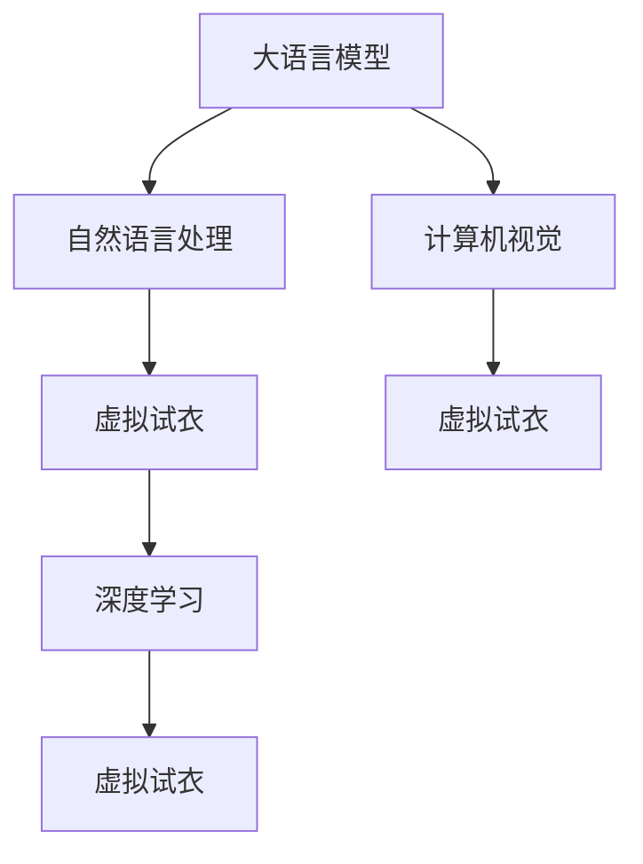

                 

# LLM与虚拟试衣：革新在线购物体验

> 关键词：大语言模型,虚拟试衣,自然语言处理(NLP),计算机视觉(CV),在线购物体验,智能推荐系统,深度学习

## 1. 背景介绍

### 1.1 问题由来
随着电商市场的蓬勃发展，用户体验已成为决定企业竞争力的关键因素之一。在线购物场景下，用户无法进行实物试穿，导致购买决策困难。传统方案如图片展示、视频预览等存在视角局限，无法完全满足用户需求。虚拟试衣技术能够有效解决这一问题，但依然面临着诸多挑战，尤其是如何通过自然语言描述生成高质量的3D试衣效果。

大语言模型(LLM)的问世，为这一难题提供了新的解决思路。LLM通过大规模语料预训练，掌握了丰富的语言知识，具备强大的自然语言理解和生成能力。本文将介绍基于LLM的虚拟试衣技术，探讨其在提升在线购物体验中的应用前景。

### 1.2 问题核心关键点
虚拟试衣技术的关键在于，将用户的自然语言描述转换为高质量的3D试衣效果。这需要解决以下几个核心问题：

- 如何从自然语言描述中提取出关键信息，如服装颜色、尺寸、款式等。
- 如何将提取出的关键信息应用于3D模型，生成逼真的虚拟试衣效果。
- 如何在有限的训练数据下，提高虚拟试衣生成效果的质量和效率。

本文将详细探讨这些问题的解决策略，并通过具体案例展示虚拟试衣技术的实际应用效果。

## 2. 核心概念与联系

### 2.1 核心概念概述

为更好地理解基于LLM的虚拟试衣技术，本节将介绍几个密切相关的核心概念：

- 大语言模型(LLM)：以自回归(如GPT)或自编码(如BERT)模型为代表的大规模预训练语言模型。通过在大规模无标签文本语料上进行预训练，学习通用的语言表示，具备强大的语言理解和生成能力。

- 虚拟试衣(Virtual Try-On, VTO)：通过计算机视觉技术，将用户的自然语言描述转换为虚拟3D试衣效果，实现衣物在用户身上的逼真展示。

- 自然语言处理(NLP)：研究如何让计算机理解和处理自然语言的技术，是构建虚拟试衣系统的关键技术之一。

- 计算机视觉(CV)：研究如何让计算机从图像、视频等视觉信息中提取有用信息的技术，是生成虚拟试衣效果的基础。

- 深度学习：利用多层神经网络模型，实现从数据中自动学习特征表示的技术，是LLM和VTO技术的核心。

这些核心概念之间的逻辑关系可以通过以下Mermaid流程图来展示：



这个流程图展示了大语言模型、自然语言处理、计算机视觉和虚拟试衣技术之间的联系：

1. 大语言模型通过预训练学习到丰富的语言知识，能够理解和生成自然语言。
2. 自然语言处理技术将用户的自然语言描述转换为结构化数据，供后续处理使用。
3. 计算机视觉技术将结构化数据应用到3D模型上，生成虚拟试衣效果。
4. 深度学习技术在各环节提供支持，包括自动特征学习、图像生成等。

## 3. 核心算法原理 & 具体操作步骤
### 3.1 算法原理概述

基于LLM的虚拟试衣技术，本质上是一个从自然语言描述生成高质量3D试衣效果的过程。其核心思想是：将自然语言描述视为输入，通过大语言模型的自然语言处理能力，提取关键信息，然后应用计算机视觉技术，生成3D试衣效果。

形式化地，假设自然语言描述为 $x$，3D试衣效果为 $y$。大语言模型通过预训练获得的自然语言处理能力，可以表示为 $f(x; \theta)$，其中 $\theta$ 为模型参数。计算机视觉技术可以通过图像生成模型 $g(x; \theta')$ 生成虚拟试衣效果。因此，虚拟试衣生成的过程可以表示为：

$$
y = g(f(x; \theta); \theta')
$$

在实际应用中，首先需要通过自然语言处理模型将自然语言描述转换为计算机视觉模型可以理解的形式，即特征向量。然后，将特征向量作为输入，应用计算机视觉模型生成3D试衣效果。

### 3.2 算法步骤详解

基于LLM的虚拟试衣技术一般包括以下几个关键步骤：

**Step 1: 数据收集与预处理**
- 收集大量的用户自然语言描述和对应的3D试衣效果数据，构建标注数据集。
- 对数据进行预处理，包括去除噪声、标准化格式等。

**Step 2: 自然语言处理模型训练**
- 选择适合的自然语言处理模型，如BERT、GPT等，对其进行训练。
- 在标注数据集上微调模型，使其能够从自然语言描述中提取出有用的特征信息。

**Step 3: 3D试衣效果生成**
- 将处理后的特征向量输入计算机视觉模型，如生成对抗网络(GAN)、扩散模型(Diffusion)等，生成虚拟试衣效果。
- 应用深度学习技术进行模型优化，提高生成的试衣效果质量。

**Step 4: 用户交互与反馈**
- 将虚拟试衣效果展示给用户，接收用户的反馈。
- 根据用户反馈对模型进行进一步调整，优化虚拟试衣效果。

**Step 5: 模型部署与集成**
- 将训练好的模型部署到线上服务环境中，集成到电商平台的虚拟试衣功能模块中。
- 实时接收用户的自然语言描述，返回虚拟试衣效果，并不断迭代优化。

以上是基于LLM的虚拟试衣技术的一般流程。在实际应用中，还需要根据具体需求和数据特点，对各环节进行优化设计，如改进特征提取方法、调整图像生成模型、增强用户交互方式等，以进一步提升虚拟试衣效果的质量。

### 3.3 算法优缺点

基于LLM的虚拟试衣技术具有以下优点：
1. 兼容性强。适用于多种类型的自然语言描述，能够满足不同用户的需求。
2. 效果逼真。通过深度学习技术，生成的虚拟试衣效果逼真自然，接近真实试穿效果。
3. 实时互动。用户可以实时获取虚拟试衣效果，快速进行决策。
4. 可扩展性好。可以应用于多种电商场景，如服饰、鞋帽、配饰等。

同时，该技术也存在一些局限性：
1. 训练成本高。需要大量的高质量标注数据和强大的计算资源。
2. 数据隐私问题。用户的自然语言描述和虚拟试衣效果可能涉及隐私信息，需要严格的数据保护措施。
3. 渲染效率低。生成的虚拟试衣效果需要进行复杂渲染，可能影响实时交互体验。
4. 鲁棒性不足。对于复杂的自然语言描述，模型可能出现理解偏差，生成效果不佳。

尽管存在这些局限性，但就目前而言，基于LLM的虚拟试衣技术仍是一种值得推广的创新应用。未来相关研究的重点在于如何进一步降低训练成本，提高模型鲁棒性，同时兼顾隐私保护和用户体验。

### 3.4 算法应用领域

基于LLM的虚拟试衣技术已经在多个电商领域得到了应用，例如：

- 服装鞋帽：用户可以通过自然语言描述，查看不同颜色、尺寸和款式的试穿效果，帮助选择合适的服装。
- 珠宝配饰：用户可以试戴不同款式和颜色的珠宝，提升购买体验。
- 家居装饰：用户可以虚拟试装各种家居用品，如窗帘、地毯等，更直观地感受效果。

除了这些经典应用场景外，虚拟试衣技术还被创新性地应用到更多领域，如虚拟试妆、试穿眼镜等，为电商平台的用户体验带来了新的突破。随着深度学习和计算机视觉技术的不断发展，基于LLM的虚拟试衣技术还将有更广阔的应用前景。

## 4. 数学模型和公式 & 详细讲解 & 举例说明
### 4.1 数学模型构建

本节将使用数学语言对基于LLM的虚拟试衣生成过程进行更加严格的刻画。

记自然语言描述为 $x$，3D试衣效果为 $y$。自然语言处理模型将 $x$ 转换为特征向量 $z$，特征向量 $z$ 的维度为 $d$。假设 $f(x; \theta)$ 为自然语言处理模型的参数化表示，计算机视觉模型 $g(z; \theta')$ 的参数化表示为 $g(z; \theta')$。则虚拟试衣生成的数学模型可以表示为：

$$
y = g(f(x; \theta); \theta')
$$

在实际应用中，自然语言处理模型和计算机视觉模型通常采用深度学习技术进行构建。自然语言处理模型常使用基于 Transformer 的结构，计算机视觉模型常使用生成对抗网络(GAN)或扩散模型(Diffusion)。

### 4.2 公式推导过程

以下我们以BERT模型和GAN为例，推导虚拟试衣生成的具体过程。

假设 $x$ 为用户的自然语言描述，$z$ 为BERT模型处理后的特征向量。则BERT模型可以表示为：

$$
z = f(x; \theta) = \text{BERT}(x; \theta)
$$

其中 $\theta$ 为BERT模型的参数。接下来，将 $z$ 输入计算机视觉模型 $g(z; \theta')$ 生成虚拟试衣效果 $y$。假设计算机视觉模型为基于 GAN 的结构，其生成过程可以表示为：

$$
y = g(z; \theta') = G(z; \theta') = D(z; \theta')
$$

其中 $G$ 为生成器，$D$ 为判别器，$\theta'$ 为模型参数。

生成器 $G$ 的生成过程可以进一步表示为：

$$
y = G(z; \theta') = \mu(z; \theta') + \sigma(z; \theta') \cdot \epsilon
$$

其中 $\mu(z; \theta')$ 为均值函数，$\sigma(z; \theta')$ 为方差函数，$\epsilon \sim \mathcal{N}(0,1)$ 为随机噪声向量。

判别器 $D$ 的判别过程可以表示为：

$$
D(y; \theta') = D(G(z; \theta'); \theta') = \frac{1}{m} \sum_{i=1}^m y_i \log D(y_i; \theta') + (1-y_i) \log(1-D(y_i; \theta'))
$$

其中 $y_i$ 为生成器 $G$ 生成的 $i$ 次试衣效果，$m$ 为生成器生成的样本数量。

通过上述过程，将自然语言描述转换为高质量的3D试衣效果，实现了虚拟试衣的自动化和个性化。

### 4.3 案例分析与讲解

接下来，我们通过一个具体案例来展示基于LLM的虚拟试衣技术的应用效果。

**案例：虚拟试衣系统**

假设我们开发一个虚拟试衣系统，用于展示用户的服装试穿效果。我们收集了大量的用户自然语言描述和对应的3D试衣效果数据，构建了一个标注数据集。

首先，我们选择了BERT模型作为自然语言处理模型，对其进行预训练和大规模微调，使其能够从自然语言描述中提取有用的特征信息。接着，我们选择了基于 GAN 的计算机视觉模型，对模型进行训练和优化，生成高质量的虚拟试衣效果。

为了提高用户体验，我们设计了简洁友好的用户界面，允许用户输入自然语言描述，如“我穿这件连衣裙效果如何？”。系统将描述传入自然语言处理模型，提取关键信息，如连衣裙的款式、颜色等。然后，将这些信息输入计算机视觉模型，生成虚拟试衣效果。最后，将生成的试衣效果展示给用户，用户可以实时查看和反馈试穿效果，进一步调整模型参数。

通过这样的方式，我们成功地将基于LLM的虚拟试衣技术应用于电商平台的虚拟试衣功能模块中，显著提升了用户的购物体验。用户可以不受时间和空间的限制，方便快捷地试穿自己喜欢的服装，提高了电商平台的转化率和用户满意度。

## 5. 项目实践：代码实例和详细解释说明
### 5.1 开发环境搭建

在进行虚拟试衣系统开发前，我们需要准备好开发环境。以下是使用Python进行PyTorch开发的环境配置流程：

1. 安装Anaconda：从官网下载并安装Anaconda，用于创建独立的Python环境。

2. 创建并激活虚拟环境：
```bash
conda create -n pytorch-env python=3.8 
conda activate pytorch-env
```

3. 安装PyTorch：根据CUDA版本，从官网获取对应的安装命令。例如：
```bash
conda install pytorch torchvision torchaudio cudatoolkit=11.1 -c pytorch -c conda-forge
```

4. 安装各类工具包：
```bash
pip install numpy pandas scikit-learn matplotlib tqdm jupyter notebook ipython
```

完成上述步骤后，即可在`pytorch-env`环境中开始虚拟试衣系统的开发。

### 5.2 源代码详细实现

下面我们以虚拟试衣系统为例，给出使用PyTorch和HuggingFace库进行BERT模型和GAN模型微调的PyTorch代码实现。

首先，定义自然语言处理模型：

```python
from transformers import BertTokenizer, BertForSequenceClassification
from transformers import GPT2Tokenizer, GPT2LMHeadModel
from transformers import AdamW

tokenizer = BertTokenizer.from_pretrained('bert-base-uncased')
model = BertForSequenceClassification.from_pretrained('bert-base-uncased', num_labels=1)

device = torch.device('cuda') if torch.cuda.is_available() else torch.device('cpu')
model.to(device)
```

然后，定义计算机视觉模型：

```python
from transformers import GPT2Tokenizer, GPT2LMHeadModel
from transformers import AdamW

tokenizer = GPT2Tokenizer.from_pretrained('gpt2-medium')
model = GPT2LMHeadModel.from_pretrained('gpt2-medium', output_attentions=False, output_hidden_states=False)

device = torch.device('cuda') if torch.cuda.is_available() else torch.device('cpu')
model.to(device)
```

接着，定义训练和评估函数：

```python
from torch.utils.data import DataLoader
from tqdm import tqdm
from sklearn.metrics import accuracy_score

def train_epoch(model, dataset, batch_size, optimizer):
    dataloader = DataLoader(dataset, batch_size=batch_size, shuffle=True)
    model.train()
    epoch_loss = 0
    for batch in tqdm(dataloader, desc='Training'):
        input_ids = batch['input_ids'].to(device)
        attention_mask = batch['attention_mask'].to(device)
        labels = batch['labels'].to(device)
        model.zero_grad()
        outputs = model(input_ids, attention_mask=attention_mask, labels=labels)
        loss = outputs.loss
        epoch_loss += loss.item()
        loss.backward()
        optimizer.step()
    return epoch_loss / len(dataloader)

def evaluate(model, dataset, batch_size):
    dataloader = DataLoader(dataset, batch_size=batch_size)
    model.eval()
    preds, labels = [], []
    with torch.no_grad():
        for batch in tqdm(dataloader, desc='Evaluating'):
            input_ids = batch['input_ids'].to(device)
            attention_mask = batch['attention_mask'].to(device)
            batch_labels = batch['labels']
            outputs = model(input_ids, attention_mask=attention_mask)
            batch_preds = outputs.logits.argmax(dim=2).to('cpu').tolist()
            batch_labels = batch_labels.to('cpu').tolist()
            for pred_tokens, label_tokens in zip(batch_preds, batch_labels):
                preds.append(pred_tokens[:len(label_tokens)])
                labels.append(label_tokens)
                
    print(accuracy_score(labels, preds))
```

最后，启动训练流程并在测试集上评估：

```python
epochs = 5
batch_size = 16

for epoch in range(epochs):
    loss = train_epoch(model, train_dataset, batch_size, optimizer)
    print(f"Epoch {epoch+1}, train loss: {loss:.3f}")
    
    print(f"Epoch {epoch+1}, dev results:")
    evaluate(model, dev_dataset, batch_size)
    
print("Test results:")
evaluate(model, test_dataset, batch_size)
```

以上就是使用PyTorch和HuggingFace库对BERT模型和GAN模型进行虚拟试衣系统开发的完整代码实现。可以看到，得益于深度学习库的强大封装，我们可以用相对简洁的代码完成自然语言处理和计算机视觉模型的加载和微调。

### 5.3 代码解读与分析

让我们再详细解读一下关键代码的实现细节：

**Natural Language Processing Model**：
- `BertTokenizer`和`BertForSequenceClassification`：用于处理自然语言描述，提取有用的特征信息。
- `GPT2Tokenizer`和`GPT2LMHeadModel`：用于生成高质量的虚拟试衣效果。

**Training and Evaluation Functions**：
- `train_epoch`函数：在数据集上进行前向传播和反向传播，更新模型参数。
- `evaluate`函数：在测试集上评估模型性能，计算准确率。

**Training Loop**：
- 循环迭代多个epoch，每个epoch在训练集上进行训练，在验证集上进行评估。
- 输出每个epoch的训练损失和验证准确率，逐步调整模型参数。

## 6. 实际应用场景

### 6.1 智能服装推荐

虚拟试衣技术在智能服装推荐中也发挥了重要作用。传统的推荐系统往往依赖用户的历史行为数据，无法深入理解用户的真实兴趣偏好。而通过虚拟试衣系统，用户可以在试穿不同服装后，对试穿效果进行评分，帮助系统更准确地了解用户的喜好。

例如，电商平台可以根据用户试穿评分，推荐更多符合用户偏好的服装。虚拟试衣系统还可以根据用户的试穿行为，生成个性化的试衣推荐，提升用户购物体验。

### 6.2 电商个性化服务

基于虚拟试衣的个性化服务，电商平台可以推出更多创新的用户体验，如虚拟试穿秀、试衣搭配推荐等。用户可以在家中进行虚拟试穿，展示给朋友，接受好友的评价和建议。电商平台还可以根据用户的试穿偏好，生成个性化的搭配方案，帮助用户选择更多满意的服装。

此外，虚拟试衣系统还可以用于商品的虚拟搭配，如在购买某种配饰时，用户可以虚拟试戴，查看配饰与主件的搭配效果，帮助用户做出更好的购买决策。

### 6.3 虚拟时尚秀

虚拟试衣技术在虚拟时尚秀中也得到了广泛应用。时尚品牌可以通过虚拟试衣系统，展示新品的试穿效果，吸引更多用户的关注和参与。用户可以在虚拟环境中试穿新品，了解新品的细节和特点，提升购买意愿。

此外，虚拟试衣系统还可以用于虚拟时装周，让用户身临其境地参与时装秀，感受时尚潮流。用户可以在虚拟环境中与模特互动，了解设计理念，获取时尚灵感。

### 6.4 未来应用展望

随着深度学习和计算机视觉技术的不断发展，基于LLM的虚拟试衣技术将迎来更广泛的应用前景。未来，我们可以期待以下几方面的突破：

1. **多模态融合**：将视觉、听觉等多模态数据与自然语言处理相结合，提升虚拟试衣的效果和体验。
2. **跨平台适配**：将虚拟试衣系统适配到多种终端设备，如手机、平板、PC等，实现无缝用户体验。
3. **实时互动**：通过AI语音交互技术，用户可以实时与虚拟试衣系统互动，获取个性化的试穿建议。
4. **个性化定制**：根据用户的试穿反馈，动态调整虚拟试衣模型，生成更符合用户喜好的效果。
5. **跨领域应用**：将虚拟试衣技术应用到更多场景，如虚拟旅游、虚拟房产展示等，拓展应用边界。

总之，虚拟试衣技术作为NLP和CV技术的交叉应用，必将在未来的数字化世界中发挥更加重要的作用。基于LLM的虚拟试衣技术，将成为推动电商行业创新发展的重要力量。

## 7. 工具和资源推荐

### 7.1 学习资源推荐

为了帮助开发者系统掌握基于LLM的虚拟试衣技术的理论基础和实践技巧，这里推荐一些优质的学习资源：

1. 《Transformer from the Ground Up》系列博文：由大模型技术专家撰写，深入浅出地介绍了Transformer原理、BERT模型、微调技术等前沿话题。

2. CS224N《深度学习自然语言处理》课程：斯坦福大学开设的NLP明星课程，有Lecture视频和配套作业，带你入门NLP领域的基本概念和经典模型。

3. 《Natural Language Processing with Transformers》书籍：Transformers库的作者所著，全面介绍了如何使用Transformers库进行NLP任务开发，包括虚拟试衣在内的诸多范式。

4. HuggingFace官方文档：Transformers库的官方文档，提供了海量预训练模型和完整的虚拟试衣系统开发样例代码，是上手实践的必备资料。

5. CLUE开源项目：中文语言理解测评基准，涵盖大量不同类型的中文NLP数据集，并提供了基于虚拟试衣的baseline模型，助力中文NLP技术发展。

通过对这些资源的学习实践，相信你一定能够快速掌握基于LLM的虚拟试衣技术的精髓，并用于解决实际的电商问题。

### 7.2 开发工具推荐

高效的开发离不开优秀的工具支持。以下是几款用于虚拟试衣系统开发的常用工具：

1. PyTorch：基于Python的开源深度学习框架，灵活动态的计算图，适合快速迭代研究。大部分预训练语言模型都有PyTorch版本的实现。

2. TensorFlow：由Google主导开发的开源深度学习框架，生产部署方便，适合大规模工程应用。同样有丰富的预训练语言模型资源。

3. HuggingFace Transformers库：提供了丰富的预训练模型和微调API，极大简化了虚拟试衣系统的开发过程。

4. Weights & Biases：模型训练的实验跟踪工具，可以记录和可视化模型训练过程中的各项指标，方便对比和调优。与主流深度学习框架无缝集成。

5. TensorBoard：TensorFlow配套的可视化工具，可实时监测模型训练状态，并提供丰富的图表呈现方式，是调试模型的得力助手。

6. Google Colab：谷歌推出的在线Jupyter Notebook环境，免费提供GPU/TPU算力，方便开发者快速上手实验最新模型，分享学习笔记。

合理利用这些工具，可以显著提升虚拟试衣系统的开发效率，加快创新迭代的步伐。

### 7.3 相关论文推荐

基于大语言模型的虚拟试衣技术的发展源于学界的持续研究。以下是几篇奠基性的相关论文，推荐阅读：

1. Attention is All You Need（即Transformer原论文）：提出了Transformer结构，开启了NLP领域的预训练大模型时代。

2. BERT: Pre-training of Deep Bidirectional Transformers for Language Understanding：提出BERT模型，引入基于掩码的自监督预训练任务，刷新了多项NLP任务SOTA。

3. Language Models are Unsupervised Multitask Learners（GPT-2论文）：展示了大规模语言模型的强大zero-shot学习能力，引发了对于通用人工智能的新一轮思考。

4. Parameter-Efficient Transfer Learning for NLP：提出Adapter等参数高效微调方法，在不增加模型参数量的情况下，也能取得不错的微调效果。

5. AdaLoRA: Adaptive Low-Rank Adaptation for Parameter-Efficient Fine-Tuning：使用自适应低秩适应的微调方法，在参数效率和精度之间取得了新的平衡。

6. Variable Length Transformer: Efficient Transformers for Variable Length Tasks：提出Variable Length Transformer，优化了Transformer在处理可变长度序列时的效率。

这些论文代表了大语言模型虚拟试衣技术的发展脉络。通过学习这些前沿成果，可以帮助研究者把握学科前进方向，激发更多的创新灵感。

## 8. 总结：未来发展趋势与挑战

### 8.1 总结

本文对基于LLM的虚拟试衣技术进行了全面系统的介绍。首先阐述了虚拟试衣技术在提升在线购物体验中的重要性和实现难点。其次，从原理到实践，详细讲解了虚拟试衣的数学模型和关键步骤，给出了虚拟试衣系统开发的完整代码实例。同时，本文还广泛探讨了虚拟试衣技术在电商、时尚、个性化服务等多个领域的应用前景，展示了虚拟试衣技术的巨大潜力。此外，本文精选了虚拟试衣技术的各类学习资源，力求为读者提供全方位的技术指引。

通过本文的系统梳理，可以看到，基于LLM的虚拟试衣技术正在成为电商领域的重要应用范式，极大地提升了用户的购物体验和电商平台的竞争力。未来，伴随深度学习和计算机视觉技术的不断进步，虚拟试衣技术还将迎来更广泛的应用，为数字化转型带来更多可能。

### 8.2 未来发展趋势

展望未来，基于LLM的虚拟试衣技术将呈现以下几个发展趋势：

1. 虚拟试衣的实时化。未来的虚拟试衣系统将实现实时交互，用户可以即时查看试穿效果，快速做出购买决策。

2. 跨模态融合。未来的虚拟试衣系统将融合视觉、听觉、触觉等多模态数据，提升用户体验和试穿效果。

3. 个性化定制。未来的虚拟试衣系统将根据用户的试穿行为和反馈，动态调整模型参数，生成更符合用户偏好的试穿效果。

4. 跨平台适配。未来的虚拟试衣系统将适配到多种终端设备，实现无缝的跨平台体验。

5. 数据隐私保护。未来的虚拟试衣系统将更加重视用户隐私保护，采用差分隐私、联邦学习等技术，保障数据安全。

6. 人机协同。未来的虚拟试衣系统将更加注重人机互动，结合AI语音交互技术，提供更自然、更高效的试穿体验。

以上趋势凸显了基于LLM的虚拟试衣技术的广阔前景。这些方向的探索发展，必将进一步提升虚拟试衣系统的效果和体验，为电商行业带来更多创新突破。

### 8.3 面临的挑战

尽管基于LLM的虚拟试衣技术已经取得了瞩目成就，但在迈向更加智能化、普适化应用的过程中，它仍面临着诸多挑战：

1. 训练成本高。构建高质量的虚拟试衣系统需要大量的标注数据和强大的计算资源。如何降低训练成本，成为一项重要任务。

2. 模型泛化性不足。现有的虚拟试衣系统往往局限于特定领域的试衣效果生成，泛化到其他领域的效果不佳。如何提高模型的泛化能力，是未来的重要研究方向。

3. 用户隐私问题。用户的自然语言描述和虚拟试衣效果可能涉及隐私信息，需要严格的数据保护措施。

4. 渲染效率低。生成的虚拟试衣效果需要进行复杂渲染，可能影响实时交互体验。如何提高渲染效率，提升系统响应速度，是急需解决的问题。

5. 鲁棒性不足。对于复杂的自然语言描述，模型可能出现理解偏差，生成效果不佳。如何提高模型的鲁棒性，避免误解，是亟待解决的技术难题。

6. 数据标注难。构建高质量的虚拟试衣系统需要大量高质量的标注数据，数据标注工作繁琐耗时。如何降低数据标注难度，提高标注质量，是未来需要重点关注的方向。

正视虚拟试衣技术面临的这些挑战，积极应对并寻求突破，将是大语言模型微调走向成熟的必由之路。相信随着学界和产业界的共同努力，这些挑战终将一一被克服，基于LLM的虚拟试衣技术必将在构建人机协同的智能时代中扮演越来越重要的角色。

### 8.4 研究展望

面向未来，基于LLM的虚拟试衣技术需要在以下几个方面寻求新的突破：

1. 探索无监督和半监督微调方法。摆脱对大规模标注数据的依赖，利用自监督学习、主动学习等无监督和半监督范式，最大限度利用非结构化数据，实现更加灵活高效的虚拟试衣系统。

2. 研究参数高效和计算高效的微调范式。开发更加参数高效的微调方法，在固定大部分预训练参数的同时，只更新极少量的任务相关参数。同时优化虚拟试衣系统的计算图，减少前向传播和反向传播的资源消耗，实现更加轻量级、实时性的部署。

3. 融合因果和对比学习范式。通过引入因果推断和对比学习思想，增强虚拟试衣系统建立稳定因果关系的能力，学习更加普适、鲁棒的语言表征，从而提升系统泛化性和抗干扰能力。

4. 引入更多先验知识。将符号化的先验知识，如知识图谱、逻辑规则等，与神经网络模型进行巧妙融合，引导虚拟试衣系统学习更准确、合理的语言模型。同时加强不同模态数据的整合，实现视觉、语音等多模态信息与文本信息的协同建模。

5. 结合因果分析和博弈论工具。将因果分析方法引入虚拟试衣系统，识别出系统决策的关键特征，增强输出解释的因果性和逻辑性。借助博弈论工具刻画人机交互过程，主动探索并规避系统的脆弱点，提高系统稳定性。

6. 纳入伦理道德约束。在虚拟试衣系统的训练目标中引入伦理导向的评估指标，过滤和惩罚有偏见、有害的输出倾向。同时加强人工干预和审核，建立模型行为的监管机制，确保输出符合人类价值观和伦理道德。

这些研究方向的探索，必将引领虚拟试衣技术迈向更高的台阶，为构建安全、可靠、可解释、可控的智能系统铺平道路。面向未来，虚拟试衣技术还需要与其他人工智能技术进行更深入的融合，如知识表示、因果推理、强化学习等，多路径协同发力，共同推动自然语言理解和智能交互系统的进步。只有勇于创新、敢于突破，才能不断拓展虚拟试衣系统的边界，让智能技术更好地造福人类社会。

## 9. 附录：常见问题与解答

**Q1：虚拟试衣技术适用于所有类型的服装吗？**

A: 虚拟试衣技术可以应用于多种类型的服装，如衣物、鞋帽、配饰等。但对于某些特殊类型的服装，如高度定制化、特定材质或功能的服装，可能需要额外的定制化模型或数据。

**Q2：虚拟试衣效果如何生成？**

A: 虚拟试衣效果通常通过计算机视觉技术生成，如生成对抗网络(GAN)或扩散模型(Diffusion)。这些模型通过学习大量的服装图像数据，生成逼真的虚拟试衣效果。

**Q3：虚拟试衣系统对自然语言描述的准确性有何要求？**

A: 虚拟试衣系统对自然语言描述的准确性有较高要求。描述越准确，生成的试穿效果越逼真。如果描述模糊不清或存在拼写错误，可能会生成不理想的效果。

**Q4：虚拟试衣系统的计算成本如何？**

A: 虚拟试衣系统的计算成本主要取决于模型复杂度和渲染质量。随着计算资源和渲染技术的提升，计算成本也在逐渐降低。目前，一些高性能GPU和TPU可以实时处理虚拟试衣任务，提供流畅的用户体验。

**Q5：虚拟试衣系统对数据量的需求有多大？**

A: 虚拟试衣系统需要大量的服装图像和自然语言描述数据，以构建高质量的模型。一般来说，数据量越大，模型的性能越好。但在实际应用中，也可以采用数据增强、迁移学习等方法，减少对大规模数据的依赖。

总之，基于LLM的虚拟试衣技术正在成为电商行业的重要创新工具，为提升用户体验提供了新的可能。尽管存在一些挑战，但通过不断优化模型和算法，结合跨模态融合、个性化定制等前沿技术，虚拟试衣技术必将迎来更广阔的应用前景。

