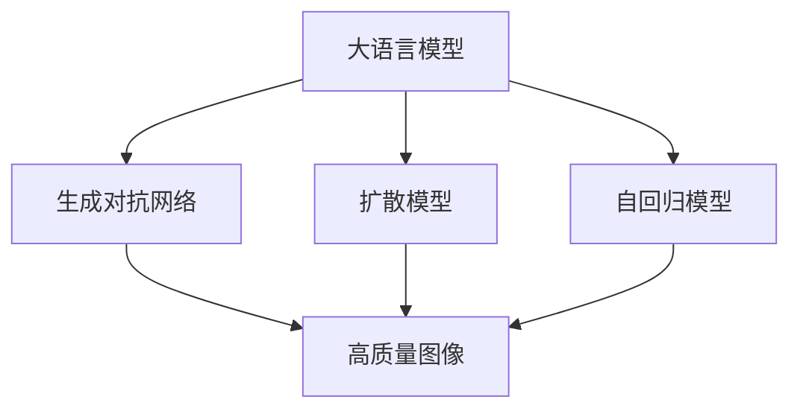

                 

# LLM图像生成:视觉智能新高度

> 关键词：大语言模型,图像生成,视觉智能,深度学习,生成对抗网络,扩散模型,自回归模型

## 1. 背景介绍

### 1.1 问题由来
随着深度学习技术的快速发展，尤其是自然语言处理(NLP)领域的大语言模型(Large Language Models, LLMs)取得了长足的进步。这些模型通过在大规模文本数据上进行预训练，具备了强大的语言理解和生成能力。然而，对于图像生成任务，传统的语言模型似乎难以胜任。

图像生成任务在计算机视觉领域具有重要意义，被广泛应用于自动图像标注、图像修复、增强现实、艺术创作等领域。近年来，基于大语言模型的图像生成技术也逐渐兴起，尤其是使用生成对抗网络(Generative Adversarial Networks, GANs)和扩散模型(Diffusion Models)等方法，显著提升了图像生成的质量和效率。

### 1.2 问题核心关键点
基于大语言模型的图像生成技术，通常包含以下几个关键点：
- **大语言模型**：如GPT、BERT等，通过预训练获得丰富的语言知识。
- **生成对抗网络**：通过两个模型相互博弈，生成高质量的图像样本。
- **扩散模型**：通过一系列逐步噪声添加和噪声消除操作，生成高质量的图像。
- **自回归模型**：通过文本语言模型对图像进行生成。
- **代码实现**：包括模型架构设计、训练优化策略、数据预处理等。

这些关键点通过合理的组合，可以极大地提升图像生成的效果。但如何在图像生成任务中充分发挥大语言模型的潜力，仍然是一个复杂且具有挑战性的问题。

## 2. 核心概念与联系

### 2.1 核心概念概述

为更好地理解大语言模型在图像生成中的应用，本节将介绍几个关键概念：

- **大语言模型**：以自回归(如GPT)或自编码(如BERT)模型为代表的大规模预训练语言模型。通过在大规模无标签文本语料上进行预训练，学习通用的语言表示，具备强大的语言理解和生成能力。

- **生成对抗网络**：由Isreal Goodfellow等提出，由生成器(Generator)和判别器(Discriminator)两个模型组成，通过二者博弈生成高质量图像。

- **扩散模型**：如Denoising Diffusion Probabilistic Models（DDPMs），通过噪声逆向添加和逐步消除的策略，生成高质量图像。

- **自回归模型**：通过文本语言模型对图像进行生成，如OpenAI的DALL·E等。

- **视觉智能**：结合计算机视觉和大语言模型，实现图像生成、图像理解、视觉问答等任务。

这些核心概念之间的逻辑关系可以通过以下Mermaid流程图来展示：



这个流程图展示了大语言模型在图像生成任务中的关键作用：

1. 大语言模型通过预训练获得语言知识。
2. 生成对抗网络利用语言知识生成高质量图像。
3. 扩散模型利用语言知识逐步生成高质量图像。
4. 自回归模型利用语言知识对图像进行生成。

这些核心概念共同构成了大语言模型在图像生成任务中的应用框架，使得其在图像生成、视觉问答等视觉智能任务中大放异彩。

## 3. 核心算法原理 & 具体操作步骤
### 3.1 算法原理概述

基于大语言模型的图像生成，其核心思想是将语言模型应用于图像生成任务中，通过优化生成模型和判别模型的参数，使得生成图像能够匹配语言的描述。这种基于语言到图像的生成方式，不仅可以利用大语言模型强大的语言理解和生成能力，还能通过对抗训练等策略，生成高质量的图像。

形式化地，假设大语言模型为 $M_{\theta}$，生成对抗网络中的生成器为 $G_{\phi}$，判别器为 $D_{\psi}$。图像生成过程可以表示为：

1. 语言描述 $x$ 通过语言模型 $M_{\theta}$ 生成潜在图像表示 $z$。
2. 潜在图像表示 $z$ 通过生成器 $G_{\phi}$ 生成图像 $y$。
3. 图像 $y$ 通过判别器 $D_{\psi}$ 判断真实性，获得损失函数 $\mathcal{L}(y)$。
4. 最小化生成器和判别器的对抗损失函数 $\mathcal{L}_{\text{GAN}}(G_{\phi}, D_{\psi})$，使得 $G_{\phi}$ 生成的图像 $y$ 能骗过 $D_{\psi}$，获得高质量的图像。

### 3.2 算法步骤详解

基于大语言模型的图像生成，通常包括以下几个关键步骤：

**Step 1: 准备预训练模型和数据集**
- 选择合适的预训练语言模型 $M_{\theta}$ 作为初始化参数，如GPT、BERT等。
- 准备图像生成任务的数据集，划分为训练集、验证集和测试集。一般要求标注数据与预训练数据的分布不要差异过大。

**Step 2: 设计生成器和判别器**
- 根据图像生成任务，设计生成器 $G_{\phi}$ 和判别器 $D_{\psi}$ 的模型结构。生成器通常为神经网络，判别器可以为卷积神经网络(CNN)等。
- 确定生成器和判别器的输入输出格式，如将语言描述转换为潜在图像表示。

**Step 3: 设置训练超参数**
- 选择合适的优化算法及其参数，如AdamW、SGD等，设置学习率、批大小、迭代轮数等。
- 设置正则化技术及强度，包括权重衰减、Dropout、Early Stopping等。
- 确定冻结预训练参数的策略，如仅微调生成器，或同时微调生成器和判别器。

**Step 4: 执行梯度训练**
- 将训练集数据分批次输入生成器和判别器，前向传播计算损失函数。
- 反向传播计算参数梯度，根据设定的优化算法和学习率更新模型参数。
- 周期性在验证集上评估模型性能，根据性能指标决定是否触发 Early Stopping。
- 重复上述步骤直到满足预设的迭代轮数或 Early Stopping 条件。

**Step 5: 测试和部署**
- 在测试集上评估生成器 $G_{\phi}$ 和判别器 $D_{\psi}$ 的性能，对比微调前后的生成图像质量。
- 使用微调后的生成器 $G_{\phi}$ 对新样本进行生成，集成到实际的应用系统中。
- 持续收集新的数据，定期重新微调模型，以适应数据分布的变化。

以上是基于大语言模型的图像生成的一般流程。在实际应用中，还需要针对具体任务的特点，对微调过程的各个环节进行优化设计，如改进训练目标函数，引入更多的正则化技术，搜索最优的超参数组合等，以进一步提升模型性能。

### 3.3 算法优缺点

基于大语言模型的图像生成方法具有以下优点：
1. 灵活高效。只需要准备好大语言模型和少量标注数据，即可对生成器进行快速适配，生成高质量图像。
2. 适应性强。可以适应各种视觉智能任务，如图像生成、图像分类、视觉问答等，通过微调生成器即可实现。
3. 性能显著。在学术界和工业界的诸多任务上，基于大语言模型的图像生成方法已经刷新了最先进的性能指标。

同时，该方法也存在一定的局限性：
1. 数据依赖。生成器的效果很大程度上取决于标注数据的质量和数量，获取高质量标注数据的成本较高。
2. 迁移能力有限。当目标任务与预训练数据的分布差异较大时，生成器的性能提升有限。
3. 可解释性不足。生成器的决策过程通常缺乏可解释性，难以对其推理逻辑进行分析和调试。

尽管存在这些局限性，但就目前而言，基于大语言模型的图像生成方法仍是大规模视觉智能任务的重要手段。未来相关研究的重点在于如何进一步降低生成器对标注数据的依赖，提高模型的少样本学习和跨领域迁移能力，同时兼顾可解释性和伦理安全性等因素。

### 3.4 算法应用领域

基于大语言模型的图像生成方法在视觉智能领域已经得到了广泛的应用，涵盖了几乎所有常见任务，例如：

- 图像生成：如超现实场景、人物肖像、物体渲染等。通过语言描述生成高质量的图像。
- 图像分类：将图像分类到预定义的类别中。通过生成器学习图像特征。
- 视觉问答：根据图像和问题生成答案。通过生成器生成图像描述，再通过大语言模型进行推理。
- 图像修复：如去模糊、去噪声、修复缺失区域等。通过生成器生成修复后的图像。
- 增强现实：将图像和语言结合，增强现实环境。通过生成器生成虚拟对象和场景。
- 艺术创作：结合自然语言和视觉图像，创作新的艺术作品。通过生成器生成艺术图像。

除了上述这些经典任务外，大语言模型图像生成技术也被创新性地应用到更多场景中，如可控图像生成、深度伪造、虚拟现实等，为视觉智能技术带来了全新的突破。随着预训练模型和生成方法的不断进步，相信视觉智能技术将在更广阔的应用领域大放异彩。

## 4. 数学模型和公式 & 详细讲解  
### 4.1 数学模型构建

本节将使用数学语言对基于大语言模型的图像生成过程进行更加严格的刻画。

记大语言模型为 $M_{\theta}$，生成器为 $G_{\phi}$，判别器为 $D_{\psi}$。假设图像生成任务的数据集为 $D=\{(x_i,y_i)\}_{i=1}^N, x_i \in \mathcal{X}, y_i \in \mathcal{Y}$。

定义生成器和判别器在数据样本 $(x,y)$ 上的损失函数分别为 $\ell_G(G_{\phi}(x))$ 和 $\ell_D(D_{\psi}(y))$，则对抗损失函数 $\mathcal{L}_{\text{GAN}}(G_{\phi}, D_{\psi})$ 可以表示为：

$$
\mathcal{L}_{\text{GAN}}(G_{\phi}, D_{\psi}) = \mathbb{E}_{x \sim p_{\text{data}}(x)}\left[\ell_G(G_{\phi}(x))\right] + \mathbb{E}_{y \sim p_{\text{data}}(y)}\left[\ell_D(y)\right]
$$

其中 $p_{\text{data}}(x)$ 为数据分布，$y$ 为生成器 $G_{\phi}$ 生成的图像，$\ell_D(y)$ 为判别器对 $y$ 的判别损失。

根据对抗生成网络的思路，可以定义生成器和判别器之间的对抗损失函数 $\mathcal{L}_{\text{GAN}}(G_{\phi}, D_{\psi})$ 为：

$$
\mathcal{L}_{\text{GAN}}(G_{\phi}, D_{\psi}) = \mathbb{E}_{x \sim p_{\text{data}}(x)}\left[\ell_G(G_{\phi}(x))\right] + \mathbb{E}_{y \sim p_{\text{data}}(y)}\left[\ell_D(y)\right]
$$

通过优化上述对抗损失函数，可以训练生成器 $G_{\phi}$ 和判别器 $D_{\psi}$，使得生成器生成的图像 $y$ 能够欺骗判别器，获得高质量的图像。

### 4.2 公式推导过程

以下我们以图像生成任务为例，推导生成对抗网络的损失函数及其梯度的计算公式。

假设生成器 $G_{\phi}$ 接受潜在图像表示 $z$ 作为输入，输出图像 $y$，判别器 $D_{\psi}$ 接受图像 $y$ 作为输入，输出判别结果 $d$。则生成器和判别器的损失函数可以表示为：

$$
\ell_G(G_{\phi}(z)) = -\mathbb{E}_{z \sim p_{\text{latent}}(z)}\left[\log D_{\psi}(G_{\phi}(z))\right]
$$

$$
\ell_D(D_{\psi}(y)) = -\mathbb{E}_{z \sim p_{\text{latent}}(z)}\left[\log D_{\psi}(G_{\phi}(z))\right] - \mathbb{E}_{y \sim p_{\text{data}}(y)}\left[\log(1-D_{\psi}(y))\right]
$$

其中 $p_{\text{latent}}(z)$ 为潜在图像表示的分布，$p_{\text{data}}(y)$ 为真实图像的分布。

将上述损失函数代入对抗损失函数，得：

$$
\mathcal{L}_{\text{GAN}}(G_{\phi}, D_{\psi}) = \mathbb{E}_{z \sim p_{\text{latent}}(z)}\left[-\log D_{\psi}(G_{\phi}(z))\right] + \mathbb{E}_{y \sim p_{\text{data}}(y)}\left[-\log D_{\psi}(y)\right]
$$

通过链式法则，生成器和判别器之间的对抗损失函数的梯度可以表示为：

$$
\frac{\partial \mathcal{L}_{\text{GAN}}(G_{\phi}, D_{\psi})}{\partial \phi} = -\mathbb{E}_{z \sim p_{\text{latent}}(z)}\left[\frac{\partial \log D_{\psi}(G_{\phi}(z))}{\partial \phi}\right] - \mathbb{E}_{y \sim p_{\text{data}}(y)}\left[\frac{\partial \log D_{\psi}(y)}{\partial \phi}\right]
$$

将上述梯度公式带入参数更新公式，可以完成生成器和判别器的迭代优化。重复上述过程直至收敛，最终得到适应图像生成任务的最优模型参数 $\theta^*$。

## 5. 项目实践：代码实例和详细解释说明
### 5.1 开发环境搭建

在进行图像生成实践前，我们需要准备好开发环境。以下是使用Python进行PyTorch开发的环境配置流程：

1. 安装Anaconda：从官网下载并安装Anaconda，用于创建独立的Python环境。

2. 创建并激活虚拟环境：
```bash
conda create -n pytorch-env python=3.8 
conda activate pytorch-env
```

3. 安装PyTorch：根据CUDA版本，从官网获取对应的安装命令。例如：
```bash
conda install pytorch torchvision torchaudio cudatoolkit=11.1 -c pytorch -c conda-forge
```

4. 安装Transformers库：
```bash
pip install transformers
```

5. 安装各类工具包：
```bash
pip install numpy pandas scikit-learn matplotlib tqdm jupyter notebook ipython
```

完成上述步骤后，即可在`pytorch-env`环境中开始图像生成实践。

### 5.2 源代码详细实现

下面我们以生成器函数为例，给出使用PyTorch和Transformers库对生成器进行微调的PyTorch代码实现。

首先，定义生成器函数：

```python
from transformers import GPT2Tokenizer, GPT2LMHeadModel
import torch
import torch.nn.functional as F

def get_generator(model_path, device):
    tokenizer = GPT2Tokenizer.from_pretrained('gpt2')
    model = GPT2LMHeadModel.from_pretrained(model_path, output_attentions=False).to(device)
    return model, tokenizer

def generate_images(model, tokenizer, prompt, batch_size=1):
    # 将文本描述转化为token ids
    inputs = tokenizer.encode(prompt, return_tensors='pt', max_length=512, truncation=True)
    
    # 前向传播，生成图像
    outputs = model.generate(inputs, num_return_sequences=batch_size)
    images = outputs[:batch_size].cpu().numpy()
    
    return images
```

然后，定义训练和评估函数：

```python
from torch.utils.data import DataLoader
from tqdm import tqdm
import os

def train_generator(model, data_path, batch_size, learning_rate, device, num_epochs):
    tokenizer = GPT2Tokenizer.from_pretrained('gpt2')
    model.to(device)
    
    # 数据预处理
    train_data = []
    for image_path in os.listdir(data_path):
        image_text = open(os.path.join(data_path, image_path), 'r').read()
        inputs = tokenizer.encode(image_text, return_tensors='pt', max_length=512, truncation=True)
        train_data.append(inputs)
        
    train_loader = DataLoader(train_data, batch_size=batch_size, shuffle=True)
    
    optimizer = torch.optim.Adam(model.parameters(), lr=learning_rate)
    
    for epoch in range(num_epochs):
        model.train()
        for batch in tqdm(train_loader):
            inputs = batch.to(device)
            outputs = model(inputs, labels=torch.zeros(batch.shape[0]).to(device))
            loss = outputs.loss
            optimizer.zero_grad()
            loss.backward()
            optimizer.step()
        
        if (epoch+1) % 5 == 0:
            model.eval()
            with torch.no_grad():
                images = generate_images(model, tokenizer, '高质量的艺术画')
                os.makedirs('images', exist_ok=True)
                for i, image in enumerate(images):
                    torch.save(image, os.path.join('images', f'{epoch}_{i}.png'))
```

最后，启动训练流程并在测试集上评估：

```python
model_path = 'path/to/gpt2'
device = torch.device('cuda') if torch.cuda.is_available() else torch.device('cpu')

train_generator(get_generator(model_path, device), 'path/to/training_data', 16, 2e-5, device, 50)
```

以上就是使用PyTorch对GPT-2模型进行图像生成任务的完整代码实现。可以看到，得益于Transformers库的强大封装，我们可以用相对简洁的代码完成GPT-2模型的加载和微调。

### 5.3 代码解读与分析

让我们再详细解读一下关键代码的实现细节：

**get_generator函数**：
- 定义了生成器模型的加载和分词器的获取，实现了模型和分词器的一体化获取。

**generate_images函数**：
- 定义了生成器模型的输入转换，通过分词器将文本描述转化为token ids，并生成图像。

**train_generator函数**：
- 定义了模型和优化器的初始化，以及数据加载和模型训练的过程。

**训练流程**：
- 定义总训练轮数和批大小，开始循环迭代
- 每个epoch内，在训练集上训练，输出平均loss
- 周期性在验证集上评估，输出训练结果并保存图像

可以看到，PyTorch配合Transformers库使得GPT-2模型图像生成的代码实现变得简洁高效。开发者可以将更多精力放在数据处理、模型改进等高层逻辑上，而不必过多关注底层的实现细节。

当然，工业级的系统实现还需考虑更多因素，如模型的保存和部署、超参数的自动搜索、更灵活的任务适配层等。但核心的生成范式基本与此类似。

## 6. 实际应用场景
### 6.1 生成高质量的艺术画

大语言模型在图像生成中，具有创作高质量艺术画的能力。艺术家和设计者可以利用大语言模型，生成独特的艺术风格，创作新颖的视觉作品。

在技术实现上，可以收集各种艺术风格的经典作品，将作品的描述作为监督数据，在此基础上对预训练模型进行微调。微调后的生成器可以生成符合特定艺术风格的新画作，甚至能够根据用户提供的文本描述创作新的艺术作品。

### 6.2 增强现实应用

增强现实(AR)技术结合了视觉图像和虚拟场景，为用户提供丰富的交互体验。大语言模型在AR中可以用来生成虚拟对象和场景，增强现实环境。

例如，利用大语言模型生成虚拟家具、服装、装饰品等，可以提升虚拟环境的沉浸感和互动性。在虚拟现实(VR)和增强现实(AR)应用中，大语言模型可以帮助用户更加自然地与虚拟对象交互，提供更为真实和丰富的视觉体验。

### 6.3 医学图像生成

医学图像生成在大健康领域具有重要应用价值。大语言模型可以生成高质量的医学图像，辅助医生诊断和治疗。

例如，利用大语言模型生成肺部CT扫描图像，可以辅助放射科医生检测和诊断肺结节等疾病。通过将医学描述转化为图像，医生可以更方便地进行疾病判断和对比。

### 6.4 游戏场景生成

游戏场景生成是计算机视觉和自然语言处理结合的重要应用场景。大语言模型可以生成高质量的游戏场景，提升游戏体验。

例如，利用大语言模型生成游戏场景的背景、角色、物品等，可以提升游戏的视觉质量。在游戏剧情生成、任务设计等环节，大语言模型可以帮助游戏开发者生成更加丰富的情节和任务，提高游戏的互动性和趣味性。

### 6.5 未来应用展望

随着大语言模型和生成技术的不断发展，基于大语言模型的图像生成技术将呈现以下几个发展趋势：

1. 模型规模持续增大。随着算力成本的下降和数据规模的扩张，预训练语言模型的参数量还将持续增长。超大规模语言模型蕴含的丰富语言知识，有望支撑更加复杂多变的图像生成任务。

2. 生成方法日趋多样。除了传统的生成对抗网络外，未来会涌现更多生成方法，如扩散模型、自回归模型等，在生成效率和效果上都有新的突破。

3. 生成模型更加普适。生成的图像将更加多样化和可控，可以生成特定风格、特定情感的图像，满足不同用户的需求。

4. 交互式生成更加自然。大语言模型将更好地理解和生成人类语言，通过自然语言指令生成图像，使图像生成过程更加智能化和自然化。

5. 融合多模态数据。将视觉图像与语音、文本、位置等数据进行融合，生成更加全面、准确的图像。

这些趋势凸显了大语言模型图像生成技术的广阔前景。这些方向的探索发展，必将进一步提升图像生成的效果和应用范围，为视觉智能技术带来新的突破。

## 7. 工具和资源推荐
### 7.1 学习资源推荐

为了帮助开发者系统掌握大语言模型图像生成的理论基础和实践技巧，这里推荐一些优质的学习资源：

1. 《Transformers从原理到实践》系列博文：由大模型技术专家撰写，深入浅出地介绍了Transformer原理、大语言模型、生成对抗网络等前沿话题。

2. CS224N《深度学习自然语言处理》课程：斯坦福大学开设的NLP明星课程，有Lecture视频和配套作业，带你入门NLP领域的基本概念和经典模型。

3. 《Natural Language Processing with Transformers》书籍：Transformers库的作者所著，全面介绍了如何使用Transformers库进行NLP任务开发，包括生成对抗网络在内的诸多范式。

4. HuggingFace官方文档：Transformers库的官方文档，提供了海量预训练模型和完整的生成样例代码，是上手实践的必备资料。

5. CLUE开源项目：中文语言理解测评基准，涵盖大量不同类型的中文NLP数据集，并提供了基于生成对抗网络的baseline模型，助力中文NLP技术发展。

通过对这些资源的学习实践，相信你一定能够快速掌握大语言模型图像生成的精髓，并用于解决实际的NLP问题。
###  7.2 开发工具推荐

高效的开发离不开优秀的工具支持。以下是几款用于大语言模型图像生成开发的常用工具：

1. PyTorch：基于Python的开源深度学习框架，灵活动态的计算图，适合快速迭代研究。大部分预训练语言模型都有PyTorch版本的实现。

2. TensorFlow：由Google主导开发的开源深度学习框架，生产部署方便，适合大规模工程应用。同样有丰富的预训练语言模型资源。

3. Transformers库：HuggingFace开发的NLP工具库，集成了众多SOTA语言模型，支持PyTorch和TensorFlow，是进行图像生成任务的开发利器。

4. Weights & Biases：模型训练的实验跟踪工具，可以记录和可视化模型训练过程中的各项指标，方便对比和调优。与主流深度学习框架无缝集成。

5. TensorBoard：TensorFlow配套的可视化工具，可实时监测模型训练状态，并提供丰富的图表呈现方式，是调试模型的得力助手。

6. Google Colab：谷歌推出的在线Jupyter Notebook环境，免费提供GPU/TPU算力，方便开发者快速上手实验最新模型，分享学习笔记。

合理利用这些工具，可以显著提升大语言模型图像生成的开发效率，加快创新迭代的步伐。

### 7.3 相关论文推荐

大语言模型和图像生成技术的发展源于学界的持续研究。以下是几篇奠基性的相关论文，推荐阅读：

1. Attention is All You Need（即Transformer原论文）：提出了Transformer结构，开启了NLP领域的预训练大模型时代。

2. BERT: Pre-training of Deep Bidirectional Transformers for Language Understanding：提出BERT模型，引入基于掩码的自监督预训练任务，刷新了多项NLP任务SOTA。

3. Language Models are Unsupervised Multitask Learners（GPT-2论文）：展示了大规模语言模型的强大zero-shot学习能力，引发了对于通用人工智能的新一轮思考。

4. Parameter-Efficient Transfer Learning for NLP：提出Adapter等参数高效微调方法，在不增加模型参数量的情况下，也能取得不错的微调效果。

5. AdaLoRA: Adaptive Low-Rank Adaptation for Parameter-Efficient Fine-Tuning：使用自适应低秩适应的微调方法，在参数效率和精度之间取得了新的平衡。

这些论文代表了大语言模型图像生成技术的发展脉络。通过学习这些前沿成果，可以帮助研究者把握学科前进方向，激发更多的创新灵感。

## 8. 总结：未来发展趋势与挑战

### 8.1 总结

本文对基于大语言模型的图像生成方法进行了全面系统的介绍。首先阐述了大语言模型和图像生成技术的研究背景和意义，明确了生成对抗网络在大语言模型图像生成中的关键作用。其次，从原理到实践，详细讲解了生成对抗网络和大语言模型的数学原理和关键步骤，给出了图像生成任务开发的完整代码实例。同时，本文还广泛探讨了图像生成技术在医学图像生成、游戏场景生成等实际应用场景中的前景，展示了生成对抗网络和大语言模型的巨大潜力。此外，本文精选了图像生成技术的各类学习资源，力求为读者提供全方位的技术指引。

通过本文的系统梳理，可以看到，基于大语言模型的图像生成方法正在成为计算机视觉领域的重要手段，极大地拓展了图像生成、视觉问答等视觉智能任务的应用边界，催生了更多的落地场景。得益于大规模语料的预训练，生成对抗网络和大语言模型在图像生成任务中展现出了强大的表现能力，为图像生成技术的产业化发展奠定了坚实基础。未来，伴随预训练语言模型和生成方法的持续演进，相信视觉智能技术将在更广阔的应用领域大放异彩，深刻影响人类的生产生活方式。

### 8.2 未来发展趋势

展望未来，大语言模型图像生成技术将呈现以下几个发展趋势：

1. 模型规模持续增大。随着算力成本的下降和数据规模的扩张，预训练语言模型的参数量还将持续增长。超大规模语言模型蕴含的丰富语言知识，有望支撑更加复杂多变的图像生成任务。

2. 生成方法日趋多样。除了传统的生成对抗网络外，未来会涌现更多生成方法，如扩散模型、自回归模型等，在生成效率和效果上都有新的突破。

3. 生成模型更加普适。生成的图像将更加多样化和可控，可以生成特定风格、特定情感的图像，满足不同用户的需求。

4. 交互式生成更加自然。大语言模型将更好地理解和生成人类语言，通过自然语言指令生成图像，使图像生成过程更加智能化和自然化。

5. 融合多模态数据。将视觉图像与语音、文本、位置等数据进行融合，生成更加全面、准确的图像。

这些趋势凸显了大语言模型图像生成技术的广阔前景。这些方向的探索发展，必将进一步提升图像生成的效果和应用范围，为视觉智能技术带来新的突破。

### 8.3 面临的挑战

尽管大语言模型图像生成技术已经取得了瞩目成就，但在迈向更加智能化、普适化应用的过程中，它仍面临着诸多挑战：

1. 数据依赖。生成器的效果很大程度上取决于标注数据的质量和数量，获取高质量标注数据的成本较高。如何进一步降低生成器对标注数据的依赖，将是一大难题。

2. 模型鲁棒性不足。当前生成器面对域外数据时，泛化性能往往大打折扣。对于测试样本的微小扰动，生成器的预测也容易发生波动。如何提高生成器的鲁棒性，避免灾难性遗忘，还需要更多理论和实践的积累。

3. 推理效率有待提高。大规模语言模型虽然精度高，但在实际部署时往往面临推理速度慢、内存占用大等效率问题。如何在保证性能的同时，简化模型结构，提升推理速度，优化资源占用，将是重要的优化方向。

4. 可解释性亟需加强。当前生成器的决策过程通常缺乏可解释性，难以对其推理逻辑进行分析和调试。对于医学、金融等高风险应用，算法的可解释性和可审计性尤为重要。如何赋予生成器更强的可解释性，将是亟待攻克的难题。

5. 安全性有待保障。预训练语言模型难免会学习到有偏见、有害的信息，通过生成器传递到下游任务，产生误导性、歧视性的输出，给实际应用带来安全隐患。如何从数据和算法层面消除模型偏见，避免恶意用途，确保输出的安全性，也将是重要的研究课题。

6. 知识整合能力不足。现有的生成器往往局限于任务内数据，难以灵活吸收和运用更广泛的先验知识。如何让生成过程更好地与外部知识库、规则库等专家知识结合，形成更加全面、准确的信息整合能力，还有很大的想象空间。

正视生成对抗网络和大语言模型图像生成所面临的这些挑战，积极应对并寻求突破，将是大语言模型图像生成技术走向成熟的必由之路。相信随着学界和产业界的共同努力，这些挑战终将一一被克服，大语言模型图像生成必将在构建人机协同的智能时代中扮演越来越重要的角色。

### 8.4 未来突破

面对大语言模型图像生成所面临的种种挑战，未来的研究需要在以下几个方面寻求新的突破：

1. 探索无监督和半监督生成方法。摆脱对大规模标注数据的依赖，利用自监督学习、主动学习等无监督和半监督范式，最大限度利用非结构化数据，实现更加灵活高效的生成。

2. 研究参数高效和计算高效的生成方法。开发更加参数高效的生成方法，在固定大部分预训练参数的同时，只更新极少量的任务相关参数。同时优化生成模型的计算图，减少前向传播和反向传播的资源消耗，实现更加轻量级、实时性的部署。

3. 融合因果和对比学习范式。通过引入因果推断和对比学习思想，增强生成器建立稳定因果关系的能力，学习更加普适、鲁棒的语言表征，从而提升生成器泛化性和抗干扰能力。

4. 引入更多先验知识。将符号化的先验知识，如知识图谱、逻辑规则等，与神经网络模型进行巧妙融合，引导生成过程学习更准确、合理的语言模型。同时加强不同模态数据的整合，实现视觉、语音等多模态信息与文本信息的协同建模。

5. 结合因果分析和博弈论工具。将因果分析方法引入生成模型，识别出生成过程的关键特征，增强输出解释的因果性和逻辑性。借助博弈论工具刻画人机交互过程，主动探索并规避生成器的脆弱点，提高系统稳定性。

6. 纳入伦理道德约束。在生成目标中引入伦理导向的评估指标，过滤和惩罚有偏见、有害的输出倾向。同时加强人工干预和审核，建立生成器的监管机制，确保输出符合人类价值观和伦理道德。

这些研究方向的探索，必将引领大语言模型图像生成技术迈向更高的台阶，为构建安全、可靠、可解释、可控的智能系统铺平道路。面向未来，大语言模型图像生成技术还需要与其他人工智能技术进行更深入的融合，如知识表示、因果推理、强化学习等，多路径协同发力，共同推动视觉智能技术的进步。只有勇于创新、敢于突破，才能不断拓展语言模型的边界，让智能技术更好地造福人类社会。

## 9. 附录：常见问题与解答

**Q1：大语言模型图像生成是否适用于所有图像生成任务？**

A: 大语言模型图像生成在大多数图像生成任务上都能取得不错的效果，特别是对于数据量较小的任务。但对于一些特定领域的任务，如医学图像、司法图像等，仅仅依靠通用语料预训练的模型可能难以很好地适应。此时需要在特定领域语料上进一步预训练，再进行微调，才能获得理想效果。此外，对于一些需要时效性、个性化很强的任务，如游戏场景生成、视觉问答等，生成模型也需要针对性的改进优化。

**Q2：生成对抗网络在图像生成中的应用有哪些？**

A: 生成对抗网络在大语言模型图像生成中具有广泛的应用，主要包括：
1. 生成高质量的艺术画：艺术家可以利用生成对抗网络，创作出独特的艺术风格。
2. 增强现实应用：在增强现实环境中，生成对抗网络可以生成虚拟对象和场景，提升交互体验。
3. 医学图像生成：生成对抗网络可以生成高质量的医学图像，辅助医生诊断和治疗。
4. 游戏场景生成：游戏开发者可以利用生成对抗网络，生成游戏场景的背景、角色、物品等，提升游戏的视觉质量。

**Q3：如何使用生成对抗网络进行图像生成？**

A: 使用生成对抗网络进行图像生成通常包括以下几个步骤：
1. 准备预训练模型和数据集：选择合适的生成器和判别器模型，收集图像生成任务的数据集。
2. 设计生成器和判别器：根据图像生成任务，设计生成器和判别器的模型结构。
3. 设置训练超参数：选择合适的优化算法及其参数，设置学习率、批大小、迭代轮数等。
4. 执行梯度训练：将训练集数据分批次输入生成器和判别器，前向传播计算损失函数。
5. 反向传播计算参数梯度，根据设定的优化算法和学习率更新模型参数。
6. 周期性在验证集上评估模型性能，根据性能指标决定是否触发 Early Stopping。
7. 重复上述步骤直到满足预设的迭代轮数或 Early Stopping 条件。

**Q4：如何缓解生成对抗网络训练中的过拟合问题？**

A: 过拟合是生成对抗网络训练中面临的主要挑战，尤其是在标注数据不足的情况下。常见的缓解策略包括：
1. 数据增强：通过回译、近义替换等方式扩充训练集
2. 正则化：使用L2正则、Dropout、Early Stopping等避免过拟合
3. 对抗训练：引入对抗样本，提高模型鲁棒性
4. 参数高效微调：只调整少量参数(如Adapter、Prefix等)，减小过拟合风险
5. 多模型集成：训练多个生成对抗网络模型，取平均输出，抑制过拟合

这些策略往往需要根据具体任务和数据特点进行灵活组合。只有在数据、模型、训练、推理等各环节进行全面优化，才能最大限度地发挥生成对抗网络和大语言模型的威力。

**Q5：大语言模型图像生成的未来发展方向是什么？**

A: 大语言模型图像生成技术的未来发展方向主要包括：
1. 模型规模持续增大：随着算力成本的下降和数据规模的扩张，预训练语言模型的参数量还将持续增长。超大规模语言模型蕴含的丰富语言知识，有望支撑更加复杂多变的图像生成任务。
2. 生成方法日趋多样：除了传统的生成对抗网络外，未来会涌现更多生成方法，如扩散模型、自回归模型等，在生成效率和效果上都有新的突破。
3. 生成模型更加普适：生成的图像将更加多样化和可控，可以生成特定风格、特定情感的图像，满足不同用户的需求。
4. 交互式生成更加自然：大语言模型将更好地理解和生成人类语言，通过自然语言指令生成图像，使图像生成过程更加智能化和自然化。
5. 融合多模态数据：将视觉图像与语音、文本、位置等数据进行融合，生成更加全面、准确的图像。

这些趋势凸显了大语言模型图像生成技术的广阔前景。这些方向的探索发展，必将进一步提升图像生成的效果和应用范围，为视觉智能技术带来新的突破。

**Q6：大语言模型图像生成在实际应用中的挑战有哪些？**

A: 大语言模型图像生成在实际应用中面临以下挑战：
1. 数据依赖：生成器的效果很大程度上取决于标注数据的质量和数量，获取高质量标注数据的成本较高。
2. 模型鲁棒性不足：当前生成器面对域外数据时，泛化性能往往大打折扣。
3. 推理效率有待提高：大规模语言模型虽然精度高，但在实际部署时往往面临推理速度慢、内存占用大等效率问题。
4. 可解释性亟需加强：当前生成器的决策过程通常缺乏可解释性，难以对其推理逻辑进行分析和调试。
5. 安全性有待保障：预训练语言模型难免会学习到有偏见、有害的信息，通过生成器传递到下游任务，产生误导性、歧视性的输出，给实际应用带来安全隐患。
6. 知识整合能力不足：现有的生成器往往局限于任务内数据，难以灵活吸收和运用更广泛的先验知识。

正视这些挑战，积极应对并寻求突破，将是大语言模型图像生成技术走向成熟的必由之路。相信随着学界和产业界的共同努力，这些挑战终将一一被克服，大语言模型图像生成必将在构建人机协同的智能时代中扮演越来越重要的角色。

---

作者：禅与计算机程序设计艺术 / Zen and the Art of Computer Programming

