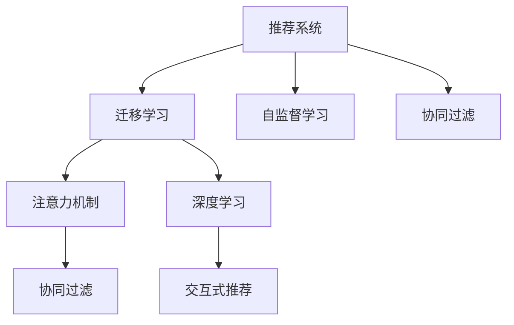

                 

# LLM在推荐系统中的迁移学习应用

> 关键词：Large Language Models (LLMs), Recommendation Systems, Transfer Learning, Collaborative Filtering, Attention Mechanisms

## 1. 背景介绍

### 1.1 问题由来
随着互联网的迅猛发展，个性化推荐系统（Recommendation Systems, RS）逐渐成为现代信息系统中不可或缺的一部分。传统推荐系统主要依靠用户历史行为数据进行推荐，但在数据稀缺或用户稀疏的情况下，推荐效果往往不尽如人意。而基于深度学习的大规模语言模型（Large Language Models, LLMs）的出现，为推荐系统带来了新的生机。

### 1.2 问题核心关键点
LLMs在推荐系统中的应用主要体现在两个方面：

- **迁移学习（Transfer Learning）**：利用预训练的LLMs获取通用的用户兴趣表示，将其迁移应用到特定推荐任务上，从而减少推荐系统对用户历史行为数据的依赖，提升推荐效果。
- **自监督学习（Self-Supervised Learning）**：通过对用户行为数据和LLMs的联合训练，从无标注数据中学习用户兴趣，弥补数据稀缺情况下的推荐难题。

### 1.3 问题研究意义
LLMs在推荐系统中的应用，有助于：

- **降低数据需求**：利用预训练的LLMs减少对用户历史行为数据的依赖，提升推荐系统在数据稀缺情况下的表现。
- **提高推荐精度**：通过迁移学习和自监督学习，提升推荐模型的泛化能力，提供更个性化和准确的推荐结果。
- **加速模型开发**：利用预训练模型快速迭代优化推荐算法，缩短模型开发周期。
- **拓展应用边界**：为推荐系统引入新的推荐维度，如语义、情感、因果关系等，拓展推荐系统的应用范围。

## 2. 核心概念与联系

### 2.1 核心概念概述

为更好地理解LLMs在推荐系统中的应用，本节将介绍几个密切相关的核心概念：

- **推荐系统（Recommendation Systems）**：通过算法预测用户对物品的兴趣，从而提供个性化的物品推荐，广泛应用于电商、音乐、视频等场景。
- **迁移学习（Transfer Learning）**：指将一个领域学到的知识，迁移到另一个领域的学习范式。LLMs的预训练可以视为一种迁移学习。
- **自监督学习（Self-Supervised Learning）**：利用无标注数据，通过自监督任务训练模型，学习通用特征，如BERT、GPT等。
- **协同过滤（Collaborative Filtering）**：通过分析用户与物品之间的交互行为，预测用户对未交互物品的兴趣。
- **注意力机制（Attention Mechanisms）**：在推荐模型中用于学习物品间的相关性，如在CTR预估中的点积注意力、在序列推荐中的自注意力等。
- **深度学习（Deep Learning）**：基于神经网络模型进行深度训练，提取复杂的非线性特征，广泛应用于图像、文本等领域的推荐。
- **交互式推荐（Interactive Recommendations）**：结合用户的即时反馈，动态调整推荐策略，提升用户体验。

这些核心概念之间的逻辑关系可以通过以下Mermaid流程图来展示：



这个流程图展示了这个核心概念之间的逻辑关系：

1. 推荐系统通过协同过滤和注意力机制预测用户兴趣。
2. 迁移学习利用预训练的LLMs，将其通用特征迁移到推荐任务上。
3. 自监督学习通过无标注数据训练模型，学习通用特征。
4. 深度学习利用神经网络提取复杂特征。
5. 交互式推荐结合用户即时反馈动态调整推荐策略。

## 3. 核心算法原理 & 具体操作步骤
### 3.1 算法原理概述

LLMs在推荐系统中的应用主要基于迁移学习和自监督学习的原理，其核心思想是：

1. **迁移学习**：利用预训练的LLMs获取通用的用户兴趣表示，将其迁移到推荐任务上，从而减少推荐系统对用户历史行为数据的依赖。
2. **自监督学习**：通过对用户行为数据和LLMs的联合训练，从无标注数据中学习用户兴趣，弥补数据稀缺情况下的推荐难题。

形式化地，假设预训练的LLMs为 $M_{\theta}$，其中 $\theta$ 为预训练得到的模型参数。给定推荐任务的训练集 $D=\{(x_i,y_i)\}_{i=1}^N$，推荐的目标是找到新的模型参数 $\hat{\theta}$，使得：

$$
\hat{\theta}=\mathop{\arg\min}_{\theta} \mathcal{L}(M_{\theta},D)
$$

其中 $\mathcal{L}$ 为推荐系统设计的损失函数，用于衡量模型预测推荐结果与实际标签之间的差异。常见的损失函数包括均方误差损失、交叉熵损失等。

### 3.2 算法步骤详解

基于迁移学习的LLMs推荐系统一般包括以下几个关键步骤：

**Step 1: 准备预训练模型和数据集**
- 选择合适的预训练语言模型 $M_{\theta}$ 作为初始化参数，如 BERT、GPT等。
- 准备推荐任务的训练集 $D$，划分为训练集、验证集和测试集。一般要求标注数据与预训练数据的分布不要差异过大。

**Step 2: 添加任务适配层**
- 根据推荐任务类型，在预训练模型顶层设计合适的输出层和损失函数。
- 对于评分预测任务，通常在顶层添加线性分类器或回归器，交叉熵损失函数。
- 对于排序任务，通常使用多目标回归或序列排序模型，自定义排序损失函数。

**Step 3: 设置微调超参数**
- 选择合适的优化算法及其参数，如 AdamW、SGD 等，设置学习率、批大小、迭代轮数等。
- 设置正则化技术及强度，包括权重衰减、Dropout、Early Stopping等。
- 确定冻结预训练参数的策略，如仅微调顶层，或全部参数都参与微调。

**Step 4: 执行梯度训练**
- 将训练集数据分批次输入模型，前向传播计算损失函数。
- 反向传播计算参数梯度，根据设定的优化算法和学习率更新模型参数。
- 周期性在验证集上评估模型性能，根据性能指标决定是否触发 Early Stopping。
- 重复上述步骤直到满足预设的迭代轮数或 Early Stopping 条件。

**Step 5: 测试和部署**
- 在测试集上评估微调后模型 $M_{\hat{\theta}}$ 的性能，对比微调前后的精度提升。
- 使用微调后的模型对新样本进行推理预测，集成到实际的应用系统中。
- 持续收集新的数据，定期重新微调模型，以适应数据分布的变化。

以上是基于迁移学习的LLMs推荐系统的一般流程。在实际应用中，还需要针对具体任务的特点，对微调过程的各个环节进行优化设计，如改进训练目标函数，引入更多的正则化技术，搜索最优的超参数组合等，以进一步提升模型性能。

### 3.3 算法优缺点

基于迁移学习的LLMs推荐方法具有以下优点：

1. **高效性**：利用预训练的LLMs减少数据需求，在大规模无标签数据上进行自监督学习，提升推荐模型泛化能力。
2. **鲁棒性**：通过多维度数据联合训练，提升模型对异常数据和干扰的鲁棒性。
3. **可解释性**：预训练的LLMs提供多层次的语言理解能力，增强推荐模型的可解释性。
4. **适应性**：迁移学习使得推荐模型可以适应新领域和新任务，提升推荐系统应用范围。

但该方法也存在一定的局限性：

1. **数据依赖**：自监督学习仍然需要大量的无标签数据，数据稀缺情况下难以取得理想效果。
2. **计算成本**：预训练模型和自监督学习需要大量计算资源，推荐系统在大规模部署时可能面临成本问题。
3. **复杂性**：模型结构复杂，训练和推理开销较大，对工程实践要求较高。
4. **可控性**：迁移学习过程涉及多源数据融合，可能导致模型表现不稳定，难以精确控制。

尽管存在这些局限性，但就目前而言，基于迁移学习的LLMs推荐方法仍是最主流范式。未来相关研究的重点在于如何进一步降低推荐系统对用户历史行为数据的依赖，提高模型的自监督学习效率，同时兼顾可解释性和泛化性等因素。

### 3.4 算法应用领域

基于LLMs的迁移学习推荐方法，在推荐系统领域已经得到了广泛的应用，覆盖了几乎所有常见推荐任务，例如：

- **评分预测**：如物品评分预测、用户评分预测等。通过微调使模型学习物品-评分映射。
- **排序推荐**：如物品排序推荐、广告排序等。通过微调使模型学习物品-位置映射。
- **多目标推荐**：如广告点击率预测、用户点击率预测等。通过微调使模型学习多维目标预测。
- **上下文推荐**：如新闻推荐、视频推荐等。通过微调使模型学习上下文-物品映射。

除了上述这些经典任务外，LLMs在推荐系统中的应用还包括基于语义的理解和生成推荐、结合知识图谱进行推荐、多模态信息融合推荐等前沿技术，为推荐系统带来了全新的突破。随着预训练模型和迁移学习方法的不断进步，相信推荐系统必将在更多领域得到应用，为电商、音乐、视频等场景带来变革性影响。

## 4. 数学模型和公式 & 详细讲解  
### 4.1 数学模型构建

本节将使用数学语言对基于迁移学习的LLMs推荐过程进行更加严格的刻画。

记预训练语言模型为 $M_{\theta}$，其中 $\theta$ 为预训练得到的模型参数。假设推荐任务的训练集为 $D=\{(x_i,y_i)\}_{i=1}^N, x_i \in \mathcal{X}, y_i \in \mathcal{Y}$。

定义模型 $M_{\theta}$ 在输入 $x$ 上的输出为 $o(x)=M_{\theta}(x) \in \mathcal{Y}$，其中 $\mathcal{Y}$ 为推荐结果空间，如 $\{1,2,\ldots,K\}$ 表示 $K$ 个可能推荐的物品。推荐的目标函数 $\mathcal{L}(o)$ 可以定义为：

$$
\mathcal{L}(o) = \sum_{i=1}^N \ell(y_i, o(x_i))
$$

其中 $\ell$ 为推荐系统的损失函数，如均方误差损失、交叉熵损失等。在微调过程中，优化目标是最小化目标函数 $\mathcal{L}(o)$，即找到最优输出 $o$：

$$
o^*=\mathop{\arg\min}_{o} \mathcal{L}(o)
$$

在得到推荐结果 $o^*$ 后，可以将其与标签 $y_i$ 进行对比，计算损失函数 $\ell$。在实践中，我们通常使用基于梯度的优化算法（如SGD、Adam等）来近似求解上述最优化问题。设 $\eta$ 为学习率，$\lambda$ 为正则化系数，则参数的更新公式为：

$$
o \leftarrow o - \eta \nabla_{o}\mathcal{L}(o) - \eta\lambda o
$$

其中 $\nabla_{o}\mathcal{L}(o)$ 为损失函数对推荐结果 $o$ 的梯度，可通过反向传播算法高效计算。

### 4.2 公式推导过程

以下我们以物品评分预测为例，推导均方误差损失函数及其梯度的计算公式。

假设模型 $M_{\theta}$ 在输入 $x$ 上的输出为 $\hat{y}=M_{\theta}(x)$，表示预测评分。真实评分 $y \in [0,1]$。则均方误差损失函数定义为：

$$
\ell(\hat{y},y) = \frac{1}{N}\sum_{i=1}^N (\hat{y_i} - y_i)^2
$$

将其代入目标函数公式，得：

$$
\mathcal{L}(o) = \sum_{i=1}^N (\hat{y_i} - y_i)^2
$$

根据链式法则，损失函数对推荐结果 $o$ 的梯度为：

$$
\frac{\partial \mathcal{L}(o)}{\partial o} = \frac{2}{N}\sum_{i=1}^N (\hat{y_i} - y_i) \frac{\partial \hat{y_i}}{\partial o}
$$

其中 $\frac{\partial \hat{y_i}}{\partial o}$ 为输出 $o$ 对输入 $x_i$ 的梯度，可进一步递归展开，利用自动微分技术完成计算。

在得到损失函数的梯度后，即可带入参数更新公式，完成模型的迭代优化。重复上述过程直至收敛，最终得到适应推荐任务的最优推荐结果 $o^*$。

## 5. 项目实践：代码实例和详细解释说明
### 5.1 开发环境搭建

在进行推荐系统开发前，我们需要准备好开发环境。以下是使用Python进行PyTorch开发的环境配置流程：

1. 安装Anaconda：从官网下载并安装Anaconda，用于创建独立的Python环境。

2. 创建并激活虚拟环境：
```bash
conda create -n pytorch-env python=3.8 
conda activate pytorch-env
```

3. 安装PyTorch：根据CUDA版本，从官网获取对应的安装命令。例如：
```bash
conda install pytorch torchvision torchaudio cudatoolkit=11.1 -c pytorch -c conda-forge
```

4. 安装Transformers库：
```bash
pip install transformers
```

5. 安装各类工具包：
```bash
pip install numpy pandas scikit-learn matplotlib tqdm jupyter notebook ipython
```

完成上述步骤后，即可在`pytorch-env`环境中开始推荐系统开发。

### 5.2 源代码详细实现

下面以基于BERT的评分预测任务为例，给出使用Transformers库对BERT模型进行微调的PyTorch代码实现。

首先，定义评分预测任务的数据处理函数：

```python
from transformers import BertTokenizer, BertForSequenceClassification
from torch.utils.data import Dataset
import torch

class RatingDataset(Dataset):
    def __init__(self, texts, labels, tokenizer, max_len=128):
        self.texts = texts
        self.labels = labels
        self.tokenizer = tokenizer
        self.max_len = max_len
        
    def __len__(self):
        return len(self.texts)
    
    def __getitem__(self, item):
        text = self.texts[item]
        label = self.labels[item]
        
        encoding = self.tokenizer(text, return_tensors='pt', max_length=self.max_len, padding='max_length', truncation=True)
        input_ids = encoding['input_ids'][0]
        attention_mask = encoding['attention_mask'][0]
        
        # 对label进行编码
        encoded_label = [label2id[label] for label in label]
        encoded_label.extend([label2id['O']] * (self.max_len - len(encoded_label)))
        labels = torch.tensor(encoded_label, dtype=torch.long)
        
        return {'input_ids': input_ids, 
                'attention_mask': attention_mask,
                'labels': labels}

# 标签与id的映射
label2id = {'O': 0, '1': 1, '2': 2, '3': 3, '4': 4, '5': 5}
id2label = {v: k for k, v in label2id.items()}

# 创建dataset
tokenizer = BertTokenizer.from_pretrained('bert-base-cased')

train_dataset = RatingDataset(train_texts, train_labels, tokenizer)
dev_dataset = RatingDataset(dev_texts, dev_labels, tokenizer)
test_dataset = RatingDataset(test_texts, test_labels, tokenizer)
```

然后，定义模型和优化器：

```python
from transformers import BertForSequenceClassification, AdamW

model = BertForSequenceClassification.from_pretrained('bert-base-cased', num_labels=len(label2id))

optimizer = AdamW(model.parameters(), lr=2e-5)
```

接着，定义训练和评估函数：

```python
from torch.utils.data import DataLoader
from tqdm import tqdm
from sklearn.metrics import mean_squared_error

device = torch.device('cuda') if torch.cuda.is_available() else torch.device('cpu')
model.to(device)

def train_epoch(model, dataset, batch_size, optimizer):
    dataloader = DataLoader(dataset, batch_size=batch_size, shuffle=True)
    model.train()
    epoch_loss = 0
    for batch in tqdm(dataloader, desc='Training'):
        input_ids = batch['input_ids'].to(device)
        attention_mask = batch['attention_mask'].to(device)
        labels = batch['labels'].to(device)
        model.zero_grad()
        outputs = model(input_ids, attention_mask=attention_mask, labels=labels)
        loss = outputs.loss
        epoch_loss += loss.item()
        loss.backward()
        optimizer.step()
    return epoch_loss / len(dataloader)

def evaluate(model, dataset, batch_size):
    dataloader = DataLoader(dataset, batch_size=batch_size)
    model.eval()
    preds, labels = [], []
    with torch.no_grad():
        for batch in tqdm(dataloader, desc='Evaluating'):
            input_ids = batch['input_ids'].to(device)
            attention_mask = batch['attention_mask'].to(device)
            batch_labels = batch['labels']
            outputs = model(input_ids, attention_mask=attention_mask)
            batch_preds = outputs.logits.argmax(dim=2).to('cpu').tolist()
            batch_labels = batch_labels.to('cpu').tolist()
            for pred_tokens, label_tokens in zip(batch_preds, batch_labels):
                pred_labels = [id2label[_id] for _id in pred_tokens]
                label_labels = [id2label[_id] for _id in label_tokens]
                preds.append(pred_labels[:len(label_labels)])
                labels.append(label_labels)
                
    mse = mean_squared_error(labels, preds)
    print(f"MSE: {mse:.3f}")
```

最后，启动训练流程并在测试集上评估：

```python
epochs = 5
batch_size = 16

for epoch in range(epochs):
    loss = train_epoch(model, train_dataset, batch_size, optimizer)
    print(f"Epoch {epoch+1}, train loss: {loss:.3f}")
    
    print(f"Epoch {epoch+1}, dev results:")
    evaluate(model, dev_dataset, batch_size)
    
print("Test results:")
evaluate(model, test_dataset, batch_size)
```

以上就是使用PyTorch对BERT进行评分预测任务微调的完整代码实现。可以看到，得益于Transformers库的强大封装，我们可以用相对简洁的代码完成BERT模型的加载和微调。

### 5.3 代码解读与分析

让我们再详细解读一下关键代码的实现细节：

**RatingDataset类**：
- `__init__`方法：初始化文本、标签、分词器等关键组件。
- `__len__`方法：返回数据集的样本数量。
- `__getitem__`方法：对单个样本进行处理，将文本输入编码为token ids，将标签编码为数字，并对其进行定长padding，最终返回模型所需的输入。

**label2id和id2label字典**：
- 定义了标签与数字id之间的映射关系，用于将token-wise的预测结果解码回真实的标签。

**训练和评估函数**：
- 使用PyTorch的DataLoader对数据集进行批次化加载，供模型训练和推理使用。
- 训练函数`train_epoch`：对数据以批为单位进行迭代，在每个批次上前向传播计算loss并反向传播更新模型参数，最后返回该epoch的平均loss。
- 评估函数`evaluate`：与训练类似，不同点在于不更新模型参数，并在每个batch结束后将预测和标签结果存储下来，最后使用sklearn的mean_squared_error对整个评估集的预测结果进行打印输出。

**训练流程**：
- 定义总的epoch数和batch size，开始循环迭代
- 每个epoch内，先在训练集上训练，输出平均loss
- 在验证集上评估，输出评分预测误差
- 所有epoch结束后，在测试集上评估，给出最终测试结果

可以看到，PyTorch配合Transformers库使得BERT微调的代码实现变得简洁高效。开发者可以将更多精力放在数据处理、模型改进等高层逻辑上，而不必过多关注底层的实现细节。

当然，工业级的系统实现还需考虑更多因素，如模型的保存和部署、超参数的自动搜索、更灵活的任务适配层等。但核心的微调范式基本与此类似。

## 6. 实际应用场景
### 6.1 电商平台推荐

基于大语言模型的迁移学习推荐技术，可以在电商平台中大显身手。传统的电商平台推荐系统通常依赖于用户历史行为数据，但在数据稀缺或用户稀疏的情况下，推荐效果往往不尽如人意。通过利用预训练的LLMs，如BERT、GPT等，可以构建更高效、泛化能力更强的推荐系统。

在技术实现上，可以收集电商平台的用户行为数据，如浏览记录、点击记录、评价记录等，将其作为训练集进行微调。微调后的模型能够自动学习用户兴趣，推荐符合用户偏好的商品。对于未购买过的商品，模型还能根据用户历史行为和商品描述生成推荐结果，提升用户转化率。

### 6.2 音乐流媒体推荐

音乐流媒体平台推荐系统面临用户音乐品味多样、数据稀疏等问题。传统的协同过滤算法往往无法有效应对。通过利用预训练的LLMs，可以构建更加智能、个性化的推荐系统。

具体而言，可以收集用户历史听歌记录和平台上的歌曲信息，进行数据预处理后作为训练集。利用微调后的LLMs，学习用户对不同歌曲的评分，预测新歌曲的评分，从而生成个性化的播放列表。此外，LLMs还可以通过分析歌曲的文本描述，学习歌曲情感、风格等特征，进一步提升推荐精度。

### 6.3 视频平台推荐

视频平台推荐系统面临内容丰富、数据稀疏的问题，传统的协同过滤算法难以适应。通过利用预训练的LLMs，可以构建更高效的推荐系统。

具体而言，可以收集用户历史观看记录和平台上的视频信息，进行数据预处理后作为训练集。利用微调后的LLMs，学习用户对不同视频的评分，预测新视频的评分，从而生成个性化的播放列表。LLMs还可以分析视频描述，学习视频情感、风格等特征，进一步提升推荐精度。

### 6.4 未来应用展望

随着大语言模型和迁移学习方法的不断发展，基于LLMs的推荐系统将在更多领域得到应用，为电商、音乐、视频等场景带来变革性影响。

在智慧医疗领域，基于LLMs的推荐系统可以帮助医生推荐最适合患者的治疗方案，提升医疗服务的智能化水平，加速新药开发进程。

在智能教育领域，微调技术可应用于推荐个性化的学习资源、智能辅助教学等，因材施教，促进教育公平，提高教学质量。

在智慧城市治理中，微调模型可应用于推荐符合用户偏好的智能出行方案、优化城市资源配置等环节，提高城市管理的自动化和智能化水平，构建更安全、高效的未来城市。

此外，在企业生产、社会治理、文娱传媒等众多领域，基于LLMs的推荐系统也将不断涌现，为传统行业数字化转型升级提供新的技术路径。相信随着技术的日益成熟，微调方法将成为推荐系统应用的重要范式，推动推荐系统向更广阔的领域加速渗透。

## 7. 工具和资源推荐
### 7.1 学习资源推荐

为了帮助开发者系统掌握LLMs在推荐系统中的应用理论基础和实践技巧，这里推荐一些优质的学习资源：

1. 《深度学习推荐系统》系列博文：由大模型技术专家撰写，深入浅出地介绍了推荐系统的前沿技术，如深度学习、迁移学习等。

2. 《推荐系统实践》书籍：涵盖了推荐系统的理论基础、算法设计和工程实践，适合推荐系统开发者入门学习。

3. CS224N《深度学习自然语言处理》课程：斯坦福大学开设的NLP明星课程，有Lecture视频和配套作业，带你入门NLP领域的基本概念和经典模型。

4. 《Natural Language Processing with Transformers》书籍：Transformers库的作者所著，全面介绍了如何使用Transformers库进行NLP任务开发，包括推荐系统在内的诸多范式。

5. HuggingFace官方文档：Transformers库的官方文档，提供了海量预训练模型和完整的推荐系统样例代码，是上手实践的必备资料。

通过对这些资源的学习实践，相信你一定能够快速掌握LLMs在推荐系统中的应用精髓，并用于解决实际的推荐问题。
###  7.2 开发工具推荐

高效的开发离不开优秀的工具支持。以下是几款用于LLMs推荐系统开发的常用工具：

1. PyTorch：基于Python的开源深度学习框架，灵活动态的计算图，适合快速迭代研究。大部分预训练语言模型都有PyTorch版本的实现。

2. TensorFlow：由Google主导开发的开源深度学习框架，生产部署方便，适合大规模工程应用。同样有丰富的预训练语言模型资源。

3. Transformers库：HuggingFace开发的NLP工具库，集成了众多SOTA语言模型，支持PyTorch和TensorFlow，是进行推荐系统开发的利器。

4. Weights & Biases：模型训练的实验跟踪工具，可以记录和可视化模型训练过程中的各项指标，方便对比和调优。与主流深度学习框架无缝集成。

5. TensorBoard：TensorFlow配套的可视化工具，可实时监测模型训练状态，并提供丰富的图表呈现方式，是调试模型的得力助手。

6. Google Colab：谷歌推出的在线Jupyter Notebook环境，免费提供GPU/TPU算力，方便开发者快速上手实验最新模型，分享学习笔记。

合理利用这些工具，可以显著提升LLMs推荐系统的开发效率，加快创新迭代的步伐。

### 7.3 相关论文推荐

LLMs在推荐系统中的应用源于学界的持续研究。以下是几篇奠基性的相关论文，推荐阅读：

1. Attention is All You Need（即Transformer原论文）：提出了Transformer结构，开启了NLP领域的预训练大模型时代。

2. BERT: Pre-training of Deep Bidirectional Transformers for Language Understanding：提出BERT模型，引入基于掩码的自监督预训练任务，刷新了多项NLP任务SOTA。

3. Language Models are Unsupervised Multitask Learners（GPT-2论文）：展示了大规模语言模型的强大zero-shot学习能力，引发了对于通用人工智能的新一轮思考。

4. Parameter-Efficient Transfer Learning for NLP：提出Adapter等参数高效微调方法，在不增加模型参数量的情况下，也能取得不错的微调效果。

5. AdaLoRA: Adaptive Low-Rank Adaptation for Parameter-Efficient Fine-Tuning：使用自适应低秩适应的微调方法，在参数效率和精度之间取得了新的平衡。

6. Seq2Seq: Sequence-to-Sequence Learning with Neural Networks：提出了基于RNN的序列生成模型，为LLMs在推荐系统中的应用提供了理论基础。

这些论文代表了大语言模型在推荐系统中的应用的发展脉络。通过学习这些前沿成果，可以帮助研究者把握学科前进方向，激发更多的创新灵感。

## 8. 总结：未来发展趋势与挑战
### 8.1 总结

本文对基于迁移学习的大语言模型在推荐系统中的应用进行了全面系统的介绍。首先阐述了LLMs和推荐系统的研究背景和意义，明确了迁移学习在提升推荐系统性能方面的独特价值。其次，从原理到实践，详细讲解了迁移学习的数学原理和关键步骤，给出了推荐系统开发的完整代码实例。同时，本文还广泛探讨了LLMs在推荐系统中的实际应用场景，展示了迁移学习范式的巨大潜力。此外，本文精选了LLMs在推荐系统中的学习资源，力求为读者提供全方位的技术指引。

通过本文的系统梳理，可以看到，基于迁移学习的大语言模型在推荐系统中具有显著的优势，可以显著提升推荐系统的泛化能力，减少对用户历史行为数据的依赖，提升推荐效果。利用预训练的LLMs，推荐系统能够更好地适应多领域、多任务的应用需求，提升用户的个性化推荐体验。未来，伴随LLMs和迁移学习方法的不断进步，推荐系统必将在更多领域得到应用，为电商、音乐、视频等场景带来变革性影响。

### 8.2 未来发展趋势

展望未来，基于LLMs的推荐系统将呈现以下几个发展趋势：

1. **个性化推荐**：利用迁移学习和大语言模型的强大语言理解能力，为用户提供更加个性化的推荐结果。
2. **跨领域推荐**：通过联合训练和迁移学习，使得推荐系统能够适应多领域、多模态数据，提升推荐系统的应用范围。
3. **实时推荐**：结合在线交互数据，动态调整推荐策略，提升推荐系统的实时性和用户满意度。
4. **多目标推荐**：利用多目标回归等技术，提升推荐系统的多维度推荐能力。
5. **公平推荐**：利用因果推断等方法，减少推荐系统中的偏见和歧视，提升推荐系统的公平性和透明性。
6. **可解释性推荐**：通过引入可解释性技术，增强推荐系统的可解释性，提升用户信任和满意度。

这些趋势凸显了大语言模型在推荐系统中的巨大应用潜力。这些方向的探索发展，必将进一步提升推荐系统的性能和应用范围，为电商、音乐、视频等场景带来变革性影响。

### 8.3 面临的挑战

尽管基于LLMs的迁移学习推荐系统已经取得了瞩目成就，但在迈向更加智能化、普适化应用的过程中，它仍面临着诸多挑战：

1. **数据依赖**：尽管迁移学习可以降低对用户历史行为数据的依赖，但对于一些特定领域的推荐任务，仍然需要大量的标注数据进行微调，数据稀缺情况下难以取得理想效果。
2. **计算成本**：预训练的LLMs和迁移学习过程需要大量计算资源，推荐系统在大规模部署时可能面临成本问题。
3. **模型复杂性**：LLMs的复杂结构导致推荐模型的训练和推理开销较大，对工程实践要求较高。
4. **可控性**：迁移学习过程涉及多源数据融合，可能导致模型表现不稳定，难以精确控制。
5. **隐私和安全**：利用用户数据进行推荐模型训练和微调，可能涉及用户隐私和数据安全问题，需要加强数据保护措施。

尽管存在这些挑战，但就目前而言，基于迁移学习的LLMs推荐方法仍是最主流范式。未来相关研究的重点在于如何进一步降低推荐系统对用户历史行为数据的依赖，提高模型的自监督学习效率，同时兼顾可解释性和泛化性等因素。

### 8.4 研究展望

面对LLMs在推荐系统中面临的种种挑战，未来的研究需要在以下几个方面寻求新的突破：

1. **无监督和半监督学习**：探索无监督和半监督学习方法，降低对标注数据的需求，利用自监督学习任务提升推荐模型的泛化能力。
2. **参数高效微调**：开发更加参数高效的微调方法，在固定大部分预训练参数的情况下，只更新极少量的任务相关参数。
3. **计算优化**：优化推荐模型的计算图，减少前向传播和反向传播的资源消耗，实现更加轻量级、实时性的部署。
4. **多维度数据融合**：结合知识图谱、规则库等专家知识，提升推荐系统的多维度推荐能力。
5. **因果推断**：引入因果推断方法，增强推荐系统对因果关系的建模能力，提升推荐模型的鲁棒性和泛化性。
6. **多模态融合**：将视觉、语音、文本等模态信息进行融合，提升推荐系统的表现和用户满意度。

这些研究方向的探索，必将引领基于LLMs的推荐系统迈向更高的台阶，为推荐系统带来更高效、更智能、更个性化的推荐结果。面向未来，LLMs推荐系统还需要与其他人工智能技术进行更深入的融合，如知识表示、因果推理、强化学习等，多路径协同发力，共同推动推荐系统的发展。

## 9. 附录：常见问题与解答

**Q1：LLMs在推荐系统中如何应用？**

A: LLMs在推荐系统中的应用主要基于迁移学习范式，利用预训练的LLMs获取通用的用户兴趣表示，将其迁移到推荐任务上，从而减少推荐系统对用户历史行为数据的依赖。具体步骤包括数据准备、任务适配层设计、微调超参数设置、梯度训练、模型评估和部署等。

**Q2：LLMs推荐系统如何降低数据依赖？**

A: 通过迁移学习和自监督学习，LLMs推荐系统可以在少量标注数据上进行训练，提升模型的泛化能力。此外，LLMs可以通过用户行为数据和LLMs的联合训练，从无标注数据中学习用户兴趣，弥补数据稀缺情况下的推荐难题。

**Q3：LLMs推荐系统如何提高推荐效果？**

A: 利用LLMs的强大语言理解能力，通过迁移学习和自监督学习，提升推荐模型的泛化能力。同时，通过多维度数据融合和因果推断等方法，增强推荐系统的鲁棒性和可解释性。

**Q4：LLMs推荐系统面临哪些挑战？**

A: LLMs推荐系统面临数据依赖、计算成本、模型复杂性、可控性和隐私安全等多方面的挑战。未来需要进一步降低数据需求，提高模型的自监督学习效率，同时兼顾可解释性和泛化性等因素。

**Q5：LLMs推荐系统的未来发展方向是什么？**

A: 未来，基于LLMs的推荐系统将朝着个性化推荐、跨领域推荐、实时推荐、多目标推荐、公平推荐和可解释性推荐等方向发展，提升推荐系统的应用范围和用户满意度。

---

作者：禅与计算机程序设计艺术 / Zen and the Art of Computer Programming

