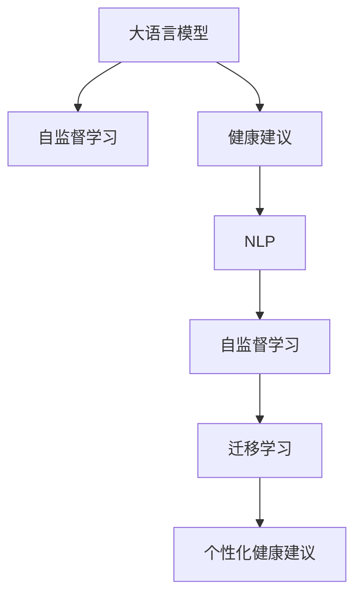

                 

# LLM在智能个性化健康建议中的应用前景

## 1. 背景介绍

### 1.1 问题由来

随着人工智能（AI）技术的不断进步，自然语言处理（NLP）领域出现了显著的突破，其中语言模型（Language Model）成为了热点。特别是大语言模型（LLM），通过在海量文本数据上进行自监督训练，获得了强大的自然语言理解能力。这些大语言模型被广泛应用于问答、机器翻译、文本生成等领域，展示了卓越的语言处理能力。

在医疗健康领域，传统的健康建议往往基于统计学分析或专家经验，缺乏个体化的智能决策支持。随着大语言模型的出现，个性化健康建议成为可能，通过大模型理解患者描述，提供符合个体情况的智能健康建议，大大提升了医疗健康服务的质量和效率。

### 1.2 问题核心关键点

本文聚焦于大语言模型在智能个性化健康建议中的应用前景。具体而言，我们将探讨以下问题：
1. 大语言模型在健康领域的应用案例及其效果。
2. 模型构建和训练过程中的关键技术点。
3. 未来潜在的应用方向和挑战。

### 1.3 问题研究意义

研究大语言模型在健康领域的应用，具有以下重要意义：
1. 提升健康服务质量。个性化健康建议能够更准确地反映个体健康状况，提供针对性的治疗方案和健康管理建议。
2. 优化医疗资源分配。通过智能分析患者需求，指导医疗机构资源优化配置。
3. 降低医疗成本。智能化的健康建议可以减少不必要的医疗检查和治疗，节省费用。
4. 促进健康数据管理。利用大语言模型，可以有效管理和利用健康数据，提升数据利用效率。

## 2. 核心概念与联系

### 2.1 核心概念概述

为深入理解大语言模型在健康建议中的应用，我们首先介绍几个核心概念及其联系：

1. **大语言模型（LLM）**：以Transformer架构为代表的深度神经网络，通过在大规模无标签文本数据上进行自监督训练，学习语言的普遍规律和模式。

2. **健康建议（Health Advice）**：基于患者描述和健康数据，由智能系统提供的个性化健康管理方案和建议。

3. **自然语言处理（NLP）**：利用计算方法分析和理解人类语言，进而实现人机交互的技术。

4. **自监督学习（Self-Supervised Learning）**：通过在大量无标签数据上训练模型，学习到数据的隐含规律，无需显式标注。

5. **迁移学习（Transfer Learning）**：将一个领域学到的知识迁移到另一个相关领域，提升新任务性能。

这些概念之间的联系可以通过以下Mermaid流程图来展示：



该流程图展示了大语言模型与健康建议之间的内在联系。大模型通过自监督学习学习通用语言规律，再通过迁移学习将这些知识迁移到健康领域，生成个性化的健康建议。

## 3. 核心算法原理 & 具体操作步骤
### 3.1 算法原理概述

大语言模型在健康领域的应用，主要基于以下算法原理：

1. **自监督预训练**：在无标签的健康文本数据上，大语言模型通过语言建模任务进行预训练，学习到通用的语言规律和健康知识。

2. **微调（Fine-Tuning）**：在预训练大模型的基础上，使用标注的健康建议数据进行微调，使其能够理解和生成特定个体的健康建议。

3. **迁移学习**：将通用领域的语言模型迁移到健康领域，提升模型在健康文本数据上的理解能力。

4. **多模态融合**：结合患者描述、健康数据、医学知识库等多模态信息，生成综合性的健康建议。

### 3.2 算法步骤详解

具体来说，大语言模型在健康建议中的应用流程包括以下几个步骤：

1. **数据准备**：收集健康建议数据，包括患者的健康描述、历史医疗记录、检查报告、生活方式等信息。

2. **数据预处理**：对数据进行清洗、标注、分词、去除停用词等预处理步骤，确保数据质量。

3. **模型预训练**：使用大规模无标签的健康文本数据进行自监督预训练，学习到通用的健康语言表示。

4. **模型微调**：选择与健康建议相关的标注数据，对预训练模型进行微调，提升其生成个性化健康建议的能力。

5. **多模态融合**：将患者的文本描述与健康数据、医学知识库等多模态信息进行融合，生成综合性的健康建议。

6. **评估与优化**：在验证集上评估模型性能，通过超参数调整和模型优化，提升模型效果。

### 3.3 算法优缺点

大语言模型在健康建议中的应用具有以下优点：

1. **个性化建议**：能够根据患者的具体描述和健康数据，生成个性化的健康建议，提高建议的针对性和有效性。

2. **多模态融合**：结合患者的多种信息源，生成更全面、准确的健康建议。

3. **可解释性**：大模型的可解释性较好，可以提供详细的推理过程，帮助患者理解和接受建议。

4. **持续学习**：模型可以持续学习新的健康知识和数据，提升自身能力。

然而，也存在一些缺点：

1. **数据隐私**：健康数据涉及个人隐私，数据收集和使用需要严格遵守相关法律法规。

2. **数据质量**：健康数据往往存在不一致性和噪声，模型需要处理这些问题以确保建议的准确性。

3. **模型复杂性**：大模型的复杂性较高，训练和推理速度较慢，需要优化以提高效率。

### 3.4 算法应用领域

大语言模型在健康领域的应用非常广泛，主要包括以下几个方面：

1. **健康问答系统**：通过自然语言问答，提供健康相关问题的即时回答。

2. **个性化健康建议**：根据患者描述，提供个性化的饮食、运动、治疗建议。

3. **疾病预测与诊断**：利用患者的历史数据和当前描述，预测疾病的风险和发展趋势。

4. **健康管理**：提供日常健康监测和管理的智能建议，帮助患者管理慢性病等长期健康问题。

5. **药物推荐**：根据患者的健康状况和用药历史，推荐合适的药物和治疗方案。

## 4. 数学模型和公式 & 详细讲解 & 举例说明

### 4.1 数学模型构建

大语言模型在健康建议中的数学模型构建如下：

设健康建议任务为 $T$，训练数据集为 $D=\{(x_i,y_i)\}_{i=1}^N$，其中 $x_i$ 为患者的描述，$y_i$ 为健康建议的文本。

定义模型 $M_{\theta}$ 为预训练模型，其参数 $\theta$ 通过在大规模无标签健康文本数据上自监督训练得到。模型在文本 $x_i$ 上的输出为 $\hat{y}_i$，通过计算 $y_i$ 和 $\hat{y}_i$ 之间的差异，计算损失函数 $L_i$：

$$
L_i = \ell(y_i, \hat{y}_i)
$$

其中 $\ell$ 为损失函数，常用的有交叉熵损失、均方误差损失等。

### 4.2 公式推导过程

以交叉熵损失函数为例，推导过程如下：

$$
L = -\frac{1}{N}\sum_{i=1}^N \sum_{j=1}^m y_{ij} \log \hat{y}_{ij}
$$

其中 $y_{ij}$ 为健康建议文本中第 $j$ 个单词是否出现（$1$ 表示出现，$0$ 表示不出现），$\hat{y}_{ij}$ 为模型预测该单词出现的概率。

### 4.3 案例分析与讲解

以健康问答系统为例，大语言模型可以根据患者描述生成相关的健康问题，并给出答案。以下是具体实现步骤：

1. 收集健康问答数据集，包括问题和对应的答案。

2. 对数据集进行预处理，去除停用词、标点等噪音。

3. 使用大语言模型进行预训练，学习通用语言表示。

4. 选择与问答相关的标注数据，对预训练模型进行微调。

5. 在测试集上评估模型性能，通过超参数调整和模型优化，提升模型效果。

## 5. 项目实践：代码实例和详细解释说明

### 5.1 开发环境搭建

项目实践需要一定的开发环境支持，具体步骤如下：

1. 安装Python和相关依赖库，如PyTorch、Transformers、Pandas、Numpy等。

2. 安装相应的开发工具，如Jupyter Notebook、Git等。

3. 设置模型训练所需的GPU或TPU资源。

### 5.2 源代码详细实现

以下是一个简单的健康问答系统的代码实现：

```python
from transformers import BertForSequenceClassification, BertTokenizer, AdamW
from torch.utils.data import DataLoader
from sklearn.metrics import accuracy_score
import torch

# 数据预处理
tokenizer = BertTokenizer.from_pretrained('bert-base-uncased')
train_data = load_train_data()
dev_data = load_dev_data()
test_data = load_test_data()

# 模型构建
model = BertForSequenceClassification.from_pretrained('bert-base-uncased', num_labels=len(label2id))

# 训练参数设置
optimizer = AdamW(model.parameters(), lr=2e-5)
epochs = 5
batch_size = 16

# 训练过程
for epoch in range(epochs):
    train_loss = 0.0
    train_correct = 0.0
    model.train()
    for batch in DataLoader(train_data, batch_size=batch_size, shuffle=True):
        inputs = tokenizer(batch['text'], truncation=True, padding=True, max_length=256)
        labels = batch['label']
        outputs = model(inputs['input_ids'], attention_mask=inputs['attention_mask'])
        loss = outputs.loss
        train_loss += loss.item()
        logits = outputs.logits
        predictions = torch.argmax(logits, dim=2)
        train_correct += (predictions == labels).sum().item()
        optimizer.zero_grad()
        loss.backward()
        optimizer.step()

    # 验证集评估
    model.eval()
    dev_correct = 0.0
    for batch in DataLoader(dev_data, batch_size=batch_size, shuffle=False):
        inputs = tokenizer(batch['text'], truncation=True, padding=True, max_length=256)
        labels = batch['label']
        outputs = model(inputs['input_ids'], attention_mask=inputs['attention_mask'])
        logits = outputs.logits
        predictions = torch.argmax(logits, dim=2)
        dev_correct += (predictions == labels).sum().item()

    train_accuracy = train_correct / len(train_data)
    dev_accuracy = dev_correct / len(dev_data)
    print(f"Epoch {epoch+1}, train accuracy: {train_accuracy:.4f}, dev accuracy: {dev_accuracy:.4f}")

# 测试集评估
model.eval()
test_correct = 0.0
for batch in DataLoader(test_data, batch_size=batch_size, shuffle=False):
    inputs = tokenizer(batch['text'], truncation=True, padding=True, max_length=256)
    labels = batch['label']
    outputs = model(inputs['input_ids'], attention_mask=inputs['attention_mask'])
    logits = outputs.logits
    predictions = torch.argmax(logits, dim=2)
    test_correct += (predictions == labels).sum().item()

test_accuracy = test_correct / len(test_data)
print(f"Test accuracy: {test_accuracy:.4f}")
```

### 5.3 代码解读与分析

以上代码实现了基于Bert模型的健康问答系统，主要步骤如下：

1. 数据预处理：使用Bert分词器对文本进行分词和编码，去除停用词，截断或填充至固定长度。

2. 模型构建：使用BertForSequenceClassification类构建分类模型，指定输出层和损失函数。

3. 训练过程：在训练集上进行梯度下降优化，计算损失和准确率，调整模型参数。

4. 验证集评估：在验证集上评估模型性能，记录准确率。

5. 测试集评估：在测试集上评估模型性能，记录准确率。

## 6. 实际应用场景

### 6.1 智能健康问答系统

智能健康问答系统可以大大提升用户的健康查询体验。用户只需输入健康问题，系统便能即时回答。以下是一些具体应用场景：

1. **常见健康问题解答**：如“感冒怎么治？”“高血压要注意什么？”等，系统能够提供详细、准确的答案。

2. **药物查询**：用户输入药物名称或症状，系统推荐适合的药物和治疗方案。

3. **症状诊断**：用户描述症状，系统诊断可能的健康问题，并提供建议的治疗方法。

### 6.2 个性化健康建议

个性化健康建议可以根据用户的身体数据和生活习惯，提供量身定制的健康管理方案。以下是一些具体应用场景：

1. **饮食建议**：根据用户的健康状况和生活方式，推荐合适的饮食方案，如糖尿病患者应如何控制血糖。

2. **运动建议**：根据用户的身体数据和运动历史，提供个性化的运动计划，帮助用户保持健康。

3. **心理辅导**：系统分析用户的情绪和行为，提供心理支持和建议。

### 6.3 疾病预测与诊断

大语言模型结合医疗知识库，可以预测疾病风险和发展趋势。以下是一些具体应用场景：

1. **癌症风险预测**：根据用户的基因数据和生活习惯，预测患癌风险，提供预防建议。

2. **慢性病管理**：分析患者的病历和健康数据，预测慢性病的发展趋势，提供治疗建议。

### 6.4 未来应用展望

未来，大语言模型在健康领域的应用前景广阔，以下是几个潜在的发展方向：

1. **多模态健康监测**：结合患者的心率、血压、血糖等生理数据，提供全面的健康监测和建议。

2. **个性化健康干预**：根据患者的健康数据和行为模式，提供个性化的健康干预计划。

3. **远程医疗咨询**：通过大语言模型提供远程医疗咨询服务，提升医疗服务的可及性和效率。

## 7. 工具和资源推荐

### 7.1 学习资源推荐

1. **自然语言处理入门课程**：如Coursera上的NLP课程，从基础理论到实践应用，全面介绍NLP知识。

2. **Transformers官方文档**：提供详细的API和模型介绍，帮助理解和使用大语言模型。

3. **健康数据集**：如MIMIC-III、UCI Health等数据集，用于训练和评估健康模型。

4. **医疗知识库**：如Medline、PubMed等，用于提供医学知识支持。

### 7.2 开发工具推荐

1. **PyTorch**：强大的深度学习框架，支持GPU加速，用于模型训练和推理。

2. **TensorBoard**：可视化工具，帮助监测模型训练状态和效果。

3. **Jupyter Notebook**：交互式开发环境，支持Python代码和数据可视化。

4. **Weights & Biases**：实验跟踪工具，记录模型训练过程和结果。

### 7.3 相关论文推荐

1. **Transformers: Attentions Are All You Need**：Transformer模型的介绍和应用。

2. **BERT: Pre-training of Deep Bidirectional Transformers for Language Understanding**：BERT模型的介绍和应用。

3. **MEDLINE: Medical Literature on the Internet**：医学文献数据库。

4. **Health Question Answering with Multi-Task Learning**：健康问答的多任务学习方法。

## 8. 总结：未来发展趋势与挑战

### 8.1 研究成果总结

大语言模型在健康领域的应用，已经展现出强大的潜力。通过自监督预训练和微调，模型能够理解患者的描述，生成个性化的健康建议和问答回答。这些应用不仅提升了用户的健康管理体验，也辅助了医疗服务的智能化。

### 8.2 未来发展趋势

未来，大语言模型在健康领域的应用将继续深化和发展，具体趋势包括：

1. **多模态融合**：结合生理数据、基因数据等多模态信息，提供更加全面、个性化的健康建议。

2. **智能诊断与预测**：结合医学知识库和患者数据，提供智能诊断和疾病预测服务。

3. **实时监测与干预**：利用智能健康监测设备，实时收集患者数据，提供即时健康建议和干预。

4. **跨领域应用**：将健康领域的大语言模型应用拓展到其他领域，如营养、运动等，提升整体健康水平。

### 8.3 面临的挑战

尽管大语言模型在健康领域的应用前景广阔，但仍面临以下挑战：

1. **数据隐私和安全**：健康数据涉及个人隐私，数据收集和使用需严格遵守法律法规。

2. **模型鲁棒性**：模型需具备较强的鲁棒性，避免因输入偏差或噪声导致的误诊或误建议。

3. **多模态数据融合**：不同模态数据格式不同，需开发高效的数据融合方法。

4. **计算资源需求**：大语言模型训练和推理资源需求高，需优化以提高效率。

5. **模型可解释性**：大语言模型的决策过程难以解释，需开发可解释性更好的模型。

### 8.4 研究展望

面对这些挑战，未来的研究需重点关注：

1. **数据隐私保护**：开发隐私保护技术，确保健康数据的安全存储和使用。

2. **模型鲁棒性提升**：研究鲁棒性提升方法，增强模型对噪声和偏差的抵抗能力。

3. **多模态数据融合**：开发高效的数据融合方法，提升不同模态数据的整合能力。

4. **计算资源优化**：优化大语言模型的训练和推理流程，提升资源利用效率。

5. **模型可解释性增强**：开发可解释性更好的模型，增强模型的决策透明度和可信任度。

这些研究方向将进一步推动大语言模型在健康领域的应用，提升健康管理服务的质量和效率。

## 9. 附录：常见问题与解答

**Q1：大语言模型在健康领域的应用难点有哪些？**

A: 大语言模型在健康领域的应用难点主要包括以下几个方面：
1. 数据隐私问题：健康数据涉及个人隐私，数据收集和使用需严格遵守相关法律法规。
2. 数据质量问题：健康数据存在不一致性和噪声，模型需处理这些问题以确保建议的准确性。
3. 模型鲁棒性问题：模型需具备较强的鲁棒性，避免因输入偏差或噪声导致的误诊或误建议。
4. 多模态数据融合问题：不同模态数据格式不同，需开发高效的数据融合方法。

**Q2：如何优化大语言模型在健康领域的应用？**

A: 优化大语言模型在健康领域的应用可以从以下几个方面进行：
1. 数据隐私保护：开发隐私保护技术，确保健康数据的安全存储和使用。
2. 模型鲁棒性提升：研究鲁棒性提升方法，增强模型对噪声和偏差的抵抗能力。
3. 多模态数据融合：开发高效的数据融合方法，提升不同模态数据的整合能力。
4. 计算资源优化：优化大语言模型的训练和推理流程，提升资源利用效率。
5. 模型可解释性增强：开发可解释性更好的模型，增强模型的决策透明度和可信任度。

**Q3：大语言模型在健康领域的优势和劣势是什么？**

A: 大语言模型在健康领域的优势主要包括以下几个方面：
1. 个性化建议：能够根据患者的具体描述和健康数据，生成个性化的健康建议，提高建议的针对性和有效性。
2. 多模态融合：结合患者的多种信息源，生成更全面、准确的健康建议。
3. 可解释性：大模型的可解释性较好，可以提供详细的推理过程，帮助患者理解和接受建议。

劣势主要包括以下几个方面：
1. 数据隐私：健康数据涉及个人隐私，数据收集和使用需严格遵守相关法律法规。
2. 数据质量：健康数据往往存在不一致性和噪声，模型需要处理这些问题以确保建议的准确性。
3. 模型复杂性：大模型的复杂性较高，训练和推理速度较慢，需要优化以提高效率。

---

作者：禅与计算机程序设计艺术 / Zen and the Art of Computer Programming

