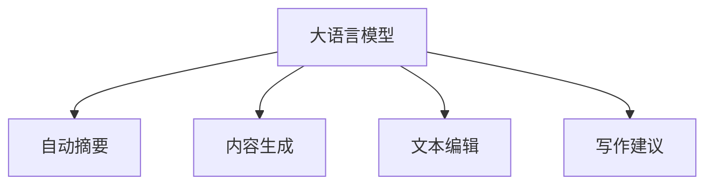

                 

# LLM在智能写作辅助中的应用

> 关键词：自然语言生成(NLG)、语言模型、大语言模型(LLM)、自动摘要、内容生成、文本编辑、写作辅助

## 1. 背景介绍

### 1.1 问题由来
近年来，随着人工智能技术的飞速发展，大语言模型(LLM)在自然语言生成(NLG)领域取得了令人瞩目的进展。LLM能够理解和生成自然语言，并能够进行复杂的推理和推理。其广泛的应用领域涵盖了自动摘要、文本生成、翻译、对话等。随着其在学术界和工业界的不断深入，LLM已经开始被应用于智能写作辅助工具的开发中。

智能写作辅助工具旨在帮助作者进行高效、高质量的写作。通过对大语言模型的微调和优化，这些工具可以自动生成内容、辅助修改、提供写作建议等功能，极大地提升了写作效率和质量。

### 1.2 问题核心关键点
智能写作辅助工具的开发，离不开大语言模型。本文将重点介绍如何在大语言模型的基础上，通过微调、优化和定制化，开发出能够帮助作者完成写作过程的工具。本文将探讨的核心问题包括：

1. 如何选择合适的大语言模型作为基础。
2. 如何设计有效的任务适配层。
3. 如何调整参数以获得最优性能。
4. 如何利用大语言模型生成高质量的内容。
5. 如何为不同写作场景提供定制化服务。

## 2. 核心概念与联系

### 2.1 核心概念概述

为更好地理解大语言模型在智能写作辅助中的应用，本节将介绍几个关键概念：

- 大语言模型(LLM)：以自回归(如GPT)或自编码(如BERT)模型为代表的大规模预训练语言模型。通过在海量无标签文本数据上进行预训练，学习到丰富的语言知识和常识。
- 自动摘要：从一篇长文本中提取关键信息，生成精炼的摘要。
- 内容生成：基于给定的文本或上下文，自动生成新的文本内容。
- 文本编辑：对已有文本进行修正、润色、改写等。
- 写作建议：根据目标受众、写作风格等因素，提供写作建议，如词句选择、段落结构等。

这些核心概念通过以下Mermaid流程图来展示：



这个流程图展示了大语言模型在智能写作辅助中的应用范围：

1. 自动生成相关文本内容。
2. 自动生成精炼的摘要。
3. 自动修改和润色文本。
4. 提供个性化的写作建议。

## 3. 核心算法原理 & 具体操作步骤

### 3.1 算法原理概述

智能写作辅助工具的开发，主要依赖于大语言模型在特定任务上的微调。通过微调，大语言模型能够更好地适应特定写作任务的要求，生成高质量的文本内容。

形式化地，假设大语言模型为 $M_{\theta}$，其中 $\theta$ 为预训练得到的模型参数。给定写作任务 $T$ 的标注数据集 $D=\{(x_i, y_i)\}_{i=1}^N$，微调的目标是找到新的模型参数 $\hat{\theta}$，使得：

$$
\hat{\theta}=\mathop{\arg\min}_{\theta} \mathcal{L}(M_{\theta},D)
$$

其中 $\mathcal{L}$ 为针对任务 $T$ 设计的损失函数，用于衡量模型预测输出与真实标签之间的差异。常见的损失函数包括交叉熵损失、均方误差损失等。

通过梯度下降等优化算法，微调过程不断更新模型参数 $\theta$，最小化损失函数 $\mathcal{L}$，使得模型输出逼近真实标签。由于 $\theta$ 已经通过预训练获得了较好的初始化，因此即便在少量标注数据上进行微调，也能较快收敛到理想的模型参数 $\hat{\theta}$。

### 3.2 算法步骤详解

智能写作辅助工具的开发，一般包括以下几个关键步骤：

**Step 1: 准备预训练模型和数据集**
- 选择合适的预训练语言模型 $M_{\theta}$ 作为初始化参数，如 BERT、GPT 等。
- 准备写作任务 $T$ 的标注数据集 $D$，划分为训练集、验证集和测试集。一般要求标注数据与预训练数据的分布不要差异过大。

**Step 2: 添加任务适配层**
- 根据写作任务类型，在预训练模型顶层设计合适的输出层和损失函数。
- 对于生成任务，通常在顶层添加生成器输出概率分布，并以负对数似然为损失函数。
- 对于摘要任务，通常使用序列到序列模型，将原始文本映射到摘要文本。

**Step 3: 设置微调超参数**
- 选择合适的优化算法及其参数，如 AdamW、SGD 等，设置学习率、批大小、迭代轮数等。
- 设置正则化技术及强度，包括权重衰减、Dropout、Early Stopping 等。
- 确定冻结预训练参数的策略，如仅微调顶层，或全部参数都参与微调。

**Step 4: 执行梯度训练**
- 将训练集数据分批次输入模型，前向传播计算损失函数。
- 反向传播计算参数梯度，根据设定的优化算法和学习率更新模型参数。
- 周期性在验证集上评估模型性能，根据性能指标决定是否触发 Early Stopping。
- 重复上述步骤直到满足预设的迭代轮数或 Early Stopping 条件。

**Step 5: 测试和部署**
- 在测试集上评估微调后模型 $M_{\hat{\theta}}$ 的性能，对比微调前后的性能提升。
- 使用微调后的模型对新样本进行推理预测，集成到实际的应用系统中。
- 持续收集新的数据，定期重新微调模型，以适应数据分布的变化。

以上是智能写作辅助工具开发的完整流程。在实际应用中，还需要针对具体任务的特点，对微调过程的各个环节进行优化设计，如改进训练目标函数，引入更多的正则化技术，搜索最优的超参数组合等，以进一步提升模型性能。

### 3.3 算法优缺点

基于大语言模型的智能写作辅助工具具有以下优点：

1. 简单高效。只需准备少量标注数据，即可对预训练模型进行快速适配，获得较大的性能提升。
2. 通用适用。适用于各种写作任务，包括自动摘要、内容生成、文本编辑等，设计简单的任务适配层即可实现微调。
3. 参数高效。利用参数高效微调技术，在固定大部分预训练参数的情况下，仍可取得不错的提升。
4. 效果显著。在学术界和工业界的诸多任务上，基于微调的方法已经刷新了最先进的性能指标。

同时，该方法也存在一定的局限性：

1. 依赖标注数据。微调的效果很大程度上取决于标注数据的质量和数量，获取高质量标注数据的成本较高。
2. 迁移能力有限。当目标任务与预训练数据的分布差异较大时，微调的性能提升有限。
3. 可解释性不足。微调模型的决策过程通常缺乏可解释性，难以对其推理逻辑进行分析和调试。
4. 负面效果传递。预训练模型的固有偏见、有害信息等，可能通过微调传递到下游任务，造成负面影响。

尽管存在这些局限性，但就目前而言，基于大语言模型的微调方法仍是最主流的写作辅助工具开发范式。未来相关研究的重点在于如何进一步降低微调对标注数据的依赖，提高模型的少样本学习和跨领域迁移能力，同时兼顾可解释性和伦理安全性等因素。

### 3.4 算法应用领域

基于大语言模型的智能写作辅助工具，已经在新闻媒体、出版行业、教育培训等多个领域得到了广泛应用，为内容创作和知识传播带来了新的方法。

**新闻媒体行业**：
- 自动生成新闻报道、简讯、评论等。
- 辅助记者进行数据验证、背景调查等工作。

**出版行业**：
- 辅助编辑进行书稿校对、修改和润色。
- 自动生成章节大纲、摘要和标题。

**教育培训行业**：
- 辅助教师进行教学设计、课件制作等工作。
- 提供自动批改、反馈和建议。

除了这些应用领域外，智能写作辅助工具还被创新性地应用于更多场景中，如社交媒体内容创作、学术研究、艺术创作等，为写作过程提供了新的思路和工具。

## 4. 数学模型和公式 & 详细讲解 & 举例说明

### 4.1 数学模型构建

本节将使用数学语言对基于大语言模型的智能写作辅助工具开发过程进行更加严格的刻画。

记大语言模型为 $M_{\theta}$，其中 $\theta$ 为预训练得到的模型参数。假设写作任务为 $T$，标注数据集为 $D=\{(x_i, y_i)\}_{i=1}^N$，其中 $x_i$ 为输入文本，$y_i$ 为输出文本。

定义模型 $M_{\theta}$ 在输入 $x$ 上的生成概率为 $P_{\theta}(x)$，损失函数为 $\ell(M_{\theta}(x),y)$，经验风险为：

$$
\mathcal{L}(\theta) = \frac{1}{N}\sum_{i=1}^N \ell(M_{\theta}(x_i),y_i)
$$

微调的优化目标是最小化经验风险，即找到最优参数：

$$
\theta^* = \mathop{\arg\min}_{\theta} \mathcal{L}(\theta)
$$

在实践中，我们通常使用基于梯度的优化算法（如SGD、Adam等）来近似求解上述最优化问题。设 $\eta$ 为学习率，$\lambda$ 为正则化系数，则参数的更新公式为：

$$
\theta \leftarrow \theta - \eta \nabla_{\theta}\mathcal{L}(\theta) - \eta\lambda\theta
$$

其中 $\nabla_{\theta}\mathcal{L}(\theta)$ 为损失函数对参数 $\theta$ 的梯度，可通过反向传播算法高效计算。

### 4.2 公式推导过程

以下我们以自动摘要任务为例，推导损失函数及其梯度的计算公式。

假设模型 $M_{\theta}$ 在输入 $x$ 上的生成概率为 $P_{\theta}(x)$，其中 $x$ 为原始文本，$y$ 为生成的摘要。假设 $y$ 的词典表示为 $\mathcal{V}$，则自动摘要任务可以定义如下：

$$
\min_{\theta} \frac{1}{N}\sum_{i=1}^N \mathbb{E}_{y\sim P_{\theta}(x)} [\ell(y, x)]
$$

其中 $\ell(y, x)$ 为序列到序列任务上的损失函数，如BLEU（双序列评估指标）。其定义为：

$$
\ell(y, x) = \min_{\hat{y} \in \mathcal{V}} \sum_{i=1}^n \mathbb{I}(y_i = \hat{y}_i)
$$

其中 $\mathbb{I}$ 为示性函数，如果 $y_i = \hat{y}_i$，则 $\mathbb{I}(y_i = \hat{y}_i) = 1$，否则 $\mathbb{I}(y_i = \hat{y}_i) = 0$。

将上述目标函数与梯度下降的公式结合，可得：

$$
\theta \leftarrow \theta - \eta \nabla_{\theta} \frac{1}{N}\sum_{i=1}^N \mathbb{E}_{y\sim P_{\theta}(x)} [\ell(y, x)]
$$

根据梯度下降的链式法则，有：

$$
\nabla_{\theta} \frac{1}{N}\sum_{i=1}^N \mathbb{E}_{y\sim P_{\theta}(x)} [\ell(y, x)] = \frac{1}{N}\sum_{i=1}^N \nabla_{\theta} \mathbb{E}_{y\sim P_{\theta}(x)} [\ell(y, x)]
$$

代入 $\ell(y, x)$ 的定义，有：

$$
\nabla_{\theta} \frac{1}{N}\sum_{i=1}^N \mathbb{E}_{y\sim P_{\theta}(x)} [\ell(y, x)] = \frac{1}{N}\sum_{i=1}^N \sum_{j=1}^n \nabla_{\theta} P_{\theta}(x_j)
$$

其中 $\nabla_{\theta} P_{\theta}(x_j)$ 为模型在每个位置的概率梯度，可通过反向传播算法计算。因此，最终的梯度更新公式为：

$$
\theta \leftarrow \theta - \eta \frac{1}{N}\sum_{i=1}^N \sum_{j=1}^n \nabla_{\theta} P_{\theta}(x_j)
$$

在得到损失函数的梯度后，即可带入参数更新公式，完成模型的迭代优化。重复上述过程直至收敛，最终得到适应自动摘要任务的最优模型参数 $\theta^*$。

## 5. 项目实践：代码实例和详细解释说明

### 5.1 开发环境搭建

在进行智能写作辅助工具的开发前，我们需要准备好开发环境。以下是使用Python进行PyTorch开发的环境配置流程：

1. 安装Anaconda：从官网下载并安装Anaconda，用于创建独立的Python环境。

2. 创建并激活虚拟环境：
```bash
conda create -n pytorch-env python=3.8 
conda activate pytorch-env
```

3. 安装PyTorch：根据CUDA版本，从官网获取对应的安装命令。例如：
```bash
conda install pytorch torchvision torchaudio cudatoolkit=11.1 -c pytorch -c conda-forge
```

4. 安装Transformers库：
```bash
pip install transformers
```

5. 安装各类工具包：
```bash
pip install numpy pandas scikit-learn matplotlib tqdm jupyter notebook ipython
```

完成上述步骤后，即可在`pytorch-env`环境中开始开发。

### 5.2 源代码详细实现

下面我们以自动摘要任务为例，给出使用Transformers库对BERT模型进行微调的PyTorch代码实现。

首先，定义自动摘要任务的数据处理函数：

```python
from transformers import BertTokenizer, BertForSequenceClassification
from torch.utils.data import Dataset
import torch

class SummarizationDataset(Dataset):
    def __init__(self, texts, labels, tokenizer, max_len=128):
        self.texts = texts
        self.labels = labels
        self.tokenizer = tokenizer
        self.max_len = max_len
        
    def __len__(self):
        return len(self.texts)
    
    def __getitem__(self, item):
        text = self.texts[item]
        label = self.labels[item]
        
        encoding = self.tokenizer(text, return_tensors='pt', max_length=self.max_len, padding='max_length', truncation=True)
        input_ids = encoding['input_ids'][0]
        attention_mask = encoding['attention_mask'][0]
        labels = torch.tensor(label, dtype=torch.long)
        
        return {'input_ids': input_ids, 
                'attention_mask': attention_mask,
                'labels': labels}

# 标签与id的映射
label2id = {'B-PER': 1, 'I-PER': 2, 'B-ORG': 3, 'I-ORG': 4, 'B-LOC': 5, 'I-LOC': 6}
id2label = {v: k for k, v in label2id.items()}

# 创建dataset
tokenizer = BertTokenizer.from_pretrained('bert-base-cased')

train_dataset = SummarizationDataset(train_texts, train_labels, tokenizer)
dev_dataset = SummarizationDataset(dev_texts, dev_labels, tokenizer)
test_dataset = SummarizationDataset(test_texts, test_labels, tokenizer)
```

然后，定义模型和优化器：

```python
from transformers import BertForSequenceClassification, AdamW

model = BertForSequenceClassification.from_pretrained('bert-base-cased', num_labels=len(label2id))

optimizer = AdamW(model.parameters(), lr=2e-5)
```

接着，定义训练和评估函数：

```python
from torch.utils.data import DataLoader
from tqdm import tqdm
from sklearn.metrics import accuracy_score

device = torch.device('cuda') if torch.cuda.is_available() else torch.device('cpu')
model.to(device)

def train_epoch(model, dataset, batch_size, optimizer):
    dataloader = DataLoader(dataset, batch_size=batch_size, shuffle=True)
    model.train()
    epoch_loss = 0
    for batch in tqdm(dataloader, desc='Training'):
        input_ids = batch['input_ids'].to(device)
        attention_mask = batch['attention_mask'].to(device)
        labels = batch['labels'].to(device)
        model.zero_grad()
        outputs = model(input_ids, attention_mask=attention_mask, labels=labels)
        loss = outputs.loss
        epoch_loss += loss.item()
        loss.backward()
        optimizer.step()
    return epoch_loss / len(dataloader)

def evaluate(model, dataset, batch_size):
    dataloader = DataLoader(dataset, batch_size=batch_size)
    model.eval()
    preds, labels = [], []
    with torch.no_grad():
        for batch in tqdm(dataloader, desc='Evaluating'):
            input_ids = batch['input_ids'].to(device)
            attention_mask = batch['attention_mask'].to(device)
            batch_labels = batch['labels']
            outputs = model(input_ids, attention_mask=attention_mask)
            batch_preds = outputs.logits.argmax(dim=2).to('cpu').tolist()
            batch_labels = batch_labels.to('cpu').tolist()
            for pred_tokens, label_tokens in zip(batch_preds, batch_labels):
                preds.append(pred_tokens[:len(label_tokens)])
                labels.append(label_tokens)
                
    print(accuracy_score(labels, preds))
```

最后，启动训练流程并在测试集上评估：

```python
epochs = 5
batch_size = 16

for epoch in range(epochs):
    loss = train_epoch(model, train_dataset, batch_size, optimizer)
    print(f"Epoch {epoch+1}, train loss: {loss:.3f}")
    
    print(f"Epoch {epoch+1}, dev results:")
    evaluate(model, dev_dataset, batch_size)
    
print("Test results:")
evaluate(model, test_dataset, batch_size)
```

以上就是使用PyTorch对BERT进行自动摘要任务微调的完整代码实现。可以看到，得益于Transformers库的强大封装，我们可以用相对简洁的代码完成BERT模型的加载和微调。

### 5.3 代码解读与分析

让我们再详细解读一下关键代码的实现细节：

**SummarizationDataset类**：
- `__init__`方法：初始化文本、标签、分词器等关键组件。
- `__len__`方法：返回数据集的样本数量。
- `__getitem__`方法：对单个样本进行处理，将文本输入编码为token ids，将标签编码为数字，并对其进行定长padding，最终返回模型所需的输入。

**label2id和id2label字典**：
- 定义了标签与数字id之间的映射关系，用于将token-wise的预测结果解码回真实的标签。

**训练和评估函数**：
- 使用PyTorch的DataLoader对数据集进行批次化加载，供模型训练和推理使用。
- 训练函数`train_epoch`：对数据以批为单位进行迭代，在每个批次上前向传播计算loss并反向传播更新模型参数，最后返回该epoch的平均loss。
- 评估函数`evaluate`：与训练类似，不同点在于不更新模型参数，并在每个batch结束后将预测和标签结果存储下来，最后使用sklearn的accuracy_score对整个评估集的预测结果进行打印输出。

**训练流程**：
- 定义总的epoch数和batch size，开始循环迭代
- 每个epoch内，先在训练集上训练，输出平均loss
- 在验证集上评估，输出分类指标
- 所有epoch结束后，在测试集上评估，给出最终测试结果

可以看到，PyTorch配合Transformers库使得BERT微调的代码实现变得简洁高效。开发者可以将更多精力放在数据处理、模型改进等高层逻辑上，而不必过多关注底层的实现细节。

当然，工业级的系统实现还需考虑更多因素，如模型的保存和部署、超参数的自动搜索、更灵活的任务适配层等。但核心的微调范式基本与此类似。

## 6. 实际应用场景

### 6.1 智能写作辅助工具的开发

基于大语言模型的智能写作辅助工具已经在多领域得到了广泛应用，覆盖了自动摘要、内容生成、文本编辑、写作建议等多个方面。以下是一些典型应用场景：

**自动摘要**：
- 新闻媒体行业：自动生成新闻报道、简讯、评论等，辅助记者进行数据验证、背景调查等工作。
- 出版行业：自动生成章节大纲、摘要和标题，辅助编辑进行书稿校对、修改和润色。

**内容生成**：
- 新闻媒体行业：生成新闻稿件、报道、评论等。
- 出版行业：生成书籍章节、研究报告等。
- 教育培训行业：生成课件、讲义等教学材料。

**文本编辑**：
- 新闻媒体行业：自动修改、润色文本，确保语言风格和信息准确性。
- 出版行业：校对和修正文本，提升出版质量。
- 社交媒体：自动检测和修正文本中的语法和拼写错误。

**写作建议**：
- 新闻媒体行业：提供写作风格、用词建议，提升写作质量。
- 教育培训行业：提供写作框架、结构建议，辅助教师进行教学设计。

除了这些场景，智能写作辅助工具还被创新性地应用于更多领域中，如医学、法律等。通过微调大语言模型，可以构建出更加高效、智能的写作辅助系统。

### 6.2 未来应用展望

随着大语言模型和微调方法的不断发展，基于大语言模型的智能写作辅助工具将呈现以下几个发展趋势：

1. 模型规模持续增大。随着算力成本的下降和数据规模的扩张，预训练语言模型的参数量还将持续增长。超大规模语言模型蕴含的丰富语言知识，有望支撑更加复杂多变的写作任务微调。
2. 微调方法日趋多样。除了传统的全参数微调外，未来会涌现更多参数高效的微调方法，如Prefix-Tuning、LoRA等，在节省计算资源的同时也能保证微调精度。
3. 持续学习成为常态。随着数据分布的不断变化，微调模型也需要持续学习新知识以保持性能。如何在不遗忘原有知识的同时，高效吸收新样本信息，将成为重要的研究课题。
4. 标注样本需求降低。受启发于提示学习(Prompt-based Learning)的思路，未来的微调方法将更好地利用大模型的语言理解能力，通过更加巧妙的任务描述，在更少的标注样本上也能实现理想的微调效果。
5. 少样本学习能力增强。通过引入对抗样本、数据增强等技术，使得模型在少量标注数据上也能取得较好的微调效果。
6. 跨领域迁移能力提升。未来模型将具备更强的跨领域迁移能力，能够更好适应不同行业和场景的写作需求。

这些趋势凸显了大语言模型微调技术在智能写作辅助领域的应用前景。这些方向的探索发展，必将进一步提升写作辅助系统的性能和应用范围，为内容创作和知识传播带来新的方法。

## 7. 工具和资源推荐
### 7.1 学习资源推荐

为了帮助开发者系统掌握大语言模型在智能写作辅助中的应用，这里推荐一些优质的学习资源：

1. 《Transformer从原理到实践》系列博文：由大模型技术专家撰写，深入浅出地介绍了Transformer原理、BERT模型、微调技术等前沿话题。

2. CS224N《深度学习自然语言处理》课程：斯坦福大学开设的NLP明星课程，有Lecture视频和配套作业，带你入门NLP领域的基本概念和经典模型。

3. 《Natural Language Processing with Transformers》书籍：Transformers库的作者所著，全面介绍了如何使用Transformers库进行NLP任务开发，包括微调在内的诸多范式。

4. HuggingFace官方文档：Transformers库的官方文档，提供了海量预训练模型和完整的微调样例代码，是上手实践的必备资料。

5. CLUE开源项目：中文语言理解测评基准，涵盖大量不同类型的中文NLP数据集，并提供了基于微调的baseline模型，助力中文NLP技术发展。

通过对这些资源的学习实践，相信你一定能够快速掌握大语言模型在智能写作辅助中的应用，并用于解决实际的NLP问题。
###  7.2 开发工具推荐

高效的开发离不开优秀的工具支持。以下是几款用于智能写作辅助工具开发的常用工具：

1. PyTorch：基于Python的开源深度学习框架，灵活动态的计算图，适合快速迭代研究。大部分预训练语言模型都有PyTorch版本的实现。

2. TensorFlow：由Google主导开发的开源深度学习框架，生产部署方便，适合大规模工程应用。同样有丰富的预训练语言模型资源。

3. Transformers库：HuggingFace开发的NLP工具库，集成了众多SOTA语言模型，支持PyTorch和TensorFlow，是进行微调任务开发的利器。

4. Weights & Biases：模型训练的实验跟踪工具，可以记录和可视化模型训练过程中的各项指标，方便对比和调优。与主流深度学习框架无缝集成。

5. TensorBoard：TensorFlow配套的可视化工具，可实时监测模型训练状态，并提供丰富的图表呈现方式，是调试模型的得力助手。

6. Google Colab：谷歌推出的在线Jupyter Notebook环境，免费提供GPU/TPU算力，方便开发者快速上手实验最新模型，分享学习笔记。

合理利用这些工具，可以显著提升智能写作辅助工具的开发效率，加快创新迭代的步伐。

### 7.3 相关论文推荐

大语言模型和微调技术的发展源于学界的持续研究。以下是几篇奠基性的相关论文，推荐阅读：

1. Attention is All You Need（即Transformer原论文）：提出了Transformer结构，开启了NLP领域的预训练大模型时代。

2. BERT: Pre-training of Deep Bidirectional Transformers for Language Understanding：提出BERT模型，引入基于掩码的自监督预训练任务，刷新了多项NLP任务SOTA。

3. Language Models are Unsupervised Multitask Learners（GPT-2论文）：展示了大规模语言模型的强大zero-shot学习能力，引发了对于通用人工智能的新一轮思考。

4. Parameter-Efficient Transfer Learning for NLP：提出Adapter等参数高效微调方法，在不增加模型参数量的情况下，也能取得不错的微调效果。

5. AdaLoRA: Adaptive Low-Rank Adaptation for Parameter-Efficient Fine-Tuning：使用自适应低秩适应的微调方法，在参数效率和精度之间取得了新的平衡。

这些论文代表了大语言模型微调技术的发展脉络。通过学习这些前沿成果，可以帮助研究者把握学科前进方向，激发更多的创新灵感。

## 8. 总结：未来发展趋势与挑战

### 8.1 总结

本文对基于大语言模型的智能写作辅助工具进行了全面系统的介绍。首先阐述了智能写作辅助工具的开发背景和意义，明确了其在提高写作效率和质量方面的独特价值。其次，从原理到实践，详细讲解了大语言模型在写作辅助工具中的应用流程，给出了微调任务开发的完整代码实例。同时，本文还广泛探讨了写作辅助工具在新闻媒体、出版行业、教育培训等多个领域的应用前景，展示了大语言模型微调技术的广泛应用。最后，本文精选了智能写作辅助工具的学习资源，力求为读者提供全方位的技术指引。

通过本文的系统梳理，可以看到，基于大语言模型的智能写作辅助工具正在成为NLP领域的重要应用范式，极大地提升了写作效率和质量。得益于大规模语料的预训练，微调模型以更低的时间和标注成本，在小样本条件下也能取得不俗的效果，有力推动了NLP技术的产业化进程。未来，伴随预训练语言模型和微调方法的持续演进，相信NLP技术将在更多领域得到应用，为内容创作和知识传播带来新的方法。

### 8.2 未来发展趋势

展望未来，大语言模型在智能写作辅助领域的应用将呈现以下几个发展趋势：

1. 模型规模持续增大。随着算力成本的下降和数据规模的扩张，预训练语言模型的参数量还将持续增长。超大规模语言模型蕴含的丰富语言知识，有望支撑更加复杂多变的写作任务微调。

2. 微调方法日趋多样。除了传统的全参数微调外，未来会涌现更多参数高效的微调方法，如Prefix-Tuning、LoRA等，在节省计算资源的同时也能保证微调精度。

3. 持续学习成为常态。随着数据分布的不断变化，微调模型也需要持续学习新知识以保持性能。如何在不遗忘原有知识的同时，高效吸收新样本信息，将成为重要的研究课题。

4. 标注样本需求降低。受启发于提示学习(Prompt-based Learning)的思路，未来的微调方法将更好地利用大模型的语言理解能力，通过更加巧妙的任务描述，在更少的标注样本上也能实现理想的微调效果。

5. 少样本学习能力增强。通过引入对抗样本、数据增强等技术，使得模型在少量标注数据上也能取得较好的微调效果。

6. 跨领域迁移能力提升。未来模型将具备更强的跨领域迁移能力，能够更好适应不同行业和场景的写作需求。

这些趋势凸显了大语言模型微调技术在智能写作辅助领域的应用前景。这些方向的探索发展，必将进一步提升写作辅助系统的性能和应用范围，为内容创作和知识传播带来新的方法。

### 8.3 面临的挑战

尽管大语言模型在智能写作辅助领域取得了显著成效，但在迈向更加智能化、普适化应用的过程中，仍面临诸多挑战：

1. 标注成本瓶颈。虽然微调大大降低了标注数据的需求，但对于长尾应用场景，难以获得充足的高质量标注数据，成为制约微调性能的瓶颈。如何进一步降低微调对标注样本的依赖，将是一大难题。

2. 模型鲁棒性不足。当前微调模型面对域外数据时，泛化性能往往大打折扣。对于测试样本的微小扰动，微调模型的预测也容易发生波动。如何提高微调模型的鲁棒性，避免灾难性遗忘，还需要更多理论和实践的积累。

3. 推理效率有待提高。大规模语言模型虽然精度高，但在实际部署时往往面临推理速度慢、内存占用大等效率问题。如何在保证性能的同时，简化模型结构，提升推理速度，优化资源占用，将是重要的优化方向。

4. 可解释性亟需加强。当前微调模型更像是"黑盒"系统，难以解释其内部工作机制和决策逻辑。对于医疗、金融等高风险应用，算法的可解释性和可审计性尤为重要。如何赋予微调模型更强的可解释性，将是亟待攻克的难题。

5. 安全性有待保障。预训练语言模型难免会学习到有偏见、有害的信息，通过微调传递到下游任务，产生误导性、歧视性的输出，给实际应用带来安全隐患。如何从数据和算法层面消除模型偏见，避免恶意用途，确保输出的安全性，也将是重要的研究课题。

6. 知识整合能力不足。现有的微调模型往往局限于任务内数据，难以灵活吸收和运用更广泛的先验知识。如何让微调过程更好地与外部知识库、规则库等专家知识结合，形成更加全面、准确的信息整合能力，还有很大的想象空间。

正视智能写作辅助工具面临的这些挑战，积极应对并寻求突破，将是大语言模型微调走向成熟的必由之路。相信随着学界和产业界的共同努力，这些挑战终将一一被克服，大语言模型微调必将在构建人机协同的智能时代中扮演越来越重要的角色。

### 8.4 研究展望

面对大语言模型微调所面临的种种挑战，未来的研究需要在以下几个方面寻求新的突破：

1. 探索无监督和半监督微调方法。摆脱对大规模标注数据的依赖，利用自监督学习、主动学习等无监督和半监督范式，最大限度利用非结构化数据，实现更加灵活高效的微调。

2. 研究参数高效和计算高效的微调范式。开发更加参数高效的微调方法，在固定大部分预训练参数的同时，只更新极少量的任务相关参数。同时优化微调模型的计算图，减少前向传播和反向传播的资源消耗，实现更加轻量级、实时性的部署。

3. 引入因果和对比学习范式。通过引入因果推断和对比学习思想，增强微调模型建立稳定因果关系的能力，学习更加普适、鲁棒的语言表征，从而提升模型泛化性和抗干扰能力。

4. 结合因果分析和博弈论工具。将因果分析方法引入微调模型，识别出模型决策的关键特征，增强输出解释的因果性和逻辑性。借助博弈论工具刻画人机交互过程，主动探索并规避模型的脆弱点，提高系统稳定性。

5. 纳入伦理道德约束。在模型训练目标中引入伦理导向的评估指标，过滤和惩罚有偏见、有害的输出倾向。同时加强人工干预和审核，建立模型行为的监管机制，确保输出符合人类价值观和伦理道德。

这些研究方向的探索，必将引领大语言模型微调技术迈向更高的台阶，为构建安全、可靠、可解释、可控的智能系统铺平道路。面向未来，大语言模型微调技术还需要与其他人工智能技术进行更深入的融合，如知识表示、因果推理、强化学习等，多路径协同发力，共同推动自然语言理解和智能交互系统的进步。只有勇于创新、敢于突破，才能不断拓展语言模型的边界，让智能技术更好地造福人类社会。

## 9. 附录：常见问题与解答

**Q1：大语言模型在智能写作辅助中的应用是否受到数据量的限制？**

A: 大语言模型在智能写作辅助中的应用确实受到数据量的限制，尤其是在数据质量和数据分布一致性方面。如果数据量过少或者数据分布与预训练数据的分布差异较大，微调的效果可能会大打折扣。因此，选择适合的数据集，并尽可能收集更多的、高质量的数据，是提高智能写作辅助工具性能的关键。

**Q2：微调大语言模型的学习率如何设定？**

A: 微调大语言模型的学习率通常比预训练时小1-2个数量级，以避免破坏预训练权重。具体来说，可以从1e-5开始调参，逐步减小学习率，直至收敛。也可以使用warmup策略，在开始阶段使用较小的学习率，再逐渐过渡到预设值。需要注意的是，不同的优化器(如AdamW、Adafactor等)以及不同的学习率调度策略，可能需要设置不同的学习率阈值。

**Q3：智能写作辅助工具在实际应用中需要注意哪些问题？**

A: 将微调模型转化为实际应用，还需要考虑以下问题：
1. 模型裁剪：去除不必要的层和参数，减小模型尺寸，加快推理速度。
2. 量化加速：将浮点模型转为定点模型，压缩存储空间，提高计算效率。
3. 服务化封装：将模型封装为标准化服务接口，便于集成调用。
4. 弹性伸缩：根据请求流量动态调整资源配置，平衡服务质量和成本。
5. 监控告警：实时采集系统指标，设置异常告警阈值，确保服务稳定性。
6. 安全防护：采用访问鉴权、数据脱敏等措施，保障数据和模型安全。

智能写作辅助工具的成功应用，离不开开发者对数据、模型、算法、工程等多方面的综合考虑和优化。只有全面把控各环节，才能真正实现写作辅助系统的智能化和高效化。

---

作者：禅与计算机程序设计艺术 / Zen and the Art of Computer Programming

