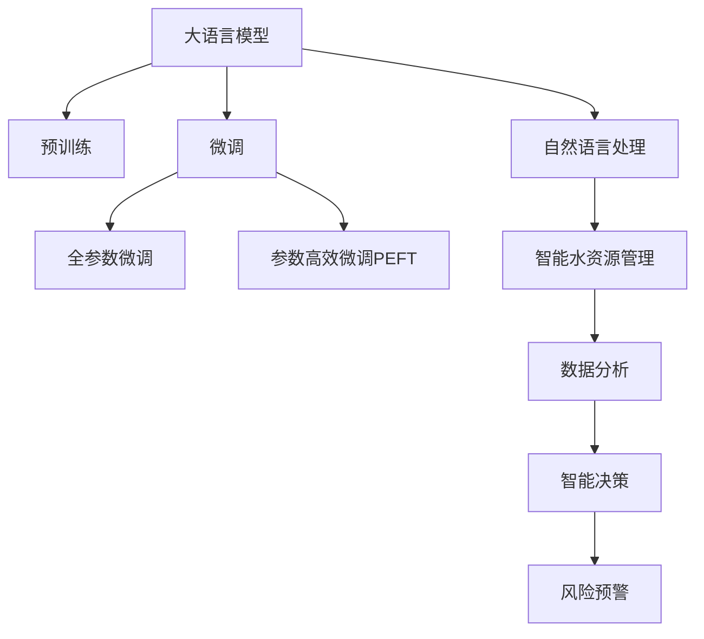

                 

# LLM在智能水资源管理中的潜在贡献

大语言模型（LLM）作为当前人工智能领域的热点技术，正在迅速改变各行各业的生产方式和工作流程。而水资源管理作为全球关注的重大问题，通过引入大语言模型，有望提升该领域的管理效率和决策科学性。本文将从背景、核心概念、算法原理及应用等方面全面介绍大语言模型在智能水资源管理中的潜在贡献，以期为相关领域的研究者和实践者提供有价值的参考。

## 1. 背景介绍

### 1.1 问题由来

水资源管理涉及到社会、经济、环境等多个方面，是全球各国政府和组织面临的共同挑战。传统的基于规则和经验的水资源管理方法，往往难以应对快速变化和复杂多变的自然和社会环境，且决策的科学性和准确性有待提升。近年来，随着人工智能和大数据技术的发展，越来越多的研究者和实践者开始探索利用先进技术手段提升水资源管理水平。大语言模型（LLM）作为近年来迅速崛起的人工智能技术，以其强大的语言理解和生成能力，为智能水资源管理提供了新的思路和手段。

### 1.2 问题核心关键点

智能水资源管理中引入大语言模型，主要涉及以下几个关键点：

- **数据分析与处理**：利用大语言模型进行数据清洗、特征提取和预处理，以提升数据的可用性和准确性。
- **自然语言处理**：通过大语言模型，实现对非结构化数据的理解与分析，提供结构化数据支持决策。
- **智能决策支持**：基于大语言模型的语言理解和生成能力，提供智能化的决策建议和方案。
- **风险预警与应急响应**：通过大语言模型，实现对水资源相关风险的自动识别和预警，提高应急响应的效率和效果。

这些关键点共同构成了智能水资源管理的核心需求，为大语言模型提供了广阔的应用场景和实践空间。

## 2. 核心概念与联系

### 2.1 核心概念概述

为更好地理解大语言模型在智能水资源管理中的应用，本节将介绍几个密切相关的核心概念：

- **大语言模型（LLM）**：以自回归（如GPT）或自编码（如BERT）模型为代表的大规模预训练语言模型。通过在大规模无标签文本语料上进行预训练，学习通用的语言表示，具备强大的语言理解和生成能力。
- **预训练（Pre-training）**：指在大规模无标签文本语料上，通过自监督学习任务训练通用语言模型的过程。常见的预训练任务包括掩码语言模型、下一句预测等。
- **微调（Fine-tuning）**：指在预训练模型的基础上，使用下游任务的少量标注数据，通过有监督地训练来优化模型在特定任务上的性能。
- **迁移学习（Transfer Learning）**：指将一个领域学习到的知识，迁移应用到另一个不同但相关的领域的学习范式。大模型的预训练-微调过程即是一种典型的迁移学习方式。
- **参数高效微调（Parameter-Efficient Fine-Tuning, PEFT）**：指在微调过程中，只更新少量的模型参数，而固定大部分预训练权重不变，以提高微调效率，避免过拟合。
- **自然语言处理（NLP）**：涉及文本数据的处理、分析和生成，是大语言模型应用的重要领域。

这些核心概念之间的逻辑关系可以通过以下Mermaid流程图来展示：



这个流程图展示了大语言模型的核心概念及其与智能水资源管理的联系：

1. 大语言模型通过预训练获得基础能力。
2. 微调是对预训练模型进行任务特定的优化，可以分为全参数微调和参数高效微调。
3. 自然语言处理是连接预训练模型与智能水资源管理的桥梁，通过微调或利用预训练知识，提升模型在水资源领域的适用性。
4. 智能水资源管理是应用大语言模型提升水资源管理效率和科学性的具体场景。

这些概念共同构成了大语言模型在水资源管理领域的应用框架，使其能够在此背景下发挥强大的语言理解和生成能力。通过理解这些核心概念，我们可以更好地把握大语言模型在水资源管理中的应用方向。

## 3. 核心算法原理 & 具体操作步骤

### 3.1 算法原理概述

基于大语言模型的水资源管理方法，本质上是一个有监督的细粒度迁移学习过程。其核心思想是：将预训练的大语言模型视作一个强大的"特征提取器"，通过在下游任务的标注数据上进行有监督地训练来优化模型在特定任务上的性能。

形式化地，假设预训练模型为 $M_{\theta}$，其中 $\theta$ 为预训练得到的模型参数。给定智能水资源管理任务的训练集 $D=\{(x_i, y_i)\}_{i=1}^N$，其中 $x_i$ 为输入的文本数据，$y_i$ 为标注的输出结果（如水量、水质、水文等），微调的目标是找到新的模型参数 $\hat{\theta}$，使得：

$$
\hat{\theta}=\mathop{\arg\min}_{\theta} \mathcal{L}(M_{\theta},D)
$$

其中 $\mathcal{L}$ 为针对任务 $T$ 设计的损失函数，用于衡量模型预测输出与真实标签之间的差异。常见的损失函数包括交叉熵损失、均方误差损失等。

通过梯度下降等优化算法，微调过程不断更新模型参数 $\theta$，最小化损失函数 $\mathcal{L}$，使得模型输出逼近真实标签。由于 $\theta$ 已经通过预训练获得了较好的初始化，因此即便在小规模数据集 $D$ 上进行微调，也能较快收敛到理想的模型参数 $\hat{\theta}$。

### 3.2 算法步骤详解

基于大语言模型的水资源管理微调一般包括以下几个关键步骤：

**Step 1: 准备预训练模型和数据集**
- 选择合适的预训练语言模型 $M_{\theta}$ 作为初始化参数，如 BERT、GPT等。
- 准备智能水资源管理任务的标注数据集 $D$，划分为训练集、验证集和测试集。一般要求标注数据与预训练数据的分布不要差异过大。

**Step 2: 添加任务适配层**
- 根据任务类型，在预训练模型顶层设计合适的输出层和损失函数。
- 对于分类任务，通常在顶层添加线性分类器和交叉熵损失函数。
- 对于生成任务，通常使用语言模型的解码器输出概率分布，并以负对数似然为损失函数。

**Step 3: 设置微调超参数**
- 选择合适的优化算法及其参数，如 AdamW、SGD 等，设置学习率、批大小、迭代轮数等。
- 设置正则化技术及强度，包括权重衰减、Dropout、Early Stopping等。
- 确定冻结预训练参数的策略，如仅微调顶层，或全部参数都参与微调。

**Step 4: 执行梯度训练**
- 将训练集数据分批次输入模型，前向传播计算损失函数。
- 反向传播计算参数梯度，根据设定的优化算法和学习率更新模型参数。
- 周期性在验证集上评估模型性能，根据性能指标决定是否触发 Early Stopping。
- 重复上述步骤直到满足预设的迭代轮数或 Early Stopping 条件。

**Step 5: 测试和部署**
- 在测试集上评估微调后模型 $M_{\hat{\theta}}$ 的性能，对比微调前后的精度提升。
- 使用微调后的模型对新样本进行推理预测，集成到实际的应用系统中。
- 持续收集新的数据，定期重新微调模型，以适应数据分布的变化。

以上是基于监督学习微调大语言模型的一般流程。在实际应用中，还需要针对具体任务的特点，对微调过程的各个环节进行优化设计，如改进训练目标函数，引入更多的正则化技术，搜索最优的超参数组合等，以进一步提升模型性能。

### 3.3 算法优缺点

基于大语言模型的水资源管理微调方法具有以下优点：

- **数据利用效率高**：相对于从头训练模型，微调方法只需要少量标注数据，能够高效利用已有的大规模预训练语料。
- **快速迭代**：通过微调，模型可以快速适应新任务，对于快速变化的水资源管理场景具有较强的灵活性。
- **模型性能提升显著**：微调可以显著提升模型在特定任务上的性能，尤其在标注数据不足的情况下，效果更为明显。

同时，该方法也存在一定的局限性：

- **依赖标注数据**：微调的效果很大程度上取决于标注数据的质量和数量，获取高质量标注数据的成本较高。
- **模型泛化能力有限**：当目标任务与预训练数据的分布差异较大时，微调的性能提升有限。
- **模型过拟合风险**：当微调数据量较小时，模型可能出现过拟合，导致在新数据上表现不佳。

尽管存在这些局限性，但就目前而言，基于监督学习的微调方法仍是大语言模型应用的主流范式。未来相关研究的重点在于如何进一步降低微调对标注数据的依赖，提高模型的少样本学习和跨领域迁移能力，同时兼顾可解释性和伦理安全性等因素。

### 3.4 算法应用领域

基于大语言模型的水资源管理微调方法，已经在多个领域得到了应用，具体如下：

1. **水资源监测与预警**：利用大语言模型对监测数据进行文本分析和理解，实现对水资源变化趋势的预测和预警。例如，通过对水质监测报告的语义分析，提前识别污染事件。

2. **水资源规划与优化**：通过大语言模型对历史和实时数据进行深度分析，辅助决策者进行水资源规划和优化。例如，利用语言模型对历史灌溉数据进行分析，优化灌溉策略。

3. **水资源管理政策制定**：通过大语言模型对政策文本进行语义分析，辅助制定更加科学合理的水资源管理政策。例如，对相关政策法规进行摘要和分类，提高政策制定效率。

4. **水资源公众教育**：通过大语言模型对科普文本进行生成和优化，提高公众对水资源保护的认知和参与度。例如，利用语言模型生成易于理解的水资源保护指南和宣传片。

5. **水资源安全与应急响应**：利用大语言模型对公共安全信息进行实时监测和分析，提高水资源安全应急响应的效率和效果。例如，对社交媒体上的公共讨论进行情感分析，及时调整应急响应策略。

这些应用场景展示了大语言模型在水资源管理中的广泛潜力，为该领域的智能化转型提供了新的工具和手段。

## 4. 数学模型和公式 & 详细讲解

### 4.1 数学模型构建

本节将使用数学语言对基于监督学习的大语言模型微调过程进行更加严格的刻画。

记预训练语言模型为 $M_{\theta}$，其中 $\theta$ 为预训练得到的模型参数。假设智能水资源管理任务的训练集为 $D=\{(x_i,y_i)\}_{i=1}^N$，其中 $x_i$ 为输入的文本数据，$y_i$ 为标注的输出结果。

定义模型 $M_{\theta}$ 在数据样本 $(x,y)$ 上的损失函数为 $\ell(M_{\theta}(x),y)$，则在数据集 $D$ 上的经验风险为：

$$
\mathcal{L}(\theta) = \frac{1}{N} \sum_{i=1}^N \ell(M_{\theta}(x_i),y_i)
$$

微调的优化目标是最小化经验风险，即找到最优参数：

$$
\theta^* = \mathop{\arg\min}_{\theta} \mathcal{L}(\theta)
$$

在实践中，我们通常使用基于梯度的优化算法（如SGD、Adam等）来近似求解上述最优化问题。设 $\eta$ 为学习率，$\lambda$ 为正则化系数，则参数的更新公式为：

$$
\theta \leftarrow \theta - \eta \nabla_{\theta}\mathcal{L}(\theta) - \eta\lambda\theta
$$

其中 $\nabla_{\theta}\mathcal{L}(\theta)$ 为损失函数对参数 $\theta$ 的梯度，可通过反向传播算法高效计算。

### 4.2 公式推导过程

以下我们以二分类任务为例，推导交叉熵损失函数及其梯度的计算公式。

假设模型 $M_{\theta}$ 在输入 $x$ 上的输出为 $\hat{y}=M_{\theta}(x) \in [0,1]$，表示样本属于正类的概率。真实标签 $y \in \{0,1\}$。则二分类交叉熵损失函数定义为：

$$
\ell(M_{\theta}(x),y) = -[y\log \hat{y} + (1-y)\log (1-\hat{y})]
$$

将其代入经验风险公式，得：

$$
\mathcal{L}(\theta) = -\frac{1}{N}\sum_{i=1}^N [y_i\log M_{\theta}(x_i)+(1-y_i)\log(1-M_{\theta}(x_i))]
$$

根据链式法则，损失函数对参数 $\theta_k$ 的梯度为：

$$
\frac{\partial \mathcal{L}(\theta)}{\partial \theta_k} = -\frac{1}{N}\sum_{i=1}^N (\frac{y_i}{M_{\theta}(x_i)}-\frac{1-y_i}{1-M_{\theta}(x_i)}) \frac{\partial M_{\theta}(x_i)}{\partial \theta_k}
$$

其中 $\frac{\partial M_{\theta}(x_i)}{\partial \theta_k}$ 可进一步递归展开，利用自动微分技术完成计算。

在得到损失函数的梯度后，即可带入参数更新公式，完成模型的迭代优化。重复上述过程直至收敛，最终得到适应智能水资源管理任务的最优模型参数 $\theta^*$。

## 5. 项目实践：代码实例和详细解释说明

### 5.1 开发环境搭建

在进行水资源管理微调实践前，我们需要准备好开发环境。以下是使用Python进行PyTorch开发的环境配置流程：

1. 安装Anaconda：从官网下载并安装Anaconda，用于创建独立的Python环境。

2. 创建并激活虚拟环境：
```bash
conda create -n pytorch-env python=3.8 
conda activate pytorch-env
```

3. 安装PyTorch：根据CUDA版本，从官网获取对应的安装命令。例如：
```bash
conda install pytorch torchvision torchaudio cudatoolkit=11.1 -c pytorch -c conda-forge
```

4. 安装Transformers库：
```bash
pip install transformers
```

5. 安装各类工具包：
```bash
pip install numpy pandas scikit-learn matplotlib tqdm jupyter notebook ipython
```

完成上述步骤后，即可在`pytorch-env`环境中开始微调实践。

### 5.2 源代码详细实现

下面我们以智能水资源监测任务为例，给出使用Transformers库对BERT模型进行微调的PyTorch代码实现。

首先，定义智能水资源监测任务的数据处理函数：

```python
from transformers import BertTokenizer
from torch.utils.data import Dataset
import torch

class WaterMonitoringDataset(Dataset):
    def __init__(self, texts, tags, tokenizer, max_len=128):
        self.texts = texts
        self.tags = tags
        self.tokenizer = tokenizer
        self.max_len = max_len
        
    def __len__(self):
        return len(self.texts)
    
    def __getitem__(self, item):
        text = self.texts[item]
        tags = self.tags[item]
        
        encoding = self.tokenizer(text, return_tensors='pt', max_length=self.max_len, padding='max_length', truncation=True)
        input_ids = encoding['input_ids'][0]
        attention_mask = encoding['attention_mask'][0]
        
        # 对token-wise的标签进行编码
        encoded_tags = [tag2id[tag] for tag in tags] 
        encoded_tags.extend([tag2id['O']] * (self.max_len - len(encoded_tags)))
        labels = torch.tensor(encoded_tags, dtype=torch.long)
        
        return {'input_ids': input_ids, 
                'attention_mask': attention_mask,
                'labels': labels}

# 标签与id的映射
tag2id = {'O': 0, 'High': 1, 'Low': 2, 'Normal': 3}
id2tag = {v: k for k, v in tag2id.items()}

# 创建dataset
tokenizer = BertTokenizer.from_pretrained('bert-base-cased')

train_dataset = WaterMonitoringDataset(train_texts, train_tags, tokenizer)
dev_dataset = WaterMonitoringDataset(dev_texts, dev_tags, tokenizer)
test_dataset = WaterMonitoringDataset(test_texts, test_tags, tokenizer)
```

然后，定义模型和优化器：

```python
from transformers import BertForTokenClassification, AdamW

model = BertForTokenClassification.from_pretrained('bert-base-cased', num_labels=len(tag2id))

optimizer = AdamW(model.parameters(), lr=2e-5)
```

接着，定义训练和评估函数：

```python
from torch.utils.data import DataLoader
from tqdm import tqdm
from sklearn.metrics import classification_report

device = torch.device('cuda') if torch.cuda.is_available() else torch.device('cpu')
model.to(device)

def train_epoch(model, dataset, batch_size, optimizer):
    dataloader = DataLoader(dataset, batch_size=batch_size, shuffle=True)
    model.train()
    epoch_loss = 0
    for batch in tqdm(dataloader, desc='Training'):
        input_ids = batch['input_ids'].to(device)
        attention_mask = batch['attention_mask'].to(device)
        labels = batch['labels'].to(device)
        model.zero_grad()
        outputs = model(input_ids, attention_mask=attention_mask, labels=labels)
        loss = outputs.loss
        epoch_loss += loss.item()
        loss.backward()
        optimizer.step()
    return epoch_loss / len(dataloader)

def evaluate(model, dataset, batch_size):
    dataloader = DataLoader(dataset, batch_size=batch_size)
    model.eval()
    preds, labels = [], []
    with torch.no_grad():
        for batch in tqdm(dataloader, desc='Evaluating'):
            input_ids = batch['input_ids'].to(device)
            attention_mask = batch['attention_mask'].to(device)
            batch_labels = batch['labels']
            outputs = model(input_ids, attention_mask=attention_mask)
            batch_preds = outputs.logits.argmax(dim=2).to('cpu').tolist()
            batch_labels = batch_labels.to('cpu').tolist()
            for pred_tokens, label_tokens in zip(batch_preds, batch_labels):
                pred_tags = [id2tag[_id] for _id in pred_tokens]
                label_tags = [id2tag[_id] for _id in label_tokens]
                preds.append(pred_tags[:len(label_tokens)])
                labels.append(label_tags)
                
    print(classification_report(labels, preds))
```

最后，启动训练流程并在测试集上评估：

```python
epochs = 5
batch_size = 16

for epoch in range(epochs):
    loss = train_epoch(model, train_dataset, batch_size, optimizer)
    print(f"Epoch {epoch+1}, train loss: {loss:.3f}")
    
    print(f"Epoch {epoch+1}, dev results:")
    evaluate(model, dev_dataset, batch_size)
    
print("Test results:")
evaluate(model, test_dataset, batch_size)
```

以上就是使用PyTorch对BERT进行智能水资源监测任务微调的完整代码实现。可以看到，得益于Transformers库的强大封装，我们可以用相对简洁的代码完成BERT模型的加载和微调。

### 5.3 代码解读与分析

让我们再详细解读一下关键代码的实现细节：

**WaterMonitoringDataset类**：
- `__init__`方法：初始化文本、标签、分词器等关键组件。
- `__len__`方法：返回数据集的样本数量。
- `__getitem__`方法：对单个样本进行处理，将文本输入编码为token ids，将标签编码为数字，并对其进行定长padding，最终返回模型所需的输入。

**tag2id和id2tag字典**：
- 定义了标签与数字id之间的映射关系，用于将token-wise的预测结果解码回真实的标签。

**训练和评估函数**：
- 使用PyTorch的DataLoader对数据集进行批次化加载，供模型训练和推理使用。
- 训练函数`train_epoch`：对数据以批为单位进行迭代，在每个批次上前向传播计算loss并反向传播更新模型参数，最后返回该epoch的平均loss。
- 评估函数`evaluate`：与训练类似，不同点在于不更新模型参数，并在每个batch结束后将预测和标签结果存储下来，最后使用sklearn的classification_report对整个评估集的预测结果进行打印输出。

**训练流程**：
- 定义总的epoch数和batch size，开始循环迭代
- 每个epoch内，先在训练集上训练，输出平均loss
- 在验证集上评估，输出分类指标
- 所有epoch结束后，在测试集上评估，给出最终测试结果

可以看到，PyTorch配合Transformers库使得BERT微调的代码实现变得简洁高效。开发者可以将更多精力放在数据处理、模型改进等高层逻辑上，而不必过多关注底层的实现细节。

当然，工业级的系统实现还需考虑更多因素，如模型的保存和部署、超参数的自动搜索、更灵活的任务适配层等。但核心的微调范式基本与此类似。

## 6. 实际应用场景

### 6.1 智能水资源监测

基于大语言模型的智能水资源监测系统，可以通过对水文、水质等监测数据进行实时分析，自动识别异常情况，实现水资源变化的智能监测和预警。

具体而言，可以收集水资源监测站点的实时数据，包括流量、水位、水质等指标，将数据文本化并标记为正常或异常状态。利用大语言模型对监测数据进行深度理解，训练出能够自动识别异常情况的系统。一旦监测到异常情况，系统便能够自动报警，并提供详细的分析和解决方案，提高水资源管理的安全性和效率。

### 6.2 智能水资源调度

通过大语言模型，可以实现对水资源调度的智能化和优化。水资源调度涉及多个部门和环节，管理复杂，且存在资源分配不均、决策不科学等问题。引入大语言模型，可以实现对历史和实时数据的深度分析，辅助决策者进行水资源调度和优化。

例如，利用大语言模型对历史灌溉数据进行分析，生成智能灌溉建议。或者，利用模型对实时用水情况进行预测，优化用水策略，提高水资源利用效率。

### 6.3 智能水资源规划

水资源规划需要综合考虑自然和社会因素，传统方法往往需要大量人工分析和处理，耗时耗力。通过大语言模型，可以实现对规划文本的深度理解和自动摘要，辅助决策者制定更加科学合理的水资源规划方案。

例如，对政府发布的水资源政策进行语义分析，提取出关键信息和要求，生成政策摘要。或者，对专家评估报告进行文本理解，抽取规划建议和关键数据，辅助规划决策。

### 6.4 智能水资源管理政策制定

通过大语言模型，可以实现对政策文本的深度理解和智能生成，辅助决策者制定更加科学合理的水资源管理政策。

例如，对政策法规进行语义分析，提取出关键信息和要求。或者，利用模型自动生成政策草稿，提供政策制定的参考建议。这将显著提高政策制定的效率和科学性，帮助政府部门更好地管理水资源。

### 6.5 智能水资源公众教育

水资源保护需要公众的广泛参与和支持。通过大语言模型，可以实现对科普文本的智能生成和优化，提高公众对水资源保护的认知和参与度。

例如，生成易于理解的水资源保护指南和宣传片，向公众普及水资源保护知识。或者，对社交媒体上的公众讨论进行情感分析，及时调整宣传策略，提高宣传效果。

## 7. 工具和资源推荐

### 7.1 学习资源推荐

为了帮助开发者系统掌握大语言模型在水资源管理中的应用，这里推荐一些优质的学习资源：

1. 《Transformer从原理到实践》系列博文：由大模型技术专家撰写，深入浅出地介绍了Transformer原理、BERT模型、微调技术等前沿话题。

2. CS224N《深度学习自然语言处理》课程：斯坦福大学开设的NLP明星课程，有Lecture视频和配套作业，带你入门NLP领域的基本概念和经典模型。

3. 《Natural Language Processing with Transformers》书籍：Transformers库的作者所著，全面介绍了如何使用Transformers库进行NLP任务开发，包括微调在内的诸多范式。

4. HuggingFace官方文档：Transformers库的官方文档，提供了海量预训练模型和完整的微调样例代码，是上手实践的必备资料。

5. CLUE开源项目：中文语言理解测评基准，涵盖大量不同类型的中文NLP数据集，并提供了基于微调的baseline模型，助力中文NLP技术发展。

通过对这些资源的学习实践，相信你一定能够快速掌握大语言模型在水资源管理中的应用，并用于解决实际的NLP问题。
###  7.2 开发工具推荐

高效的开发离不开优秀的工具支持。以下是几款用于大语言模型微调开发的常用工具：

1. PyTorch：基于Python的开源深度学习框架，灵活动态的计算图，适合快速迭代研究。大部分预训练语言模型都有PyTorch版本的实现。

2. TensorFlow：由Google主导开发的开源深度学习框架，生产部署方便，适合大规模工程应用。同样有丰富的预训练语言模型资源。

3. Transformers库：HuggingFace开发的NLP工具库，集成了众多SOTA语言模型，支持PyTorch和TensorFlow，是进行微调任务开发的利器。

4. Weights & Biases：模型训练的实验跟踪工具，可以记录和可视化模型训练过程中的各项指标，方便对比和调优。与主流深度学习框架无缝集成。

5. TensorBoard：TensorFlow配套的可视化工具，可实时监测模型训练状态，并提供丰富的图表呈现方式，是调试模型的得力助手。

6. Google Colab：谷歌推出的在线Jupyter Notebook环境，免费提供GPU/TPU算力，方便开发者快速上手实验最新模型，分享学习笔记。

合理利用这些工具，可以显著提升大语言模型在水资源管理领域的开发效率，加快创新迭代的步伐。

### 7.3 相关论文推荐

大语言模型和微调技术的发展源于学界的持续研究。以下是几篇奠基性的相关论文，推荐阅读：

1. Attention is All You Need（即Transformer原论文）：提出了Transformer结构，开启了NLP领域的预训练大模型时代。

2. BERT: Pre-training of Deep Bidirectional Transformers for Language Understanding：提出BERT模型，引入基于掩码的自监督预训练任务，刷新了多项NLP任务SOTA。

3. Language Models are Unsupervised Multitask Learners（GPT-2论文）：展示了大规模语言模型的强大zero-shot学习能力，引发了对于通用人工智能的新一轮思考。

4. Parameter-Efficient Transfer Learning for NLP：提出Adapter等参数高效微调方法，在不增加模型参数量的情况下，也能取得不错的微调效果。

5. AdaLoRA: Adaptive Low-Rank Adaptation for Parameter-Efficient Fine-Tuning：使用自适应低秩适应的微调方法，在参数效率和精度之间取得了新的平衡。

这些论文代表了大语言模型微调技术的发展脉络。通过学习这些前沿成果，可以帮助研究者把握学科前进方向，激发更多的创新灵感。

## 8. 总结：未来发展趋势与挑战

### 8.1 总结

本文对基于大语言模型的水资源管理方法进行了全面系统的介绍。首先阐述了智能水资源管理中引入大语言模型的背景和意义，明确了水资源管理智能化转型的需求。其次，从原理到实践，详细讲解了监督微调的数学原理和关键步骤，给出了智能水资源监测任务的完整代码实现。同时，本文还广泛探讨了水资源管理中智能水资源监测、智能水资源调度、智能水资源规划等多个应用场景，展示了大语言模型在水资源管理中的广泛潜力。此外，本文精选了微调技术的各类学习资源，力求为读者提供全方位的技术指引。

通过本文的系统梳理，可以看到，基于大语言模型的智能水资源管理方法，已经在多个领域得到了应用，为水资源管理的智能化和科学化提供了新的思路和手段。未来，伴随大语言模型和微调方法的持续演进，相信智能水资源管理技术将迎来更大的突破和发展。

### 8.2 未来发展趋势

展望未来，大语言模型在水资源管理中的应用将呈现以下几个发展趋势：

1. **数据驱动决策**：利用大语言模型对海量数据进行深度分析，提供科学合理的决策支持。例如，通过对历史和实时数据进行语义理解，生成智能化的决策建议。

2. **跨领域知识整合**：将跨领域的知识进行整合，提升模型对水资源问题的理解和处理能力。例如，将水文知识与气象、地质等知识结合，提升水资源管理的全面性和科学性。

3. **多模态融合**：利用视觉、听觉等多种模态数据，提升水资源管理系统的感知和处理能力。例如，将水文数据与遥感影像、卫星图像等结合，进行综合分析。

4. **实时动态监测**：利用大语言模型对实时数据进行实时分析和预警，提高水资源管理的响应速度和效率。例如，对社交媒体上的公共讨论进行情感分析，及时调整管理策略。

5. **智能调度与优化**：通过大语言模型实现对水资源调度的智能化和优化。例如，利用模型对实时用水情况进行预测，优化用水策略，提高水资源利用效率。

6. **知识图谱辅助**：利用知识图谱对水资源相关知识进行整合和利用，提升模型的推理和决策能力。例如，将水资源知识与专家知识结合，提供更加全面的分析建议。

以上趋势凸显了大语言模型在水资源管理中的广阔前景。这些方向的探索发展，必将进一步提升水资源管理的智能化和科学性，为实现可持续发展目标提供新的技术路径。

### 8.3 面临的挑战

尽管大语言模型在水资源管理中的应用取得了显著进展，但在迈向更加智能化、普适化应用的过程中，仍面临诸多挑战：

1. **数据隐私与安全**：水资源管理涉及大量敏感数据，如何在保护数据隐私的同时，充分利用数据进行智能决策，是亟需解决的问题。

2. **模型鲁棒性不足**：水资源管理场景中，模型的泛化能力仍需进一步提升，以应对复杂多变的环境。例如，在极端天气条件下，模型的预测性能可能大打折扣。

3. **计算资源限制**：大语言模型往往需要较大的计算资源，如何在资源受限的情况下，仍能高效运行模型，是实际应用中需要解决的问题。

4. **模型解释性不足**：水资源管理决策需要高度可解释性和透明性，当前大语言模型往往像"黑盒"系统，难以解释其内部工作机制和决策逻辑。

5. **伦理与法规合规**：大语言模型在水资源管理中的应用需要遵守相关伦理和法规，确保模型的决策过程和结果符合社会价值观和法律要求。

6. **跨学科知识融合**：水资源管理涉及多学科知识，如何将不同学科的知识有效融合，提升模型的综合能力和应用效果，是未来的重要研究方向。

这些挑战需要我们共同面对并积极应对，才能将大语言模型在水资源管理中的应用推向成熟，发挥其潜力。

### 8.4 研究展望

面对水资源管理中大语言模型面临的挑战，未来的研究需要在以下几个方面寻求新的突破：

1. **数据隐私保护**：开发隐私保护技术，如差分隐私、联邦学习等，确保在保护数据隐私的前提下，充分利用数据进行智能决策。

2. **模型鲁棒性提升**：研究鲁棒性强化方法，如对抗训练、泛化学习等，提高模型对复杂环境和突发事件的应对能力。

3. **计算资源优化**：优化模型结构和算法，提升模型在资源受限情况下的运行效率，如模型压缩、剪枝等。

4. **模型可解释性增强**：引入可解释性技术，如因果分析、可解释性模型等，增强模型的透明度和可信度。

5. **跨学科知识融合**：加强跨学科知识的整合和利用，提升模型的综合能力和应用效果，如将水资源知识与气象、地质等知识结合。

6. **法规合规与伦理考量**：研究伦理和法规导向的模型设计方法，确保模型的决策过程和结果符合社会价值观和法律要求。

这些研究方向的探索，必将引领大语言模型在水资源管理中的应用迈向更高的台阶，为实现水资源的可持续管理提供新的技术路径。面向未来，大语言模型在水资源管理中的应用还需要与其他人工智能技术进行更深入的融合，如知识表示、因果推理、强化学习等，多路径协同发力，共同推动水资源管理的智能化和科学化。只有勇于创新、敢于突破，才能不断拓展大语言模型的应用边界，让智能技术更好地服务于水资源管理领域。

