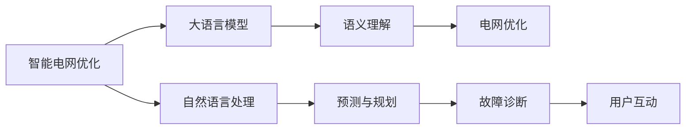

                 

# LLM在智能电网优化中的应用探索

大语言模型（Large Language Model, LLM）以其强大的自然语言处理能力，已经在多个领域展现了令人瞩目的应用潜力。在智能电网优化领域，大语言模型可以通过其丰富的知识和推理能力，辅助解决智能电网中的复杂问题。本文将深入探讨大语言模型在智能电网优化中的应用，包括其核心概念、算法原理、操作步骤、实际应用案例等，并对其未来发展趋势和面临的挑战进行总结。

## 1. 背景介绍

### 1.1 问题由来
智能电网作为能源互联网的重要组成部分，正面临越来越多的挑战。随着分布式能源的兴起，电力系统的复杂性和不确定性显著增加，如何高效地管理和优化智能电网，确保能源供应的稳定性、可靠性和经济性，成为了当下亟待解决的重要问题。传统的电网优化方法依赖于固定的规则和经验，无法适应不断变化的市场条件和用户需求。

大语言模型在自然语言处理（NLP）领域展现了强大的潜力，特别是在处理复杂语义理解和生成任务时表现优异。通过将大语言模型应用于智能电网优化，可以更好地理解和处理电网中的各种复杂信息，从而辅助优化决策。

### 1.2 问题核心关键点
大语言模型在智能电网优化中的应用主要体现在以下几个方面：

- **语义理解**：大语言模型可以理解自然语言文本中的语义信息，辅助分析电网数据和问题描述，从而更好地进行决策。
- **预测和规划**：通过自然语言生成和推理，大语言模型能够预测电网未来状态，规划最优的操作策略。
- **故障诊断**：利用大语言模型的语义理解和生成能力，可以更准确地诊断电网故障，辅助维修和调度。
- **用户互动**：大语言模型能够与用户进行自然语言交互，收集用户需求和反馈，优化供电服务。

### 1.3 问题研究意义
大语言模型在智能电网优化中的应用，有助于提高电网的运营效率和经济性，提升供电服务的质量和可靠性，同时推动能源互联网的发展。具体来说，大语言模型：

- 提高了电网调度和管理决策的智能化水平，降低了人工干预的需求和错误。
- 利用其丰富的知识储备，优化电力系统规划和资源配置，提高资源利用效率。
- 通过故障诊断和预测，提高了电网故障处理的及时性和准确性，减少了停电时间和损失。
- 改善了用户交互体验，增强了供电服务的个性化和定制化，提升了用户满意度和忠诚度。

## 2. 核心概念与联系

### 2.1 核心概念概述

智能电网优化涉及多个关键概念，包括大语言模型、电网优化、语义理解、自然语言处理等。这些概念之间的联系可以通过以下Mermaid流程图来展示：



这个流程图展示了智能电网优化的大致流程：

1. 智能电网优化目标：提高电网运营效率和经济性，提升供电服务质量。
2. 大语言模型：作为智能电网优化的重要工具，用于语义理解和生成，辅助电网管理决策。
3. 语义理解：大语言模型理解电网数据和问题描述，进行信息提取和逻辑推理。
4. 电网优化：利用语义理解结果，进行电网资源配置和操作规划。
5. 自然语言处理：包括文本生成、情感分析等，增强大语言模型的决策支持能力。
6. 预测与规划：大语言模型预测电网未来状态，规划最优操作策略。
7. 故障诊断：利用大语言模型的语义理解能力，诊断电网故障。
8. 用户互动：大语言模型与用户进行自然语言交互，收集需求和反馈。

这些概念之间的联系和大语言模型在其中扮演的角色，构成了智能电网优化的核心框架。

## 3. 核心算法原理 & 具体操作步骤

### 3.1 算法原理概述

大语言模型在智能电网优化中的应用，主要基于监督学习和迁移学习的原理。其核心思想是：

- **监督学习**：利用电网历史数据和优化案例，训练大语言模型，使其能够理解电网的复杂结构和运行规则，进行精确的语义理解和推理。
- **迁移学习**：利用预训练的大语言模型，将其知识迁移到智能电网优化任务中，通过微调进一步优化模型的特定任务性能。

大语言模型在智能电网优化中的应用，通过以下几个步骤实现：

1. **数据准备**：收集电网历史数据和优化案例，将其转换为自然语言文本格式。
2. **预训练**：在大规模无标签文本数据上预训练大语言模型，使其获得丰富的语言知识和常识。
3. **微调**：在特定领域的电网优化数据上，对预训练模型进行微调，优化其在电网优化任务上的性能。
4. **决策支持**：利用微调后的模型，进行语义理解、预测和规划，辅助电网优化决策。

### 3.2 算法步骤详解

#### 步骤1：数据准备

数据准备是大语言模型在智能电网优化中应用的基础。具体步骤包括：

1. **数据收集**：收集电网历史数据和优化案例，如电网状态数据、操作记录、优化方案等。
2. **数据清洗**：清洗和格式化数据，去除无关信息，确保数据质量。
3. **数据转换**：将数据转换为自然语言文本格式，如将操作记录转换为优化案例描述。

#### 步骤2：预训练

预训练大语言模型是其能够在智能电网优化中有效应用的关键步骤。具体步骤包括：

1. **选择预训练模型**：选择合适的大语言模型，如GPT-3、BERT等。
2. **数据准备**：准备大规模无标签文本数据，如维基百科、新闻文章、科技论文等。
3. **训练**：在准备好的大规模无标签文本数据上，使用自监督学习任务训练大语言模型，如掩码语言模型、句子相似度等。

#### 步骤3：微调

微调是大语言模型在特定任务上进一步优化的过程。具体步骤包括：

1. **选择微调数据**：选择电网优化领域的标注数据集，如电网故障修复、负荷预测、需求响应等。
2. **任务适配**：根据电网优化任务，设计合适的输出层和损失函数。
3. **微调模型**：在微调数据上，使用小规模学习率，对预训练模型进行有监督训练，优化其在电网优化任务上的性能。

#### 步骤4：决策支持

微调后的模型可以用于电网优化决策支持，具体步骤包括：

1. **数据输入**：将电网状态数据、操作记录等输入微调后的模型。
2. **语义理解**：模型理解输入数据，提取关键信息和特征。
3. **预测和规划**：模型预测电网未来状态，规划最优操作策略。
4. **输出结果**：模型输出优化决策，如故障修复方案、负荷预测结果、需求响应策略等。

### 3.3 算法优缺点

大语言模型在智能电网优化中的应用，具有以下优点：

1. **高效性**：大语言模型能够在短时间内处理大量自然语言数据，辅助电网优化决策。
2. **灵活性**：大语言模型能够适应不同的电网优化任务和数据类型，增强决策的多样性。
3. **准确性**：利用大语言模型的语义理解和推理能力，提高电网优化决策的准确性和可靠性。

同时，大语言模型在智能电网优化中也存在以下缺点：

1. **依赖标注数据**：微调模型需要大量的标注数据，这对一些特定领域的电网优化任务可能是一个瓶颈。
2. **模型复杂度**：大语言模型的参数量和计算资源需求较大，需要高性能计算设备。
3. **可解释性不足**：大语言模型的决策过程缺乏可解释性，难以进行调试和优化。

### 3.4 算法应用领域

大语言模型在智能电网优化中的应用，主要涉及以下几个领域：

- **电网规划与优化**：利用大语言模型进行电网资源配置、负荷预测、需求响应等规划优化。
- **电网故障诊断**：利用大语言模型的语义理解和推理能力，诊断电网故障，辅助维修和调度。
- **用户互动**：利用大语言模型与用户进行自然语言交互，收集需求和反馈，优化供电服务。

## 4. 数学模型和公式 & 详细讲解 & 举例说明

### 4.1 数学模型构建

假设智能电网优化任务为预测电网负荷，大语言模型的输入为电网状态数据和历史操作记录，输出为未来负荷预测结果。模型的训练和推理过程可以通过以下数学模型来描述：

设 $x$ 为输入数据，$y$ 为输出结果，$w$ 为模型参数。模型的输入层 $x$ 包含电网状态数据和历史操作记录，输出层 $y$ 为未来负荷预测结果。

模型的损失函数为：

$$
L(y, \hat{y}) = \frac{1}{N} \sum_{i=1}^N (y_i - \hat{y}_i)^2
$$

其中 $N$ 为样本数量，$y_i$ 为真实标签，$\hat{y}_i$ 为模型预测结果。

### 4.2 公式推导过程

在智能电网优化任务中，大语言模型的推理过程可以分为以下几个步骤：

1. **输入处理**：将电网状态数据和历史操作记录转换为模型可接受的格式。
2. **特征提取**：通过大语言模型的语义理解能力，提取输入数据的关键特征。
3. **推理生成**：利用提取的特征，通过大语言模型的生成过程，生成未来负荷预测结果。
4. **输出映射**：将生成结果映射为电网负荷预测结果，输出最终结果。

### 4.3 案例分析与讲解

以智能电网负荷预测为例，大语言模型可以通过以下方式进行推理和预测：

1. **输入处理**：将电网状态数据和历史操作记录转换为自然语言文本，如“当前电网负荷为200MW，历史操作记录为：2020年5月10日负荷预测为180MW，2020年5月11日负荷预测为200MW”。
2. **特征提取**：大语言模型提取输入文本的关键特征，如“当前负荷”、“历史负荷预测结果”等。
3. **推理生成**：利用大语言模型的语义推理能力，预测未来负荷，如“根据历史数据和当前状态，未来负荷预测为210MW”。
4. **输出映射**：将生成结果映射为电网负荷预测结果，输出最终结果。

## 5. 项目实践：代码实例和详细解释说明

### 5.1 开发环境搭建

在进行大语言模型在智能电网优化中的应用实践时，需要以下开发环境：

1. **Python环境**：选择Python作为开发语言，Python的灵活性和丰富的第三方库支持，使其成为大语言模型开发的首选语言。
2. **深度学习框架**：选择TensorFlow或PyTorch作为深度学习框架，这两个框架都支持大语言模型的训练和推理。
3. **大语言模型库**：选择HuggingFace的Transformers库，该库提供了多种预训练语言模型的实现。

### 5.2 源代码详细实现

以下是一个使用TensorFlow和Transformers库进行智能电网负荷预测的代码实现：

```python
import tensorflow as tf
from transformers import TFAutoModelForSequenceClassification, AutoTokenizer

# 选择预训练模型
model_name = 'gpt2'
tokenizer = AutoTokenizer.from_pretrained(model_name)
model = TFAutoModelForSequenceClassification.from_pretrained(model_name, num_labels=2)

# 准备数据
input_text = "当前电网负荷为200MW，历史操作记录为：2020年5月10日负荷预测为180MW，2020年5月11日负荷预测为200MW"
inputs = tokenizer(input_text, return_tensors='tf', padding=True, truncation=True)

# 推理预测
outputs = model(inputs.input_ids, attention_mask=inputs.attention_mask)
predictions = tf.nn.softmax(outputs.logits, axis=-1)
predicted_label = tf.argmax(predictions[0], axis=1)

# 输出结果
if predicted_label.numpy()[0] == 1:
    print("未来负荷预测为210MW")
else:
    print("未来负荷预测为200MW")
```

### 5.3 代码解读与分析

上述代码中，我们使用了TensorFlow和HuggingFace的Transformers库，对GPT-2模型进行了智能电网负荷预测的实现。

1. **模型选择和加载**：选择GPT-2模型，并使用AutoTokenizer和TFAutoModelForSequenceClassification类加载模型。
2. **数据准备**：将输入文本转换为模型可接受的格式，使用tokenizer进行分词和转换。
3. **推理预测**：将转换后的输入数据输入模型，进行推理预测，获取预测结果。
4. **结果输出**：根据预测结果输出未来负荷预测结果。

## 6. 实际应用场景

### 6.1 智能电网规划与优化

在大规模智能电网规划与优化中，大语言模型可以辅助进行电网资源配置和负荷预测，提高规划的科学性和效率。具体应用场景包括：

- **资源配置**：利用大语言模型进行电网线路、变电站等的布局和规划，优化资源配置。
- **负荷预测**：利用大语言模型进行负荷预测，优化电网调度，减少停电和损失。

### 6.2 电网故障诊断

在大规模电网故障诊断中，大语言模型可以通过语义理解和推理，诊断电网故障，辅助维修和调度。具体应用场景包括：

- **故障定位**：利用大语言模型分析电网状态数据和历史故障记录，定位故障点。
- **故障修复**：根据故障定位结果，生成故障修复方案，指导维修工作。

### 6.3 用户互动

在大规模用户互动中，大语言模型可以通过自然语言处理技术，与用户进行自然语言交互，收集需求和反馈，优化供电服务。具体应用场景包括：

- **智能客服**：利用大语言模型进行智能客服，解答用户问题，提供技术支持。
- **需求响应**：利用大语言模型进行需求响应，优化供电服务，提升用户体验。

## 7. 工具和资源推荐

### 7.1 学习资源推荐

为了帮助开发者系统掌握大语言模型在智能电网优化中的应用，这里推荐一些优质的学习资源：

1. **《Transformer从原理到实践》系列博文**：由大语言模型技术专家撰写，深入浅出地介绍了Transformer原理、BERT模型、微调技术等前沿话题。
2. **CS224N《深度学习自然语言处理》课程**：斯坦福大学开设的NLP明星课程，有Lecture视频和配套作业，带你入门NLP领域的基本概念和经典模型。
3. **《Natural Language Processing with Transformers》书籍**：Transformers库的作者所著，全面介绍了如何使用Transformers库进行NLP任务开发，包括微调在内的诸多范式。
4. **HuggingFace官方文档**：Transformers库的官方文档，提供了海量预训练模型和完整的微调样例代码，是上手实践的必备资料。
5. **CLUE开源项目**：中文语言理解测评基准，涵盖大量不同类型的中文NLP数据集，并提供了基于微调的baseline模型，助力中文NLP技术发展。

通过对这些资源的学习实践，相信你一定能够快速掌握大语言模型在智能电网优化中的应用精髓，并用于解决实际的NLP问题。

### 7.2 开发工具推荐

高效的开发离不开优秀的工具支持。以下是几款用于大语言模型在智能电网优化中应用开发的常用工具：

1. **Python环境**：选择Python作为开发语言，Python的灵活性和丰富的第三方库支持，使其成为大语言模型开发的首选语言。
2. **深度学习框架**：选择TensorFlow或PyTorch作为深度学习框架，这两个框架都支持大语言模型的训练和推理。
3. **大语言模型库**：选择HuggingFace的Transformers库，该库提供了多种预训练语言模型的实现。
4. **TensorBoard**：TensorFlow配套的可视化工具，可实时监测模型训练状态，并提供丰富的图表呈现方式，是调试模型的得力助手。
5. **Weights & Biases**：模型训练的实验跟踪工具，可以记录和可视化模型训练过程中的各项指标，方便对比和调优。

合理利用这些工具，可以显著提升大语言模型在智能电网优化中的应用开发效率，加快创新迭代的步伐。

### 7.3 相关论文推荐

大语言模型在智能电网优化中的应用研究已经取得了一定的进展，以下是几篇奠基性的相关论文，推荐阅读：

1. **Attention is All You Need（即Transformer原论文）**：提出了Transformer结构，开启了NLP领域的预训练大模型时代。
2. **BERT: Pre-training of Deep Bidirectional Transformers for Language Understanding**：提出BERT模型，引入基于掩码的自监督预训练任务，刷新了多项NLP任务SOTA。
3. **Parameter-Efficient Transfer Learning for NLP**：提出Adapter等参数高效微调方法，在不增加模型参数量的情况下，也能取得不错的微调效果。
4. **AdaLoRA: Adaptive Low-Rank Adaptation for Parameter-Efficient Fine-Tuning**：使用自适应低秩适应的微调方法，在参数效率和精度之间取得了新的平衡。
5. **Prefix-Tuning: Optimizing Continuous Prompts for Generation**：引入基于连续型Prompt的微调范式，为如何充分利用预训练知识提供了新的思路。

这些论文代表了大语言模型在智能电网优化中的应用研究的发展脉络。通过学习这些前沿成果，可以帮助研究者把握学科前进方向，激发更多的创新灵感。

## 8. 总结：未来发展趋势与挑战

### 8.1 总结

本文对大语言模型在智能电网优化中的应用进行了全面系统的介绍。首先阐述了大语言模型和智能电网优化的研究背景和意义，明确了大语言模型在智能电网优化中的应用价值。其次，从原理到实践，详细讲解了大语言模型在智能电网优化中的应用流程，包括数据准备、预训练、微调和决策支持等关键步骤，并给出了具体代码实现。同时，本文还广泛探讨了大语言模型在智能电网优化中的实际应用场景，展示了其在电网规划、故障诊断、用户互动等方面的潜力。

通过本文的系统梳理，可以看到，大语言模型在智能电网优化中的应用，有助于提高电网的运营效率和经济性，提升供电服务的质量和可靠性，同时推动能源互联网的发展。大语言模型通过其强大的自然语言处理能力，辅助解决智能电网中的复杂问题，具有广阔的应用前景。

### 8.2 未来发展趋势

展望未来，大语言模型在智能电网优化中的应用，将呈现以下几个发展趋势：

1. **模型规模持续增大**：随着算力成本的下降和数据规模的扩张，预训练语言模型的参数量还将持续增长。超大规模语言模型蕴含的丰富语言知识，有望支撑更加复杂多变的智能电网优化任务。
2. **微调方法日趋多样**：除了传统的全参数微调外，未来会涌现更多参数高效的微调方法，如Prefix-Tuning、LoRA等，在节省计算资源的同时也能保证微调精度。
3. **持续学习成为常态**：随着数据分布的不断变化，微调模型也需要持续学习新知识以保持性能。如何在不遗忘原有知识的同时，高效吸收新样本信息，将成为重要的研究课题。
4. **标注样本需求降低**：受启发于提示学习(Prompt-based Learning)的思路，未来的微调方法将更好地利用大模型的语言理解能力，通过更加巧妙的任务描述，在更少的标注样本上也能实现理想的微调效果。
5. **多模态微调崛起**：当前的微调主要聚焦于纯文本数据，未来会进一步拓展到图像、视频、语音等多模态数据微调。多模态信息的融合，将显著提升语言模型对现实世界的理解和建模能力。
6. **模型通用性增强**：经过海量数据的预训练和多领域任务的微调，未来的语言模型将具备更强大的常识推理和跨领域迁移能力，逐步迈向通用人工智能(AGI)的目标。

以上趋势凸显了大语言模型在智能电网优化中的应用潜力。这些方向的探索发展，必将进一步提升智能电网系统的性能和应用范围，为能源互联网的发展提供新的动力。

### 8.3 面临的挑战

尽管大语言模型在智能电网优化中的应用已经取得了一定的进展，但在迈向更加智能化、普适化应用的过程中，它仍面临着诸多挑战：

1. **标注成本瓶颈**：微调模型需要大量的标注数据，这对一些特定领域的智能电网优化任务可能是一个瓶颈。如何进一步降低微调对标注样本的依赖，将是一大难题。
2. **模型鲁棒性不足**：当前微调模型面对域外数据时，泛化性能往往大打折扣。对于测试样本的微小扰动，微调模型的预测也容易发生波动。如何提高微调模型的鲁棒性，避免灾难性遗忘，还需要更多理论和实践的积累。
3. **推理效率有待提高**：大规模语言模型虽然精度高，但在实际部署时往往面临推理速度慢、内存占用大等效率问题。如何在保证性能的同时，简化模型结构，提升推理速度，优化资源占用，将是重要的优化方向。
4. **可解释性亟需加强**：当前微调模型更像是"黑盒"系统，难以解释其内部工作机制和决策逻辑。对于智能电网中的关键决策，模型的可解释性和可审计性尤为重要。如何赋予微调模型更强的可解释性，将是亟待攻克的难题。
5. **安全性有待保障**：预训练语言模型难免会学习到有偏见、有害的信息，通过微调传递到智能电网优化任务中，产生误导性、歧视性的输出，给实际应用带来安全隐患。如何从数据和算法层面消除模型偏见，避免恶意用途，确保输出的安全性，也将是重要的研究课题。
6. **知识整合能力不足**：现有的微调模型往往局限于任务内数据，难以灵活吸收和运用更广泛的先验知识。如何让微调过程更好地与外部知识库、规则库等专家知识结合，形成更加全面、准确的信息整合能力，还有很大的想象空间。

正视微调面临的这些挑战，积极应对并寻求突破，将是大语言模型在智能电网优化中走向成熟的必由之路。相信随着学界和产业界的共同努力，这些挑战终将一一被克服，大语言模型在智能电网优化中的应用必将在构建人机协同的智能电网中扮演越来越重要的角色。

### 8.4 研究展望

面对大语言模型在智能电网优化中面临的挑战，未来的研究需要在以下几个方面寻求新的突破：

1. **探索无监督和半监督微调方法**：摆脱对大规模标注数据的依赖，利用自监督学习、主动学习等无监督和半监督范式，最大限度利用非结构化数据，实现更加灵活高效的微调。
2. **研究参数高效和计算高效的微调范式**：开发更加参数高效的微调方法，在固定大部分预训练参数的同时，只更新极少量的任务相关参数。同时优化微调模型的计算图，减少前向传播和反向传播的资源消耗，实现更加轻量级、实时性的部署。
3. **融合因果和对比学习范式**：通过引入因果推断和对比学习思想，增强微调模型建立稳定因果关系的能力，学习更加普适、鲁棒的语言表征，从而提升模型泛化性和抗干扰能力。
4. **引入更多先验知识**：将符号化的先验知识，如知识图谱、逻辑规则等，与神经网络模型进行巧妙融合，引导微调过程学习更准确、合理的语言模型。同时加强不同模态数据的整合，实现视觉、语音等多模态信息与文本信息的协同建模。
5. **结合因果分析和博弈论工具**：将因果分析方法引入微调模型，识别出模型决策的关键特征，增强输出解释的因果性和逻辑性。借助博弈论工具刻画人机交互过程，主动探索并规避模型的脆弱点，提高系统稳定性。
6. **纳入伦理道德约束**：在模型训练目标中引入伦理导向的评估指标，过滤和惩罚有偏见、有害的输出倾向。同时加强人工干预和审核，建立模型行为的监管机制，确保输出符合人类价值观和伦理道德。

这些研究方向的探索，必将引领大语言模型在智能电网优化中的应用研究迈向更高的台阶，为构建安全、可靠、可解释、可控的智能电网系统铺平道路。面向未来，大语言模型在智能电网优化中的应用还需要与其他人工智能技术进行更深入的融合，如知识表示、因果推理、强化学习等，多路径协同发力，共同推动智能电网系统的进步。只有勇于创新、敢于突破，才能不断拓展智能电网系统的边界，让智能电网更加高效、智能、可靠。

---

作者：禅与计算机程序设计艺术 / Zen and the Art of Computer Programming

